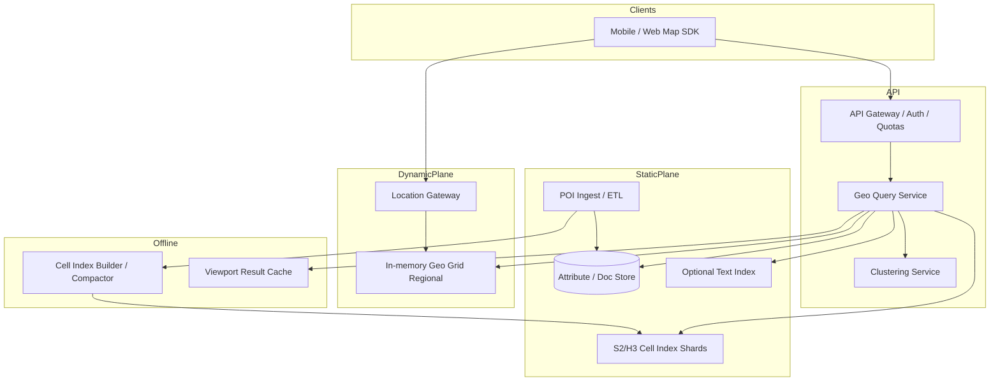

# System Design: Geospatial Search

> **Focus areas:** Geo indexing · geohash/S2/H3 · radius & viewport queries · ranking by distance · real-time location updates · sharding · map UX  
> **Style:** End-to-end product design with progressive scale (10× → 100× → 1,000×)  
> **Quality bar:** Senior/staff; correct geo primitives; explicit accuracy/perf trade-offs; moving objects vs POIs

---

## Table of Contents

1. [Clarify Requirements (Interview Q&A)](#1-clarify-requirements-interview-qa)
2. [Back-of-the-Envelope Estimation](#2-back-of-the-envelope-estimation)
3. [High-Level Design](#3-high-level-design)
4. [Architecture Diagram](#4-architecture-diagram)
5. [Design Deep Dive](#5-design-deep-dive)
6. [Wrap-Up](#6-wrap-up)
7. [Deeper / Related Interview Questions](#7-deeper--related-interview-questions)

---

## 1. Clarify Requirements (Interview Q&A)

Goal: design a **geospatial search** system—find points of interest (or moving entities) near a location / inside a viewport / within a radius—with filters, distance ranking, and low latency at map scale.

### 1.0 What this is / is not

| Dimension | This doc | Not this |
|-----------|----------|----------|
| Job | Geo search: near me, viewport, radius, geo+text | Full turn-by-turn routing engine |
| Entities | POIs MVP; optional drivers/couriers | Global web search |
| Map tiles | Consume map SDK; not build tile renderer | Vector tile generation deep dive |
| Success | Correct neighbors, latency, freshness | Perfect geodesic library research |
| Cousins | Related to food delivery / Uber supply | Full matching/dispatch (mention hooks) |

### 1.1 Functional Requirements

| # | Question to ask | Expected / typical interviewer answer | Design implication |
|---|-----------------|----------------------------------------|--------------------|
| F1 | What entities? | Restaurants/POIs MVP; moving drivers Phase 2 | Static vs dynamic index split |
| F2 | Query types? | Radius (“near me”), viewport (map pan), optional polygon | Geo index + cell covering |
| F3 | Text + geo? | “sushi near me” | Geo candidate → text filter or dual retrieve |
| F4 | Ranking? | Distance + relevance + business score | Hybrid ranker |
| F5 | Filters? | Open now, category, price, rating | Doc-values / side attributes |
| F6 | How fresh are locations? | POIs hours–days; drivers seconds | Separate update paths |
| F7 | Accuracy? | City-level to street-level; GPS noise | S2/H3 level selection |
| F8 | Distance metric? | Great-circle / haversine; driving distance later | Score by aerial first |
| F9 | Results count? | Top 20–50 for list; denser for map pins with clustering | Cap + cluster |
| F10 | Multi-city / global? | Global corpus | Geo-sharded cells |
| F11 | Write APIs? | Upsert POI; optional location stream for movers | Ingest pipeline |
| F12 | Geocoding / reverse? | Dependency; not MVP core | Call geocoder service |
| F13 | Timezone / hours? | Filter open-now | Precompute or evaluate hours |
| F14 | Privacy for movers? | Coarse for display; precise for match | Precision policies |
| F15 | Abuse? | Scraping all POIs via grid | Rate limits; tile budgets |

**MVP functional scope:**

1. Upsert/delete POIs with lat/lon + attributes + optional text.
2. Query: radius around point; viewport bounding box; limit K.
3. Optional text match constrained by geo.
4. Rank by distance × business score; return distance meters.
5. Filters: category, rating, open-now.
6. Map pin clustering for dense viewports (server or client).
7. Geo-sharded serving; multi-AZ.

**Out of MVP:**

- Full road-network ETA as primary sort (hook to routing)
- Complex polygonal geofence editor product
- 3D / indoor maps
- Global satellite imagery
- Perfect offline mobile geo DB

### 1.2 Non-Functional Requirements

| # | Question | Expected answer | Target |
|---|----------|-----------------|--------|
| N1 | Query latency | Map interactive | p50 < 50ms, p99 < 150–200ms |
| N2 | Moving entity update lag | If in scope | Location apply < 1–2s p99 |
| N3 | Availability | High for consumer apps | 99.9%+ |
| N4 | Durability | POIs durable; driver pings ephemeral OK | POI DB + index; movers in memory/Redis |
| N5 | Consistency | POI strong-ish; movers eventual | Accept brief stale pins |
| N6 | Multi-region | Serve locally; POI replicate | Regional indexes; movers regional |
| N7 | Security | No raw stalking APIs | Authz; precision reduction; rate limits |
| N8 | Cost | Dense cities dominate QPS | Cell caching; viewport debouncing |

### 1.3 Cases

**Happy paths**

1. User opens map → viewport query → pins + list ranked.  
2. “Coffee near me” → geo radius + text/category → ranked results.  
3. Pan/zoom → new viewport query (debounced).  
4. POI update (new hours) → searchable quickly.  
5. Driver ping stream → nearby drivers query for dispatch (Phase 2).

**Edge / failure cases**

| Case | Behavior |
|------|----------|
| Antimeridian / date line bbox | Split query into 2 bboxes |
| Poles distortion | Prefer S2/H3 over naive geohash at poles |
| Huge viewport (whole country) | Cap cells; sample; force zoom / cluster-only mode |
| Radius across dense NYC | Early terminate; candidate caps; grid fanout limits |
| Invalid coordinates | Reject |
| Duplicate POIs | Place-id dedup; cluster |
| GPS jitter movers | Snap/smooth; hysteresis |
| Hot downtown tile scrape | Rate limit; signed tile tokens |
| Index cell imbalance (oceans empty, cities full) | Adaptive resolution / dynamic split |

### 1.4 Scales (Progressive)

| Metric | Baseline | 10× | 100× | 1,000× |
|--------|----------|-----|------|--------|
| Static POIs | 50M | 500M | 5B | 50B |
| Categories | 1K | 1K | 5K | 10K |
| Query QPS peak | 5K | 50K | 500K | 5M |
| % viewport vs radius | 70/30 | 70/30 | 60/40 | 60/40 |
| Moving entities (optional) | 100K | 1M | 10M | 100M |
| Location updates / s | 10K | 100K | 1M | 10M |
| Cities hot-set | 50 | 200 | 1K | global |
| Index size | ~200 GB | ~2 TB | ~20 TB | ~200 TB |
| Regions | 1–2 | 3–5 | 10+ | edge+regional |

**What each jump forces:**

- **10×:** Cell-based geo index (S2/H3); shard by geo; attribute store split; cache hot tiles.
- **100×:** Adaptive cell levels; moving-entity in-memory grid; CQRS for pings; map clustering service.
- **1,000×:** Regional cells; hierarchical indexes; learned retrieval; strict scrape protection; separate static/dynamic planes completely.

### 1.5 Etc.

- **Earth model:** WGS84; distances via haversine or equal-area approximations at cell coarse stage.
- **Map SDK:** Google/Mapbox client; backend returns GeoJSON-ish features.
- **Units:** meters internally; display localized.

**Scope repeat-back:**

> Design geospatial search for POIs (and optionally movers): radius and viewport queries with filters and distance-aware ranking, backed by S2/H3 cell indexes and geo sharding—from tens of millions of POIs / 5K QPS to 1000×—routing/ETA as a dependency, not the core.

---

## 2. Back-of-the-Envelope Estimation

### 2.1 Query QPS

```text
Baseline peak 5K QPS geo search
Viewport-heavy: each pan may fire debounced request
Mobile users: location permission → radius queries
```

### 2.2 Candidate explosion in dense areas

```text
NYC restaurants ~50K+ in wide radius
Naive "all points in 5km" can be huge
Must: cell enumerate → post-filter by exact distance → top-K heap
Cap candidates (e.g. 1–5K) before heavy rank
```

### 2.3 Storage

```text
POI record: id, lat,lon, geocell ids, name, cats, scores, hours ≈ 500 B–2 KB
50M × 1 KB = 50 GB raw (+ indexes 2–5×)
Geo posting lists: cell → POI ids
```

### 2.4 Cell covering math (intuition)

```text
Radius r at equator; cover with S2 cells at level L
Number of cells grows with area and border effects
Typical: tens–hundreds of cells per query at good level—not millions
```

Pick level so average POIs/cell in cities is manageable (hundreds–thousands), not millions.

### 2.5 Moving entities

```text
1M drivers × update every 5s = 200K updates/s
Cannot write each ping to durable POI index
→ in-memory grid / Redis geo / specialized location store
```

### 2.6 Bandwidth

```text
Result 50 POIs × 300 B ≈ 15 KB
5K QPS × 15 KB ≈ 75 MB/s
Clustering reduces pin payloads for dense zooms
```

### 2.7 Cache

Hot downtown viewports repeat constantly (tourists). Cache key: `geohash(viewport, zoom, filters_hash)`.

---

## 3. High-Level Design

### 3.1 Geo primitives (say clearly)

| Primitive | Use |
|-----------|-----|
| **Geohash** | Simple string prefix; good teaching; polar distortion |
| **S2** (Google) | Sphere cells (Hilbert); excellent covering |
| **H3** (Uber) | Hex grid; good neighbors; popular in mobility |

**Interview choice:** **S2 or H3** for production-quality answer; mention geohash as simpler cousin.

**Key operations:**

1. `latlon → cell_id` at level L  
2. `radius/viewport → covering cell_ids[]`  
3. Union postings of those cells  
4. Exact distance filter + rank  

### 3.2 Index structure

```text
GeoIndex:
  cell_id → posting list of entity_ids (static POIs)
AttributeStore:
  entity_id → {lat, lon, name, cats, rating, hours, text features...}
TextIndex (optional):
  terms → entity_ids (or dual search then intersect)
```

**Static POIs:** Lucene geo_point / BKD tree is also a valid answer (ES `geo_distance`). Staff-level: explain cell covering OR BKD range—both OK if trade-offs clear.

| Approach | Pros | Cons |
|----------|------|------|
| **Cell inverted index** | Easy sharding by cell; mover-friendly | Covering tuning |
| **BKD / R-tree** | Strong range queries | Harder custom shard story |
| **Redis GEORADIUS** | Fast MVP | Scale/memory limits; fewer attributes |

**Choice:** Cell index (H3/S2) + attribute KV/doc store; Redis GEO for movers MVP.

### 3.3 APIs

```http
POST /v1/geo/search
{
  "mode": "radius",
  "center": {"lat": 37.77, "lng": -122.42},
  "radius_m": 2000,
  "filters": {"category": ["coffee"], "open_now": true},
  "text": "latte",
  "limit": 20,
  "rank": "distance_score"
}
```

```http
POST /v1/geo/search
{
  "mode": "viewport",
  "bbox": {"north":..,"south":..,"east":..,"west":..},
  "zoom": 14,
  "cluster": true,
  "limit": 100
}
```

```http
PUT /v1/pois/{id}
DELETE /v1/pois/{id}
POST /v1/entities/{id}/location   # movers: ephemeral
```

Response includes `distance_m`, `geometry`, attributes, optional `cluster_count`.

### 3.4 Query planning

**Radius:**

1. Validate + clamp radius (max e.g. 50 km).  
2. Compute cell covering at level(s).  
3. Fetch postings (parallel per cell shard).  
4. Load attributes; haversine filter `d ≤ r`.  
5. Apply attribute filters; optional text.  
6. Rank top-K; return.

**Viewport:**

1. Normalize bbox; split if crosses antimeridian.  
2. Cover bbox with cells at zoom-derived level.  
3. Same retrieve path; if `cluster` and zoom low → cluster algorithm (grid/hex aggregation).

**Text + geo strategies:**

| Strategy | When |
|----------|------|
| Geo-first then text filter | Dense geo, selective text |
| Text-first then geo filter | Rare text (“specialty”) |
| Parallel retrieve + intersect | Medium |

### 3.5 Ranking

```text
score = business_quality × decay(distance) × text_match × open_boost
```

- Distance decay: linear, gaussian, or piecewise  
- Don't return only nearest if quality terrible—blend  
- Optional promotion slot (ads) clearly separated  

### 3.6 Clustering for maps

At low zoom, thousands of POIs → **cluster**:

- Server: aggregate counts per H3 cell at coarse level  
- Client: Supercluster-style  
MVP: server coarse cell counts + sample representative pin  

### 3.7 Moving entities plane (Phase 2)

```text
Device → Location Gateway → validate → in-memory geo grid (regional)
                                      → optional Kafka for analytics
Near-me drivers query → grid cells → exact distance → top-K
```

TTL soft-state; no durable write per ping. Privacy: reduce precision for non-authorized callers.

### 3.8 Sharding

```text
shard = hash(cell_parent_at_level_S)  or region_id + cell
```

Co-locate nearby cells on same shard to reduce fanout. Mega-cities: split to finer parent levels (dynamic).

### 3.9 Option analysis

#### A. Geo library

| Option | Pros | Cons |
|--------|------|------|
| H3 | Hex neighbors, UX nice | Dependency |
| S2 | Battle-tested coverings | Learning curve |
| Geohash | Simple | Distortion, rect cells |

#### B. Storage engine

| Option | Pros | Cons | Deal-breaker |
|--------|------|------|--------------|
| ES/OpenSearch geo | Fast feature set | Ops; multi-tenant | Fine many cases |
| Custom cell + KV | Control sharding | Build cost | At extreme mover QPS |
| PostGIS | Rich GIS | Harder ultra QPS | Analytics / complex polygons |

#### C. Distance

Aerial first; **driving distance** async or second-phase for shortlist via routing matrix (expensive)—never N×N routing for all candidates.

**Deal-breakers:**

- Ignoring antimeridian/poles  
- Unbounded radius scans in NYC  
- Writing driver pings into Lucene every second  
- Ranking solely by distance with no quality  

---

## 4. Architecture Diagram



---

## 5. Design Deep Dive

### 5.1 Reliability

**Data loss prevention**

- POI upserts durable in source DB + async index; version vectors  
- Index rebuild from source of truth possible  
- Movers: best-effort; last-known with TTL  

**Idempotency**

- POI upsert by `poi_id` + `version`  
- Location updates: latest timestamp wins  

**Retries / backpressure**

- Query candidate caps; degrade clustering-only on overload  
- Location gateway drops/schemes samples under flood (keep latest)  

**Rate limits**

- Per-user / tile / grid scrape detection (uniform cell scans)  
- Max radius / max bbox area  

**Failure modes**

| Failure | Behavior |
|---------|----------|
| Shard timeout | Hedged request; partial results flagged if allowed |
| Attr store miss | Skip entity or repair queue |
| Bad covering bug | Over-fetch safe (recall) vs under-fetch (wrong)—prefer safe over-fetch + exact filter |
| Cache serving stale closed restaurant | Short TTL on open-now keyed results; include `hours_version` |

### 5.2 Scalability

**Fanout control:** parent cell sharding so a city query hits few shards, not all.

**Adaptive resolution:**

```text
If cell posting > threshold → split to children
If sparse → coalesce
```

**Static vs dynamic:** never same storage path at 100× movers.

**Caching:**

- Viewport tiles with filter hash  
- Popular “near landmark” radius queries  

**Scale jumps**

| Jump | Change |
|------|--------|
| 10× | S2/H3 + geo shards + attr store |
| 100× | Adaptive cells; mover grid; clustering; CQRS pings |
| 1,000× | Regional isolation; hierarchical retrieve; routing second-phase; anti-scrape |

**Hot spots:** Manhattan, Tokyo — dedicated shards / higher replica count / more cache.

**Parallelization:** cell fetches parallel; distance compute vectorized; batch attr multi-get.

### 5.3 Maintainability

**Ops**

- Metrics: cells touched/query, candidates, p99, covering size, mover update QPS  
- Geo correctness tests (antimeridian fixtures)  
- Canary index levels  

**Observability**

- Break down time: cover, fetch, distance, rank  
- Map of hot query cells  

**Migrations**

- Re-encode cell levels via dual-write  
- POI schema evolution with protobuf/JSON backward compat  

**Multi-tenant**

- If SaaS geo (multiple apps): namespace indexes; isolate movers by app_id  
- Quotas on area/QPS  

**Privacy / security**

- Precise location only to authorized roles  
- Audit access to individual entity location streams  
- GDPR delete POI / user location history  

---

## 6. Wrap-Up

### Decision summary

| Area | Decision |
|------|----------|
| Index | S2/H3 cell postings + attribute store |
| Queries | Covering → union → exact distance → top-K |
| Text+geo | Adaptive geo-first or text-first |
| Movers | Separate in-memory grid, TTL soft state |
| Rank | Distance decay × quality × text |
| Scale | Geo shards, adaptive cells, regional planes |
| UX | Clustering at low zoom; debounced viewports |

### Phased rollout

1. **MVP:** POI radius/viewport via H3/S2; filters; distance rank.  
2. **Product:** text+geo, open-now, clustering, cache.  
3. **Scale:** geo sharding, adaptive levels, anti-scrape.  
4. **Movers:** location gateway + memory grid.  
5. **1000×:** regional cells, routing second-phase ETA, hierarchical indexes.

### Closing line

> Geospatial search is covering + post-filter: encode the earth into cells, shard by geography, retrieve candidates, then apply exact distance and business ranking—keeping movers on a soft-state plane so update firehose never melts the POI index as scale jumps 10×→1000×.

---

## 7. Deeper / Related Interview Questions

**Q1. Why not SQL `WHERE distance(lat,lon) < r` on a heap table?**  
**A:** Full scan; no selective index. Need geo index (cells/R-tree/BKD).

**Q2. How does geohash prefix proximity work?**  
**A:** Nearby points often share prefixes, but edge neighbors can differ radically—must search adjacent hashes. S2/H3 handle neighbors more cleanly.

**Q3. What is a cell covering?**  
**A:** Set of cells whose union contains the query shape (disk/bbox/polygon). Trade max cells vs approximation error; exact distance filter removes false positives.

**Q4. False positives vs false negatives in covering?**  
**A:** Over-cover → FPs removed by exact check (OK). Under-cover → missed results (bad). Always err toward recall in covering.

**Q5. Haversine vs Vincenty vs ECEF?**  
**A:** Haversine fine for app distances; Vincenty more accurate ellipsoidal; for ranking relative order, approximation usually enough.

**Q6. How to handle bbox crossing the antimeridian?**  
**A:** Split into two bboxes (e.g. lng 170→180 and -180→-170); merge results.

**Q7. Why hex (H3) over squares?**  
**A:** Uniform neighbors (6); nicer aggregation for heatmaps; slightly trickier mental model than geohash strings.

**Q8. How to pick H3 resolution?**  
**A:** Target avg entities/cell; city density drives; use multi-resolution or adaptive split.

**Q9. Redis GEO internally?**  
**A:** Geohash-encoded scores in sorted sets; GEORADIUS convenient MVP; limits on rich attributes/secondary filters.

**Q10. How do you cluster pins?**  
**A:** Coarse cell counts; or greedy distance clustering; or client libraries. Server clustering reduces payload.

**Q11. Distance tie-breakers?**  
**A:** Rating, popularity, stable id—deterministic ordering for pagination.

**Q12. Pagination of “near me”?**  
**A:** Tricky as user moves; use `search_after` with (distance, id) snapshot of center; or cursor with pinned center.

**Q13. How to prevent scrapers downloading the DB?**  
**A:** Auth, rate limits, area quotas, anomaly on systematic grid; legal ToS; don't return huge limits.

**Q14. Combining inverted text index with geo?**  
**A:** Intersect postings or filter bitsets; choose smaller side first; caching category filters helps.

**Q15. Moving object index classic approaches?**  
**A:** Grid files, time-parameterized R-trees; practically: update cell membership on ping; expire old cell.

**Q16. Consistency when POI moves address?**  
**A:** Update lat/lon → remove from old cells, add to new; versioned attribute read.

**Q17. Geo sharding rebalance?**  
**A:** Split hot parent cells; migrate postings; use consistent hash of parent cell id; dual-read during move.

**Q18. Open-now filter correctness across TZ?**  
**A:** Store hours with timezone of POI; evaluate at query time in that TZ; DST tables matter.

**Q19. Why not rank by driving ETA always?**  
**A:** Matrix routing cost O(candidates); use aerial shortlist then ETA re-rank top 20.

**Q20. Memory estimate for 1M movers on grid?**  
**A:** id + lat/lon + cell + meta ≈ 64–128 B → 64–128 MB plus index overhead; replicate per region.

**Q21. p99 spikes on viewport?**  
**A:** Huge covering at low zoom; mitigate with cluster-only mode below zoom Z; max cells guard.

**Q22. Security of “find nearby users”?**  
**A:** Extremely sensitive; opt-in, coarse precision, rate limits, block triangulation patterns—often product-disallowed.

**Q23. Multi-region active-active POIs?**  
**A:** Hard for writes; typically regional read replicas; writes to home region; movers strictly regional.

**Q24. BKD trees in Lucene geo_point?**  
**A:** Hierarchical index on points; efficient range; great when using ES; still shard by geo for ops locality.

**Q25. Capstone: accuracy vs latency vs freshness for movers?**  
**A:** Coarse cells for retrieve (latency), exact haversine (accuracy), TTL soft-state grid (freshness); degrade by sampling movers under load while keeping POI plane stable. State the three knobs explicitly.

---

*End of geospatial search system design.*
