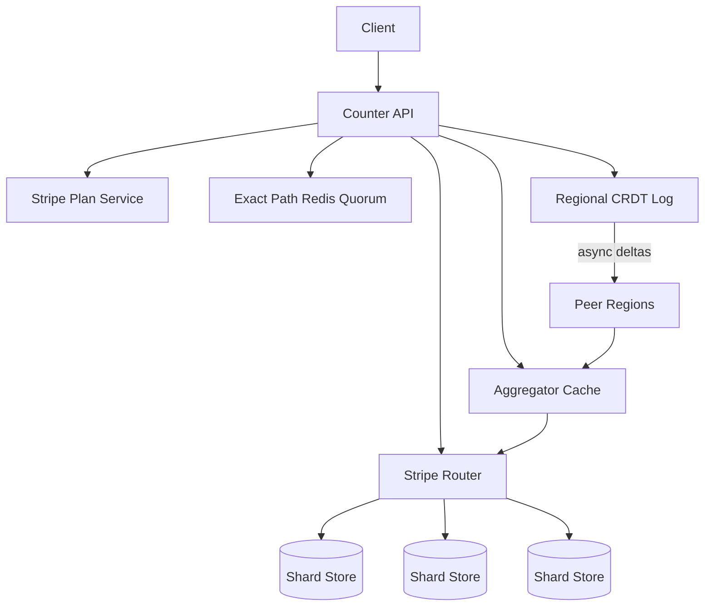
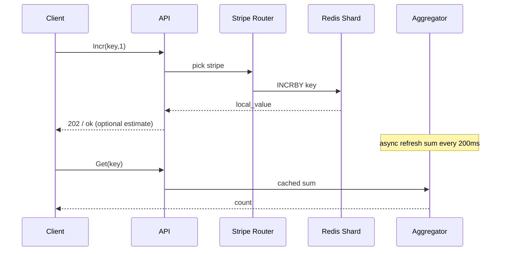

# System Design: Global Distributed Counter

> **Focus areas:** Increment/read semantics · Sharding · Approximation vs exact · Conflict-free aggregation · Hot keys · Multi-region · Use-case fit  
> **Style:** Core primitive design with progressive scale (10× → 100× → 1,000×)  
> **Product analogy:** Like/view counters, inventory-ish tallies, rate usage meters (not a full metrics TSDB)

---

## Table of Contents

1. [Clarify Requirements (Interview Q&A)](#1-clarify-requirements-interview-qa)
2. [Back-of-the-Envelope Estimation](#2-back-of-the-envelope-estimation)
3. [High-Level Design](#3-high-level-design)
4. [Architecture Diagram](#4-architecture-diagram)
5. [Design Deep Dive](#5-design-deep-dive)
6. [Wrap-Up](#6-wrap-up)
7. [Deeper / Related Interview Questions](#7-deeper--related-interview-questions)

---

## 1. Clarify Requirements (Interview Q&A)

### 1.0 What this is / is not

| This is | This is not |
|---------|-------------|
| A **distributed counter service**: `INCR`, `GET`, optional `INCRBY`, reset, TTL | A general metrics platform (Prom/Mimir) or analytics warehouse |
| APIs optimized for huge write fan-in on popular keys | Strict inventory reservation with monetary correctness (use reservation ledger) |
| Configurable consistency: eventual approximate vs strongly consistent | Exactly-once billing ledger (different primitive) |
| Global aggregation across regions | Single-region Redis `INCR` alone at ultimate scale |

### 1.1 Functional Requirements

| # | Question | Expected answer | Design implication |
|---|----------|-----------------|--------------------|
| F1 | Exact or approximate? | **Depends on use case**—likes can be ±1%; money cannot | Offer tiers: Exact, Bounded-error, Eventually-exact |
| F2 | Operations? | `Incr`, `IncrBy`, `Get`, `GetMany`, optional `Set`/`Reset` | Idempotent incr needs client tokens for exactly-once |
| F3 | Counter cardinality? | Billions of keys; heavy skew (viral posts) | Shard hot keys; cold keys cheap |
| F4 | Read freshness? | Feed UI: seconds OK; quota: stronger | Separate read paths |
| F5 | Decrement / go negative? | Likes: no; inventory: clamp; usage: allow | Policy per counter namespace |
| F6 | TTL / expiry? | Some counters expire (stories 24h) | Native TTL on shards |
| F7 | Multi-region? | Global apps yes | CRDT / async aggregate / regional leaders |
| F8 | Idempotency? | Clients retry | Optional `dedupe_id` window |
| F9 | Batch incr? | Analytics ingest yes | Batch API + kafka ingest |
| F10 | Query historical series? | Out of MVP | Emit CDC to metrics/warehouse |
| F11 | ACLs? | Per-namespace auth | Namespace = tenant isolation unit |
| F12 | Strong “read your writes”? | After user’s own like, show +1 | Local delta overlay in app or session sticky |
| F13 | Max throughput per key? | Viral: 100K–1M incr/s | Striping mandatory |
| F14 | Return value on incr? | Sometimes need new value | Costly if global; return local shard estimate or async |

**MVP scope:**

1. Namespaces with consistency class.
2. `IncrBy(key, n)` and `Get(key)` for eventual and striped-exact modes.
3. Hot-key striping automatic above threshold.
4. Multi-AZ durability for exact mode.
5. Basic authn between services; metrics on QPS/error/lag.

**Out of MVP:**

- Full time-series retention/query
- Transactional multi-key increments
- Strict serializable global counter without sharding (impossible at viral QPS—say so)

### 1.2 Non-Functional Requirements

| # | Question | Target |
|---|----------|--------|
| N1 | Incr latency | p99 < 5–20ms regional |
| N2 | Get latency | p99 < 5–50ms depending on consistency |
| N3 | Durability (exact tier) | No loss of committed incr (quorum / WAL) |
| N4 | Availability | 99.99% incr accept (AP for approximate tier) |
| N5 | Error bound (approx) | Configurable e.g. ±1% or ±X absolute |
| N6 | Cost | Memory-efficient striping; cold keys on cheaper store |

### 1.3 Cases

**Happy paths**

1. Like button → `Incr(post:123)` → feed shows count (eventual).
2. Quota service → `IncrBy(tenant:api, 1)` strong regional → enforce limit.
3. Viral post → automatic stripe across 1024 shards → aggregator sums.
4. Cross-region views → regional counters + periodic global sum.

**Edge / failure**

| Case | Behavior |
|------|----------|
| Hot key without striping | Single shard melts — auto-stripe |
| Double retry incr | Overcount unless dedupe_id |
| Partial shard failure | Exact tier quorum; approx may under/over until repair |
| Get during re-stripe | Versioned stripe map; dual-read during migration |
| Negative likes | Clamp at 0 if policy |
| Namespace abuse | Quotas on key create / QPS |
| Clock skew for TTL | Use relative TTL at storage layer |

### 1.4 Scales

| Metric | Baseline | 10× | 100× | 1,000× |
|--------|----------|-----|------|--------|
| Counter keys | 100M | 1B | 10B | 100B |
| Incr/s global peak | 100K | 1M | 10M | 100M |
| Hot key peak incr/s | 10K | 100K | 1M | 10M |
| Get QPS peak | 200K | 2M | 20M | 200M |
| Regions | 2 | 3 | 5 | 10 |
| Shards/hot key | 16 | 64 | 256 | 1024–4096 |

**What jumps force:**

- **10×:** Redis Cluster / shard map; striping for top-N.
- **100×:** Kafka buffer for approx; regional aggregators; CDN-ish count caches.
- **1,000×:** Hierarchical aggregation; CRDTs; approximate sketches for some namespaces; cell isolation.

### 1.5 Etc.

**Scope statement:**

> Design a **global distributed counter** primitive with namespaces that choose exact vs approximate semantics, automatic hot-key striping, and progressive scale from 100K to 100M incr/s—without claiming one mechanism fits money and likes alike.

---

## 2. Back-of-the-Envelope Estimation

### 2.1 Throughput

```text
Baseline 100K incr/s
If each incr is 50 bytes network → 5 MB/s (trivial)
At 100M incr/s → 5 GB/s → major fan-in architecture

Hot key 1M incr/s alone:
  single Redis core ~100K–500K simple INCR/s → need ≥4–20 stripes minimum; use 256–1024 for headroom
```

### 2.2 Storage

```text
100M keys × 32 B value+meta ≈ 3.2 GB raw
+ stripe keys: hot 0.01% keys × 256 stripes ≈ huge only for hot set
1,000×: 100B keys → need sparse storage / SSD / Dynamo; not all in RAM
```

### 2.3 Aggregation cost

```text
Get exact striped: read N stripes + sum
N=256 → 256 GETs → bad for sync path
Mitigations: cached aggregate refreshed every 100ms–1s; client displays approximate
```

### 2.4 Bandwidth multi-region

```text
Replicate 10% of incrs cross-region for global sum:
100K × 10% × 50 B = 0.5 MB/s baseline
100M × 10% → 500 MB/s — batch & compress deltas
```

---

## 3. High-Level Design

### 3.1 Consistency tiers (product truth)

| Tier | Mechanism | Use cases | Deal-breaker if misused |
|------|-----------|-----------|-------------------------|
| **Exact regional** | Quorum INCR on single shard / Raft | Quotas, rate buckets | Viral global likes |
| **Striped exact** | Many shards + sum; durable each | High QPS exact-ish | Super-low latency Get |
| **Eventual CRDT (PN-Counter / G-Counter)** | Merge increments | Global likes/views | Must not go wrong way without PN |
| **Approximate** | Local buffers + flush; Count-Min for some | Huge cardinality analytics | Billing |

### 3.2 APIs

```http
POST /v1/namespaces/{ns}/counters/{key}/incr
{"delta": 1, "dedupe_id": "..." }

GET /v1/namespaces/{ns}/counters/{key}?consistency=eventual|strong

POST /v1/namespaces/{ns}/counters:batchIncr
```

**Namespace config:**

```json
{
  "consistency": "crdt_g",
  "stripe_threshold_qps": 5000,
  "max_stripes": 1024,
  "ttl_seconds": null,
  "allow_decrement": false
}
```

### 3.3 Hot-key striping

```text
Logical key K
Stripe count S = next_pow2(clamp(estimated_qps / per_shard_budget))
Physical keys: hash(K, i) for i in 0..S-1  OR  K#i

Incr: pick stripe by hash(client_id|random|request_id) % S  → even write
Get: sum all stripes OR read aggregator cache

Stripe map stored: StripePlan{version, S, created_at}
Re-stripe: increase S; dual-write period; then read old+new
```

### 3.4 CRDT approach (multi-region)

**G-Counter** (increment-only): each region/actor has a component; value = sum components; merge = max per actor (or sum if increments are shipped as deltas carefully).

Practical implementation:

1. Each region accepts incrs into local durable counter shards.
2. Replicate **deltas** asynchronously to peer regions.
3. Global read = sum(local + remote replicas’ last values) with version vectors.
4. Idempotent delta apply via sequence per actor.

**PN-Counter** if decrements allowed: parallel G-Counters for P and N.

### 3.5 Approximate pipeline

```text
Client → Ingest API → per-node memory delta map → flush every 100ms to Redis/Kafka
Get → last flushed aggregate (+ optional local unfushed if sticky)
```

Error bound ≈ flush interval × rate; document it.

### 3.6 Idempotent increments

Store `dedupe_id` → applied boolean in Bloom + Redis SET with TTL (e.g. 24h).  
At extreme QPS, bloom false positives → check Redis; false negatives impossible if careful—actually Bloom can false positive “already seen” → undercount risk → use striped exact dedupe stores or accept undercount for likes.

For likes: usually **allow** rare double-count on retry rather than undercount—product choice.

### 3.7 Data stores

| Store | Role |
|-------|------|
| Redis Cluster | Hot counters / stripes |
| DynamoDB / Cassandra | Massive cold key cardinality |
| Kafka | Delta log for replay & analytics |
| Local memory | Ingest buffers |

### 3.8 Trade-offs

| Option | Pros | Cons | Deal-breaker |
|--------|------|------|--------------|
| Single Redis key | Simple | Hot key death | Viral traffic |
| Stripe + cached sum | Scales writes | Stale reads | OK for social |
| DB row `UPDATE` | Durable | Contended row locks | High QPS |
| Kafka as SoT | Huge ingest | Read complex | Not for sync Get |
| HyperLogLog | Tiny memory | Set cardinality not sum of deltas | Wrong tool for like counts |

**Choice:** Namespace-driven: Redis stripes + aggregator cache default; CRDT deltas multi-region; strong single-shard only for low-QPS exact keys.

---

## 4. Architecture Diagram





---

## 5. Design Deep Dive

### 5.1 Reliability

- Exact tier: majority ack before success.
- Approx tier: accept on local buffer; fsync flush; rebuild from Kafka if Redis loss.
- Dedupe store failure: fail open (overcount) vs fail closed (reject)—document.
- Re-stripe is two-phase; never lose increments (write both or forward).

### 5.2 Scalability

- Automatic stripe expansion based on QPS monitors.
- Hierarchical aggregation: rack → region → global for 1,000×.
- Read cache at CDN/edge for public counts with 1s TTL.
- Cold keys: on-demand create in Dynamo; don’t preallocate stripes.

### 5.3 Maintainability

- Namespace templates; dashboards per tier.
- Chaos: kill shard, verify undercount bounds.
- Migration tools for stripe plan versions.
- Multi-tenant: noisy neighbor limits per namespace QPS.

---

## 6. Wrap-Up

| Decision | Choice |
|----------|--------|
| Semantics | Tiered by namespace |
| Hot keys | Automatic striping |
| Multi-region | CRDT / delta replication |
| Reads | Aggregator cache |
| Exact low-QPS | Single shard quorum |

**Phases:** (1) Redis incr + stripe (2) aggregator cache + dedupe (3) multi-region CRDT (4) hierarchical + cold tier.

---

## 7. Deeper / Related Interview Questions

**Q1. Why can’t one Redis `INCR` serve a Super Bowl ad counter?**  
A: Single key CPU/network limits (~1e5–1e6 ops/s order). Stripe or buffer.

**Q2. Is eventual +1 on UI a lie?**  
A: Optimistic UI can show local +1 while global is behind—combine for read-your-writes.

**Q3. G-Counter vs shipping raw +1 events?**  
A: G-Counter merges safely; raw events need exactly-once apply. Both work; ops differ.

**Q4. When is HyperLogLog wrong?**  
A: When you need the sum of increments (likes), not unique cardinality.

**Q5. Can you decrement a G-Counter?**  
A: No—use PN-Counter or disallow.

**Q6. How does stripe rebalancing avoid double count?**  
A: Versioned plans; during expansion, writes go to new stripes only after old drained *or* dual-read sums old+new without dual-write of same incr.

**Q7. Strong consistency global counter at 1M QPS?**  
A: Essentially unavailable under partition (CAP). Don’t offer; offer regional strong.

**Q8. Inventory with counters?**  
A: Dangerous. Prefer reservation leases + durable ledger. Counter approx OK for “items viewed”.

**Q9. Return value of INCR global?**  
A: Expensive. Return `accepted` + optionally local shard value; clients refresh Get.

**Q10. Kafka exactly-once incr?**  
A: Idempotent producers + transactional apply or dedupe keys; still at-least-once into Kafka.

**Q11. Memory overhead of 1024 stripes × 10M hot keys?**  
A: Don’t stripe all keys—only hot. Cold remain 1 key.

**Q12. Detect hot keys?**  
A: Proxy QPS histograms; top-K; adaptive on throttle events.

**Q13. Multi-get 10K keys?**  
A: Pipeline; hedge; cache; avoid fan-out storms.

**Q14. Deal-breaker: using floating point for money counts?**  
A: Yes—use integer smallest currency unit in a ledger, not this service.

**Q15. CRDT tombstones / reset?**  
A: Reset is hard; use generation number: `key@gen`; increment gen clears logical value.

**Q16. Read repair?**  
A: On Get, fetch stripe subset and update aggregator; anti-entropy jobs.

**Q17. Client-side buffering?**  
A: Mobile can batch; risk loss on crash—OK for views, not quotas.

**Q18. Consistency class negotiation?**  
A: `Get(consistency=strong)` may be rejected for approx namespaces—fail loud.

**Q19. Time-windowed counters?**  
A: Key includes bucket `view:post:2026-08-06T12:00`; TTL expire buckets.

**Q20. Compare-and-swap thresholds?**  
A: “Incr only if < limit” needs atomic on single shard; for striped, use centralized limiter or accept race.

**Q21. Why aggregator cache TTL 200ms?**  
A: Balance load vs freshness; viral pages rarely need ms-accurate totals.

**Q22. Cross-namespace transactions?**  
A: Out of scope—use workflow/ledger.

**Q23. Observability for undercount?**  
A: Compare Kafka ingested deltas vs Redis sum; alert on drift.

**Q24. Cold start empty key?**  
A: Missing = 0; don’t invent negative.

**Q25. Security of public incr APIs?**  
A: Auth, rate limit, signed client actions, fraud detection—counters are abuse magnets.

**Q26. Can bloom filters count?**  
A: No—membership only. Use Count-Min Sketch for approximate frequencies.

**Q27. Sticky sessions to region?**  
A: Helps RY W; global Get still merges.

**Q28. Protobuf vs JSON for delta repl?**  
A: Binary batched deltas compress better at 1,000×.

**Q29. What if decrement races below zero?**  
A: Atomic `max(0, decr)` on single shard; for PN, application clamp on read.

**Q30. Staff-level punchline?**  
A: “Pick semantics first—mechanism second. Viral likes and quota enforcement are different products sharing an API shape.”

---

---

### Appendix A — Stripe plan migration (worked example)

```text
t0: key K has S=16 stripes, QPS rising
t1: detector marks hot; create StripePlan v2 with S=64
t2: dual-read Get = sum(v1 stripes) + sum(v2 new-only) carefully

Write strategy (pick one and stick to it):
  A) All new incrs go to v2 stripes only; v1 becomes read-only residual
  B) Dual-write each incr to mapped old+new (dangerous double count — avoid)

Preferred A:
  - Map request to stripe via hash % 64
  - Stop writes to 16-stripe keys
  - Residual drain: optionally copy old stripe values into v2 by
    adding each old value once under a migration actor id (idempotent)
  - Flip Get to sum only v2 after drain completes
  - Delete v1 keys
```

**Deal-breaker during migration:** dual-writing the same logical +1 to old and new without a migration ledger → permanent overcount.

### Appendix B — Consistency tier decision tree

```text
Is wrong count catastrophic (money, unique seats)?
  yes → do NOT use this counter alone; use ledger/reservation
  no  → continue

Is QPS per key < ~5K and single-region OK?
  yes → Exact regional Redis/Quorum INCR
  no  → continue

Are decrements required?
  yes → PN-Counter or clamped single-shard
  no  → G-Counter / increment-only stripes

Is global read lag of 1s OK?
  yes → Aggregator cache + async CRDT merge
  no  → sticky regional strong read + separate global approximate
```

### Appendix C — Hot-key detection signals

| Signal | Threshold idea | Action |
|--------|----------------|--------|
| Per-key QPS EWMA | > 2K | Raise stripe count |
| Redis slowlog / CPU | shard hot | Salt / rebalance |
| Incr p99 latency | > 20ms | Local buffer flush path |
| Queue depth (approx path) | growing | Scale ingest workers |

### Appendix D — Read-your-writes overlay

For social likes after the user clicks:

```text
Client optimistic: local_count = server_get + (user_liked ? 1 : 0)
Server eventual: may lag 200–1000ms
Reconcile when Get returns ≥ expected or like record exists in user→liked set
```

Do **not** implement RY W by forcing global strong Get on every like—that reintroduces hot keys.

### Appendix E — Quota enforcement pattern (exact-ish)

```text
Limit L for tenant T in region R
Store: single shard key quota:{T}:{R} with Redis INCR + Lua:
  if current + delta > L then reject else incr
For multi-region global quota: central region OR
  local reservations + periodic reconciliation (over-admit risk)
```

Interview line: “Global exact quota at million QPS is a different product (hierarchical budgets).”

### Appendix F — Failure injection drills

1. Kill one stripe primary mid-viral event → quorum failover; measure undercount=0 for exact tier.
2. Partition regions for 5 minutes → CRDT divergence then merge; no negatives for G-Counter.
3. Re-stripe under load → overcount must remain 0.
4. Dedupe store outage → policy: overcount vs reject documented.

### Appendix G — Capacity worksheet

```text
Hot key 500K incr/s, per-shard budget 50K incr/s
→ S_min = 10; choose S=32–64 for headroom
Get with S=64 without cache = 64 round trips → mandatory aggregator
Aggregator refresh 250ms at 500K/s → error ≤ 125K counts absolute
Relative error at total 1e9 ≈ 0.0125% — fine for likes
```

---

### Appendix H — Multi-region delta replication sketch

```text
Region US accepts incr → local stripe INCR → append Delta{key, actor=us-1, seq, d}
Replicator ships batches to EU/APAC
Apply: if seq > last_applied[actor]: value += d (idempotent)
Global Get in EU ≈ local stripes + applied remote components
Lag SLI: replication_delay_p99; product UX uses aggregator
```

**Conflict:** two regions never “take max of total”—that loses increments. Use per-actor sequences (CRDT) or commutative sum of deltas.

### Appendix I — API error taxonomy

| Code | Meaning | Client action |
|------|---------|---------------|
| 200/204 | Applied | OK |
| 409 | Dedupe replay | Treat as success if same dedupe_id |
| 429 | Namespace QPS limit | Backoff |
| 503 | Shard unavailable (exact) | Retry other frontends; fail closed for quotas |
| 400 | Decrement not allowed | Fix client |

### Appendix J — Progressive scale narrative

| Scale | Architecture change |
|-------|---------------------|
| Baseline | Redis `INCR` + manual stripe for known hot keys |
| 10× | Automatic striping + aggregator cache |
| 100× | Kafka approx path + regional CRDT deltas |
| 1,000× | Hierarchical aggregation, cold-key Dynamo tier, cell isolation |

---

*End of global distributed counter design.*

