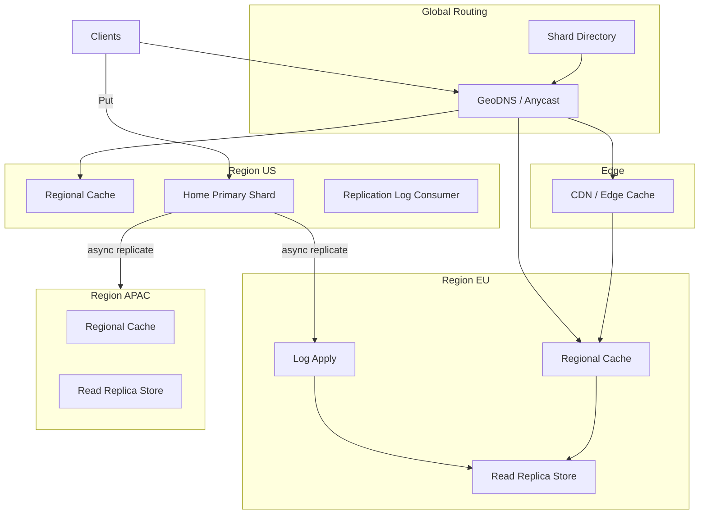
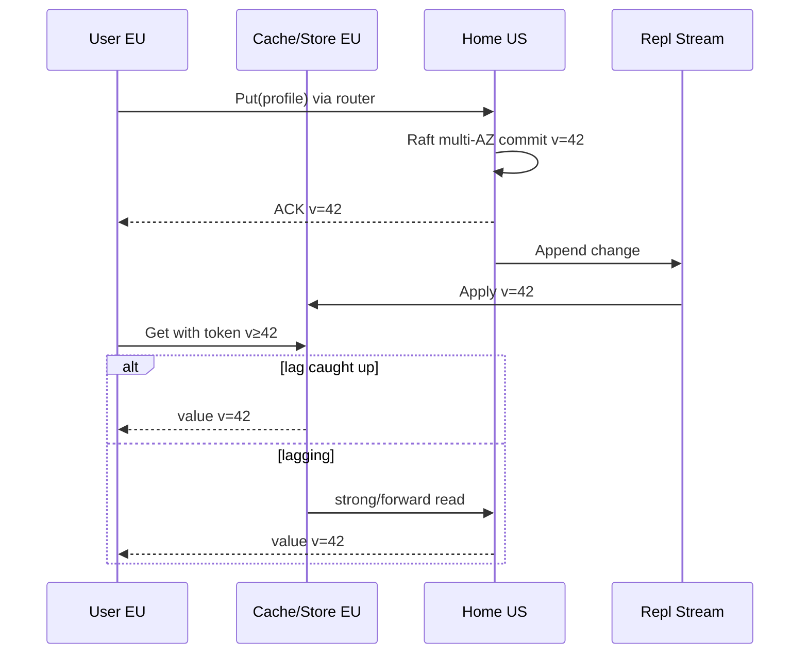

# System Design: Globally Replicated Read-Heavy Store

> **Focus areas:** Multi-region replication · Read locality · Eventual vs bounded staleness · Conflict resolution · CDN-adjacent caching · CAP  
> **Style:** Global metadata / profile / config store with ≫ reads than writes (DynamoDB Global Tables / Cassandra multi-DC / Spanner-lite reads)  
> **API orientation:** `Get` / `Put` / `Delete` / `List` with regional read preferences and staleness budgets

---

## Table of Contents

1. [Clarify Requirements (Interview Q&A)](#1-clarify-requirements-interview-qa)
2. [Back-of-the-Envelope Estimation](#2-back-of-the-envelope-estimation)
3. [High-Level Design](#3-high-level-design)
4. [Architecture Diagram](#4-architecture-diagram)
5. [Design Deep Dive](#5-design-deep-dive)
6. [Wrap-Up](#6-wrap-up)
7. [Deeper / Related Interview Questions](#7-deeper--related-interview-questions)

---

## 1. Clarify Requirements (Interview Q&A)

Bound a **globally distributed store optimized for reads**: users in many regions must see low-latency Gets; writes are fewer, often sticky to a home region, with controlled propagation.

### 1.0 What this is / is not

| This is | This is not |
|---------|-------------|
| Multi-region **replicated** KV / document store for read-heavy workloads | Single-region cache only |
| Locality-aware **read routing** (nearest healthy replica) | Strict global linearizability for every write by default |
| Async or semi-sync replication with explicit **staleness SLOs** | Full distributed SQL with multi-row transactions globally (see DistSQL) |
| Conflict policy for rare concurrent cross-region writes | CRDT collaborative editor (sibling problem) |
| Optional edge/CDN cache for ultra-hot public keys | Blob/object store for multi-GB objects (see S3 doc) |

### 1.1 Functional Requirements

| # | Question to ask | Expected / typical interviewer answer | Design implication |
|---|-----------------|----------------------------------------|--------------------|
| F1 | Read:write ratio? | ~100:1 to 1000:1 | Optimize replica count & caches for Gets |
| F2 | Data types? | User profiles, features flags, product metadata, sessions | Small documents; versioned values |
| F3 | Latency target for Get? | < 50ms p99 in-region; < 100ms near edge | Regional replicas mandatory |
| F4 | How fresh must reads be? | Default eventual ≤ 1–5s; some keys need read-your-write | Session stickiness + version tokens |
| F5 | Write locality? | Usually user’s home region; rare cross-region writes | Single-writer home + async fanout |
| F6 | Conflict model? | Prefer avoid via home affinity; else LWW or merge | Directory of home region per key/tenant |
| F7 | Multi-key atomicity? | Not required globally | Per-key versions enough |
| F8 | Offline regions? | Reads continue from local; writes queue or fail by policy | AP reads; CP optional for writes |
| F9 | Cache tier? | Yes—regional + optional CDN for public keys | Invalidation vs TTL strategy |
| F10 | Admin / config plane? | Schema-ish JSON docs; ACLs per tenant | AuthZ on every op |
| F11 | Change notifications? | Nice-to-have: watch / pubsub of key updates | CDC log → regional bus |
| F12 | Compliance residency? | Some tenants pinned to region | Placement constraints in directory |
| F13 | API? | REST/gRPC KV with `Consistency` header | `eventual`, `bounded`, `strong` |
| F14 | Delete / GDPR? | Yes—global tombstone propagation | Track delete completion across regions |

**MVP functional scope:**

1. Keys/documents partitioned by tenant or key hash into shards.
2. Each shard has a **home region** (primary writer) + async replicas in N regions.
3. `Get` served from nearest region replica (or cache).
4. `Put` routed to home; replicate via durable log shipping.
5. Version vector or monotonic version per key; LWW on conflict.
6. Read-your-writes via sticky region or client version fence.
7. Metrics: replication lag per region, stale read rate, cache hit rate.

**Out of MVP:**

- Globally serializable multi-key transactions
- Automatic perfect CRDT merges for all value types
- Client offline-first sync with arbitrary topologies
- Analytical queries / fanout scans of entire globe

### 1.2 Non-Functional Requirements

| # | Question | Expected answer | Target |
|---|----------|-----------------|--------|
| N1 | Get p99 in-region | Feels local | < 20–50ms including app |
| N2 | Get via edge cache (public) | Instant | < 10ms cache hit |
| N3 | Put p99 to home ACK | Interactive | < 50–100ms in-region |
| N4 | Cross-region visible | Eventual | p50 lag < 1s; p99 < 5s same continent; intercontinental higher |
| N5 | Availability of Gets | Survive region loss | 99.99% Gets if any replica region up |
| N6 | Availability of Puts | Home region dependent | 99.9%; failover with fencing |
| N7 | Durability | Multi-AZ in home before ACK | RPO=0 in home; cross-region RPO=lag |
| N8 | Security | TLS, KMS, residency | Per-tenant region pins |

### 1.3 Cases

**Happy paths**

1. User in EU `Get` → EU replica / cache → hit.
2. User updates profile → routed to home (e.g. US) → ACK → async to EU/APAC → lag monitors green.
3. Read-your-write: client holds `version=5` → if local replica `<5`, forward to home or wait.
4. Feature flag update → pubsub invalidate regional caches → next Get fetches new value.
5. Region outage → DNS/geo router shifts Gets to next-nearest; Puts fail over after fence.

**Edge / failure cases**

| Case | Behavior |
|------|----------|
| Replication lag spike | Serve stale with `X-Staleness-Ms`; or block if `bounded` violated |
| Concurrent writes two regions | Prevent via home affinity; if split-brain, LWW + audit |
| Cache serves zombie after delete | Versioned keys + tombstones + max TTL bound |
| Thundering herd on invalidation | Soft TTL + request coalescing + probabilistic early expire |
| Hot global key | Edge cache + regional coalesced refresh |
| Residency pin | Refuse replicate outside allowed regions |
| Home failover | Leader election / Raft in home cell; update directory; fence old |
| Client clocks skew for LWW | Use server HLC assigned at home |
| Partial region deploy of schema | Versioned value schemas; tolerant readers |
| GDPR delete incomplete | Track per-region ack; block “done” until quorum of regions |

### 1.4 Scales (Progressive)

| Metric | Baseline | 10× | 100× | 1,000× |
|--------|----------|-----|------|--------|
| Regions | 3 | 3–4 | 6 | 10+ |
| Keys | 100M | 1B | 10B | 100B |
| Get QPS global | 100K | 1M | 10M | 100M |
| Put QPS global | 1K | 10K | 100K | 1M |
| Avg value | 2 KB | 2 KB | 2 KB | 2 KB |
| Replication bandwidth | ~2 MB/s | 20 MB/s | 200 MB/s | 2 GB/s |
| Cache hit rate target | 80% | 85% | 90% | 90%+ |
| Lag SLO p99 | 5s | 5s | 3s | 3s + tiers |

**What each jump forces:**

- **10×:** Dedicated replication pipeline; regional caches; lag SLOs alerted.
- **100×:** Shard homes across many cells; per-shard log; CDN for public namespace; adaptive batching.
- **1,000×:** Hierarchical caches; proto compaction of replication stream; tenant cells; maybe CRDT for specific hot counters.

### 1.5 Etc.

- Reads dominate; **do not** force every Get through a global consensus round-trip.
- Writes have a **home** unless interviewer demands multi-master everywhere.
- Distinguish **private user data** (regional cache) vs **public catalog** (CDN-friendly).

**Scope statement:**

> Design a **globally replicated, read-heavy store**: home-region writes, async multi-region replicas, nearest-region Gets, explicit staleness controls, cache/invalidation, and home failover—scaling from 100K to 100M Get QPS via sharding and edge caching. Global ACID multi-key is out of scope.

---

## 2. Back-of-the-Envelope Estimation

### 2.1 Traffic split

```text
Baseline: 100K Get/s, 1K Put/s (100:1)
With 80% cache hit → 20K Get/s to storage replicas
Per region (3-way even): ~7K storage Gets/s origin
```

At **1,000×** with same hit rate: 20M origin Gets/s → many shards + heavy edge.

### 2.2 Replication volume

```text
1K Put/s × 2 KB × (R-1 = 2 regions) ≈ 4 MB/s baseline cross-region
100K Put/s → ~400 MB/s aggregate fanout (before compression/batching)
```

Batch + compress replication stream (zstd) often 3–5× savings on JSON-ish docs.

### 2.3 Storage

```text
100M × 2 KB = 200 GB / region
× 3 regions = 600 GB logical copies
+ version history retention (optional) 
```

### 2.4 Cache memory

```text
Hot 5% of keys × 2 KB = 10 GB working set
Per region cache: 10–20 GB + edge POP fractions
```

### 2.5 Failover RTO/RPO

```text
Async replication lag p99 = 5s → RPO≈5s on region death if no sync option
Semi-sync to 1 remote: RPO≈0 to that remote; +1 RTT on Put path (~100–200ms intercontinental)
```

---

## 3. High-Level Design

### 3.1 API

| Header / param | Meaning |
|----------------|---------|
| `Consistency: eventual` | Local replica OK |
| `Consistency: bounded; max_staleness_ms=1000` | Fail or forward if lag > budget |
| `Consistency: strong` | Read from home / quorum |
| `If-Version-Match` | Optimistic concurrency on Put |
| `Prefer-Region` | Hint |

```http
GET /v1/keys/{key}
PUT /v1/keys/{key}
Delete /v1/keys/{key}
GET /v1/tenants/{id}/keys?prefix=
```

### 3.2 Core architecture choices

| Choice | Options | MVP pick | Why |
|--------|---------|----------|-----|
| Write topology | Multi-master everywhere vs single home | **Single home per key/shard** | Avoid conflicts; simpler |
| Replication | Statement shipping vs log/CDC | **Durable replication log** | Ordered, replayable |
| Read routing | DNS geo / Anycast / app directory | **Geo DNS + regional VIP** + client library | |
| Cache | App Redis vs CDN vs both | **Regional Redis + CDN for public** | |
| Conflict | CRDT vs LWW vs last-home-wins | **Home affinity + LWW fallback** | |

### 3.3 Data model

```text
Keyspace / Tenant
  └── Key → Value bytes | JSON document
        ├── version (monotonic at home)
        ├── home_region
        ├── updated_at_hlc
        ├── ttl?
        └── tombstone?
```

Directory service (small, highly available):

```text
shard_id → { home_region, replica_regions[], epoch, lag_stats }
tenant_id → residency_policy
```

### 3.4 Write path

```text
1. Client → global gateway resolves home for key/tenant
2. Forward Put to home region primary (multi-AZ Raft/quorum)
3. Persist WAL + apply; assign version
4. ACK client
5. Async replicate to secondary regions (batched)
6. Secondaries apply in version order; update lag gauges
7. Emit invalidation message {key, version} on regional bus
```

**Semi-sync option:** wait for ≥1 remote region ACK before client ACK—trade latency for RPO.

### 3.5 Read path

```text
1. Check edge CDN (if public namespace)
2. Check regional cache (version-aware)
3. Read local store replica
4. If consistency budget violated → read home or wait for catch-up
5. Return value + version + staleness_ms header
```

### 3.6 Read-your-writes

Techniques (pick 1–2 in interview):

| Technique | How |
|-----------|-----|
| Sticky sessions | User’s writes and subsequent reads go to home until lag catches |
| Version token | Client stores last written version; local must be ≥ token |
| Bounded wait | Poll/wait up to X ms for local catch-up then fallback |

### 3.7 Caching & invalidation

| Layer | TTL | Invalidation |
|-------|-----|--------------|
| CDN | 1–60s + purge API | On Put for public keys |
| Regional Redis | 30–300s | Pubsub invalidate by key/version |
| Negative cache | short | On fill of previously missing |

**Deal-breaker:** TTL-only without invalidation for mutable profile data → long zombies.

### 3.8 CAP framing

- **Gets:** prefer AP—serve local stale rather than error (unless client demands strong).
- **Puts:** prefer CP in home cell (Raft); do not accept conflicting multi-region writes silently.
- During home partition: Puts fail or redirect after failover; Gets elsewhere continue.

### 3.9 Why not “just Spanner / global sync”?

| Approach | Put latency | Conflict | Ops |
|----------|-------------|----------|-----|
| Home + async | Low in-region | Rare | Simpler |
| Sync multi-region quorum | ≥ longest RTT | Strong | Expensive |
| TrueTime-style commit | Medium | Strong | Hard to build |

For **read-heavy** store, home+async+cache is the pragmatic senior answer; mention sync for money/ledger keys as exceptions.

---

## 4. Architecture Diagram





---

## 5. Design Deep Dive

### 5.1 Reliability

#### 5.1.1 Durability & replication

- Home multi-AZ consensus before ACK (RPO=0 for AZ loss).
- Cross-region: at-least-once log delivery; idempotent apply by version.
- Gap detection: replica tracks contiguous applied version per shard; request retransmit.

#### 5.1.2 Home failover

```text
1. Detect home majority loss
2. Elect new home (or promote designated secondary) with new epoch
3. Fence old primary (epoch check on writes)
4. Rebuild secondaries from snapshot + log if needed
5. Directory update with generation number
```

**RPO** = unreplicated tail of async log. Call this out—interviewers listen for honesty.

#### 5.1.3 Idempotency & retries

- Puts carry `Idempotency-Key` or if-version-match.
- Replication apply is idempotent by `(shard, version)`.

#### 5.1.4 Rate limits & backpressure

| Path | Limit |
|------|-------|
| Puts / tenant | Token bucket at home |
| Replication | Bound in-flight batches; compress |
| Invalidation bus | Coalesce keys; avoid per-key storm |
| Cache fill | Singleflight / request collapsing |

#### 5.1.5 Staleness API contract

Always return metadata:

```json
{ "value": "...", "version": 42, "home": "us-east", "approximate_lag_ms": 230 }
```

Clients that care can branch; those that don’t ignore.

### 5.2 Scalability

#### 5.2.1 Sharding

- Hash(`tenant_id` + `key`) → shard → home region mapping.
- Large tenants: dedicated shards / cells.
- Re-home rarely (residency move): controlled migration with dual-write or log catch-up.

#### 5.2.2 Scale jumps

| Jump | Change |
|------|--------|
| 10× | More replica nodes; cache tier mandatory |
| 100× | Many homes distributed across regions; Kafka/Pulsar style repl bus |
| 1,000× | Edge heavily; bloom of hot keys at POP; hierarchical directories |

#### 5.2.3 Hot keys

- Global config key: CDN + long TTL + explicit purge.
- Per-user hot celebrity: regional cache; never single global mutex.
- Write hot key: still single home—scale home vertically or split document.

#### 5.2.4 Storage engine per region

Embed disk-backed LSM KV (sibling doc) or use managed regional DB. Replication **between** regions is the design center, not reinventing SST format.

### 5.3 Maintainability

#### 5.3.1 Observability

| Signal | Alert |
|--------|-------|
| `replication_lag_ms{shard,region}` | > SLO |
| `stale_read_rejected` | Consistency budget failures |
| `cache_hit_ratio` | Capacity planning |
| `home_failover_total` | Pages |
| `conflict_lww_total` | Should be ~0 with affinity |

#### 5.3.2 Operability

- Chaos: block inter-region links; verify Gets continue; Puts behave per policy.
- Lag burn-down dashboards after outages.
- Synthetic canaries: write in home, read all regions, measure visibility time.

#### 5.3.3 Multi-tenant / residency

- Policy engine: `replicate_to`, `forbid_regions`.
- Encryption keys per tenant; don’t mix in CDN unless public.

#### 5.3.4 Schema evolution

- Document values versioned (`schema_v`).
- Readers tolerate unknown fields; writers gated by feature flags per region rollout.

---

## 6. Wrap-Up

### Decision summary

| Area | Decision |
|------|----------|
| Topology | Single home writer + async replicas |
| Reads | Nearest region + caches |
| Consistency | Eventual default; bounded/strong opt-in |
| Conflicts | Avoid via home; LWW fallback |
| Failover | Epoch-fenced home promotion |
| Scale | Shard + edge cache |

### Phased rollout

1. **Phase 0:** 2 regions; async; eventual Gets; no CDN.
2. **Phase 1:** 3+ regions; regional Redis; lag SLOs; RYW tokens.
3. **Phase 2:** CDN public namespace; semi-sync option; residency policies.
4. **Phase 3:** Cells; automatic re-home tooling; watch APIs.

---

## 7. Deeper / Related Interview Questions

1. **Why not multi-master writes everywhere for profiles?**  
   Concurrent edits cause conflicts; home affinity matches user geography and simplifies.

2. **How do you quantify staleness?**  
   `now - applied_home_commit_time` approx; or version lag vs home high-water.

3. **CDN purge races?**  
   Versioned URLs (`/v/42/key`) or short TTL + purge; accept brief multi-version windows.

4. **Session store globally—special?**  
   Sticky region often enough; global session needs careful TTL and delete propagation.

5. **Feature flags at 100M QPS?**  
   Aggressive edge cache; push model (stream flags to POPs) beats pull for tiny config.

6. **Semi-sync replication trade-off?**  
   Put +1 remote RTT; RPO improves if home AZ+region lost together.

7. **How to fence old primary?**  
   Epoch in every write; replicas reject lower epoch; directory generation.

8. **Read repair in global setting?**  
   Optional: if two regions disagree, fetch home and fix—rate-limited.

9. **CRDTs for counters?**  
   Good for likes/views; overkill for profile JSON blobs.

10. **What breaks GDPR delete?**  
   Forgotten cache layers, backups, analytics derived stores—checklist across planes.

11. **Consistent hashing of homes?**  
   Homes should be sticky and rarely move; directory map > pure hash for residency.

12. **How does this differ from DNS geo for APIs?**  
   Here data replication lag is first-class; empty region with no data is useless.

13. **Bounded staleness implementation?**  
   Replica rejects if `lag > budget`; gateway retries home.

14. **Cross-region transactions?**  
   Out of scope; if forced, 2PC/Paxos across regions—latency death for read-heavy path.

15. **Compression in replication?**  
   Dictionary compression for similar JSON; batch 100s of puts per frame.

16. **Clock skew across regions?**  
   Versions from home HLC; don’t trust client timestamps for LWW.

17. **Multi-hop replication (star vs mesh)?**  
   Star from home simpler; mesh reduces home bandwidth but complicates ordering.

18. **How to test lag SLO?**  
   Continuous probes + histogram SLI; error budget on lag burn.

19. **Tenant move from US to EU?**  
   Dual serve; catch-up; flip directory; drain; tombstone old.

20. **Why Redis regional + origin store?**  
   Cache absorbs hot keys; origin remains source of truth with durability.

21. **Negative caching pitfalls?**  
   Cache “not found” briefly; must invalidate on create.

22. **Partial apply of a batch in replica?**  
   Use contiguous version watermarks; never expose holes.

23. **Active-active Puts with conflict-free types only?**  
   Possible for specific types; don’t generalize to arbitrary documents in MVP.

24. **Link to distributed KV doc?**  
   Per-region cell can be Dynamo-style; this doc adds **global read path & lag**.

25. **When is this the wrong design?**  
   Banking ledgers, inventory reservation, anything needing global serializability on write path.

26. **Pubsub vs polling for invalidation?**  
   Pubsub faster; polling simpler; hybrid: pubsub + TTL safety net.

27. **How many regions is too many?**  
   Replication fanout and ops cost; use hierarchy (continent hubs) at 1,000×.

28. **Client library responsibilities?**  
   Directory cache, consistency headers, failover retries, version tokens—smart clients win.

---

*End of Globally Replicated Read-Heavy Store system design.*

## Appendix — Deep dive notes for Globally replicated read-heavy store

### Hardest invariants
- Define the correctness property that must not break under retries, partial failures, or overload.
- Define multi-tenant isolation boundaries if applicable.
- Define delete/TTL/privacy semantics across primary + cache + search + logs.

### Likely bottlenecks
1. Hot keys / hot partitions for core entity ids
2. Synchronous dependency latency tails (p99)
3. Write amplification from secondary indexes / fanout
4. Compaction / GC / backfill stealing cluster IO
5. Cross-region chatty patterns

### Suggested metrics (RED + business)
| Metric | Why |
|--------|-----|
| Request rate / error / duration | Golden signals |
| Saturation (CPU, pool, queue lag) | Leading indicator |
| Idempotency conflict rate | Client retry health |
| Cache hit ratio | Origin protection |
| Business SLI for Globally replicated read-heavy store | Product truth |

### Migration & rollout
- Expand/contract schema changes
- Dual-write or shadow reads for store migrations
- Feature-flagged cutover; canary on error budget
- Backfill with checkpoints and replayable logs

### What interviewers poke next
- Memory footprint of your cache/index choice
- Exact concurrency control (locks vs OCC vs ledger)
- Cost model at 100×
- Abuse cases unique to Globally replicated read-heavy store

## Appendix A — Interview execution checklist

1. **Repeat scope** in one sentence; list out-of-scope.
2. **Write NFRs as numbers** (QPS, p99, RPO/RTO).
3. **Draw** clients → edge → svc → store → async.
4. **Call the hardest invariant** early.
5. **Pick consistency** deliberately; do not say “strong everywhere.”
6. **Show scale jumps** at 10× / 100× / 1,000× with architecture changes.
7. **Name failure modes** and degraded behavior.
8. **Close** with metrics, rollout, and residual risks.

## Appendix B — Trade-off flashcards

| Topic | Prefer | Avoid |
|-------|--------|-------|
| Sync vs async | Sync for money/authz ack | Sync for fanout/email/indexing |
| SQL vs KV | Multi-row invariants | Ultra-high simple point ops |
| Cache | Read-heavy + tolerable stale | Incorrect money reads |
| Queue | Spike absorb + retry | Hidden request/response bus |
| Multi-region | Home cell single-writer | Multi-writer without merge rules |

## Appendix C — Reliability patterns to name drop correctly

- Idempotency keys + request hash
- Outbox / transactional messaging
- Leases + fencing tokens
- Quorum / consensus (Raft) for coordination—not for every data path
- Bulkheads + circuit breakers + deadlines
- Load shedding + admission control
- Canary + automatic rollback on SLO burn
- Backup restore drills (backup ≠ restore tested)

## Appendix D — Scalability patterns

- Consistent hashing with virtual nodes
- Hierarchical sharding (cell → shard → partition)
- CQRS / projections for read models
- Hot-key splitting and salting
- Tiered storage + compaction budgets
- Consumer parallelization by partition
- Edge caching with purge/surrogate keys

## Appendix E — Sample capacity dialogue

```text
Interviewer: Assume 10M DAU.
You: 10M DAU × 5 key actions/day ≈ 50M events/day ≈ 580 QPS avg.
Peak 15× ⇒ ~9K QPS. With 70% cache hit on reads, origin ~2.7K QPS.
At 100×, origin ~270K QPS ⇒ shard + edge mandatory.
```

Customize the action rate to this problem; do not reuse social-feed numbers for a ledger.


*Enriched for interview drill · `globally-replicated-read-heavy-store`*
