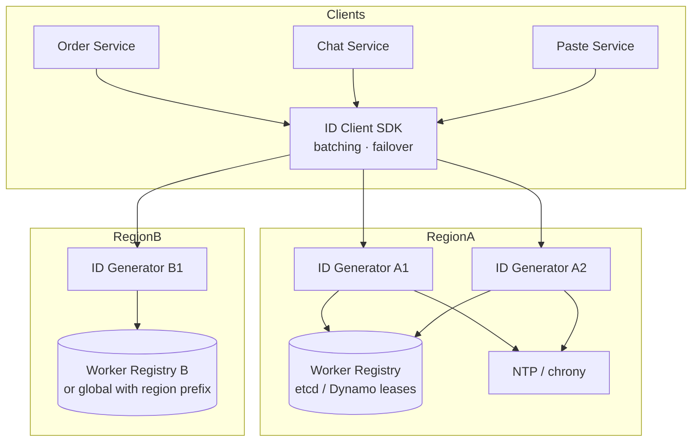

# System Design: Globally Unique ID Generator

> **Focus areas:** Uniqueness · Throughput · Clock skew · Snowflake-style bits · Range allocation · UUID/ULID trade-offs · Multi-region · Failure domains  
> **Style:** End-to-end service design with progressive scale (10× → 100× → 1,000×)  
> **Quality bar:** Correct bit math, explicit clock policies, deal-breakers on duplicates, operable at multi-million QPS

---

## Table of Contents

1. [Clarify Requirements (Interview Q&A)](#1-clarify-requirements-interview-qa)
2. [Back-of-the-Envelope Estimation](#2-back-of-the-envelope-estimation)
3. [High-Level Design](#3-high-level-design)
4. [Architecture Diagram](#4-architecture-diagram)
5. [Design Deep Dive](#5-design-deep-dive)
6. [Wrap-Up](#6-wrap-up)
7. [Deeper / Related Interview Questions](#7-deeper--related-interview-questions)

---

## 1. Clarify Requirements (Interview Q&A)

Goal: Design a **globally unique ID generation service** used by many product teams (orders, messages, pastes, short links, events)—high QPS, zero duplicates, operable across regions and failure domains.

### 1.0 What this is / is not

| Dimension | This design | Not this |
|-----------|-------------|----------|
| Job | Mint unique 64/128-bit IDs at high QPS | General-purpose coordination service (ZooKeeper replacement) |
| Ordering | Rough time-sortable optional | Perfect global serializability of all business events |
| Clients | Internal services via RPC/HTTP/sidecar | Public untrusted internet without auth |
| Persistence | Generator state (worker leases, sequences) | Storing all historical IDs forever |

### 1.1 Functional Requirements

| # | Question to ask | Expected / typical interviewer answer | Design implication |
|---|-----------------|----------------------------------------|--------------------|
| F1 | ID size? | Prefer **64-bit** for indexes/JS caveats story; 128-bit OK if needed | Snowflake-like vs UUID/ULID |
| F2 | Uniqueness scope? | **Global** across regions and services | Coordinate worker IDs / ranges |
| F3 | Time-sortable? | Yes preferred (DB locality, debugging) | Timestamp in high bits |
| F4 | Roughly ordered per node? | Yes | Sequence field |
| F5 | API? | `GetId()`, `GetIds(n)` batch; gRPC preferred | Batching for throughput |
| F6 | Multi-tenant / namespaces? | Optional `id_space` per product | Separate worker pools or tagged bits |
| F7 | Auth? | mTLS / service identity | No anonymous minting |
| F8 | Latency? | p99 < 5ms in-region | Local generation after lease |
| F9 | Availability? | 99.99%; degrade with local cache of ranges | Avoid single Redis SPOF without HA |
| F10 | Clock assumptions? | NTP/chrony; define backward jump policy | Wait / refuse / use logical time |
| F11 | Client-side generation OK? | Hybrid: library with leased worker id **or** central service | Document trust model |
| F12 | Readable IDs? | Opaque numeric/base32; not PII | No embedding user_id |
| F13 | Replay / audit? | Not required to store every ID | Metrics on rate only |
| F14 | Compatibility? | Fit in `BIGINT` / `uint64`; warn about JS `Number` | Offer string form |

**MVP functional scope (lock with interviewer):**

1. Issue globally unique 64-bit IDs via RPC with batch API.
2. Roughly time-sortable.
3. Multi-node, multi-AZ; defined behavior under clock skew.
4. Unique **worker/machine** identity allocation (no two live workers share id).
5. Authn between clients and generators.
6. Dashboards: QPS, skew waits, worker lease health.
7. At least one region; plan for multi-region without duplicate worker ids.

**Out of MVP (explicitly defer):**

- Cryptographically unguessable tokens for security boundaries (use separate secret tokens)
- Perfect causal ordering across regions (use Lamport/vector clocks in app if needed)
- Human-memorable short codes (that’s URL shortener allocation)
- Client-only UUID without operational controls (may be OK for some apps—scope lock)

### 1.2 Non-Functional Requirements

| # | Area | Target | Notes |
|---|------|--------|-------|
| N1 | Latency | p50 < 1ms; p99 < 5ms in-region batch | After warm lease |
| N2 | Throughput | Baseline 100K ids/s → grow to 100M+/s | Batching + local seq |
| N3 | Uniqueness | **Zero** duplicates under correct ops | Hard invariant |
| N4 | Availability | 99.99% id minting | Range cache survives ZK/DB blip |
| N5 | Durability of leases | Worker id assignment survives restarts without clash | Fencing / epoch |
| N6 | Multi-region | Independent generation; globally unique | Partition worker id space by region |
| N7 | Operability | Safe worker replace; clock alerts | Page on skew/exhaustion |
| N8 | Cost | CPU cheap; coordination QPS tiny vs id QPS | Don’t centralize every id |

### 1.3 Cases (Flows & Edge Cases)

**Happy paths**

1. Client calls `GetIds(100)` → 100 increasing ids from local generator node.
2. New generator instance acquires unique `worker_id` lease → starts minting.
3. Rolling deploy: old worker releases lease / lease expires; new worker gets different id or new epoch.
4. Multi-region: us-east and eu-west mint concurrently; no collision.

**Edge / failure cases**

| Case | Behavior |
|------|----------|
| Clock jumps backward | Pause minting until time ≥ last; or increment logical overflow; alert |
| Clock jumps forward | Accept; monitor; large jumps alert (NTP fault) |
| Sequence exhausted in same ms | Spin/wait next millisecond; or use overflow into time |
| Worker id lease lost (GC pause) | **Stop minting**; re-acquire with fencing token |
| Two workers same worker_id | **Duplicate IDs** — prevent via strong lease + fencing |
| Coordination store down | Continue until local range/lease TTL ends; then fail closed |
| Thundering herd at ms boundary | Batch API; per-worker sequences |
| JS client precision | Return ids as strings for values > 2^53-1 |
| Datacenter split brain | Worker id space pre-partitioned; no stolen leases without quorum |
| Requested batch too large | Cap e.g. 1K–10K per RPC |

### 1.4 Scales (Progressive)

| Metric | Baseline | 10× | 100× | 1,000× |
|--------|----------|-----|------|--------|
| Peak ids / second | 100K | 1M | 10M | 100M |
| Generator nodes | 10 | 50 | 200 | 1_000+ |
| Regions | 1–2 | 3 | 5+ | 10+ |
| Clients (services) | 50 | 200 | 1_000 | 5_000 |
| Coordination QPS (leases) | tens | hundreds | low thousands | still << id QPS |
| Ids / day | ~9B | ~90B | ~900B | ~9T |

**What each jump forces:**

- **10×:** Mandatory batching; local sequence (Snowflake); not DB `AUTO_INCREMENT` per id.
- **100×:** Region bits in worker space; sidecars/libraries to cut RPC hops; lease service HA.
- **1,000×:** Mostly **client-local** generation with assigned worker ids; coordination plane remains small; careful bit exhaustion planning (timestamp years).

### 1.5 Etc. (Constraints & Assumptions)

- Prefer **64-bit** Snowflake-class unless interviewer wants UUID.
- JavaScript consumers need string IDs.
- NTP required; define max skew SLO (e.g. < 100ms).
- IDs are not capability tokens—guessability ≠ authorization.

**Scope statement to repeat back:**

> Design a globally unique, roughly time-sortable 64-bit ID service that mints ≥100K ids/s today and scales to 1000× via leased worker identities and local sequences, with explicit clock-skew and fencing behavior and zero-duplicate invariant.

---

## 2. Back-of-the-Envelope Estimation

### 2.1 Why not DB auto-increment?

```text
100K ids/s → 100K durable writes/s to a single counter sequence
Even with sequence CACHE, cross-region uniqueness + HA is painful
Coordination per id does not scale to 10M–100M/s
```

**Conclusion:** generate **in process** with partitioned identity space.

### 2.2 Snowflake-style 64-bit layout (classic)

```text
| 1 sign | 41 timestamp_ms | 10 worker_id | 12 sequence |
sign bit = 0
41 bits ms since custom epoch:
  2^41 ms ≈ 69.7 years
10 bits worker → 1024 workers
12 bits seq → 4096 ids / worker / ms
→ theoretical max ≈ 1024 × 4096 × 1000 ≈ 4.2e9 ids/s
```

Tune for reality:

| Field | Bits | Capacity | Tuning notes |
|-------|------|----------|--------------|
| Timestamp | 41 | ~70y | Enough for most companies |
| Datacenter | 5 | 32 | Optional split of worker bits |
| Worker | 5 | 32 / DC | Or 10 combined |
| Sequence | 12 | 4096/ms | Increase if single fat node |

**At 100M ids/s:** need enough workers × seq/ms. Example: 500 workers × 2000 seq/ms × 1000 = 1e9/s capacity headroom.

### 2.3 Latency & QPS per node

```text
In-process mint: ~10–50 ns/id → CPU not bound for millions/s
RPC overhead dominates if GetId() one-by-one
Batch 100: amortize → easy 1M+/s per node network permitting
```

### 2.4 Coordination traffic

```text
Worker lease refresh every 10s; 200 workers → 20 QPS — trivial
Range allocator: if issuing 1M-id ranges, coordination QPS = id_qps / 1e6
At 10M ids/s → 10 range grants/s
```

### 2.5 Storage

```text
Lease table: thousands of rows
Optional last_timestamp per worker for skew handling — tiny
Do NOT store every issued ID
```

### 2.6 UUID comparison (128-bit)

```text
UUIDv4: 122 random bits — collision negligible; not time-sortable
UUIDv7: time-sortable 128-bit — good indexes; larger storage
ULID: 128-bit Crockford base32 — similar
Trade-off: 2× storage vs 64-bit; JS-safe as strings anyway
```

### 2.7 Bit exhaustion check (interview favorite)

```text
If sequence=12 and one worker needs >4096 ids in one ms:
  wait for next ms (adds ≤1ms latency) OR borrow from future ms carefully
At 5M ids/s on ONE worker: 5000/ms > 4096 → need more seq bits or more workers
```

---

## 3. High-Level Design

### 3.1 Approaches (compare explicitly)

| Approach | Uniqueness | Sortable | QPS | Multi-region | Ops risk | Verdict |
|----------|------------|----------|-----|--------------|----------|---------|
| DB `AUTO_INCREMENT` | Strong | Yes | Low–med | Hard | Simple early | **Deal-breaker at scale** |
| UUID v4 | Probabilistic | No | Ultra high local | Easy | Easy | OK if size+unordered OK |
| UUID v7 / ULID | Probabilistic | Yes | Ultra high | Easy | Easy | Strong alternative to 64-bit |
| Snowflake (leased worker) | Deterministic | Yes | Ultra high | Via worker space | Clock + lease bugs | **Default interview design** |
| Range allocation (ticket servers) | Deterministic | Optional | High | Ranges per region | Range loss = gap OK; reuse = death | Good for numeric gaps OK |
| Redis `INCR` | Strong | Yes | Med–high | Replication issues | SPOF/failover dup risk | Risky as sole global |

**MVP recommendation:** Snowflake-class 64-bit with **strongly leased worker_id** + batch API. Mention UUID v7 as alternative when 128-bit OK.

### 3.2 Components

| Component | Role |
|-----------|------|
| ID Service nodes | Mint ids; maintain sequence + last_ts |
| Worker Registry | Assigns unique worker_id with fencing epoch (etcd/ZK/Dynamo) |
| Optional Range Service | Hands out `[start, end)` for non-Snowflake mode |
| Client SDK | Batching, string mode, retries, local failover |
| Clock Monitor | NTP skew metrics; pause on rewind |
| Control plane | Config for epoch, bit layout, region prefixes |

### 3.3 APIs

```text
rpc GetIds(GetIdsRequest) returns (GetIdsResponse);

message GetIdsRequest {
  string id_space = 1;   // optional product namespace
  uint32 count = 2;      // 1..1000
}

message GetIdsResponse {
  repeated uint64 ids = 1;     // monotonic in this response
  string ids_string = 2;       // optional JSON string form
}

rpc GetWorkerStatus(...)       // admin
```

HTTP variant: `POST /v1/ids { "count": 100 }`.

### 3.4 Snowflake mint algorithm

```text
state: worker_id, last_ts, seq, fencing_epoch

GetIds(n):
  assert lease_valid(fencing_epoch)
  out = []
  while len(out) < n:
    now = current_ms()
    if now < last_ts:
      wait_until(last_ts) or raise ClockRewind
      continue
    if now > last_ts:
      last_ts = now; seq = 0
    if seq > MAX_SEQ:
      wait_until(last_ts + 1); continue
    id = (last_ts - EPOCH) << TS_SHIFT
       | (worker_id << WORKER_SHIFT)
       | seq
    seq += 1
    out.append(id)
  return out
```

### 3.5 Worker identity allocation

```text
On start:
  1. Authenticate to Worker Registry
  2. Claim free worker_id in region shard with TTL lease + epoch++
  3. Persist fencing_epoch locally
  4. Heartbeat refresh
On GC pause / network partition:
  If heartbeat fails past TTL → process must exit or freeze minting
  Never mint after lease loss
```

**Deal-breaker:** two processes minting with same `worker_id` concurrently.

### 3.6 Multi-region bit map example

```text
| 41 ts | 4 region | 6 worker | 12 seq |
region=16, worker=64 per region, seq=4096/ms
```

Or assign worker_id globally from 0..1023 with registry guaranteeing uniqueness across regions.

### 3.7 Range-allocation alternative (ticket server)

```text
Generator asks: Grant(size=1_000_000)
Registry durable increments high-water mark
Node mints locally from range
Gaps OK on crash; REUSING range = duplicates — never reclaim
```

Use when you want sequential-ish ids without packing timestamp bits.

### 3.8 Trade-offs summary

| Decision | Choose | Over | Why | Deal-breaker |
|----------|--------|------|-----|--------------|
| Width | 64-bit Snowflake | UUID always | Dense indexes | Ignoring JS 2^53 |
| Coordination | Lease worker id | Central INCR each id | Scale | Shared worker id |
| Clock | Wait on rewind | Ignore rewind | Uniqueness | Dup or out-of-order explode |
| API | Batch | Scalar only | RPC amp | Death by RTT |
| Fail mode | Fail closed if no lease | Guess worker id | Safety | Duplicates |
| Gaps | Allowed | Dense no-gap | HA reality | Overfitting no-gap |

---

## 4. Architecture Diagram



**Degrade:** Registry blip → generators continue until lease expiry → then fail closed. Clients retry other generators with valid leases.

---

## 5. Design Deep Dive

### 5.1 Reliability

**Hard invariants**

1. No two **concurrent** minting processes share `(id_space, worker_id)`.
2. For a single worker, `(timestamp_ms, seq)` never reused.
3. On lease loss, minting stops **before** another node can reuse `worker_id`.
4. Clock rewind never emits an id that could collide with past ids from this worker.

**Fencing**

- Lease includes monotonic `epoch`. Minted responses can carry epoch for debugging.
- Process compares epoch on heartbeat; mismatch → suicide.

**Retries / idempotency**

- ID mint is not idempotent (each call new ids)—clients must not retry blindly if they already consumed ids. For “allocate id then create entity,” put id generation **inside** the entity create with idempotency key at entity layer—not at id layer.

**Backpressure**

- Cap batch size; return `RESOURCE_EXHAUSTED` if seq saturated too long (should be rare).

**Duplicates root causes (memorize)**

1. Duplicate worker_id  
2. Clock rewind without wait  
3. Reusing ticket ranges after crash  
4. VM fork / snapshot resume with same state  
5. Restoring generator disk state without clearing seq/ts  

Mitigate VM fork: detect `CLOCK_MONOTONIC` discontinuities; force re-lease on resume.

### 5.2 Scalability

| Scale | Strategy |
|-------|----------|
| Baseline | 10 generators; Snowflake local; registry HA |
| 10× | Batch SDK; more workers; tune seq bits |
| 100× | Region prefixes; sidecars co-resident with heavy clients |
| 1,000× | Library mode: client process gets worker_id lease directly; central service optional |

**Scale up vs out:** Prefer out (more worker ids). Single node limited by seq/ms.

**Sharding id spaces:** Product `id_space` can use separate bit tags or separate worker pools to avoid noisy neighbor exhaust.

**Parallelization:** Embarrassingly parallel across workers; coordination not on hot path.

### 5.3 Maintainability

**Observability**

- `ids_issued`, `mint_latency`, `clock_wait_ms`, `seq_exhaust_waits`, `lease_expirations`, `worker_id_in_use`.
- Alert: clock rewind events; lease flapping; near bit-epoch end (years ahead).

**Migrations**

- New bit layout → new epoch / version nibble; never mix layouts without version field.
- Extending to 128-bit → new API; dual-mode clients.

**Multi-tenant**

- Quotas per `id_space` QPS; noisy neighbor isolation via separate deployments if needed.

**Ops**

- Runbook: replace unhealthy worker; emergency pause minting; NTP failure.
- Durable documentation of **custom epoch** and bit layout—irreversible once data lands in DBs.

---

## 6. Wrap-Up

### 6.1 Decision summary

| Topic | Decision |
|-------|----------|
| Format | 64-bit time \| worker \| seq (Snowflake-class) |
| Hot path | Local mint after lease |
| Coordination | Worker registry leases + fencing |
| Clock | Wait on rewind; alert |
| API | Batched GetIds |
| Gaps | Allowed |
| Multi-region | Partition worker/region bits |

### 6.2 Phased rollout

1. Single region service + SDK batching.  
2. Multi-AZ registry; chaos tests for lease loss.  
3. Multi-region worker space.  
4. Optional client-local library mode for ultra scale.

### 6.3 Risks

Duplicate worker ids; VM snapshot resume; JS precision; silently changing epoch; treating IDs as secrets.

### 6.4 Closer

> **Globally unique IDs:** deterministic uniqueness via leased workers + local sequences, time-sortable 64-bit layout, explicit clock and fencing rules, coordination off the hot path.

---

## 7. Deeper / Related Interview Questions

**Q1. Why is Snowflake preferred over UUID in many interviews?**  
**A:** 64-bit dense keys, time locality for B-Tree/LSM inserts, deterministic uniqueness without relying on RNG quality alone. UUID v7 is a modern peer if 128-bit storage is fine.

**Q2. How many IDs per ms per worker with 12 sequence bits?**  
**A:** 4096. Show `2^12`.

**Q3. How long until 41-bit ms timestamp overflows?**  
**A:** `2^41 / (1000*60*60*24*365) ≈ 69.7 years` from custom epoch.

**Q4. What happens on clock rewind?**  
**A:** Do not emit. Wait until `now >= last_ts`, or fail. Alert. Never decrement timestamp field.

**Q5. How do you assign worker IDs?**  
**A:** Registry lease with TTL + fencing epoch (etcd/ZK/Dynamo conditional). Static config files are fragile at scale.

**Q6. Can two regions mint without talking on every ID?**  
**A:** Yes—partition `worker_id` or region bits a priori; only registry uniqueness must be global.

**Q7. Redis INCR as global ID?**  
**A:** Works small-scale; failover and replication can duplicate; becomes bottleneck; avoid as sole global generator at high QPS.

**Q8. Are gaps allowed?**  
**A:** Yes for Snowflake and ranges. No-gap sequences force single primary and hurt HA—usually not worth it.

**Q9. JS `Number` issue?**  
**A:** `Number` safe integers only to 2^53-1. Return strings for web; use `bigint` in modern JS.

**Q10. Ticket/range servers vs Snowflake?**  
**A:** Ranges: simple numeric, gaps on crash, need durable high-water. Snowflake: time-sortable packed bits, clock sensitivity.

**Q11. Is ID secrecy a goal?**  
**A:** No. Opaque ≠ secret. Authorization separate. Sequential-ish ids may leak volume—acceptable or add salt bits if needed.

**Q12. Dual-write ID into two DBs?**  
**A:** ID generation doesn’t make distributed transactions safe. Use outbox/idempotency for entity creation.

**Q13. How to test uniqueness?**  
**A:** Concurrent soak across nodes; kill -9 mid-lease; VM time skew injection; assert set cardinality == issued.

**Q14. Consistent hashing here?**  
**A:** Not required for minting. Used if sharding **storage** by id—virtual nodes, etc., separate topic.

**Q15. What if sequence exhausts?**  
**A:** Wait next millisecond. If chronic, rebalance load or allocate more sequence bits / workers.

**Q16. Zookeeper vs etcd vs Dynamo for leases?**  
**A:** Any CP lease store with ephemeral TTL + fencing. Dynamo conditional writes + heartbeat also work (TTL attributes).

**Q17. ULID vs Snowflake?**  
**A:** ULID 128-bit, Crockford encoding, sortable. Snowflake 64-bit. Choose on storage and ecosystem.

**Q18. Can we embed `region` for debugging?**  
**A:** Yes in bits—helps support; don’t embed PII.

**Q19. Fail open or closed if registry down?**  
**A:** Continue until lease expiry (cached), then **closed**. Fail open with random worker_id → duplicates.

**Q20. How does Twitter Snowflake historical design differ?**  
**A:** Central Twitter snowflake servers with ZK worker ids—same family. Today often library-embedded.

**Q21. SST / index fragmentation?**  
**A:** Time-sortable ids improve locality vs UUIDv4 random inserts—often a hidden win.

**Q22. Multi-tenant noisy neighbor?**  
**A:** Per id_space quotas; separate worker pools for whale services.

**Q23. Pause the world GC long enough to lose lease?**  
**A:** Possible—heartbeat thread must be responsive; on reclaim suspicion freeze; prefer languages/runtimes with bounded pauses for generators or isolate generator processes.

**Q24. Why custom epoch?**  
**A:** Maximize useful life of 41 bits; start near deploy time, not 1970.

**Q25. Deal-breakers?**  
**A:** Shared worker_id; ignore clock rewind; reuse ticket ranges; DB auto-increment as global 100M/s solution; silent bit-layout change.

**Q26. Can IDs be monotonically increasing globally?**  
**A:** Not without global coordination. Offer per-worker monotonic + rough time order. True global mono ⇒ bottleneck.

**Q27. Mapping ID back to time?**  
**A:** `(id >> TS_SHIFT) + EPOCH` → useful for debugging; document layout.

**Q28. Load balancer sticky sessions?**  
**A:** Unnecessary if any generator can serve; SDK failover round-robin among healthy nodes.

---

## Appendix A — Bit Layout Cheatsheet

```text
Standard 64-bit:
  [1 unused/sign=0][41 timestamp_ms][10 worker_id][12 sequence]

Custom epoch example: 2024-01-01T00:00:00Z
Decode time:  ((id >> 22) & ((1<<41)-1)) + epoch_ms
Decode worker: (id >> 12) & 1023
Decode seq:    id & 4095
```

## Appendix B — Lease State Machine

```text
START → CLAIMING → ACTIVE ⇄ RENEWING
                      ↓
EXPIRED/FENCED → STOP_MINTING → RECLAIM or EXIT
```

Never mint from `EXPIRED/FENCED`. Prefer process exit over silent continue.

## Appendix C — Interview Closer Lines

1. “Uniqueness comes from **partitioned identity** (worker leases), not from a global lock per ID.”  
2. “Clock rewind is a **stop-the-world for that worker**, not a hope.”  
3. “Gaps are fine; **duplicates are not**.”  
4. “Batch the API or you will RTT yourself to death.”  
5. “JS clients get **strings**.”

---

*End of Globally Unique ID Generator system design.*
