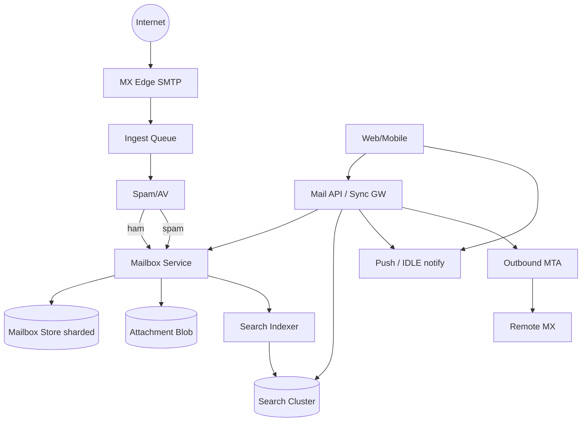

# System Design: Gmail

> **Focus areas:** SMTP/MX receive · Mailbox storage · Labels/threads · Search · Spam/phishing · Push sync · Attachments · Multi-device · Quotas  
> **Style:** End-to-end product design with progressive scale (10× → 100× → 1,000×)  
> **Quality bar:** Mailbox as sharded log+index; spam as first-class; search consistency honest; progressive scale  
> **Interview theme:** Senior / Staff — **consumer email service** (Gmail-class inbox, not ESP outbound)

---

## Table of Contents

1. [Clarify Requirements (Interview Q&A)](#1-clarify-requirements-interview-qa)
2. [Back-of-the-Envelope Estimation](#2-back-of-the-envelope-estimation)
3. [High-Level Design](#3-high-level-design)
4. [Architecture Diagram](#4-architecture-diagram)
5. [Design Deep Dive](#5-design-deep-dive)
6. [Wrap-Up](#6-wrap-up)
7. [Deeper / Related Interview Questions](#7-deeper--related-interview-questions)
8. [Appendices](#8-appendices)

---

## 1. Clarify Requirements (Interview Q&A)

Goal: design a **Gmail-like email service**: receive mail via MX, store per-user mailboxes, thread/label, search, fight spam, and sync to web/mobile clients in near realtime.

### 1.0 What this is / is not

| Dimension | This doc | Not this |
|-----------|----------|----------|
| Job | Hosted mailbox + client sync | Outbound ESP for arbitrary tenants (sibling) |
| Unit | User mailbox / conversation thread | Slack channel |
| Threat | Spam, phishing, account takeover | Mild notification spam only |
| Protocol | SMTP in, IMAP/JMAP/API out | WhatsApp E2EE mesh |

### 1.1 Functional Requirements

| # | Question | Expected answer | Design implication |
|---|----------|-----------------|--------------------|
| F1 | Receive mail? | Public MX; SMTP ingest | Edge MTAs + async pipeline |
| F2 | Send mail? | User SMTP/API submit; DKIM signed | Outbound MTA + reputation |
| F3 | Storage model? | Conversations/threads + messages | Threading algorithm (References/In-Reply-To) |
| F4 | Labels vs folders? | Gmail labels (multi-label) | Label index many-to-many |
| F5 | Search? | Full-text + filters (from, has:attachment) | Async search index |
| F6 | Spam? | Spam/phishing classification | Inline + async reprocess |
| F7 | Attachments? | Large files in blob store | Virus scan; size quotas |
| F8 | Sync? | Near-realtime new mail; multi-device | Push (IMAP IDLE / mobile push) + cursor sync |
| F9 | Drafts? | Autosave drafts | Conflict policy last-write or CRDT-lite |
| F10 | Filters/rules? | User filters on ingest | Rules engine at delivery |
| F11 | Delegation? | Limited; vacation responder | Authz + vacation job |
| F12 | Retention? | User delete; trash TTL; legal holds enterprise | GC pipeline |
| F13 | Contacts? | Autocomplete | Separate contacts service |
| F14 | Encryption? | TLS in transit; at-rest; optional client S/MIME later | Server-side readable MVP |

**MVP scope:**

1. Signup → mailbox address `@ourmail.com`.  
2. Receive SMTP → store message → inbox label.  
3. Web UI list threads; open message; send reply.  
4. Labels (Inbox, Sent, Trash, Spam, custom).  
5. Basic search (from/to/subject/body).  
6. Attachments to object store with scan.  
7. Spam scoring gate.  
8. Mobile/web sync via API + push wakeup.  
9. Quotas (storage, send rate).

**Out of MVP:** full offline Gmail offline; perfect S/MIME/PGP UX; Workspace admin (hooks); instant global search consistency; AI inbox zero as core.

### 1.2 Non-Functional Requirements

| # | NFR | Target |
|---|-----|--------|
| N1 | Ingest accept (SMTP 250) | Fast after spam checks; don’t tarpit wrongly |
| N2 | New mail visible | p50 < 1–2s after accept for owner |
| N3 | Search freshness | Seconds–minutes eventual |
| N4 | Durability | No lost accepted mail; RPO≈0 |
| N5 | Availability | 99.9%+ mailbox access |
| N6 | Multi-region | Home cell per user mailbox |
| N7 | Security | Authz on every message id; phishing protection |
| N8 | Abuse | Outbound send limits; inbound flood control |

### 1.3 Cases

**Happy:** External sender → MX → spam ok → thread attach → push client → user reads → reply sent DKIM.

| Case | Behavior |
|------|----------|
| Spam | Label Spam; quarantine UI |
| Phishing | Banner + link rewrite/safe browse |
| Huge attachment | Reject over quota; or drive-link |
| Duplicate SMTP retry | Dedupe by Message-ID + mailbox |
| User filter archive | Skip Inbox |
| Search lag | Show recently received via primary store first |
| Account compromise | Session revoke; outbound freeze |
| Mailbox full | 452/552 on ingest; notify user |
| Concurrent draft edits | Last-write-wins + version |
| Soft-delete trash | GC after 30d |

### 1.4 Progressive scale

| Metric | Baseline | 10× | 100× | 1,000× |
|--------|----------|-----|------|--------|
| Users | 1M | 10M | 100M | 1B |
| Messages received / day | 50M | 500M | 5B | 50B |
| Peak SMTP connections | 5K | 50K | 500K | 5M |
| Avg mailbox size | 2 GB | 2 GB | 3 GB | 5 GB |
| Search QPS | 2K | 20K | 200K | 2M |
| Concurrent sync clients | 100K | 1M | 10M | 100M |
| Spam % of inbound | 50–90% | same | same | same |

**Jumps:** 10× = async index + blob attachments; 100× = user home cells + spam fleet; 1,000× = extreme MX edge, tiered cold mail, ML spam at scale.

### 1.5 Scope repeat-back

> Design a **Gmail-class mailbox**: MX ingest, durable per-user storage with threads/labels, search, spam, send path, multi-device sync—from 1M users to 1000× with home-cell mailboxes and honest search eventual consistency.

---

## 2. Back-of-the-Envelope Estimation

```text
50M msgs/day ≈ 580/s avg; peak ×5 ⇒ ~3K/s accepted (after spam drop)
If 80% spam rejected early: edge sees much higher connection/attempt rate

Avg message 75 KB (body+headers); attachment separate
50M × 75 KB ≈ 3.75 TB/day raw ingest retained
1M users × 2 GB ≈ 2 PB steady mailbox store (compressed/deduped less)

Search index: posting lists — often same order as body store fraction
Sync: 100K clients polling badly melts — must push/long-poll
```

### Hot keys

- Celebrity inbox / mailing list storms.  
- Popular Message-ID threads.  
- Global search fan-out without authz — forbidden.

### Bandwidth

SMTP ingress + client sync egress; attachments via CDN/blob signed URLs.

---

## 3. High-Level Design

### 3.1 Planes

| Plane | Role |
|-------|------|
| Edge MX | SMTP, early reject, TLS |
| Ingest pipeline | Parse, spam, virus, rules |
| Mailbox store | Per-user messages/threads/labels |
| Index | Search |
| Sync / push | Client update notifications |
| Outbound MTA | User-sent mail |

### 3.2 Components

1. **MX Edge / SMTP Servers**  
2. **Ingest Workers** — MIME parse, rewrite  
3. **Spam / Phish Scorer**  
4. **Attachment Store** + AV  
5. **Mailbox Service** — sharded by `user_id`  
6. **Threader**  
7. **Label Service**  
8. **Search Indexer / Query**  
9. **Sync Gateway** — cursors, push  
10. **Outbound Submit + DKIM**  
11. **Quota Service**  
12. **Abuse / Rate Limiter**  
13. **Directory** — user → home cell

### 3.3 APIs (client)

```text
GET  /v1/threads?label=INBOX&cursor=
GET  /v1/threads/{id}
POST /v1/messages/send
POST /v1/messages/{id}/modify  {add_labels, remove_labels}
GET  /v1/search?q=
POST /v1/drafts
GET  /v1/sync?cursor=   // incremental changes
```

### 3.4 Data model

```text
messages(user_id, msg_id, thread_id, received_at, headers_ref, body_ref,
  size, spam_score, state)

threads(user_id, thread_id, last_ts, participants_hash, snippet, unread)

labels(user_id, label_id, name, system)

message_labels(user_id, msg_id, label_id)

cursors(user_id, device_id, sync_token)
```

Shard key: `user_id` everywhere for mailbox locality.

### 3.5 Trade-offs

| Topic | Choice | Why |
|-------|--------|-----|
| IMAP vs custom API | API-first + IMAP bridge | Mobile control |
| Search in primary DB | **No** — inverted index | Scale |
| Strong search consistency | Eventual | Cost/latency |
| Server-side encryption only MVP | Yes | Search/spam need body |
| Dedup attachments | Content hash | Storage savings |

**Deal-breaker:** storing all mailboxes in one unsharded SQL database at 100×.

---

## 4. Architecture Diagram



### Cell

```text
user → Directory → home cell owns mailbox writes
Cross-cell only for send-to-other-local-user (internal shortcut)
```

---

## 5. Design Deep Dive

### 5.1 Reliability

**Invariants**

1. After SMTP 250, message durable in mailbox cell (or durable queue with retry to mailbox).  
2. Idempotent ingest on `(mailbox, Message-ID)` when present.  
3. Labels/modifies are idempotent ops with change tokens for sync.  
4. Trash GC never deletes under legal hold.  
5. Authz: `msg_id` always checked against `user_id` (no IDOR).  
6. Outbound send counted against abuse quotas before 250 to client.  
7. Spam false negatives: user report feedback loop.

**Delivery guarantees**

| Path | Guarantee |
|------|-----------|
| Inbound accept | Durability after 250 |
| Client sync | At-least-once change stream; cursor |
| Search | Eventually consistent |
| Order | Per-mailbox received order; thread sort by last_ts |

**Offline clients:** local cache; sync on reconnect with cursor; push wakeup. Drafts flush with version checks.

**Retries:** SMTP senders retry on 4xx; our ingest pipeline retries poison to DLQ with ops tools—don’t lose mail silently after 250.

### 5.2 Scalability

| Scale | Moves |
|-------|-------|
| 1× | Monolith mailbox + ES |
| 10× | Blob attachments; async index; read replicas |
| 100× | User cells; spam feature fleet; cold tier (>1y) |
| 1000× | MX Anycast regions; per-user storage tiering; ML ensembles |

**Threading at scale:** compute thread_id on ingest via References chain; store adjacency; don’t rethread entire mailbox on read.

**Fan-in mailing lists:** rate limit delivery to single user; collapse if needed.

### 5.3 Maintainability

- Schema evolution for MIME oddities.  
- Spam model canaries.  
- Reindex pipelines.  
- Quarantine tools for incidents.  
- Dual-write label migrations.

### 5.4 Spam deep dive

Features: IP reputation, domain age, DKIM/SPF/DMARC alignment, URL reputation, user graph, content classifiers.  
Pipeline: cheap early reject → deep score → deliver with label → async reclassify.  
Feedback: user “Report spam/Not spam” → training.

### 5.5 Search authz

Every hit filtered by mailbox ownership; never global term query without user constraint. For shared labels/delegation, explicit ACL join.

### 5.6 Deal-breakers

1. SMTP 250 before durability.  
2. IDOR on message fetch.  
3. Search without authz filter.  
4. Unbounded outbound send.  
5. Single global DB for all mailboxes.

---

## 6. Wrap-Up

| Decision | Choice |
|----------|--------|
| Shard | By user_id home cell |
| Body | Object/blob + metadata DB |
| Search | Async index; eventual |
| Spam | First-class multi-stage |
| Sync | Cursor + push |

**Phases:** receive/send/labels → search/spam polish → cells → cold tier/Workspace features.

> “Gmail is a **sharded mailbox log** with a hostile SMTP front door; I’d make durability-before-250, spam, and user-keyed cells non-negotiable.”

---

## 7. Deeper / Related Interview Questions

**Q1. When do you 250 vs after spam?**  
Policy trade-off: late reject after accept requires DSN; many systems accept then spam-label. Don’t ack before durable queue.

**Q2. How does threading work?**  
Use Message-ID, In-Reply-To, References; fallback subject normalization carefully.

**Q3. Labels vs folders?**  
Labels allow multi-categorization; storage is message + label map.

**Q4. Search consistency?**  
Eventual; UI shows new mail from primary store even if index lags.

**Q5. Attachment virus scan blocking?**  
Hold delivery or deliver without attachment until scan — product choice; fail safe.

**Q6. Multi-device unread?**  
Per-user unread state (not per-device) usually; sync mutations via change log.

**Q7. IMAP IDLE at scale?**  
Expensive connections — prefer mobile push + short sync; IMAP for power users on dedicated fleet.

**Q8. Hot mailbox?**  
Isolate user shard; rate-limit noisy senders to that mailbox.

**Q9. Dedup Message-ID?**  
Per-mailbox dedup; same Message-ID to different users is normal (mailing lists).

**Q10. Outbound reputation?**  
Separate from inbound; shared ESP patterns; freeze compromised accounts.

**Q11. Encryption vs search?**  
Server-side searchable MVP; client-side encryption breaks spam/search—product tension.

**Q12. How to delete user (GDPR)?**  
Purge mailbox store, index, blobs, backups asynchronously with tracking.

**Q13. Quota enforcement?**  
Check on ingest and attachment upload; soft warn + hard fail.

**Q14. Calendar/invite parsing?**  
Async MIME part extract → calendar service (out of MVP).

**Q15. Push notification content?**  
Often truncated subject; privacy settings hide body.

**Q16. Consistent hashing?**  
User → cell via directory; rebalance with locked moves.

**Q17. Why not store bodies in SQL?**  
Large/variable; blob + checksum; SQL for metadata/labels.

**Q18. Grey listing?**  
Can reduce spam; hurts latency—selective.

**Q19. Smearing large attachments?**  
Chunked upload; resumable; virus scan assembled object.

**Q20. Exact vs probabilistic spam?**  
Scores + thresholds; user overrides; continuous learning.

**Q21. Cross-user “send as”?**  
Delegation authz with audit.

**Q22. Backup/PITR?**  
Per-cell backups; restore is user-level surgical ideally.

**Q23. JMAP vs Gmail API?**  
Modern sync protocol ideas; document cursor model.

**Q24. Poison MIME?**  
Parser sandbox; size limits; quarantine.

**Q25. Fan-out to filters that forward?**  
SSR/open relay risk — signed forwarding rules + rate limits.

**Q26. Metrics?**  
Time-to-inbox, spam precision/recall proxies, index lag, SMTP deferrals, sync lag.

**Q27. Cold storage?**  
Move old msgs to cheaper tier; index pointers; slower fetch OK.

**Q28. Relation to disposable email?**  
Disposable is short-TTL receive-only subset.

**Q29. Relation to ESP?**  
ESP is outbound multi-tenant; Gmail is mailbox product.

**Q30. Staff signal?**  
Home-cell mailbox + spam economics + sync cursors, not “just put mail in S3.”

---

## 8. Appendices

### A. Ingest state machine

```text
ACCEPTED_QUEUE → PARSED → SCANNED → RULES → STORE → INDEX_ENQUEUE → NOTIFY
                     ↘ SPAM_LABEL
```

### B. Sync change types

```text
message_added, message_labels_changed, message_deleted, thread_updated
cursor is opaque server token per mailbox
```

### C. Related

Email delivery platform · Disposable inboxes · Push notifications · Full-text search

### D. Latency budgets

```text
SMTP → durable queue: <100ms preferred
Queue → mailbox visible: <1s p50
Search index lag SLO: <60s p99 for metadata; body maybe longer
Sync notify after store: <200ms to push gateway
```

### E. Storage layout detail

```text
Hot metadata: distributed SQL / Bigtable-style per user_id prefix
Bodies: object store key = hash(user_id, msg_id)
Secondary: label→msg posting inverted for inbox query
Inbox query: merge label index with thread snippets sorted by last_ts
Avoid SELECT * FROM messages WHERE user_id ORDER BY date without indexes
```

### F. Outbound path

```text
Client submit → abuse checks → durable outbox → DKIM sign → MTA → remote MX
Store copy in Sent; thread with in-reply-to
Bounce handling → notify user; don’t spam-loop
```

### G. Failure drills

1. Search cluster down → serve list from mailbox store; disable search UI.  
2. Blob store slow → degrade attachment open; mail list still works.  
3. Spam scorer timeout → fail policy (quarantine vs deliver) explicit.  
4. Cell outage → directory failover if warm standby; else RTO minutes.  
5. Reindex backlog → prioritize Inbox label.

### H. Progressive narrative

**1×:** single region mailbox + ES + simple MX.  
**10×:** async pipelines, attachment blobs, push sync.  
**100×:** user cells, spam fleet, cold tier.  
**1000×:** Anycast MX, ML spam, storage tiering, Workspace admin hooks.

### I. Extended deeper Qs

**Q31. How do you prevent open relays?**  
Auth required for submit; no forward without authz; rate limits.

**Q32. Unicode / encoding attacks?**  
Normalize headers carefully; display name phishing detection.

**Q33. Calendar invites storm?**  
Async parse; don’t block ingest.

**Q34. Shared mailbox?**  
Separate product; ACL on mailbox_id; still single writer cell.

**Q35. What is a change token?**  
Monotonic mailbox version; clients sync diffs > token.

**Q36. Why home cell not active-active mailbox writes?**  
Conflicts on labels/unread are nasty; single-writer simpler.

**Q37. Compression?**  
Compress bodies at rest; trade CPU.

**Q38. Thumbnail images?**  
Async generate; store derivatives.

**Q39. DLP for enterprise?**  
Scan outbound/inbound with policy engine Phase 2.

**Q40. Staff close?**  
“Hostile ingress, user-sharded durable mailbox, eventual search, sync cursors.”

### J. Thread list query plan

```text
1. Read label posting for INBOX (msg_ids recent page)
2. Join thread snippets for those msgs
3. Sort by thread.last_ts desc
4. Paginate with (last_ts, thread_id) cursor
Cache top inbox page briefly per user with version stamp
```

### K. Security threat notes

- IDOR on msg_id across users  
- Header injection on send  
- Phishing lookalike display names  
- Attachment malware  
- Account takeover → outbound spam (freeze)  
- Search ACL bugs on delegation  

### L. Capacity worksheet

```text
Mailbox nodes ≈ users × avg_mailbox_hot_GB / disk_per_node / target_util
Spam workers ≈ peak_inbound_msgs × cost_ms / 1000 / cores
Search cluster sized on posting list + QPS not on user count alone
```

### M. Closing checklist

- Durability before SMTP 250
- User-sharded mailbox
- Eventual search + authz
- Spam multi-stage
- Sync cursors + push
- Outbound abuse freeze

### Z. Interview 45-minute timebox

| Min | Focus |
|-----|-------|
| 0–5 | Scope, is/is-not, MVP lock |
| 5–12 | Estimation + fan-out/delivery math |
| 12–22 | HLD components + mermaid |
| 22–35 | Reliability: guarantees, offline, ordering, idempotency |
| 35–40 | Scale jumps 10×/100×/1000× |
| 40–45 | Deeper traps + wrap-up |

### Z2. Explicit delivery guarantee card (say this)

```text
Producer ACK  => durable intent/log
Transport     => at-least-once to devices/providers
Display       => client dedupe / inbox idempotency
Order         => per conversation/group/mailbox — not global
Offline       => sync cursor is source of healing; push is wakeup
```

### Z3. Operability golden signals

- Accept/persist latency & errors  
- Fan-out / provider lag  
- Queue depth by priority  
- Sync catch-up lag after reconnect  
- Invalidation / bounce / membership error rates  
- Cost proxies (SMS, media egress, push)

### Z4. Kill switches

- Disable typing/presence  
- Shed marketing/push previews  
- Freeze hot group / tenant  
- Force sync-only mode (no realtime)  
- Pause GC only with storage alarm (disposable)

### Z5. Final one-liner bank

- Notifications: priority lanes + preference snapshots  
- Push: wakeup fabric + token hygiene  
- Email ESP: reputation + suppression  
- Gmail: hostile MX + user-sharded mailbox  
- Disposable: TTL GC is the product  
- 1:1: single-writer seq log  
- WhatsApp: E2EE envelope relay  
- Groups: hybrid fan-out math  
