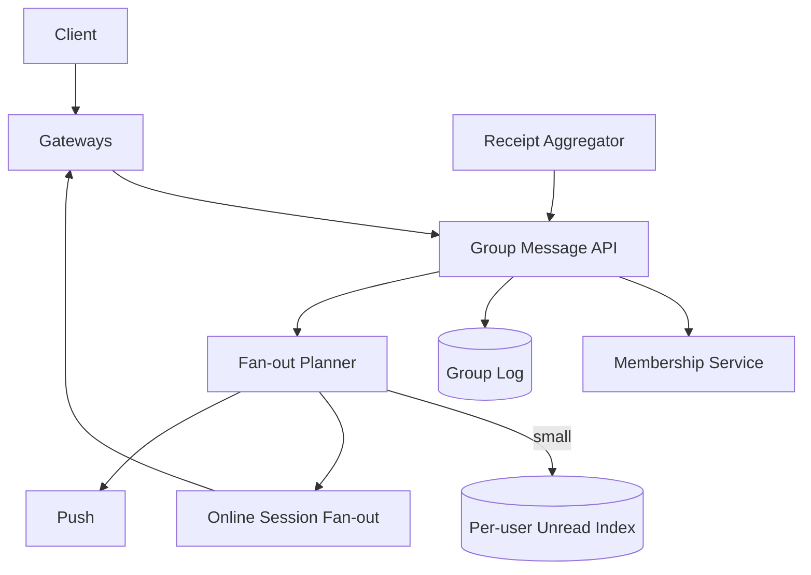
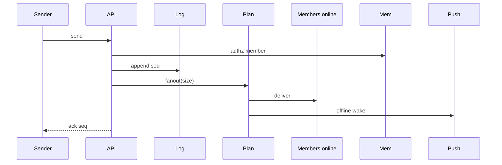

# System Design: Group Chat

> **Focus areas:** Membership · Hybrid fan-out · Per-group ordering · Offline sync · Push · Receipts aggregation · Roles/admin · Hot groups  
> **Style:** End-to-end product design with progressive scale (10× → 100× → 1,000×)  
> **Quality bar:** Correct fan-out math; threshold between write-fanout and read-fanout; progressive scale  
> **Interview theme:** Senior / Staff — **group messaging** (WhatsApp/Telegram groups; not Slack channels mega)

---

## Table of Contents

1. [Clarify Requirements (Interview Q&A)](#1-clarify-requirements-interview-qa)
2. [Back-of-the-Envelope Estimation](#2-back-of-the-envelope-estimation)
3. [High-Level Design](#3-high-level-design)
4. [Architecture Diagram](#4-architecture-diagram)
5. [Design Deep Dive](#5-design-deep-dive)
6. [Wrap-Up](#6-wrap-up)
7. [Deeper / Related Interview Questions](#7-deeper--related-interview-questions)
8. [Appendices](#8-appendices)

---

## 1. Clarify Requirements (Interview Q&A)

Goal: design **group chat** where N users share a conversation with total order, realtime delivery for online members, offline sync, membership/roles, and a fan-out strategy that does not melt at large N.

### 1.0 What this is / is not

| Dimension | This doc | Not this |
|-----------|----------|----------|
| Job | Multi-user group messaging | 1:1 only (sibling) / Slack enterprise grid |
| Fan-out | Hybrid by group size | Blind per-user inbox copy for 100k members |
| E2EE | Optional (see WhatsApp doc) | Required here |
| Ordering | Per-group total order | Cross-group global order |

### 1.1 Functional Requirements

| # | Question | Expected answer | Design implication |
|---|----------|-----------------|--------------------|
| F1 | Group size? | Soft 256; hard ~1024; mega separate | Hybrid threshold |
| F2 | Roles? | Owner/admin/member | Authz on admin ops |
| F3 | History for new join? | From join point or limited backlog | Policy |
| F4 | Ordering? | Per-group seq | Single-writer partition |
| F5 | Mentions? | @user notifies | Push priority |
| F6 | Receipts? | Aggregated (counts) not per-user spam | Aggregation |
| F7 | Offline? | Sync + push | Same as 1:1 |
| F8 | Media? | Pointers | Object store |
| F9 | Mute? | Per-user | Push suppress |
| F10 | Invite links? | Optional | Token authz |
| F11 | Kick/leave? | Yes | Membership version |
| F12 | Edit/delete? | Soft events | Seq log |
| F13 | Typing? | Best-effort ephemeral | Drop under load |
| F14 | Search? | Phase 1.5 | Async |

**MVP scope:**

1. Create group; add/remove members; admin roles.  
2. Send messages with group total order `seq`.  
3. Realtime fan-out to online members (hybrid strategy).  
4. Offline sync `after_seq` + push.  
5. Mute; mention notifications.  
6. Aggregated delivery/read counts optional.  
7. Rate limits; spam controls.  
8. Membership version checks.

**Out of MVP:** 100k live channels, E2EE sender keys (see WhatsApp), threads/spaces, voice rooms.

### 1.2 Non-Functional Requirements

| # | NFR | Target |
|---|-----|--------|
| N1 | Online deliver | p50 < 300ms in-region after persist |
| N2 | Durability | ACK’d messages durable |
| N3 | Ordering | Strict per group |
| N4 | Fan-out fairness | Large group isolated |
| N5 | Availability | 99.9%+ |
| N6 | Multi-region | Group home cell |
| N7 | Membership consistency | No leak to non-members |
| N8 | Scale | Millions of groups; hot groups |

### 1.3 Cases

| Case | Behavior |
|------|----------|
| Msg to 50-member group | Persist once; notify online; inbox/unread update strategy per threshold |
| Msg to 5k “channel-like” | Persist once; active subscribers push; others pull |
| Member removed | Membership ver++; cannot sync new; may keep old history policy |
| Join storm | Rate-limit; batch membership |
| Hot group 100 msg/s | Single partition bottleneck → shard carefully / throttle |
| Mention muted user | Still notify (product) |
| Receipts for 500 | Aggregate counters not 500 events to sender |
| Replay history | Paginate by seq |
| Admin demotes self | Ensure ≥1 admin invariant |

### 1.4 Progressive scale

| Metric | Baseline | 10× | 100× | 1,000× |
|--------|----------|-----|------|--------|
| MAU | 1M | 10M | 100M | 1B |
| Groups | 2M | 20M | 200M | 2B |
| Msgs / day | 30M | 300M | 3B | 30B |
| Peak ingest / s | 800 | 8K | 80K | 800K |
| Avg members / msg | 12 | 12 | 15 | 15 |
| Peak notify ops / s | 5K | 50K | 500K | 5M |
| Hot group peak msg/s | 20 | 50 | 100 | 200 |
| Max group size product | 256 | 512 | 1024 | channels separate |

**Jumps:** 10× = async fan-out workers; 100× = hybrid threshold + cells; 1,000× = channel mode product + extreme isolation.

### 1.5 Scope repeat-back

> Design **group chat** with membership/roles, per-group sequencing, hybrid fan-out by size, offline sync + push, and aggregated receipts—without naive O(N) inbox writes for large N.

---

## 2. Back-of-the-Envelope Estimation

### 2.1 The fan-out trap (must show)

```text
Naive fan-out-on-write:
msg_rate × avg_members = inbox_write_rate
80K msg/s × 15 = 1.2M inbox writes/s — painful but maybe OK
BUT one 100k-member group at 10 msg/s = 1M writes/s from ONE group → impossible

Therefore hybrid:
- Small G: optional per-user unread index update (write amp ×G)
- Large G: single group log; clients pull; notify only online/active
```

### 2.2 Storage

```text
30M msgs/day × 400 B = 12 GB/day metadata
Membership edges: 2M groups × 12 avg = 24M rows
```

### 2.3 Connections / notify

```text
Notify ops ≈ ingest × online_member_fraction × multi_device
Design directory lookups batched per message
```

### 2.4 Hot keys

Viral group; @all abuse; membership change storms; reconnect sync on popular groups.

---

## 3. High-Level Design

### 3.1 Planes

| Plane | Role |
|-------|------|
| Group log | Messages + seq |
| Membership | Roster + version |
| Fan-out | Online notify + unread strategy |
| Push | Wake |
| Unread index | Per-user (small groups) |

### 3.2 Components

1. **Group API** — create, members, roles.  
2. **Message Service** — append seq.  
3. **Group Log Store** — shard by group_id.  
4. **Membership Store**.  
5. **Fan-out Planner** — chooses strategy by size.  
6. **Connection Directory + Gateways**.  
7. **Unread / Badge Service** (thresholded).  
8. **Push Service**.  
9. **Receipt Aggregator**.  
10. **Abuse / Rate Limiter** (@all, join).

### 3.3 APIs

```text
POST /v1/groups {name, members[]}
POST /v1/groups/{id}/members
DELETE /v1/groups/{id}/members/{user_id}
POST /v1/groups/{id}/messages  {client_msg_id, text, mention_ids[]}
GET  /v1/groups/{id}/messages?after_seq=
GET  /v1/users/me/groups/sync?cursor=   // membership + unread snapshots
```

### 3.4 Data model

```text
groups(group_id, name, owner, max_size, home_cell, created_at)
members(group_id, user_id, role, joined_at, muted, membership_ver)
messages(group_id, seq, sender_id, client_msg_id, body_ref, server_ts)
user_group_state(user_id, group_id, read_seq, last_notified_seq)  // for small/medium
```

### 3.5 Hybrid fan-out decision

| |G| | Strategy |
|------|----------|
| ≤ 50 | Write-fanout unread rows + push online sessions |
| 51–1024 | Persist log; notify online; lazy unread compute / sampled |
| >1024 (if allowed) | Channel mode: pull-only + active watcher set |

### 3.6 Trade-offs

| Topic | Choice | Why |
|-------|--------|-----|
| Per-user inbox copy always | **No** | Large G cost |
| Exact read receipts all members | Aggregate | Amplification |
| @all | Admin-only / rate limited | Abuse |
| Strong E2EE | Sibling WhatsApp doc | Complexity |

**Deal-breaker:** proposing 100k inbox writes per message without hybrid.

---

## 4. Architecture Diagram





---

## 5. Design Deep Dive

### 5.1 Reliability

**Invariants**

1. Persist group log before ACK.  
2. Idempotent client_msg_id per group.  
3. Membership version checked on admin and optionally on read.  
4. Non-members never receive fan-out or history (policy for pre-join history).  
5. At-least-once notify; sync heals.  
6. Mute suppresses push except mentions (configurable).  
7. Single-writer seq per group_id partition.

**Ordering:** `group_id + seq` SoT.  
**Offline:** sync after_seq; push collapse per group.  
**Receipts:** clients send read_upto; aggregator updates counts or approximate “seen by X”.

**Guarantees**

| Guarantee | Scope |
|-----------|-------|
| Durable append | Yes |
| Delivery | At-least-once |
| Order | Per group |
| Exact per-user inbox at large N | No |

### 5.2 Scalability

| Scale | Moves |
|-------|-------|
| 1× | Log + Redis pubsub |
| 10× | Fan-out workers; Kafka |
| 100× | Hybrid thresholds; home cells |
| 1000× | Channel product; hot-group isolation |

**Hot group:** throttle non-admins; shard only if you invent sub-partitions (hard for total order)—usually rate-limit instead of multi-writer.

**Parallelization:** different groups parallel; one group sequential seq.

### 5.3 Maintainability

- Membership migration tools.  
- Metrics by group size bucket.  
- Chaos on fan-out planner.  
- Feature flag hybrid threshold.

### 5.4 Unread at scale

Small groups: store `read_seq` per user.  
Large: compute unread as `max_seq - read_seq` on open; badge from sampled notifications; don’t update 100k rows per message.

### 5.5 Deal-breakers

1. O(N) durable inbox writes for arbitrary N.  
2. Fan-out before persist.  
3. Leaking messages after kick without ver checks.  
4. Exact receipts to all members in huge groups.  
5. Multi-writer seq without consensus.

---

## 6. Wrap-Up

| Decision | Choice |
|----------|--------|
| SoT | Per-group log + seq |
| Fan-out | Hybrid by \|G\| |
| Unread | Precise small; lazy large |
| Scale | Cells + isolate hot groups |

**Phases:** small groups write-fanout → hybrid → channel mode → E2EE optional.

> “Group chat lives or dies on **fan-out math**; I’d persist a single ordered log and only pay O(N) where N is small.”

---

## 7. Deeper / Related Interview Questions

**Q1. Why hybrid fan-out?**  
Write amp vs read amp tradeoff flips with N.

**Q2. What’s a good threshold?**  
Tens for precise unread; hundreds notify-online; thousands channel-mode—tune with data.

**Q3. How is seq assigned?**  
Single-writer partition / atomic counter per group in home cell.

**Q4. Can we shard one hot group?**  
Total order across shards needs coordination—prefer throttle or split product.

**Q5. Membership change mid-fan-out?**  
Stamp membership_ver on message; clients drop if not member.

**Q6. @all cost?**  
Treat as push to all members—admin only + rate limit.

**Q7. Receipt aggregation algorithm?**  
Count unique users with read_seq ≥ msg_seq; update periodically; or hyperloglog approximate.

**Q8. New member history?**  
From join seq; or last K; never violate privacy expectations.

**Q9. Mute + mention?**  
Mention bypasses mute for push.

**Q10. Multi-device in groups?**  
Fan-out sessions; read_seq per user not device.

**Q11. Push collapse?**  
`group:{id}` collapse key.

**Q12. Ordering vs client time?**  
Server seq only.

**Q13. Kafka per group?**  
Internal bus OK; not client API.

**Q14. Exactly-once?**  
Idempotent persist; at-least-once deliver.

**Q15. Cross-region members?**  
Write home cell; gateways near users stream out.

**Q16. Invite links security?**  
Signed tokens; expiry; admin revoke; rate-limit joins.

**Q17. Media in groups?**  
Same blob; ACL via membership on fetch.

**Q18. Search?**  
Index async; filter by groups user belongs to.

**Q19. Bot users?**  
Special members; rate limits; webhook outbound separate.

**Q20. Consistent hashing?**  
group_id → cell/shard.

**Q21. Rebalance group cell?**  
Quiesce, copy log+members, flip directory.

**Q22. Typing in large groups?**  
Disable or sample.

**Q23. Moderation?**  
Admins delete tombstones; abuse reports.

**Q24. Metrics?**  
Fan-out latency by size bucket; lag; join rates; hot group msg/s.

**Q25. DLQ?**  
Poison messages quarantined; group still accepts.

**Q26. Relation to Slack?**  
Slack channels + workspaces ACL; similar fan-out; different tenancy.

**Q27. Relation to WhatsApp?**  
Add E2EE sender keys on top of this fan-out plan.

**Q28. Backpressure?**  
Slow consumers → sync mode; don’t block append.

**Q29. Badge correctness vs cost?**  
Eventual badges OK if open sync fixes.

**Q30. Staff signal?**  
Show the 100k-member write-amp math unprompted.

---

## 8. Appendices

### A. Fan-out planner pseudocode

```text
def fanout(group, msg):
  n = membership.count(group)
  online = directory.online_members(group)
  deliver_sessions(online, msg)
  if n <= SMALL:
    unread.batch_increment(members, msg.seq)
    push.offline(members - online, collapse=group)
  elif n <= MEDIUM:
    push.offline_sampled_or_muted_rules(...)
  else:
    # channel mode: only watchers
    push.active_watchers(group)
```

### B. Membership version

```text
on kick: ver++
message carries ver_seen optional
read path: if user not in members at ver → deny
```

### C. Latency budget

```text
persist 10–30ms
plan + directory 5–15ms
session delivers parallel 10–50ms
large offline push enqueue async — not on ACK path
```

### D. Failure drills

1. Fan-out worker death — Kafka redo; idempotent deliver.  
2. Membership store stale cache — version check fail-closed for admin.  
3. Hot group 200 msg/s — throttle; protect cell.  
4. Push down — sync still works.  
5. Gateway partition — other region reconnect.

### E. Progressive narrative

**1×:** single log + pubsub.  
**10×:** async fan-out workers.  
**100×:** hybrid thresholds + cells.  
**1000×:** channel mode; hot isolation; extreme conn.

### F. Security checklist

- Server-side membership authz every read/send  
- Invite token entropy  
- Rate limit joins/sends/@all  
- Media ACL  
- Admin invariants  

### G. Comparison

| Approach | Write amp | Read amp | When |
|----------|-----------|----------|------|
| Fan-out-on-write | ×N | low | small N |
| Fan-out-on-read | ×1 | higher on open | large N |
| Hybrid | adaptive | adaptive | **chosen** |

### H. Extended Qs

**Q31. Unread index storage?**  
KV (user_id, group_id) → read_seq; wide rows careful.  
**Q32. Message delete for all?**  
Tombstone seq event; clients hide.  
**Q33. Threads inside groups?**  
Secondary root_seq; separate fan-out cohort—Phase 2.  
**Q34. Why not CRDT for chat?**  
Total order UX simpler with server seq.  
**Q35. Staff close?**  
“Single ordered log + hybrid fan-out; never invent 100k inbox writes.”

### I. Closing checklist

- Persist-first group log  
- Hybrid fan-out thresholds  
- Membership versioning  
- Aggregated receipts  
- Mute/mention rules  
- Hot group throttle  
- Sync heals / push wakes  

### Z. Interview 45-minute timebox

| Min | Focus |
|-----|-------|
| 0–5 | Scope, is/is-not, MVP lock |
| 5–12 | Estimation + fan-out/delivery math |
| 12–22 | HLD components + mermaid |
| 22–35 | Reliability: guarantees, offline, ordering, idempotency |
| 35–40 | Scale jumps 10×/100×/1000× |
| 40–45 | Deeper traps + wrap-up |

### Z2. Explicit delivery guarantee card (say this)

```text
Producer ACK  => durable intent/log
Transport     => at-least-once to devices/providers
Display       => client dedupe / inbox idempotency
Order         => per conversation/group/mailbox — not global
Offline       => sync cursor is source of healing; push is wakeup
```

### Z3. Operability golden signals

- Accept/persist latency & errors  
- Fan-out / provider lag  
- Queue depth by priority  
- Sync catch-up lag after reconnect  
- Invalidation / bounce / membership error rates  
- Cost proxies (SMS, media egress, push)

### Z4. Kill switches

- Disable typing/presence  
- Shed marketing/push previews  
- Freeze hot group / tenant  
- Force sync-only mode (no realtime)  
- Pause GC only with storage alarm (disposable)

### Z5. Final one-liner bank

- Notifications: priority lanes + preference snapshots  
- Push: wakeup fabric + token hygiene  
- Email ESP: reputation + suppression  
- Gmail: hostile MX + user-sharded mailbox  
- Disposable: TTL GC is the product  
- 1:1: single-writer seq log  
- WhatsApp: E2EE envelope relay  
- Groups: hybrid fan-out math  
