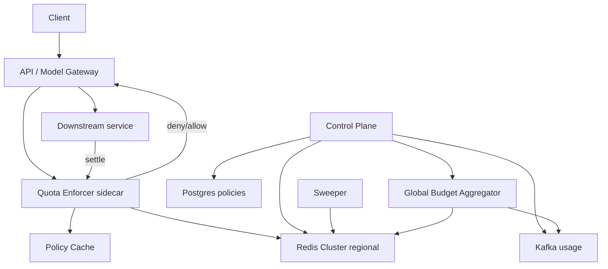

# System Design: Hierarchical Quotas

> **Focus areas:** Multi-level limits · Atomic multi-key reservation · Fairness · Soft vs hard · Regional aggregation · Burst vs sustained  
> **Style:** Control-plane + data-plane quota enforcement with progressive scale (10× → 100× → 1,000×)  
> **Domain:** User → team → tenant → API → region hierarchies for RPM/TPM/concurrency/spend-style meters

---

## Table of Contents

1. [Clarify Requirements (Interview Q&A)](#1-clarify-requirements-interview-qa)
2. [Back-of-the-Envelope Estimation](#2-back-of-the-envelope-estimation)
3. [High-Level Design](#3-high-level-design)
4. [Architecture Diagram](#4-architecture-diagram)
5. [Design Deep Dive](#5-design-deep-dive)
6. [Wrap-Up](#6-wrap-up)
7. [Deeper / Related Interview Questions](#7-deeper--related-interview-questions)

---

## 1. Clarify Requirements (Interview Q&A)

The goal of this phase is to **bound the problem**: what hierarchy we enforce, what meters we track, and how wrong we are allowed to be under failure.

### 1.0 What this is / is not

| This is | This is not |
|---------|-------------|
| A hierarchical **quota & admission** service: reserve → consume → release across nested scopes | A full billing ledger / invoicing system (that consumes settled usage) |
| Enforcement for RPM, TPM, concurrency, optional spend caps | Pure per-IP WAF rate limiting (orthogonal, often edge-local) |
| Strong enough for multi-tenant SaaS / LLM API platforms | Exact-once global accounting with CAP-perfect consistency under partition |
| Hot-path check in ~1–3 ms p99 (regional) | A batch ETL job that “eventually” blocks abuse after hours |

### 1.1 Functional Requirements

| # | Question to ask | Expected / typical interviewer answer | Design implication |
|---|-----------------|----------------------------------------|--------------------|
| F1 | What hierarchy? | **User ⊂ Team ⊂ Tenant**; plus **API product** and **Region** dimensions that intersect the org tree | Model as a **DAG of scopes**, not a single linked list; evaluate all applicable limiters |
| F2 | What meters? | RPM (requests/min), TPM (tokens/min), concurrent in-flight, optional daily/monthly budget units | Separate counter families; different algorithms (sliding window vs token bucket vs gauges) |
| F3 | Soft vs hard limits? | Soft: warn + throttle; Hard: `429` / reject; some tenants get burst headroom | Policy object per limit: `{hard, soft, burst_factor, overage_mode}` |
| F4 | Atomic multi-level admit? | Must not over-admit when user OK but tenant exhausted (and vice versa) | **All-or-nothing reservation** across keys; rollback on partial failure |
| F5 | Estimate then reconcile? | Yes for TPM/spend—reserve estimate at admit, settle actual at completion | Reservation TTL + sweeper; idempotent settle by `request_id` |
| F6 | Who configures quotas? | Platform defaults + tenant overrides + team inheritance + user overrides | Versioned policy store; inheritance with explicit override precedence |
| F7 | Fail-open or fail-closed? | Prefer **fail-closed for hard commercial caps**; fail-open only for soft/internal with circuit breakers | Explicit `fail_mode` per limit class; never silent unlimited |
| F8 | Cross-region semantics? | Regional enforcement for latency; **global caps** for tenant spend / monthly | Local fast path + async global reconciler with safety margin |
| F9 | Fairness under contention? | One noisy team must not starve sibling teams under a tenant cap | Weighted fair share / borrowing within parent; isolate abusive children |
| F10 | Burst allowed? | Yes for RPM (short spikes); monthly budgets usually not burstable across period end | Token bucket for burst; fixed window or ledger for period budgets |
| F11 | Idempotency? | Retries must not double-charge reservations | `reservation_id` / `request_id` dedupe; settle exactly once |
| F12 | Visibility? | Remaining quota headers + admin dashboards + alerts at soft thresholds | `X-RateLimit-*` / `Retry-After`; usage events to analytics |
| F13 | Priority / reserved capacity? | Enterprise tenants get guaranteed floor; free tier best-effort | Separate **guaranteed** vs **burst** pools under parent |
| F14 | Override / emergency? | Ops can temporarily raise limits or kill-switch a tenant | Audit-logged policy mutations; kill-switch as hard deny rule |

**MVP functional scope (lock this with interviewer):**

1. Hierarchy: `user → team → tenant`, crossed with `api` and `region`.
2. Meters: RPM, TPM (estimate+settle), concurrency.
3. Hard reject with `429` + remaining headers; soft alerts at configurable %.
4. Atomic reserve across all applicable scopes; release/settle on terminal.
5. Policy CRUD with inheritance + override; versioned configs.
6. Regional Redis/cluster hot path; Postgres as policy + audit SoT.
7. Sweeper for expired reservations; basic admin “usage remaining” API.

**Out of MVP (explicitly defer):**

- Perfect global exactness for monthly spend under multi-region partition (use safety buffer)
- Full chargeback / invoice generation
- ML-based anomaly quotas
- Per-endpoint custom Lua plugins from customers
- Guaranteed cross-AZ synchronous 3PC for every admit

### 1.2 Non-Functional Requirements

| # | Question | Expected answer | Target |
|---|----------|-----------------|--------|
| N1 | Admit latency? | Must not dominate API p99 | p50 < 1 ms, p99 < 3 ms in-region (Redis path) |
| N2 | Availability? | Quota outage = product outage for hard caps | 99.99% regional data plane; control plane 99.9% |
| N3 | Over-admit bound? | Occasional small overage OK; unbounded not OK | Hard caps: ≤ 0.1–1% over-admit under normal; bounded under partition via local ceiling |
| N4 | Under-admit? | Prefer slight under-admit vs large over-admit for paid caps | Safety margin on global budgets (e.g. 95% local of global) |
| N5 | Consistency? | Policy: strong read-your-writes for admins; counters: high-throughput approximate OK with bounds | Policy from versioned cache; counters Redis atomic |
| N6 | Multi-region? | Active-active admit per region; global monthly/tenant caps coordinated | Regional shards + global aggregator |
| N7 | Durability? | Counters can be rebuilt from settle events; policies durable | Redis AOF/replication; Postgres policies; Kafka usage log |
| N8 | Security? | Tenants cannot raise own hard caps; no cross-tenant leak | AuthZ on policy APIs; scoped keys; audit |
| N9 | Cost? | Hot path cheap; don’t call Postgres per request | Redis + local policy cache; batched analytics |

### 1.3 Cases (User Flows & Edge Cases)

**Happy paths**

1. Request arrives → resolve scopes (user, team, tenant, api, region) → load policy version → reserve all meters → allow → settle actual TPM → release concurrency.
2. Soft limit crossed → allow with warning headers + emit alert event; hard still OK.
3. Hard tenant TPM exhausted → `429` with which scope failed + `Retry-After`.
4. Admin raises team RPM → policy version bumps → cache invalidation within seconds → new admits use new limit.
5. Request cancelled mid-flight → release concurrency + unused reservation; settle partial tokens if any.

**Edge / failure cases**

| Case | Behavior |
|------|----------|
| Partial multi-key reserve fails mid-way | Rollback already reserved keys; return deny |
| Duplicate admit with same `request_id` | Return original reservation decision (idempotent) |
| Settle after reservation TTL expiry | Sweeper already released; settle is no-op or adjusts from usage log |
| Redis shard unavailable | Fail-closed for hard commercial; degrade soft limits; circuit breaker |
| Clock skew across nodes | Prefer Redis server time / logical windows; avoid client wall clocks |
| Hot tenant (one key) | Shard counters by time buckets; optional local token cache with replenish |
| Team deleted while in-flight | Reservations settle against frozen policy snapshot id |
| Region split-brain for global budget | Each region enforces `floor(global * weight * safety)`; reconciler corrects |
| Negative settle / refund | Compensating increment; never silent ignore |
| Policy rollback | Pin admits to `policy_version`; don’t mix mid-flight |

### 1.4 Scales (Progressive)

| Metric | Baseline | 10× | 100× | 1,000× |
|--------|----------|-----|------|--------|
| Tenants | 10K | 100K | 1M | 10M |
| Active users (daily) | 100K | 1M | 10M | 100M |
| Admit checks / sec (peak) | 50K | 500K | 5M | 50M |
| Scopes touched / admit (avg) | 5 | 5 | 6 | 6–8 |
| Redis ops / admit | ~10–20 | ~10–20 | ~10–20 | need pipelining / Lua / local cache |
| Distinct hot keys | 50K | 500K | 5M | 50M |
| Policy updates / day | 1K | 10K | 100K | 1M |
| Global budget reconciles / min | 1K tenants | 10K | 100K | 1M |
| Usage events / sec | 50K | 500K | 5M | 50M |

**What each jump forces architecturally:**

- **10×:** Redis Cluster; Lua multi-key scripts or careful pipelines; policy cache on enforcers; Kafka for usage.
- **100×:** Shard by `tenant_id`; regional cells; local burst caches; async global budgets with weights.
- **1,000×:** Hierarchical aggregation trees; per-tenant dedicated partitions for whales; approximate sketches for cold scopes; cell-local enforcement + global control plane.

### 1.5 Etc. (Constraints & Assumptions)

- **Cloud:** Single primary cloud, multi-AZ Redis/Postgres.
- **Caller:** API Gateway / Model Gateway calls Quota Service synchronously on hot path.
- **Currency of budgets:** Abstract “units” (tokens or micros); FX/billing elsewhere.
- **Inheritance:** Child cannot exceed parent hard cap (clamp); child can be tighter.
- **Timezone for daily limits:** Tenant-configured TZ or UTC—document clearly.

**Scope statement to repeat back:**

> Design a hierarchical quota service enforcing RPM/TPM/concurrency across user → team → tenant, crossed with API and region. Hot-path atomic reserve/settle with regional Redis, durable policies in Postgres, and bounded over-admit for global budgets. MVP fails closed on hard caps, exposes remaining quota, and scales from ~50K to ~50M admits/sec with progressive sharding.

---

## 2. Back-of-the-Envelope Estimation

### 2.1 Admit QPS and Redis ops

```text
Baseline peak admits: 50,000 / s
Scopes/admit: user, team, tenant, api, region → ~5 scopes
Meters: RPM + TPM + concurrency → 3 families

Naive ops: 50K × 5 × (reserve + later settle) × ~2 ≈ millions of Redis cmds/s
→ Must use MULTI-KEY Lua / pipelines: ~1–2 RTTs per admit, not 30
```

Target: **one Redis round-trip** (Lua) for reserve across keys co-located by tenant hash tag.

### 2.2 Key cardinality

```text
Active keys ≈ active_users × meters × windows
Baseline: 100K users × 3 meters × 2 windows ≈ 600K keys (plus teams/tenants)

1,000× users: 100M × 3 × 2 ≈ 600M keys → cannot keep all hot forever
→ TTL idle keys; aggregate cold users into tenant-only enforcement optionally
```

### 2.3 Memory

```text
Counter entry ≈ 64–128 B (key overhead dominates)
Baseline hot set 1M keys × 128 B ≈ 128 MB (+ replicas)
1,000× if naively 600M keys × 128 B ≈ 75 GB → still OK if clustered, but
  operationally prefer TTL + hierarchical rollup to shrink hot set
```

### 2.4 Bandwidth

```text
Admit RPC ~200 B req + 150 B resp = 350 B
50K × 350 B ≈ 17.5 MB/s ≈ 140 Mbps
50M admits/s → 140 Gbps → must be co-located sidecar / library, not cross-DC RPC
```

At 1,000×, **quota enforcement must be a regional library or sidecar**, not a central remote service per request.

### 2.5 Policy cache

```text
Policy per tenant ~2–10 KB (limits tree)
10K tenants × 5 KB = 50 MB — fits in every enforcer
1M tenants → lazy load + LRU; push invalidation via pub/sub
```

### 2.6 Global budget reconciliation

```text
1M tenants × reconcile every 10s = 100K updates/s to aggregator
→ Shard aggregators by tenant hash; push regional deltas, not pull all
```

### 2.7 Hot key math

Single whale tenant at 10% of traffic:

```text
Baseline: 5K admits/s on one tenant’s keys
Redis single key ~100K–500K INCR/s depending on size
→ Shard: tenant:{id}:rpm:{slot} with N slots, or local token buckets replenished from parent
```

---

## 3. High-Level Design

### 3.1 Domain model

```text
Scope:
  type: USER | TEAM | TENANT | API | REGION | COMPOSITE
  id: string
  parent?: ScopeRef          # org tree edges
  dimensions: {api?, region?} # cross-cutting

LimitPolicy:
  scope_ref
  meter: RPM | TPM | CONCURRENCY | BUDGET_UNITS
  window: SLIDING_1M | FIXED_DAY | FIXED_MONTH | GAUGE
  hard_limit, soft_limit
  burst_factor
  fail_mode: CLOSED | OPEN_SOFT
  weight / guaranteed_floor   # fairness under parent
  version

Reservation:
  reservation_id (idempotent = request_id)
  scopes[] + amounts[]
  expires_at
  state: HELD | SETTLED | RELEASED | EXPIRED

UsageEvent:
  request_id, tenant_id, amounts actual, timestamps
```

**Precedence:** most specific override wins for the child’s own cap; **parent hard caps always clamp** children.

### 3.2 Evaluation order

```text
1. Resolve identity → user, teams[], tenant, api, region
2. Expand applicable scopes (incl. COMPOSITE keys like tenant+api+region)
3. Load LimitPolicy set at policy_version (cached)
4. Compute required units (RPM=1, concurrency=1, TPM=estimate)
5. RESERVE all-or-nothing (Lua / txn)
6. On success → allow; on fail → 429 with failing_scope
7. On terminal → SETTLE(actual) + release concurrency
```

### 3.3 Algorithms by meter

| Meter | Algorithm | Why |
|-------|-----------|-----|
| RPM | Sliding window log or windowed counters | Burst control with smooth reject |
| TPM | Token bucket + settle adjust | Estimate≠actual; need reconcile |
| Concurrency | Atomic gauge INCR/DECR with max | In-flight hard stop |
| Daily/Monthly budget | Fixed window counter + global aggregator | Period boundaries matter |

**Sliding window counter (practical):**

```text
weight = (1 - elapsed/window) * prev_bucket + curr_bucket
if weight + cost > limit → deny
```

Cheaper than storing every timestamp; accurate enough for RPM.

### 3.4 Atomic multi-scope reservation

**Problem:** reserve user OK, then tenant fails → must undo user.

**Options:**

| Option | Pros | Cons | Choice |
|--------|------|------|--------|
| Redis Lua multi-key | Atomic, fast | Keys must hash-tag same slot | **Default for regional** |
| Redis transactions WATCH | Familiar | More races under contention | Avoid |
| Central lock per tenant | Simple | Hot lock bottleneck | Only for whales if needed |
| Two-phase (hold then commit) | Cross-shard | Latency, complexity | 100×+ global |

**Hash tag strategy:** `{tenant_id}` prefix on all keys for that tenant so Lua can touch user/team/tenant keys in one slot. Extremely large tenants: dedicated Redis cluster / slot ranges.

### 3.5 Soft vs hard & fairness

```text
Under tenant hard TPM = 1M:
  Team A weight 70%, Team B 30%
  Guaranteed floors: A 700K, B 300K of parent
  Borrowing: unused floor can be borrowed by sibling up to soft, not past parent hard
```

Implement as **hierarchical token buckets**: parent bucket; children draw; unused regenerates to parent pool.

### 3.6 Global vs regional

```text
Regional (RPM, concurrency, most TPM): enforce locally in region Redis
Global (monthly spend, tenant-wide hard commercial):
  each region gets quota_slice = f(historical share, safety_margin)
  regional admits consume local slice
  aggregator redistributes every T seconds based on demand
```

**Deal-breaker:** claiming “strong global exact monthly cap” with multi-region active-active and no safety margin—impossible under partition. Be explicit: **bounded overspend** or **single-writer budget region**.

### 3.7 APIs

| Method | Path | Purpose |
|--------|------|---------|
| POST | `/v1/quotas/reserve` | Atomic multi-scope reserve |
| POST | `/v1/quotas/settle` | Settle actual + release |
| POST | `/v1/quotas/release` | Cancel / release held |
| GET | `/v1/quotas/usage` | Remaining for scopes |
| PUT | `/v1/policies/{scope}` | Upsert limits (admin) |
| GET | `/v1/policies/{scope}` | Effective resolved policy |
| POST | `/v1/quotas/check` | Dry-run (optional) |

**Reserve request (sketch):**

```json
{
  "request_id": "req_...",
  "principal": {"user_id":"u","team_id":"t","tenant_id":"ten"},
  "api": "chat.completions",
  "region": "us-east-1",
  "costs": {"rpm": 1, "tpm_estimate": 2500, "concurrency": 1},
  "ttl_ms": 300000
}
```

**Response:**

```json
{
  "allowed": false,
  "reservation_id": null,
  "failed_scope": {"type":"TENANT","id":"ten","meter":"TPM"},
  "retry_after_ms": 1200,
  "remaining": {"tenant.tpm": 0, "user.rpm": 40}
}
```

### 3.8 Component architecture

```text
API Gateway / Model Gateway
        |
        v
 Quota Enforcer (sidecar or library)  --local policy cache-->
        |  Redis Cluster (regional, hash-tagged by tenant)
        v
 Quota Control Plane API
        |-- Postgres (policies, audit)
        |-- Kafka (usage, policy change events)
        |-- Global Budget Aggregator (sharded)
        |-- Reservation Sweeper
```

### 3.9 Trade-offs

| Decision | Choose | Over | Why | Deal-breaker if wrong |
|----------|--------|------|-----|------------------------|
| Hot path store | Redis Cluster + Lua | Postgres per admit | Latency | Postgres = multi-ms + conn death |
| Placement | Regional sidecar | Central remote quota RPC | Bandwidth at 1,000× | Cross-region RTT kills p99 |
| Global caps | Sliced + safety | Sync 2PC every admit | Availability | 2PC outage = global outage |
| Fairness | Weighted floors + borrow | Pure race to parent | Noisy neighbor | One team starves others |
| Idempotency | request_id ledger (Redis TTL + PG for settle) | None | Retries double-bill | Billing disputes |

### 3.10 Progressive scale evolution

- **Baseline:** Single Redis, enforcer service, Postgres policies.
- **10×:** Redis Cluster; Lua; Kafka usage; policy pub/sub.
- **100×:** Enforcer as sidecar; tenant hash tags; global budget aggregator; whale isolation.
- **1,000×:** Cell-local quota; hierarchical aggregation; approximate cold-path; per-tenant clusters for top-N.

---

## 4. Architecture Diagram

### 4.1 End-to-end



### 4.2 Reserve sequence

```text
Gateway          Enforcer           Redis Lua              Kafka
   |                |                  |                     |
   | reserve        |                  |                     |
   |--------------->| load policy cache|                     |
   |                | EVALSHA reserve  |                     |
   |                |----------------->|                     |
   |                |  OK / DENY       |                     |
   |                |<-----------------|                     |
   | allow/429      |                  |                     |
   |<---------------|                  |                     |
   | ... work ...   |                  |                     |
   | settle         |                  |                     |
   |--------------->|----------------->| adjust TPM, -conc   |
   |                |--------------------------------------->|
```

### 4.3 Hierarchy evaluation

```text
                    [Tenant hard TPM]
                     /            \
            [Team A floor]    [Team B floor]
                  |                 |
              [User limits]     [User limits]
                  \                 /
              × API dimension × REGION dimension
```

---

## 5. Design Deep Dive

### 5.1 Reliability

#### 5.1.1 Invariants

1. **No admit without successful reserve** for configured hard meters.
2. **All-or-nothing multi-scope reserve** (atomic script or rollback).
3. **Idempotent reserve/settle** on `request_id`.
4. **Concurrency gauge never permanently leaked** (TTL + sweeper).
5. **Child hard ≤ parent hard** after resolve.
6. **Settle cannot invent capacity** beyond refunds of prior holds.

#### 5.1.2 Reservation leak prevention

```text
HOLD with PEXPIRE on reservation record
Sweeper scans expired holds → compensating DECR on gauges / return tokens
Settle is idempotent: if already RELEASED/EXPIRED, apply usage-only adjustment carefully
```

#### 5.1.3 Dual-write: Redis counters vs billing

Redis is **enforcement**, not billing SoT. Emit `UsageEvent` to Kafka; billing ledger consumes. If Redis loses data, rebuild approximate windows from events; commercial invoices come from ledger.

#### 5.1.4 Retries & races

| Race | Handling |
|------|----------|
| Double settle | Idempotency key → second settle no-op |
| Settle before reserve visible | Store reserve intent first; settle requires held state |
| Policy change mid-flight | Reservation stores `policy_version`; settle uses held amounts |
| Release vs settle | CAS on reservation state machine |

#### 5.1.5 Fail-open vs fail-closed

| Limit class | Mode |
|-------------|------|
| Paid monthly budget / contractual TPM | Fail-closed |
| Best-effort free tier soft RPM | May fail-open briefly with alarm |
| Internal dogfood | Configurable |

Always emit **high-severity alert** on fail-open paths.

#### 5.1.6 Backpressure

When Redis latency spikes: shed check with `503` + `Retry-After`, or enter **degraded local token bucket** mode with conservative defaults (under-admit). Never infinite queue admits.

### 5.2 Scalability

#### 5.2.1 Sharding

- **Primary shard key:** `{tenant_id}` for co-located hierarchy keys.
- **Whale tenants:** dedicated Redis DB/cluster; more slots; local admission caches.
- **Global aggregator:** shard by `hash(tenant_id) % N`.

#### 5.2.2 Hot keys

Techniques:

1. **Split counters** into `N` sub-buckets; admit picks random bucket; limit = ceil(L/N) + shared overflow bucket.
2. **Local CL (consumer-level) tokens:** enforcer holds a chunk of 50–500 units, replenishes from Redis less often (bounded over-admit = chunk size × enforcers—tune carefully).
3. **Hierarchical rollup:** enforce only tenant+team for tiny users; materialize user keys on demand.

#### 5.2.3 Local caching trade-off

| Approach | Over-admit bound | Latency |
|----------|------------------|---------|
| Always Redis | ~0 (single cluster) | +1 RTT |
| Local chunks | `chunk × enforcer_count` | Sub-ms |
| Eventually consistent CRDT counters | Unbounded without care | Low |

**Choice:** Redis Lua default; local chunks only for top RPM APIs with explicit error budget.

#### 5.2.4 Multi-region global budgets

```text
Safety design:
  global_limit = G
  regions R1..Rk with weights w_i (sum 1)
  local_ceiling_i = G * w_i * safety  # safety=0.9
  unused slices rebalanced every 5–30s
  emergency: freeze regions exceeding share by hard stop
```

Single-writer alternative: all budget mutations in home region—simpler exactness, worse latency/availability.

#### 5.2.5 Scale jump checklist

| Jump | Action |
|------|--------|
| 10× | Cluster + Lua + Kafka |
| 100× | Sidecar, slices, whale isolation |
| 1,000× | Cells, approx cold path, per-tenant infra |

### 5.3 Maintainability

#### 5.3.1 Policy resolution & testing

- Golden tests for inheritance/clamp/override matrices.
- `GET effective policy` debug endpoint for support.
- Shadow mode: compute decision without enforce; compare.

#### 5.3.2 Observability

| Signal | Cardinality note |
|--------|------------------|
| admit_allowed / denied by meter | Low if by api+region not user |
| redis_rtt_ms | Histogram |
| reservation_leak_count | Counter |
| global_slice_utilization | Per region |
| top_denied_tenants | Bounded gauge scrape |

Avoid per-user Prometheus labels.

#### 5.3.3 Migrations

- Additive meters via new key namespaces.
- Window algorithm changes behind flag with dual-run.
- Redis key format version prefix `v2:`.

#### 5.3.4 Multi-tenant ops

- Kill-switch deny rule in policy.
- Soft-limit alert webhooks.
- Export usage for chargeback (to finance systems).

---

## 6. Wrap-Up

### 6.1 Decision summary

| Area | Decision |
|------|----------|
| Hierarchy | User → team → tenant × api × region |
| Hot path | Regional Redis Cluster + atomic Lua reserve |
| Algorithms | Sliding window RPM, token bucket TPM, gauge concurrency |
| Global caps | Weighted regional slices + safety margin |
| SoT | Postgres policies; Kafka usage; Redis enforcement |
| Failure | Fail-closed hard caps; sweeper for leaks |
| Scale | Sidecar at 100×; cells + whale clusters at 1,000× |

### 6.2 Phased rollout

1. **Phase 0:** Single-level tenant RPM in Redis (learn ops).
2. **Phase 1:** Full hierarchy + concurrency + settle TPM.
3. **Phase 2:** Fairness weights, soft limits, admin UX.
4. **Phase 3:** Global budget aggregator + multi-region slices.
5. **Phase 4:** Sidecar/library path; whale isolation; approx cold tiers.

### 6.3 Interview closing line

> Quotas are a **distributed admission control** problem: atomic multi-key reserve, explicit soft/hard semantics, and honest bounds on global consistency—not a single Redis `INCR`.

---

## 7. Deeper / Related Interview Questions

1. **Why not check scopes sequentially without rollback?**  
   Partial admit over-grants parent capacity; causes systemic overage and unfairness.

2. **How do you implement sliding window without storing every request timestamp?**  
   Two-bucket weighted counter; or Redis sorted sets with periodic trim for strictness.

3. **Token bucket vs leaky bucket for RPM?**  
   Token bucket allows controlled burst; leaky bucket smooths egress—APIs usually want token bucket.

4. **How does estimate-vs-actual TPM settlement work?**  
   Reserve high-percentile estimate; on settle, return unused or charge extra if within overage policy; if actual ≫ estimate, penalize future admits / hard cut stream.

5. **Can child limit exceed parent?**  
   No for hard caps—clamp at resolve time; config UI should reject or warn.

6. **How to avoid hot-key death on a celebrity tenant?**  
   Counter sharding, local chunks, dedicated cluster, request coalescing.

7. **Fail-open during Redis outage—when is it ethical?**  
   Only non-contractual soft limits; paid hard caps fail-closed or use cached conservative residual.

8. **How do global monthly caps work under partition?**  
   Pre-split slices with safety; accept bounded overspend or freeze to single writer.

9. **What’s the difference between rate limit and quota?**  
   Rate limit: short-window throttle; quota: longer budget / allocation; both appear in hierarchy.

10. **How do you test multi-key Lua correctness?**  
   Property tests: random admit/deny sequences; invariant sum(children) ≤ parent + ε.

11. **Where does authZ live relative to quotas?**  
   AuthN/Z first; quota second—don’t spend quota on unauthorized calls (or meter separately for abuse).

12. **How do reserved floors interact with bursting?**  
   Floors guaranteed; burst from shared leftover; never exceed parent hard.

13. **Idempotency store growth?**  
   TTL ≈ max request duration + settle grace; durable settle log compacted by time.

14. **Consistent hashing for enforcers?**  
   Enforcers are mostly stateless; stickiness optional for local chunk efficiency, not correctness.

15. **How to expose remaining quota without racing?**  
   Return post-reserve remaining; document as approximate under concurrency.

16. **CRDT counters for quotas?**  
   Great for analytics; dangerous for hard commercial caps without bounds.

17. **How do you handle refunds / partial stream cancel?**  
   Compensating settle; concurrency always released; TPM refund unused.

18. **Multi-team user membership?**  
   Pick primary team or evaluate max/min policy—product decision; document.

19. **What’s a good `Retry-After`?**  
   Derived from window refill estimate for failing meter, not a constant 60s.

20. **How does this relate to load shedding?**  
   Quotas are per-tenant fairness; load shedding is system-wide survival—both layers needed.

21. **Postgres as counter store?**  
   `UPDATE counters` row locks kill throughput; use only for slow budget reconciles.

22. **How to migrate from flat to hierarchical without downtime?**  
   Dual-write decisions in shadow; enforce hierarchy when error budgets match.

23. **Memory blow-up from per-user keys?**  
   TTL + hierarchical collapse for inactive users; bloom filter “has custom user limit”.

24. **Clock jump forward 1 hour?**  
   Prefer Redis TIME; fixed windows may skip—emit metric; don’t trust client time.

25. **How would you support “unlimited” enterprise with fair use?**  
   Soft astronomical caps + anomaly detection + human review—not literal INT_MAX without monitoring.
