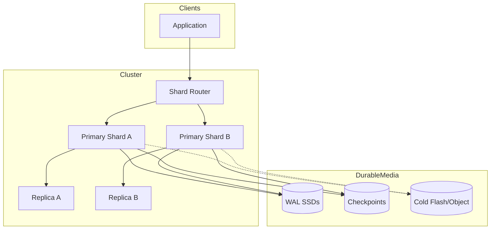
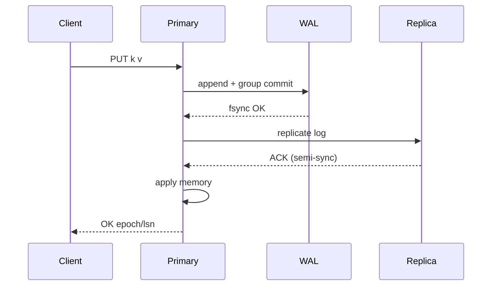

# System Design: In-Memory Database

> **Focus areas:** Memory as primary store · WAL/checkpoint durability · Indexes in RAM · Transactions & MVCC · Replication · Failover · Spill-to-disk · NUMA · Cost vs DRAM  
> **Style:** End-to-end platform design with progressive scale (10× → 100× → 1,000×)  
> **Quality bar:** Honest durability model; IMDB ≠ cache; recovery time; when to spill vs shard

---

## Table of Contents

1. [Clarify Requirements (Interview Q&A)](#1-clarify-requirements-interview-qa)
2. [Back-of-the-Envelope Estimation](#2-back-of-the-envelope-estimation)
3. [High-Level Design](#3-high-level-design)
4. [Architecture Diagram](#4-architecture-diagram)
5. [Design Deep Dive](#5-design-deep-dive)
6. [Wrap-Up](#6-wrap-up)
7. [Deeper / Related Interview Questions](#7-deeper--related-interview-questions)

---

## 1. Clarify Requirements (Interview Q&A)

Design an **in-memory database (IMDB)**: a system where the working dataset lives in RAM for micro/millisecond access, with an explicit durability and recovery story—distinct from a best-effort cache and from a disk-first RDBMS.

### 1.0 What this is / is not

| Dimension | This design | Not this |
|-----------|-------------|----------|
| Job | Primary data store with RAM-resident working set | Volatile cache (see Distributed Cache) |
| Durability | WAL + checkpoints / snapshots; defined RPO | “Memory only, lose on restart” unless opted in |
| Query model | KV + optional SQL/secondary indexes | Full warehouse / column analytics at PB |
| Examples | Redis-as-DB (careful), Memcached+persistence≠IMDB, VoltDB, memSQL/SingleStore H+A, SAP HANA niche, Aerospike hybrid | Pure memcached |
| Failure | Restart recovers from log/snapshot | Cold miss to another SoT |

### 1.1 Functional Requirements

| # | Question to ask | Expected / typical interviewer answer | Design implication |
|---|-----------------|----------------------------------------|--------------------|
| F1 | Data model? | KV first; tables/SQL optional phase | Row format + index structures in RAM |
| F2 | Durability? | Yes — acknowledged writes survivable | WAL before ACK; checkpointing |
| F3 | Transactions? | Single-key atomic MVP; multi-key ACID optional | MVCC or OCC; deadlock policy |
| F4 | Indexes? | PK always; secondary optional | Memory cost of indexes first-class |
| F5 | Query types? | Point get/put, range on PK, limited secondary | Not arbitrary OLAP |
| F6 | TTL / eviction? | Optional TTL; **no** LRU eviction of durable data by default | Eviction ≠ IMDB primary mode |
| F7 | Replication? | Sync or semi-sync options + async | RPO/RTO knobs |
| F8 | HA failover? | Automatic primary election | Fencing; see leader election |
| F9 | Larger-than-RAM? | Hybrid spill / cold tier Phase 2 | Admission + paging policy |
| F10 | Multi-tenant? | Namespaces / databases | Quotas in bytes & CPU |
| F11 | Backup? | Snapshot + WAL archive | PITR window |
| F12 | Clients? | RESP or SQL wire; prepared stmts | Pipelining / batch |
| F13 | Consistency? | Linearizable primary reads; replica lag documented | Read-your-writes on primary |

**MVP functional scope:**

1. Durable KV: `GET/PUT/DEL` with optional TTL **metadata** (not cache-evict).
2. WAL-acked writes; periodic checkpoint/snapshot for fast restart.
3. Primary + async/semi-sync replicas; automatic failover with fencing.
4. Primary-key indexes in memory; optional one secondary index type.
5. Single-key atomicity; simple compare-and-set.
6. Backup/restore; metrics for memory, lag, recovery.
7. Multi-namespace quotas.

**Out of MVP:**

- Full ANSI SQL + complex joins/analytics
- Cross-region sync linearizability
- Transparent huge-dataset paging without SLO loss
- Byzantine fault tolerance
- Replacing a lakehouse

### 1.2 Non-Functional Requirements

| # | Question | Expected answer | Target |
|---|----------|-----------------|--------|
| N1 | Point-read latency? | In-AZ RAM | p50 < 0.2–1 ms; p99 < 2–5 ms |
| N2 | Durable write latency? | WAL fsync policy | p50 < 1–3 ms (group commit); `sync` stricter |
| N3 | Availability? | Multi-AZ | 99.95–99.99% with failover |
| N4 | Durability RPO? | Configurable | 0 (sync quorum) or ~sub-second (group commit) |
| N5 | Recovery RTO? | Load checkpoint + replay | Minutes for 100s GB; design for parallel replay |
| N6 | Consistency? | Primary linearizable | Replica reads optional stale |
| N7 | Memory efficiency? | Compact rows + index | Overhead budget < 2× raw |
| N8 | Cost? | DRAM expensive | Hybrid tier at scale; right-size |

### 1.3 Cases

**Happy paths**

1. PUT → WAL group commit → apply memtable/row → ACK → replicate.
2. GET from RAM index → return.
3. Checkpoint completes; old WAL truncated.
4. Primary fails → elect → fence → clients reconnect → continue.
5. Restore from snapshot+WAL to new node.

**Edge / failure cases**

| Case | Behavior |
|------|----------|
| Crash mid-write | Unacked write lost; acked found in WAL |
| Disk full on WAL | Reject writes; preserve durability invariant |
| Replica lag storm | Lag alerts; block writes if semi-sync policy |
| Memory pressure | Reject or spill cold (if enabled); **never silently drop durable keys** |
| Long GC / compaction pause | Tail latency spike; prefer off-heap / careful allocators |
| NUMA imbalance | Throughput collapse — pin & allocate local |
| Secondary index inconsistency | Same TX as base row; rebuild tools |
| Split brain primaries | Epoch fencing on WAL/replica accept |
| Huge scan | Rate-limit; secondary path to disk/analytics |
| Clock skew | Logical timestamps / HLC for MVCC |

### 1.4 Scales (Progressive)

| Metric | Baseline | 10× | 100× | 1,000× |
|--------|----------|-----|------|--------|
| Working set | 500 GB | 5 TB | 50 TB | 500 TB |
| Durable ops/s | 50K | 500K | 5M | 50M |
| Point gets/s | 500K | 5M | 50M | 500M |
| Tables / namespaces | 20 | 100 | 500 | multi-cell |
| Secondary indexes | few | more selective | sharded | careful |
| Nodes (primaries) | 3–6 | 20–40 | hundreds | thousands |
| Recovery dataset | 500 GB | 5 TB | 50 TB | per-shard ≤ TB |
| Regions | 1 | 2 | cells | global cells |

**What each jump forces:**

- **10×:** Shard by key; parallel WAL devices; replica read policy clarity.
- **100×:** Cell-local IMDBs; hybrid cold tier; faster checkpoint incremental.
- **1,000×:** Many shards with ≤1–2 TB RAM each for recoverability; avoid monolith 500 TB single process.

### 1.5 Etc.

- Distinctions: **IMDB** (SoT in RAM+WAL) vs **cache** (optional) vs **Redis profiles** (can be either).
- Language/runtime: prefer predictable memory (C++/Rust/Java offheap) — interview-level.
- **Scope repeat-back:**

> Design a durable **in-memory database** for point-heavy OLTP: RAM-resident rows/indexes, WAL+checkpoint durability, replication/failover with fencing, optional secondary indexes and later hybrid spill—scaling by sharding to keep recovery and DRAM cost bounded.

---

## 2. Back-of-the-Envelope Estimation

### 2.1 Memory budget

```text
Raw row data: 500 GB
Primary index: ~10–20% (depends key size)
Secondary index: ~20–50% per index on covered columns
MVCC versions / fragmentation: +20–40%
→ Plan ~500 GB × 1.8–2.5 ≈ 1–1.25 TB RAM for 500 GB logical
```

### 2.2 WAL throughput

```text
50K durable writes/s × 200 B payload ≈ 10 MB/s WAL
Group commit batches → fsync 100–1000×/s not per write
At 5M writes/s → 1 GB/s WAL → shard + multiple log devices
```

### 2.3 Checkpoint I/O

```text
Full snapshot 500 GB to SSD at 2 GB/s ≈ 250 s — too slow if frequent
→ Incremental checkpoint / copy-on-write segment freeze
```

### 2.4 Recovery

```text
Load 500 GB snapshot @ 2 GB/s ≈ 250 s + WAL replay
Target shard size so RTO < 15–30 min including safety
1,000× fleet: recover shards in parallel, not one huge dataset
```

### 2.5 Cost sketch

```text
DRAM cloud ≈ many × $/GB vs SSD
If 70% of data cold, hybrid spill can cut bill dramatically
Interview: show you won't put 500 TB all in RAM blindly
```

### 2.6 Bandwidth gets

```text
500K gets/s × 500 B ≈ 250 MB/s
Easy for one node; at 500M/s need massive fanout / cells
```

---

## 3. High-Level Design

### 3.1 Core components

```text
Client API
  → Query / KV Router (shard by key)
    → Primary Node
         ├── Memory Table / Row Store
         ├── Indexes (PK, secondary)
         ├── Txn Manager (locks / MVCC / OCC)
         ├── WAL + Group Committer
         ├── Checkpointer
         └── Replication Sender
    → Replicas (apply log)
    → Cold Tier (optional): flash / object for spilled segments
```

### 3.2 Storage layout (RAM)

| Structure | Role |
|-----------|------|
| Row arena / slab | Compact rows, reduce malloc churn |
| PK hashmap / B+tree | Point & range |
| Secondary btree/hash | Optional queries |
| Version chains | MVCC snapshots |
| Free lists | Reclaim after GC horizon |

**Trade-off:** hashmap PK = fastest point; B+tree = ranges. Many IMDBs offer both or tree-only.

### 3.3 Durability path

```text
Write request
  → serialize into WAL buffer (group commit)
  → fsync policy: always | group interval | quorum replica ACK
  → apply to memory structures
  → ACK client
```

**Invariant:** never ACK durable write before WAL (and configured replica) durability criteria.

### 3.4 Checkpointing

| Strategy | Pros | Cons |
|----------|------|------|
| Full snapshot | Simple | Long; COW spikes |
| Incremental segments | Faster | Complexity |
| Fuzzy checkpoint + WAL | Concurrent | Longer replay |

Goal: bound recovery to `checkpoint + small WAL`.

### 3.5 Concurrency control

| Method | Pros | Cons | Use |
|--------|------|------|-----|
| Single-threaded shard | Simple atomicity | Core-bound | Redis-like shards |
| 2PL | Familiar | Deadlocks | Multi-key TX |
| MVCC + OCC | Readers don’t block | GC versions | SQL IMDB |
| Deterministic scheduling | No locks | Restrictive | VoltDB-style |

**MVP:** shard single-key atomic + CAS; multi-key TX in Phase 1.5 with hash-tag co-location or 2PC within cell.

### 3.6 Replication

| Mode | RPO | Latency | Notes |
|------|-----|---------|-------|
| Async | Seconds–ms of loss | Best | Default cache-like HA wrong for IMDB SoT |
| Semi-sync | Low | +RTT | ACK after ≥1 replica |
| Sync quorum | ~0 | Higher | CP under partition |

Failover uses epoch fencing so old primary cannot commit after demotion.

### 3.7 Why IMDB over disk RDBMS / cache

| Need | Prefer |
|------|--------|
| Ultra-low latency SoT | IMDB |
| Huge durable data cheap | Disk RDBMS / LSM |
| Optional acceleration | Cache aside |
| Complex analytics | Warehouse |

### 3.8 API sketch

| API | Semantics |
|-----|-----------|
| `PUT key val [ttl]` | Durable upsert |
| `GET key` | Primary read |
| `CAS key expect val` | Conditional |
| `TXN BEGIN…` | Optional multi-key |
| `CREATE INDEX` | Memory-cost warned |
| Admin: checkpoint, backup, shard split | Ops |

---

## 4. Architecture Diagram



**Write durability sequence:**



---

## 5. Design Deep Dive

### 5.1 Reliability

**Data loss prevention**

- WAL before ACK; checksum logs; dual disks optional.
- Quorum/semi-sync for low RPO.
- Backup WAL segments to object storage for PITR.
- Fencing tokens on failover (epoch in log).

**Retries & idempotency**

- Client request IDs / idempotency keys for PUTs.
- Replay-safe replica apply (LSN monotonic).

**Rate limits & backpressure**

- Memory high-watermark → reject writes (or spill).
- WAL lag / disk latency → shed or slow ingest.
- Large scan governor.

**Failure domains**

- Shard-sized blast radius; multi-AZ replicas.
- Do not co-locate all shards’ WAL on one volume.

### 5.2 Scalability

**Shard split:** when memory or QPS high; migrate key ranges; dual-route window.

**Scale up:** more RAM/CPU; NUMA-aware; multiple WAL writers per shard carefully.

**Hybrid spill (100×+):**

```text
Hot rows DRAM; cold segments flash
GET may touch flash → p99 SLO class changes
Background temperature tracking
```

**Parallelization:** shard-parallel gets; group commit batching; parallel recovery per segment.

**Storage tiers**

| Tier | Media | Latency | Role |
|------|-------|---------|------|
| Hot | DRAM | µs–ms | Active rows/indexes |
| WAL | NVMe | ms | Durability |
| Checkpoint | NVMe | — | Recovery base |
| Cold | Flash/object | ms–tens ms | Spilled rows |

### 5.3 Maintainability

**Ops**

- Planned failover; backup drills; memory fragmentation reclamation.
- Schema/index changes with memory estimation gates.

**Observability**

| Metric | Why |
|--------|-----|
| `memory_used` / `memory_hwm` | Capacity |
| `wal_fsync_p99` | Durable write SLO |
| `replica_lag_lsn` | RPO risk |
| `recovery_eta` | Ops |
| `txn_abort_rate` | Contention |
| `spill_hit_ratio` | Hybrid health |
| `fence_reject_total` | Split-brain safety |

**Migrations**

- Logical export/import; shard rebalance; versioned row formats.

**Multi-tenant**

- Per-namespace memory/CPU/WAL quotas; noisy neighbor isolation via separate shard pools.

### 5.4 End-to-end write/read paths

**Durable write (semi-sync)**

1. Authenticate + authorize namespace.
2. Route `hash(key) → shard primary`.
3. Append WAL record `{epoch, lsn, key, val, txn}`.
4. Group commit fsync (or O_DATASYNC) on WAL device.
5. Wait for ≥1 replica ACK with same epoch (policy).
6. Install row + update indexes in RAM.
7. Return `{lsn, epoch}` to client.

**Point read (primary)**

1. Route to primary (RYW).
2. Index lookup → row pointer → copy out / zero-copy response.
3. Optional MVCC visibility check for snapshot isolation readers.

**Replica read (optional)**

1. Client opts in `consistency=eventual`.
2. Reject if `lag_lsn > threshold` for stricter classes.

### 5.5 Progressive architecture sketches

**Baseline (~500 GB)**

```text
3–6 shards × (primary + 2 replicas)
WAL on NVMe; nightly checkpoint; weekly restore drill
CAS API; one secondary index max per hot table
```

**10× (~5 TB)**

```text
Shard split automation; dual WAL volumes
Semi-sync default for paid tier
PITR WAL shipping to object storage
```

**100× (~50 TB)**

```text
Cells by tenant/region; hybrid spill for cold keys
Incremental checkpoints; parallel recovery
Memory admission control per namespace
```

**1,000× (~500 TB logical)**

```text
Thousands of shards; cold majority on flash
Per-shard RAM target 0.5–2 TB for RTO
Global directory for shard locations; no single heap
```

### 5.6 Comparison matrix (use in interviews)

| Dimension | Cache | Redis (typical) | IMDB (this doc) | Disk LSM/B-Tree |
|-----------|-------|-----------------|-----------------|-----------------|
| SoT | No | Sometimes | Yes | Yes |
| Durability | Best-effort | Configurable | WAL required | WAL/SST |
| Eviction | Yes | Often | No (TTL expire OK) | No |
| Working set | Hot subset | RAM-bound | RAM (+spill) | Disk + buffer pool |
| Multi-key TX | Rare | Limited | Optional ACID | Strong |
| Cost at PB | N/A | Poor | Poor without spill | Better |

### 5.7 Failure drill table

| Drill | Expectation |
|-------|-------------|
| Kill primary | Failover < RTO; zero dual writers; lag metrics clear |
| Fill WAL disk | Writes fail closed; reads OK |
| Restart shard | Checkpoint+WAL reload within RTO budget |
| Lose one AZ | Surviving quorum/replicas continue |
| Replay backup to time T | App-readable consistent state |

---

## 6. Wrap-Up

### Decision summary

| Decision | Choice | Why |
|----------|--------|-----|
| Primary medium | DRAM + WAL | Latency with durability |
| Scale | Shard to bound RAM/RTO | Recovery & cost |
| TXN | CAS MVP → MVCC later | Complexity control |
| HA | Semi-sync + fence | Honest RPO |
| Cold data | Spill optional | DRAM economics |

### Phased rollout

1. **MVP:** Durable KV shards, WAL, checkpoint, async/semi-sync replica, failover.
2. **Phase 1.5:** Secondary indexes; CAS-heavy APIs; PITR backups.
3. **Phase 2:** Multi-key TX in-cell; hybrid spill; cell architecture.
4. **Phase 3:** 1000× many shards; automated split; tenant isolation pools.

### Interview close

Differentiate crisply: **cache can forget; IMDB must recover**. Call out **RAM×2 headroom**, **WAL group commit**, **shard for RTO**, and **don’t put the ledger in Redis without WAL/quorum discipline**.

---

## 7. Deeper / Related Interview Questions

**Q1. How is an IMDB different from a cache?**  
**A:** IMDB is system of record with durability/recovery; cache is optional acceleration and may evict/lose data.

**Q2. How is it different from Redis?**  
**A:** Redis can be configured as cache or soft store; a true IMDB design emphasizes WAL/ACID/indexes/SQL-ish as first-class. Redis is one implementation choice with limits (threading, multi-key cluster, durability defaults).

**Q3. Why group commit?**  
**A:** Amortize fsync across many transactions—critical to durable write throughput.

**Q4. What is fuzzy checkpointing?**  
**A:** Checkpoint while accepting writes; recovery applies checkpoint plus WAL since checkpoint start.

**Q5. How do you bound recovery time?**  
**A:** Limit shard data size; incremental checkpoints; parallel WAL replay; fast storage.

**Q6. MVCC garbage collection issues?**  
**A:** Long transactions pin old versions → memory bloat; monitor oldest reader horizon.

**Q7. Why NUMA matters?**  
**A:** Cross-socket memory access increases latency and reduces throughput; pin threads and allocate local.

**Q8. Sync vs async replication trade-off?**  
**A:** Sync/semi-sync lowers RPO, raises write latency and availability coupling; async opposite.

**Q9. Can IMDB support datasets larger than RAM?**  
**A:** Yes with spill/hybrid, but SLOs change; not “free RAM performance” for cold keys.

**Q10. Secondary index memory cost example?**  
**A:** Indexing a 32B key for each of 1B rows ≈ 32+ GB plus structure overhead—can exceed row storage.

**Q11. How do you prevent split brain?**  
**A:** Consensus/epoch for primary; replicas reject lower epoch; clients fence.

**Q12. Single-threaded shard vs multi-threaded MVCC?**  
**A:** Single-thread: simple, predictable per shard. Multi-thread: higher core use, complex concurrency bugs.

**Q13. What happens on memory fragmentation?**  
**A:** Allocator can’t use free holes; RSS high; need arenas, periodic compact, or restart migrate.

**Q14. Is fsync on HDD OK?**  
**A:** Poor tail latency; IMDB WAL expects NVMe/SSD.

**Q15. How to do point-in-time restore?**  
**A:** Snapshot + WAL archive replay to timestamp/LSN; test regularly.

**Q16. Compare LSM disk DB vs IMDB for point gets?**  
**A:** IMDB wins latency if data fits RAM; LSM wins cost/capacity for large cold-heavy data.

**Q17. Multi-key transactions across shards?**  
**A:** 2PC/Paxos commit—latency & failure modes; avoid by co-locating keys or accepting eventual.

**Q18. Hot key in IMDB?**  
**A:** Same as cache: overload one shard CPU; need request limits, compute pushdown care, or key split.

**Q19. Why not mmap the entire dataset and call it IMDB?**  
**A:** Kernel paging introduces unpredictable latency; true IMDB pins/manages hot set explicitly; mmap hybrid needs careful control.

**Q20. Durability of replicas only (no local WAL)?**  
**A:** Possible (memory + multi-AZ replication) but correlated power/rack risks; usually keep WAL anyway.

**Q21. How do TTLs work in a durable IMDB?**  
**A:** TTL is data semantics (expire row), persisted; background purge; not LRU eviction of random live data.

**Q22. Observability for durability health?**  
**A:** fsync p99, WAL errors, replica ACK lag, checkpoint age, recovery drill metrics.

**Q23. Cost control strategies?**  
**A:** Shard right-sizing, spill cold, compression, fewer secondary indexes, reserved instances, tiered SKUs.

**Q24. Compression in RAM?**  
**A:** Saves memory, burns CPU, complicates in-place updates; use for cold rows or dictionary encode columns.

**Q25. What is deterministic database scheduling?**  
**A:** Order transactions so execution is lock-free deterministic (VoltDB-style); great for some OLTP, limits ad-hoc.

**Q26. Failover RTO components?**  
**A:** Detect + elect + fence + client refresh + warm replica apply catch-up—not just “DNS flip.”

**Q27. Security considerations?**  
**A:** Encryption in transit/at rest for WAL/snapshots; authz per keyspace; memory dumps are sensitive.

**Q28. When is IMDB the wrong choice?**  
**A:** Working set ≫ affordable RAM without spill story; heavy analytical scans; very low-cost bulk durability requirements.

**Q29. How to migrate from disk RDBMS to IMDB?**  
**A:** Shadow dual writes; move hot tables first; measure memory amplification; keep disk DB for cold/history.

**Q30. 500 TB “in-memory” fleet — what’s the design?**  
**A:** Not one process: thousands of shards with hybrid cold tier, cell isolation, automated split/merge, and recovery SLOs per shard—not a single 500 TB heap.

---

*End of doc — In-Memory Database*
