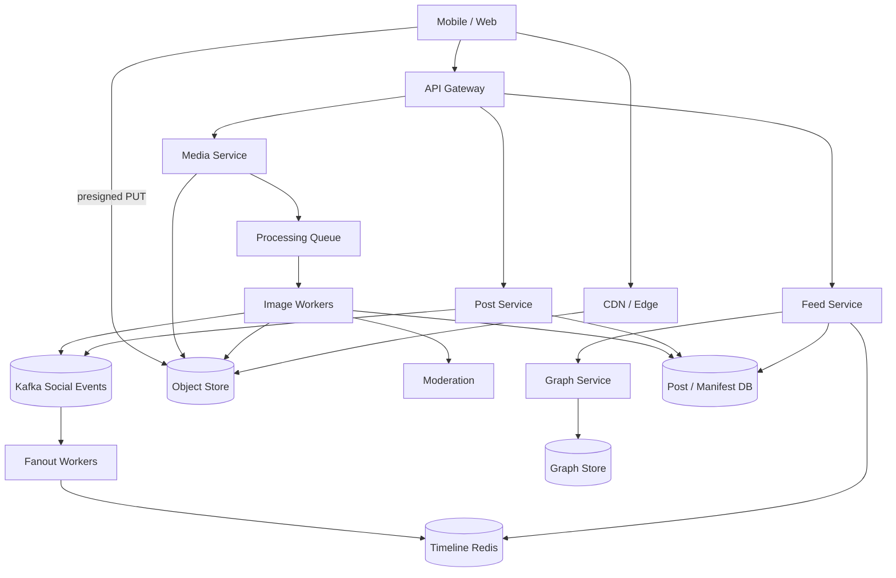

# System Design: Instagram-Style Photo Feed

> **Focus areas:** Photo upload · Processing pipeline · CDN · Home / Explore feeds · Fanout hybrid · Media metadata · Progressive scale  
> **Style:** Senior/staff interview prep with progressive scale (10× → 100× → 1,000×)  
> **Product orientation:** Visual-first social feed (Instagram Home + profile grid; Explore as Phase 2)

---

## Table of Contents

1. [Clarify Requirements (Interview Q&A)](#1-clarify-requirements-interview-qa)
2. [Back-of-the-Envelope Estimation](#2-back-of-the-envelope-estimation)
3. [High-Level Design](#3-high-level-design)
4. [Architecture Diagram](#4-architecture-diagram)
5. [Design Deep Dive](#5-design-deep-dive)
6. [Wrap-Up](#6-wrap-up)
7. [Deeper / Related Interview Questions](#7-deeper--related-interview-questions)

---

## 1. Clarify Requirements (Interview Q&A)

Bound **media** as the product center: upload durability, processing SLAs, CDN delivery, and a follow-graph home feed that is photo/carousel-first.

### 1.0 What this is / is not

| This is | This is not |
|---------|-------------|
| Photo (and short carousel) publish + home feed | Full Reels/TikTok ranking product (sibling doc) |
| Image processing (resize, transcode, thumbnails) | General-purpose object store design from scratch |
| Follow-based home + profile grid | Stories ephemeral product (mention hooks only) |
| CDN-heavy read path | On-device AR filters pipeline (defer) |

### 1.1 Functional Requirements

| # | Question to ask | Expected / typical interviewer answer | Design implication |
|---|-----------------|----------------------------------------|--------------------|
| F1 | Media types in MVP? | Photos + multi-image carousels; video/Reels later | Image pipeline first; schema allows `media_type` |
| F2 | Max resolution / size? | Up to ~30–50 MB upload; serve multiple renditions | Direct-to-blob upload; async processing |
| F3 | Feed ranking? | Ranked home (affinity + recency); chronological fallback | Same hybrid fanout patterns as news feed |
| F4 | Profile grid? | Paginated reverse-chrono grid of user’s posts | Author index `(user_id, post_id)` |
| F5 | Likes / comments? | Yes for MVP counts; comment threads Phase 1.5 | Counters eventual; comments separate service |
| F6 | Follow graph? | Directed follow | Fanout-on-write hybrid with celebs |
| F7 | Caption / hashtags / location? | Caption yes; hashtags/location Phase 1 | Caption in post metadata; search later |
| F8 | Processing before visibility? | Soft: show “processing” then upgrade URLs | Post visible with placeholder; clients swap renditions |
| F9 | Delete / archive? | Soft-delete; archive hides from profile/feed | Tombstones + CDN cache invalidation strategy |
| F10 | Explore / Discover? | Phase 2 | Candidate gen + ranker; not MVP critical path |
| F11 | Stories? | Out of MVP | Ephemeral store with TTL — don’t conflate with feed |
| F12 | NSFW / moderation? | Async classify; block serve if rejected | Moderation queue on processing complete |
| F13 | Multi-device upload resume? | Yes preferred | Chunked / resumable upload (TUS or S3 multipart) |

**MVP functional scope:**

1. Authenticated upload (resumable) → durable original blob.
2. Async create renditions (thumb, feed, full).
3. Create post with caption + media refs when processing ready (or optimistic with placeholder).
4. Home feed of followed users’ posts with image URLs.
5. Profile grid; like; soft-delete.
6. Hybrid fanout for high-follower accounts.

**Out of MVP:**

- Reels / long video ABR
- Full Explore ML
- Stories, Live, Shopping tags
- On-device filters as server product
- Strong active-active multi-region posts

### 1.2 Non-Functional Requirements

| # | Question | Expected answer | Target |
|---|----------|-----------------|--------|
| N1 | Feed API latency | Instant scroll | p50 < 100ms, p99 < 300ms |
| N2 | Image first paint | CDN edge | thumb p50 < 100ms regional |
| N3 | Upload ACK | Durable original | ACK after blob+manifest durable |
| N4 | Processing SLA | Fast enough for social | p50 < 5s, p99 < 30s per photo |
| N5 | Availability | Core app | 99.95% feed/CDN; 99.9% upload |
| N6 | Durability | No lost originals | Multi-AZ object store; 11 nines class |
| N7 | Consistency | Author RYW; followers eventual | Same as news feed |
| N8 | Cost | Egress dominates | Rendition discipline + CDN caching |

### 1.3 Cases

**Happy paths**

1. Pick photo → get presigned upload → PUT bytes → complete → processing → post appears on profile + followers’ feeds.
2. Open home → hydrated cards with CDN URLs → scroll → prefetch next images.
3. Like post → counter increments eventually; heart optimistic UI.
4. Delete post → disappears from profile/feed; blobs GC’d later.

**Edge / failure cases**

| Case | Behavior |
|------|----------|
| Upload dies at 90% | Resume via multipart; no orphan “complete” post |
| Processing fails | Retry with backoff; mark post `failed`; notify user |
| HEIC / weird EXIF | Normalize in transcoder; strip GPS if privacy policy |
| Celebrity posts carousel | Pull merge; don’t fanout 50M timeline writes |
| Hot image thundering herd | CDN cache; origin shield; immutable URLs by content hash |
| Moderation reject | Transition to `rejected`; stop serving; remove from feeds |
| Client requests full-res on cellular | Serve responsive renditions; `srcset` / negotiated quality |
| Partial carousel processing | Show ready slides; placeholder for pending |
| Duplicate submit | Idempotency on post create; content-hash optional |

### 1.4 Scales (Progressive)

| Metric | Baseline | 10× | 100× | 1,000× |
|--------|----------|-----|------|--------|
| MAU | 20M | 200M | 2B | 20B-class |
| DAU | 5M | 50M | 500M | 5B |
| Photos uploaded / day | 20M | 200M | 2B | 20B |
| Avg processed renditions / photo | 4 | 4 | 5 | 6 |
| Peak upload Gbps | 20 | 200 | 2K | 20K |
| Feed read QPS peak | 20K | 200K | 2M | 20M |
| CDN egress / day | 2 PB | 20 PB | 200 PB | **EB-class** |
| Avg followees | 200 | 200 | 250 | 300 |

**What each jump forces:**

- **10×:** Dedicated processing fleet; Redis timelines; CDN mandatory.
- **100×:** Hybrid fanout; origin shield; regional upload POP; media metadata store sharded.
- **1,000×:** Per-region media planes; erasure coding cold originals; ML Explore; aggressive rendition policies.

### 1.5 Etc.

- **Privacy:** strip exact GPS by default; retain city-level if product needs.
- **URL design:** immutable content-addressed renditions → long CDN TTL.
- **Scope repeat-back:**

> Design Instagram-style photo sharing: resumable upload, async image processing, CDN delivery, follow-based home feed with hybrid fanout, profile grid, starting ~5M DAU and scaling to 1000×. Reels/Explore deep ML out of MVP.

---

## 2. Back-of-the-Envelope Estimation

### 2.1 Upload volume

```text
Baseline: 20M photos/day
Avg original: 3 MB (phone JPEG/HEIC)
Ingest: 20M × 3 MB ≈ 60 TB/day originals

Renditions: thumb 50KB + feed 200KB + full 800KB + square 150KB ≈ 1.2 MB
Processed extra ≈ 20M × 1.2 MB ≈ 24 TB/day
```

### 2.2 CDN egress (dominates cost)

```text
Assume DAU 5M × 200 image views/day × 200 KB avg = 200 TB/day
(+ profile grids, repeats, Explore)

10× → ~2 PB/day; 100× → tens of PB/day
→ CDN + cache hit ratio is a first-class design requirement
```

### 2.3 Feed QPS & fanout

```text
Feed opens: 5M × 40/day = 200M/day → ~2.3K avg → ~20K peak
Fanout: similar hybrid math to news feed
Prefer online-only push; celebs pull
```

### 2.4 Processing compute

```text
20M images/day ÷ 86400 ≈ 230 images/s avg → ~1–2K/s peak
Each image: CPU resize ~100–300ms equivalent
→ Need autoscaled worker pool / GPU optional for AVIF/HEIC
```

### 2.5 Metadata storage

```text
Post metadata ~1–2 KB; media manifest ~1 KB
20M/day × 3 KB ≈ 60 GB/day metadata
Manageable vs blob storage
```

### 2.6 Cache

| Cache | Purpose | TTL |
|-------|---------|-----|
| Home timeline ZSET | Feed pointers | capped length |
| Post + media manifest | Hydration | minutes + invalidate |
| CDN edge | Rendition bytes | days–months (immutable) |
| Celeb recent posts | Pull merge | seconds–minutes |

---

## 3. High-Level Design

### 3.1 Separation: blob plane vs social plane

| Plane | Responsibilities | Stores |
|-------|------------------|--------|
| **Media plane** | Upload, process, serve bytes | Object store, processing queue, CDN |
| **Social plane** | Posts, graph, timelines, likes | Cassandra/MySQL, Redis, Kafka |

**Deal-breaker:** proxying all image bytes through app servers.

### 3.2 Domain model

```text
User
Post
  ├── post_id
  ├── author_id
  ├── caption
  ├── media[] → MediaAsset
  ├── status: processing | ready | rejected | deleted
  └── created_at

MediaAsset
  ├── media_id
  ├── original_object_key
  ├── renditions[] { name, width, height, codec, object_key, bytes }
  ├── content_hash
  ├── moderation_status
  └── exif_scrubbed metadata
```

### 3.3 Upload API flow

```text
1. POST /v1/media/uploads  → { upload_id, presigned_urls[] | multipart }
2. Client PUT bytes to object store (direct)
3. POST /v1/media/uploads/{id}/complete
4. Media Service verifies etag/size → enqueue ProcessMedia
5. POST /v1/posts { media_ids, caption } (Idempotency-Key)
6. Post visible; clients use rendition URLs as they become ready
```

**Why presigned?** App servers don’t eat 60 TB/day upload bandwidth.

### 3.4 Processing pipeline

```text
ProcessMedia job:
  - Fetch original (or read in-place)
  - Validate magic bytes / virus scan hook
  - Strip sensitive EXIF
  - Generate renditions (thumb, feed_webp, full_webp, avif optional)
  - Write renditions to object store (immutable keys)
  - Update MediaAsset manifest
  - Run async moderation classifier
  - Emit MediaReady → Post Service may transition post to ready
  - Emit fanout PostReady if not already
```

**Idempotent processing:** keys derived from `media_id + rendition_name + version`.

### 3.5 Feed path (photo-specific)

Same hybrid fanout as news feed, with heavier hydration:

```text
Feed Service:
  merge timeline + celeb pull
  → hydrate posts
  → attach best rendition URLs for device hints (webp/avif)
  → return; client loads images from CDN
```

**Prefetch:** client requests next page early; CDN handles repeat bytes.

### 3.6 APIs

| Method | Path | Purpose |
|--------|------|---------|
| POST | `/v1/media/uploads` | Start upload session |
| POST | `/v1/media/uploads/{id}/complete` | Finalize original |
| GET | `/v1/media/{id}` | Manifest + renditions |
| POST | `/v1/posts` | Create post |
| GET | `/v1/feed/home` | Home feed |
| GET | `/v1/users/{id}/posts` | Profile grid |
| POST | `/v1/posts/{id}/likes` | Like |
| DELETE | `/v1/posts/{id}` | Soft-delete |

### 3.7 Storage choices

| Data | Store | Why |
|------|-------|-----|
| Originals / renditions | S3/GCS + CDN | Cheap, durable, cacheable |
| Media manifests | DynamoDB/Cassandra | Point lookups by media_id |
| Posts | Cassandra by post_id + author index | Social metadata |
| Timelines | Redis ZSET + durable | Fast feed |
| Processing jobs | SQS/Kafka | Backpressure, retries |
| Graph | Sharded adjacency | Fanout |

**Trade-offs: processing sync vs async**

| | Sync in upload complete | Async workers |
|--|-------------------------|---------------|
| UX | User waits | Need processing state |
| Scale | Couples API to CPU | **Required at scale** |
| Failure | Harder retries | Natural retries |

Choose **async**; optimistic UI.

### 3.8 URL & caching strategy

```text
https://cdn.example/i/{media_id}/v{ver}/{rendition}.webp
```

- Immutable per version → `Cache-Control: public, max-age=31536000, immutable`
- On moderation replace: bump `ver` (old may linger — acceptable if rejected content taken down via tokenized URLs or short TTL for non-immutable path)
- Prefer **signed URLs** for private accounts

### 3.9 Fanout timing

Fanout when post is **ready** (or fanout pointer early and hydrate shows placeholder). Prefer:

```text
PostCreated(processing) → author profile only
MediaReady → PostReady → fanout to followers
```

Avoid showing broken image links in follower feeds.

---

## 4. Architecture Diagram



---

## 5. Design Deep Dive

### 5.1 Reliability

- **Upload:** multipart complete is atomic; incomplete parts lifecycle-expire.
- **Processing:** at-least-once workers; manifest CAS by version; poison-queue after N fails.
- **Fanout:** idempotent `(user_id, post_id)`; rebuildable from author index.
- **Moderation race:** serve path checks `moderation_status` on hydrate; CDN purge on reject.
- **Backpressure:** if processing lag high, slow accept of new uploads (429/retry-after) rather than unbounded queue growth.
- **Idempotency:** media complete + post create keys.

### 5.2 Scalability

**Shard keys:** `user_id` for timelines/graph; `media_id`/`post_id` for media/posts; processing queue partitioned by `media_id`.

**Scale jumps:**

- **10×:** Move upload off API; introduce workers + CDN; Redis feed.
- **100×:** Regional upload endpoints; origin shield; hybrid fanout; AVIF/webp negotiation.
- **1,000×:** Multi-region media replication policies; cold originals to glacier-class; separate Explore ranker fleet.

**Parallelization:** carousel images process in parallel; feed hydrate batching; CDN prefetch.

**Storage tiers:** hot renditions on SSD/CDN; originals standard; rarely accessed originals cold.

### 5.3 Maintainability

- Metrics: upload success, processing lag, rendition error rate, CDN hit ratio, feed p99, fanout lag.
- Image codec rollouts via feature flags (webp → avif).
- EXIF/privacy policy as versioned scrubber config.
- Chaos: kill workers; verify resume; CDN origin failure → shield.

---

## 6. Wrap-Up

| Decision | Choice | Why |
|----------|--------|-----|
| Upload | Presigned direct-to-blob | Bandwidth & cost |
| Processing | Async workers | Scale + retries |
| Feed | Hybrid fanout | Same celeb problem |
| Bytes | CDN immutable URLs | Egress efficiency |
| Visibility | Fanout on MediaReady | Avoid broken images |

**Phases:** (0) upload+process+profile (1) follow feed pull (2) push fanout (3) hybrid+moderation (4) Explore.

> “Media plane and social plane stay separate: durable direct upload, async renditions, CDN for bytes, hybrid timeline for the home feed.”

---

## 7. Deeper / Related Interview Questions

**Q1. Why not upload through the API server?**  
A: 60 TB/day through app fleets is cost and scaling insanity. Presigned PUT to object store is standard.

**Q2. How do resumable uploads work across devices?**  
A: Upload session id stored server-side with part etags; client resumes missing parts. Authz on session ownership.

**Q3. When is a post fanout-eligible?**  
A: When required renditions exist and moderation not rejected. Optional early fanout with placeholders — product choice.

**Q4. How do you invalidate CDN on delete?**  
A: Soft-delete stops API hydration; issue CDN purge for rendition paths; GC blobs after TTL. Immutable URLs can’t be “edited,” only version-bumped.

**Q5. HEIC to JPEG/WebP — where?**  
A: In processing workers with lib converters; never trust client-only transcode for canonical originals.

**Q6. Estimating CDN hit ratio impact?**  
A: Moving hit ratio 85%→95% can cut origin egress dramatically; origin shield + immutable URLs are the levers.

**Q7. Carousel partial failure?**  
A: Per-media status; post `ready` when min viable set ready, or all-or-nothing — pick and document. Prefer per-slide status for UX.

**Q8. Hot celebrity photo — cache hierarchy?**  
A: Edge CDN → regional shield → origin. Feed merge uses celeb recent cache; don’t stampede media manifest DB.

**Q9. Consistent hashing for media metadata shards?**  
A: Shard by `media_id`; vnodes for rebalance. Blobs addressed by key in object store (already distributed).

**Q10. How do private accounts change the design?**  
A: Signed CDN URLs or cookie-token auth at edge; fanout only to approved followers; pull path must ACL check.

**Q11. Thumbnails in Redis?**  
A: No bytes in Redis. Cache manifests/URLs only. Bytes belong on CDN.

**Q12. Processing p99 spikes?**  
A: Priority queues (interactive vs backfill); autoscale on lag; degrade optional AVIF generation under load.

**Q13. Duplicate photo uploads (same bytes)?**  
A: Optional content-hash dedup for storage savings; careful with per-user delete semantics (refcount).

**Q14. Feed ranking features unique to photos?**  
A: Aesthetic scores, face presence, engagement dwell, media type — still keep candidate gen separate from scoring.

**Q15. Load balancer for media workers?**  
A: Workers pull from queue (competing consumers), not LB push. API LB is L7 for control plane only.

**Q16. GPS privacy?**  
A: Scrub precise GPS in processing; store coarse place only if user tagged location explicitly.

**Q17. How does this differ from Twitter media?**  
A: Instagram is media-primary; denser images per session; profile grid access pattern; stricter rendition set; higher CDN dominance.

**Q18. Memory for image workers?**  
A: Bound concurrent decodes; huge images can OOM — enforce max dimensions/pixels before decode.

**Q19. Ordering guarantees for profile grid?**  
A: `(user_id, post_id snowflake DESC)` index; cursor pagination.

**Q20. What if Kafka drops MediaReady?**  
A: Reconciliation scanner: manifests ready but posts not fanout → repair. Don’t rely on perfect bus delivery alone.

**Q21. Multi-region upload?**  
A: Upload to nearest region bucket; replicate originals asynchronously; manifests show regional availability; feed can serve nearest rendition replica.

**Q22. Graph / fanout interaction with processing delay?**  
A: Followers shouldn’t see posts before ready; author may see processing state on profile.

**Q23. Why content-addressed keys?**  
A: Long cache TTL safety; easy integrity checks; natural dedup.

**Q24. Explore page architecture sketch?**  
A: Offline embeddings + online candidate services + ranker; shared media plane; separate from follow fanout.

**Q25. Biggest interview footgun?**  
A: Designing only the feed and hand-waving “S3 for images” without upload, processing SLA, CDN, and cost math.

**Q26. Rate limits?**  
A: Uploads/day, concurrent uploads, likes QPS, follow QPS — protect processing queue and fanout.

**Q27. Comment system coupling?**  
A: Separate service keyed by `post_id`; feed shows count only; don’t join full threads on home.

**Q28. Algorithm for generating rendition sizes?**  
A: Fixed ladder (e.g. 150/320/640/1080 widths) + webp/avif; avoid unbounded dynamic resize at request time (image proxy optional with strict allowlist).

**Q29. How to GC deleted media safely?**  
A: Refcount or delayed GC; ensure no other post references; respect legal hold.

**Q30. Consistency of like counts under 1000×?**  
A: Approximate counters; CRDT/PN-counter or Redis + reconcile; exact value not needed on feed cards.

---

*End of Instagram photo feed system design prep doc.*

## Appendix — Deep dive notes for Instagram-style photo feed

### Hardest invariants
- Define the correctness property that must not break under retries, partial failures, or overload.
- Define multi-tenant isolation boundaries if applicable.
- Define delete/TTL/privacy semantics across primary + cache + search + logs.

### Likely bottlenecks
1. Hot keys / hot partitions for core entity ids
2. Synchronous dependency latency tails (p99)
3. Write amplification from secondary indexes / fanout
4. Compaction / GC / backfill stealing cluster IO
5. Cross-region chatty patterns

### Suggested metrics (RED + business)
| Metric | Why |
|--------|-----|
| Request rate / error / duration | Golden signals |
| Saturation (CPU, pool, queue lag) | Leading indicator |
| Idempotency conflict rate | Client retry health |
| Cache hit ratio | Origin protection |
| Business SLI for Instagram-style photo feed | Product truth |

### Migration & rollout
- Expand/contract schema changes
- Dual-write or shadow reads for store migrations
- Feature-flagged cutover; canary on error budget
- Backfill with checkpoints and replayable logs

### What interviewers poke next
- Memory footprint of your cache/index choice
- Exact concurrency control (locks vs OCC vs ledger)
- Cost model at 100×
- Abuse cases unique to Instagram-style photo feed

## Appendix A — Interview execution checklist

1. **Repeat scope** in one sentence; list out-of-scope.
2. **Write NFRs as numbers** (QPS, p99, RPO/RTO).
3. **Draw** clients → edge → svc → store → async.
4. **Call the hardest invariant** early.
5. **Pick consistency** deliberately; do not say “strong everywhere.”
6. **Show scale jumps** at 10× / 100× / 1,000× with architecture changes.
7. **Name failure modes** and degraded behavior.
8. **Close** with metrics, rollout, and residual risks.

## Appendix B — Trade-off flashcards

| Topic | Prefer | Avoid |
|-------|--------|-------|
| Sync vs async | Sync for money/authz ack | Sync for fanout/email/indexing |
| SQL vs KV | Multi-row invariants | Ultra-high simple point ops |
| Cache | Read-heavy + tolerable stale | Incorrect money reads |
| Queue | Spike absorb + retry | Hidden request/response bus |
| Multi-region | Home cell single-writer | Multi-writer without merge rules |

## Appendix C — Reliability patterns to name drop correctly

- Idempotency keys + request hash
- Outbox / transactional messaging
- Leases + fencing tokens
- Quorum / consensus (Raft) for coordination—not for every data path
- Bulkheads + circuit breakers + deadlines
- Load shedding + admission control
- Canary + automatic rollback on SLO burn
- Backup restore drills (backup ≠ restore tested)

## Appendix D — Scalability patterns

- Consistent hashing with virtual nodes
- Hierarchical sharding (cell → shard → partition)
- CQRS / projections for read models
- Hot-key splitting and salting
- Tiered storage + compaction budgets
- Consumer parallelization by partition
- Edge caching with purge/surrogate keys

## Appendix E — Sample capacity dialogue

```text
Interviewer: Assume 10M DAU.
You: 10M DAU × 5 key actions/day ≈ 50M events/day ≈ 580 QPS avg.
Peak 15× ⇒ ~9K QPS. With 70% cache hit on reads, origin ~2.7K QPS.
At 100×, origin ~270K QPS ⇒ shard + edge mandatory.
```

Customize the action rate to this problem; do not reuse social-feed numbers for a ledger.


*Enriched for interview drill · `instagram-photo-feed`*
