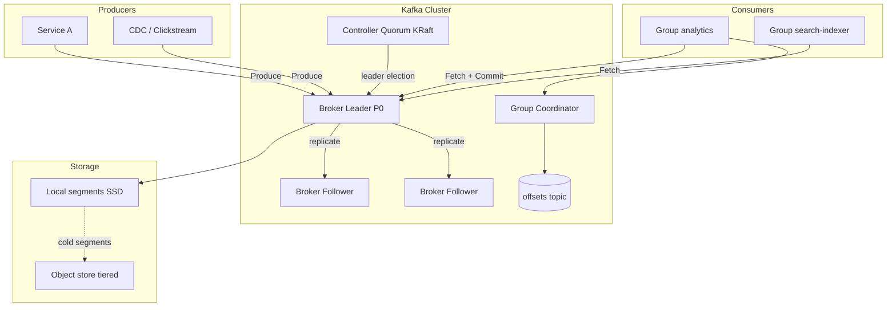
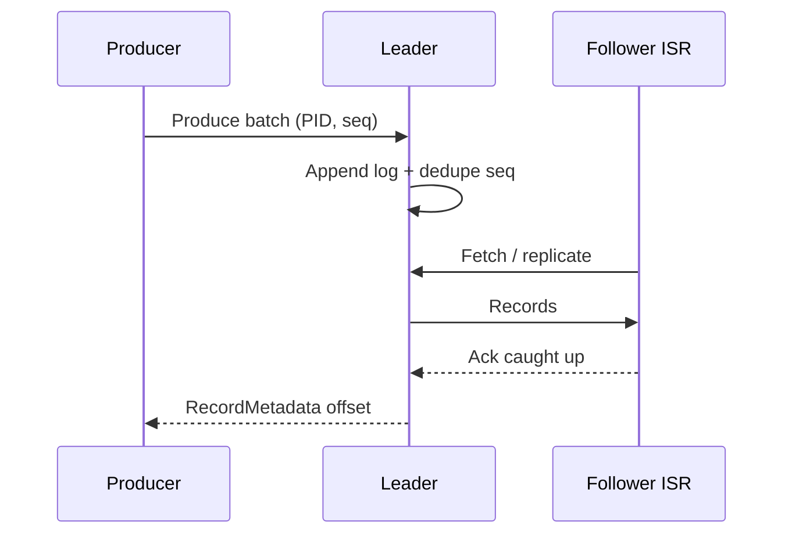

# System Design: Kafka / Distributed Commit Log

> **Focus areas:** Partitioned durable log · Leader/ISR replication · Producer acks · Consumer groups · Offset commits · Retention & compaction · Controller / KRaft · Quotas · Progressive scale  
> **Style:** End-to-end infrastructure design with progressive scale (10× → 100× → 1,000×)  
> **Interview theme:** Kafka-class streaming backbone — not a generic HTTP queue  
> **Quality bar:** Correct partition math, explicit durability invariants, honest MVP vs extreme-scale paths, failure-first reasoning

---

## Table of Contents

1. [Clarify Requirements (Interview Q&A)](#1-clarify-requirements-interview-qa)
2. [Back-of-the-Envelope Estimation](#2-back-of-the-envelope-estimation)
3. [High-Level Design](#3-high-level-design)
4. [Architecture Diagram](#4-architecture-diagram)
5. [Design Deep Dive](#5-design-deep-dive)
6. [Wrap-Up](#6-wrap-up)
7. [Deeper / Related Interview Questions](#7-deeper--related-interview-questions)

---

## 1. Clarify Requirements (Interview Q&A)

Bound the problem: a **durable, partitioned, replicated append-only commit log** with pub/sub consumer groups — the backbone for event-driven systems, CDC, stream processing, and audit trails.

### 1.0 What this is / is not

| Dimension | This doc | Not this |
|-----------|----------|----------|
| Product | Kafka-like distributed log | RabbitMQ-style broker with per-message ACKs / complex routing |
| Unit of scale | Topic → partition → segment files | Single global ordered queue |
| Ordering | **Per-partition** total order | Global total order across keys (unless 1 partition) |
| Delivery default | At-least-once; idempotent producer / EOS optional | Exactly-once “for free” |
| Retention | Time/size/compaction on disk | Pure in-memory ephemeral queue |
| Consumers | Pull + consumer groups + committed offsets | Push-only with broker-side cursors only |

### 1.1 Functional Requirements

| # | Question to ask | Expected / typical interviewer answer | Design implication |
|---|-----------------|----------------------------------------|--------------------|
| F1 | Who produces? | Microservices, CDC, clickstream, metrics | Batch + compress; schema optional |
| F2 | Who consumes? | Stream processors, warehouses, search indexers, online services | Consumer groups; independent lag |
| F3 | Ordering guarantee? | Same key → same partition → ordered | Key hash partitioner; document limit |
| F4 | Durability on produce ACK? | Configurable: `acks=1` vs `acks=all` | ISR replication; `min.insync.replicas` |
| F5 | Retention? | Days of log + optional compacted topics | Segment delete + log-cleaner |
| F6 | Consumer API? | Fetch by offset; commit offsets | Group coordinator; `__consumer_offsets` |
| F7 | Exactly-once? | Phase 2: idempotent producer + transactions | PID/epoch; transactional coordinator |
| F8 | Multi-tenant? | Yes — quotas on produce/fetch bytes & request rates | Broker quotas + fair scheduling |
| F9 | Schema? | Optional registry (Avro/Protobuf/JSON Schema) | Out of core brokers; clients enforce |
| F10 | Geo replication? | Async MirrorMaker / cluster linking Phase 2 | Not sync multi-master in MVP |
| F11 | Security? | TLS, SASL/mTLS, ACLs on topic/group | Authn at gateway; ACL on resources |
| F12 | Admin ops? | Create topic, reassign partitions, expand ISR | Controller APIs; rolling restart |
| F13 | Max message size? | ~1 MB default; larger via config | Segment + fetch buffer sizing |
| F14 | Compacted topics? | Yes for changelogs / KTables | Key→latest value; tombstones |

**MVP functional scope:**

1. Topics with N partitions; create/delete via admin API.
2. Produce: route by key → partition leader → append → replicate to ISR → ACK per `acks`.
3. Consume: join consumer group → assign partitions → fetch → commit offsets.
4. RF=3, rack-aware placement; unclean leader election **off** by default.
5. Time/size retention; optional compaction for designated topics.
6. Controller elects leaders; handles broker failure (KRaft or ZooKeeper-era mental model).
7. Basic quotas; TLS + ACLs.
8. Metrics: produce/fetch latency, under-replicated partitions, ISR shrinks, consumer lag.

**Out of MVP:**

- Exactly-once transactions (design hooks; ship idempotent producer first)
- Cross-region active-active same topic
- Tiered storage to object store (Phase 1.5 — critical at 100×)
- Kafka Streams / ksqlDB as part of the broker (separate products)
- Unlimited partitions without operational discipline

### 1.2 Non-Functional Requirements

| # | Question | Expected answer | Target |
|---|----------|-----------------|--------|
| N1 | Produce latency (`acks=all`)? | In-region interactive pipelines | p50 < 5ms, p99 < 20–50ms (SSD, healthy ISR) |
| N2 | Throughput? | Sequential disk + NIC bound | Multi-GB/s per cluster; 50–200 MB/s per partition practical |
| N3 | Availability? | Survive broker + rack loss | 99.9%+ produce with RF=3, `min.isr=2` |
| N4 | Durability? | No ack until ISR durable | `acks=all` + fsync policy trade-off |
| N5 | Consistency? | Committed offset monotonic per partition | High watermark / leader epoch fencing |
| N6 | Multi-region? | DR async OK MVP | Mirror; RPO minutes |
| N7 | Fan-out? | Many consumer groups independent | Retention holds data for slowest needed group |
| N8 | Cost? | Disk + network dominate | Tiered remote storage at scale |

### 1.3 Cases (User Flows & Edge Cases)

**Happy paths**

1. Producer sends keyed batch → leader appends → ISR replicates → ACK → consumer fetches new HW → processes → commits offset.
2. New consumer joins group → rebalance → assigned partitions → resume from committed offsets.
3. Broker dies → controller elects new leader from ISR → producers/consumers refresh metadata → continue.
4. Retention deletes old segments past TTL; compacted topic keeps latest per key.
5. Scale consumers horizontally within group up to partition count.
6. Admin increases partitions (warn: key→partition mapping changes for new partitions only carefully).

**Edge / failure cases**

| Case | Behavior |
|------|----------|
| Leader dies | New leader from ISR; leader epoch bumps; fenced old leader |
| Follower falls out of ISR | Produce with `acks=all` may block if `min.isr` not met → backpressure |
| Disk full on broker | Mark offline / stop accepting; alert; reassign |
| Hot partition (celebrity key) | Throughput capped by one partition; mitigate with salting or redesign keys |
| Consumer rebalance storm | Sticky/cooperative assignor; reduce session timeout thrash |
| Duplicate produce on retry | Idempotent producer (PID+seq) or consumer-side dedup |
| Offset commit after processing fail | At-least-once → duplicates; document |
| Unclean leader election enabled | Can lose acknowledged data — call out as dangerous |
| Slow consumer | Lag grows; retention may delete unread data → data loss for that group |
| Split brain metadata | KRaft quorum / ZK fencing; clients trust epoch |

### 1.4 Scales (Progressive)

| Metric | Baseline | 10× | 100× | 1,000× |
|--------|----------|-----|------|--------|
| Cluster produce ingress | 500 MB/s | 5 GB/s | 50 GB/s | 500 GB/s |
| Partitions (cluster) | 10K | 50–100K | 500K–1M | Multi-cluster / 10M+ |
| Brokers | 6–12 | 30–60 | 200–500 | Federated clusters |
| Messages/sec (1 KB avg) | 500K | 5M | 50M | 500M |
| Consumer groups | 100 | 1K | 10K | 100K |
| Retention volume | 100 TB | 1 PB | 10 PB | 100 PB+ (tiered) |
| Connections | 10K | 100K | 1M | Multi-cluster |
| Partition leaders / broker | ~1–2K | ~2–3K | Must cap / rebalance | Cell per domain |

**What each jump forces:**

- **10×:** Dedicated controller stability; rack awareness; quota enforcement; careful partition count; monitoring under-replicated.
- **100×:** **Tiered storage** (hot local + cold object); partition caps per broker; multi-cluster by domain; fetch from closest replica (follower fetching).
- **1,000×:** Cluster federation; produce via regional clusters; Mirror/linking; KRaft at scale; hierarchical quotas; avoid million-partition single cluster.

### 1.5 Etc. (Constraints & Assumptions)

- **Disk:** JBOD SSD/NVMe preferred over shared SAN; sequential write wins.
- **Coordination:** Prefer KRaft mental model (controller quorum in Kafka) but explain ZK-era equivalently.
- **Clients:** Official producers/consumers with metadata refresh; not naive HTTP wrappers for data plane.
- **Message format:** Record batches with timestamps, headers, optional compression (lz4/zstd).

**Scope statement to repeat back:**

> Design a **Kafka-class distributed commit log**: partitioned topics, RF=3 ISR replication, configurable produce acks, consumer groups with offset commits, retention/compaction, starting at ~500 MB/s and evolving via tiered storage and multi-cluster federation to 1000×. Ordering is per-partition; default delivery is at-least-once.

---

## 2. Back-of-the-Envelope Estimation

### 2.1 Throughput vs partitions

```text
Cluster ingress P = 500 MB/s baseline
Avg message 1 KB → ~500K msg/s
If each partition sustains ~25–50 MB/s sequential (conservative SSD+replication):
Partitions needed for pure BW ≈ 500 / 40 ≈ 12–20  (throughput floor)

BUT: consumer parallelism, key cardinality, and retention fan-out drive
partitions far higher — typically hundreds–thousands for ops reasons.
```

**Interview trap:** equating “need 10K partitions for 500 MB/s.” You need partitions for **parallelism and key fan-out**, not raw MB/s alone — but each partition has **metadata, memory, and replication** cost.

### 2.2 Replication bandwidth

```text
acks=all, RF=3:
Network ≈ 2× ingress for replication (leader → 2 followers), plus produce ingress
500 MB/s produce → ~1 GB/s replication + ~500 MB/s ingest ≈ 1.5 GB/s cluster NIC (order)
At 100×: 50 GB/s produce → ~150 GB/s fabric — needs many racks / clusters
```

### 2.3 Storage

```text
Retention R = 7 days, ingress 500 MB/s:
Per day ≈ 500 MB/s × 86400 ≈ 43 TB/day
7 days ≈ 300 TB uncompressed logical
RF=3 → ~900 TB raw disk (before compression)
Compression 2–3× on text/JSON → ~300–450 TB raw
1,000× ingress → tens of EB without tiering — impossible; must tier / shorten hot retention
```

### 2.4 Page cache / memory

```text
Hot tail of log should stay in OS page cache for consumer catch-up.
Brokers: heap for replica buffers, request queues, page cache left to OS (do not double-cache in JVM).
Rule of thumb: RAM ≥ working set of active consumer lag windows + produce buffers.
```

### 2.5 Consumer lag memory pressure

```text
If consumers lag by L bytes on a partition, broker serves from disk (cold) — latency ↑.
Catch-up BW limited by disk + consumer; alert on lag age, not only lag messages.
```

### 2.6 Controller / metadata size

```text
10K partitions × RF=3 ≈ 30K replicas
Metadata: leaders, ISR, epochs — fine for single controller quorum
1M partitions → controller + metadata propagation becomes central bottleneck → split clusters
```

### 2.7 Hot keys

```text
All traffic with key=user_12345 → 1 partition → 1 leader disk/NIC ceiling
Mitigation: salt keys for unordered workloads; separate priority topics; client-side shard keys
```

### 2.8 Offset commit QPS

```text
Naive: commit every message → kills `__consumer_offsets`
Practice: commit every 1–5s or every N records; at-least-once window = commit interval
```

---

## 3. High-Level Design

### 3.1 Core abstractions

```text
Cluster
  └── Topic (config: RF, partitions, retention, cleanup.policy)
        └── Partition (ordered log; single leader; ISR followers)
              └── Segment files (*.log, *.index, *.timeindex)
                    └── Record batches (compressed)
ConsumerGroup
  └── Members → assigned partitions → committed offsets
```

**Invariant:** For a partition, all consumers in a group see a **total order**. Across partitions, no global order.

### 3.2 Why Kafka over alternatives?

| Option | Pros | Cons | Deal-breaker when |
|--------|------|------|-------------------|
| Kafka-class log | Durable, replayable, high throughput, many independent consumers | Ops complexity; partition limits | Need complex routing / priority queues as primary |
| Rabbit / SQS classic | Simple ACK, routing, delay | Hard multi-GB/s replay; retention expensive | Need days of replay for many groups |
| Pulsar (segment on bookies) | Separates storage; geo features | Different ops model | Team standardized on Kafka ecosystem |
| DB table as queue | Transactions | Vacuum/hot row death at high QPS | High sustained ingest |

**MVP choice:** Kafka-class partitioned log.

### 3.3 Produce path

```text
1. Producer hashes key → partition; refreshes metadata for leader
2. Batches records (linger.ms, batch.size); optional compress
3. Send to leader broker
4. Leader appends to local log (page cache + configured fsync)
5. Followers fetch/replicate; join ISR when caught up
6. When durability condition met (acks), respond with offset
```

**Idempotent producer (strongly recommend):** PID + sequence numbers per partition → broker dedups retries → no dupes on transient network ACK loss.

### 3.4 Replication & ISR

```text
ISR = replicas that are caught up within replica.lag.* thresholds
High watermark (HW) = offset known replicated to full ISR (simplified)
Consumers fetch only up to HW (don't see unreplicated)
Leader epoch fences zombies after failover
```

| Setting | Durability | Availability | Notes |
|---------|------------|--------------|-------|
| `acks=0` | Fire-forget | Highest | Lossy |
| `acks=1` | Leader only | High | Loss if leader dies before replicate |
| `acks=all` + `min.isr=2` | Quorum of ISR | May block if ISR shrinks | Default for important data |
| Unclean leader election | Can elect non-ISR | Higher avail | **May lose committed data** |

### 3.5 Consume path & groups

```text
1. Consumer joins group via GroupCoordinator
2. Assignor (range/sticky/cooperative) maps partitions → members
3. Fetch from leaders (or preferred replica / follower fetch)
4. Process; commit offsets asynchronously
5. On revoke: stop processing; optional commit; release
```

**Rebalance goals:** minimize stop-the-world; sticky/cooperative assignors reduce partition thrash.

### 3.6 Storage engine (broker local)

- Append-only segment files; sparse indexes (offset → position); timeindex for timestamp seeks.
- Retention: delete old segments; compaction: rewrite keeping last value per key + tombstone retention.
- **Tiered storage (100×):** copy inactive segments to object store; local disk keeps hot head; fetch remote on catch-up.

### 3.7 Controller / KRaft

- Controller quorum manages: topic metadata, partition leaders, reassignments, broker registration.
- Prefer explaining **KRaft**: metadata log replicated among controllers; no external ZK dependency in modern deployments.
- Critical: metadata change rate and partition count dominate controller load.

### 3.8 APIs (logical)

| API | Role |
|-----|------|
| `Metadata` | Topic→partition→leader/ISR map |
| `Produce` | Append batches |
| `Fetch` | Read from offset |
| `FindCoordinator` / `JoinGroup` / `SyncGroup` / `Heartbeat` | Consumer groups |
| `OffsetCommit` / `OffsetFetch` | Group offsets |
| `CreateTopics` / `AlterConfigs` / `ReassignPartitions` | Admin |
| `InitProducerId` / `AddPartitionsToTxn` / `EndTxn` | Transactions (Phase 2) |

### 3.9 Data model (logical)

```text
topics(topic_id, name, configs...)
partitions(topic_id, partition_id, leader, isr[], epoch)
brokers(broker_id, rack, endpoints, offline)
consumer_groups(group_id, generation, protocol, members[])
offsets(group_id, topic, partition, offset, metadata)  -- compacted changelog topic
producer_state(pid, epoch, seq_per_partition)          -- for idempotence
```

### 3.10 Trade-offs summary

| Choice | Prefer when | Avoid when |
|--------|-------------|------------|
| More partitions | More consumer parallelism | Controller/heap blow-up; tiny topics |
| `acks=all` | Money / correctness events | Ultra-low latency firehose metrics (maybe `acks=1`) |
| Compaction | Changelog / latest-state | Need full history of every event |
| Long retention | Many slow consumer groups | Disk cost; prefer tiering |
| One giant cluster | Simpler networking | Blast radius / partition storm at 100× |

---

## 4. Architecture Diagram



### 4.1 Produce sequence



### 4.2 Failover sequence

```text
Leader crash → controller notices (session/timeout)
→ elect new leader from ISR with new leader epoch
→ followers truncate divergent unclean suffix if needed (epoch check)
→ producers get NOT_LEADER_OR_FOLLOWER → metadata refresh → retry
```

---

## 5. Design Deep Dive

### 5.1 Reliability

**Data loss prevention**

- Default important topics: `RF=3`, `acks=all`, `min.insync.replicas=2`, unclean leader election disabled.
- fsync policy: `flush.messages` / `flush.ms` vs rely on replication + OS — discuss trade-off honestly (fsync every message kills throughput).
- Idempotent producers prevent dupes on retry; consumers still must be idempotent for at-least-once processing.

**Retries & idempotency**

- Producer retries with exponential backoff; idempotent PID handles duplicates.
- Consumer: process → side effect idempotent → commit offset. Never “commit then process” for correctness-critical paths.

**Backpressure**

- If ISR shrinks below `min.isr`, `acks=all` produce fails/retries → natural backpressure.
- Quotas reject excess produce bytes → protect noisy neighbors.
- Client buffer full → block/fail produce in app.

**Rate limits / multi-tenant**

- Broker quotas: produce/fetch byte rates, request rates per client.id / user.
- Fairness: avoid one tenant filling disks — retention + quotas + separate clusters for whales.

**Failure modes checklist**

| Failure | Detection | Mitigation |
|---------|-----------|------------|
| Broker death | Failed heartbeat / ZK/KRaft session | Elect leader; reassign if needed |
| Disk stall | Request handler metrics | Isolate volume; JBOD drop bad disk |
| Network partition | Replica lag ↑; ISR shrink | May block produces; alert |
| Controller loss | Quorum election | Brief metadata unavailability |
| Poison message | Consumer crash loop | Skip / DLQ pattern at app; max.poll.interval |
| Retention vs lag | Lag age > retention | Alert before delete; extend retention / pause delete |

**Leader epoch fencing (say out loud):** After failover, old leader must not accept writes; epoch in produce/fetch fences zombies — prevents silent divergence.

### 5.2 Scalability

**Scale up / out**

- Add brokers → reassign partitions (throttled) to balance disk/CPU/leaders.
- Add partitions to topic → increases parallelism but **changes key mapping for new partitions** — plan carefully; often create new topic + dual-write.

**Sharding strategy**

- Partition key = entity id for order; random/null key for pure throughput.
- Multi-cluster: shard by domain (`payments`, `clicks`) or by tenant cell.

**Storage tiers**

| Tier | Store | Latency | Use |
|------|-------|---------|-----|
| Hot | Local SSD segments | ms | Active produce/consume |
| Warm/Cold | Object store (tiered) | 10–100ms+ | Catch-up / compliance retention |
| Offline | Export to lakehouse | batch | Analytics |

**Parallelization**

- Max useful consumers in a group ≈ partition count.
- Mirror parallelism across geo links.
- Compaction / remote fetch workers separate from request threads.

**Progressive architecture**

| Scale | Topology |
|-------|----------|
| 1× | Single multi-AZ cluster, local disk retention |
| 10× | Quotas, rack-aware, careful partition budgets |
| 100× | Tiered storage; follower fetch; multi-cluster by domain |
| 1,000× | Federated regional clusters + async mirror; cell isolation |

**Anti-patterns**

- Millions of partitions in one cluster “for flexibility”
- Global total order via single partition for all traffic
- Storing large blobs in Kafka (use object store + pointer)
- One consumer group committing every record synchronously at millions/sec

### 5.3 Maintainability

**Ops**

- Rolling restart: controlled ISR; never take majority of replicas offline.
- Partition reassignment throttles (`replica.alter.log.dirs`, inter-broker throttle).
- Capacity: track disk % , under-replicated partitions = 0 SLO, request handler idle %.

**Observability**

| Signal | Why |
|--------|-----|
| Under-replicated partitions | Durability risk |
| ISR shrink/expand rate | Instability |
| Produce/fetch p99 | SLO |
| Consumer lag (offset + **time**) | Freshness |
| Disk usage growth vs retention | Capacity |
| Controller unavailability | Cluster admin/metadata |

**Migrations**

- Cluster upgrade: rolling brokers; inter-broker protocol compatibility.
- Topic migration across clusters: MirrorMaker2 / cluster link; cutover consumers.
- Schema evolution: registry compatibility modes (FORWARD/BACKWARD/FULL).

**Multi-tenant**

- ACL + quotas + preferably separate clusters for hostile tenants.
- Name conventions: `{env}.{domain}.{entity}`.

**Runbooks (examples)**

1. Under-replicated > 0 for >5m → check disk, network, slow brokers; decommission bad broker.
2. Produce p99 spike → ISR, GC, disk utilization, noisy tenant quota.
3. Consumer lag → scale consumers (≤ partitions), check poison messages, increase retention temporarily.

---

## 6. Wrap-Up

### 6.1 Decision summary

| Decision | Choice | Why |
|----------|--------|-----|
| Core model | Partitioned replicated log | Replay + fan-out + order per key |
| Durability default | RF=3, acks=all, min.isr=2 | Survive broker loss without losing acks |
| Delivery | At-least-once + idempotent producer | Honest; EOS later |
| Coordination | KRaft controller quorum | Metadata HA |
| Scale path | Tiered storage + multi-cluster | Disk and partition ceilings |
| Compaction | Opt-in per topic | Changelogs without infinite history |

### 6.2 Phased rollout

1. **MVP:** Topics, produce/consume, ISR, groups, retention, ACLs, quotas.
2. **Phase 1.5:** Idempotent producers default; tiered storage; preferred replica fetch.
3. **Phase 2:** Transactions / EOS to Kafka; Mirror geo; self-serve topic platform.
4. **Phase 3:** Cell architecture; automated rebalancing; capacity autopilot.

### 6.3 Risks

- Partition explosion → controller/heap death.
- Hot keys → latent single-partition bottleneck.
- Retention vs slow consumers → silent data loss for lagging groups.
- Enabling unclean leader election under pressure → durability violation.

### 6.4 45-minute arc

1. Requirements + ordering/durability clarification (5–7m)
2. Back-of-envelope partitions/storage/replication (5m)
3. Produce/ISR/consume/groups whiteboard (15m)
4. Failure + scale jumps (10m)
5. Tiering / multi-cluster + wrap (5m)

**Closing line:**

> Per-partition ordered, ISR-replicated commit log with consumer-group fan-out; durability via `acks=all`/`min.isr`; scale with partitions carefully, then tiered storage and federated clusters — not one infinite cluster.

---

## 7. Deeper / Related Interview Questions

**Q1. Why not guarantee global ordering?**  
Global order requires a single partition (or consensus on every message) and kills throughput. Per-key order via hashing is the scalable contract.

**Q2. What does `acks=all` actually wait for?**  
Leader waits until all **in-sync replicas** (ISR) have the record (subject to `min.insync.replicas`), not necessarily all RF replicas if some are out of ISR.

**Q3. Can consumers read uncommitted data?**  
They should only read up to the high watermark / durable replicated point so a leader crash doesn’t expose unreplicated offsets.

**Q4. How does idempotent producer work?**  
Broker stores PID + epoch + per-partition sequence; duplicate seq ignored; epoch fencing on zombie producers after restart/init.

**Q5. How do Kafka transactions achieve EOS to Kafka?**  
Transactional producer writes data + offsets in one TX; consumers with `read_committed` skip aborted; still need idempotent sinks beyond Kafka.

**Q6. Sticky vs eager rebalance?**  
Eager revokes all partitions (stop-the-world). Cooperative sticky revokes only what must move — less thrash, better availability.

**Q7. How is `__consumer_offsets` special?**  
Compacted internal topic; coordinators own partitions of it; commits are produces to this log — must be sized/monitored.

**Q8. What breaks with too many partitions?**  
Controller memory/CPU, unique leader elections, heap for replica state, longer recovery, slower metadata updates, URE noise.

**Q9. Follower fetching / rack awareness for consume?**  
Fetch from same-rack replica to save cross-AZ $$ and NIC; consistency still governed by HW and leader epoch rules.

**Q10. Compaction vs retention delete?**  
Delete removes by time/size regardless of key. Compaction keeps latest per key for changelog semantics; tombstones need delete-retention.

**Q11. How do you handle poison pills?**  
App-level: try/catch → DLQ topic with headers; or skip with careful offset advance; circuit-break retry loops via `max.poll.interval.ms`.

**Q12. Why JBOD not RAID?**  
Kafka replication already provides redundancy; RAID hides disk failure poorly and costs capacity; JBOD + RF is standard.

**Q13. Exactly-once end-to-end to Postgres?**  
Kafka TX insufficient alone — use transactional outbox, idempotent upserts with keys, or sink connectors with offset-in-DB commits.

**Q14. How does leader epoch prevent truncation bugs?**  
Follower checks epoch continuity; truncates divergent suffix from old leader; avoids log divergence after failover.

**Q15. MirrorMaker2 vs sync multi-region writes?**  
MM2 is async replication (lag/RPO). Sync multi-region produce is rare/expensive; usually regional produce + async mirror.

**Q16. Batching trade-offs (`linger.ms`)?**  
Higher linger → better compression/throughput, higher latency. Tune per SLA class (metrics vs checkout events).

**Q17. How to estimate consumer parallelism?**  
`min(desired_throughput / per_consumer_capacity, partition_count)`. Extra consumers idle.

**Q18. What is ISR lag threshold trade-off?**  
Tight → ISR flaps → produce instability. Loose → longer catch-up and more data to truncate on fail.

**Q19. Security: ACL granularity?**  
Topic produce/consume, group ops, transactional IDs, cluster alter — least privilege per client identity.

**Q20. How does tiered storage change fetch path?**  
Local miss → remote fetch → optional cache; p99 catch-up latency rises; ops must track remote read errors/cost.

**Q21. Consistent hashing for partitions?**  
Kafka uses `murmur2(key) % N` (or sticky partitioner for null keys). Changing N reshuffles — prefer new topic over casual repartition.

**Q22. Why pull not push for consumers?**  
Consumers control rate (backpressure); brokers stay simpler; diverse consumer speeds coexist via retention.

**Q23. Disk failure recovery time?**  
Rebuild = replicate partition bytes to new broker; throttle to protect live traffic; prefer smaller partitions for faster re-replication units? (balance vs partition count costs).

**Q24. How to test durability claims?**  
Chaos: kill leader under produce load with `acks=all`; verify no acked message missing; verify fencing; inject slow disks.

**Q25. Deal-breaker designs?**  
Single-node “Kafka”; `acks=0` for payments; unclean leader election as default; millions of partitions; storing multi-MB images in the log; committing offsets before side effects for billing.

**Q26. Memory: zero-copy sendfile?**  
Brokers use sendfile/zero-copy from page cache to socket for fetch — why keeping hot data in page cache matters.

**Q27. How do quotas interact with ISR?**  
Tenant hitting produce quota gets throttled before cluster saturation; still must size ISR capacity for allowed traffic.

**Q28. When choose Pulsar-like segment storage?**  
When you want storage/compute separation natively and independently scalable bookies; accept different ecosystem/ops — mention as alternative, don’t derail.

**Q29. Algorithm: binary search on timeindex?**  
Timestamp search uses timeindex to approximate segment position then scan — O(log segments) + local scan.

**Q30. Staff-level closer?**  
State invariants (HW, ISR, epochs), quantify partition/storage/replication, show 100× forces tiering/multi-cluster, refuse magical global EOS.

---

*End of Kafka / distributed commit log system design.*

---

## Appendix — Operational and Interview Depth


### A.1 Segment and index layout

Each partition log is a sequence of segment files with companion offset index and timeindex.
The active segment receives appends; older segments are immutable and eligible for retention
delete or tiered upload. Binary search on the sparse index maps offset to file position in
O(log n) index entries; timestamp searches use the timeindex then a local scan.

**Interview tip:** sparse index density (for example every 4KB) trades memory vs lookup I/O.
Truncation on epoch change: when a follower discovers a leader epoch mismatch, it truncates
to the last matching epoch offset before fetching. This prevents silent divergence after
failover without enabling unclean leader election.


### A.2 Producer batching math

```text
batch.size = 64KB, linger.ms = 5, compression = zstd
Effective msg/s per connection rises with batching
Latency ~= linger + network RTT + ISR wait
For payments: linger.ms=0 or 1, acks=all, idempotence=true
For clickstream: linger.ms=20-50, larger batches, lz4/zstd
```

Always separate SLA classes onto different topics or clusters so batching knobs do not collide.


### A.3 Consumer fetch tuning

`fetch.min.bytes` / `fetch.max.wait.ms` control server-side batching of fetches. Too aggressive
min.bytes adds latency; too small increases request rate. `max.partition.fetch.bytes` bounds
memory per partition in the consumer. At high partition counts per consumer,
memory ~= partitions * max.partition.fetch.bytes -- a classic foot-gun.


### A.4 Reassignment and preferred leader

Partition reassignment moves replicas between brokers with throttles. Prefer automatic
preferred-leader election so leadership returns to the rack-aware preferred replica after
recovery; otherwise leadership skew overloads a subset of brokers. Track preferred replica
imbalance metrics in the weekly ops review.


### A.5 Quota dimensions

Produce-byte-rate, fetch-byte-rate, and request-percentage per client.id / user principal.
Quotas protect the control plane as much as disks. At multi-tenant 100x, combine quotas with
separate clusters for whale tenants -- quotas alone cannot fix pathological partition counts.


### A.6 Security deep dive

TLS everywhere; SASL/SCRAM or mTLS; ACL on TOPIC, GROUP, TRANSACTIONAL_ID, CLUSTER.
Separate inter-broker and client listeners. Encryption at rest via volume encryption.
Message-level crypto in producers limits compaction usefulness on ciphertext unless envelope
encryption keeps stable keys carefully designed.


### A.7 Tiered storage failure modes

Remote upload lag causes local disk pressure; remote fetch errors stall consumer catch-up;
chatty small remote reads explode cost. Mitigations: coalesced remote reads, local cache,
retain longer local for hot partitions, enable per-topic only when retention greatly exceeds
local capacity.


### A.8 Chaos test script

1. Kill partition leader under acks=all load -- assert no acked gaps.
2. Pause follower -- ISR shrink -- produce fails when below min.isr.
3. Slow disk injection -- p99 spike alerts.
4. Bounce controller -- brief metadata blip, no data loss.
5. Force rebalance storm -- sticky/cooperative assignor limits revoke scope.


### A.9 Comparison matrix for close

| Need | Prefer |
|------|--------|
| Replay + many independent consumers | Kafka log |
| Per-message complex routing / delay | Rabbit/SQS |
| Strict EOS DB sink | Outbox + idempotent sink |
| Multi-PB retention cheap | Tiered Kafka or lake bronze |
| Global order | Single partition (rare) or app sequencer |


### A.10 Staff talking points

State HW/ISR/epoch invariants; quantify RF network amplification; refuse unclean election;
show partition budget math; escalate 100x to tiering + federation; separate produce latency
SLO classes; always mention consumer lag age, not just offset delta.

