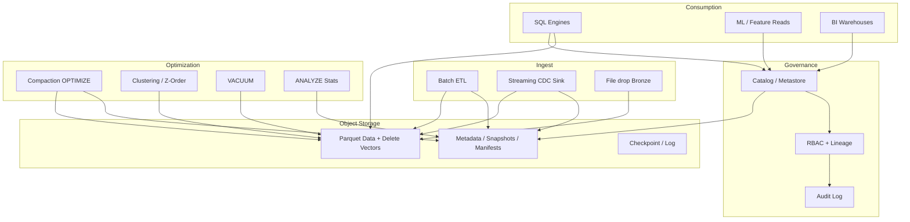
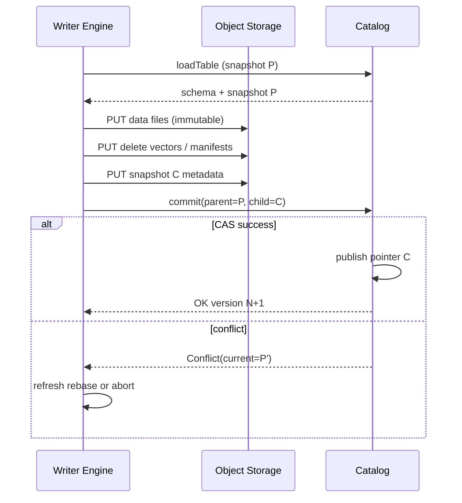

# System Design: Lakehouse

> **Focus areas:** Open table formats · ACID commits on object storage · Medallion architecture · Concurrent readers/writers · Time travel · Compaction · Catalog/governance · Storage/compute separation  
> **Style:** End-to-end product design with progressive scale (10× → 100× → 1,000×)  
> **Interview theme:** Databricks / Iceberg / Delta Lake–style depth

---

## Table of Contents

1. [Clarify Requirements (Interview Q&A)](#1-clarify-requirements-interview-qa)
2. [Back-of-the-Envelope Estimation](#2-back-of-the-envelope-estimation)
3. [High-Level Design](#3-high-level-design)
4. [Architecture Diagram](#4-architecture-diagram)
5. [Design Deep Dive](#5-design-deep-dive)
6. [Wrap-Up](#6-wrap-up)
7. [Deeper / Related Interview Questions](#7-deeper--related-interview-questions)

---

## 1. Clarify Requirements (Interview Q&A)

Design a **lakehouse**: analytical tables on cheap object storage with warehouse-like reliability (atomic commits, schema evolution, time travel) and elastic compute engines.

### 1.0 What this is / is not

| This is | This is not |
|---------|-------------|
| Tables on object storage + transaction log / manifests | Classic Hadoop NameNode HDFS-only design |
| Unified batch + streaming + BI/ML on same data | OLTP database replacing Postgres |
| Open formats (Parquet + Iceberg/Delta/Hudi-like) | Proprietary closed binary only |
| Catalog, governance, optimization jobs | Just “dump files in a bucket” data swamp |

### 1.1 Functional Requirements

| # | Question to ask | Expected / typical interviewer answer | Design implication |
|---|-----------------|----------------------------------------|--------------------|
| F1 | Workloads? | ETL, BI, streaming ingest, ML feature reads | Medallion Bronze/Silver/Gold; multi-engine |
| F2 | Table operations? | Append, overwrite, MERGE/upsert, DELETE, time travel | Transaction protocol + delete vectors / COW |
| F3 | Format? | Parquet data files + open table metadata | Spec-compatible Iceberg/Delta-like design |
| F4 | Engines? | Spark, Trino/Presto, Flink, warehouse engine | Engine-agnostic storage paths + catalog API |
| F5 | Commit semantics? | Readers see version N or N+1, never partial | Atomic publish of metadata pointer |
| F6 | Schema evolution? | Add columns common; breaks controlled | Writer/reader protocol + column IDs |
| F7 | Concurrency? | Many readers; fewer concurrent writers per table | OCC on snapshot/branch; conflict detection |
| F8 | Governance? | RBAC, lineage, audit, column masking | Unity-Catalog-like metastore |
| F9 | Streaming? | Continuous append + MERGE from CDC | Exactly-once sink via idempotent commits |
| F10 | Compaction? | Yes — small files kill performance | OPTIMIZE / rewrite background jobs |
| F11 | GDPR / deletes? | Row deletes + retention vacuum | Delete files/vectors + timed removal |
| F12 | Partitioning? | Time + keys; evolving to clustering | Hidden partitioning / liquid clustering story |
| F13 | Change data feed? | Consumers want row-level changes | CDC from commit diffs |
| F14 | Multi-cloud? | One cloud MVP; abstract FS | Path + credential provider interface |

**MVP functional scope:**

1. Managed tables: `CREATE TABLE` → root path + metadata log.
2. Append / partition overwrite / MERGE INTO.
3. Snapshot isolation reads by version or timestamp.
4. Catalog: `catalog.schema.table` → current metadata location.
5. Streaming sink committing atomic snapshots.
6. OPTIMIZE compaction + VACUUM expired files.
7. Basic RBAC + audit of commits.
8. Schema evolution: add/rename via column IDs; reject unsafe drops by default.

**Out of MVP:**

- Multi-region multi-writer active-active on one table
- Sub-10ms point lookups as primary API
- Full ANSI serializable multi-table transactions across engines
- Automatic global indexing service (optional Phase 2)

### 1.2 Non-Functional Requirements

| # | Question | Expected answer | Target |
|---|----------|-----------------|--------|
| N1 | Commit atomicity | All-or-nothing snapshot | Metadata swap atomic |
| N2 | Reader latency | Seconds–minutes analytical | Not OLTP |
| N3 | Commit latency | Streaming-friendly | p99 commit &lt; 1–5s typical |
| N4 | Durability | Object store class | Rely on cloud; multi-AZ |
| N5 | Availability | Catalog HA | Engines stateless |
| N6 | Concurrent writers | Detect conflicts | OCC + retry |
| N7 | Cost | Storage cheap; control requests & small files | Compaction, caching manifests |
| N8 | Time travel retention | Configurable | e.g. 7–30 days then VACUUM |

### 1.3 Cases (User Flows & Edge Cases)

**Happy paths**

1. Streaming job appends micro-batch → commit vN → BI query reads vN.
2. MERGE upserts keys from CDC → rewrite/delete-vector → commit.
3. Analyst time-travels to yesterday for debug.
4. OPTIMIZE compacts 50K tiny files → 500 larger files; queries speed up.
5. GDPR delete job marks rows deleted; VACUUM eventually drops data files past retention.

**Edge / failure cases**

| Case | Behavior |
|------|----------|
| Two writers commit same parent snapshot | One wins; loser conflicts & retries |
| Writer crash after data write before commit | Orphan files; vacuum later; readers unaffected |
| Catalog outage | New commits fail; engines with cached snapshot may read |
| Metadata hot spot (huge manifests) | Metadata compaction / partition manifests |
| Schema incompatible change | Reject commit; require migration job |
| Small-files storm | Auto-compaction trigger; ingest buffering |
| VACUUM too aggressive | Breaks time travel / in-flight long readers — enforce min retention + safety checks |
| Clock skew for timestamp travel | Prefer version IDs; timestamp uses commit timestamps with care |
| Concurrent OPTIMIZE + MERGE | OCC on overlapping files; serialize or partial progress |
| GDPR vs time travel | Legal hold vs retention policy matrix |

### 1.4 Scales (Progressive)

| Metric | Baseline | 10× | 100× | 1,000× |
|--------|----------|-----|------|--------|
| Tables | 5K | 50K | 500K | 5M |
| Daily ingest | 20 TB | 200 TB | 2 PB | 20 PB |
| Peak commits / s | 100 | 1K | 10K | 100K |
| Files / large table | 50K | 500K | 5M | 50M (needs clustering + compaction) |
| Snapshots retained / table | 100 | 200 | 500 | 500 + branch mgmt |
| Concurrent readers | 500 | 5K | 50K | 500K |
| Concurrent writers / hot table | 5 | 10 | 20 | 50 (branching / partitioning) |
| Catalog QPS | 1K | 10K | 100K | 1M |

**What each jump forces:**

- **10×:** Metadata compaction; avoid LIST-on-query; dedicated compaction fleet; catalog replicas.
- **100×:** Shard catalog; per-table commit coordinators; manifest fan-out; liquid clustering / Z-order jobs; CDC feed materialization.
- **1,000×:** Hierarchical manifests; geo cells; table branching for heavy writer fanout; object-store request budgets; autonomous optimization (file size, clustering, stats).

### 1.5 Etc. (Constraints & Assumptions)

- Primary cloud object storage (S3/ADLS/GCS) with strong GET/PUT durability.
- Compute ephemeral (Spark/Trino/Flink jobs or warehouses).
- Single primary metastore per region cell for MVP.
- Prefer **column IDs** over name-based schema binding.
- Medallion is organizational — physical design still needs partitioning/clustering.

**Scope statement to repeat back:**

> Design a lakehouse: Parquet data + open-table transaction metadata on object storage, with atomic snapshot commits, MERGE/time travel, multi-engine reads, catalog/governance, and compaction—from tens of TB/day to multi-PB/day—without pretending to be an OLTP database.

---

## 2. Back-of-the-Envelope Estimation

### 2.1 Ingest & files

```text
Baseline ingest 20 TB/day compressed columnar ≈ 20 TB
Avg file target size 256 MB → ~80K new files/day if perfectly sized

Reality with streaming 1–32 MB files:
  20 TB / 8 MB ≈ 2.5M tiny files/day  ← compaction mandatory
```

### 2.2 Commit rate

```text
Streaming sinks: 200 tables × 1 commit / 30s ≈ 6.7 commits/s average
ETL hour: burst 10× → ~70/s
Peak platform 100 commits/s baseline with headroom

At 1,000× ingest with more tables: tens of thousands commits/s
→ catalog + metadata writes must shard; not one Postgres row lock per global table list
```

### 2.3 Metadata size

```text
Large table: 5M data files × 150 bytes manifest entry ≈ 750 MB raw manifests
With snapshots: if each snapshot copies full manifest list naively → explosion

Design: manifest lists + reusable manifests + metadata compaction
Steady metadata per huge table: low GB with compaction, not TB
```

### 2.4 Object storage requests

```text
Bad interactive query: LIST 100K objects + 100K GETs
Good: read metadata (few GETs) → 2K pruned file GETs

Baseline 500 concurrent readers × 2K GET/s each = 1M GET/s
→ Need pruning + caching manifests in engine memory / distributed cache
```

### 2.5 Compaction compute

```text
Rewrite 2.5M tiny files/day → ~20 TB rewrite
At 2 GB/s aggregate compaction throughput → ~2.8 hours/day cluster time
Budget compaction as first-class capacity, not best-effort leftover
```

### 2.6 Hot partitions

```text
Event table partitioned by hour:
  “current hour” takes 40% writes → writer conflicts + small files
Mitigation: larger ingest buffers, liquid clustering, random prefixes carefully,
  or branch-per-writer then fast-forward merge
```

---

## 3. High-Level Design

### 3.1 Conceptual model

```text
Catalog
  └── Namespace / Schema
        └── Table
              ├── Current snapshot ID (pointer)
              ├── Schema (column id, name, type, nullability)
              ├── Partition / clustering spec
              ├── Properties (retention, format version)
              └── Transaction log / metadata tree
                    ├── Snapshot N → manifest list → manifests → data files
                    ├── Statistics
                    └── Delete files / deletion vectors (MERGE/DELETE)
```

**Medallion (logical):**

| Layer | Purpose | Patterns |
|-------|---------|----------|
| Bronze | Raw landing | Append-only, schema-on-read soft |
| Silver | Cleaned/conformed | MERGE dedupe, typed schema |
| Gold | Product aggregates | Tables/MVs for BI/ML |

### 3.2 Commit protocol (sketch)

**Goal:** atomically advance `current_snapshot` from parent P to child C.

```text
1. Writer reads current snapshot S_parent (or branch tip)
2. Writes new data/delete files to object storage (immutably)
3. Writes new manifests / manifest list referencing files
4. Builds Snapshot metadata object (parent, schema-id, summary)
5. Attempts atomic commit:
   - Conditional update of version pointer (compare-and-swap on parent)
   - OR append next log entry with optimistic conflict check (Delta-style)
6. On conflict: refresh, rebase if possible, else retry / abort
7. On success: readers see new snapshot; old files retained for time travel
```

**Invariant:** data files invisible until metadata commit succeeds.

### 3.3 Copy-on-write vs merge-on-read

| Approach | Write path | Read path | Best for |
|----------|------------|-----------|----------|
| **COW** | Rewrite touched files | Simple/fast | Read-heavy, infrequent updates |
| **MOR** + delete vectors | Write deletes + extras | Must merge deletes | Heavy upsert/CDC |
| Hybrid | Policy by table | Engine supports both | Real platforms |

**MVP choice:** COW for simplicity on small dimensions; MOR delete vectors for large fact CDC tables.

### 3.4 Catalog API

| Op | Semantics |
|----|-----------|
| `createTable` | Allocate root, write metadata v0 |
| `loadTable` | Return current metadata location + schema |
| `commit` | CAS metadata pointer / log append |
| `dropTable` | Tombstone; async purge per policy |
| `listSnapshots` / `rollback` | Time travel admin |

Metastore stores: table identifier → metadata JSON location + version + grants. **Do not** store every file path in SQL DB.

### 3.5 Engines & storage separation

```text
+------------------+     +------------------+     +------------------+
| Spark / Flink    |     | Trino / Warehouse|     | ML training jobs |
+--------+---------+     +--------+---------+     +--------+---------+
         |                        |                        |
         +------------------------+------------------------+
                                  |
                         Table format SDK
                                  |
                    +-------------+-------------+
                    |  Object Storage (data +   |
                    |  metadata files)          |
                    +-------------+-------------+
                                  |
                         Catalog Service (HA)
```

Compute scales independently; storage is durable SoT for files; catalog is SoT for pointers/grants.

### 3.6 Option analysis

#### A. Table format

| Option | Pros | Cons |
|--------|------|------|
| Iceberg-like | Multi-engine, hidden partitioning, rich spec | Complexity |
| Delta-like | Strong Spark story, log simplicity | Ecosystem coupling historically |
| Hudi-like | Upsert/incremental emphasis | Different trade-offs |
| Hive only | Simple | No reliable ACID / explosion of LIST |

**Choice:** Iceberg-style metadata tree + optional Delta log compatibility narrative in interview — emphasize **atomic snapshot + manifests**.

#### B. Catalog store

| Option | Pros | Cons | Deal-breaker |
|--------|------|------|--------------|
| **Raft/HA KV + object metadata** | Fits pointer CAS | Ops | — |
| Postgres | Transactions | Hot rows on popular tables | Shard by table_id at scale |
| Store only in object log | Simple | Slow list tables / grants awkward | Weak governance |

#### C. Writer concurrency

| Strategy | Notes |
|----------|-------|
| OCC on snapshot | Default |
| Partition-level conflict | Reduce false conflicts |
| Table branches | High writer fanout → merge |
| Serial writer queue | Simple but low throughput |

### 3.7 Progressive scale

- **Baseline:** Single regional catalog (HA Postgres); Spark jobs; nightly OPTIMIZE.
- **10×:** Continuous compaction; manifest caching; metrics on small-file ratio.
- **100×:** Sharded catalog; async metadata compaction; CDF topics; clustering jobs.
- **1,000×:** Autonomous optimization; per-domain catalogs; cross-engine commit coordination standards; request-aware ingest.

---

## 4. Architecture Diagram

### 4.1 Lakehouse platform



### 4.2 Commit sequence



### 4.3 Medallion flow

```text
OLTP / Events ──CDC──► Bronze (raw append)
                         │ cleaning, dedupe, type
                         ▼
                       Silver (conformed MERGEd entities)
                         │ business aggregates
                         ▼
                       Gold (BI facts/dims, feature tables)
                         │
                         ├── Trino/BI
                         └── Training jobs
```

---

## 5. Design Deep Dive

### 5.1 Reliability

#### 5.1.1 Hard invariants

1. **Publish atomicity** — readers never observe partial file sets from a commit.
2. **Immutability of data files** — updates create new files; never mutate Parquet in place.
3. **Orphan isolation** — uncommitted files are invisible and eventually GC’d.
4. **Retention safety** — VACUUM must not delete files still referenced by retained snapshots or running readers (grace period).
5. **Idempotent sinks** — streaming commit epoch / Exact-once markers in snapshot summary.

#### 5.1.2 Failure modes

| Failure | Effect | Recovery |
|---------|--------|----------|
| Crash before commit | Orphan files | Janitor VACUUM |
| Crash after commit ACK | OK | Consumers see new snapshot |
| Split brain catalog | Dual heads | Single-leader Raft / fencing |
| Partial manifest upload | Commit fails CAS | Retry clean |
| Bitrot rare | Checksums in footer + optional inventory | Repair rewrite |

#### 5.1.3 Exactly-once streaming sink

```text
For micro-batch epoch E:
  write files with path including E
  commit snapshot with summary {epoch:E, source:topic-partition-offsets}
  on restart: if latest snapshot already contains E → skip write
```

Rely on **commit idempotency**, not exactly-once object PUT.

#### 5.1.4 Conflicts & retries

- Detect overlapping rewritten data files or conflicting branch tips.
- Retry with exponential backoff; cap; surface `CONFLICT` to orchestration for deterministic replay.
- Prefer partitioning write fanout to reduce conflict probability.

#### 5.1.5 Backpressure

- If compaction lag &gt; SLO, slow ingest (token bucket on commits) rather than create 100M files.
- Catalog commit rate limits per table and per tenant.

### 5.2 Scalability

#### 5.2.1 Metadata scalability

Techniques:

1. Hierarchical manifests (manifest lists → manifests → files).
2. Reuse unchanged manifests across snapshots.
3. Metadata compaction rewriting small metadata files.
4. Partition-level stats for pruning.
5. Puffin / stats side-cars for NDV sketches.

#### 5.2.2 Data layout scalability

| Technique | Benefit |
|-----------|---------|
| Hidden partitioning | Users query without partition columns always |
| Z-order / liquid clustering | Multi-dimensional locality |
| Target file size 128–512 MB | Balance parallelism vs open cost |
| Sort within files | Better page skipping |
| Delete vectors | Avoid rewriting huge files on sparse deletes |

#### 5.2.3 Compaction strategy

```text
Trigger when:
  - file count > threshold OR
  - avg file size << target OR
  - delete vector ratio > R

Job:
  select small/overlapping files → rewrite → commit replace
  prioritize hot partitions
```

Bin-pack by size; respect clustering keys; don’t rewrite cold historical partitions unnecessarily.

#### 5.2.4 Catalog sharding

| Scale | Approach |
|-------|----------|
| Baseline | HA primary |
| 100× | Shard by hash(table_id) / namespace |
| 1,000× | Domain catalogs + federation |

#### 5.2.5 Multi-engine interoperability

- Engines must honor the same commit protocol version.
- Column IDs stabilize renames.
- Forward-compatible metadata: ignore unknown fields safely.

### 5.3 Maintainability

#### 5.3.1 Observability

| Metric | Why |
|--------|-----|
| Commits/s, conflict rate | Writer health |
| Small file ratio, avg file MB | Compaction backlog |
| Snapshot count, metadata size | Time travel / GC |
| VACUUM deleted bytes | Cost reclaim |
| Scan files pruned % | Layout quality |
| Orphan file bytes | Janitor lag |

#### 5.3.2 Governance & lineage

- Table/column lineage from job manifests (input snapshots → output snapshot).
- Audit: who committed what version when.
- Column masking applied in engines via catalog policies.

#### 5.3.3 Schema evolution playbook

| Change | Safe? | Mechanism |
|--------|-------|-----------|
| Add column | Yes | New column id; old files null |
| Widen type | Sometimes | Spec rules / rewrite |
| Rename | Yes w/ ids | Update mapping |
| Drop column | Soft first | Mark deleted; rewrite later |
| Reorder | Yes w/ ids | Metadata only |

#### 5.3.4 Operations runbooks

- **Rollback table** to prior snapshot (metadata pointer).
- **Repair** after failed job: expire orphan prefixes.
- **Legal hold** disables VACUUM for tagged tables.

#### 5.3.5 Cost maintainability

- Lifecycle policies: move cold partitions to rarer storage class **only if** format/engine supports; often keep Standard and rely on compaction.
- Track GET/LIST costs separately from GB-month.

---

## 6. Wrap-Up

### 6.1 What we designed

A **Databricks-style lakehouse**: object storage data lake + ACID-ish open table format, catalog/governance, medallion pipelines, streaming idempotent sinks, compaction/vacuum, and multi-engine consumption—with progressive scale from tens of TB/day to multi-PB/day.

### 6.2 Key decisions

1. **Atomic snapshot publish** — files first, metadata CAS second.  
2. **Manifest tree, never LIST-as-truth.**  
3. **COW vs MOR by workload.**  
4. **Compaction as capacity, not charity.**  
5. **Column IDs for schema evolution.**  
6. **Catalog stores pointers + grants, not every file.**  
7. **Time travel bounded by VACUUM policy.**  
8. **OCC + optional branches for writer scale.**

### 6.3 Risks

| Risk | Mitigation |
|------|------------|
| Metadata explosion | Compaction + reusable manifests |
| GDPR vs time travel | Policy matrix |
| Multi-writer conflicts | Partitioning / branches |
| Engine skew on format versions | Platform conformance tests |
| Cost blowup from tiny files | Ingest buffering + auto-optimize |

### 6.4 45-minute arc

1. Clarify lakehouse vs swamp vs warehouse (5 min)  
2. Numbers: files/day, GET storms (4 min)  
3. Commit protocol + COW/MOR (12 min)  
4. Compaction, clustering, catalog (10 min)  
5. Governance + scale jumps (6 min)  
6. Traps (remainder)

---

## 7. Deeper / Related Interview Questions

### 7.1 Commit protocol

**Q: Why write data files before committing metadata?**  
A: So failed writers don’t publish partial tables. Orphans are OK; partial visibility is not.

**Q: How is CAS implemented on S3?**  
A: S3 alone lacked strong conditional writes historically — catalogs often store the pointer in a strongly consistent DB / DynamoDB conditional update / Raft, while metadata files live in object storage. Single-file “log put if not exists” patterns also exist (Delta). Discuss fencing.

**Q: Can two snapshots reference the same data file?**  
A: Yes — immutability enables reuse across snapshots and COW sharing.

### 7.2 Upserts & deletes

**Q: MERGING 0.1% keys daily on a 100 TB table — COW or MOR?**  
A: MOR/delete vectors avoid rewriting 100 TB; readers pay merge cost; compaction eventually materializes.

**Q: How do deletion vectors interact with time travel?**  
A: Older snapshots ignore newer delete vectors; vacuum removes vectors/files only when no retained snapshot needs them.

**Q: Primary key uniqueness enforcement?**  
A: Table format doesn’t give OLTP unique indexes for free; enforce in MERGE logic / quality jobs; optional index structures Phase 2.

### 7.3 Small files & listing

**Q: Why are small files deadly?**  
A: Open cost, NameNode/metastore pressure (if listed), S3 request costs, poor throughput. Fix with buffering, larger rollups, compaction.

**Q: Is `msck repair` a strategy?**  
A: No for lakehouse at scale — that’s Hive listing culture. Manifests are the SoT.

### 7.4 Partitioning & clustering

**Q: Why hidden partitioning?**  
A: Users write `WHERE event_time BETWEEN …` without remembering `dt=`; evolvable specs without rewriting queries.

**Q: Z-order vs hive partition by day?**  
A: Partitions are coarse pruning; Z-order/clustering helps multi-predicate locality inside/across files. Often combine day partition + cluster on user_id.

**Q: Over-partitioning by high-cardinality user_id?**  
A: Deal-breaker — millions of partitions. Prefer clustering/sorting.

### 7.5 Streaming

**Q: Exactly-once end-to-end from Kafka to table?**  
A: Consumer offsets stored in snapshot summary; idempotent epoch commits; at-least-once delivery + idempotent publish.

**Q: Late data?**  
A: MERGE into Silver with event-time watermarks; Gold recomputed or incremental MV.

### 7.6 Governance

**Q: Where is RBAC enforced?**  
A: Catalog at planning time; engine must be trusted or run in governed gateway. Pure file access bypass is a risk — block with storage IAM + no public buckets.

**Q: Lineage grain?**  
A: Table/snapshot and column-level from plan explanations; job run IDs correlate.

### 7.7 Vacuum & GDPR

**Q: Difference between DELETE and VACUUM?**  
A: DELETE makes rows invisible in new snapshots; VACUUM physically removes unreferenced files after retention.

**Q: Can time travel resurrect deleted PII?**  
A: Yes until vacuum/retention — compliance must set retention accordingly or use crypto-erasure patterns carefully.

### 7.8 Multi-engine & format versions

**Q: Spark wrote v2 metadata; Trino older — what happens?**  
A: Compatibility matrix; readers should fail safe on unknown required features, not corrupt.

**Q: Why column IDs?**  
A: Renames/reorders don’t break data files; name-only schemas are fragile.

### 7.9 Performance algorithms

**Q: Manifest pruning algorithm?**  
A: Stats min/max / bloom on partitions and columns; skip manifests then files then row groups.

**Q: Footer’s role?**  
A: Parquet footer has row group stats; engines read footer (or cached) before page IO.

**Q: Bin-packing compaction?**  
A: Greedy pack small files into ~target size groups preserving sort/clustering constraints.

### 7.10 Consistency models

**Q: Serializable multi-table transactions?**  
A: Usually per-table snapshots; multi-table atomicity needs higher-level commit coordinator / workflow — call out as advanced.

**Q: Read-your-writes for streaming job?**  
A: Job uses snapshot it committed; others see after catalog publish.

### 7.11 Failure injection

1. Kill writer after PUT data before commit → orphans only.  
2. Dual commit conflict → one fails.  
3. VACUUM during long-running query → retention grace protects.  
4. Catalog failover → brief commit outage.  
5. Corrupt footer → skip file + quarantine alert.

### 7.12 Comparisons

**Q: Lakehouse vs warehouse?**  
A: Warehouse: managed storage+compute, strong governance out of box. Lakehouse: open storage ownership, multi-engine, cheaper storage, you own compaction/quality.

**Q: Lakehouse vs data lake?**  
A: Lake = files. Lakehouse = files + ACID metadata + table semantics + governance.

**Q: Iceberg vs Delta in interview?**  
A: Don’t religious-war; show you understand snapshot/manifest vs log+checkpoint and multi-engine implications.

---

*End of design doc. Use section 1 as interview opening script; sections 3–5 as the whiteboard core; section 7 for grilling practice.*
