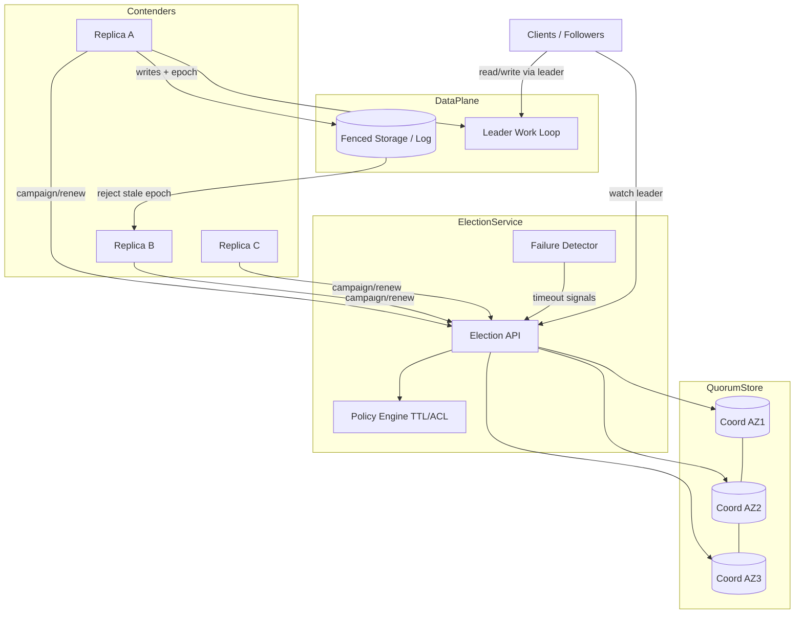
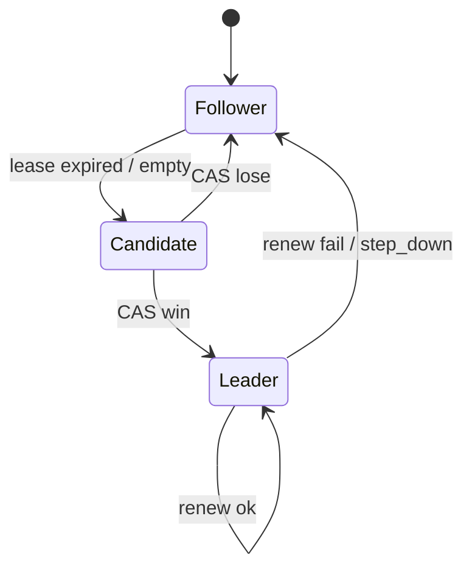

# System Design: Leader Election

> **Focus areas:** Liveness vs safety · Lease/epoch fencing · Split-brain · Heartbeats · Quorum · Follower failover · Multi-election domains · Observability  
> **Style:** End-to-end platform design with progressive scale (10× → 100× → 1,000×)  
> **Quality bar:** Explicit safety invariants; fencing tokens; election latency budgets; no “just use ZooKeeper” without trade-offs

---

## Table of Contents

1. [Clarify Requirements (Interview Q&A)](#1-clarify-requirements-interview-qa)
2. [Back-of-the-Envelope Estimation](#2-back-of-the-envelope-estimation)
3. [High-Level Design](#3-high-level-design)
4. [Architecture Diagram](#4-architecture-diagram)
5. [Design Deep Dive](#5-design-deep-dive)
6. [Wrap-Up](#6-wrap-up)
7. [Deeper / Related Interview Questions](#7-deeper--related-interview-questions)

---

## 1. Clarify Requirements (Interview Q&A)

The goal of this phase is to **bound the problem**: what “leader” means, which safety properties are non-negotiable, and at what scale elections must stay fast and correct.

### 1.0 What this is / is not

| Dimension | This design | Not this |
|-----------|-------------|----------|
| Job | Choose **at most one** active primary for a work domain; hand off on failure | Generic consensus library tutorial |
| Output | Leadership lease + fencing token + membership view | Full replicated state machine (Raft log is optional substrate) |
| Consumers | Shard primaries, cron singleton, partition writers, controller | User-facing product API |
| Durability of role | Soft state with hard fencing | Permanent “king for life” |
| Related | ZooKeeper/Chubby, etcd, Raft, Kubernetes lease | Distributed cache, message queue |

### 1.1 Functional Requirements

| # | Question to ask | Expected / typical interviewer answer | Design implication |
|---|-----------------|----------------------------------------|--------------------|
| F1 | What work does the leader own? | One active writer / scheduler / controller per **election domain** (shard, topic, cluster) | Domain key is the unit of election; many independent elections |
| F2 | At-most-one or preferably-one? | **Safety first:** never two active leaders mutating the same domain | Fencing tokens; storage/API must reject stale leaders |
| F3 | How do clients discover the leader? | Watch / poll / push membership; sticky until epoch changes | Leader directory + versioned notifications |
| F4 | Failover SLO? | Detect + elect in **seconds**, not minutes for most domains | Heartbeat timeout ≪ business RTO; tunable per class |
| F5 | Voluntary vs crash handover? | Both: graceful step-down and crash failover | Drain window + forced revoke |
| F6 | Multi-region? | Prefer **regional** elections; global only for true global singleton | Avoid cross-region lease chatter for shard-local work |
| F7 | Sticky leadership? | Prefer stable leader under flaky network (anti-flap) | Quorum + backoff + priority / incumbency bias |
| F8 | Contenders? | N replicas per domain; any healthy replica may candidacy | Membership service + health signals |
| F9 | External dependencies? | May use etcd/ZK/Chubby **or** embed Raft; design must not assume one | Abstract “coordination store” with lease API |
| F10 | Fencing required? | Yes — storage/work APIs check epoch | Epoch monotonically increases per domain |
| F11 | Observability? | Who is leader, why elected, last heartbeat, election count | Audit trail + metrics + traces |
| F12 | Split-brain policy? | Prefer **no leader** over dual leaders | Quorum loss → domain unavailable for writes |
| F13 | Workload classes? | Hot shard primaries (many) + rare global controllers (few) | Different timeout / quorum / placement policies |

**MVP functional scope (lock this with interviewer):**

1. Create / destroy **election domains** (e.g. `shard-042`, `scheduler-main`).
2. Contenders acquire a **time-bounded lease** with a monotonically increasing **epoch**.
3. Heartbeat renews lease; missed renewals → lease expire → re-election.
4. Clients observe current `(leader_id, epoch)` via watch or short-poll.
5. Work APIs reject requests with stale epoch (**fencing**).
6. Graceful step-down and forced revoke for ops.
7. Metrics: election latency, flap rate, dual-claim attempts blocked.

**Out of MVP (explicitly defer):**

- Byzantine fault tolerance
- Cross-datacenter active-active dual writers with CRDTs
- Automatic rebalancing of election domains across racks (basic placement OK)
- Full Raft log replication of application state (election ≠ state machine)
- Mobile / edge offline leadership

### 1.2 Non-Functional Requirements

| # | Question | Expected answer | Target |
|---|----------|-----------------|--------|
| N1 | Election latency (detect→new leader)? | Interactive control plane | p50 < 2s, p99 < 10s (class A); class B looser |
| N2 | False failover rate? | Rare under load | < 0.1%/domain/day under normal jitter |
| N3 | Availability of writes during quorum loss? | Writes stop | Fail closed; reads may continue if policy allows |
| N4 | Consistency / safety? | Never two fenced writers | Safety > liveness always |
| N5 | Multi-region? | Lease store regional + DR | RPO of lease metadata ≈ 0 within region (quorum); DR runbook |
| N6 | Throughput of elections? | Burst on cascade failures | Survive thundering herd of N domains |
| N7 | Security? | Authenticated contenders | mTLS; ACL on domain prefixes |
| N8 | Cost? | Coordination traffic cheap vs data plane | Bound watch fanout; batch heartbeats |

### 1.3 Cases (Happy Paths & Edge / Failure)

**Happy paths**

1. Contender wins empty domain → epoch=1 → clients watch → start writes with fencing token.
2. Leader renews lease every T/3; followers stay standby.
3. Graceful step-down → epoch bump → new leader; old leader stops after ack.
4. Crash → lease expires → election → new epoch → clients reconnect.
5. Ops force-revoke → immediate election for incident response.

**Edge / failure cases**

| Case | Behavior |
|------|----------|
| Network partition: old leader isolated | Lease expires in quorum majority; minority cannot renew; old leader’s writes **fenced** by storage |
| GC pause > lease TTL | Treated as failure; must not resume without new epoch |
| Clock skew | Prefer **lease timeouts based on coordinator clocks**, not absolute wall clocks on contenders |
| Dual candidates race | CAS / compare-and-swap on `(domain, epoch)`; one winner |
| Cascade: coordinator blip | Backoff + jitter; priority to previous leader if still healthy (optional sticky) |
| Zombie leader after pause | Any write with old epoch rejected; local self-check on renew failure |
| Split brain without fencing | **Design bug** — call out as deal-breaker |
| Contender storm after outage | Rate-limit candidacy; randomized backoff; batch watches |
| Domain deleted while leader active | Revoke + tombstone; reject renewals |
| Partial membership change | Quorum recomputed; elections pause until membership stable (configurable) |

### 1.4 Scales (Progressive)

| Metric | Baseline | 10× | 100× | 1,000× |
|--------|----------|-----|------|--------|
| Election domains | 1K | 10K | 100K | 1M |
| Contenders / domain (avg) | 3 | 3 | 3–5 | 3–5 |
| Heartbeats / s (all domains) | ~3K | ~30K | ~300K | ~3M |
| Elections / day (steady) | ~50 | ~500 | ~5K | ~50K |
| Elections / min (cascade peak) | ~100 | ~1K | ~10K | ~100K |
| Watch clients | 5K | 50K | 500K | 5M |
| Coordination store QPS | ~5–10K | ~50–100K | ~0.5–1M | ~5–10M |
| Cross-AZ RTT | 1–2 ms | same | same | same |
| Cross-region RTT | 50–150 ms | — | avoid for leases | cells |

**What each jump forces architecturally:**

- **10×:** Dedicated coordination cluster; connection pooling; watch coalescing; per-class TTLs.
- **100×:** Shard election metadata by domain hash; separate hot controller domains from mass shard elections; heartbeat batching / lease hierarchy.
- **1,000×:** Cell-local elections; hierarchical leaders (cell controller → shard primary); push-based membership; avoid global watch bus.

### 1.5 Etc. (Constraints & Assumptions)

- **Single cloud, multi-AZ** for MVP; multi-region DR for coordination store.
- **Not Byzantine:** crash-stop + network partitions.
- **Application must honor fencing** — election alone is insufficient.
- **Lease TTL classes:** Class A (shard primary) 3–10s; Class B (batch scheduler) 30–60s; Class C (human-ops singleton) minutes.

**Scope statement to repeat back:**

> Design a **leader-election service** that grants time-bounded, fenced leadership per domain with at-most-one safety, second-scale failover, graceful step-down, and progressive scale from ~1K to ~1M domains—without assuming a specific consensus product, but requiring a quorum lease store and application-level fencing.

---

## 2. Back-of-the-Envelope Estimation

### 2.1 Heartbeat math

Assume TTL = 9s, renew every 3s, 1K domains × 1 leader renewing:

```text
Baseline renewals ≈ 1,000 / 3 ≈ 333 renewals/s
With 3 contenders each probing health lightly: still O(10²–10³)/s
At 1,000× (1M domains): ≈ 1e6 / 3 ≈ 333K renewals/s
```

Add quorum write amplification (e.g. Raft majority of 3 → ~2 durable writes):

```text
1,000× durable ops ≈ 333K × 2 ≈ ~700K disk/log appends/s across the coordination fleet
→ Must shard coordination metadata and/or use hierarchical leases
```

### 2.2 Election burst (power outage recovery)

```text
100K domains lose leaders simultaneously
Target: drain elections in 60s → ≈ 1.7K elections/s
Each election: 1–3 CAS rounds + N watches notify
→ Coordination store needs burst headroom ≥ 10× steady renewals
```

### 2.3 Watch fanout

```text
Naive: 500K clients × 1 watch each on “all domains” → impossible
Correct: watch only domains you care about; coalesce; use versioned snapshots + delta
```

### 2.4 Memory (coordination store)

```text
Per domain record: ~200–500 B (leader, epoch, ttl, ACL refs)
1M domains × 500 B ≈ 500 MB hot + indexes/replicas → few GB trivial
Bottleneck is QPS and watch fanout, not bytes
```

### 2.5 Bandwidth

```text
Renewal RPC ~200 B; 333K/s → ~66 MB/s payload (+ framing)
Watch notifies on election only (rare) except membership storms
```

### 2.6 Latency budget (Class A)

| Step | Budget |
|------|--------|
| Missed renewals detected | 1× TTL (worst) or failure detector sooner |
| Quorum CAS elect | 1–3 RTTs (~5–15 ms in AZ) |
| Notify watchers | +5–50 ms |
| Fence old leader (storage reject) | immediate on next write |
| **Total after last heartbeat** | ≈ TTL + tens of ms (design for TTL-dominated) |

**Deal-breaker:** TTL of 60s for a shard that needs 5s RTO.

---

## 3. High-Level Design

### 3.1 Core abstractions

```text
ElectionDomain
  domain_id          # e.g. "topic-orders-p12"
  class              # A | B | C (TTL / quorum policy)
  quorum_size
  acl

Lease
  leader_id
  epoch              # fencing token, monotonic
  expires_at         # coordinator-side deadline
  generation         # optional membership generation

Contender
  node_id
  priority           # optional sticky / rack preference
  endpoints
```

**Invariant (safety):** For any `domain_id`, at most one `(leader_id, epoch)` is **live** in the quorum view, and any smaller epoch is permanently rejected by fenced resources.

**Invariant (liveness, best-effort):** If a majority of coordination replicas and ≥1 healthy contender exist, a leader is elected within a bounded number of TTL periods.

### 3.2 API shape

| Method | Path / RPC | Purpose |
|--------|------------|---------|
| POST | `/v1/domains` | Create domain + policy |
| DELETE | `/v1/domains/{id}` | Tombstone + revoke |
| POST | `/v1/domains/{id}/campaign` | Try acquire / renew (`expected_epoch` optional) |
| POST | `/v1/domains/{id}/step_down` | Graceful release |
| POST | `/v1/domains/{id}/revoke` | Ops force |
| GET | `/v1/domains/{id}` | Current lease view |
| GET | `/v1/domains/{id}/watch` | Long-poll / SSE / gRPC stream |

**Campaign request (conceptual):**

```json
{
  "contender_id": "node-7",
  "priority": 10,
  "prev_epoch": 41,
  "ttl_ms": 9000
}
```

**Success response:**

```json
{
  "leader_id": "node-7",
  "epoch": 42,
  "expires_at": "2026-08-06T09:00:09Z",
  "renew_by": "2026-08-06T09:00:06Z"
}
```

### 3.3 Algorithm choices (trade-off table)

| Approach | How | Pros | Cons | When |
|----------|-----|------|------|------|
| **Lease in etcd/ZK/Chubby** | Compare-and-swap key with TTL | Battle-tested; watches | External dependency; ops | Most product companies |
| **Embedded Raft per cell** | Local consensus group owns leases | Fewer hops | You operate Raft | Control planes at scale |
| **DB row + `SELECT FOR UPDATE`** | RDBMS lease row | Simple | DB is SPOF/latency; poor watch | Tiny fleets only |
| **Bully algorithm** | Highest ID wins | Simple theory | Bad under partitions without quorum store | Teaching, not production |
| **Gossip + φ failure detector** | Probabilistic liveness | Soft state | Hard to fence alone | Augment detection only |

**Choose for MVP:** Quorum lease store (etcd-like) + application fencing. Deal-breaker for DB-only leases at 100× heartbeat rates.

### 3.4 Fencing (non-negotiable)

```text
Client write path:
  1. Read local (leader_id, epoch)
  2. Call storage with header X-Fence-Epoch: 42
  3. Storage CAS: accept only if epoch >= stored_epoch;
     on accept, stored_epoch := epoch (or keep max)

If old leader resumes after GC pause:
  renew fails → enter FOLLOWER; drop in-flight writes
  any write with epoch 41 → REJECTED
```

Without fencing, election is theater.

### 3.5 Sticky leadership & anti-flap

| Technique | Effect |
|-----------|--------|
| Incumbent bias | Current leader wins ties if still renewing |
| Randomized backoff | Contenders wait `rand(0, B)` before campaign |
| Min leadership tenure | Ignore transient health blips for T_min |
| Separate failure detector | φ accrual vs hard TTL (detect faster, expire safely) |

Trade-off: stickiness improves stability but can delay failover when the leader is “mostly dead.”

### 3.6 Why not “everyone is leader with CRDT”?

For **single-writer** domains (Kafka partition leader, scheduler singleton), CRDTs don’t remove the need for a primary. Election remains the right tool; conflict-free types are a different product requirement.

---

## 4. Architecture Diagram



**Election state machine (per contender):**



---

## 5. Design Deep Dive

### 5.1 Reliability

**Data loss prevention (of leadership metadata)**

- Lease records replicated via Raft/Paxos quorum (majority).
- Do not treat a single Redis `SET NX` without consensus as safe under partition (unless Redis is itself consensus-backed and you accept its model).
- Tombstones for deleted domains with TTL to prevent resurrection races.

**Retries & idempotency**

- `campaign` is idempotent for the same contender renewing the same epoch.
- Contenders use exponential backoff with jitter on failure.
- Clients watching leadership treat notifications as at-least-once; compare epoch.

**Idempotency of work under failover**

- Leader work must be idempotent or transactional with fencing: e.g. “append record with epoch” or “claim job row WHERE epoch”.

**Rate limits & backpressure**

- Cap campaigns/s per contender and per domain.
- On coordination overload: prefer **extend existing leases** over new elections (liveness of incumbents).
- Shed watches (snapshot + reconnect) rather than drop renewals.

**Split-brain checklist**

| Layer | Control |
|-------|---------|
| Quorum store | Majority required to grant/renew |
| Contender | Stop work if renew fails |
| Storage | Epoch fence |
| Humans | Runbooks forbid forcing two leaders |

**Partial failure example**

Old leader GC-paused 20s, TTL 9s:

1. Quorum expires lease at t=9.
2. New leader elected epoch=43 at t=10.
3. Old leader wakes, tries write with 42 → storage rejects.
4. Old leader tries renew → loses → demotes.

### 5.2 Scalability

**Scale up / down**

- Vertical: coordination nodes with fast NVMe for Raft logs.
- Horizontal: **shard domains** by `hash(domain_id) → coordination shard`.

**Hierarchical election (100×–1,000×)**

```text
Cell controller (few domains, long TTL)
  └── Shard primary elections local to cell (many domains, short TTL)
```

Heartbeats stay cell-local; global control plane only tracks cell leaders.

**Lease batching**

One physical lease for a **bundle** of domains owned by the same process (careful: failure granularity coarsens). Trade-off: fewer renewals vs larger blast radius.

**Parallelization**

Elections across domains are independent — embarrassingly parallel. Controllers should not serialize all campaigns on one mutex.

**Storage tiers for metadata**

| Tier | Data | Store |
|------|------|-------|
| Hot | Active leases | Quorum memory + Raft log |
| Warm | Election audit | Append log / OLAP |
| Cold | Compliance archives | Object storage |

### 5.3 Maintainability

**Ops**

- `revoke`, `step_down`, `transfer` (campaign with higher priority after step-down).
- Chaos: kill leader, partition AZ, delay heartbeats — assert single fenced writer.

**Observability**

| Signal | Why |
|--------|-----|
| `election_latency_ms` | SLO |
| `lease_renew_fail_total` | Early warning |
| `dual_claim_rejected_total` | Fencing working |
| `flap_count` | TTL / sticky tuning |
| `leader_for{domain}` gauge | Dashboards |
| Audit: who won, why, prev epoch | Postmortems |

**Migrations**

- Changing TTL class: dual-read policy version; never shorten TTL globally without drain.
- Moving domains across coordination shards: pause writes or use dual-run with higher epoch fence.

**Multi-tenant**

- Namespace ACLs: `team/a/*` cannot campaign in `team/b/*`.
- Quotas on domains and watch connections per tenant.

---

## 6. Wrap-Up

### Decision summary

| Decision | Choice | Why |
|----------|--------|-----|
| Safety model | At-most-one + fencing epochs | Split-brain is unrecoverable corruption |
| Substrate | Quorum lease store | Correct under partitions |
| Failover | TTL + failure detector | Bound RTO |
| Scale | Shard domains; hierarchy at 1000× | Heartbeat QPS dominates |
| Sticky | Incumbent bias + jitter | Reduce flaps |

### Phased rollout

1. **MVP:** Lease API + watches + fencing integration guide; 1K domains.
2. **Phase 1.5:** Sharded coordination; anti-flap policies; audit log.
3. **Phase 2:** Hierarchical cell elections; automated transfer; multi-region DR.
4. **Phase 3:** 1M domains; bundle leases; SLO-based TTL classes.

### Interview close

Emphasize: **election without fencing is incomplete**; **prefer no leader over two**; scale pain is **renewals and watches**, not metadata bytes.

---

## 7. Deeper / Related Interview Questions

**Q1. Why is `SET key NX PX` in Redis not sufficient for leader election under partitions?**  
**A:** A minority Redis node (or async replica promoted wrongly) can grant a second lock. Without consensus/quorum and fencing, two leaders can appear. Redis Redlock is debated; for shard primaries prefer etcd/ZK/Chubby or Redis with strong consensus config plus fencing.

**Q2. What is a fencing token and where must it be checked?**  
**A:** Monotonic epoch per domain. Checked at **every mutating API** (storage, queue claim, external side effect), not only in the election service.

**Q3. How do you choose lease TTL?**  
**A:** `TTL > 3–5× renew interval`; `TTL ≪ business RTO`; account for GC/pause p99. Too short → flaps; too long → slow failover.

**Q4. Leader GC pause exceeds TTL — what happens?**  
**A:** Lease expires, new leader elected, old leader’s writes fenced. Process must demote on renew failure and never continue with old epoch.

**Q5. How does Raft leader election differ from “application leader election”?**  
**A:** Raft elects a log leader for the consensus group. Application election elects a primary for a business domain. You often use Raft (in etcd) as the substrate to store application leases.

**Q6. Can you elect leaders without a coordination service?**  
**A:** Only if the data plane itself provides compare-and-set with fencing (e.g. conditional writes on DynamoDB with version). Still the same abstraction.

**Q7. How do you prevent election storms after a network blip?**  
**A:** Jittered backoff, incumbent sticky, rate limits, and prefer renew path capacity over campaign path.

**Q8. What’s the CAP trade-off for leadership?**  
**A:** On partition, minority must not accept writes (CP for leadership). Availability of the domain’s writes drops until quorum returns.

**Q9. How do watches scale to millions of clients?**  
**A:** Don’t. Clients watch narrow prefixes; use brokers; snapshot+delta; hierarchical membership.

**Q10. Sticky leadership vs faster failover — how decide?**  
**A:** Measure false failover cost (rebalances, cache cold) vs downtime cost. Class A shards: moderate sticky; payments controller: careful sticky + fast detect.

**Q11. How do you test split-brain?**  
**A:** Inject partitions between leader and quorum; assert storage rejects stale epoch; assert metrics `dual_claim_rejected`.

**Q12. Should clocks be synchronized?**  
**A:** Contenders shouldn’t rely on their wall clocks for expiry. Coordinator quorum time / logical lease countdown is safer. Still run NTP for logs.

**Q13. Multi-region leader for a global singleton?**  
**A:** Expensive: cross-region quorum or active-passive with clear primary region. Prefer avoid; design region-local singletons.

**Q14. How does Kubernetes `Lease` relate?**  
**A:** Same pattern: objects in etcd with holder identity and renew time. Controllers must still fence controlled resources.

**Q15. What’s a liveness vs safety violation example?**  
**A:** Safety: two leaders write. Liveness: no leader for too long. Prefer temporary liveness loss.

**Q16. Can followers serve reads?**  
**A:** Yes if read policy allows stale/secondary. Leadership is about **write ownership** (or exclusive jobs).

**Q17. How to migrate a domain to a new contender set?**  
**A:** Add new members → wait healthy → step_down → new campaign → remove old. Epoch increments.

**Q18. Why monotonic epoch instead of timestamps?**  
**A:** Timestamps can go backwards with clock resets; epochs are causal and CAS-friendly.

**Q19. Bundle leases trade-off?**  
**A:** Cuts renew QPS; one process death drops many domains → bigger blast radius and longer recovery.

**Q20. How do you expose leadership to clients without thundering herd?**  
**A:** Versioned `GET` with `If-None-Match`; multicast within cell; client-side caching of epoch until watch fires.

**Q21. Is “majority of contenders” the same as “majority of coordination replicas”?**  
**A:** No. Contender majority is for some algorithms; safety typically comes from **coordination store quorum**. Don’t confuse them.

**Q22. How does this interact with exactly-once job processing?**  
**A:** Jobs claimed with epoch+job_id; on failover, reclaim only after fence; workers ack with epoch.

**Q23. What’s the deal-breaker interview answer?**  
**A:** Claiming Redis NX lock alone guarantees safety in all partitions — it doesn’t without deeper assumptions.

**Q24. How to bound memory on the election service?**  
**A:** Domain caps per tenant; watch connection caps; LRU for idle domain cache with Raft as SoT.

**Q25. Priority-based election fairness?**  
**A:** Useful for preferred AZ/rack; risk of starvation if priorities wrong — combine with aging.

**Q26. How fast can you detect failure without shortening TTL?**  
**A:** Separate failure detector (heartbeats φ) triggers early campaign **attempts**, but grant still requires lease expiry or explicit step-down to preserve safety.

**Q27. Relationship to distributed locks?**  
**A:** Leadership is a long-held lock with identity + epoch + watchable owner. Same fencing rules.

**Q28. What metrics prove fencing works in prod?**  
**A:** Non-zero `stale_epoch_rejected` during chaos; zero divergent dual writes in audit.

**Q29. 1,000× domains — what’s the first bottleneck?**  
**A:** Renewal QPS and Raft log throughput on coordination shards — not disk capacity for lease records.

**Q30. When is leader election the wrong tool?**  
**A:** When you need multi-writer high availability with conflict resolution; or pure stateless load-balanced workers with no exclusive resource.

---

*End of doc — Leader Election*

## Appendix — Deep dive notes for Leader election

### Hardest invariants
- Define the correctness property that must not break under retries, partial failures, or overload.
- Define multi-tenant isolation boundaries if applicable.
- Define delete/TTL/privacy semantics across primary + cache + search + logs.

### Likely bottlenecks
1. Hot keys / hot partitions for core entity ids
2. Synchronous dependency latency tails (p99)
3. Write amplification from secondary indexes / fanout
4. Compaction / GC / backfill stealing cluster IO
5. Cross-region chatty patterns

### Suggested metrics (RED + business)
| Metric | Why |
|--------|-----|
| Request rate / error / duration | Golden signals |
| Saturation (CPU, pool, queue lag) | Leading indicator |
| Idempotency conflict rate | Client retry health |
| Cache hit ratio | Origin protection |
| Business SLI for Leader election | Product truth |

### Migration & rollout
- Expand/contract schema changes
- Dual-write or shadow reads for store migrations
- Feature-flagged cutover; canary on error budget
- Backfill with checkpoints and replayable logs

### What interviewers poke next
- Memory footprint of your cache/index choice
- Exact concurrency control (locks vs OCC vs ledger)
- Cost model at 100×
- Abuse cases unique to Leader election

## Appendix A — Interview execution checklist

1. **Repeat scope** in one sentence; list out-of-scope.
2. **Write NFRs as numbers** (QPS, p99, RPO/RTO).
3. **Draw** clients → edge → svc → store → async.
4. **Call the hardest invariant** early.
5. **Pick consistency** deliberately; do not say “strong everywhere.”
6. **Show scale jumps** at 10× / 100× / 1,000× with architecture changes.
7. **Name failure modes** and degraded behavior.
8. **Close** with metrics, rollout, and residual risks.

## Appendix B — Trade-off flashcards

| Topic | Prefer | Avoid |
|-------|--------|-------|
| Sync vs async | Sync for money/authz ack | Sync for fanout/email/indexing |
| SQL vs KV | Multi-row invariants | Ultra-high simple point ops |
| Cache | Read-heavy + tolerable stale | Incorrect money reads |
| Queue | Spike absorb + retry | Hidden request/response bus |
| Multi-region | Home cell single-writer | Multi-writer without merge rules |

## Appendix C — Reliability patterns to name drop correctly

- Idempotency keys + request hash
- Outbox / transactional messaging
- Leases + fencing tokens
- Quorum / consensus (Raft) for coordination—not for every data path
- Bulkheads + circuit breakers + deadlines
- Load shedding + admission control
- Canary + automatic rollback on SLO burn
- Backup restore drills (backup ≠ restore tested)

## Appendix D — Scalability patterns

- Consistent hashing with virtual nodes
- Hierarchical sharding (cell → shard → partition)
- CQRS / projections for read models
- Hot-key splitting and salting
- Tiered storage + compaction budgets
- Consumer parallelization by partition
- Edge caching with purge/surrogate keys

## Appendix E — Sample capacity dialogue

```text
Interviewer: Assume 10M DAU.
You: 10M DAU × 5 key actions/day ≈ 50M events/day ≈ 580 QPS avg.
Peak 15× ⇒ ~9K QPS. With 70% cache hit on reads, origin ~2.7K QPS.
At 100×, origin ~270K QPS ⇒ shard + edge mandatory.
```

Customize the action rate to this problem; do not reuse social-feed numbers for a ledger.


*Enriched for interview drill · `leader-election`*
