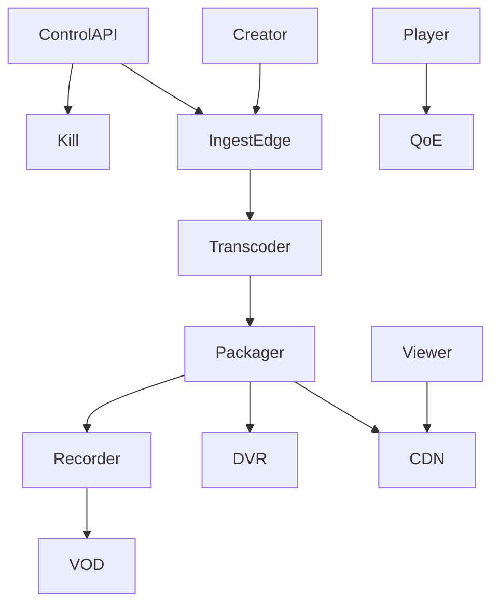

# System Design: Live Video Streaming

> **Focus areas:** RTMP/WHIP ingest · Transcode · Low-latency packager · CDN · DVR · Chat hook · Recording · ABR live · Failover
> **Style:** End-to-end product design with progressive scale (10× → 100× → 1,000×)
> **Quality bar:** Domain-specific numbers and failure modes; explicit trade-offs; deal-breakers; CDN / ABR / encoding / DRM where relevant
> **Interview theme:** Senior / Staff — **Live video streaming (Twitch/YouTube Live-class)**

---

## Table of Contents

1. [Clarify Requirements (Interview Q&A)](#1-clarify-requirements-interview-qa)
2. [Back-of-the-Envelope Estimation](#2-back-of-the-envelope-estimation)
3. [High-Level Design](#3-high-level-design)
4. [Architecture Diagram](#4-architecture-diagram)
5. [Design Deep Dive](#5-design-deep-dive)
6. [Wrap-Up](#6-wrap-up)
7. [Deeper / Related Interview Questions](#7-deeper--related-interview-questions)
8. [Appendices](#8-appendices)

---

## 1. Clarify Requirements (Interview Q&A)

Goal: design **live video streaming**: creators ingest live; viewers watch with low-latency ABR via CDN; optional DVR/recording; handle disconnects and spikes.

### 1.0 What this is / is not

| Dimension | This doc | Not this |
|---|---|---|
| Job | One-to-many live broadcast | Zoom mesh conferencing |
| Latency | Seconds–low seconds class | Teleop sub-100ms industrial |
| Lens | Ingest durability, LL-HLS/DASH, CDN fanout | VOD archive alone |

### 1.1 Functional Requirements

| # | Question | Expected interviewer answer | Design implication |
|---|---|---|---|
| F1 | Ingest? | RTMP/SRT/WHIP | Ingest edge |
| F2 | Transcode? | Live ladder | GPU/CPU live workers |
| F3 | Package? | LL-HLS / DASH / CMAF | Packager |
| F4 | CDN? | Live-capable edge | Short TTL segments |
| F5 | DVR? | Sliding window | DVR store |
| F6 | Record? | VOD publish after | Recording pipeline |
| F7 | Chat? | Hook only | Separate chat system |
| F8 | Auth? | Stream keys | Key rotation |
| F9 | Latency modes? | Normal vs low latency | Tunable segments |
| F10 | Failover? | Backup ingest | Redundant ingest |
| F11 | Thumbnails? | Live preview images | Snapshotter |
| F12 | ABR? | Multi-rung live | Ladder |
| F13 | Geo? | Global viewers | Multi-region ingest/cdn |
| F14 | Moderation? | Live flags | Kill switch |

**MVP scope:**

1. Stream key auth
2. RTMP ingest
3. Live transcode 3–5 rungs
4. LL-HLS package
5. CDN delivery
6. Disconnect reconnect
7. Record to VOD basic
8. Kill switch

**Out of MVP:**

- Full interactive guest co-watch SFU
- Perfect <1s glass-to-glass everywhere
- Complete chat product

### 1.2 Non-Functional Requirements

| # | NFR | Target |
|---|---|---|
| N1 | Glass-to-glass | 3–10s normal; 1–3s LL mode targets |
| N2 | Startup | <2–3s join |
| N3 | Ingest acceptance | 99.9% sessions start |
| N4 | Viewer scalability | Millions via CDN |
| N5 | Recording durability | No silent loss of highlights policy |
| N6 | Key security | Stream keys unguessable; rotatable |
| N7 | Failover | Backup ingest < seconds gap policy |
| N8 | Cost | Live encode concurrent $ dominates |

### 1.3 Cases

**Happy:** Go live → ingest → ladder → CDN viewers → end → VOD processing.  
**Edges:** WiFi blip; bitrate spike; viral raid; packager crash; region failure; copyright mute; chat toxicity (hook).

| Case | Behavior |
|---|---|
| Ingest disconnect | Reconnect window; slate/last-frame policy; resume |
| Worker death | Failover transcoder; brief discontinuity |
| Viral 100× viewers | CDN absorbs; protect origin packager |
| Bad key leak | Rotate key; kick old session |
| Kill switch | Hard stop distribute |

### 1.4 Progressive scale

| Metric | Baseline | 10× | 100× | 1,000× |
|---|---|---|---|---|
| Concurrent lives | 1K | 10K | 100K | 1M |
| Viewers peak total | 100K | 2M | 20M | 100M |
| Peak single stream viewers | 10K | 200K | 2M | 10M |
| Ingest Gbps | 5 | 50 | 500 | 5K |
| Live encode slots | 1K | 10K | 100K | 1M |
| Segment duration | 2s | 2s | 1–2s | LL tuned |
| DVR window | 30m | 2h | 24h | policy |
| Chat QPS hook | 10K | 200K | 2M | 20M |

**Jumps:** 10× multi-region ingest+CDN; 100× transcoder autoscaling+hot stream isolation; 1,000× LL optimization+global TE.

### 1.5 Etc. constraints + scope repeat-back

Constraints: mobile uplink variance, codec device support, cost of always-on encode, abuse.

> Live broadcast: authenticated ingest, live ladder+LL packaging, CDN fanout, reconnect/DVR/record, kill switch—optimize glass-to-glass vs stability.

---

## 2. Back-of-the-Envelope Estimation

### 2.1 Encode cost

```text
100K concurrent lives × 1 GPU-frac each impossible—tier: transcode popular; passthrough/limited ladder for long-tail.
```

### 2.2 Viewer fanout

```text
2M viewers × 3 Mbps = 6 Tbps CDN problem.
```

### 2.3 Segment rate

```text
1s segments × N rungs × viewers = immense small-object GETs — CDN essential.
```

### 2.4 Ingest entry

```text
Anycast ingest edges near creators; not one region.
```

### 2.5 Recording bytes

```text
Concurrent × bitrate × duration → object store.
```

### 2.N Bottleneck ranking

1. Egress / edge bandwidth and hit ratio
2. Hot keys (viral titles, celebrity metadata)
3. Processing fleets (encode/ASR/ML)
4. Control-plane fanout (manifests, licenses, personalization)
5. Cold retrieval / long-tail

### 2.N+1 Cost intuition

```text
Storage << egress at watch scale.
Cache hit ratio and codec efficiency are executive levers.
Processing ($GPU/CPU-hours) matters for UGC firehose and ML pipelines.
```

---

## 3. High-Level Design

### 3.1 Planes (critical split)

| Plane | Responsibility | Consistency |
|---|---|---|
| Ingest | Accept creator bytes | Session sticky |
| Live process | Transcode/package | Stateful workers |
| Delivery | CDN live | Short cache |
| Control | Keys, metadata, kill | Strong |
| Record/DVR | Persist windows | Durable |

**Why this split:** Stateful live workers must be isolated from mass viewer fanout (CDN).

### 3.2 Components

1. Stream Key Auth
2. Ingest Edge (RTMP/WHIP)
3. Live Transcoder Pool
4. Packager LL
5. CDN Live
6. DVR Store
7. Recording→VOD
8. Thumbnail Snapshot
9. Director/Control API
10. Health/Alerting
11. Autoscaler
12. Kill Switch
13. Webhook to chat
14. QoE beacons
15. Origin Shield live
16. Multi-region failover

### 3.3 APIs (sketch)

```text
POST /live/streams → stream_id, ingest_url, stream_key
POST /live/streams/{id}/start|stop
GET  /live/streams/{id}/playback → manifest
POST /live/streams/{id}/rotate_key
POST /live/streams/{id}/kill
GET  /live/streams/{id}/dvr?t=
```

### 3.4 Data model (core)

```text
LiveStream{id, owner, status, ingest_region, latency_mode}
IngestSession{id, stream_id, worker, started_at}
RenditionLive{stream_id, rung, packager_path}
Recording{stream_id, vod_asset_id, status}
```

### 3.5 Trade-offs

| Topic | Choice | Why |
|---|---|---|
| Latency vs stability | Tunable modes | Product tiers |
| Transcode all? | Tier by popularity | Cost |
| LL-HLS vs WebRTC fanout | LL-HLS/CDN for scale | WebRTC for ultra-LL small audiences |
| DVR | Finite window | Cost |

### 3.6 Deal-breakers

| Temptation | Failure |
|---|---|
| Unicast origin to each viewer | Meltdown |
| Single ingest region global | Latency + fragility |
| No reconnect semantics | Creator rage |
| Long GOP with tiny buffer LL | Artifacts / rebuffer |

---

## 4. Architecture Diagram

### 4.1 C4-ish / flow



### 4.2 Go live

```text
Create stream → OBS publishes RTMP → ingest auth → transcoder → packager manifests → CDN → viewers join.
```

### 4.3 Disconnect

```text
Ingest miss heartbeat → waiting state → reconnect same key → resume; else end after timeout → finalize recording.
```

---

## 5. Design Deep Dive

### 5.1 Reliability (data loss prevention, retries, idempotency, rate limits, backpressure)

1. Stream key hashing; rotate kills old
2. Worker lease + failover
3. Packager N+1
4. CDN short TTL + stale policies careful
5. Recording fsync checkpoints
6. Autoscaling predictive for events
7. Kill switch independent path
8. Backpressure if packager overload (reject new lives first)
9. Clock sync for LL
10. Poison uplink bitrate cap

### 5.2 Scalability (scale up/down, sharding, storage tiers, parallelization)

| Scale | Architecture moves |
|---|---|
| 1× | Few workers; cloud CDN live |
| 10× | Regional ingest; autoscale GPU |
| 100× | Hot stream dedicated packagers; multi-CDN |
| 1,000× | Passthrough tiers; global TE; LL experimentation |

### 5.3 Maintainability (ops, observability, migrations, multi-tenant)

- Latency mode configs
- Encoder presets versioned
- Game-day raid drills
- Per-stream QoE dashboards

### 5.4 LL packaging

Partial segments, HTTP chunked transfer, shorter GOPs; player tune buffer.


### 5.5 Transcode economics

Not all streams deserve 6 rungs; adaptive policy.


### 5.6 Hot stream isolation

Dedicated packager/origin when viewers > threshold.


### 5.7 WebRTC vs CDN live

WebRTC media servers scale poorly to millions; hybrid for co-hosts.


### 5.8 Progressive scale

1× single region → 10× regional ingest → 100× hot isolation → 1,000× tiered encode.


---

## 6. Wrap-Up

### 6.1 Designed

Live streaming with auth ingest, live ladder, LL packaging, CDN fanout, DVR/record, failover, kill switch.

### 6.2 Decisions to defend

1. CDN fanout not origin unicast
2. Regional ingest
3. Tiered live ladders
4. Tunable latency modes
5. Hot stream isolation
6. Durable recording checkpoints
7. Independent kill switch
8. Reconnect windows

### 6.3 Risks

- Encode $ blowup
- LL instability
- Key leaks
- Regional outage
- Copyright

### 6.4 45-minute plan

| Min | Focus |
|---|---|
| 0–5 | Live vs VOD/Zoom |
| 5–15 | Ingest+transcode |
| 15–25 | Package+CDN+LL |
| 25–35 | Failover/DVR/record |
| 35–45 | Scale/cost |

### 6.5 Closer

> **Live video**: sticky ingest, tiered live encode, LL packaging, CDN fanout, reconnect/DVR, kill switch—latency vs cost explicit.

---

## 7. Deeper / Related Interview Questions

### Q1. Why not WebRTC to all viewers?

SFU fanout cost/complexity; CDN HLS/DASH scales to millions.

### Q2. Glass-to-glass budget?

Capture+ingest+transcode+packager+CDN+player buffer — shave each.

### Q3. Backup ingest?

Dual publish; packager switch on failure; seamless optional.

### Q4. Segment size vs LL?

Shorter → lower latency, more overhead/rebuffer risk.

### Q5. How to price encode?

Tier ladders by viewers/popularity; passthrough long-tail.

### Q6. DVR implementation?

Retain last N segments in object store; playlist window.

### Q7. Stream key security?

High entropy; TLS ingest; rotate; bind IP optional.

### Q8. GOP and ABR live?

Keyframes aligned across rungs for clean switches.

### Q9. Chat coupling?

Async side channel; never block media path.

### Q10. Recording exactly-once?

Checkpoints + finalize idempotent VOD publish.

### Q11. Where is strong consistency mandatory?

ACL/publish/entitlement and private media access; not counters.

### Q12. Signed URLs vs CDN cache?

Don't put per-user uniqueness into segment cache keys; use cookies/tokens.

### Q13. HLS vs DASH vs CMAF?

Dual manifests over shared CMAF segments when possible.

### Q14. #1 cost lever at watch scale?

Edge hit ratio / offload; then codec efficiency.

### Q15. Premiere stampede controls?

Pre-warm, shield, coalesce, scale license/playback, shed noncritical work.

### Q16. Idempotent jobs?

Deterministic output keys + CAS publish.

### Q17. ABR oscillation?

Dwell + asymmetric thresholds + buffer hysteresis.

### Q18. Consistent hashing where?

Shard stateful workers/comments—not static CDN GETs.

### Q19. QoE vs QPS?

Talk rebuffer/startup/bitrate; QPS alone is weak.

### Q20. Multi-CDN when?

~100× for resilience/pricing; needs steering.

### Q21. Offline + DRM?

Persistent licenses, windows, secure storage, online renew.

### Q22. Hot metadata?

Cache + cell isolation; decouple from byte paths.

### Q23. Encode backpressure?

Priority queues; shed archival reencodes.

### Q24. Manifest personalization risk?

Can kill cache hit ratio—keep media manifests stable.

### Q25. Deal-breaker example?

Serving one giant progressive file without ABR at global scale.

---

## 8. Appendices

### A1. Live notes

SRT for bad networks; WHIP for WebRTC ingest; slate on gap; raid/host mode as control events.


### A-Z. Interview checklist

- [ ] Clarified product shape and non-goals
- [ ] Progressive scale jumps that change architecture
- [ ] Control plane vs data/bytes plane
- [ ] CDN / ABR / ladder / DRM called out where relevant
- [ ] Hot-key and failure modes
- [ ] Idempotency and publish gates
- [ ] QoE / domain SLOs not just QPS
- [ ] Cost levers
- [ ] Security / abuse / compliance
- [ ] Phased rollout + kill switches


---

## Appendix: Cross-cutting media patterns (interview ammunition)

### Encoding ladder reference

| Rung | Resolution | H.264 bitrate band | Typical role |
|------|------------|--------------------|--------------|
| L0 | 256×144 | 100–200 kbps | Extreme constrained |
| L1 | 426×240 | 300–500 kbps | Poor mobile |
| L2 | 640×360 | 600–1000 kbps | Mobile floor |
| L3 | 854×480 | 1.0–1.8 Mbps | SD |
| L4 | 1280×720 | 2.5–5 Mbps | HD |
| L5 | 1920×1080 | 4.5–9 Mbps | FHD |
| L6 | 2560×1440 | 8–14 Mbps | QHD optional |
| L7 | 3840×2160 | 12–35 Mbps | 4K (HEVC/AV1) |

Dual-codec (H.264 + AV1/HEVC); packaged ≈ 1.6–2.8× mezzanine.

### ABR loop

```text
throughput_EMA + buffer → downswitch if danger; upswitch with dwell/hysteresis
QoE: startup, rebuffer ratio, avg bitrate, switches, abandon
```

### CDN hierarchy

```text
PoP → mid-tier → origin shield → object store
Immutable versioned segments; personalization in control plane only
```

### DRM

```text
CENC packager; license = entitlement + device level; offline persistent TTL
```

### Scale jumps

| Jump | Moves |
|------|-------|
| 10× | Multi-AZ, queues, shield, caches |
| 100× | Multi-region, cells, multi-CDN, dedicated planes |
| 1,000× | Codec economics, edge experiments, compliance cells |

### Reliability checklist

Idempotent chunks/jobs; publish CAS gate; no orphan manifests; encode backpressure; poison quarantine; key rotation; immutable segments.

### Cost levers

Hit ratio; codec bits; ladder density; cold tiering; prefetch discipline.

### Consistency

Strong: ACL/publish/entitlement. Eventual: counters/search/recs. WORM: segments.

### Deal-breakers

Progressive-only MP4 globally; user-specific segment URLs; sync ML on upload path; DB BLOBs for media; skip DRM on licensed premium.

### Algorithms

Consistent hash shards; Bloom dup; fingerprints/MinHash; WFQ encode; EMA ABR; ANN recs.

### Math templates

```text
cdn_egress ≈ watch_hours * 3600 * bitrate / 8
origin ≈ cdn_egress * (1 - hit_ratio)
mezz/day ≈ uploads/day * dur_s * mezz_bitrate / 8
```

### Reusable closer

> Bytes plane (CDN) ≠ control plane (entitlement/metadata/processing). Atomic publish. QoE. Egress. Idempotent pipelines. Progressive cells/shields.
