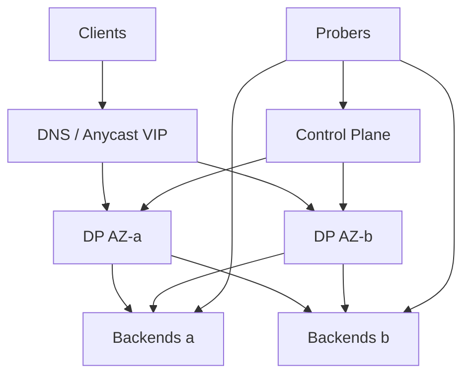

# System Design: Load Balancer

> **Focus areas:** L4 vs L7 · Algorithms · Health checks · Connection draining · TLS · Anycast / multi-tier · Failover  
> **Style:** Build a cloud-style LB control + data plane with progressive scale (10× → 100× → 1,000×)  
> **Domain:** Distribute client traffic across backend pools with high availability and low added latency

---

## Table of Contents

1. [Clarify Requirements (Interview Q&A)](#1-clarify-requirements-interview-qa)
2. [Back-of-the-Envelope Estimation](#2-back-of-the-envelope-estimation)
3. [High-Level Design](#3-high-level-design)
4. [Architecture Diagram](#4-architecture-diagram)
5. [Design Deep Dive](#5-design-deep-dive)
6. [Wrap-Up](#6-wrap-up)
7. [Deeper / Related Interview Questions](#7-deeper--related-interview-questions)

---

## 1. Clarify Requirements (Interview Q&A)

Clarify OSI layer, features (TLS, sticky, WAF), and whether we design a **software LB product** or a single VIP in front of an app.

### 1.0 What this is / is not

| This is | This is not |
|---------|-------------|
| A **multi-tenant load balancing system**: VIP → pool → backends | An API gateway’s full auth/rate-limit product (can overlap at L7) |
| L4 and/or L7 proxying with health checks and algorithms | DNS-only round-robin without health (too weak alone) |
| Control plane (config) + data plane (packets/requests) | Kubernetes kube-proxy deep dive only (related pattern) |
| HA with N+2 data plane and rapid failover | Magical zero-loss during all failures |

### 1.1 Functional Requirements

| # | Question to ask | Expected / typical interviewer answer | Design implication |
|---|-----------------|----------------------------------------|--------------------|
| F1 | L4, L7, or both? | Both: L4 for TCP/TLS pass-through; L7 for HTTP routing | Separate data-plane engines or unified proxy (Envoy-style) |
| F2 | Algorithms? | Round-robin, least-conn, weighted, consistent hash (sticky/session) | Pluggable picker; per-pool config |
| F3 | Health checks? | Active HTTP/TCP + passive failure ejection | Independent prober; hysteresis |
| F4 | TLS? | Terminate at LB or pass-through; SNI routing | Cert store; OCSP; hot reload |
| F5 | Sticky sessions? | Optional cookie / consistent hash on IP or header | State or hash—avoid strong stickiness at scale |
| F6 | Draining? | Yes—deregister → connection drain → remove | `connection_draining_seconds` |
| F7 | Cross-AZ / region? | Multi-AZ active-active; multi-region via DNS/anycast | Pool locality; failover policies |
| F8 | Protocol support? | HTTP/1.1, HTTP/2, HTTP/3 optional, gRPC, WebSocket, TCP | Long-lived conn handling; idle timeouts |
| F9 | Config API? | CRUD VIPs, pools, members, certs; versioned | Control plane + eventual push to DP |
| F10 | Observability? | Per-VIP RPS, latency, 5xx, backend health | Metrics without huge cardinality |
| F11 | DDoS / WAF? | Basic SYN cookies / conn limits; WAF Phase 2 | Edge integration |
| F12 | Server Name / path routing? | L7 host + path rules | Route table; ordered rules |
| F13 | Retries? | L7 idempotent GET retries; never blind POST retry | Safe retry policy |
| F14 | Multi-tenant isolation? | Noisy-neighbor limits per VIP | Fair queues / conn caps |

**MVP functional scope:**

1. L4 TCP VIP + L7 HTTP(S) VIP types.
2. Pools with weighted round-robin + least connections.
3. Active health checks + passive ejection.
4. TLS termination with SNI; cert hot reload.
5. Connection draining on deregister.
6. Control plane API + config distribution to data plane fleet.
7. Multi-AZ HA active-active data plane behind anycast/VIP.
8. Metrics + access logs (sampled).

**Out of MVP:**

- Full WAF rule language
- Global GSLB product (mention DNS/anycast integration)
- L7 WASM custom filters marketplace
- Automatic canary traffic shifting UI (design hooks)

### 1.2 Non-Functional Requirements

| # | Question | Expected answer | Target |
|---|----------|-----------------|--------|
| N1 | Added latency | Barely noticeable | L4 p99 add < 1 ms; L7 < 2–5 ms in-AZ |
| N2 | Availability | Critical infra | 99.99%–99.999% VIP availability |
| N3 | Failover time | Backend death | < 1–3s detection + ejection (tune vs flap) |
| N4 | Throughput | Line-rate aspirational | 10–100 Gbps / node class-dependent |
| N5 | Connection scale | Millions of concurrent | DP horizontal scale; syn cookies |
| N6 | Config converge | Push new member | < 1–5 s p99 to fleet |
| N7 | Consistency | Config version monotonic | Eventual DP sync; no split brain VIP owners for L4 state if possible |
| N8 | Security | Cert private keys safe; tenant isolation | KMS/HSM; mTLS to backends optional |

### 1.3 Cases

**Happy paths**

1. Client → VIP → healthy backend; response returns.
2. New backend registers → health passes → gradual traffic (optional ramp).
3. Deploy: drain old backends → zero/near-zero dropped GETs.
4. TLS: SNI selects cert; HTTP/2 multiplex to client.
5. Least-conn shifts load away from slow overloaded node.

**Edge / failure cases**

| Case | Behavior |
|------|----------|
| All backends unhealthy | Return 503 / L4 RST; optional panic mode last-known |
| Health flap | Hysteresis: N failures to eject, M successes to reinstate |
| DP node death | Anycast/ECMP / VIP moves; conn table loss for L4 (document) |
| Slow backend (tail) | Passive ejection on 5xx/timeout rates |
| WebSocket upgrade | Sticky to backend for lifetime; idle timeouts tuned |
| Retry storm | Budgets; retry only safe methods; jitter |
| Config push partial | Version fencing; DP rejects older versions |
| Cert expiry | Alert; fail handshake for that SNI; others OK |
| Cross-AZ outage | Pool prefers local AZ; failover to other AZ with capacity |
| SYN flood | SYN cookies, connrate limits, shrink listen backlog |

### 1.4 Scales

| Metric | Baseline | 10× | 100× | 1,000× |
|--------|----------|-----|------|--------|
| VIPs | 100 | 1K | 10K | 100K |
| Backends | 1K | 10K | 100K | 1M |
| Concurrent conns | 1M | 10M | 100M | 1B |
| RPS (L7) | 1M | 10M | 100M | 1B |
| Data plane nodes | 10 | 100 | 1K | 10K |
| Config updates / hour | 100 | 1K | 10K | 100K |
| Health checks / sec | 5K | 50K | 500K | 5M |
| TLS handshakes / sec | 50K | 500K | 5M | 50M |

**What each jump forces:**

- **10×:** Horizontal DP; centralized health aggregation; cert distribution service.
- **100×:** Shard control plane by VIP; HW offload / kernel bypass optional; regional edges.
- **1,000×:** Anycast PoPs; hierarchical LB (edge → regional → AZ); partitioned probers.

### 1.5 Etc.

- **Deployment:** Software LB on commodity VMs/containers (Envoy/HAProxy/LVS-like).
- **VIP allocation:** Cloud IPAM / BGP anycast.
- **Backend discovery:** Static + control-plane register; optional SDS integration.
- **Session state:** Prefer stateless DP; if L4 conntrack needed, power of two choices / consistent ECMP.

**Scope statement:**

> Design a multi-AZ software load balancer with L4/L7 VIPs, health-checked pools, TLS termination, draining, and a control plane that converges config in seconds—from ~1M to ~1B concurrent connections via tiered data planes.

---

## 2. Back-of-the-Envelope Estimation

### 2.1 Connections per node

```text
Assume 2 GB RAM for conn tracking @ ~2 KB/conn → ~1M conns/node theoretical
Practical L7 proxy: 50K–200K active HTTP conns/node depending on buffers
Baseline 1M conns → ~10–20 L7 nodes (N+2)
```

### 2.2 Packet / RPS CPU

```text
L7: ~10–50 μs CPU / short request → 20K–100K RPS/core order-of-magnitude
1M RPS → tens–hundreds of cores → multi-node fleet with RSS/RPS affinity
```

### 2.3 TLS cost

```text
RSA/ECDSA handshake >> bulk AES-GCM
Session tickets / TLS 1.3 0-RTT / resumption critical at 10×+
Hardware offload or dedicated handshake tiers at 100×+
```

### 2.4 Health check traffic

```text
1K backends × 1 check / 5s = 200 checks/s (trivial)
100K backends × 1/2s = 50K checks/s → shard probers; check from multiple AZs carefully
```

### 2.5 Config size

```text
10K VIPs × 5 KB config = 50 MB — OK to push
100K VIPs → incremental xDS-style updates, not full dump every change
```

### 2.6 Bandwidth

```text
Average response 5 KB @ 1M RPS = 5 GB/s = 40 Gbps → multi-NIC / many nodes
1B RPS not realistic single region—global edge fanout
```

---

## 3. High-Level Design

### 3.1 Core concepts

```text
VIP / Listener: IP:port + protocol (TCP/HTTP/HTTPS)
Pool / Cluster: set of backends + algorithm + HC config
Member / Endpoint: IP:port, weight, zone, state (healthy|draining|unhealthy)
Route (L7): match host/path/header → pool
Policy: retries, timeouts, sticky, TLS, limits
```

### 3.2 L4 vs L7

| | L4 (TCP/UDP) | L7 (HTTP) |
|--|--------------|-----------|
| Unit | Connection / flow | Request |
| Visibility | Bytes, ports | Host, path, headers |
| Sticky | 5-tuple hash | Cookie / header hash |
| Retry | Rarely | Safe methods |
| Cost | Lower | Higher |
| Use | DB proxies, TLS passthrough, gaming | APIs, web |

**Choice:** Offer both. Implementation: kernel LVS/IPVS or eBPF for L4; Envoy/HAProxy-like for L7; or unified userspace with different filter chains.

### 3.3 Algorithms

| Algorithm | Best for | Weakness |
|-----------|----------|----------|
| Round-robin | Homogeneous backends | Ignores load |
| Weighted RR | Mixed instance sizes | Same |
| Least connections | Long-lived / uneven | Herd if bad metric |
| Power of two choices | Excellent practical balance | Needs two random picks |
| Least response time | Latency-sensitive | Noisy metrics |
| Consistent hash | Cache locality / sticky | Imbalance on churn |
| Maglev hash | Large L4 fleets | Rebuild on membership change |

**Default interview pick:** weighted RR for simple; **P2C least-conn** for production L7; **Maglev** for L4 ECMP consistency.

### 3.4 Health checking

```text
Active: prober GET /healthz every interval from DP or dedicated
Passive: count 5xx, timeouts, conn fails in sliding window
Eject when fail_threshold reached; unhealthy hold-down timer
Panic threshold: if % healthy < X, stop ejecting (avoid total blackhole)
```

### 3.5 Data plane HA

```text
Clients
  -> Anycast / DNS / cloud NLB
     -> LB DP nodes (AZ-a, AZ-b, AZ-c)  active-active
        -> Backend instances
```

**L4 state:** ECMP may remap flows on node loss → reset. Accept or use flow-state sync (expensive). Document RPO for connections = drop.

**L7:** New requests fine; in-flight on dead node fail → client retry.

### 3.6 Control plane

```text
API/DB (VIP configs)
  -> Config compiler (validate, version++)
  -> xDS / gRPC stream / push queue to DP nodes
  -> ACK / NACKs; monitor sync lag
```

Use **monotonic config version** per resource; snapshot + delta.

### 3.7 TLS

- Store certs encrypted; DP fetches via SDS (secret discovery).
- Hot reload without dropping listeners.
- Optional mTLS to backends with mesh certs.
- Cipher policy baseline; TLS 1.2+ / 1.3 prefer.

### 3.8 APIs (control plane)

| Method | Path | Purpose |
|--------|------|---------|
| POST | `/v1/vips` | Create VIP/listener |
| PUT | `/v1/pools/{id}` | Update pool/algorithm |
| POST | `/v1/pools/{id}/members` | Register backend |
| POST | `/v1/members/{id}/drain` | Start drain |
| DELETE | `/v1/members/{id}` | Remove after drain |
| PUT | `/v1/certs/{sni}` | Upload/bind cert |
| GET | `/v1/vips/{id}/status` | Health + sync version |

### 3.9 Component architecture

```text
+------------------+     +------------------+
| Control Plane API|---->| Config Store (PG)|
+--------+---------+     +--------+---------+
         |                        |
         v                        v
+------------------+     +------------------+
| xDS / Push Plane |---->| Cert / SDS       |
+--------+---------+     +------------------+
         |
   +-----+------+------+
   v     v      v      v
  DP1   DP2    DP3   DPn   <-- health probers
   \     |      |     /
    +----v------v----+
    | Backend pool   |
    +----------------+
```

### 3.10 Trade-offs

| Decision | Choose | Over | Deal-breaker |
|----------|--------|------|--------------|
| DP model | Active-active | Active-passive only | Passiveover too slow / capacity waste |
| Sticky | Optional hash | Strong server affinity always | Scales poorly; hurts deploys |
| HC | Active+passive | Active only | Slow failure detection OR flap |
| Retries | Budgeted safe | Unlimited | Amplification outages |
| Config | Incremental xDS | Full reload always | Control-plane CPU death at 100× |

### 3.11 Progressive scale

- **Baseline:** Few DP VMs, shared control plane, RR+HC.
- **10×:** Multi-AZ anycast; SDS; P2C; panic threshold.
- **100×:** Sharded CP; dedicated probers; edge tier; Maglev L4.
- **1,000×:** Global PoPs; hierarchical LB; HW/eBPF L4; partitioned config.

---

## 4. Architecture Diagram

### 4.1 End-to-end



### 4.2 Request path L7

```text
Accept TLS → HTTP parse → Route match → Pick backend (P2C)
  → Conn pool → Upstream request → Response → Metrics
  on errors: passive score++ ; maybe retry if safe
```

### 4.3 Drain sequence

```text
Admin drain member
  → state=DRAINING (no new conns/requests)
  → wait in-flight ≤ timeout
  → state=REMOVED
  → config version++ pushed
```

---

## 5. Design Deep Dive

### 5.1 Reliability

#### 5.1.1 Invariants

1. **Never route new traffic to UNHEALTHY** (unless panic mode).
2. **Config versions monotonic**; DP ignores older snapshots for a resource.
3. **Drain is best-effort within timeout**—then reset leftovers.
4. **Retries bounded** and method-safe.
5. **Health state has hysteresis** to avoid flap oscillations.

#### 5.1.2 Failure domains

| Failure | Effect | Mitigation |
|---------|--------|------------|
| One DP node | Lose its in-flight | N+2 capacity; client retry |
| One AZ | Lose AZ capacity | Multi-AZ pools |
| Control plane down | DP keeps last-good config | CP not on data path |
| Prober false negative | Bad eject | Multi-prober quorum; panic threshold |
| Backend slow-burn | Latency cancer | Passive + latency outlier eject |

#### 5.1.3 Retry & timeouts

```text
outbound timeout < client timeout
retry: GET/HEAD only, max 1–2, idempotency-aware
hedging: only for fanout-safe read paths with budgets
```

#### 5.1.4 Load shedding at LB

Per-VIP max conns / max RPS; return 503 early to protect backends. Distinct from backend app shedding.

#### 5.1.5 Split brain

For floating VIP active-passive: use reputable leader election (see locks/election docs). Prefer active-active ECMP to avoid VIP split brain.

### 5.2 Scalability

#### 5.2.1 Horizontal DP

- Stateless L7 workers behind network VIP.
- CPU, RSS, conn count autoscaling.
- Slow drain on scale-in (same as member drain).

#### 5.2.2 Connection pooling

LB→backend keep-alive pools; HTTP/2 upstream multiplexing reduces conns. Guard against thundering herd on backend restart (conn limits + jitter).

#### 5.2.3 Health check scaling

- Shard backends across prober workers.
- Adaptive interval: unhealthy checked faster; stable slower.
- Gossip health to DP; don’t each DP probe all backends at 1,000×.

#### 5.2.4 Consistent hashing / Maglev

Maglev: lookup table size large prime; backends hashed into slots; membership change remaps ~1/N. Good for cache-friendly L4.

#### 5.2.5 Tiered LB

```text
Edge anycast (coarse) → Regional L7 (routing) → AZ local L4/L7 → app
```

Reduces blast radius and config size per tier.

### 5.3 Maintainability

#### 5.3.1 Safe config changes

- Validate certs/keys before push.
- Canary DP subset gets config first.
- Automatic rollback on 5xx spike (feature flag).

#### 5.3.2 Observability

| Signal | Notes |
|--------|-------|
| `lb_request_duration` | Per VIP, not per URL |
| `upstream_rq_xx` | By pool |
| `membership_healthy` | Gauge |
| `config_sync_lag` | Seconds |
| `tls_handshake_fail` | By reason |

Access logs sampled; include trace headers propagation.

#### 5.3.3 Multi-tenant

- Quotas on VIPs, RPS, cert counts.
- Isolate noisy VIP with separate DP shard if needed.

#### 5.3.4 Migrations

- Protocol additions (HTTP/3): dual listeners.
- Algorithm changes: per-pool flag.

---

## 6. Wrap-Up

### 6.1 Decision summary

| Area | Decision |
|------|----------|
| Layers | L4 + L7 |
| HA | Active-active multi-AZ |
| Algorithm | P2C / weighted RR; Maglev L4 |
| Health | Active + passive + panic threshold |
| TLS | Terminate at L7; SDS hot reload |
| Config | Versioned incremental push |
| Scale | Tiered edges; sharded CP |

### 6.2 Phased rollout

1. L7 RR + active HC + TLS for one app.
2. Multi-AZ DP + drain + least-conn/P2C.
3. Control plane xDS + SDS + passive ejection.
4. L4 Maglev / anycast; global edge tier.
5. Multi-tenant isolation + advanced retries/WAF hooks.

### 6.3 Closing line

> A load balancer is a **reliability product**: health, drain, bounded retries, and honest connection-loss semantics—not just round-robin.

---

## 7. Deeper / Related Interview Questions

1. **L4 vs L7—when must you choose L4?**  
   Non-HTTP protocols, TLS passthrough for end-to-end crypto, or extreme perf.

2. **Why is least-conn sometimes worse than RR?**  
   Slow backends hold conns → receive fewer new ones… until timeouts pile; combine with latency eject.

3. **What is power of two choices?**  
   Pick two random healthy backends; choose lesser load—near-optimal with low coordination.

4. **How does Maglev differ from consistent hash rings?**  
   Maglev uses a permutation table for better balance and faster lookup; churn remaps ~1/N.

5. **Why panic threshold on health?**  
   Prevents correlated probe failure from ejecting entire pool → total outage.

6. **Should LB retry POSTs?**  
   Only with explicit idempotency; default no.

7. **Connection draining vs readiness probe?**  
   Readiness stops new traffic from orchestrator; drain is LB-side graceful for in-flight.

8. **Where do you terminate TLS?**  
   Edge for offload/WAF; pass-through for strict E2E; re-encrypt to backend common (TLS→TLS).

9. **How do sticky sessions hurt deploys?**  
   Pin users to dying instances; prefer shared session store + hash only when needed.

10. **Active-passive VIP failover time?**  
   Seconds for gratuitous ARP/BGP withdraw—often worse than active-active ECMP.

11. **What happens to conntrack on DP death?**  
   Flows reset unless synchronized state (costly)—say this explicitly.

12. **How to avoid retry storms?**  
   Budgets, `Retry-After`, hedged request limits, disable on 5xx overload.

13. **gRPC on LB?**  
   HTTP/2; mind stream limits, timeouts, and trailer-based status.

14. **WebSocket considerations?**  
   Long idle timeouts; sticky upstream; health must not kill idle upgraded conns spuriously.

15. **SYN cookies—what trade-off?**  
   Resist SYN flood; lose some TCP options; CPU cost.

16. **How does Envoy xDS help?**  
   Incremental typed config resources; ACK/NACK; avoids full reloads.

17. **Cross-AZ data transfer cost?**  
   Prefer AZ-local backends; failover cross-AZ only when needed.

18. **Monitor LB or backends for saturation?**  
   Both—LB 503 vs backend p99 tell different stories.

19. **Consistent hashing for cache clusters behind LB?**  
   Yes for cache hit rate; use bounded load variants to avoid hotspot.

20. **UDP load balancing quirks?**  
   No connections; flow affinity by tuple; health harder; QUIC/HTTP3 special-cased.

21. **Why not DNS RR alone?**  
   TTL lag, no HC, client caching, poor failover—DNS complements, doesn’t replace LB.

22. **eBPF/XDP role?**  
   Ultra-fast L4 redirect/drop; complex L7 still userspace.

23. **Certificate rotation without downtime?**  
   Dual certs overlapping validity; SDS swap; keep old until drained handshakes.

24. **How to test LB changes safely?**  
   Synthetic probes, canary VIP, shadow routing, fault injection on pools.

25. **What metric for autoscaling DP?**  
   CPU, concurrent conns, TLS CPS—not only RPS (large payloads differ).

26. **Split horizon / internal vs public VIP?**  
   Separate listeners and pools; don’t leak internal routes.

27. **How do you handle backend connection limits?**  
   Circuit breakers: max conns, max pending, max retries per pool.
