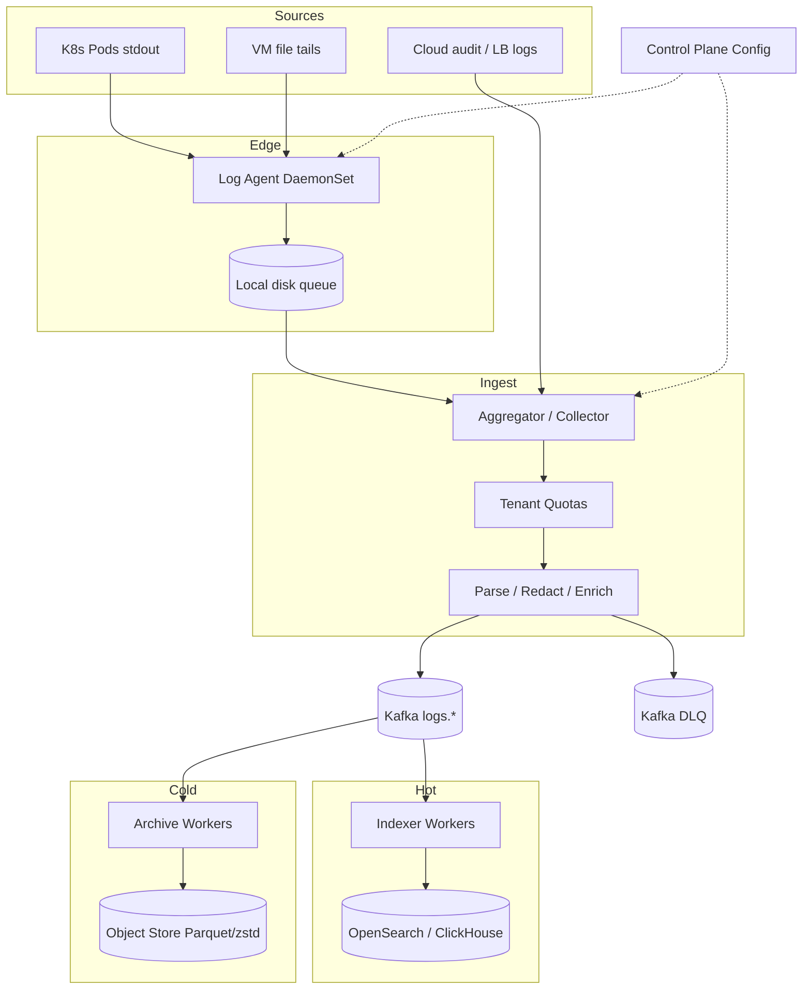
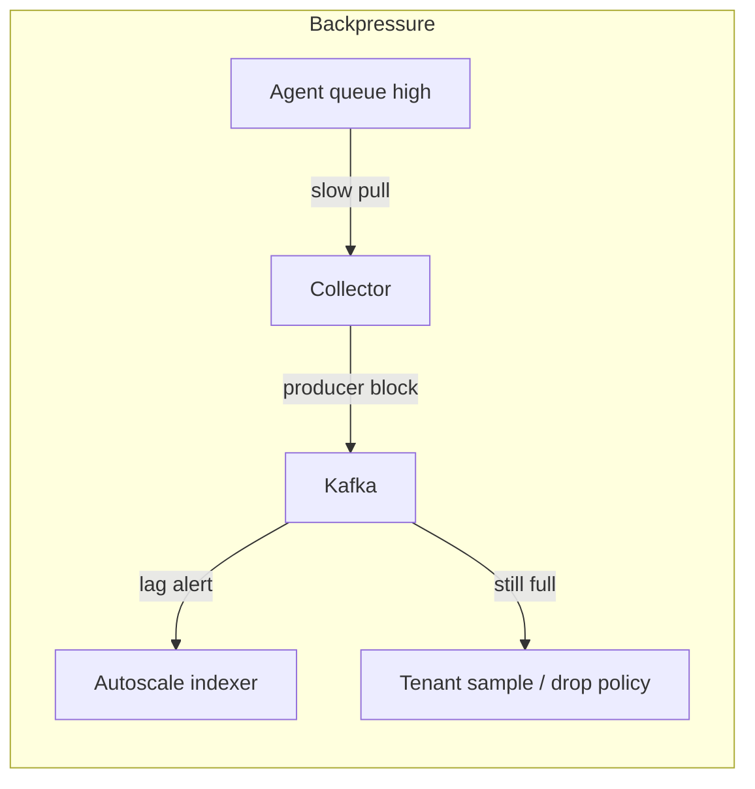

# System Design: Log-Ingestion Pipeline

> **Focus areas:** Agents · Tail & forward · Parsing/structuring · Kafka buffer · Indexing vs cold store · Multi-tenant isolation · Backpressure · Schema · Exactly-once-ish sinks · Cost tiers  
> **Style:** End-to-end product design with progressive scale (10× → 100× → 1,000×)  
> **Quality bar:** Senior/staff interview depth—Fluent Bit/Vector-style agents, Kafka mechanics, OpenSearch/lake dual path, watermarking for late hosts  
> **Interview theme:** Centralized log collection from millions of hosts/containers into searchable + archival storage

---

## Table of Contents

1. [Clarify Requirements (Interview Q&A)](#1-clarify-requirements-interview-qa)
2. [Back-of-the-Envelope Estimation](#2-back-of-the-envelope-estimation)
3. [High-Level Design](#3-high-level-design)
4. [Architecture Diagram](#4-architecture-diagram)
5. [Design Deep Dive](#5-design-deep-dive)
6. [Wrap-Up](#6-wrap-up)
7. [Deeper / Related Interview Questions](#7-deeper--related-interview-questions)

---

## 1. Clarify Requirements (Interview Q&A)

Goal: design a **log-ingestion pipeline** that collects logs from servers, containers, and serverless workloads, parses/structures them, buffers durably, and serves both **interactive search** (hot) and **cheap long-term retention** (cold)—under noisy-neighbor and burst conditions.

### 1.0 What this is / is not

| Dimension | This doc | Not this |
|-----------|----------|----------|
| Job | Collect → parse → buffer → index/archive | Full SIEM product / SOC workflows |
| Sources | Hosts, K8s, apps, cloud services | Clickstream product analytics (related but different) |
| Query | Recent search + scan cold | Warehouse BI as primary UX |
| Guarantee | At-least-once; optional EOS sinks | Perfect global order of all logs |
| Control plane | Pipelines, parsers, tenants, retention | Replacing stdout of one app |

### 1.1 Functional Requirements

| # | Question to ask | Expected / typical interviewer answer | Design implication |
|---|-----------------|----------------------------------------|--------------------|
| F1 | Sources? | Linux files, container stdout, journald, cloud LB logs | Pluggable inputs; K8s DaemonSet agent |
| F2 | Formats? | JSON, logfmt, syslog, multiline Java stack traces | Parser pipeline + multiline coalesce |
| F3 | Search SLA? | Last 7–14d interactive; older async | Hot index + cold object store |
| F4 | Structured fields? | Level, service, trace_id, tenant | Enrichment at agent/collector |
| F5 | Multi-tenant? | Many teams/services; noisy neighbor real | Quotas, separate indexes/streams |
| F6 | Sensitive data? | Secrets may appear; scrub/redact | Redaction filters; token allowlists |
| F7 | Ordering? | Per-host approximate; global not required | Partition by service or host hash |
| F8 | Replay? | Reindex from cold for incidents | Immutable raw archive + indexed derived |
| F9 | Dynamic config? | Parsers/routes change without agent rebuild | Control plane pushes config; agent hot reload |
| F10 | Backpressure? | Never OOM the app host | Agent local disk buffer; drop policies explicit |
| F11 | Schema evolution? | New fields appear constantly | Schemaless JSON + optional schema registry for critical |
| F12 | Trace correlation? | Extract `trace_id` / `span_id` | Index those fields; link to tracing system |
| F13 | Alerting? | Out of core MVP but hooks | Stream to metrics/alert rules optional |
| F14 | Compliance retention? | 30–365d depending on class | Lifecycle policies per log class |

**MVP functional scope:**

1. DaemonSet / host agent tails logs, adds metadata (pod, node, service).
2. Optional gateway aggregators for high-churn or serverless.
3. Kafka (or equivalent) durable buffer between agents and sinks.
4. Parse + redact pipeline; route by `service` / `log_class`.
5. Hot path: OpenSearch/Elasticsearch (or ClickHouse) for recent search.
6. Cold path: compressed objects (Parquet/JSON.zst) on S3 with manifest.
7. Quotas, DLQ, dashboards for lag and drop rates.

**Out of MVP:**

- Full SIEM correlation rules engine
- Perfect PII NER redaction ML
- Cross-cloud active-active single search view (federate later)
- Replacing APM / metrics systems

### 1.2 Non-Functional Requirements

| # | NFR | Target |
|---|-----|--------|
| N1 | Agent CPU/mem | <1–2% CPU idle host; hard mem cap (e.g. 256–512MB) |
| N2 | Ingest durability after agent ACK to local buffer | Survive collector blips via disk queue |
| N3 | Hot search freshness | <30–60s typical end-to-end |
| N4 | Availability of ingest | 99.9%+; prefer buffer over drop |
| N5 | Query availability | Hot cluster 99.9%; degrade to cold scan |
| N6 | Multi-tenant isolation | Noisy neighbor cannot evict others' hot quota |
| N7 | Security | TLS, auth between agent↔collector; encrypt at rest |
| N8 | Cost | Hot storage << cold; default short hot retention |

### 1.3 Cases

**Happy paths**

1. Pod logs → agent → Kafka → indexer → searchable in <1 min; same batch archived to S3.
2. Multiline Java exception coalesced into one event with `stack_trace`.
3. Team ships new JSON field → indexed dynamically (mapping limits guarded).
4. Collector restart → agent disk queue drains; no app impact.
5. Incident: query hot 7d; rehydrate older day from cold into temp index.

**Edge / failure cases**

| Case | Behavior |
|------|----------|
| Log storm (debug flood) | Agent rate limit / sample; collector shed; page owner |
| Mapping explosion (ES) | Flatten carefully; reject high-cardinality dynamic keys |
| Multiline timeout wrong | Tune codec; dead-letter partial lines |
| Disk full on node | Agent stop/tail policy; alert; never fill root disk |
| Kafka full | Slow agents via backpressure; spill; last-resort drop with metric |
| Clock skew across hosts | Prefer ingest_ts; keep source_ts; watermark carefully |
| Secret in log line | Redact patterns (AWS keys, Bearer); quarantine hits |
| Indexer lag | Autoscale; protect hot cluster with bulk queue limits |
| Tenant exceeds quota | Soft reject / sample that tenant only |
| Container short life | Ensure agent reads until EOF; K8s log rotate races handled |

### 1.4 Scales (Progressive)

| Metric | Baseline | 10× | 100× | 1,000× |
|--------|----------|-----|------|--------|
| Hosts / pods emitting | 5K | 50K | 500K | 5M |
| Avg log volume / host | 2 MB/min | 2 | 2–3 | 3 |
| Aggregate ingest | ~160 MB/s | ~1.6 GB/s | ~16 GB/s | ~160 GB/s |
| Events / s (approx) | 200K | 2M | 20M | 200M |
| Hot retention | 7d | 7d | 3–7d | 1–3d (+ wider cold) |
| Hot storage | ~50 TB | ~500 TB | multi-PB | sharded cells |
| Concurrent search QPS | 50 | 500 | 5K | 20K+ federated |
| Tenants / services | 200 | 1K | 5K | 20K+ |
| Kafka ingress clusters | 1 | 1–2 | many | many per cell |

**What each jump forces:**

- **10×:** Aggregator tier; index sharding; ILM rollover automation.
- **100×:** Cell architecture by region/env; separate hot engines; heavy cold-first for verbose classes.
- **1,000×:** Per-cell Kafka+index; global query federation; aggressive sampling/tiering; stream processing for derived metrics instead of indexing everything.

### 1.5 Etc.

- Assume Kubernetes-heavy estate + some VMs.
- Prefer **open agent** (Fluent Bit / Vector / OpenTelemetry Collector) patterns.
- Logs are **not** the system of record for business transactions.

**Scope repeat-back:**

> Design a multi-tenant log-ingestion pipeline: capped agents, durable Kafka buffer, parse/redact/route, dual sink to hot search and cold object storage, with quotas and explicit drop semantics—scaling from ~160 MB/s to cell-federated 1,000×.

---

## 2. Back-of-the-Envelope Estimation

### 2.1 Volume math

```text
5K hosts × 2 MB/min = 10 GB/min = 160 MB/s sustained
Peak 3× ⇒ ~500 MB/s

Daily: 160 MB/s × 86400 ≈ 14 TB/day raw
With compression (zstd ~5–10× on text): ~1.5–3 TB/day Kafka/object
```

### 2.2 Hot index sizing

```text
Indexed expansion often 1.2–2× raw (inverted index)
7d hot: 14 TB/day × 7 × 1.5 ≈ 150 TB cluster (order-of)
At 100×: impossible as one cluster → cells + shorter hot TTL
```

### 2.3 Kafka

```text
Ingress 160 MB/s × RF3 ≈ 480 MB/s disk write
Broker count: start ~6–12 for baseline with headroom
Partitions: by service hash; thousands at large scale
```

### 2.4 Agent memory

```text
Buffer 64–256 MB disk-backed queue per agent
In-memory chunk 1–8 MB
Never unbounded memory queues
```

### 2.5 Search fan-out

```text
Query hits N shards; p95 budget 1–3s for interactive
Cap wildcard/cardinality; push users to structured fields
```

### 2.6 Cost drivers

1. Hot SSD index  
2. Cross-AZ transfer  
3. Chatty debug logs  
4. High-cardinality fields exploding index  

---

## 3. High-Level Design

### 3.1 Event model

```text
LogEvent
  event_id          ULID (collector-assigned if missing)
  source_ts         from log or file time
  ingest_ts         collector time
  tenant            string
  service           string
  host / pod / node
  container_id
  severity          debug|info|warn|error|fatal
  body              string or structured object
  attributes        map (trace_id, http_status, ...)
  log_class         app|audit|security|infra
  agent_version
  parse_status      ok|partial|failed
```

### 3.2 Pipeline stages

```text
INPUT → NORMALIZE → MULTILINE → PARSE → REDACT → ENRICH → SAMPLE/FILTER → ROUTE → EXPORT
```

Agents run as much as possible **on the edge** to cut central CPU; central collectors do heavy lifts and tenancy enforcement.

### 3.3 API / control plane

| Surface | Purpose |
|---------|---------|
| Agent config API | Versioned pipelines per tenant/service |
| Ingest gRPC/HTTP | Aggregator → Kafka producers |
| Query API | Search hot; async jobs for cold |
| Admin | Quotas, tokens, retention, redaction rules |

Agents pull signed config; hot-reload on generation bump.

### 3.4 Component choices

| Component | Options | Choice | Why |
|-----------|---------|--------|-----|
| Agent | Fluent Bit, Vector, OTel | Fluent Bit/Vector-class | Low footprint |
| Buffer | Kafka, Pulsar, Kinesis | **Kafka** | Replay + fan-out |
| Hot search | OpenSearch, ClickHouse, Splunk | OpenSearch **or** ClickHouse | Trade query flexibility vs cost |
| Cold | S3 + Iceberg/Parquet | S3 zstd + manifests | Cheap scan/reindex |
| Orchestration | Indexer workers | Consumer group per sink | Independent scale |

**Deal-breaker:** indexing *all* debug logs for 30 days at 100× bankrupts the company. Tier by `log_class` and severity.

### 3.5 Topic & index strategy

```text
Kafka topics:
  logs.{env}.{log_class}          # e.g. logs.prod.app
  logs.dlq
  logs.audit (stricter ACL)

Hot indexes / tables:
  logs-hot-{tenant}-{yyyy.MM.dd}  # ILM rollover
Cold:
  s3://logs-cold/{tenant}/{service}/dt=.../hour=...
```

Partition keys: `hash(service)` or `hash(tenant,service)` for locality; avoid pure `host` if cardinality insane without need.

### 3.6 Parsing & schema evolution

- JSON logs: extract known fields; put remainder in `body` / `attrs`.
- Guard ES mappings: limit dynamic fields; explode detection.
- Optional schema registry for **audit** logs requiring strict evolution.
- Multiline: state machine with timeout + max lines.

### 3.7 Exactly-once / dedup

| Hop | Guarantee |
|-----|-----------|
| File tail | At-least-once (rotate races) |
| Agent → Kafka | At-least-once + idempotent producer |
| Kafka → index | Bulk index with `_id` = hash(tenant,source,offset) or EOS transactional |
| Kafka → S3 | Partitioned files; commit offsets after object finalize |

File offsets stored in agent checkpoints (inode + offset). Handle truncation/rotation.

### 3.8 Why dual sink (index + cold)

- Hot: interactive debugging.
- Cold: compliance + reindex + cheap ML.
- Never make OpenSearch the only copy of truth for long retention.

---

## 4. Architecture Diagram





---

## 5. Design Deep Dive

### 5.1 Reliability

**Loss prevention**

- Agent checkpoint after Kafka ACK (or after local durable queue fsync policy).
- Kafka RF≥3, `acks=all`, unclean leader election off.
- Archive commit: write object → write success manifest → commit consumer offsets.
- Indexer: idempotent document IDs to survive retries.

**Retries**

- Exponential backoff to collector; never tight-loop CPU.
- DLQ for permanently bad records (UTF-8 binary bombs, oversize).

**Rate limits & backpressure**

| Layer | Tool |
|-------|------|
| Agent | EPS / bytes-per-sec caps; severity-based drop |
| Collector | Per-tenant token buckets |
| Kafka | Broker quotas |
| Indexer | Bulk queue depth; circuit break if merge pressure |

**Explicit drop taxonomy** (must emit metrics):

1. `drop_agent_queue_full`
2. `drop_tenant_quota`
3. `drop_severity_policy`
4. `drop_parse_poison` (to DLQ, not silent)

**Watermarking / late hosts**

- Hosts can flush late after network partition.
- For stream derived metrics: event-time = `source_ts` with skew allowance; use `ingest_ts` for ops SLOs ("time to searchable").

### 5.2 Scalability

**Horizontal**

- Agents: one per node (DaemonSet).
- Aggregators: stateless scale-out.
- Kafka: add brokers/partitions; eventually multi-cluster per cell.
- Indexers: consumer group parallelism = partitions.
- Hot search: shard by time + tenant; rollover aliases.

**Storage tiers**

| Tier | Retention | Media | Access |
|------|-----------|-------|--------|
| Hot | 1–14d | SSD index | Interactive |
| Warm | optional | cheaper search nodes | Slower |
| Cold | 30–365d+ | Object storage | Async / Athena / reindex |
| Aggregate | forever-ish | Metrics rollups | Dashboards |

**Parallelization tricks**

- Split security/audit to dedicated clusters (compliance + noisy).
- Don't index `debug` by default at 100×; sample or metrics-only.

**1,000× cell model**

```text
Cell = Region × Env × (optional TenantTier)
Each cell: agents → local Kafka → local hot → local cold
Global: control plane + federated query router
```

### 5.3 Maintainability

**Observability**

- Agent: EPS in/out, queue bytes, drops, CPU.
- Pipeline: parse fail %, redact hits, lag by topic.
- Hot: indexing latency, rejected docs, heap, merge times.
- Golden SLO: time-to-searchable p99; drop rate budget.

**Migrations**

- Parser changes via config generations; canary tenants.
- Reindex jobs from cold when mapping changes.
- Blue/green indexer versions.

**Multi-tenant**

- Auth tokens scoped to tenant.
- Index naming per tenant or shared with `tenant` field + doc-level security.
- Chargeback: bytes ingested + hot GB-day.

**Ops runbooks**

- Mapping explosion: disable dynamic, reindex.
- Kafka disk: expand / drop verbose topics / shorten retention.
- Search OOM: reduce replicas, kill bad queries, shed tenants.

---

## 6. Wrap-Up

### Decision summary

| Decision | Choice | Rationale |
|----------|--------|-----------|
| Edge agent | Low-footprint DaemonSet | Protect app hosts |
| Buffer | Kafka | Durability + fan-out + replay |
| Dual sink | Hot search + cold objects | Cost vs UX |
| Quotas | Per tenant bytes/EPS | Noisy neighbor |
| IDs | Idempotent doc ids | Safe retries |
| Cells at scale | Regional federated | Hard limit of one mega-cluster |

### Phased rollout

1. Agent → Kafka → OpenSearch; 7d retention.  
2. Cold archive + ILM; redaction; quotas.  
3. Aggregators; multiline hardening; DLQ tooling.  
4. Cells + federated query; class-based indexing policies.

### Punch lines

- **Buffer before index**—never couple agents directly to OpenSearch as the only durability.  
- **Drop visibly** with taxonomy.  
- **Not everything deserves an inverted index.**

---

## 7. Deeper / Related Interview Questions

**Q1. Fluent Bit vs Fluentd vs Vector?**  
A: Fluent Bit/Vector for edge CPU/mem; Fluentd heavier Ruby plugin ecosystem—often aggregator-only now.

**Q2. Why not agents → OpenSearch directly?**  
A: Backpressure becomes app-node pain; no cheap fan-out; reindex/replay harder; search outage loses ingest durability story.

**Q3. How do you handle container log rotation?**  
A: Track inode+offset; detect truncate; K8s symlink races; read until EOF on pod death.

**Q4. Multiline algorithm?**  
A: Start-of-line regex; append until next start or timeout/maxlines; emit partial on timeout with flag.

**Q5. ES mapping explosion—how?**  
A: Unbounded JSON keys (`user_id` as field names). Fix: nest under `attrs` with flattened type or stringify; deny lists.

**Q6. ClickHouse vs OpenSearch for logs?**  
A: CH cheaper scan/compress, great for structured; OS better full-text relevance and ecosystem. Many orgs run CH for logs at scale.

**Q7. Exactly-once indexing?**  
A: Deterministic `_id` + at-least-once consume, or transactional Kafka sink where supported. File tails still at-least-once.

**Q8. How to watermark late logs for per-minute error rates?**  
A: Flink event-time on `source_ts`, allowed lateness 5–15m; ingest_ts lag as separate SLO metric.

**Q9. Kafka retention vs cold archive?**  
A: Kafka days for replay buffer; cold months for compliance—don't rely on Kafka for year retention.

**Q10. Security of agent config pull?**  
A: mTLS; signed configs; least privilege; don't put secrets in log pipelines.

**Q11. How to redact secrets without false positives?**  
A: High-precision patterns first (AWS AKIA, PEM blocks); optional entropy heuristics; audit redact metrics.

**Q12. Cardinality of `pod_name` in indexes?**  
A: High—ok as keyword with care; avoid aggregating unbounded series into metrics backends from logs blindly.

**Q13. Load balancing Collectors?**  
A: L4/L7; agents fail over; sticky not required if Kafka is the buffer.

**Q14. Consistent hashing for tenants to cells?**  
A: Yes at 100×+ for sticky tenant→cell assignment via control plane map; minimize cross-cell query.

**Q15. Sampling strategies?**  
A: Deterministic hash on `trace_id` keep whole traces; severity always-keep error+; sample info/debug.

**Q16. How does backpressure reach the agent?**  
A: HTTP 429 / gRPC resource exhausted → agent queue → eventually drop policy; never block application stdout write indefinitely—pipe buffers carefully (sidecar vs direct).

**Q17. Sidecar vs DaemonSet?**  
A: DaemonSet efficient shared; sidecar isolation/multi-tenant node concerns. Often DaemonSet + optional sidecar for special apps.

**Q18. Schema registry for logs?**  
A: Optional for audit; most app logs schemaless with managed field allowlists.

**Q19. Replaying a day into hot?**  
A: Batch job reads cold objects → bulk indexer to temp index → alias swap; rate-limit to protect cluster.

**Q20. Multi-region active-active search?**  
A: Hard consistency not needed; regional hot + global cold; federated query merges.

**Q21. What is a log "offset commit" bug that loses data?**  
A: Committing Kafka offsets before durable S3 finalize; or agent advancing file offset before ACK.

**Q22. Compression where?**  
A: Agent→collector (zstd); Kafka (lz4/zstd); cold (zstd/Parquet). CPU vs network tradeoff.

**Q23. How to test parsers?**  
A: Fixtures corpus; differential replay; canary services; budget on parse_fail %.

**Q24. Index vs metrics from logs?**  
A: Extract counters at stream layer for high-volume; don't index every line to count HTTP 200s.

**Q25. GDPR in logs?**  
A: Minimize PII; redact; retention; delete by tenant in cold+hot; legal hold exceptions.

**Q26. Hot key tenant?**  
A: Dedicated Kafka topic/cluster; separate index; higher bill; admission control.

**Q27. Why ULID for event_id?**  
A: Time-sortable, low collision, better bulk index locality than random UUID.

**Q28. Kafka tiered storage impact?**  
A: Extends retention cheaply; still not a replacement for structured cold lake for analytical scans.

**Q29. How do you bound aggregator memory?**  
A: Fixed worker queues; backpressure; spill to disk; autoscale on lag not on unbounded buffer.

**Q30. Staff challenge: prove drop budget.**  
A: Per-tenant SLI on `accepted_bytes / offered_bytes`; error budget pages; synthetic canary logs every minute must be searchable.

---

*End of log-ingestion pipeline system design.*


### 5.4 Indexing mechanics (OpenSearch-style)

**Bulk path**

```text
Consumer poll → build BulkRequest (5–15 MB or 5–10k docs)
→ POST _bulk → retry 429/503 with jitter
→ on success commit offsets (or after translog fsync policy understood)
```

**ILM / rollover**

- Rollover alias `logs-hot-write` when index >50 GB or >24h.
- Warm merge force + shrink replicas; delete after TTL.
- Avoid thousands of tiny shards (cluster state blowup)—target 20–50 GB shards.

**ClickHouse alternative sketch**

```text
MergeTree PARTITION BY toDate(ingest_ts) ORDER BY (tenant, service, ingest_ts)
TTL ingest_ts + INTERVAL 7 DAY
codec(ZSTD)
```

Better compression; full-text via tokenizers / secondary indexes as needed.

### 5.5 Agent file-tail state machine

```text
OPEN file → READ → serialize events → SEND → ACK → CHECKPOINT(inode, offset)
On rotate: detect inode change or truncate size < offset → reopen from 0 or new inode
On permission error: backoff + alert (don't spin)
```

**Checkpoint store:** local SQLite/JSON with fsync; lose checkpoint ⇒ at-least-once re-read (dupes OK).

### 5.6 Control-plane config model

```yaml
pipeline_id: svc-checkout-v3
tenant: payments
inputs: [{type: tail, path: /var/log/checkout/*.log}]
multiline: {start: '^\\d{4}-\\d{2}-\\d{2}', max_lines: 500}
parsers: [json, severity_normalize]
redact: [aws_key, bearer_token]
route:
  - match: severity >= warn
    topic: logs.prod.app
  - match: severity == debug
    sample_rate: 0.05
    topic: logs.prod.app
quotas: {eps: 20000, bytes_per_sec: 8MB}
```

Generation monotonic; agents reject downgrades without force flag.

### 5.7 Failure injection drills (interview gold)

| Drill | Expected |
|-------|----------|
| Kill Kafka leaders | Producer retry; no agent crash; lag blip |
| Fill indexer heap | Circuit break; Kafka absorbs; page on lag |
| Flood one tenant | Only that tenant sampled/dropped |
| Bad parser regex catastrophic backtracking | Guard timeouts; DLQ; ship fix via config |
| Disk full on node | Agent stops cleanly; node alert; apps unaffected if stdout not blocked |

### 5.8 Cost model cheat sheet

```text
Hot GB-month ≈ $X (SSD)
Cold GB-month ≈ $0.0Y (S3)
Ingest GB ≈ egress + broker + index CPU

Rule: every debug line kept 30d hot is a budget bug until proven otherwise.
```

