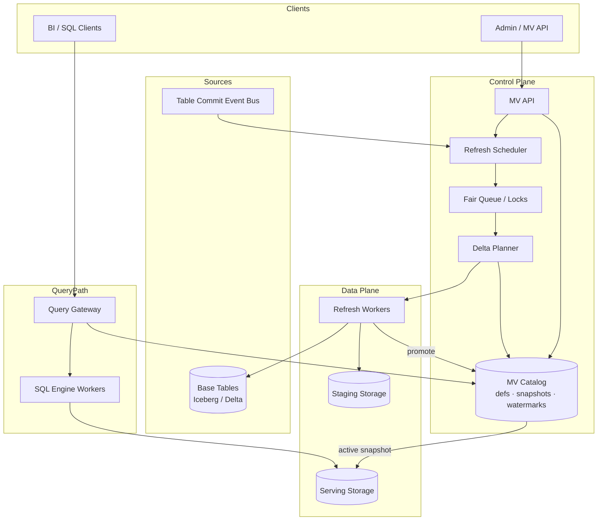
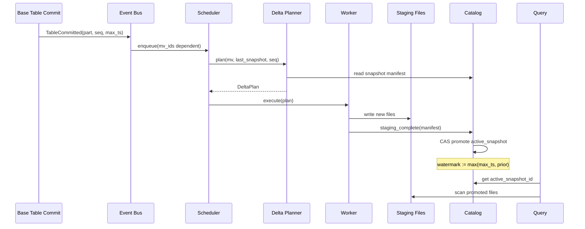

# System Design: Materialized View System

> **Focus areas:** Incremental refresh · Watermarks · Atomic snapshots · Serving indexes · Multi-tenant isolation · Staleness SLOs · Backfill vs streaming  
> **Style:** End-to-end platform design with progressive scale (10× → 100× → 1,000×)  
> **Interview theme:** Snowflake / BigQuery / ClickHouse / Databricks–style managed materialized views over lakehouse or warehouse storage

---

## Table of Contents

1. [Clarify Requirements (Interview Q&A)](#1-clarify-requirements-interview-qa)
2. [Back-of-the-Envelope Estimation](#2-back-of-the-envelope-estimation)
3. [High-Level Design](#3-high-level-design)
4. [Architecture Diagram](#4-architecture-diagram)
5. [Design Deep Dive](#5-design-deep-dive)
6. [Wrap-Up](#6-wrap-up)
7. [Deeper / Related Interview Questions](#7-deeper--related-interview-questions)

---

## 1. Clarify Requirements (Interview Q&A)

The goal is to **bound a multi-tenant materialized view (MV) platform**: tenants define SQL views over base tables; the system maintains precomputed snapshots, refreshes them incrementally when possible, exposes predictable read latency, and publishes freshness guarantees via watermarks.

### 1.0 What this is / is not

| This is | This is not |
|---------|-------------|
| Managed **materialized view** lifecycle: define → plan → refresh → serve | A generic OLTP database with `CREATE MATERIALIZED VIEW` as a DDL footnote |
| Incremental maintenance, watermarks, atomic snapshot swap, serving indexes | Real-time streaming join engine (Flink) — though it may consume changelogs |
| Multi-tenant catalog + scheduler + storage layout optimized for **read-heavy** derived tables | Full interactive ad-hoc query engine (that is a separate problem; MVs may be queried through it) |
| Staleness-aware serving with explicit `as_of` semantics | Strong synchronous consistency between every base-table write and MV read |
| Backfill, recompute, and schema migration as first-class jobs | One-off cron `INSERT OVERWRITE` scripts without lineage or SLOs |

### 1.1 Functional Requirements

| # | Question to ask | Expected / typical interviewer answer | Design implication |
|---|-----------------|----------------------------------------|--------------------|
| F1 | What is a materialized view here? | Named, tenant-scoped SQL definition whose **results are physically stored** and kept (approximately) up to date | Separate **logical definition** from **physical snapshots** + refresh jobs |
| F2 | Refresh model? | **Incremental** when the optimizer can derive delta plans; **full recompute** fallback | Delta compiler + watermark tracker; never assume all MVs are incremental |
| F3 | Triggering refresh? | Scheduled (cron), on base-table commit/event, manual, and SLA-driven lag | Unified **Refresh Scheduler** with priority queues; event bus from table commits |
| F4 | Freshness contract? | Expose **watermark** (max base event time reflected) + optional max staleness SLA | Clients read `(snapshot_id, watermark)`; dashboards show lag |
| F5 | Query path? | Reads hit **serving indexes** (columnar files + optional secondary indexes) not re-execute full SQL | Physical layout: partitions, clustering, sort keys, optional Bloom/zone maps |
| F6 | Atomic visibility? | Readers never see **partial** refresh — swap is atomic at snapshot boundary | Double-buffer snapshots; pointer flip in catalog; copy-on-write files |
| F7 | Base table types? | Batch tables (Parquet/Iceberg/Delta) + optional changelog (Kafka/CDC) | CDC enables true incremental; batch relies on partition-level deltas |
| F8 | Supported SQL? | SELECT + GROUP BY + joins + window fns; limited subqueries; no arbitrary UDF side effects in MVP | Restricted MV SQL grammar; validate at create time |
| F9 | Multi-tenant isolation? | Hard boundary by `tenant_id`; MVs cannot reference other tenants’ tables | Catalog authz; storage prefixes; scheduler fair-share |
| F10 | DDL operations? | CREATE / ALTER (add column) / PAUSE / RESUME / DROP MV | Online schema evolution with versioned physical layouts |
| F11 | Dependencies? | MV may depend on base tables **and other MVs** (DAG) | Lineage graph; topological refresh order (deep dive in sibling doc for cache) |
| F12 | Backfill & repair? | Initial build + recompute after logic change + fix corrupted snapshot | Long-running **Backfill Worker** pool separate from incremental micro-batches |
| F13 | Consistency across MVs? | **Snapshot isolation per MV**; cross-MV point-in-time is best-effort unless coordinated refresh | Version vectors optional for coordinated dashboards |
| F14 | API surface? | REST/gRPC: CRUD MV, trigger refresh, get status, query via SQL gateway or scan API | Idempotent create; refresh job ids |
| F15 | Cost controls? | Per-tenant refresh CPU/IO budgets; pause noisy MVs | Quotas on scan bytes, refresh frequency, stored MV size |

**MVP functional scope (lock this with interviewer):**

1. Tenant creates MV from validated SQL over tenant-owned base tables (batch/lakehouse).
2. **Initial backfill** produces v1 snapshot + serving files + indexes.
3. **Incremental refresh** on schedule or manual trigger when delta plan exists; else scheduled full recompute.
4. **Atomic snapshot promotion**: readers always query one complete snapshot generation.
5. **Watermark** published per MV (`event_time_watermark`, `processed_offset`, `snapshot_id`).
6. Query serving via existing SQL engine **scanning MV storage** (not re-planning full definition each time).
7. MV catalog: definition, lineage, refresh history, staleness, pause/resume.
8. Multi-tenant fair scheduling + per-tenant concurrency limits.

**Out of MVP (explicitly defer):**

- Arbitrary streaming SQL with sub-minute latency for all join shapes
- Automatic MV recommendation / advisor (only manual create in MVP)
- Cross-region active-active same MV writable in two regions
- Strong exactly-once end-to-end with external side effects (email/webhook on refresh)
- User-defined incremental maintenance policies (expert mode)
- Real-time invalidation of BI result caches in other products (hooks only)

### 1.2 Non-Functional Requirements

| # | Question | Expected answer | Target |
|---|----------|-----------------|--------|
| N1 | Read latency (interactive dashboard on MV) | Precomputed — fast | p50 **&lt; 200ms** metadata; p95 **&lt; 2s** for filtered scan on hot partitions (via SQL gateway) |
| N2 | Refresh latency (incremental) | Minutes acceptable for BI | p95 lag **&lt; 5–15 min** from base table commit to promoted snapshot (tenant-configurable) |
| N3 | Availability (serving path) | MV reads are production-critical | **99.9%** read path; stale snapshot served during refresh failure |
| N4 | Durability | MV storage = base table class | **11-nines** object storage; catalog HA with RPO **&lt; 1 min** |
| N5 | Consistency | No torn reads | **Atomic snapshot swap**; readers pin `snapshot_id` for query duration |
| N6 | Multi-region | MV pinned to region of base data | Regional cells; async replication for DR read-only |
| N7 | Security | Enterprise SaaS | TLS, encryption at rest, RBAC on MV + underlying tables, audit refresh jobs |
| N8 | Cost | Refresh work dominates | Incremental default; full recompute rate-limited; auto-pause idle MVs |
| N9 | Correctness | Incremental must match full recompute | Periodic **reconciliation job** (checksum / row counts / HLL) sample |

### 1.3 Cases (User Flows & Edge Cases)

**Happy paths**

1. Analyst creates MV `daily_revenue_by_region` → system validates SQL → queues backfill → promotes snapshot v1 → watermark = max(order_date) in data.
2. Base table `orders` commits new partition → event emitted → scheduler enqueues incremental refresh → delta scan merges → atomic swap v1→v2 → watermark advances.
3. Dashboard queries MV → planner routes to MV storage with partition pruning → sub-second result on hot data.
4. Operator triggers manual refresh → idempotent job → status API shows progress → promotion on success.
5. MV paused for cost → reads still served at last snapshot; watermark frozen; resume continues from lineage offsets.

**Edge / failure cases**

| Case | Behavior |
|------|----------|
| Incremental plan invalid after base schema change | Fail refresh with actionable error; optionally auto-fallback to full recompute if allowed |
| Backfill dies mid-write | New snapshot stays **staging**; readers remain on prior generation; retry backfill idempotently |
| Concurrent refresh + read | Readers pin old `snapshot_id`; writer completes staging then CAS-promote |
| Base table late-arriving data (event time &lt; watermark) | **Allow** via retractions/upserts if MV supports merge semantics; else extend watermark only after reconcile |
| Hot partition append storm | Coalesce micro-batches; per-partition refresh lock; backpressure scheduler |
| MV SQL non-deterministic (`RANDOM()`, `NOW()`) | Reject at CREATE or force full recompute each refresh |
| Join MV — one side updated, other stale | Define freshness as **min watermark across inputs**; document cross-table skew |
| Tenant exceeds refresh budget | Pause lowest-priority MVs; `429` on manual refresh; alert |
| Storage corruption in one file | Quarantine file; serve previous snapshot; repair job rebuilds partition |
| Diamond dependency A→B, A→C, B→D, C→D | Refresh D only after B and C successful for same **input generation** (see DAG doc) |
| Clock skew in event timestamps | Use **ingestion time** watermark sidecar; don't trust client clocks |

### 1.4 Scales (Progressive)

Establish a **baseline**, then stress-test at 10× / 100× / 1,000×.

| Metric | Baseline | 10× | 100× | 1,000× |
|--------|----------|-----|------|--------|
| Tenants | 500 | 5K | 50K | 500K |
| Materialized views (total) | 50K | 500K | 5M | 50M |
| Active MVs (refreshed &lt; 24h) | 10K | 100K | 1M | 10M |
| Base table commit events / sec (peak) | 200 | 2K | 20K | 200K |
| Incremental refresh jobs / day | 500K | 5M | 50M | 500M |
| Peak refresh job admit QPS | 50 | 500 | 5K | 50K |
| MV storage under management | 5 PB | 50 PB | 500 PB | 5 EB |
| Avg MV size | 100 GB | 100 GB | 50–200 GB | 50–200 GB |
| Read QPS against MV storage (peak) | 2K | 20K | 200K | 2M |
| Catalog metadata rows | 100M | 1B | 10B | 100B |
| Watermark update writes / sec | 20 | 200 | 2K | 20K |

**What each jump forces architecturally:**

- **10×:** Separate **Refresh Scheduler** from **Query Gateway**; staging vs serving storage prefixes; Redis for job locks + fair queues; catalog read replicas.
- **100×:** Shard catalog and job queue by `tenant_id`; **cell** per region; partition-level incremental tasks parallelized across worker fleet; metadata in append-only log + KV index.
- **1,000×:** Hierarchical scheduling (tenant → MV → partition tasks); incremental **merge-on-read** avoidance via aggressive compaction; cold MV tier (serve from object only, no hot index); dedicated refresh pools for whales; global lineage service with bounded graph cache.

### 1.5 Etc. (Constraints & Assumptions)

Ask and record:

- **Storage format:** Columnar (Parquet) + open table format (Iceberg/Delta) for ACID partition commits.
- **Compute:** Elastic worker pools (K8s / YARN / serverless functions for small deltas).
- **Change capture:** Base tables emit `(table_id, partition, commit_seq, event_time)` on publish.
- **Query serving:** Existing warehouse SQL engine scans MV table; MV system owns refresh + layout.
- **Not replacing stream processors:** Sub-minute latency for complex joins may remain out of scope.

**Scope statement to repeat back:**

> Design a **multi-tenant materialized view platform** that stores precomputed query results, refreshes them incrementally when possible with **watermarks** and **atomic snapshot promotion**, optimizes **serving indexes** for read-heavy dashboards, and scales from ~500 tenants / 50K MVs to 1,000× with regional cells and fair scheduling. MVP uses batch/lakehouse base tables with commit events; strong cross-MV transactional consistency is not required.

---

## 2. Back-of-the-Envelope Estimation

### 2.1 Refresh job QPS

```text
Baseline: 500K incremental refreshes / day
  ≈ 500e3 / 86400 ≈ 5.8 jobs/s average
  Peak factor ~10× → ~60 jobs/s admit

1,000×: 500M / day → ~5.8K avg, ~58K peak admit QPS
  → Must partition-level fan-out: one logical refresh = hundreds of tasks
```

### 2.2 Read QPS (serving)

```text
Baseline peak: 2K QPS scans against MV storage
Avg scanned per query (pruned): 50 MB
→ 2K × 50 MB ≈ 100 GB/s read bandwidth peak (mitigated by 60%+ cache hit on hot MVs)

1,000×: 2M QPS — unrealistic on single cell; sharded by tenant + MV popularity
  Top 1% MVs may need replicated hot sets / CDN-like edge cache of metadata + small aggregates
```

### 2.3 Storage

```text
Baseline: 50K MVs × 100 GB avg ≈ 5 PB logical
Replication 1.2× + staging snapshots (double-buffer 1 generation) ≈ 6–7 PB

1,000×: 50M MVs × 100 GB = 5 EB logical — only viable with:
  - Aggressive TTL on unused MVs
  - Tiering: 90% of MVs &lt; 1 GB (long tail)
  - Compaction + deletion of stale generations
```

**Per-MV metadata:**

```text
~2 KB catalog row + lineage + 30d refresh history ≈ 50 KB/MV
50K MVs → 2.5 GB metadata (trivial)
50M MVs → 2.5 TB metadata → shard + cold store history
```

### 2.4 Bandwidth (refresh / write)

Assume incremental refresh touches **2%** of MV bytes per event (partition append):

```text
Baseline: 500K refreshes/day × 100 GB MV × 2% delta ≈ 1 PB/day rewrite
Amortized ≈ 1 PB / 86400 ≈ 12 GB/s cluster-wide write (heavy but batchable)

Full recompute rate: 5% of refreshes × 100 GB ≈ 2.5 PB/day extra — budget capped
```

### 2.5 Memory (scheduler + workers)

| Component | Per-unit | Baseline fleet | 1,000× |
|-----------|----------|----------------|--------|
| Job queue metadata | ~1 KB/job | 50K in-flight → 50 MB | Redis Cluster / sharded queues |
| Worker shuffle | 1–8 GB/task | 500 concurrent tasks → 0.5–4 TB | Partition-level tasks limit shuffle |
| Catalog cache | ~100 MB/cell | hot MV defs | 10 GB replicated |

**Hot key risk:** Global MV hit by all tenants’ dashboards — mitigate via **read replicas of snapshot** + result cache upstream (outside MV system).

### 2.6 Watermark & catalog writes

```text
500K promotions/day ≈ 6 CAS updates/s average, ~60/s peak
1,000× → 6K/s → catalog shard by tenant; batch watermark heartbeats for partition subtasks
```

### 2.7 Serving index overhead

```text
Zone maps + Bloom filters + sort metadata ≈ 1–3% of data size
5 PB → 50–150 TB index metadata (often colocated in footers + sidecar manifests)

Secondary index (optional, e.g., high-cardinality lookup):
  10% of MVs × 5% extra storage → plan explicitly — can explode write amp on refresh
```

### 2.8 Cache (platform-level)

| Cache | Key | TTL | Notes |
|-------|-----|-----|-------|
| MV definition + plan | `tenant_id:mv_id:def_version` | minutes | Invalidate on ALTER |
| Snapshot locator | `mv_id` → active `snapshot_id` | seconds | Must invalidate on promote |
| Partition stats | `(mv_id, snapshot_id, part)` | hours | Drives pruning |
| Delta plan | `(mv_id, base_commit_seq)` | minutes | Skip recompile |

---

## 3. High-Level Design

### 3.1 Core concepts

```text
MaterializedView (logical)
  ├── definition_sql, def_version, tenant_id
  ├── refresh_policy (cron, on_commit, manual)
  ├── staleness_sla, paused
  └── physical_state
        ├── active_snapshot_id  ──► readers pin this
        ├── staging_snapshot_id (optional, in-flight)
        ├── watermark { event_time, base_offsets[] }
        └── storage_layout { partition_cols, cluster_keys, indexes[] }

Snapshot (immutable generation)
  ├── snapshot_id, parent_snapshot_id (for incremental lineage)
  ├── manifest_uri (file list + stats)
  ├── row_count, checksum_sample
  └── created_at, promoted_at

RefreshJob
  ├── job_id, mv_id, mode (incremental | full | repair)
  ├── input_watermarks / base_commit_seqs
  ├── status, bytes_scanned, bytes_written
  └── idempotency_key
```

**Watermark semantics:**

- **`event_time_watermark`**: max business timestamp considered committed in this snapshot (e.g., `order_ts`).
- **`processed_seq`**: max `(table_id, commit_seq)` applied — drives incremental correctness.
- Published to clients: `GET /mv/{id}` → `{ snapshot_id, watermark, lag_seconds }`.

### 3.2 Incremental refresh pipeline

1. **Trigger:** scheduler or `TableCommitted` event `(table_id, partitions[], commit_seq, max_event_time)`.
2. **Plan:** Delta Planner loads MV SQL + last snapshot manifest + table diff → produces `DeltaPlan` (append partitions, merge keys, agg rollup).
3. **Execute:** Workers read **only changed base files** + optional previous MV files → write **staging** files.
4. **Validate:** Row-count bounds, checksum sample, watermark monotonicity (configurable).
5. **Promote:** Catalog CAS `active_snapshot_id: vN → vN+1` if staging complete; atomic from reader POV.
6. **Publish:** Emit `MVPromoted` for downstream MVs and cache invalidation hooks.

**When incremental is impossible:**

- Definition change → full backfill new `def_version`.
- Non-monotonic source → require `MERGE` semantics or full rebuild.
- Optimizer cannot prove equivalence → conservative full recompute.

### 3.3 Atomic snapshot strategies

| Approach | Mechanism | Pros | Cons |
|----------|-----------|------|------|
| **Pointer swap** | Catalog stores `active_snapshot_id`; files immutable | Simple; lakehouse-native | Orphan staging GC needed |
| **Table format swap** | Iceberg/Delta metadata commit | ACID manifest | Tied to format |
| **Copy-on-write partition** | Replace partition directories atomically | Good for partition append | Cross-partition MV harder |
| **Dual manifests** | `current.json` renamed atomically | Object-store friendly | Requires careful FS semantics |

**Deal-breaker:** in-place overwrite of files readers may open — **never** do this without snapshot isolation.

### 3.4 Serving indexes & physical layout

**Default layout (MVP):**

- Partition by refresh grain (e.g., `dt`) + cluster/sort on filter columns (`region_id`).
- Columnar Parquet row groups sized 128–256 MB.
- Footer stats + optional **partition-level zone map** in catalog.

**Optional secondary indexes (Phase 2):**

- Bloom filter on high-cardinality equality (`user_id`).
- Min/max skipping indexes for range predicates.
- **Avoid** mutable B-trees on object storage — rebuild on each refresh generation.

**Why columnar + partition pruning over row store?**

| | Columnar lakehouse | Row OLTP replica |
|--|-------------------|------------------|
| Scan bandwidth | Low for BI aggregates | High |
| Refresh | Append/merge files | Random updates expensive |
| Atomic swap | Manifest-level | Tricky at PB scale |

### 3.5 APIs

| Method | Path | Purpose |
|--------|------|---------|
| POST | `/v1/mvs` | Create MV (SQL, refresh policy, layout hints) |
| GET | `/v1/mvs/{mv_id}` | Definition + active snapshot + watermark |
| PATCH | `/v1/mvs/{mv_id}` | Pause/resume, alter SLA, change schedule |
| DELETE | `/v1/mvs/{mv_id}` | Soft-delete; async storage reclaim |
| POST | `/v1/mvs/{mv_id}/refresh` | Manual refresh (`Idempotency-Key`) |
| GET | `/v1/mvs/{mv_id}/refreshes/{job_id}` | Job progress |
| GET | `/v1/mvs/{mv_id}/snapshots` | History / time travel read gens |
| POST | `/v1/mvs/{mv_id}/validate` | Dry-run incremental plan |

**Query path:** not owned solely by MV service — SQL Gateway resolves `SELECT ... FROM mv_daily_revenue` to storage handles + `snapshot_id` pin.

### 3.6 Component architecture

```text
                    +------------------+
                    |   API Gateway    |
                    +--------+---------+
                             |
         +-------------------+-------------------+
         |                   |                   |
         v                   v                   v
 +---------------+   +---------------+   +---------------+
 | MV Catalog    |   | Refresh       |   | Query Gateway |
 | (defs, snaps, |   | Scheduler     |   | (routes scans |
 |  watermarks)  |   | + Fair Queue  |   |  to MV store) |
 +-------+-------+   +-------+-------+   +-------+-------+
         |                   |                   |
         |           +-------+-------+           |
         |           v               v           |
         |    +------------+  +------------+       |
         |    | Delta      |  | Refresh    |       |
         |    | Planner    |  | Workers    |       |
         |    +------------+  +------+-----+       |
         |                           |            |
         v                           v            v
 +------------------------------------------------------+
 |            Object Storage (Parquet / Iceberg)         |
 |  prefixes: /tenant/mv_id/snapshots/{snap_id}/...    |
 +------------------------------------------------------+
         ^
         |
 +-------+-------+
 | Table Commit  |
 | Event Bus     |  (from ingest / lakehouse commits)
 +---------------+
```

### 3.7 Multi-tenant isolation

| Layer | Enforcement |
|-------|-------------|
| Catalog | `tenant_id` on all rows; authz on MV CRUD |
| Storage | `/tenant_id/mv_id/...` prefixes; scoped IAM |
| Scheduler | Fair-share queues per tenant; max concurrent refreshes |
| Workers | Job sandbox; credentials limited to tenant prefix |
| Query | Planner verifies MV + base table grants same tenant |

### 3.8 Trade-offs (explicit)

| Decision | Choose A | Over B | Because |
|----------|----------|--------|---------|
| Refresh default | Incremental micro-batch | Sync on every base row | Cost + feasibility at PB scale |
| Staleness | Expose watermark + SLA | Hide lag | BI users tolerate minutes if visible |
| Promotion | Single active snapshot | In-place update | Correctness beats storage duplication |
| Join MV | Supported with min watermark | Deny joins MVP | Product value; document skew |
| Index richness | Partition + sort + stats | Full secondary indexes everywhere | Write amp on refresh |

**Deal-breakers:**

- Serving torn/partial files without snapshot pin.
- Cross-tenant storage path collision.
- Incremental refresh without idempotent merge keys on mutable facts.

---

## 4. Architecture Diagram

### 4.1 C4-style component flow



### 4.2 Incremental refresh sequence



### 4.3 Snapshot double-buffer

```text
         Catalog.active_snapshot_id
                    │
                    v
            +---------------+
            | Snapshot v3   |  ← readers
            +---------------+
                    ^
                    | promote (atomic CAS)
            +---------------+
            | Snapshot v4   |  ← staging (writers finalize)
            +---------------+
                    |
            GC v2 after TTL
```

---

## 5. Design Deep Dive

### 5.1 Reliability

#### 5.1.1 Hard invariants

1. **No torn reads** — queries pin `snapshot_id` for duration; writers never mutate pinned files.
2. **Idempotent refresh** — same `(mv_id, input_commit_seq)` produces same staging manifest hash; retry safe.
3. **Watermark monotonicity** — default: `event_time_watermark` non-decreasing unless explicit late-data policy resets with full recompute.
4. **Tenant isolation** — worker jobs cannot list outside tenant prefix (SEV-0 test).
5. **Promotion atomicity** — exactly one active snapshot; CAS with generation guard.

#### 5.1.2 Data loss & failure modes

| Failure | Mitigation |
|---------|------------|
| Worker crash mid-write | Staging prefix incomplete; promotion blocked; retry job |
| Catalog CAS lost | Single-writer per MV shard or compare-and-set on `expected_gen` |
| Duplicate events | Job dedupe by `(mv_id, commit_seq)`; merge idempotent |
| Partial partition write | Manifest lists only sealed files; unsealed ignored |
| Base table rollback | Detect seq regression → trigger full recompute or halt with alert |

#### 5.1.3 Retries & idempotency

| Layer | Policy |
|-------|--------|
| API create MV | `Idempotency-Key` → same `mv_id` |
| Refresh trigger | Dedupe window + same job_id return |
| Worker tasks | Deterministic output paths `snap/part/task_attempt` |
| Promotion | Retry CAS on conflict if staging unchanged |

#### 5.1.4 Backpressure & rate limits

- Per-tenant max concurrent refreshes (e.g., 20 baseline, negotiable).
- Global worker pool utilization shed: delay low-priority cron MVs.
- **`429`** on manual refresh when queue depth &gt; threshold.
- Scan-byte budget per job — kill and mark `RESOURCE_LIMIT` before runaway full table scan.

#### 5.1.5 Reconciliation

Nightly sample: `CHECKSUM(snapshot)` vs full recompute on 1% random partitions or shadow MV in cheap pool. Mismatch → auto-quarantine + alert.

### 5.2 Scalability

#### 5.2.1 Partition-level parallelization

Logical refresh fans out:

```text
RefreshJob(mv_id, seq)
  ├── Task(part=2025-08-01)
  ├── Task(part=2025-08-02)
  └── Task(part=2025-08-03)

Barrier: all tasks sealed → compose manifest → promote
```

Enables 100× scale where single-threaded merge would choke.

#### 5.2.2 Sharding

| Entity | Shard key |
|--------|-----------|
| Catalog MV records | `tenant_id` |
| Job queue | `tenant_id` hash → queue shard |
| Worker assignment | `mv_id` + partition |
| Storage | `tenant_id/mv_id` prefix |

#### 5.2.3 Storage tiers

| Tier | Contents | Access |
|------|----------|--------|
| Hot | Last 7–30 days partitions + index sidecars | Local SSD cache on workers |
| Warm | Full active snapshot | Object storage standard |
| Cold | Retired snapshots / paused MVs | Glacier / IA; restore SLA hours |

#### 5.2.4 Incremental vs full recompute economics

```text
Incremental: read 2% × 100 GB = 2 GB write ~2 GB
Full: read+write 100 GB

Break-even: if delta &gt; ~30–40% of MV, full recompute cheaper (fewer merge passes)
```

Planner should **cost-estimate** and pick mode dynamically.

#### 5.2.5 Hot MV read scaling

- Read replicas: same snapshot manifest, multiple caching frontends.
- Pre-aggregated **rollups** for ultra-hot dashboards (optional child MV).
- Coordinate with upstream **result cache** keyed by `(mv_id, snapshot_id, query_hash)`.

#### 5.2.6 Multi-region

| Mode | Use |
|------|-----|
| Regional primary | MV refresh runs where base data lives |
| Read replica region | Async copy of **promoted** snapshots only |
| Failover | Manual promotion of replica; RPO = replication lag |

Avoid dual-writer refresh in two regions for same MV.

### 5.3 Maintainability

#### 5.3.1 Observability

| Metric | Purpose |
|--------|---------|
| `mv_refresh_lag_seconds{tenant,tier}` | SLA dashboards |
| `mv_promote_total` | Success/failure rates |
| `mv_incremental_ratio` | Planner effectiveness |
| `mv_staging_bytes` | Storage GC backlog |
| `mv_watermark_age` | Business time lag vs processing time |
| Traces | Sample refresh jobs end-to-end |

**Label cardinality:** use `tenant_tier`, not raw `tenant_id` on high-card Prometheus metrics.

#### 5.3.2 Operability

- **Pause/resume** per MV and per tenant (billing dispute, incident).
- **Forced full recompute** admin action with audit.
- **Definition migration:** blue/green `def_version` with parallel backfill then cutover.
- **GC service:** delete staging orphans &gt; 7d and snapshots beyond retention `N`.

#### 5.3.3 Schema evolution

| Change | Strategy |
|--------|----------|
| Add column | Compatible append in new files; optional default backfill partition tasks |
| Change aggregation | New `def_version` + backfill |
| Change partition spec | Full rewrite required — block with clear error |

#### 5.3.4 Multi-tenant fairness

Weighted fair queuing: enterprise tenants get guaranteed refresh slots; free tier best-effort overnight window.

#### 5.3.5 Security maintainability

- Refresh workers run with **short-lived** storage credentials.
- Audit log: who created MV, SQL text hash, refresh job outcomes (not full data).
- Prevent MV SQL exfiltration (subqueries to external tables) via allowlist.

---

## 6. Wrap-Up

### 6.1 What we designed

A **multi-tenant materialized view platform** with logical definitions, immutable snapshot generations, incremental delta refresh driven by table commit events, **watermarks** for freshness, **atomic catalog promotion** for safe reads, and columnar **serving layouts** integrated with a SQL query gateway.

### 6.2 Key decisions worth defending

1. **Snapshot pointer swap** — correctness over in-place mutation.  
2. **Incremental first, full fallback** — cost at PB scale.  
3. **Watermarks explicit** — BI trust requires visible lag.  
4. **Partition-parallel refresh tasks** — scales to 1,000× job volume.  
5. **Tenant-scoped sharding** — catalog, queue, storage aligned.  
6. **Delta planner validates at create** — fail fast on non-incremental joins.  
7. **Reconciliation sampling** — incremental drift is inevitable; detect it.  
8. **Separate staging prefix** — simplifies GC and rollback.

### 6.3 Phased rollout

| Phase | Scope | Success criteria |
|-------|-------|------------------|
| **P0 MVP** | Single-region; batch bases; append-only incremental; pointer swap; cron + manual refresh | Create → backfill → promote → query &lt; 2s p95 on sample dashboard |
| **P1** | On-commit triggers; partition parallel tasks; pause/resume; watermark API | p95 refresh lag &lt; 15 min; fair queue |
| **P2** | Merge incremental (upserts); join MVs; secondary Bloom indexes | Correctness tests vs full recompute |
| **P3** | Multi-region read replicas; advisor suggestions; automated reconciliation | 99.9% serving; &lt;0.01% drift |

### 6.4 Risks & follow-ups

| Risk | Mitigation |
|------|------------|
| Incremental plan bugs | Shadow recompute + checksum |
| Small-file explosion | Post-refresh compaction job |
| Join freshness confusion | Document `min(input watermarks)` |
| Whale MV dominates workers | Dedicated pool + partition barriers |
| Catalog hotspot on promote | Shard MV metadata by `mv_id` |

### 6.5 45-minute presentation arc

1. Requirements + MVP scope (6 min)  
2. Watermark + atomic snapshot semantics (8 min)  
3. Incremental pipeline + delta planner (10 min)  
4. Serving layout + query path (6 min)  
5. Scale table + partition tasks (5 min)  
6. Reliability + Q&A traps (remainder)

---

## 7. Deeper / Related Interview Questions

### 7.1 Watermarks & freshness

**Q: Event-time watermark vs processing-time watermark?**  
A: **Event-time** answers "data through which business date is included?" **Processing-time** answers "when did we last refresh?" Both belong in metadata. SLA should be defined on event-time lag for BI, processing-time for ops.

**Q: Late-arriving rows with watermark already published?**  
A: Options: (1) allow retractions + merge refresh lowering effective correctness but fixing data; (2) hold watermark until lateness window elapses (Flink-style); (3) full partition recompute. Pick per MV policy — don't silently drop.

**Q: Can watermark go backwards?**  
A: Only under explicit admin repair or source retraction. Default **monotonic**; backwards triggers alert and optional auto-pause.

### 7.2 Atomic snapshots

**Q: Is renaming a manifest file atomic on S3?**  
A: **No** alone — use single JSON pointer object with conditional PUT (If-Match etag) or table-format commit. Interviewers want **CAS in catalog**, not reliance on POSIX rename.

**Q: Readers mid-scan during promotion?**  
A: Pin `snapshot_id` at query start from catalog; old files remain immutable until GC. New queries get new id.

**Q: How many generations to retain?**  
A: Active + last staging + `N` history for time-travel (e.g., 7). Balance storage vs audit/debug.

### 7.3 Incremental maintenance

**Q: Difference vs CDC stream into MV?**  
A: CDC is change **transport**; incremental MV is **maintenance algorithm**. Can consume CDC, but still need merge keys, agg rollups, idempotent writes.

**Q: COUNT DISTINCT incremental?**  
A: Hard — need HyperLogLog sketch or recompute partition. Often **deal-breaker** for exact incremental; call out approximation or partition-level full recompute.

**Q: Window functions incremental?**  
A: Sliding windows need buffer state; tumbling on aligned partition column is easier. Restrict grammar or store intermediate state table.

**Q: When is incremental slower than full?**  
A: Many tiny deltas causing read amplification + small files — planner should compact and periodically run full.

### 7.4 Serving indexes

**Q: Build indexes before or after promotion?**  
A: **Before** promotion on staging snapshot; promote only when indexes sealed — otherwise queries degrade on hot paths.

**Q: Zone map vs Bloom filter?**  
A: Zone map for range pruning per row group; Bloom for high-card equality. Both rebuilt per snapshot generation.

**Q: Why not update indexes in place?**  
A: Same torn-read problem — indexes must match snapshot generation.

### 7.5 Multi-tenant & scheduling

**Q: One tenant's 10 PB MV starves others?**  
A: Per-tenant worker caps, dedicated whale pools, partition task fairness, defer full recomputes to off-peak.

**Q: Priority inversion: small MV waits behind whale?**  
A: Multi-level queue: interactive SLA MVs preempt batch; WFQ across tenants.

**Q: Can tenants share base tables?**  
A: Only via explicit sharing product with grant records; refresh events fan-out to dependent MVs across tenants carefully.

### 7.6 Consistency & joins

**Q: Join MV freshness?**  
A: Effective watermark = **min** of input table watermarks applied in this refresh. Document that dashboard may mix regions of freshness unless coordinated refresh.

**Q: Snapshot isolation across two MVs for CFO dashboard?**  
A: Optional **refresh bundle** with shared `bundle_seq` — out of MVP but good staff-level extension.

### 7.7 Storage & cost

**Q: Double-buffer storage cost?**  
A: Staging ≈ delta size, not full duplicate — unless full recompute builds parallel copy. GC staging after promote.

**Q: 5 EB at 1,000× realistic?**  
A: Not without aggressive TTL, long-tail small MVs, and tiering. Numbers stress **architecture**, not literal capex.

### 7.8 Correctness traps

**Q: Non-deterministic SQL in MV?**  
A: Reject or freeze values at refresh time — `NOW()` makes incremental meaningless.

**Q: Base table vacuum/delete files MV still references?**  
A: Snapshot manifest holds file list; base table GC must coordinate via reference counting or table format time travel.

**Q: Duplicate commit events?**  
A: Idempotent job keys on `commit_seq`; merge semantics on primary keys.

### 7.9 Comparison questions

**Q: vs query result cache?**  
A: Result cache is per-query ephemeral; MV is **durable shared intermediate** reused by many queries and tenants' dashboards.

**Q: vs streaming Flink materialized table?**  
A: Flink optimizes low-latency changelogs; this design optimizes **batch/lakehouse** cost and atomic snapshot serving at minutes freshness.

**Q: vs read replica of OLTP?**  
A: MV stores **aggregated/projections** — less storage and faster reads for BI, but stale and definition-bound.

**Q: vs Presto/Trino CTAS scheduled?**  
A: MV product adds lineage, watermarks, incremental planner, tenant fairness, atomic promotion — not just cron SQL.

### 7.10 Algorithms & data structures

**Q: Merge-on-read vs merge-on-write for deltas?**  
A: Merge-on-write at refresh time keeps reads fast (chosen). Merge-on-read deferring merge hurts query p95.

**Q: How to represent lineage?**  
A: DAG adjacency list in catalog: `mv_id → [base_tables, upstream_mvs]` for scheduling order.

**Q: Consistent hashing for queue shards?**  
A: Shard by `hash(tenant_id)` to Redis queue instances; rebalancing on cluster resize.

### 7.11 Failure injection drills

1. Kill worker after writing 90% staging files → promotion blocked; retry idempotent.  
2. Duplicate `TableCommitted` event → dedupe; no double watermark bump.  
3. Catalog primary failover during CAS → at most one winner; clients retry.  
4. Query during promotion → old snapshot still valid.  
5. Incremental plan wrong after silent base schema change → validation fails; fallback full.

### 7.12 Staff-level extensions

**Q: Auto MV recommendation?**  
A: Log query patterns → candidate aggregations → cost estimate → human approve — avoid runaway storage.

**Q: Zero-downtime ALTER adding sort key?**  
A: Backfill new layout in staging snapshot; cutover; background compact old files.

**Q: Encryption per tenant CMK?**  
A: SSE-KMS with tenant key on `tenant_id/` prefix; workers assume role per job.

---

*End of design doc. Use section 1 as interview opening script; sections 3–5 as the whiteboard core; section 7 for grilling practice.*
