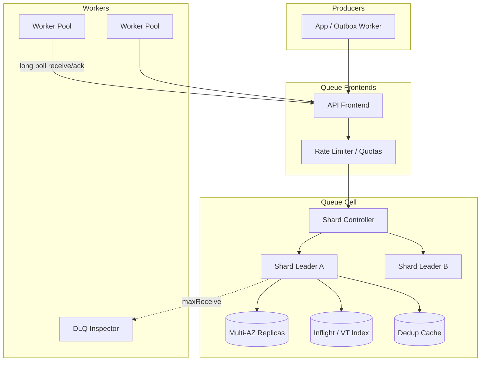
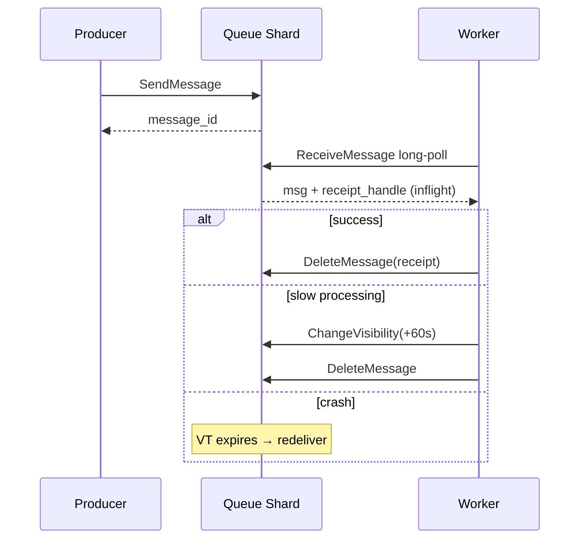

# System Design: Message Queue

> **Focus areas:** Queues · Competing consumers · Visibility timeout / ack · DLQ · Ordering · Idempotency · Backpressure · Progressive scale  
> **Style:** End-to-end infrastructure design with progressive scale (10× → 100× → 1,000×)  
> **Interview theme:** Task / work-queue messaging (SQS / RabbitMQ-class) — durable delivery to workers, not a multi-day replay log  
> **Quality bar:** At-least-once honesty; visibility timeout math; partition/shard scale; compare clearly to Kafka and Pub/Sub

---

## Table of Contents

1. [Clarify Requirements (Interview Q&A)](#1-clarify-requirements-interview-qa)
2. [Back-of-the-Envelope Estimation](#2-back-of-the-envelope-estimation)
3. [High-Level Design](#3-high-level-design)
4. [Architecture Diagram](#4-architecture-diagram)
5. [Design Deep Dive](#5-design-deep-dive)
6. [Wrap-Up](#6-wrap-up)
7. [Deeper / Related Interview Questions](#7-deeper--related-interview-questions)

---

## 1. Clarify Requirements (Interview Q&A)

Design a **message queue** for asynchronous work: producers enqueue tasks; workers compete to process; ack removes (or advances) the message; failures retry then DLQ.

### 1.0 What this is / is not

| Dimension | This doc | Not this |
|-----------|----------|----------|
| Primary use | Task distribution, async jobs, decoupling | Long retention event sourcing / analytics log |
| Consumption | Competing consumers (queue semantics) | Independent fanout groups (use Pub/Sub or Kafka groups) |
| Ack model | Visibility timeout / ack-nack | Offset commit in infinite log |
| Replay | Limited / DLQ redrive | First-class historical replay |
| Ordering | Optional per group / shard | Global always |

### 1.1 Functional Requirements

| # | Question to ask | Expected / typical interviewer answer | Design implication |
|---|-----------------|----------------------------------------|--------------------|
| F1 | Delivery guarantee? | At-least-once default; at-most-once optional | Idempotent consumers required |
| F2 | Ordering? | Best-effort FIFO per queue; strict per `ordering_key` optional | Shard by key; sacrifice parallelism |
| F3 | Ack model? | Visibility timeout + delete/ack | Inflight set; redelivery on timeout |
| F4 | Delay / schedule? | Delay seconds; scheduled messages Phase 1 | Delay wheel / time buckets |
| F5 | Priority? | Optional priority lanes | Multi-queue or heap (careful scale) |
| F6 | DLQ? | After N receives → DLQ | Redrive API |
| F7 | Max message size? | 256 KB–1 MB; claim-check for larger | Pointer to object store |
| F8 | Fanout? | Not primary — use Pub/Sub or exchange | Keep queue = work distribution |
| F9 | Transactions? | Producer outbox; consumer idempotency | No distributed XA MVP |
| F10 | Multi-tenant? | Quotas per queue/account | Noisy-neighbor isolation |
| F11 | Protocol? | HTTP/gRPC + optional AMQP subset | Start with simple API |
| F12 | Exactly-once? | Effectively-once via idempotency keys | Dedup window |
| F13 | Dead letter inspection? | UI/API to peek/redrive | Ops tools |
| F14 | Poison message? | Automatic after maxReceiveCount | Don't block queue forever |

**MVP functional scope:**

1. CreateQueue / DeleteQueue / GetQueueUrl.
2. SendMessage (optional delay, dedup id, ordering key).
3. ReceiveMessage (long poll, batch).
4. DeleteMessage / ChangeVisibility.
5. Visibility timeout redelivery.
6. Redrive policy → DLQ.
7. Basic metrics: age of oldest, inflight, receive rate.
8. IAM/authz per queue.
9. Quotas: msgs/s, inflight max.

**Out of MVP:**

- Full AMQP topic exchanges (point to Pub/Sub doc)
- Kafka-style multi-day replay as primary storage
- Exactly-once without consumer cooperation
- Cross-region sync active-active same queue

### 1.2 Non-Functional Requirements

| # | NFR | Target |
|---|-----|--------|
| N1 | Send p99 | < 20ms in-region |
| N2 | Long-poll Receive | Wake < 100ms when message available |
| N3 | Durability | Multi-AZ replicate before ack send |
| N4 | Availability | 99.9%+; degrade with backpressure not silent drop |
| N5 | Delivery | At-least-once; duplicates expected |
| N6 | Ordering (if enabled) | Per ordering_key strict |
| N7 | Retention | Days (e.g. 4–14), not months |
| N8 | Security | TLS, authn, per-queue authz, encryption at rest |

### 1.3 Cases (User Flows & Edge Cases)

**Happy paths**

1. Producer SendMessage → worker long-polls → processes → DeleteMessage.
2. Worker crashes → visibility expires → another worker receives.
3. Poison fails N times → DLQ → alert → human redrive after fix.
4. Burst: messages buffer; workers autoscale on queue depth / age.
5. Ordered checkout events per `order_id` → same shard sequential.

**Edge / failure cases**

| Case | Behavior |
|------|----------|
| Ack lost after success | Redelivery → consumer must be idempotent |
| Visibility too short | Duplicate in-flight processing → extend visibility heartbeat |
| Visibility too long | Slow failure recovery |
| Hot ordering key | Head-of-line blocking that key's shard |
| Giant message | Reject or claim-check |
| Empty receive storm | Long poll; avoid tight empty loops |
| Queue deleted with inflight | Inflight fail; document |
| Clock skew on delay | Server time authoritative |
| Thundering redrive | Rate-limit redrive |
| Duplicate Send with same dedup id | Return same message id within dedup window |

### 1.4 Scales (Progressive)

| Metric | Baseline | 10× | 100× | 1,000× |
|--------|----------|-----|------|--------|
| Queues | 10K | 100K | 1M | 10M |
| Send TPS | 50K | 500K | 5M | 50M |
| Receive TPS | 50K | 500K | 5M | 50M |
| Inflight msgs | 1M | 10M | 100M | 1B |
| Avg msg size | 2 KB | 2 KB | 2–4 KB | 2–4 KB |
| Workers | 5K | 50K | 500K | Multi-region fleets |
| Storage (4d) | ~35 TB | ~350 TB | ~3.5 PB | Cells |

**Storage math baseline:**

```text
50K send/s × 2 KB × 86400 × 4 ≈ 3.5e13 ×? 
50e3 × 2e3 × 86400 × 4 = 3.456e13 bytes ≈ 34.6 TB ✓
```

**What each jump forces:**

- **10×:** Shard hot queues; separate storage from API; autoscale workers.
- **100×:** Queue cells; partitioned queues by default; tiered storage for backlog.
- **1,000×:** Federated regions; per-tenant clusters; strict admission control.

### 1.5 Etc. (Constraints & Assumptions)

- Prefer **pull** workers over push for backpressure control (push as optional).
- Producer uses **outbox** pattern for DB+queue atomicity.
- Workers are **idempotent**; dedup ids optional enhancement.

**Scope statement to repeat back:**

> Design an **SQS/Rabbit-class message queue**: durable multi-AZ enqueue, long-poll competing consumers, visibility-timeout redelivery, DLQ after N fails, optional per-key ordering and producer dedup—optimized for task throughput and worker scaling, not multi-week log replay.

---

## 2. Back-of-the-Envelope Estimation

### 2.1 QPS

```text
Baseline peak send 50K TPS; receive similar
API nodes: if 5K TPS/node → ~10–15 nodes N+2
Storage layer dominates before API CPU
```

### 2.2 Bandwidth

```text
50K × 2 KB × 2 (send+receive) ≈ 200 MB/s payload
+ replication ×2–3 → ~0.5–1 GB/s cluster net baseline
100× → tens of GB/s → cell architecture
```

### 2.3 Memory (inflight tracking)

```text
Inflight record ~200 B × 1M = 200 MB per cell — OK
1B inflight at 1,000× → sharded inflight maps mandatory
```

### 2.4 Visibility timeout timer wheel

```text
1M inflight timers → hierarchical timing wheel / bucketed scans
Avoid 1M heap timers naively if language costly
```

### 2.5 Hot queue

One viral queue at 80% of cluster TPS → noisy neighbor; isolate to dedicated shard set.

### 2.6 Dedup window storage

```text
dedup id kept 5 minutes
50K/s × 300 s = 15M keys × ~100 B ≈ 1.5 GB — fit Redis/memtable per cell
```

### 2.7 Worker autoscaling signal

Scale on: `ApproximateAgeOfOldestMessage`, depth, inflight utilization — not only CPU.

---

## 3. High-Level Design

### 3.1 API shape

| API | Semantics |
|-----|-----------|
| `SendMessage` | Persist + replicate; return `message_id`, `receipt` optional |
| `SendMessageBatch` | Partial success reporting |
| `ReceiveMessage` | Long-poll; return messages + `receipt_handle` |
| `DeleteMessage` | Ack using receipt_handle |
| `ChangeMessageVisibility` | Extend/hide |
| `PurgeQueue` | Admin |
| `SetRedrivePolicy` | maxReceiveCount → DLQ |

### 3.2 Core data model

```text
QueueConfig { name, vt_default, delay_max, retention, max_receive, dlq, fifo?}
Message { id, body, attrs, send_ts, visible_at, receive_count, ordering_key?, dedup_id? }
Inflight { message_id, receipt_handle, visible_at, consumer_token }
```

### 3.3 Storage choices

| Store | Pros | Cons | Use |
|-------|------|------|-----|
| Kafka log as substrate | Durable, ordered | Competing consume needs cursor mgr | Possible backend |
| Custom segmented log + index | Control VT semantics | Build cost | Classic design |
| DB row per message | Simple MVP | Hot updates kill at scale | Tiny scale only |
| Distributed log + state table | Hybrid | Complexity | Mid/large |

**MVP recommendation:** partitioned append log per queue shard + inflight index (KV). **Deal-breaker:** single Postgres table for all messages at 50K TPS.

### 3.4 Sharding / partitioning

```text
queue_shard = hash(queue_id) % N
for FIFO: shard = hash(queue_id, ordering_key) % N
            within shard: total order for that key (leader)
```

**Consumer groups vs MQ:** classic queue = one logical competing group. For independent fanout, create multiple queues (fanout publish) or use Pub/Sub.

### 3.5 Visibility timeout protocol

```text
Receive: CAS message from visible → inflight; set visible_at = now+VT; receive_count++
Ack: delete message (or mark acked) if receipt_handle matches
Timeout: visible_at ≤ now → return to visible (redeliver)
Heartbeat: ChangeVisibility extend visible_at
```

### 3.6 Exactly-once / dedup

| Mechanism | What it prevents |
|-----------|------------------|
| Producer `dedup_id` | Double send retries |
| Consumer idempotency key in DB | Double process |
| FIFO dedup | Per-interval duplicates |

**True exactly-once end-to-end** needs both sides; broker alone insufficient for side effects.

### 3.7 Backpressure

- Per-queue max depth / max send rate → `429` / `SlowDown`.
- Inflight cap → Receive returns empty even if backlog (protect workers memory).
- Global cell admission when disks saturated.
- Producers should backoff; circuit-break noncritical traffic.

### 3.8 DLQ & retention

```text
if receive_count > max → move to DLQ queue (preserve attrs, error reason)
Retention: hard delete after retention period regardless
```

### 3.9 Compare: MQ vs Kafka vs Pub/Sub

| | Message Queue | Kafka log | Pub/Sub |
|--|---------------|-----------|---------|
| Delete on ack | Typical | No (retain) | Per subscription cursor |
| Competing workers | Native | Consumer group | Competing within subscription |
| Fanout | Manual/extra | Many groups | Many subscriptions |
| Replay | Limited | Excellent | Retention window |
| VT / lease | Native | App-level | Ack deadline |

### 3.10 Why choose MQ

Choose MQ when: task execution, variable worker speed, ack/lease semantics, DLQ ops tooling, short retention. Choose Kafka when: replay, analytics, event sourcing, many independent readers on same stream.

---

## 4. Architecture Diagram





---

## 5. Design Deep Dive

### 5.1 Reliability

**Data loss prevention**

- Quorum/multi-AZ write before Send ack.
- Don't delete until ack; redeliver on VT.
- DLQ for poison — don't infinite retry silently without metrics.

**Retries & idempotency**

- Producer: retry with same `dedup_id`.
- Consumer: process with idempotency store keyed by `message_id` or business key.
- Partial batch send: retry failed entries only.

**Rate limits & backpressure**

- Token buckets per account/queue.
- Inflight ceilings.
- Shed lowest priority queues first under crisis.

**Failure modes**

| Failure | Effect | Mitigation |
|---------|--------|------------|
| Shard leader down | Brief unavailable | Multi-AZ election |
| Worker poison | DLQ | maxReceiveCount |
| VT misconfig | Dupes or stuck | Heartbeats; sane defaults |
| Disk full | Send fails | Capacity alerts; retention |

### 5.2 Scalability

**Scale up/down shards**

- Split hot queue into more shards (breaks global FIFO — OK if not FIFO).
- FIFO queues: split by ordering_key space already; add shards carefully.

**Storage tiers**

- Hot: recent visible messages on SSD.
- Backlog: colder segments to HDD/object; may increase receive latency.

**Parallelization**

- Workers scale horizontally; FIFO limited by keys.
- Batch receive (e.g. 10) for throughput; balance vs failure unit.

**Progressive architecture**

| Scale | Change |
|-------|--------|
| 10× | Shard hot queues; dedicated DLQ pipelines |
| 100× | Cells; auto isolation of noisy tenants |
| 1,000× | Regional federation; per-enterprise clusters |

### 5.3 Maintainability

**Ops:** purge, redrive, peek (careful), move message, adjust VT defaults.

**Observability:** send/receive TPS, error rates, age of oldest, inflight, VT expiry rate, DLQ rate, dedup hit rate, p99 send/receive.

**Migrations:** schema for message envelope v2; dual-read attrs.

**Multi-tenant:** hard quotas; noisy-neighbor automatic quarantine queue placement.

---

## 6. Wrap-Up

### Decision summary

| Decision | Choice | Why |
|----------|--------|-----|
| Semantics | At-least-once + VT | Fits workers; honest dups |
| Storage | Sharded log + inflight index | Scale + lease semantics |
| Fanout | Out of scope / PubSub | Keep MQ focused |
| Ordering | Optional per key | Parallelism tradeoff |
| Poison | DLQ | Ops reality |
| EOS | Dedup + consumer idempotency | Practical |

### Phased rollout

1. **MVP:** standard queues, VT, long poll, DLQ, quotas.  
2. **Phase 1:** FIFO/ordering keys, delay messages, batch APIs.  
3. **Phase 2:** cells, tiered backlog, auto isolation.  
4. **Phase 3:** multi-region routing + enterprise packs.

### Risks

- Treating MQ as event log.  
- Ignoring idempotency.  
- Too-short VT.  
- Single hot FIFO key.

---

## 7. Deeper / Related Interview Questions

**Q1. Why visibility timeout instead of ack-on-receive?**  
Crash safety — message returns if worker dies.

**Q2. How do you prevent double-delete attacks?**  
Receipt_handle is secret capability; rotate; authz.

**Q3. At-least-once vs exactly-once?**  
Broker delivers ≥1; exactly-once effects need idempotent consumers (+ optional dedup).

**Q4. How does long poll save cost?**  
Avoid empty short-poll storms; hold request until message or timeout.

**Q5. FIFO vs standard throughput?**  
FIFO serializes per key; standard massively parallel.

**Q6. Claim-check pattern?**  
Store large payload in S3; message carries pointer + checksum.

**Q7. Outbox pattern?**  
DB transaction writes outbox row; publisher relays to queue — avoids dual-write loss.

**Q8. Backpressure when workers slow?**  
Depth/age grow; throttle producers; autoscale workers; shed load.

**Q9. How is Kafka used as MQ?**  
Possible with consumer group + short retention; still missing VT semantics unless built.

**Q10. Poison message blocks FIFO key?**  
Yes HOL blocking; timeout to DLQ; consider per-key killswitch.

**Q11. Dedup window tradeoffs?**  
Longer window = more memory; shorter = more duplicate risk on slow retries.

**Q12. Inflight limit purpose?**  
Protect memory and fairness; force ack/nack progress.

**Q13. ChangeVisibility heartbeat interval?**  
Fraction of VT (e.g. VT/3); failure to heartbeat → redelivery.

**Q14. Multi-region active-active queue?**  
Hard: duplicate delivery domains; prefer home region + async DR.

**Q15. Priority queues at scale?**  
Separate queues/lanes better than single heap.

**Q16. Metrics that matter for SLO?**  
Age of oldest message; DLQ rate; send fail rate — not only TPS.

**Q17. Security: confused deputy?**  
Per-queue IAM; no global receive; receipt handles unguessable.

**Q18. Batch receive failure semantics?**  
Process each independently; ack individually.

**Q19. How to test redelivery?**  
Kill workers mid-process; assert idempotent outcomes; chaos VT.

**Q20. Memory vs disk for messages?**  
Persist first; cache hot heads in memory for low latency receive.

**Q21. Consistent hashing for shards?**  
Helps rebalance queues across nodes with less move; still need metadata.

**Q22. Load balancer?**  
Frontends stateless; shard routing via metadata; sticky not required for standard.

**Q23. Algorithm for delay messages?**  
Time-wheel buckets; promote to ready queue when due.

**Q24. Compare RabbitMQ quorum queues.**  
Similar goals; AMQP routing richer; ops model differs — know concepts not brand trivia.

**Q25. When Pub/Sub instead?**  
Many independent subscribers need same message without N queues managed by publisher.

**Q26. Exactly-once send?**  
Idempotent send with dedup_id; still at-least-once to consumers.

**Q27. Retention vs Kafka?**  
MQ shorter; after ack typically delete soon; Kafka retains for replay.

**Q28. Hot key detection?**  
Per-shard TPS imbalance; isolate ordering_key.

**Q29. Client library best practices?**  
Timeouts, backoff, extend VT, idempotency keys, batch wisely.

**Q30. First prototype?**  
Single shard log + Redis inflight VT + HTTP API + one worker; kill worker test.

---

## Appendix A — Visibility Timeout Math

```text
p99 processing time P = 12s
network jitter J = 2s
VT_default ≥ P + J + margin ≈ 20–30s
Heartbeat every VT/3 if processing can exceed VT
If VT=30s and work takes 2 min without heartbeat → duplicate delivery guaranteed
```

## Appendix B — Ordering Key Design

```text
Good keys: order_id, user_id (if per-user serial required)
Bad keys: single "global" → one shard throughput cap
Tradeoff: more keys → more parallelism; fewer → stronger cross-entity order (rarely needed)
```

## Appendix C — DLQ Redrive Playbook

1. Alert on DLQ depth.  
2. Inspect sample payloads / error attrs.  
3. Fix consumer bug.  
4. Redrive with rate limit to original queue.  
5. Confirm DLQ drains; watch duplicate side effects.

## Appendix D — Progressive Scale Checklist

| Jump | Frontend | Storage | Tenancy | Workers |
|------|----------|---------|---------|---------|
| 10× | Autoscale | Shard hot queues | Quotas | Depth-based ASG |
| 100× | Cell routers | Tier backlog | Auto-isolate | Regional pools |
| 1,000× | Global directory | Per-tenant cells | Hard isolation | Multi-cloud hooks |

## Appendix E — Talk Track (8 minutes)

1. Queue vs log vs pubsub (1)  
2. VT + at-least-once (2)  
3. Sharding + optional FIFO (1)  
4. DLQ + idempotency (1)  
5. Backpressure / inflight (1)  
6. Scale cells (1)  
7. Failure drill (1)

---

*End of message queue system design.*


## Appendix F — End-to-End Idempotency Patterns

### F1. Producer

```text
SendMessage(
  body,
  dedup_id = hash(business_key + action),
  attrs = {trace_id}
)
Retry on network errors with same dedup_id
```

### F2. Consumer

```text
if redis.setnx("processed:"+message_id, "1", TTL):
    do_work()
else:
    skip  # already done
DeleteMessage(...)
```

### F3. DB-backed

```text
INSERT INTO processed_messages(id) VALUES(?) ON CONFLICT DO NOTHING
if inserted: apply business TX
ack queue
```

## Appendix G — When Not to Use a Message Queue

- Need multi-week replay for many independent analytics readers → Kafka log  
- Need topic fanout with filters/push → Pub/Sub  
- Need RPC request/response with sub-ms latency → not MQ  
- Need global total order at high TPS → rethink product requirement

## Appendix H — Cell Architecture Sketch (100×)

```text
Global Directory: queue_name → cell_id
Cell: API + shard leaders + multi-AZ storage
Noisy queue: migrate to dedicated cell
DR: async cross-region replication of configs + optional message mirror (duplicates possible)
```

---

*Expanded appendices for staff-level depth.*
