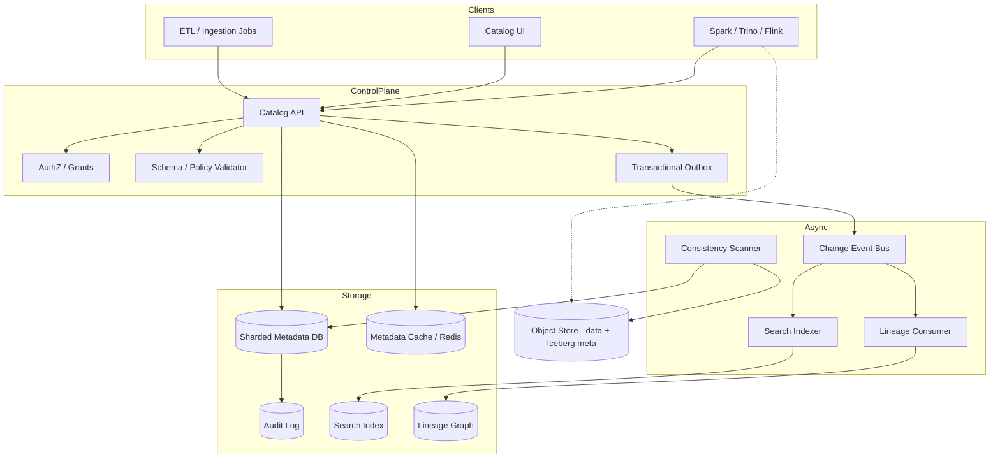
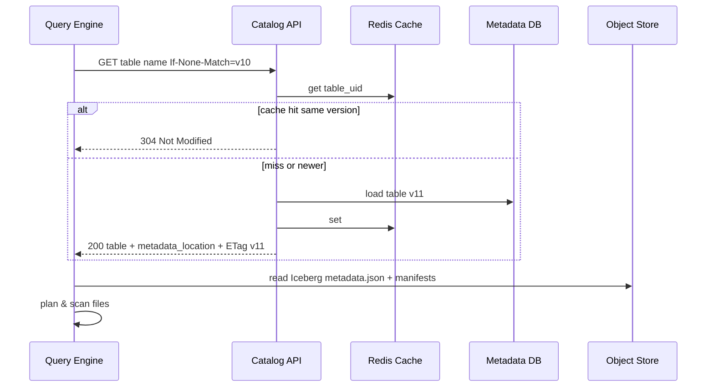

# System Design: Metadata Catalog

> **Focus areas:** Table/dataset registry · Schemas · Partitions · ACLs · Search · Lineage hooks · Lakehouse integration  
> **Style:** End-to-end data-platform design with progressive scale (10× → 100× → 1,000×)  
> **API orientation:** Hive/Unity/DataHub-inspired catalog APIs; control plane for the lakehouse—not the query engine itself

---

## Table of Contents

1. [Clarify Requirements (Interview Q&A)](#1-clarify-requirements-interview-qa)
2. [Back-of-the-Envelope Estimation](#2-back-of-the-envelope-estimation)
3. [High-Level Design](#3-high-level-design)
4. [Architecture Diagram](#4-architecture-diagram)
5. [Design Deep Dive](#5-design-deep-dive)
6. [Wrap-Up](#6-wrap-up)
7. [Deeper / Related Interview Questions](#7-deeper--related-interview-questions)

---

## 1. Clarify Requirements (Interview Q&A)

The goal of this phase is to **bound the problem**: what we build, what we defer, and at what scale we must succeed.

### 1.0 What this is / is not

| This is | This is not |
|---------|-------------|
| A **metadata catalog**: namespaces, tables, views, schemas, partitions, properties, ownership, ACLs | The **query engine** that executes SQL |
| Source of truth for *where data lives* and *how it is shaped* | The object store / warehouse storing row data |
| Discovery + governance surface for data producers/consumers | A full data-quality product (hooks only) |
| Versioned table metadata with transactional updates for lakehouse formats | Schema Registry for Kafka message schemas (related but separate) |

### 1.1 Functional Requirements

| # | Question to ask | Expected / typical interviewer answer | Design implication |
|---|-----------------|----------------------------------------|--------------------|
| F1 | Primary users? | Data engineers, analysts, query engines, ETL jobs, stewards | Dual API: human/UI search + high-QPS engine RPCs |
| F2 | What entities? | Catalog → schema/database → table/view → column; also volumes, models optional | Hierarchical namespaced resource model + global IDs |
| F3 | Table types? | External (files on S3), managed, views, materialized views, streaming tables | Type-specific metadata; location + format + serde |
| F4 | Schema evolution? | Add columns common; drop/rename governed; type widen rules | Schema version history; compatibility policy per table |
| F5 | Partitions / stats? | Partition specs, last-modified, row-count estimates, file counts | Partition metastore can be huge—tier carefully |
| F6 | Lakehouse formats? | Iceberg/Delta/Hudi: catalog stores pointer to metadata.json / log | Catalog must not duplicate every snapshot file listing |
| F7 | ACLs? | Table/column-level grants; row filters Phase 2 | AuthZ service integration; catalog stores grants or references IdP |
| F8 | Search / discovery? | Search by name, column, tag, owner, glossary term | Secondary index (OpenSearch); eventual consistency OK |
| F9 | Lineage? | Table-level lineage MVP; column-level later | Emit lineage events; store edges separately if volume high |
| F10 | Transactions? | Concurrent DDL safe; commit table updates atomically | Optimistic concurrency / version column / compare-and-swap |
| F11 | Multi-tenancy? | Workspace / account isolation; shared metastore cells | Shard by tenant; global name uniqueness within tenant |
| F12 | Notifications? | Consumers need invalidate-on-DDL | CDC / event bus for metadata changes |
| F13 | Tags & glossary? | Business glossary + PII tags | Tagging system with propagation rules (careful) |
| F14 | Cross-engine? | Spark, Trino, Flink all read same catalog | Stable open API + connectors; avoid engine-specific only store |

**MVP functional scope (lock this with interviewer):**

1. CRUD for catalogs/schemas/tables/columns with ownership.
2. Register external tables (format, location, schema, partition spec).
3. Schema evolution with version history and basic compatibility checks.
4. Table ACLs (GRANT/REVOKE style) enforced at API; engines check via plugin.
5. Search by name/tag/owner; browse hierarchy.
6. Metadata change events for cache invalidation.
7. Iceberg/Delta: register table + current metadata pointer; list snapshots summary.
8. Optimistic concurrency on table updates.

**Out of MVP (explicitly defer):**

- Full column-level lineage UI graph at web scale
- Automatic PII classification ML
- Querying data through the catalog
- Universal business metric semantic layer
- Cross-cloud catalog federation (design hooks)

### 1.2 Non-Functional Requirements

| # | Question | Expected answer | Target |
|---|----------|-----------------|--------|
| N1 | Read latency (engine plan-time)? | Hot path for every query | p50 < 5ms, p99 < 20ms cached; p99 < 50ms uncached |
| N2 | DDL latency? | Human / job acceptable | p99 < 500ms |
| N3 | Availability? | Catalog down = lakehouse down | 99.99% for read path; 99.9% DDL |
| N4 | Durability? | Never lose committed DDL | Multi-AZ DB; RPO 0 for committed metadata |
| N5 | Consistency? | Strong read-after-write for DDL within region | Primary read-your-writes; search eventual |
| N6 | Scale of entities? | Millions of tables; billions of partitions possible | Partition metadata tiering / format-native |
| N7 | Multi-region? | Active-passive or regional catalogs | Avoid multi-primary DDL without conflict story |
| N8 | Security? | Least privilege; audit all DDL/DCL | Audit log immutable; encryption |
| N9 | Cache coherence? | Engines cache table metadata | Versioned ETags; push invalidation + TTL |

### 1.3 Cases (User Flows & Edge Cases)

**Happy paths**

1. Create schema → create Iceberg table → engine loads metadata pointer → reads snapshots from object store.
2. ALTER TABLE ADD COLUMN → version bump → event → engines invalidate → next plan sees new schema.
3. GRANT SELECT on table to role → user query authorized via catalog check.
4. Search “customer_id PII” → find tables/columns tagged → open details + lineage neighbors.
5. Rename table → atomic name swap + redirect/alias policy.

**Edge / failure cases**

| Case | Behavior |
|------|----------|
| Concurrent ALTER | CAS on `metadata_version`; loser retries; no silent clobber |
| Register table with missing location | Allow register but mark `UNVERIFIED`; optional probe |
| Partition explosion (1e9 partitions) | Do **not** store one row per partition in OLTP; use format metadata or hierarchical summaries |
| Orphan table (data deleted) | Periodic consistency scanner; mark `MISSING_DATA` |
| Catalog failover mid-DDL | Idempotent DDL keys; transaction commit fencing |
| Name collisions across engines | Canonical 3-part names; reserved keywords policy |
| Hot table metadata (fact table) | Cache aggressively with version; dedicated read replicas |
| ACL revoke race with query | Engine must re-check or short-TTL auth; document TOCTOU window |
| Circular view definitions | Reject on create/alter with cycle detection |
| Extremely wide schema (10k columns) | Paginate column APIs; compress schema storage |

### 1.4 Scales (Progressive)

| Metric | Baseline | 10× | 100× | 1,000× |
|--------|----------|-----|------|--------|
| Tenants / workspaces | 50 | 500 | 5K | 50K |
| Tables | 100K | 1M | 10M | **100M** |
| Columns (avg 50/table) | 5M | 50M | 500M | 5B |
| Partitions tracked in catalog DB | 10M | 50M | **avoid** | format-native only |
| DDL QPS (peak) | 50 | 500 | 5K | 50K |
| Metadata read QPS (peak) | 5K | 50K | 500K | **5M** |
| Search QPS | 100 | 1K | 10K | 100K |
| Concurrent engines caching | 200 | 2K | 20K | 200K |
| Lineage edges | 1M | 10M | 100M | 1B+ |
| Audit events / day | 1M | 10M | 100M | 1B |

**What each jump forces architecturally:**

- **10×:** Read replicas; Redis/local cache with ETag; search index; event bus.
- **100×:** Shard metastore by tenant; stop putting every partition in SQL; Iceberg/Delta native metadata; CQRS for search/lineage.
- **1,000×:** Cell architecture; global directory for tenant→cell; metadata CDN-like edge caches for engines; lineage in graph store; DDL rate isolation per tenant.

### 1.5 Etc. (Constraints & Assumptions)

- **Hive Metastore compatibility?** Provide HMS-thrift shim optional; native REST is primary.
- **Single cloud?** Yes for MVP; locations may be multi-bucket.
- **Who enforces ACL?** Catalog is policy store + check API; engines must call it (or use short-lived tokens).
- **Stats?** Optional; engines also collect—catalog stores hints not absolute truth.

**Scope statement to repeat back:**

> Design a highly available **metadata catalog** for a lakehouse: hierarchical namespaces, table/schema versioning, ACL/governance tags, discovery search, change events, and Iceberg/Delta pointers—optimized for millions of engine metadata reads/sec at scale without storing billions of partitions as OLTP rows.

---

## 2. Back-of-the-Envelope Estimation

### 2.1 Metadata storage

```text
Table record ≈ 2–5 KB (props, schema ref, location, stats summary)
100K tables × 3 KB ≈ 300 MB raw tables

Column records: 100K × 50 × 200 B ≈ 1 GB
With indexes/replication → low tens of GB at baseline (fine for Postgres)

100M tables × 3 KB ≈ 300 GB raw + columns → multi-TB sharded store
```

### 2.2 Partition anti-pattern math

```text
Naive: 10M tables × 1K partitions × 200 B = 2 PB of partition rows
→ Never do this in the catalog OLTP DB

Iceberg: catalog stores ~metadata pointer (~hundreds of bytes);
partition manifests live in object store
```

### 2.3 Read QPS

```text
Baseline peak 5K QPS metadata gets
With 95% cache hit: origin ≈ 250 QPS (easy)

1,000×: 5M QPS → even 99% hit ⇒ 50K origin QPS
→ sharded stores + regional caches + sticky ETags required
```

### 2.4 DDL vs read amplification

```text
Each DDL → DB write + audit + search index update + N cache invalidations
Invalidate storms: popular table ALTER with 10K engine caches
→ version bump + pull model preferred over thundering herd push
```

### 2.5 Search index size

```text
Document per table + per column (optional)
1M tables × 2 KB ≈ 2 GB; 10M columns × 500 B ≈ 5 GB
100×: hundreds of GB — OK for OpenSearch; keep column docs selective
```

### 2.6 Cache memory

```text
Engine-side: hot 10K tables × 5 KB ≈ 50 MB per engine process (trivial)
Catalog edge cache fleet holding 1M hot tables × 5 KB ≈ 5 GB
At 100M tables: working set caching, not full mirror
```

---

## 3. High-Level Design

### 3.1 Core domain model

```text
Account / Workspace (tenant)
  └── Catalog
        └── Namespace / Schema
              └── Table | View | Volume
                    ├── TableIdentity { catalog.schema.name, uid }
                    ├── TableVersion / metadata_version
                    ├── SchemaVersion[] { columns, types, comments }
                    ├── StorageDescriptor { format, location, properties }
                    ├── PartitionSpec / SortOrder (summary)
                    ├── CurrentSnapshotPointer (Iceberg/Delta)
                    ├── StatisticsSummary
                    ├── Owners, Tags, GlossaryTerms
                    └── Grants { principal, privilege, columns? }
```

**Table update state / concurrency:**

```text
read metadata_version=v
apply DDL
commit WHERE version=v → version=v+1  else conflict
```

### 3.2 API shape

| Method | Path | Purpose |
|--------|------|---------|
| POST | `/v1/catalogs/{cat}/schemas` | Create schema |
| POST | `/v1/catalogs/{cat}/schemas/{sch}/tables` | Create/register table |
| GET | `/v1/tables/{uid}` or by name | Get table (ETag / If-None-Match) |
| POST | `/v1/tables/{uid}:commit` | Atomic metadata commit (Iceberg-style) |
| PATCH | `/v1/tables/{uid}` | ALTER properties / schema |
| POST | `/v1/tables/{uid}/grants` | GRANT |
| DELETE | `/v1/tables/{uid}/grants/{id}` | REVOKE |
| GET | `/v1/search?q=` | Discovery search |
| GET | `/v1/tables/{uid}/lineage` | Neighbors |
| GET | `/v1/events` | Change feed (or Kafka) |

**Iceberg-style commit (conceptual):**

```json
{
  "requirements": [{ "type": "assert-table-uuid", "uuid": "..." },
                   { "type": "assert-ref-snapshot-id", "snapshot_id": 123 }],
  "updates": [{ "type": "set-snapshot-ref", "ref": "main", "snapshot_id": 456 }]
}
```

Catalog validates requirements then updates pointer atomically.

### 3.3 Why choose A over B

| Decision | Prefer | Over | Why | Deal-breaker if wrong |
|----------|--------|------|-----|------------------------|
| Partition metadata | Format-native (Iceberg manifests) | HMS partition rows | Scales to huge tables | Catalog DB meltdown |
| Primary store | Relational (Postgres) + shard | Only KV | Rich constraints, transactions | KV without tx → corrupt pointers |
| Search | CQRS secondary index | LIKE on primary | Flexible discovery | Primary overload |
| Cache invalidation | Version ETag + short TTL | Pure long TTL | Correctness under DDL | Stale schemas break jobs |
| ACL storage | Catalog grants + check API | Only IAM on buckets | Column privileges, views | Bucket IAM too coarse |
| Lineage | Async event → graph store | Sync write on every DDL path | Protect DDL latency | DDL p99 blows up |
| Multi-region | Home region for DDL | Multi-writer active-active | Conflict-free names/versions | Split-brain table pointers |

### 3.4 Write path (DDL / commit)

1. AuthN/AuthZ: can user create/alter?
2. Validate name, schema compatibility, location policy.
3. Begin tx: insert/update table row with version check.
4. Write schema version row; update pointer fields.
5. Append audit event in same tx (or transactional outbox).
6. Commit.
7. Publish `MetadataChanged` (table_uid, version, op).
8. Search indexer consumes event; cache clients observe version.

### 3.5 Read path (engine)

1. Resolve name → uid (namespace cache).
2. GET table with `If-None-Match: version`.
3. On 304, use local cache; on 200, refresh.
4. For Iceberg: read `metadata_location`; engine fetches manifests from object store (not catalog).
5. AuthZ check (cached with grant version).

### 3.6 Integration with schema registry

- **Catalog** owns table/column schemas for datasets at rest.
- **Schema Registry** owns evolving event schemas for streams.
- Bridge: when a stream lands as a table, ingestion job registers/updates catalog table schema from registry subject compatibility rules.

### 3.7 Discovery & governance

- Tags: `pii.email`, `tier.gold`; attach to table/column.
- Glossary: business term → linked assets.
- Stewardship: owner + backup owner required for GOLD tables.
- Policy hooks: deny creating unencrypted locations; require classification on certain columns.

---

## 4. Architecture Diagram





---

## 5. Design Deep Dive

### 5.1 Reliability

**Data loss prevention**

- Commit DDL only after DB commit; outbox in same transaction.
- Multi-AZ synchronous replica for metadata DB.
- Soft-delete tables with purge delay; retain schema history.

**Idempotency**

- `Idempotency-Key` on create table; deterministic uid generation optional.
- Iceberg commit requirements prevent lost updates / concurrent snapshot clobber.

**Retries & fencing**

- Clients retry CAS conflicts with refresh.
- Generation numbers on catalog cells for regional failover.

**Rate limits & backpressure**

- Per-tenant DDL QPS; separate from read QPS.
- Search indexer lag alert; DDL still succeeds (search eventual).

**Failure modes**

| Failure | Mitigation |
|---------|------------|
| DB primary down | Automatic failover; engines serve from cache briefly (stale-while-revalidate policy documented) |
| Invalidation storm | Version pull; jittered TTL; coalesce events |
| Search inconsistent | SoT is DB; search rebuildable |
| Partial outbox publish | Outbox poller; exactly-once-ish publish |

### 5.2 Scalability

**Sharding key**

- `tenant_id` (or workspace) → cell / DB shard.
- Ultra-hot tenants: dedicated DB.
- Global unique names within tenant enforced per shard.

**Partition strategy**

- Baseline: optional partition table for non-Iceberg external tables with moderate cardinality.
- At 100×: migrate external tables to Iceberg or store partition index in object store + pointer.

**Caching layers**

1. Engine process cache (ETag).
2. Catalog Redis (hot tables).
3. DB read replicas.

**Scale jumps**

- **10×:** replicas + Redis.
- **100×:** tenant sharding + CQRS search/lineage.
- **1,000×:** cells + edge metadata caches near compute clusters.

**Hot keys**

- `prod.analytics.huge_fact` metadata: replicate to many cache replicas; pin in memory; dedicated rate limit for DDL on hot tables.

### 5.3 Maintainability

**Ops**

- SLOs: read p99, DDL p99, outbox lag, search lag, conflict rate.
- Drill: restore catalog from backup; rebuild search.

**Observability**

- Metrics per API; top tables by read QPS; ACL deny rates.
- Audit: who changed schema / grants.

**Migrations**

- Expand/contract schema of catalog DB itself with online migrations.
- HMS → native catalog dual-write period.

**Multi-tenant**

- Quotas on tables, columns, DDL rate.
- Noisy DDL tenants isolated.
- Cross-tenant access only via explicit shares.

---

## 6. Wrap-Up

### Decision summary

| Area | Choice |
|------|--------|
| SoT | Sharded transactional metadata DB |
| Lakehouse | Store pointers; format owns file/partition lists |
| Reads | Multi-layer cache + ETag versions |
| Discovery | Event-sourced search index |
| Security | Grants in catalog + check API; full audit |
| Scale | Tenant cells; never billion partition rows in OLTP |

### Phased rollout

1. **MVP:** Postgres catalog, table/schema CRUD, ACL, events, basic search.
2. **Phase 1.5:** Iceberg commit API, Redis cache, HMS shim.
3. **Phase 2:** Sharding, lineage graph, column tags governance.
4. **Phase 3:** Multi-region cells, edge caches, 100M-table tier.

---

## 7. Deeper / Related Interview Questions

**Q1. Why not use the Hive Metastore forever?**  
HMS partition scale and HA limitations; poor multi-tenancy; weak transactional commit for Iceberg. Keep a shim, don't center the design on HMS internals.

**Q2. Is the catalog the source of truth for Iceberg snapshots?**  
Catalog is SoT for *which metadata pointer is current*; snapshot/manifest files in object store are SoT for file lists. Confusing these causes double bookkeeping.

**Q3. How do you prevent lost updates on concurrent writers?**  
Conditional commits (`assert-ref-snapshot-id`) / `metadata_version` CAS. Blind OVERWRITE is a deal-breaker.

**Q4. Cache invalidation strategy?**  
ETag/version + short TTL beats pure push. Push as optimization; clients must tolerate drops.

**Q5. Column-level ACL performance?**  
Store grants sparsely; check API returns expanded privileges cached by `(principal, table, grant_version)`. Engines push predicates for row filters later.

**Q6. How to search schemas at 100M tables?**  
Secondary index; ngram/prefix for names; separate column index sampling; never full table scans on primary.

**Q7. View cycle detection?**  
Maintain dependency DAG; reject edges that create cycles; depth limit expansion.

**Q8. Multi-region active-active DDL?**  
Hard: name uniqueness and pointer CAS across regions. Prefer home-region writer + async replica read-only.

**Q9. What belongs in catalog vs object-store table properties?**  
Catalog: identity, pointer, ownership, ACLs, tags. Format metadata: snapshots, manifests, partition stats. Overlap carefully (cached summaries OK).

**Q10. Thundering herd after deploy?**  
Cache warmers for top-N tables; staggered engine restarts; serve stale with grace if DB unhealthy.

**Q11. How does lineage get generated?**  
Query engine / ingestion job emits open-lineage-style events; catalog API may attach run ids; async materialize graph.

**Q12. GDPR: delete metadata about a dataset?**  
Soft-delete asset; purge search/lineage; retain audit per compliance. Data purge in object store is separate workflow.

**Q13. Consistent hashing for shards?**  
Hash tenant_id to cells; virtual nodes; moving a tenant is a planned migration (dump/restore metadata + DNS/directory flip).

**Q14. Why CQRS for search?**  
Different access patterns; protects OLTP; allows denormalized docs (owner name, tag list) without write amplification on primary path.

**Q15. Stats freshness?**  
Best-effort; engines should not trust as exact. Store `as_of` timestamps; analyze jobs update summaries.

**Q16. How do you model rename?**  
Atomic update of name unique index; optional alias tombstone for old name with TTL; update lineage edge labels.

**Q17. Cross-catalog federation?**  
Directory of external catalogs; proxy GET with caching; limited DDL; watch latency and auth mapping.

**Q18. Rate limit design?**  
Token bucket per tenant for DDL; separate higher limit for reads; heavy LIST operations capped/paginated.

**Q19. What breaks if search is down?**  
Browse by known name and engine queries still work; discovery UI degraded. Keep critical path off search.

**Q20. Schema compatibility vs Schema Registry?**  
Registry: binary event evolution. Catalog: table schema evolution for batch/lakehouse. Share compatibility libraries; separate stores.

**Q21. How to store 10k-column schemas?**  
Compress JSON/Avro schema blob; column list API paginated; avoid 10k child rows if not needed for query.

**Q22. Authorization TOCTOU with engines?**  
Short-lived table access tokens including version; or engine revalidates each plan; document max stale grant window.

**Q23. Metastore hot partition keys?**  
Same as hot tables—cache and isolate. LIST partitions API must page and prefer format-native listing.

**Q24. Backup / PITR?**  
DB PITR + object-store for outboxed events; periodic full export of metadata for DR drills.

**Q25. How is this different from DataHub / Amundsen only?**  
Those skew discovery/social. This design emphasizes **transactional plan-time correctness** for engines + lakehouse commits—the staff-level bar.

**Q26. Materialized view metadata?**  
Store definition SQL, refresh state, last_refresh, source table versions; refresh orchestrator separate.

**Q27. Load balancer for catalog API?**  
L7 LB; connection pooling to DB; prefer least-requests; pin nothing except optional session for transactions.

**Q28. Avoiding metastore as bottleneck for Spark job start?**  
Aggressive client cache; bulk GET APIs; avoid per-partition HMS calls; use Iceberg.

**Q29. Tag propagation risks?**  
Automatic propagation can misclassify; prefer explicit tags + suggested classifications; audit overrides.

**Q30. Metrics you'd page on?**  
Commit conflict spike, read p99, failover, outbox lag, auth error spike, disk on metadata shard.

---

*End of Metadata Catalog system design.*
