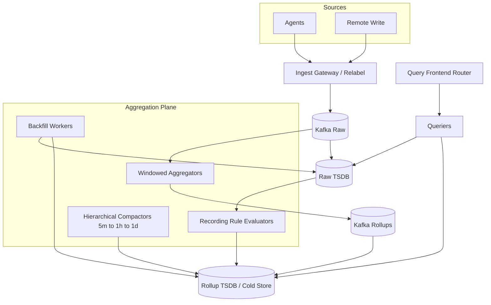
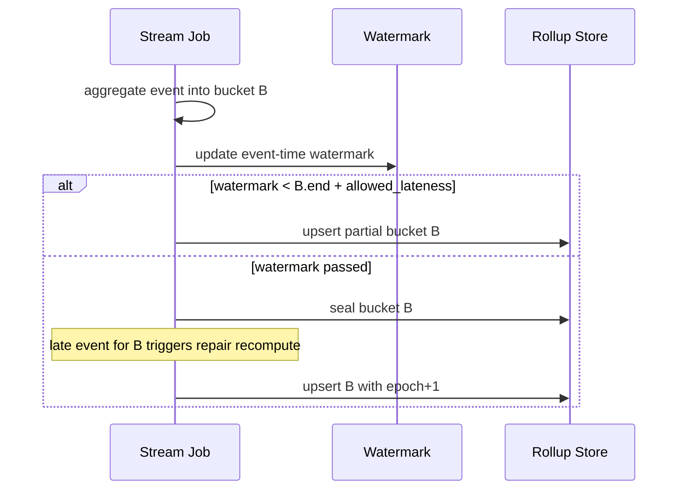

# System Design: Metrics Aggregation and Rollups

> **Focus areas:** Hierarchical time aggregation · Counter vs gauge semantics · Flap/late data · Materialized rollup tables · Streaming vs batch · Query routing to tiers · Cost/cardinality reduction  
> **Style:** End-to-end product design with progressive scale (10× → 100× → 1,000×)  
> **Interview theme:** Observability platforms / warehouse rollups / Druid-style pre-aggregation

---

## Table of Contents

1. [Clarify Requirements (Interview Q&A)](#1-clarify-requirements-interview-qa)
2. [Back-of-the-Envelope Estimation](#2-back-of-the-envelope-estimation)
3. [High-Level Design](#3-high-level-design)
4. [Architecture Diagram](#4-architecture-diagram)
5. [Design Deep Dive](#5-design-deep-dive)
6. [Wrap-Up](#6-wrap-up)
7. [Deeper / Related Interview Questions](#7-deeper--related-interview-questions)

---

## 1. Clarify Requirements (Interview Q&A)

Design a **metrics aggregation & rollups system**: continuously (or periodically) reduce high-resolution metrics into coarser time/label granularities for cheap long-range queries, retention economics, and stable dashboards/alerts—without corrupting counter/gauge/histogram semantics.

### 1.0 What this is / is not

| This is | This is not |
|---------|-------------|
| Pipeline + storage strategy for **pre-aggregated** metric tiers | Full TSDB from scratch (companion: time-series-database doc) |
| Correct rollup algebra for sum/min/max/count/histograms/counters | Arbitrary SQL cube for all BI dimensions |
| Query router choosing raw vs 5m vs 1h | Only a cron that averages floats blindly |
| Cardinality-reduction aggregations (`sum by`) | Trace storage or log analytics |

### 1.1 Functional Requirements

| # | Question to ask | Expected / typical interviewer answer | Design implication |
|---|-----------------|----------------------------------------|--------------------|
| F1 | Source of raw metrics? | TSDB / Kafka metrics topic / OTel collectors | Define ingest contract + watermark |
| F2 | Rollup resolutions? | 1m (optional), 5m, 1h, 1d | Hierarchical jobs or streaming windows |
| F3 | Aggregates stored? | sum, min, max, count; hist buckets; sketches | Typed rollup schema per metric type |
| F4 | Label sets? | Drop high-card labels at each tier | Explicit aggregation keys |
| F5 | Query behavior? | Auto-select tier from range/step | Transparent router + override |
| F6 | Freshness? | 5m rollup lag ≤ 2–5 min | Streaming or micro-batch |
| F7 | Late data? | Accept within watermark; repair windows | Recompute / upsert rollups |
| F8 | Counters? | Must use increase/rate semantics | Never avg counter values |
| F9 | Multi-tenant? | Yes | Per-tenant jobs + quotas |
| F10 | Backfill? | Reprocess historical ranges | Idempotent rebuild API |
| F11 | Alerting? | Prefer recording-rule style series | Stable names for alerts |
| F12 | Exactness? | Exact for sum/count; approx OK for distinct | HLL optional separate |
| F13 | Retention? | Raw short; rollups long | TTL per tier |
| F14 | SLOs of system? | Lag, coverage, correctness tests | Data quality monitors |

**MVP functional scope:**

1. Consume raw samples/series from Kafka or TSDB API.
2. Produce **5m** and **1h** rollup series with correct types.
3. Persist rollups in TSDB-compatible blocks or columnar tables.
4. Query gateway routes: short range → raw; long/`step` large → rollups.
5. Handle late data with watermark + bounded recompute.
6. Tenant isolation + cardinality caps on rollup keys.
7. Backfill job for a time range.
8. Dashboards for rollup lag & coverage.

**Out of MVP:**

- Fully automatic discovery of all useful `sum by` aggregates without config
- Perfect answers under infinite lateness
- Cross-metric joins as a first-class cube
- Replacing stream processing platform entirely

### 1.2 Non-Functional Requirements

| # | Question | Expected answer | Target |
|---|----------|-----------------|--------|
| N1 | Rollup lag (5m) | Near-real-time dashboards | p95 lag &lt; 3 min |
| N2 | Correctness | Counter resets handled | Golden tests vs raw |
| N3 | Durability | No silent gaps after ack | Idempotent sinks |
| N4 | Availability | Degrade to raw queries | Router fallback |
| N5 | Cost | ≪ raw storage for long retention | 10–100× reduction typical |
| N6 | Throughput | Keep up with ingest | Lag-based autoscaling |
| N7 | Query transparency | Users understand tier used | Debug header / EXPLAIN |
| N8 | Multi-region | Regional pipelines | No cross-region exactly-once fantasy |

### 1.3 Cases

**Happy paths**

1. Raw scrape → 5m sum/count → dashboard 7d `step=5m` reads L1 only.
2. Alert recording rule materializes `job:http_errors:rate5m` every minute.
3. Late batch arrives 10m late → recompute affected 5m buckets.
4. Backfill after bugfix recomputes 1h for last 7d idempotently.

**Edge / failure cases**

| Case | Behavior |
|------|----------|
| Counter reset mid-bucket | `increase` semantics; ignore negative deltas |
| Gauge rollup | store min/max/avg/last explicitly — pick product semantics |
| Histogram | merge bucket counts; do **not** avg quantiles |
| Sparse series (missing scrapes) | count reflects presence; rate extrapolates carefully |
| Watermark stuck | Alert; don’t advance; avoid sealing incomplete buckets |
| Rollup job down | Query falls back to raw (costly) with banner |
| Aggregation key too high card | Reject rule; force coarser labels |
| Double processing | Idempotent upsert by `(tenant, metric, labels, bucket_start)` |
| DST / timezone | Store UTC bucket starts only |
| Step not aligned | Quantize query to tier grid or interpolate with disclosure |

### 1.4 Scales (Progressive)

| Metric | Baseline | 10× | 100× | 1,000× |
|--------|----------|-----|------|--------|
| Raw samples/s | 5M | 50M | 500M | 5B |
| Raw active series | 10M | 100M | 1B | 10B |
| Rollup series (5m keys) | 1M | 10M | 100M | 1B |
| Rollup write points/s | 50K | 500K | 5M | 50M |
| Configured aggregation rules | 500 | 5K | 50K | 500K |
| Backfill PB-equivalent rewrites | rare | weekly | continuous | continuous controlled |
| Query QPS using rollups | 150 | 1.5K | 15K | 150K |

**What each jump forces:**

- **10×:** Stream processing (Flink) over micro-batches; separate rollup Kafka topics; lag SLOs.
- **100×:** Hierarchical rollups (5m→1h→1d) to cut write amp; sharded workers by tenant; materialization service.
- **1,000×:** Edge/local aggregation before central; rule compilation & packaging; query only pre-agg for long ranges; hard deny raw fanout queries.

### 1.5 Etc.

- Align with TSDB block format **or** write to Druid/Pinot/ClickHouse — state choice.
- Prefer **UTC unix bucket alignment**.
- Recording rules (Prometheus style) are a UX for rollups — include in design.
- Distinguish **time rollup** (same labels, coarser time) vs **space aggregation** (drop labels).

**Scope statement:**

> Design a metrics aggregation/rollups platform that builds hierarchical, semantically correct pre-aggregates from high-cardinality raw metrics, routes queries to the right tier, handles late data/backfill, and keeps long-term retention affordable from 5M to 5B samples/s class workloads.

---

## 2. Back-of-the-Envelope Estimation

### 2.1 Why rollups exist (cost)

```text
Raw: 5M samples/s × 2B × 86400 ≈ 864 GB/day
Retain raw 15d ≈ 13 TB

If keep raw 1y: ≈ 315 TB compressed (+ RF) → $$$

5m rollups:
  Assume space-agg reduces series 10M → 1M keys
  Points: 1M series × 288 buckets/day = 288M points/day
  × 4B avg ≈ 1.2 TB/day before compression → still large

Better: 1M keys × 12B compressed/day ≈ 12 GB/day
Retain 1y ≈ 4.3 TB  ← vs hundreds of TB raw
```

### 2.2 Write amplification

```text
Streaming 5m windows flush once per key per bucket
Plus 1h built from 5m: +1/12 writes if hierarchical
Hierarchical beats raw→1h and raw→5m independently
```

### 2.3 Recompute cost (late data)

```text
1% buckets revisited × recompute factor 2 → ~2% extra CPU
If watermark too short, data wrong; too long, lag high
Typical allowed lateness: 5–15 minutes for 5m tier
```

### 2.4 Query savings

```text
7d dashboard step=5m over 100K series:
  Raw: 100K × 7×24×60×6 samples (10s) ≈ 6B samples scanned
  Rollup: 100K × 7×288 ≈ 200M points  → ~30× less
```

### 2.5 Rule evaluation fanout

```text
500 rules × every 30s = ~17 evals/s baseline
Each scans many series → need recording materialization, not live eval on huge fanout
```

### 2.6 Hot keys

| Hotspot | Mitigation |
|---------|------------|
| `sum` over entire company | Pre-materialize; cache |
| One tenant 90% rules | Shard by tenant; fair scheduler |
| Pathological label keep list | Lint rules on deploy |

---

## 3. High-Level Design

### 3.1 Rollup algebra (correctness core)

| Metric type | Bucket aggregate | Notes |
|-------------|------------------|-------|
| **Gauge** | min, max, sum, count, last/avg | Define avg = sum/count; last optional |
| **Counter** | sum of **increases** | Handle resets; store `increase` not raw counter avg |
| **Histogram** | sum bucket counts + count/sum | Merge compatible buckets only |
| **Summary** | Often **don’t rollup quantiles** | Recompute from hist or store heatmap |
| **Set / distinct** | HLL merge | Approx |

**Composition (hierarchical):**  
`sum` and `count` compose; `min`/`max` compose; **avg does not compose** without sum+count; **percentiles do not compose**.

### 3.2 Two kinds of aggregation

```text
TIME ROLLUP:  (series_key, 10s samples) → (series_key, 5m aggregates)
SPACE AGG:    sum without (instance, pod) → fewer series_keys
Often both:   sum by (service, status)[5m]
```

### 3.3 API / config model

```yaml
# recording / rollup rule
name: service:http_requests:rate5m
interval: 1m            # evaluation cadence (materialize often)
query: sum by (service, status) (rate(http_requests_total[5m]))
tiers:
  - resolution: 5m
    retention: 90d
  - resolution: 1h
    retention: 2y
    source: hierarchical   # from 5m
```

Admin API: CRUD rules, dry-run cardinality estimate, backfill.

### 3.4 Pipeline architecture

**Option A — Streaming windows (Flink/Spark Streaming):**

```text
Kafka raw → window(5m, allowed_lateness) → keyed aggregate → sink rollup topic/TSDB
```

**Option B — Micro-batch from TSDB:**

```text
Scheduler → query raw range → aggregate → write rollups
```

**Option C — Hybrid (recommended narrative):**

- Hot recording rules: streaming / ruler evaluating continuously.
- Long retention hierarchical: batch/streaming compactors building 1h/1d from 5m.

### 3.5 Storage layout for rollups

**TSDB-compatible series** (easy query path):

```text
__name__=service:http_requests:rate5m
service=checkout
status=500
# value = aggregated rate or increase/sec
```

**Columnar cube** (Druid-like):

```text
time | service | status | sum | count | min | max
```

**Trade-off:** TSDB series reuse PromQL; cubes better for many-dimensional ad-hoc. Interview: pick TSDB series for observability; mention cube for product analytics.

### 3.6 Query routing

```text
function pick_tier(range, step, query):
  if query.force_raw: return RAW
  if range <= 2h and step <= 15s: return RAW
  if step >= 1h or range >= 30d: prefer L_1H
  if step >= 5m or range >= 24h: prefer L_5M
  else RAW
  verify coverage(tier, range) else FALLBACK
```

Expose `X-Rollup-Tier: 5m` for debugging.

### 3.7 Option analysis

#### A. Materialize vs query-time agg

| | Materialize rollups | Query-time only |
|--|---------------------|-----------------|
| Cost at query | Low | High |
| Flexibility | Rules must exist | Any query |
| Freshness | Lag | Latest raw |
| Correctness risk | Stale/late | Heavy load |

**Choice:** Materialize common rules + time tiers; allow raw for ad-hoc short ranges.

#### B. Hierarchical vs from-raw each tier

| Hierarchical 5m→1h | Independent from raw |
|--------------------|----------------------|
| Less read amp | Can diverge if bugs |
| Must compose | Simpler mental model |

Prefer hierarchical for sum/count/min/max; rebuild from raw on corruption.

#### C. Upsert semantics

| Strategy | Notes |
|----------|-------|
| Replace bucket | Idempotent backfill |
| Additive only | Bad for recompute |
| Version epoch | Readers pick latest epoch |

### 3.8 Progressive scale

- **Baseline:** Prometheus-style ruler + nightly 1h downsample job.
- **10×:** Kafka + Flink 5m keyed aggregates; query router.
- **100×:** Rule service, cardinality estimator, hierarchical tiers, multi-tenant shards.
- **1,000×:** Edge aggregate gateways; central only coarse keys; raw kept briefly.

---

## 4. Architecture Diagram

### 4.1 End-to-end rollups platform



### 4.2 Late data recompute



### 4.3 Query router decision

```text
Client query
   │
   ▼
Parse PromQL / SQL
   │
   ├─ Needs raw functions / high res? → RAW
   ├─ Coverage(L_5M) OK & step≥5m? → L_5M
   ├─ Coverage(L_1H) OK & step≥1h? → L_1H
   └─ Else FALLBACK raw with cost estimate / reject if over budget
```

---

## 5. Design Deep Dive

### 5.1 Reliability

#### 5.1.1 Hard invariants

1. **Type-safe aggregation** — counters never averaged as gauges.
2. **Idempotent bucket writes** — backfill safe.
3. **Watermarks explicit** — sealed buckets defined.
4. **Fallback correctness** — if rollup missing, prefer raw or error, never wrong silent mix without disclosure.
5. **Tenant isolation** on rules and storage.

#### 5.1.2 Failure modes

| Failure | Mitigation |
|---------|------------|
| Aggregator crash | Restart from Kafka checkpoint; upsert idempotent |
| Partial seal | Epoch version; querier reads latest complete |
| Rule deploy bug | Shadow eval; canary tenant; instant rollback |
| Divergence hierarchical | Periodic scrub vs raw sampling |
| Poison high-card rule | Estimator blocks deploy |

#### 5.1.3 Exactly-once-ish

Kafka + Flink checkpoints → sink upsert with deterministic key. At-least-once end-to-end with idempotent DB is the practical goal.

#### 5.1.4 Backpressure

If rollup lag ≫ SLO: (1) scale aggregators; (2) shed optional rules; (3) stop accepting new high-card rules; (4) never drop raw ack without policy.

#### 5.1.5 Data quality

- Compare `sum(raw increase)` vs rollup for sampled series.
- Coverage metric: `% buckets present` for each tier.
- Alert on lag, null rates, scrub mismatch.

### 5.2 Scalability

#### 5.2.1 Keying & parallelism

```text
key = hash(tenant_id, agg_metric, label_values)
window state partitioned by key across Flink tasks
```

Avoid global windows.

#### 5.2.2 Hierarchical reduction

```text
Raw 10s → 5m (space + time) → 1h → 1d
Each stage 10–60× volume reduction typical when dropping instance/pod
```

#### 5.2.3 Rule compilation

At 50K rules: compile to shared plans; multi-rule evaluation over shared scans (Prometheus ruler optimizations / Mimir ruler sharding).

#### 5.2.4 Query scale

- Cache rollup query results aggressively (immutable historical buckets).
- Disable raw for `range > X` on free tiers.
- Pre-compute dashboard tiles for exec views.

#### 5.2.5 Edge aggregation

At 1,000×, agents/gateways aggregate `sum without (pod)` before egress — central sees already-reduced streams. Trade-off: lose pod-level debug centrally (keep short raw regionally).

### 5.3 Maintainability

#### 5.3.1 Observability

Lag by rule/tenant, records/s, state size, late event rate, scrub mismatch, router tier hit ratio, fallback rate.

#### 5.3.2 Config as code

Rules in Git; CI runs cardinality estimator on sample index; required reviewers for high-fanout rules.

#### 5.3.3 Schema evolution

Adding a label to aggregation key creates **new series** — version metric names (`_v2`) or accept break. Removing label merges series — careful backfill.

#### 5.3.4 Testing

- Golden vectors: counter resets, sparse gaps, late points, hist merges.
- Property: hierarchical sum equals from-raw sum within epsilon.
- Load tests for lag under 2× ingest.

#### 5.3.5 Operability

- Backfill UI with progress.
- “Explain this dashboard panel” showing tier + rules used.
- Kill switch per rule.

---

## 6. Wrap-Up

### 6.1 What we designed

A **metrics aggregation/rollups platform**: semantically correct time+space aggregates, streaming/micro-batch materialization, hierarchical tiers for retention economics, query routing with fallback, late-data repair, and multi-tenant rule governance—reducing long-range query cost by orders of magnitude.

### 6.2 Key decisions

1. **Separate gauge/counter/histogram algebra.**  
2. **Materialize common aggregates; don’t rely on query-time alone.**  
3. **Hierarchical 5m→1h→1d** for write efficiency.  
4. **Idempotent bucket upserts + epochs.**  
5. **Watermarked late data with repair.**  
6. **Query router with transparency + coverage checks.**  
7. **Cardinality estimation on rule deploy.**  
8. **Edge aggregation at extreme scale.**

### 6.3 Risks

| Risk | Mitigation |
|------|------------|
| Wrong counter rollups | Golden tests; type registry |
| Rule sprawl | Lint + ownership + quotas |
| Silent fallback to raw | Cost gates + user-visible tier |
| State blowup in Flink | Key caps; TTL state |
| Hierarchical divergence | Scrub jobs |

### 6.4 45-minute arc

1. Why rollups + algebra (8 min)  
2. Numbers: storage & scan reduction (4 min)  
3. Pipeline + hierarchical design (10 min)  
4. Late data + idempotency (7 min)  
5. Query router + scale (6 min)  
6. Traps (remainder)

---

## 7. Deeper / Related Interview Questions

### 7.1 Semantics

**Q: Why can’t you average averages?**  
A: Need sum and count to recompute; weighted average. Blind avg of avgs is wrong.

**Q: Why can’t you roll up quantiles by averaging p99?**  
A: Quantiles non-composable. Merge histograms or t-digests carefully; else keep raw for quantile queries.

**Q: Counter reset handling?**  
A: If delta negative (beyond float noise), treat as reset: increase += current (or skip). Align with Prom `increase()` behavior and document.

**Q: Gauge “last” vs “avg” for 5m?**  
A: Product choice — CPU often avg/max; temperature last/avg; always store enough to reconstruct chosen semantics.

### 7.2 Late data & watermarks

**Q: What is allowed lateness?**  
A: Bound after which bucket seals; late events trigger repair. Too short → undercount; too long → lag/state.

**Q: How do you repair sealed buckets?**  
A: Re-read raw for bucket range; recompute; upsert new epoch; queriers prefer highest epoch.

**Q: Kafka vs event-time?**  
A: Windows on event timestamp, not processing time; watermark from event-time progress.

### 7.3 Storage & query

**Q: Store rate or increase in rollup?**  
A: Storing increase (or sum of increases) is flexible; rate = increase/seconds. Storing only rate loses duration math under irregular steps.

**Q: Align steps to grid?**  
A: Yes for cacheability and composition; query engine may snap `start/end` to bucket boundaries with disclosure.

**Q: Mix raw and rollup in one chart?**  
A: Dangerous at boundary. Prefer single tier per query or carefully stitch with awareness of lag.

### 7.4 Systems architecture

**Q: Ruler vs stream aggregator?**  
A: Ruler: pulls TSDB, good for PromQL compatibility. Stream: lower lag/cost at huge ingest. Hybrid common.

**Q: Why hierarchical compactors?**  
A: Building 1d from raw repeatedly is wasteful; from 1h is 24× cheaper reads.

**Q: Druid vs TSDB series for rollups?**  
A: Druid/Pinot excel at dimensional cubes; TSDB series excel at PromQL ecosystem. Choose by query language.

### 7.5 Cardinality & governance

**Q: Estimate cardinality of a new rule?**  
A: Use index stats: product of NDVs of `by` labels with correlation fudge factor; better: sample evaluation on recent block.

**Q: Who owns a recording rule?**  
A: CODEOWNERS-like metadata; cost attributed to team; auto-disable unused rules.

### 7.6 Algorithms & sketches

**Q: Merge HLL for approx distinct?**  
A: Union registers; error bounds; don’t mix different HLL params.

**Q: t-digest merge?**  
A: Approx quantile merge possible with error; not exact.

**Q: Window state store?**  
A: RocksDB keyed state in Flink; size ~ keys × windows in lateness horizon.

### 7.7 Consistency & multi-region

**Q: Active-active rollup writers?**  
A: Prefer single writer per `(tenant, rule)` shard; multi-region dual write causes duplicates without epochs/CRDTs.

**Q: Read-your-write after rule create?**  
A: Materialization delay expected; UI shows “warming.”

### 7.8 Failure injection

1. Kill Flink mid-window → restore checkpoint; upsert.  
2. Raw TSDB outage → pause ruler; stream from Kafka if available.  
3. Deploy bad rule → cardinality breaker.  
4. Scrub detects 2% mismatch → page + auto backfill sample.  
5. Query router bug always raw → cost explosion alert on bytes scanned.

### 7.9 Comparisons

**Q: Rollups vs materialized views in warehouse?**  
A: Same idea; metrics need scrape semantics, PromQL, and extreme write rates. Warehouses better for denser dimensional BI.

**Q: Rollups vs TSDB compression alone?**  
A: Compression reduces bytes/sample; rollups reduce **samples and series**. You need both.

**Q: Rollups vs exemplars/traces?**  
A: Rollups answer aggregate trends; exemplars point to examples — complementary.

### 7.10 Interview traps

**Q: “Just use `avg_over_time` on counters for hourly charts.”**  
A: Wrong. Use `increase`/`rate` then aggregate.

**Q: “Keep all labels forever in rollups.”**  
A: Defeats the purpose; drop instance/pod at L1+.

**Q: “Exactly-once means no upserts.”**  
A: Upserts with deterministic keys are how you achieve practical EO under retries.

---

*End of design doc. Use section 1 as interview opening script; sections 3–5 as the whiteboard core; section 7 for grilling practice.*
