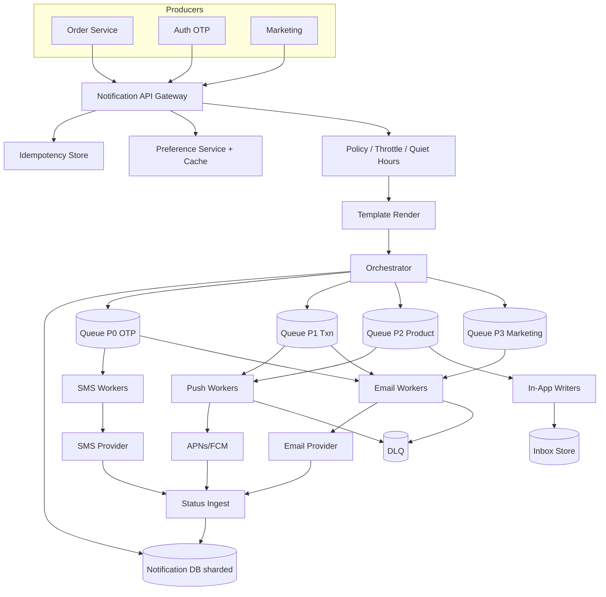
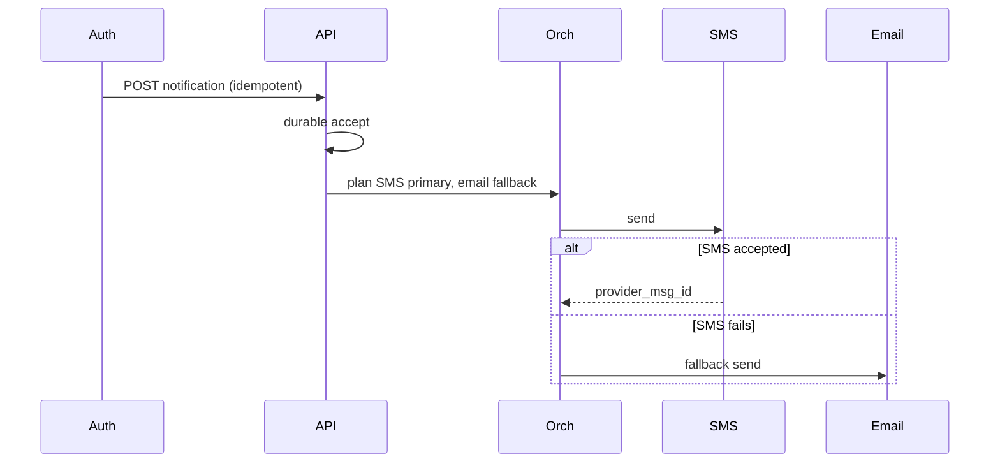

# System Design: Multi-Channel Notification System

> **Focus areas:** Preference engine · Channel adapters · Fan-out · Dedup/throttle · Priority · Templates · Delivery receipts · Tenant isolation  
> **Style:** End-to-end product design with progressive scale (10× → 100× → 1,000×)  
> **Quality bar:** At-least-once with idempotent sends; preference + quiet hours sacred; channel failures isolated; progressive scale jumps change architecture  
> **Interview theme:** Senior / Staff — **notification orchestration platform** used by product teams (OTP, transactional, marketing, alerts)

---

## Table of Contents

1. [Clarify Requirements (Interview Q&A)](#1-clarify-requirements-interview-qa)
2. [Back-of-the-Envelope Estimation](#2-back-of-the-envelope-estimation)
3. [High-Level Design](#3-high-level-design)
4. [Architecture Diagram](#4-architecture-diagram)
5. [Design Deep Dive](#5-design-deep-dive)
6. [Wrap-Up](#6-wrap-up)
7. [Deeper / Related Interview Questions](#7-deeper--related-interview-questions)
8. [Appendices](#8-appendices)

---

## 1. Clarify Requirements (Interview Q&A)

Goal: design a **multi-channel notification platform** that accepts intent from producers (“user X should know about event Y”), resolves **who / which channel / when / with what template**, and delivers with **auditable status**—without melting providers or spamming users.

### 1.0 What this is / is not

| Dimension | This doc | Not this |
|-----------|----------|----------|
| Job | Orchestrate notifications across push / email / SMS / in-app / webhook | Own the entire Gmail MTA stack or WhatsApp mesh |
| Abstraction | Notification intent + preference + channel adapters | Full marketing CRM / journey builder (hooks only) |
| Guarantee | Durable accept + at-least-once channel attempt | Exactly-once end-device display without client help |
| Product lens | Platform for many internal producers | Single-app hard-coded `sendEmail()` calls |

### 1.1 Functional Requirements

| # | Question | Expected / typical interviewer answer | Design implication |
|---|----------|----------------------------------------|--------------------|
| F1 | Channels? | Push, email, SMS, in-app inbox; webhook Phase 1.5 | Pluggable **channel adapters** behind one orchestration core |
| F2 | Notification types? | Transactional (OTP, receipt), product (mention), marketing (opt-in) | Priority + compliance differ by type |
| F3 | Preferences? | Per-user per-category channel toggles; quiet hours; locale | Preference service on critical path (cached) |
| F4 | Templates? | Versioned templates with variables; A/B later | Template registry; render before send |
| F5 | Dedup? | Same logical event must not spam (idempotency key) | `notification_key` uniqueness window |
| F6 | Throttle? | Max N/user/category/day; burst protect | Token buckets + daily counters |
| F7 | Priority? | OTP/security > transactional > product > marketing | Separate queues / admission |
| F8 | Fallback? | If push fails / no device → email; SMS for OTP | Fallback graph per template type |
| F9 | Scheduling? | Immediate + delayed (“remind in 24h”) | Delay queue / scheduler |
| F10 | Receipts? | Provider status → delivered / bounced / opened (email) | Async status ingest; eventual |
| F11 | Multi-tenant? | Many product teams / apps | `tenant_id` + quotas + audit |
| F12 | Cancel / suppress? | Cancel pending; suppress after user read in-app | Cancel token + suppression store |
| F13 | Localization? | Locale from profile; template variants | Render with locale pack |
| F14 | Batch / broadcast? | Marketing cohorts; transactional usually 1:1 | Separate fan-out path for broadcasts |

**MVP functional scope:**

1. Producers call `POST /v1/notifications` with idempotency key, user, category, template, payload.  
2. Platform resolves preferences, quiet hours, throttle, channel plan.  
3. Render template; enqueue channel jobs durably.  
4. Channel workers send via adapters (APNs/FCM, SES/SendGrid, Twilio, in-app store).  
5. Persist attempt history + terminal status; expose query API.  
6. Basic admin: pause tenant/channel, redrive DLQ.  
7. OTP path with SMS/email fallback and tight SLA.  
8. In-app notification center (list + mark read).

**Out of MVP:**

- Full customer-journey orchestration (Braze-complete)  
- Perfect open/click attribution across web pixels  
- Rich RCS / WhatsApp Business as first-class (adapter hook ok)  
- Guaranteed global ordering of all user notifications  
- Active-active multi-writer preference mutations without conflict rules

### 1.2 Non-Functional Requirements

| # | NFR | Target |
|---|-----|--------|
| N1 | Accept latency (durable ACK) | p99 < 50–100ms in-region |
| N2 | OTP end-to-end | p99 < 5–10s to provider accept |
| N3 | Transactional freshness | p50 < 2s healthy channels |
| N4 | Durability | No lost accepted notifications; RPO≈0 for accept |
| N5 | Availability | 99.9%+ accept path; degrade marketing first |
| N6 | Consistency | Preferences read-your-writes; delivery status eventual |
| N7 | Multi-region | Global producers; home cell for user notification state |
| N8 | Fairness | Noisy tenant/channel isolation |
| N9 | Security | PII minimization; secret templates; OTP not in logs |
| N10 | Cost | SMS/email provider $ dominate — preference + throttle save money |

### 1.3 Cases

**Happy paths**

1. Order shipped → preference allows push+email → render → push delivered → email skipped if “first success” policy.  
2. OTP login → SMS primary → delivered.  
3. Marketing campaign → respect opt-out + quiet hours → delayed to morning.  
4. User disables email for “social” → only push/in-app.  
5. Producer retries same idempotency key → same notification id returned.

**Edge / failure cases**

| Case | Behavior |
|------|----------|
| Provider 429/5xx | Exp backoff + jitter; circuit break; fallback channel if policy allows |
| Hard bounce email | Mark address invalid; suppress future email; alert tenant |
| Quiet hours | Defer non-critical; never defer OTP/security |
| Duplicate event storm | Idempotency + dedup window collapses storm |
| Preference flip mid-flight | In-flight uses snapshot; next uses new prefs |
| User unread flood | Collapse / digest for low priority |
| Tenant over quota | Reject or shed marketing; protect transactional budget |
| Template render fail | Fail closed; DLQ with reason; no partial garbage send |
| SMS cost spike | Budget breaker; escalate; keep OTP with reserved capacity |
| Cancel after enqueue | Best-effort cancel pending jobs; may race with send |

### 1.4 Progressive scale

| Metric | Baseline | 10× | 100× | 1,000× |
|--------|----------|-----|------|--------|
| Users addressable | 1M | 10M | 100M | 1B |
| Notifications accepted / day | 10M | 100M | 1B | 10B |
| Peak accept QPS | 500 | 5K | 50K | 500K |
| Peak channel sends / s | 1K | 10K | 100K | 1M |
| Distinct templates | 200 | 1K | 5K | 20K |
| Tenants / apps | 20 | 100 | 500 | 2K |
| Preference reads / s (cached) | 2K | 20K | 200K | 2M |
| Status webhook events / s | 500 | 5K | 50K | 500K |
| In-app inbox writes / day | 5M | 50M | 500M | 5B |

**What each jump forces:**

- **10×:** Split accept vs workers; Redis preference cache; per-priority queues; provider connection pools.  
- **100×:** Shard by `user_id` / `tenant_id`; broadcast planner separate from 1:1; cell architecture; template CDN/object store.  
- **1,000×:** Regional provider pinning; digests at ingest; hierarchical quotas; multi-provider failover; cost anomaly ML.

### 1.5 Etc. constraints + scope repeat-back

- Providers are **unreliable external systems** — design for partial failure.  
- Legal: CAN-SPAM / GDPR / TCPA for SMS — consent is a hard dependency.  
- Clock skew: quiet hours use user timezone from profile.  
- “Delivered” means **provider accepted**, not human eyeballs (except opens where available).

> Design a multi-tenant **notification orchestration platform**: durable accept, preference/throttle/priority resolution, pluggable channels (push/email/SMS/in-app), templates, fallbacks, auditable attempts—from ~10M notices/day to 1000×—without confusing OTP with marketing.

---

## 2. Back-of-the-Envelope Estimation

### 2.1 QPS math

```text
Baseline 10M notifications/day
≈ 10e6 / 86400 ≈ 116/s average
Peak 5–10× diurnal ⇒ ~500–1K accept/s
Each notification → 1.2 channel attempts avg (fallback + multi-channel)
⇒ ~600–1.2K channel ops/s peak baseline

100×: 1B/day ⇒ ~12K/s avg, ~50–100K/s peak accept
Channel ops can exceed accept if multi-channel fan-out
```

### 2.2 Storage

```text
Notification header: ~300–500 B (ids, status, keys, timestamps)
Attempt row: ~200 B × 1.2 avg
10M/day × 600 B ≈ 6 GB/day raw ≈ 2 TB/year (+ indexes ~2–3×)
Payload/body: store pointer to object store if >2 KB
Preference row: ~100 B × users × categories — cache hot set in Redis
```

### 2.3 Bandwidth

```text
Push payload ~1–2 KB; email rendered ~10–50 KB; SMS ~100 B
At 10K sends/s mixed: tens to hundreds of MB/s egress to providers
Status webhooks inbound similar order
```

### 2.4 Memory / cache

```text
Preference cache: 10M active users × 200 B = 2 GB (+ replicas)
Idempotency keys TTL 24–72h: 10M × 64 B ≈ 640 MB
Device token index separate (push subsystem)
```

### 2.5 Hot keys

- Celebrity / broadcast: one campaign → millions of recipients → **must not** be N individual synchronous preference RPCs without batching.  
- Hot tenant: flash sale notifications → tenant rate limits + dedicated partition.  
- Single user: buggy retry loop → per-user circuit + idempotency.

### 2.6 Cost intuition

SMS can be $0.01–0.05; email fractions of a cent; push nearly free at provider edge but not free in eng. Preference + digest + first-success policies are cost features, not polish.

---

## 3. High-Level Design

### 3.1 Planes (critical split)

| Plane | Responsibility | Consistency |
|-------|----------------|-------------|
| Accept / Intent | Idempotent create notification | Strong on `(tenant, idem_key)` |
| Policy | Prefs, quiet hours, throttle, priority | Snapshot at plan time |
| Orchestration | Channel plan, fallback, cancel | Durable job graph |
| Channel delivery | Provider I/O | At-least-once attempts |
| Status / analytics | Receipts, opens | Eventual |

**Deal-breaker:** mixing marketing bulk send into the OTP queue.

### 3.2 Components

1. **Notification API / Gateway** — auth, idempotency, validate schema.  
2. **Idempotency Store** — Redis/DB unique constraint.  
3. **Preference Service** — toggles, quiet hours, consents, locale.  
4. **Policy Engine** — priority, throttle, fallback graph, digests.  
5. **Template Service** — versioned templates, render, lint.  
6. **Orchestrator / Planner** — expands channel jobs; schedules delays.  
7. **Priority Queues** — Kafka/SQS: `p0-otp`, `p1-txn`, `p2-product`, `p3-marketing`.  
8. **Channel Workers** — push / email / SMS / in-app adapters.  
9. **Provider Adapters** — circuit breakers, multi-provider.  
10. **Status Ingest** — webhooks + polling; updates attempt rows.  
11. **In-App Inbox Store** — user-sharded feed.  
12. **Admin / Quotas / DLQ** — ops plane.  
13. **Observability** — SLOs per priority class.

### 3.3 Core API sketch

```text
POST /v1/notifications
Idempotency-Key: <client-key>
{
  "tenant_id": "shop",
  "user_id": "u_123",
  "category": "order.shipped",
  "priority": "P1",          // or derived from category
  "template_id": "order_shipped_v3",
  "data": {"order_id":"o9","tracking":"..."},
  "channels": ["auto"],      // or explicit override (admin)
  "schedule_at": null,
  "dedupe_key": "order:o9:shipped",
  "ttl_seconds": 86400
}
→ 202 { "notification_id": "n_...", "plan": ["push","email"] }

GET  /v1/notifications/{id}
POST /v1/notifications/{id}/cancel
GET  /v1/users/{id}/inbox?cursor=
POST /v1/users/{id}/inbox/read
PUT  /v1/users/{id}/preferences
```

### 3.4 Data model (sketch)

```text
notifications(notification_id, tenant_id, user_id, category, priority,
  template_id, template_version, data_ref, status, idem_key,
  dedupe_key, created_at, schedule_at, expires_at)

attempts(attempt_id, notification_id, channel, provider, status,
  provider_msg_id, attempt_n, next_retry_at, last_error, sent_at)

preferences(user_id, category, channels_allowed[], quiet_start, quiet_end,
  tz, consents{}, updated_at)

templates(template_id, version, channel, locale, body, subject, checksum)

devices / addresses — owned by channel subsystems or directory service
```

### 3.5 Why choose A over B

| Topic | Choice | Why | Deal-breaker alternative |
|-------|--------|-----|--------------------------|
| Sync send in API | **No** — durable queue | Provider latency/failures | Sync Twilio in request thread |
| Exactly-once to device | **At-least-once** + idem keys | Providers duplicate | Fake exactly-once |
| Prefs in SQL only | **Cache + version** | Hot path QPS | Uncached JOIN every send |
| One queue for all | **Priority lanes** | OTP vs marketing | Head-of-line blocking |
| Broadcast as N API calls | **Campaign planner** | Hot-key / cost | Melts accept API |
| Render at send time | **Render at plan** (immutable) | Audit + cancel safety | Template changes mid-flight |

### 3.6 Channel plan algorithms (MVP)

```text
inputs: category, user prefs, devices, consents, quiet hours, priority
1. Load preference snapshot (cache)
2. If marketing && !consent → drop
3. If quiet hours && priority < P1 → schedule_at = next_window
4. Build candidate channels from template + prefs + available endpoints
5. Apply throttle; if exceeded → digest or drop with reason
6. Order by policy (e.g., push then email); set fallback edges
7. Persist plan + enqueue first hop jobs
```

### 3.7 Trade-off table

| Trade-off | Lean | Cost |
|-----------|------|------|
| First-success stop | Saves cost/spam | Extra status coupling |
| Multi-channel always | Higher reach | Annoyance + $ |
| Long dedupe TTL | Less spam | Missed legitimate repeats |
| Aggressive SMS fallback | Better OTP UX | Cost bombs |

---

## 4. Architecture Diagram



### 4.1 OTP sequence



### 4.2 Cell sketch

```text
Each cell owns a user_id hash range for notification state + inbox
Global directory: user → home cell
Accept gateways any region → route to home cell
Providers often regional; pin egress to reduce latency
```

---

## 5. Design Deep Dive

### 5.1 Reliability

**Invariants**

1. Accept only after durable write of notification + outbox/queue publish (transactional outbox or dual-write with reconciler).  
2. Idempotency: same `(tenant, Idempotency-Key)` → same `notification_id`.  
3. Attempts are append-only; terminal states via CAS.  
4. OTP never waits behind marketing.  
5. Quiet hours never delay security categories.  
6. Provider retries use same `provider_idempotency_key` when supported.  
7. PII: OTP codes redacted from logs; short TTL in DB if required.  
8. Cancel is best-effort against races; document it.

**Retries & backoff**

```text
attempt delays: 0s, 30s, 2m, 10m, 1h, 6h (channel-specific caps)
jitter ±20%
Respect Retry-After from providers
Max attempts → DLQ + page if P0
```

**Idempotency layers**

| Layer | Key |
|-------|-----|
| Producer → platform | HTTP Idempotency-Key |
| Logical event | dedupe_key + TTL |
| Channel attempt | attempt_id |
| Provider | provider_idempotency_key / notification_id |

**Rate limits & backpressure**

- Per-tenant token buckets on accept.  
- Per-user per-category daily caps.  
- Per-provider egress budgets.  
- Queue lag → shed P3, then P2; never silently drop P0 without alert.

**Delivery guarantees (honest)**

| Guarantee | Scope |
|-----------|-------|
| At-least-once accept durability | Platform |
| At-least-once provider attempt | Channel workers |
| Exactly-once display | Not promised; clients/inbox dedupe |
| Ordering | Per-user best-effort; not global |

**Offline users**

- Push: OS stores until device online (provider TTL).  
- Email/SMS: store-and-forward at provider.  
- In-app: durable inbox until read/TTL.  
- Orchestrator may collapse unread product notices into digest on next online.

### 5.2 Scalability

| Scale | Architecture moves |
|-------|--------------------|
| 1× | Modular monolith; PG; Redis prefs; few workers |
| 10× | Kafka priority topics; adapter pools; read replicas |
| 100× | Shard notification DB by user; campaign service; cell |
| 1000× | Regional cells; multi-provider; digest-at-ingest; hierarchical quotas |

**Sharding**

- Primary key path: `hash(user_id) % N` for notifications + inbox.  
- Secondary: tenant analytics in warehouse, not OLTP.  
- Broadcasts: generate recipient stream via cohort service → micro-batches into orchestrator (avoid hot partition on campaign_id alone—salt or user-keyed).

**Storage tiers**

- Hot 7–30 days attempts in OLTP/Cassandra.  
- Warm object/S3 for bodies.  
- Cold warehouse for analytics.

**Parallelization**

- Embarrassingly parallel across users.  
- Serialize per `(user, category)` only when collapse/digest requires.

### 5.3 Maintainability

- Template lint CI; screenshot diffs for email HTML.  
- Canary new template version at 1% traffic.  
- Adapter SDK versioning; provider contract tests.  
- Chaos: kill provider credentials; verify fallback + pages.  
- Multi-tenant: noisy-neighbor dashboards; kill switches per tenant/channel.  
- Migrations: expand/contract for preference schema; dual-read cache versions.

### 5.4 Preference & consent deep dive

```text
Preference document versioned; orchestrator stores prefs_version on notification
Consent channels: email marketing vs transactional legal bases differ
TCPA: SMS marketing needs express consent; OTP transactional may differ by locale
Cache stampede: singleflight per user_id on miss
```

### 5.5 Digest / collapse

For P2/P3, if user would receive >K in window:

1. Buffer intents in per-user digest key.  
2. Flush on timer or threshold with summary template.  
3. Keep P0/P1 out of digest.

### 5.6 Deal-breakers

1. OTP in shared marketing queue.  
2. Ignoring hard bounces.  
3. Logging OTP codes.  
4. Uncached preference DB as sole path at 100×.  
5. Claiming exactly-once device delivery.  
6. Sync provider calls in the accept API.

---

## 6. Wrap-Up

### 6.1 Decision summary

| Decision | Choice |
|----------|--------|
| Semantics | Durable accept; at-least-once channel attempts |
| Isolation | Priority queues + tenant quotas |
| Policy | Snapshot prefs at plan time |
| Scale path | Queue → shard by user → cells + campaign planner |
| Honesty | Provider “delivered” ≠ human read |

### 6.2 Phased rollout

1. **MVP:** email + push + in-app; prefs; idempotency; P0/P1/P2 queues.  
2. **Phase 1.5:** SMS OTP; fallbacks; digests; status webhooks polish.  
3. **Phase 2:** cells; multi-provider; marketing campaigns; webhooks channel.  
4. **Phase 3:** smart send-time; cost anomaly; advanced journey hooks.

### 6.3 Interview closing line

> “I’d separate **accept**, **policy**, and **channel delivery**; protect OTP with dedicated capacity; treat providers as hostile latency; and scale by user-sharding plus a distinct broadcast path.”

---

## 7. Deeper / Related Interview Questions

**Q1. At-least-once vs exactly-once for notifications?**  
At-least-once is the honest platform guarantee. Exactly-once display needs idempotent clients/inbox keys. Providers may duplicate.

**Q2. How do you prevent OTP from being delayed by a marketing blast?**  
Separate queues, reserved worker pools, admission control that sheds P3 under lag, and distinct SLOs/alerts.

**Q3. Preference cache inconsistency after update?**  
Versioned prefs; short TTL; pub/sub invalidation; notification stores snapshot version for audit.

**Q4. Quiet hours across timezones?**  
Store IANA tz on profile; compute next window server-side; OTP bypasses.

**Q5. How to model fallback without duplicate spam?**  
State machine: try channel A; on terminal failure → B; on success with first-success policy → cancel siblings.

**Q6. Broadcast 50M users—architecture?**  
Campaign service expands cohort in batches; writes user-keyed jobs; rate-limits egress; never 50M HTTP accepts through one hot key.

**Q7. Dedup window choice?**  
Category-specific: OTP minutes; order.shipped days; marketing hours. Wrong TTL causes missed or spam.

**Q8. Where does template rendering run?**  
Planner side for immutability/audit; workers send pre-rendered payloads (or immutable render refs).

**Q9. Multi-region preferences?**  
Home-cell writes; global read cache with version; avoid active-active without CRDT/LWW rules.

**Q10. SMS cost runaway detection?**  
Per-tenant burn rate budgets; anomaly vs baseline; auto-throttle marketing SMS; reserved OTP pool.

**Q11. In-app inbox vs push?**  
Inbox is durable product state; push is wakeup. Don’t store full HTML in APNs payload.

**Q12. Ordering notifications for a user?**  
Usually not required. If product needs it, per-user sequence in inbox store—not across channels.

**Q13. How do opens/clicks feed back?**  
Async pixel/events → status service; never block send path; privacy constraints.

**Q14. Consistent hashing for workers?**  
Hash `user_id` for sticky digest buffers; don’t sticky to providers (use pools).

**Q15. DLQ redrive safety?**  
Redrive clones attempt with new attempt_id; respect cancel/expiry; don’t resurrect suppressed addresses.

**Q16. Tenant isolation storage?**  
Logical `tenant_id` everywhere; noisy neighbors via queues/quotas; physical isolation only for enterprise tier.

**Q17. Cancel race: sent vs cancelled?**  
CAS on notification status; if already `SENT`, return `CANCEL_FAILED_ALREADY_SENT`.

**Q18. Hot celebrity user?**  
Their inbox shard gets load—isolate; collapse notifications; rate-limit fan-in.

**Q19. Why not store all bodies in Postgres?**  
Large HTML emails bloat OLTP; object store + checksum; DB keeps metadata.

**Q20. Backpressure from APNs?**  
Adaptive concurrency; exponential backoff; spill to delay queue; alert on sustained 429.

**Q21. GDPR deletion?**  
Delete/anonymize notification payloads and inbox rows; keep minimal accounting if legal basis requires; propagate to replicas/warehouse jobs.

**Q22. How to test channel adapters?**  
Contract tests with recorded provider fixtures; chaos suite; shadow send to sink tenant.

**Q23. Priority inversion in shared DB?**  
Separate connection pools / clusters for P0 metadata if needed; avoid one saturated PG.

**Q24. Digest correctness with late events?**  
Buffer keyed by window_id; late arrivals either next window or force flush if critical.

**Q25. Webhook channel vs email?**  
Same attempt machinery; SSRF protections; HMAC; endpoint isolation (see webhook platform patterns).

**Q26. What metrics are SLOs?**  
Accept success; P0 time-to-provider; queue lag by priority; bounce rate; cancel races; cost per 1k.

**Q27. Template injection / XSS in email?**  
Strict auto-escaping; HTML sanitizer; CI visual diffs; no raw HTML from producer payload.

**Q28. Device token invalidation?**  
Push feedback service removes tokens; orchestrator skips push if no devices → fallback.

**Q29. Why snapshot plan instead of re-resolve at send?**  
Auditability and cancel semantics; otherwise preference flips create unexplained behavior.

**Q30. Biggest staff-level signal?**  
Separate product urgency classes and prove with queue isolation + math on blast radius of broadcasts.

---

## 8. Appendices

### A. Status state machine

```text
ACCEPTED → PLANNED → SENDING → SENT
                      ↘ FAILED_RETRYABLE → SENDING
                      ↘ FAILED_TERMINAL
         → CANCELLED
         → EXPIRED
         → SUPPRESSED (policy)
```

### B. Example throttle keys

```text
rl:tenant:{tid}:accept
rl:user:{uid}:cat:{cat}:day
rl:provider:sms:egress
budget:tenant:{tid}:sms:usd_day
```

### C. Related problems

- Push notifications (device fleet)  
- Email delivery platform (MTA reputation)  
- Reliable webhooks  
- Alerting platforms (ops paging differs: ack/escalate)

### D. Cheat-sheet numbers

```text
10M notices/day ≈ 116/s avg
Idempotency+prefs cache: low single-digit GB at 10M actives
SMS $ dominates — design prefs/throttles as cost controls
```
