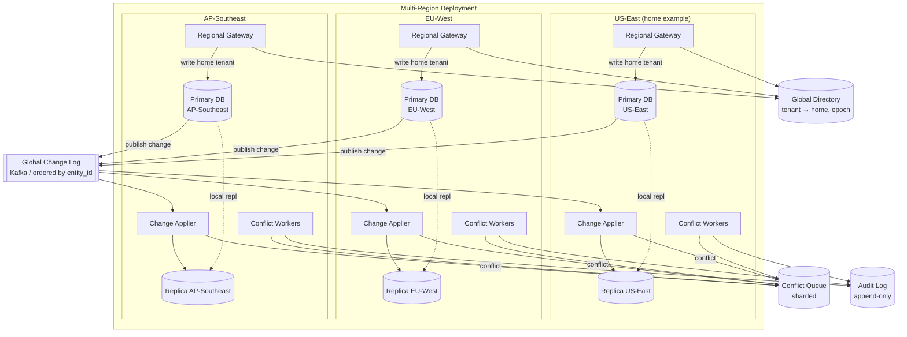

# System Design: Multi-Region Replication & Conflict Resolution

> **Focus areas:** Active-active vs primary-secondary · CRDTs / LWW / merge · Causality & vector clocks · Conflict queues · RPO/RTO · Partition tolerance  
> **Style:** End-to-end distributed data design with progressive scale (10× → 100× → 1,000×)  
> **Quality bar:** Interview-passable for senior/staff loops — explicit trade-offs, failure modes, and scale jumps

---

## Table of Contents

1. [Clarify Requirements (Interview Q&A)](#1-clarify-requirements-interview-qa)
2. [Back-of-the-Envelope Estimation](#2-back-of-the-envelope-estimation)
3. [High-Level Design](#3-high-level-design)
4. [Architecture Diagram](#4-architecture-diagram)
5. [Design Deep Dive](#5-design-deep-dive)
6. [Wrap-Up](#6-wrap-up)
7. [Deeper / Related Interview Questions](#7-deeper--related-interview-questions)

---

## 1. Clarify Requirements (Interview Q&A)

The goal of this phase is to **bound the problem**: what we build, what we defer, and at what scale we must succeed.

### 1.0 What this is / is not

| Dimension | This doc | Is not |
|-----------|----------|--------|
| Job | Design **multi-region data replication** with explicit **conflict detection and resolution** for a mutable entity store | A CDN-only static asset story or single-region HA |
| Scope | Write path routing, replication lag, merge semantics, conflict queues, DR failover | Full global strongly-consistent Spanner clone unless asked |
| Lens | CAP trade-offs, conflict domains, operability of merges | "CRDTs solve everything" without naming the datatype |
| Example domain | User profile + settings, shopping cart, collaborative doc metadata, inventory counters | Immutable event log only (simpler — append wins) |

### 1.1 Functional requirements

| # | Question to ask | Expected / typical interviewer answer | Design implication |
|---|-----------------|---------------------------|--------------------|
| F1 | What data is replicated? | Mutable documents/rows (profile, cart, prefs) with regional read latency needs | Per-entity merge policy required |
| F2 | Read pattern? | Mostly local reads in user's home region; occasional global admin | Regional replicas + routing |
| F3 | Write pattern? | User writes usually in home region; travel / failover may write elsewhere | Sticky home region default; conflict when multi-writer |
| F4 | Active-active or primary-secondary? | Often **primary-secondary per entity** with optional active-active for specific fields | Avoid naive multi-primary same row everywhere |
| F5 | Consistency expectation? | **Eventual** across regions (100ms–seconds); strong within region | Document staleness; read-your-writes in home cell |
| F6 | Conflict definition? | Two regions update same field before replication converges | Version vectors / LWW / application merge |
| F7 | Conflict resolution policy? | Product-specific: LWW for timestamp, merge for counters, human queue for financial | Pluggable resolver registry |
| F8 | Causality required? | "If A then B" ordering for related ops (comment on post) | Vector clocks or logical timestamps |
| F9 | Offline / mobile writes? | Queue locally, sync on reconnect — conflicts on sync | Same merge engine as multi-region |
| F10 | Delete vs tombstone? | Deletes must replicate; tombstones with TTL | Delete wins conflicts need careful rules |
| F11 | Failover behavior? | Promote secondary region; bounded RPO | Global directory updates; fence old primary |
| F12 | Conflict visibility? | Auto-resolve silent vs surface to user ("choose version") | Conflict queue + UI API |
| F13 | Audit / compliance? | Immutable audit log of conflicts and resolutions | Append-only conflict ledger |
| F14 | Schema evolution? | Fields added over time; old regions may lag schema | Versioned payloads; compatible merge |
| F15 | Idempotency? | Retries must not double-apply | Idempotency keys + dedupe at merge |

**MVP functional scope (lock this with interviewer):**

1. **Three regions** (us-east, eu-west, ap-southeast) with regional API gateways and regional DB replicas.
2. **Home-region primary per tenant** — writes routed to home; async replication to other regions.
3. **Entity-level version metadata** (`version`, `updated_at`, `origin_region`, optional `vector_clock`).
4. **Default conflict policy:** LWW on `updated_at` with tie-breaker `origin_region` lexicographic; **counter fields** use CRDT-style merge (max or sum with idempotency tokens).
5. **Conflict queue** for entities where LWW is unsafe (e.g., `shipping_address`) — store both versions, alert workflow, block auto-merge.
6. **Read APIs** serve local replica with `staleness_ms` header; optional `read_consistency=strong` routes to primary.
7. **Regional failover:** promote replica → update global directory → fence old primary (STONITH or epoch lease).
8. **Conflict audit log** append-only in each region + replicated.

**Out of MVP (explicitly defer):**

- Full active-active writes to same row from all regions simultaneously
- Automatic semantic merge for free-text documents (OT/CRDT editor — separate problem)
- Cross-table distributed transactions globally
- Customer-chosen consensus (Paxos teaching exercise only)
- Multi-cloud replication (single cloud multi-region default)
- Zero-RPO synchronous global quorum unless explicitly required

### 1.2 Non-functional requirements

| # | Question | Expected answer | Target |
|---|----------|-----------------|--------|
| N1 | Cross-region read latency? | Local | p99 < 20ms same region on replica |
| N2 | Cross-region write latency? | Async default | Ack from home primary p99 < 100ms; global visible p99 < 2s |
| N3 | RPO (data loss window)? | Tier-dependent | Default **< 5s async**; optional sync quorum region pair **RPO=0** |
| N4 | RTO (failover time)? | Minutes | **< 5 min** automated promote + directory flip |
| N5 | Availability? | Survive single region loss | 99.95% write path with failover |
| N6 | Durability? | No acked write loss in surviving regions | Quorum fsync at primary; replication ack before client ack optional |
| N7 | Conflict rate? | Low if home-region sticky | Design for **0.1–1%** multi-writer under partition/travel |
| N8 | Security? | Encryption in transit/at rest; no cross-tenant merge | Authz on entity; encrypt replication stream |
| N9 | Cost? | Cross-region egress $$$ | Compress replication; replicate deltas not full rows |
| N10 | Operability? | Detect lag, conflicts, split-brain | Dashboards: replication lag, conflict Q depth, epoch fencing |

### 1.3 Cases (User Flows & Edge Cases)

**Happy paths**

1. User in US updates profile nickname → US primary writes → replicates to EU/AP within 500ms → EU user reads eventual nickname.
2. Inventory decrement idempotent with `request_id` → replay from two regions → counter correct (deduped).
3. US-East region down → failover promotes US-West replica → directory routes tenant to West → writes resume RPO ≈ replication lag.
4. Traveler updates setting from EU while home US — LWW resolves with timestamp + region tie-break.
5. Admin views conflict queue → picks version A → resolution recorded in audit log → entity converged.

**Edge / failure cases**

| Case | Behavior |
|------|----------|
| Split brain (old primary not fenced) | **Epoch lease** — stale primary rejects writes with `409 PRIMARY_FENCED` |
| Same millisecond LWW tie | Tie-breaker `origin_region` or `uuid` of write |
| Concurrent counter increments | CRDT PN-counter or idempotent `request_id` sum |
| Delete vs update conflict | **Delete tombstone** with higher epoch wins; or product: undelete loses |
| Schema mismatch on replica | Merge uses field-level version; unknown fields preserved opaque |
| Replication backlog 10 min | Stale reads; throttle writes to region? optional; alert SRE |
| Conflict queue poison entity | DLQ after N failed merges; manual tool |
| Circular causality | Vector clock detects concurrent → not causally ordered → conflict |
| GDPR delete in EU while US updates | **Compliance wins** — delete propagates as tombstone with legal hold flag |
| Network partition EU↔US | Each side serves reads; writes to both if misconfigured → conflicts spike — **prevent** via single primary per entity |
| Duplicate replication message | Idempotent apply by `(entity_id, change_seq)` unique |
| Clock skew breaks LWW | Use **logical hybrid** (HLC) not wall clock alone |

### 1.4 Scales (Progressive)

| Metric | Baseline | 10× | 100× | 1,000× |
|--------|----------|-----|------|--------|
| Regions | 3 | 5 | 8 | 12+ |
| Total entities | 100M | 1B | 10B | 100B |
| Peak global write QPS | 5K | 50K | 500K | 5M |
| Peak global read QPS | 50K | 500K | 5M | 50M |
| Avg entity size | 2 KB | 2 KB | 3 KB | 4 KB |
| Replication bandwidth (peak) | 50 MB/s | 500 MB/s | 5 GB/s | 50 GB/s |
| Conflict events/day | 10K | 100K | 1M | 10M |
| Tenants | 10K | 100K | 1M | 10M |
| Failover events/year | 2 | 2 | 4 | 6 |

**Replication bandwidth math (baseline):**

```text
5K writes/s × 2 KB delta × 2 remote regions ≈ 20 MB/s payload
+ overhead 2.5× ≈ 50 MB/s cross-region egress
```

At **1,000×:**

```text
5M writes/s × 2 KB × 11 remote regions ≈ 110 TB/s theoretical — impossible on single stream
→ Must shard replication by tenant/entity partition; cell-local replication fanout; delta + compression → ~50 GB/s aggregate with batching (still needs cell architecture)
```

**What each jump forces:**

- **10×:** Dedicated replication pipeline (Kafka/CDC) decoupled from OLTP; conflict worker pool; per-tenant home region in directory.
- **100×:** **Cells** (region × shard) with single writer per entity; CRDT for hot counters; conflict queue sharded; avoid full-row cross-region fanout — replicate changelog only.
- **1,000×:** Edge caching; read-mostly fields CDN; write serialization via home cell; async global projections; selective active-active only for CRDT-native types.

### 1.5 Etc. (Constraints & Assumptions)

Ask and record:

- **CAP stance?** AP across regions (availability + partition tolerance), sacrifice global strong consistency.
- **Datastore?** Postgres/MySQL primary + logical replication, or Dynamo/Cassandra for native multi-region — design is pattern-level.
- **Traveling users?** Read local, write forwarded to home (latency hit) OR allow local write → conflicts — confirm product.
- **Financial/legal fields?** Never LWW — queue + human or strong consistency region pair.
- **Existing single-region?** Migration: assign home region; backfill replicas; enable replication lag monitors before cutover.

**Scope statement to repeat back:**

> Design **multi-region replication with conflict resolution** for a mutable entity store: **primary-secondary per entity/tenant home region**, async replication with **RPO ~ seconds**, **LWW + CRDT + conflict queue** policies, **vector/HLC causality** where needed, **failover with fencing**, starting at 3 regions / 5K write QPS / 100M entities, scaling to 1,000× via cells and changelog replication. Not building global Spanner unless expanded.

---

## 2. Back-of-the-Envelope Estimation

### 2.1 Write path

**Baseline peak write QPS:** 5,000 global (aggregate).

```text
US: 60% → 3K/s
EU: 25% → 1.25K/s
AP: 15% → 750/s
Each write replicated to 2 other regions → 5K × 2 = 10K replication messages/s
```

With batching (100 ms windows, 50 writes/batch):

```text
Effective replication messages ≈ 10K / 50 ≈ 200 batches/s per region-pair (manageable)
```

### 2.2 Replication bandwidth

```text
Delta size avg (changed fields only): ~400 bytes (20% of 2 KB row)
Uncompressed: 10K repl/s × 400 B ≈ 4 MB/s
Full row fallback 10%: + 10K × 0.1 × 2KB ≈ 2 MB/s
Total ~6 MB/s per region-pair × 3 pairs ≈ 18 MB/s (baseline)
Peak factor 3× → ~50 MB/s (matches §1.4)
```

Compression (zstd): **~3× reduction** → ~17 MB/s peak.

### 2.3 Storage

```text
100M entities × 2 KB ≈ 200 GB primary data per region (full copy)
+ version metadata ~64 B/entity ≈ 6.4 GB
+ tombstones 30d retention ~1% churn ≈ 2 GB
+ conflict queue snapshots ~0.01% × 2KB × 100M ≈ 20 GB worst case if neglected — bound queue TTL

Per region: ~210 GB active + backups/replicas
10B entities (100×): ~21 TB/region → shard into cells
```

### 2.4 Conflict queue volume

```text
0.1% conflict rate on 5K WPS peak → 5 conflicts/s → 432K/day
Avg conflict record 4 KB (two versions + metadata) → ~1.7 GB/day → ~50 GB/month
At 100×: 50 conflicts/s → need sharded queue + auto-resolve policies
```

### 2.5 Failover RPO

Async replication lag p99 target **2s**:

```text
RPO ≈ lag at failure instant — typically 0–5s if monitoring promotes when lag < threshold
Sync quorum subset (optional): RPO=0 for those tenants, +80ms write latency cross-region
```

### 2.6 Read path

50K read QPS baseline — served locally from regional replica.

```text
Replica lag p99 500ms → stale read acceptable for profile/cart
Strong read (primary forward): +50–150ms cross-region if user away from home — rate limit
```

### 2.7 Directory service

Global tenant → home region mapping:

```text
10K tenants × 200 B ≈ 2 MB — fits any strongly consistent small store (etcd/Dynamo global table)
100× tenants: 1M × 200B ≈ 200 MB — still fine; cache on gateway
```

### 2.8 Hybrid Logical Clock size

HLC timestamp: 64-bit physical + 16-bit logical + 16-bit region id ≈ **12 bytes** in version metadata — negligible vs payload.

---

## 3. High-Level Design

### 3.1 Replication topologies

| Topology | Write | Read | Conflicts | When |
|----------|-------|------|-----------|------|
| **Primary-secondary (per entity)** | Home only | Local replica | Low | Default MVP |
| **Active-passive DR** | One region all | DR stale | None until failover | Simple apps |
| **Multi-primary same row** | Any region | Local | **High** | Avoid unless CRDT-only |
| **Leaderless (Dynamo-style)** | Quorum | Quorum | LWW implicit | Known trade-offs |
| **Primary + CRDT overlay** | Home + CRDT fields | Local | Field-level | Counters, sets |

**Interview default:** **single primary per entity** (sticky home region) + async multi-region replicas. Active-active only for explicitly **commutative** data (counters, OR-Set tags).

### 3.2 Home region routing

```text
home_region(tenant_id) = hash(tenant_id) mod num_regions
  OR explicit assignment in Global Directory (enterprise data residency)
```

**Write path:**

1. Gateway resolves `tenant_id → home_region` + `primary_epoch`.
2. If request landed in non-home region: **forward** write to home (preferred) OR accept with conflict risk (discouraged).
3. Primary commits locally, publishes change to replication log.
4. Replicas apply in order per entity partition.

**Read path:**

1. Default: local replica.
2. `?consistency=strong`: proxy to home primary (traveling user setting change).

### 3.3 Change log (replication unit)

Append-only **change record**:

```json
{
  "change_id": "chg_01H...",
  "entity_id": "ent_123",
  "tenant_id": "tnt_1",
  "seq": 1842,
  "epoch": 7,
  "origin_region": "us-east",
  "hlc": { "physical": 1722950000123, "logical": 4 },
  "vector_clock": { "us-east": 1842, "eu-west": 1830, "ap-se": 1811 },
  "op": "patch",
  "fields": { "nickname": "Ada", "version": 42 },
  "idempotency_key": "idem_xyz",
  "prev_version": 41
}
```

| Field | Purpose |
|-------|---------|
| `epoch` | Fencing generation — bump on failover |
| `hlc` | Hybrid logical clock for LWW |
| `vector_clock` | Detect concurrent updates (optional per entity type) |
| `seq` | Per-entity monotonic apply order at primary |
| `idempotency_key` | Dedupe retries and cross-region replay |

Transport: Kafka / logical replication / Dynamo streams — **ordered per entity partition key**.

### 3.4 Conflict detection

On replica apply (or secondary apply if misrouted write):

```text
if incoming.prev_version != local.version:
  → concurrent or stale → CONFLICT
else:
  → apply patch, bump version
```

**Concurrent detection with vector clocks:**

```text
VC_incoming ∥ VC_local (neither dominates) → concurrent conflict
VC_incoming > VC_local → apply
VC_incoming < VC_local → drop stale
```

### 3.5 Resolution strategies (registry)

| Data type | Strategy | Auto? | Notes |
|-----------|----------|-------|-------|
| Scalar preference (theme) | LWW on HLC | Yes | Tie region id |
| Counter (views) | CRDT PN-counter / idempotent incr | Yes | Requires op id |
| Set (tags) | OR-Set CRDT | Yes | Add-wins; remove tombstone |
| Map (addresses) | **Conflict queue** | No | Human or policy |
| Money / inventory commit | **Strong primary or queue** | No | Never blind LWW |
| Delete | Tombstone epoch wins | Yes | Resurrection needs explicit op |

**LWW implementation:**

```python
def resolve_lww(a, b):
    if a.hlc > b.hlc: return a
    if b.hlc > a.hlc: return b
    if a.origin_region >= b.origin_region: return a  # deterministic tie
    return b
```

**CRDT counter (sketch):**

```text
Each increment carries unique request_id
Merged value = sum of unique request_ids seen (compact with Bloom + periodic GC for old ids)
Or use max-per-client counter if only monotonic per device
```

### 3.6 Conflict queue

When auto-resolve unsafe:

```text
conflict_record {
  entity_id, tenant_id,
  local_version_blob,
  remote_version_blob,
  detected_at, hlc,
  reason: "concurrent_patch:shipping_address",
  status: pending|resolved|expired,
  resolution: null | { chosen: "local"|"remote"|merged, actor, audit_id }
}
```

**Workflow:**

1. Apply side effects **paused** for conflicted field (or serve branched read — product choice).
2. Notify user or support queue.
3. On resolution, emit `resolution` change record → replicates → converges all regions.

Shard queue by `tenant_id`; SLA 24h auto-escalate.

### 3.7 Failover & fencing

**Epoch-based primary lease** (per tenant or per shard):

```text
Primary holds lease in Directory: (region, epoch, expires_at)
Renew every 5s, TTL 15s
On failover: increment epoch, assign new region, old primary lease revoked
Old primary checks epoch on every write → reject if stale
```

**STONITH optional:** isolate failed region network to prevent split brain.

**Promotion steps:**

1. Detect region failure (health + replication heartbeat loss).
2. Choose lag-min replica in target region.
3. `epoch++` in Directory (compare-and-swap).
4. Promote replica; drain replication from old region if split.
5. Gateways pick up new home routes.

### 3.8 Causality

**Hybrid Logical Clock (HLC):** preserves causality if single writer chain; detects concurrency across regions.

**Vector clock:** O(regions) size — fine for ≤12 regions; use for comment threads where "reply after post" must not reorder.

**Casual+ rule for related entities:**

```text
Post entity P then Comment C referencing P:
Comment write includes dep_vector(P.version)
Replica rejects C if P not yet applied — buffer until P arrives (dependency buffer)
```

Buffer TTL prevents deadlock on missing deps.

### 3.9 API surface

| Method | Path | Purpose |
|--------|------|---------|
| GET | `/v1/entities/{id}` | Read entity (`consistency` query param) |
| PATCH | `/v1/entities/{id}` | Update with `expected_version` |
| GET | `/v1/entities/{id}/conflicts` | List pending conflicts (owner) |
| POST | `/v1/conflicts/{id}/resolve` | Submit resolution |
| GET | `/v1/health/replication` | Admin lag by region pair |

**Optimistic concurrency:**

```http
PATCH /v1/entities/ent_123
If-Match: version/42
Idempotency-Key: idem_abc

{ "nickname": "Grace" }
```

Mismatch → `409 Conflict` with current body + vector clock — client merge or refresh.

### 3.10 Trade-off summary

| Choice | Pros | Cons |
|--------|------|------|
| Single primary per entity | Few conflicts, simpler | Cross-region write latency if forward |
| Active-active all regions | Local write latency | Conflict storm; merge complexity |
| Async replication | Low write latency, cheap | RPO > 0 |
| Sync cross-region quorum | RPO = 0 | Latency + partition unavailability |
| LWW | Simple auto | Loses data silently |
| CRDT | Strong math for commutative types | Not all fields composable |
| Conflict queue | Safe for human fields | Ops burden, user friction |

**Deal-breakers:**

- LWW on bank balance — reject.
- No fencing on failover — split brain guaranteed.
- Full row replication without idempotency — duplicates on retry.
- Global synchronous 3PC on every write — latency and fragility.

---

## 4. Architecture Diagram



**Write flow (tenant home = US-East, client in EU):**

1. EU gateway looks up Directory → home US-East epoch 7.
2. Forward PATCH to US-East primary (or client directly hits US — product).
3. US primary validates `If-Match`, commits, publishes to change log.
4. EU applier consumes log, applies to EU replica — entity updated locally ~500ms later.

**Failover flow:**

1. US-East unhealthy 2 min → automation CAS Directory epoch 7→8, home → US-West promoted primary.
2. US-East isolated primary sees epoch 8 on retry → stops writes (`PRIMARY_FENCED`).
3. Gateways refresh Directory cache → writes go to US-West.

---

## 5. Design Deep Dive

### 5.1 Reliability

#### 5.1.1 Durability & RPO

**Primary local commit:**

- `fsync` or cloud equivalent before ack (single-region durability).

**Replication ack policy:**

| Policy | Client ack when | RPO |
|--------|-----------------|-----|
| Async (default) | Primary committed | Lag seconds |
| Semi-sync | Primary + 1 remote ack | Lower lag |
| Sync quorum | Majority regions | ~0 |

MVP: async + monitor lag; financial tenants optional sync pair.

#### 5.1.2 Idempotent apply

Replication consumer stores `(entity_id, change_id)` dedupe table (or Bloom + disk).

```text
ON apply(change):
  IF change_id seen: ACK skip
  ELIF merge succeeds: record change_id, ACK
  ELIF conflict: enqueue, ACK (don't block log)
```

At-least-once delivery → **effectively-once apply**.

#### 5.1.3 Retries & ordering

Per-entity partition guarantees order — applier single-threaded per entity or lightweight locking.

Out-of-order rare if single partition — buffer by `seq` with small watermark.

#### 5.1.4 Split-brain prevention

| Mechanism | Detail |
|-----------|--------|
| Epoch lease | Directory CAS bump on failover |
| Write fencing | Primary tags writes with epoch; replicas reject old epoch |
| STONITH | Network isolate dead region in extreme cases |
| Read-only degraded mode | If directory unreachable, prefer read-only over dual-write |

#### 5.1.5 Backpressure

Replication lag > 30s:

- Alert SRE
- Optional: throttle non-home writes (rare)
- Scale applier consumers (preserve per-entity order via key partition)

Conflict queue depth > 10K:

- Scale conflict workers
- Auto-resolve expand policies for safe types only

#### 5.1.6 Rate limits

Per-tenant write QPS cap prevents conflict queue flooding during attacks.

### 5.2 Scalability

#### 5.2.1 Cell architecture (100×+)

```text
Cell = region × shard (e.g., us-east-shard-04)
Tenant assigned to exactly one cell = home
Replicas copy changelog globally but apply only relevant tenant shards
```

Avoids N_regions full database copies applying unrelated traffic.

#### 5.2.2 Sharding

**Shard key:** `tenant_id` or `entity_id` hash.

Co-locate entity primary with tenant home minimizes cross-shard transactions.

#### 5.2.3 Delta replication

Replicate **field-level JSON patch** not full row:

```text
Avg delta 400 B vs row 2 KB → 5× bandwidth savings
Use binary protocol (Protobuf/Avro) at 100×
```

Periodic full snapshot reconciliation (weekly) heals missed patches.

#### 5.2.4 CRDT storage compaction

PN-counter request_id set grows — compact:

- Window last 7 days ids in precise set
- Older ids folded into periodic snapshot value + GC

OR-Set tombstones TTL after global apply confirmed.

#### 5.2.5 Conflict queue scaling

Shard by `tenant_id`; partition Kafka topic `conflicts-{shard}`.

Auto-resolve workers horizontally scaled; **human queue** single assignee per conflict to avoid double resolution (DB row lock).

#### 5.2.6 Read scaling

Regional replicas + read pools; no cross-region read on hot path.

CDN edge cache for **public** read-mostly facets (avatar URL) — not mutable merge fields.

#### 5.2.7 Multi-region Kafka

MirrorMaker / cluster linking; topic per region pair with offset lag alerts.

At 1,000×: cell-local logs + aggregated global bus for DR projections only.

### 5.3 Maintainability

#### 5.3.1 Observability

| Metric | Alert |
|--------|-------|
| `replication_lag_ms{region_pair}` | p99 > 5000 |
| `conflict_rate` | > 1% of writes 5 min |
| `conflict_queue_age` | p99 > 1 hour |
| `apply_errors` | > 0 sustained |
| `epoch_fence_rejects` | spike after failover (expected) then zero |
| `directory_staleness` | gateway cache > 30s old during failover |

Distributed traces: tag `entity_id`, `tenant_id`, `change_id`, `origin_region`, `resolution_policy`.

#### 5.3.2 Runbooks

| Scenario | Steps |
|----------|-------|
| Region degradation | Shift read traffic; prepare promote if primary unhealthy |
| Promote replica | CAS epoch; verify fence; check lag; smoke write |
| Conflict backlog | Scale workers; identify hot entity types; temporary read-only |
| Schema migration | Expand contract; dual-write fields; replicate schema version |

#### 5.3.3 Policy configuration

Tenant-level config:

```yaml
entity_types:
  user_profile:
    fields:
      nickname: { strategy: lww }
      theme: { strategy: lww }
      shipping_address: { strategy: manual_queue }
  cart:
    fields:
      item_count: { strategy: crdt_counter }
```

Store in Directory or config service; hot-reload appliers.

#### 5.3.4 Testing

- **Jepsen-style** partition tests: never lose acked writes on surviving quorum.
- Property tests: CRDT merge commutative/associative/idempotent.
- Failover game days quarterly.
- Chaos: kill applier, verify lag recovery without dup apply.

#### 5.3.5 Migration from single-region

1. Assign all tenants home = current region.
2. Stand up empty replicas; backfill snapshot + catch-up CDC.
3. Enable async apply read-only in new regions.
4. Switch reads local; forward writes still single primary.
5. Enable failover runbook; do not enable multi-primary yet.

---

## 6. Wrap-Up

### 6.1 What we designed

**Multi-region mutable entity replication** with **home-region primary per tenant**, **async changelog fanout**, **HLC/LWW and CRDT field policies**, **conflict queue** for unsafe merges, **epoch fencing** on failover, **global directory** for routing, and **audit trail** of resolutions — starting 3 regions / 5K WPS, scaling via cells and delta replication to 1,000×.

### 6.2 Key decisions worth defending

1. **Not naive active-active** on whole rows — conflicts explode; use primary + CRDT islands.
2. **Entity-level home region** — minimizes concurrent writes; data residency friendly.
3. **Changelog replication** decoupled from OLTP — replay, idempotent apply, backpressure.
4. **Pluggable merge registry** — LWW for safe scalars, CRDT for counters/sets, queue for addresses/money.
5. **HLC over wall clock** for LWW — handles skew better than `updated_at` alone.
6. **Epoch fencing** — non-negotiable for failover correctness.
7. **Conflict is first-class** — detect, record, resolve, audit — not silent data loss.
8. **Async default RPO ~ seconds** — sync quorum only for tenants who pay latency.
9. **Vector clocks where causality matters** — comments, dependencies — not everywhere (size).
10. **Delta + compress replication** — cross-region egress is a real bill.

### 6.3 Phased rollout

| Phase | Deliver | Validate |
|-------|---------|----------|
| MVP | Single home primary, 3 async replicas, LWW, directory | Failover drill RTO < 5 min |
| Phase 2 | Conflict queue + CRDT counters + audit | Inject concurrent writes — merge correct |
| 10× | CDC pipeline, sharded appliers, HLC | Lag p99 < 2s at 50K WPS |
| 100× | Cells, field policies in config, queue sharding | Conflict SLA < 1h auto |
| 1,000× | Selective edge cache, sync quorum tier, compaction | Region loss game day |

### 6.4 Risks

| Risk | Mitigation |
|------|------------|
| Split brain | Epoch + fence + runbooks |
| LWW silent loss | Restrict to safe fields; metrics on overridden values |
| CRDT memory blowup | Snapshot + GC request ids |
| Dependency buffer deadlock | TTL + alert |
| Compliance delete vs update | Legal tombstone priority rule |

### 6.5 45-minute interview timeline

1. Clarify CAP + conflict domains (8 min)
2. Topology: primary vs active-active (7 min)
3. Change log + apply + idempotency (8 min)
4. Merge policies + conflict queue example (10 min)
5. Failover fencing diagram (7 min)
6. Scale + bandwidth numbers (5 min)

---

## 7. Deeper / Related Interview Questions

### 7.1 CAP & consistency

**Q: CAP theorem — pick two?**  
A: During partition, choose **AP** (availability + partition tolerance) for cross-region consumer profiles — sacrifice **global strong consistency**. Within home region, still **strong** on primary. Clarify CAP applies during failure, not steady state.

**Q: vs Spanner / Cockroach global strong?**  
A: TrueTime + synchronized clocks + Paxos per range → higher latency/cost; different product tier. This design is **explicit eventual** with merge semantics.

**Q: Linearizable global reads?**  
A: Expensive — route to primary or RSP-style quorum read; not default.

### 7.2 Active-active vs primary-secondary

**Q: When true active-active?**  
A: When data is **commutative** (CRDT counters, OR-Set), or sessions sticky to disjoint key spaces (users rarely collide). Whole-document active-active without CRDT → conflict pain.

**Q: Dynamo "always writable"?**  
A: Leaderless quorum writes + LWW on read repair — conflicts become **semantic** at read time; know the reconciliation cost.

**Q: Write forwarding vs local write?**  
A: Forwarding: +RTT, zero conflict. Local write multi-primary: low latency, **merge required**. Default forward for scalar documents.

### 7.3 LWW pitfalls

**Q: Last writer wins loses data — example?**  
A: US sets `{phone: A}`, EU sets `{email: B}` concurrently — blind LWW keeps whole doc one side — other field lost. Fix: **field-level LWW** or CRDT map.

**Q: Clock skew?**  
A: Pure wall clock LWW wrong — use **HLC** or logical counters per region.

**Q: Tie same timestamp?**  
A: Deterministic tie-breaker (`origin_region`, `change_id`) — never random.

### 7.4 CRDTs

**Q: Which CRDT for counter?**  
A: **PN-counter** if inc/dec; **G-counter** if inc only; always idempotent `request_id` for replay safety.

**Q: OR-Set?**  
A: Add-wins set; removes tombstone elements; good for tags — explain add/remove semantics.

**Q: CRDT for JSON document?**  
A: Generic JSON CRDT exists (LSEQ for lists) — heavy. Prefer schema-aware field CRDTs or OT for collaborative editors — separate interview.

**Q: CRDT storage growth?**  
A: Metadata per op — need compaction/snapshotting.

### 7.5 Vector clocks & causality

**Q: Vector clock size?**  
A: O(num_regions) — 12 regions × 8 bytes = 96 bytes — OK per entity version.

**Q: Difference vector clock vs version vector?**  
A: Version vector tracks replicas; vector clock tracks causality across writers — interviewers often conflate; be precise.

**Q: Happens-before across services?**  
A: Propagate context in change metadata; buffer dependent applies until prerequisite version applied.

### 7.6 Conflict queues

**Q: Auto vs manual resolution?**  
A: Auto when policy proven commutative or LWW-safe field-level; manual for legal, shipping, money, irreconcilable semantic clash.

**Q: User sees two versions?**  
A: Product UX: pick A/B merge UI; backend stores resolution record replicating outward.

**Q: Queue backlog SLA?**  
A: Tiered — P0 financial blocks transaction; P2 profile field 24h auto LWW fallback if business accepts.

### 7.7 Failover & DR

**Q: RPO vs RTO definitions?**  
A: RPO = max data loss window; RTO = max downtime. Async replication RPO ≈ lag; RTO ≈ detect + promote + directory propagate.

**Q: Split brain story?**  
A: Two primaries accept writes → divergent histories — **epoch fencing** prevents; without it, manual merge hell.

**Q: Brain split during network partition?**  
A: Prefer **one side writable** via lease majority in Directory (etcd/consul); minority read-only.

**Q: Cascading failover?**  
A: Avoid flapping — hysteresis, manual confirmation for repeated promotes.

### 7.8 Replication mechanics

**Q: Kafka vs DB logical replication?**  
A: Logical repl tight coupling, simpler ops; Kafka decouples consumers (search, analytics, regional appliers), better backpressure — prefer Kafka at scale.

**Q: Ordering guarantees?**  
A: Per-partition order only — partition by `entity_id`.

**Q: Exactly-once replication?**  
A: End-to-end exactly-once rare — **idempotent apply** achieves effective once.

### 7.9 Deletes & tombstones

**Q: Delete vs update conflict?**  
A: Tombstone with higher epoch/HLC wins; resurrect requires explicit undelete op acknowledged.

**Q: Tombstone retention?**  
A: Until all regions GC + grace window (30d) — otherwise deleted entity reappears from stale replica.

### 7.10 Security & compliance

**Q: Encrypt replication?**  
A: TLS in transit; KMS at rest; tenant keys for regulated data.

**Q: GDPR erasure multi-region?**  
A: Propagate delete tombstone; verify all replicas + backups cycle; conflict policy: **delete overrides**.

**Q: Data residency?**  
A: Directory pins tenant home EU — replication to US disallowed — **regional cells** not global copy.

### 7.11 Performance numbers

**Q: Cross-region RTT impact?**  
A: US↔EU ~70–120ms — sync quorum adds to write path; async hides from writer ack.

**Q: Bandwidth at 500K WPS?**  
A: Rough: 500K × 400B delta × 2 regions ≈ 400 GB/s uncompressed — must cell-shard and compress — shows why 1,000× needs architecture change.

### 7.12 Dynamo / Cassandra angles

**Q: Hinted handoff?**  
A: Temporary write buffer when node down — risk if hints replay out of order — tie with CRDT/LWW.

**Q: Read repair?**  
A: Background reconcile divergent replicas — triggers merge function.

### 7.13 Postgres-specific

**Q: Logical replication conflict?**  
A: Postgres logical repl can error on conflict — use apply workers with merge logic outside, or treat as source only.

**Q: Foreign keys cross region?**  
A: Avoid — entity references by id only; async FK validation.

### 7.14 Testing & ops traps

**Q: How test merge correctness?**  
A: Property-based: ∀ a,b: merge(a,b) = merge(b,a) for CRDTs; simulate partition with Jepsen.

**Q: Metric for silent LWW loss?**  
A: Compare field-level audit diff count; shadow dual-write canary.

### 7.15 Related patterns

| Pattern | Relation |
|---------|----------|
| Event sourcing | Changelog is event-like; snapshots for read models |
| Saga | Multi-entity consistency without global TX |
| Calvin | Ordered global log — strong but latency |
| Operational transform | Collaborative text — not generic CRDT doc |

### 7.16 Quick trap list (rapid fire)

1. **"Use CRDT for shopping cart prices"** — No — money needs primary authoritative or queue.  
2. **"Active-active everywhere for latency"** — Conflicts unless commutative.  
3. **"RPO zero with async repl"** — Contradiction.  
4. **"Vector clocks everywhere"** — Overhead; use where needed.  
5. **"Skip tombstones"** — Zombie records return.  
6. **"Merge in client only"** — Malicious/stale clients corrupt — server authoritative merge.  
7. **"Directory eventually consistent OK for writes"** — Dual primary risk — writes need fresh epoch.  
8. **"Conflict-free replicated JSON"** — Marketing; know limitations.  
9. **"Geo-DNS alone fixes multi-region"** — Doesn't solve writes/conflicts.  
10. **"Backup replaces replication"** — RPO hours; not live DR.

### 7.17 Algorithms & DS recap

| Structure | Use |
|-----------|-----|
| Merkle tree | Reconcile divergent replicas efficiently |
| Bloom filter | Dedupe replication ids compactly |
| HLC | Timestamp with causality bound |
| OR-Set / PN-counter | CRDT merge |
| Conflict DAG | Audit history of resolutions |

### 7.18 Memory / storage trade-offs

Keep hot entity working set in regional memory cache — **invalidate on applied change seq**, not TTL-only, to prevent stale reads beyond SLO.

Full entity history for audit: cold storage; OLTP keeps current + recent versions only.

---

## Appendix A — Example Entity Row

```sql
CREATE TABLE entities (
  id              UUID PRIMARY KEY,
  tenant_id       UUID NOT NULL,
  home_region     TEXT NOT NULL,
  epoch           INT NOT NULL DEFAULT 1,
  version         BIGINT NOT NULL DEFAULT 0,
  hlc_physical    BIGINT NOT NULL,
  hlc_logical     INT NOT NULL,
  vector_clock    JSONB NOT NULL DEFAULT '{}',
  payload         JSONB NOT NULL,
  deleted         BOOLEAN NOT NULL DEFAULT FALSE,
  updated_at      TIMESTAMPTZ NOT NULL DEFAULT now()
);

CREATE TABLE applied_changes (
  entity_id   UUID NOT NULL,
  change_id   TEXT NOT NULL,
  applied_at  TIMESTAMPTZ NOT NULL DEFAULT now(),
  PRIMARY KEY (entity_id, change_id)
);

CREATE TABLE conflict_queue (
  id              UUID PRIMARY KEY,
  tenant_id       UUID NOT NULL,
  entity_id       UUID NOT NULL,
  local_blob      JSONB NOT NULL,
  remote_blob     JSONB NOT NULL,
  policy          TEXT NOT NULL,
  status          TEXT NOT NULL DEFAULT 'pending',
  detected_hlc    JSONB NOT NULL,
  resolved_at     TIMESTAMPTZ,
  resolution      JSONB
);
```

## Appendix B — Merge Policy Decision Tree

```text
Is field commutative under concurrent ops?
  YES → CRDT (counter/set/register)
  NO → Is semantic merge defined?
         YES → Application merge function
         NO → Is data loss acceptable?
                YES → Field-level LWW with HLC
                NO → Conflict queue (+ block field)
```

## Appendix C — Failover Checklist

1. Confirm primary region hard-down (not transient).
2. Verify replica lag < RPO budget.
3. CAS increment epoch in Directory.
4. Promote replica; run smoke tests.
5. Invalidate gateway directory caches (< 30s propagation).
6. Monitor fence rejects on old primary.
7. Post-incident: reconcile conflict queue spike.

---

*Slug: `multi-region-replication-conflict-resolution` · Always name the conflict domain and never apply LWW to balances, inventory commits, or legal holds without explicit acceptance.*


## Appendix D — Change batch wire format (illustrative)

```json
{
  "batch_id": "b_...",
  "source_region": "us-east-1",
  "shard": 17,
  "from_watermark": "w_1000",
  "to_watermark": "w_1100",
  "compression": "zstd",
  "changes": [
    {
      "change_id": "c_...",
      "entity_type": "user_prefs",
      "entity_id": "u_1",
      "op": "UPSERT",
      "hlc": {"wall": 1690000000123, "logical": 4},
      "vv": {"us-east-1": 9, "eu-west-1": 3},
      "payload": {"theme": "dark"}
    }
  ],
  "checksum": "sha256:..."
}
```

## Appendix E — Policy decision tree (interview whiteboard)

```text
Is entity monetary / inventory / authz?
  YES → SINGLE-home only; reject multi-writer
  NO  → Are operations commutative/idempotent mergeable?
          YES → CRDT / op-based merge
          NO  → Is lost update acceptable?
                  YES → LWW(HLC)
                  NO  → Conflict queue (+ optional user merge)
```

## Appendix F — Lag SLO burn example

```text
SLO: cross-region apply lag p95 < 5s over 28 days
Error budget: 1% of intervals above threshold
Page: 5% budget burn in 1h (fast burn)
Ticket: 20% burn in 6h (slow burn)
During catch-up after outage: declare degraded mode; do not hide lag.
```

## Appendix G — Worked WAN math at 100×

```text
Write QPS global: 5M
Ship fraction (remote interest): ~80% of changes need ≥1 remote
Avg compressed change: 300 B
WAN ≈ 5e6 × 0.8 × 300 ≈ 1.2 GB/s aggregate across pairs
With 5 regions mesh worst-case pairs dominate → prefer hub/overlay
Hub design: each spoke ships 5e6/5 ≈ 1M/s to hub compressed ≈ 300 MB/s per spoke
```

## Appendix H — Entity-type cheat sheet

| Type | Mode | Policy | Notes |
|------|------|--------|-------|
| Ledger balance | SINGLE | n/a | Home cell sacred |
| Cart lines | MULTI | OR-set / merge | Concurrent devices |
| Feature flag targeting | SINGLE | n/a | Config control plane |
| Click counter | MULTI | G-counter | Analytics-ish |
| Profile display name | MULTI | LWW | Low stakes |
| ACL bind | SINGLE or QUEUE | Never silent LWW | Security review |

## Appendix I — Common interviewer traps (short)

1. Using NTP wall clock as sole conflict decider.  
2. Active-active “for everything” without entity taxonomy.  
3. Failover without epoch fencing.  
4. Ignoring tombstone GC vs offline replicas.  
5. Promising 0 RPO with async replication.  
6. Global 2PC as the first architecture.  
7. Unbounded conflict queues as “human will fix”.  
