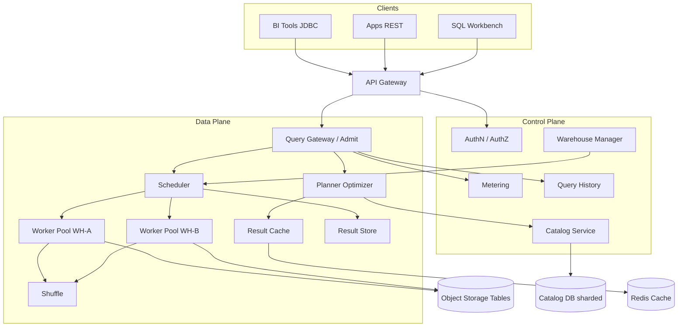
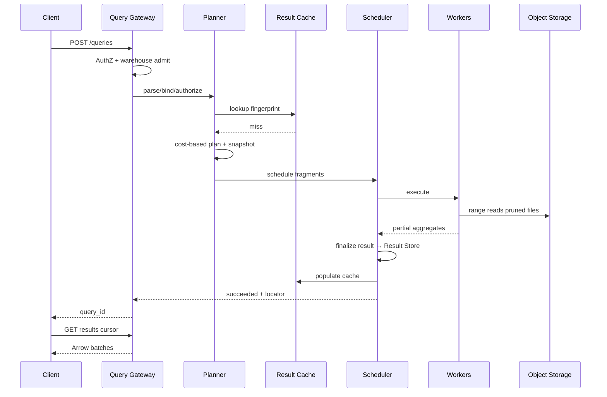

# System Design: Multi-Tenant Interactive Analytics Platform

> **Focus areas:** Tenant isolation · Fair scheduling · Interactive SQL latency · Result caching · Warehouses/warehouses pools · Concurrency control · Cost attribution  
> **Style:** End-to-end product design with progressive scale (10× → 100× → 1,000×)  
> **Interview theme:** Snowflake / BigQuery / Redshift Serverless–style shared SaaS analytics

---

## Table of Contents

1. [Clarify Requirements (Interview Q&A)](#1-clarify-requirements-interview-qa)
2. [Back-of-the-Envelope Estimation](#2-back-of-the-envelope-estimation)
3. [High-Level Design](#3-high-level-design)
4. [Architecture Diagram](#4-architecture-diagram)
5. [Design Deep Dive](#5-design-deep-dive)
6. [Wrap-Up](#6-wrap-up)
7. [Deeper / Related Interview Questions](#7-deeper--related-interview-questions)

---

## 1. Clarify Requirements (Interview Q&A)

The goal is to **bound a SaaS interactive analytics platform**: many tenants submit SQL / dashboards against warehouse-scale data, expecting seconds-level latency, isolation from noisy neighbors, and predictable billing.

### 1.0 What this is / is not

| This is | This is not |
|---------|-------------|
| Multi-tenant **interactive** SQL / BI platform (dashboards, ad-hoc queries) | Single-tenant on-prem Hadoop cluster ops guide |
| Shared control plane + elastic compute pools with isolation | Pure batch ETL scheduler (Airflow) |
| Query admission, caching, result sets, warehouses | OLTP transactional database |
| Tenant quotas, fair scheduling, cost attribution | Real-time sub-10ms metrics TSDB |

### 1.1 Functional Requirements

| # | Question to ask | Expected / typical interviewer answer | Design implication |
|---|-----------------|----------------------------------------|--------------------|
| F1 | Who are the users? | Analysts, BI tools (Tableau/Looker), apps via JDBC/REST; many orgs on one platform | Multi-tenant authz on every query; session + warehouse notions |
| F2 | Query types? | Interactive SELECT-heavy; some ETL DML/DDL; materialized views | Separate interactive vs batch queues; different SLOs |
| F3 | Latency target? | Dashboard tiles p95 **&lt; 5–15s**; ad-hoc minutes OK with progress | Result cache, local SSD cache, warehouse warm pools |
| F4 | Data ownership? | Tenant-owned tables in cloud object storage; platform manages metadata | Catalog per tenant/account; storage credentials scoped |
| F5 | Isolation model? | Soft isolation by default; dedicated warehouses for enterprises | Virtual warehouse = compute unit; resource groups |
| F6 | Concurrency? | Tens–hundreds concurrent queries per large tenant | Admission control + spill + query queue |
| F7 | Result handling? | Stream / paginate large results; download CSV/Parquet | Result store in object storage; cursors |
| F8 | Caching? | Result cache + metadata/plan cache; optional data cache on local disk | Invalidate on table version change |
| F9 | Security? | RBAC/ABAC, column/row policies, private networking, encryption | Policy engine in planning path; never trust client filters |
| F10 | Billing? | Credits by warehouse-seconds + storage + cloud egress | Meter every second of warehouse uptime + query attributes |
| F11 | Cross-tenant data? | No by default; optional data sharing marketplace later | Hard tenancy boundary in catalog + storage paths |
| F12 | Multi-cloud / multi-region? | Region-local accounts; DR later | Cell = cloud+region; account pinned |
| F13 | Semi-structured? | JSON/VARIANT columns common | Vectorized execution + columnar encoding |
| F14 | Streaming ingest? | Nice-to-have; Snowpipe-like continuous load | Decouple ingest from interactive warehouses |

**MVP functional scope:**

1. Account → users/roles → databases/schemas/tables catalog.
2. Create/resume/suspend **virtual warehouses** (size T-shirt).
3. Submit SQL via REST / JDBC; return progress + result cursor.
4. Interactive query planner + distributed execution over Parquet/columnar files.
5. Result cache keyed by (account, role, warehouse settings?, query text hash, table versions).
6. Quotas: concurrent queries, warehouse credits/day, result size.
7. Basic RBAC; audit log of queries (metadata, not full result).
8. Per-tenant cost metering (warehouse-seconds).

**Out of MVP (explicitly defer):**

- Cross-region active-active same account
- Marketplace data sharing / clean rooms
- Unrestricted Python UDF sandbox at scale
- Perfect OLTP MERGE at millions QPS
- Auto-ML / notebook product surface

### 1.2 Non-Functional Requirements

| # | Question | Expected answer | Target |
|---|----------|-----------------|--------|
| N1 | Interactive latency | Dashboard feels usable | p50 &lt; 2s cached; p95 &lt; 15s uncached small scans |
| N2 | Availability | Control plane critical | 99.9% API; warehouses best-effort resume |
| N3 | Durability | Table data in object store | 11-nines class object storage; catalog HA |
| N4 | Consistency | Read committed / snapshot isolation for queries | Snapshot at query start (MVCC table versions) |
| N5 | Isolation | Noisy neighbor contained | Soft cgroups + hard warehouse ceilings; dedicated option |
| N6 | Multi-region | Account regional | Failover DR with RPO minutes–hours for catalog |
| N7 | Security | Enterprise SaaS bar | TLS, CMEK option, private link, row/column policies |
| N8 | Cost | Elastic; suspend idle warehouses | Auto-suspend 60s–10m; scale-to-zero |

### 1.3 Cases (User Flows & Edge Cases)

**Happy paths**

1. Analyst opens warehouse → runs dashboard SQL → result cache hit → &lt;1s.
2. Cache miss → planner prunes partitions → workers scan → spill to disk if needed → result pages.
3. Admin resizes warehouse XL → more workers; queued queries drain.
4. Idle 5 minutes → warehouse suspends; next query auto-resumes (cold start + few seconds).
5. ETL warehouse runs MERGE overnight without starving BI warehouse.

**Edge / failure cases**

| Case | Behavior |
|------|----------|
| One tenant `SELECT *` huge table | Admission limit scan bytes; kill at byte/time quota; charge credits |
| 10K concurrent tiny queries | Queue + result cache; warehouse multi-cluster auto-scale |
| Catalog unavailable | Fail new queries; in-flight may finish if plan already shipped |
| Object store throttle | Backoff; adaptive concurrency; notify as `503`/`RESOURCE_EXHAUSTED` |
| Warehouse OOM | Spill to local SSD then object spill; then kill query with clear error |
| Schema change mid-dashboard | Snapshot isolation: query sees consistent version; next query sees new |
| Credential leak attempt | Scoped short-lived storage tokens; no long-lived keys in workers |
| Result &gt; 1GB | Spill to result store; client paginates; optional async export job |
| Suspend during query | Block suspend until queries drain or force-cancel with policy |
| Cross-tenant path probe | Catalog + storage prefix enforce; deny before IO |

### 1.4 Scales (Progressive)

| Metric | Baseline | 10× | 100× | 1,000× |
|--------|----------|-----|------|--------|
| Paying accounts (tenants) | 1K | 10K | 100K | 1M |
| Active warehouses (peak) | 2K | 20K | 200K | 2M |
| Queries / day | 50M | 500M | 5B | 50B |
| Peak query admit QPS | 5K | 50K | 500K | 5M |
| Concurrent running queries | 20K | 200K | 2M | 20M |
| Data under management | 10 PB | 100 PB | 1 EB | 10 EB |
| Avg scanned / query (uncached) | 5 GB | 5 GB | 2–10 GB | 2–10 GB |
| Result cache hit rate (BI) | 40% | 50% | 60% | 60%+ |
| Control-plane QPS | 2K | 20K | 200K | 2M |

**What each jump forces:**

- **10×:** Separate control plane (catalog, auth, warehouse manager) from data plane; Redis/Memcached result metadata; warehouse autosuspend critical for cost.
- **100×:** Cell architecture by cloud region; shard catalog by account_id; multi-cluster warehouses; global admission + local schedulers; query history in append-only store not OLTP.
- **1,000×:** Soft multi-tenancy on shared worker fleets with strong isolation + dedicated hosts for whales; hierarchical fair queues; metadata CDN; storage request coalescing; per-cell capacity markets.

### 1.5 Etc. (Constraints & Assumptions)

- **Cloud object storage** is the durable data plane (S3/GCS/Azure Blob).
- **Columnar formats** (Parquet/ORC) + open table format optional (Iceberg/Delta)—platform may abstract.
- **Interactive ≠ infinite:** hard query timeouts (e.g. 2h) and scanned-byte caps.
- **JDBC/ODBC + REST + Arrow Flight** as client protocols over time.
- **Billing SoT** is metering service, not warehouse local counters alone.

**Scope statement to repeat back:**

> Design a multi-tenant interactive analytics SaaS: accounts own data in object storage; virtual warehouses provide elastic compute; the platform provides catalog, SQL planning/execution, result caching, fair admission, and credit-based billing. Start at ~1K tenants / 50M queries/day and evolve to 1,000× with regional cells and hard isolation for large tenants.

---

## 2. Back-of-the-Envelope Estimation

### 2.1 Query QPS

```text
Baseline: 50M queries/day
  ≈ 50e6 / 86400 ≈ 580 QPS average
  Peak factor 8–10× → ~5K admit QPS

1,000×: ~5M admit QPS peak  ← control plane + scheduler must shard
```

Many “queries” are cache hits that never start workers:

```text
Assume 50% result-cache hit at scale
Worker-dispatch QPS ≈ 0.5 × admit QPS
```

### 2.2 Scan bandwidth

```text
Baseline concurrent queries 20K
Assume 30% actively scanning, avg 200 MB/s effective / query
→ Aggregate scan ≈ 20K × 0.3 × 0.2 GB/s ≈ 1.2 TB/s peak platform-wide

1,000× → order of PB/s  ← impossible as one cluster; must be regional cells + locality
```

Interview takeaway: **never design one global shared scan fabric.**

### 2.3 Warehouse fleet

```text
Baseline 2K active warehouses
Avg size M = 8 nodes × 64 vCPU → ~1M vCPU if all awake (ruinous)

With 70% suspended at any time:
  Awake ≈ 600 warehouses × 8 × 64 ≈ 300K vCPU peak — still huge; right-size assumptions:

More realistic mix:
  80% XS/S (2–4 nodes), 15% M, 5% L+
  Effective awake nodes ≈ 5K–15K at baseline SaaS
```

**Auto-suspend** is an economic feature, not a nice-to-have.

### 2.4 Result storage & cache

```text
Avg result payload retained: 2 MB (many tiny; few large)
50M queries × 20% materialize lasting results × 2 MB ≈ 20 TB/day raw
TTL 24h → ~20 TB steady result store (+ compression → ~5–8 TB)

Result cache index entries: ~100–300 bytes × hot set 100M → tens of GB in Redis cluster
```

### 2.5 Catalog / metadata

```text
1K accounts × 5K tables × 50 partitions metadata ≈ 250M partition records
Record ~500 bytes → ~125 GB metadata
100× accounts → multi-TB catalog → shard by account_id; partition stats in LSM/object
```

### 2.6 Hot keys / noisy neighbors

| Hotspot | Symptom | Mitigation |
|---------|---------|------------|
| Popular dimension table | All tenants read same public share | Cache at edge + dedicated cache nodes |
| One dashboard refresh storm | 10K identical SQL | Result cache + request coalescing |
| Single XL warehouse | Starves shared disk/net | Dedicated hosts / placement group |
| Catalog table listing | UI storms | CDN + etag + pagination |

### 2.7 Memory (coordinator)

```text
Per in-flight query coordinator state: 1–5 MB
20K concurrent → 20–100 GB across coordinator fleet
1,000× → shard coordinators by account hash; no single global coordinator
```

---

## 3. High-Level Design

### 3.1 Core concepts

```text
Cloud Region Cell
  └── Account (tenant)
        ├── Users / Roles / Grants
        ├── Databases → Schemas → Tables / Views / Stages
        ├── Virtual Warehouses (compute)
        │     ├── Size (XS…4XL), auto-suspend, auto-resume
        │     ├── Multi-cluster (0..N clusters for concurrency)
        │     └── Resource monitors (credit caps)
        ├── Sessions / Queries
        └── Stages / Result sets
```

**Virtual Warehouse** = named elastic compute pool. Queries specify `USE WAREHOUSE`. Isolation boundary for CPU/mem/spill disks. Billing unit.

### 3.2 API surface

| Method | Path | Purpose |
|--------|------|---------|
| POST | `/sessions` | Auth, create session (role, warehouse) |
| POST | `/queries` | Submit SQL (`async` flag) |
| GET | `/queries/{id}` | Status, progress, error |
| GET | `/queries/{id}/results?cursor=` | Paginated rows / Arrow |
| POST | `/queries/{id}/cancel` | Cancel |
| CRUD | `/warehouses` | Create, resize, suspend, resume |
| GET | `/catalog/...` | List DBs/schemas/tables |
| GET | `/query_history` | Filterable history |

**Submit body sketch:**

```http
POST /queries
Idempotency-Key: q_idem_...
{
  "sql": "SELECT ...",
  "warehouse": "BI_WH",
  "role": "ANALYST",
  "timeout_ms": 600000,
  "result_format": "arrow"
}
```

### 3.3 Query lifecycle

```text
admit → parse → authorize → plan → (result_cache?) → schedule
  → execute fragments → shuffle → aggregate → persist result → complete
```

**State machine:** `queued → running → succeeded|failed|cancelled`.

### 3.4 Component architecture

| Component | Role |
|-----------|------|
| API Gateway | AuthN, TLS, WAF, rate limit |
| Control Plane | Catalog, warehouses, sessions, RBAC, metering |
| Query Gateway | Admit, idempotency, queue per warehouse |
| Planner / Optimizer | Bind names, stats, cost-based plan |
| Result Cache | Fingerprint → result locator |
| Scheduler | Place fragments on warehouse workers |
| Workers | Scan, filter, join, agg; local SSD cache |
| Shuffle service | Exchange between workers (or push-based) |
| Result Store | Object storage for large results |
| Metering | Warehouse uptime + query attributes |

### 3.5 Option analysis & trade-offs

#### A. Multi-tenancy model

| Option | Pros | Cons | Deal-breaker |
|--------|------|------|--------------|
| **Shared workers + warehouse quotas** | Cost efficient | Noisy neighbor risk | Fine for SMB with cgroups |
| **Dedicated VM pool per warehouse** | Strong isolation | Expensive idle | Default for enterprise XL |
| Container per query | Max isolation | Cold start death | Bad for interactive BI |
| Separate cloud account per tenant | Compliance | Ops nightmare | Only regulated whales |

**Choice:** Hybrid — shared pools for XS–M; dedicated placement for L+ / enterprise.

#### B. Result cache keying

| Include in key? | Why |
|-----------------|-----|
| Account + role | Row/column policies differ by role |
| SQL text normalized | Same query |
| Session params affecting semantics | Timezone, timestamp format |
| Table version / snapshot IDs | Correctness on writes |
| Warehouse size? | Usually **no** — same result |

**Deal-breaker:** caching across roles (security).

#### C. Interactive vs batch

| | Interactive WH | Batch WH |
|--|----------------|----------|
| Queue timeout | Short | Long |
| Priority | High | Low |
| Auto-suspend | Aggressive | Optional |
| Max runtime | Minutes–2h | Hours |

#### D. Consistency for reads

Prefer **snapshot reads** pinned to table version at planning time (Iceberg/Delta snapshot or internal MVCC). Avoid dirty reads of partially written files.

### 3.6 Progressive scale evolution

- **Baseline:** Regional monolith control plane + K8s worker pools per size class; Postgres catalog; Redis result cache.
- **10×:** Warehouse manager service; query history → Kafka → ClickHouse/Druid; multi-cluster WH.
- **100×:** Account-sharded catalog; cells; global routing; storage access via scoped STS; policy engine service.
- **1,000×:** Soft+hard isolation fleet; capacity markets; metadata hierarchical cache; automatic clustering/materialized views advisor.

---

## 4. Architecture Diagram

### 4.1 End-to-end (regional cell)



### 4.2 Query sequence (cache miss)



### 4.3 Warehouse multi-cluster scaling

```text
Queries queued on WH "BI"
  │
  ├─ cluster-0 busy > threshold ──► spin cluster-1 (same size)
  ├─ queue depth / wait p95 high ──► add clusters up to MAX_CLUSTERS
  └─ all idle AUTO_SUSPEND ───────► suspend clusters → scale to zero
```

---

## 5. Design Deep Dive

### 5.1 Reliability

#### 5.1.1 Hard invariants

1. **Never return another tenant’s rows** — authorize before scan; storage prefixes scoped; tests for IDOR.
2. **Snapshot consistency** — query plan pins table versions; readers don’t see partial commits.
3. **Cancel is best-effort but terminal** — CAS query status; workers heartbeats; orphan killer.
4. **Metering durability** — warehouse uptime sampled ≥1s; written to append-only ledger; billing reconciles from ledger.
5. **Idempotent submit** — `Idempotency-Key` returns same `query_id`.

#### 5.1.2 Data loss & dual-write

| Risk | Mitigation |
|------|------------|
| Worker death mid-query | Retry fragment if deterministic; else fail query |
| Coordinator death | Query state in durable store; client polls; may restart if not checkpointed |
| Result store write fail | Query fails; no false success |
| Catalog vs files mismatch | Transactional table commits (log) before publish version |
| Metering loss | Local buffer + WAL; at-least-once to metering; idempotent upsert by `(wh_id, second)` |

#### 5.1.3 Retries & admission

| Layer | Policy |
|-------|--------|
| Client | Idempotent retry on network; not on `running` without query_id |
| Scheduler | Re-dispatch lost fragment with generation number |
| Object store | Exponential backoff; budget in query deadline |
| Admission | Per-WH concurrency; per-account credit monitor; global cell shed |

#### 5.1.4 Rate limits & backpressure

- Per-account QPS and concurrent queries.
- Per-warehouse queue length; `429` with `Retry-After`.
- Cell-level load shed when worker CPU/mem/IO &gt; soft limit.
- Result download bandwidth caps.

#### 5.1.5 Fairness

**Weighted fair queuing** across accounts sharing a soft pool; within account, FIFO or interactive-first. Enterprise dedicated WH skips shared pool contention.

### 5.2 Scalability

#### 5.2.1 Scale up/down

| Component | Trigger | Strategy |
|-----------|---------|----------|
| API/Query GW | QPS, p99 | HPA; shard by account |
| Planner | CPU | Stateless replicas + plan cache |
| Workers | WH resize / multi-cluster | Pool warm nodes by size class |
| Catalog | QPS, size | Shard by account_id; read replicas |
| Result cache | Hit ratio, mem | Redis Cluster; TTL + version invalidation |
| History | Write volume | Append log → columnar analytics |

#### 5.2.2 Sharding keys

| Data | Shard key |
|------|-----------|
| Catalog | `account_id` |
| Query state | `account_id` + `query_id` |
| Warehouse runtime | `warehouse_id` → cell placement |
| Metering | `account_id` |

**Never** shard interactive query state only by `user_id` if warehouses are account-scoped.

#### 5.2.3 Caching tiers

1. **Result cache** (seconds–24h) — strongest interactive lever.
2. **Metadata/plan cache** — table schemas, stats.
3. **Local SSD data cache** on workers — hot files / columns.
4. **Materialized views / projections** — advisor-driven, not opaque.

#### 5.2.4 Storage IO parallelization

- Partition + file pruning from stats/z-order/clustering.
- Split files into row-group tasks; many workers.
- Coalesce tiny files asynchronously (OPTIMIZE) so interactive doesn’t open 1M files.

#### 5.2.5 Multi-region

| Plane | Mode |
|-------|------|
| Control/data plane | Regional cells |
| Account | Pinned home region |
| DR | Async catalog + storage replication; RPO/RTO explicit |
| Cross-region query | Explicit external tables / replica reads — not default |

### 5.3 Maintainability

#### 5.3.1 Observability

| Signal | Labels (bounded) |
|--------|------------------|
| Query latency, queue wait, scan bytes | warehouse_size, cache_hit, status, cell |
| Warehouse credits/sec | account_tier (not raw account on Prometheus) |
| Worker CPU, spill bytes, S3 errors | pool, size_class |
| Traces | query_id exemplar sampled |

**Anti-pattern:** Prometheus label `account_id` × `query_id`.

#### 5.3.2 Query history & supportability

Store: sql hash, text (size-capped), user, role, warehouse, timings, bytes scanned, cache hit, error code. Full results **not** in history (PII/cost).

#### 5.3.3 Migrations

- Catalog schema online migrations with expand/contract.
- Worker binary canary by pool.
- Plan versioning: planners emit versioned plans; workers support N,N-1.

#### 5.3.4 Multi-tenant ops

- Per-account kill switch.
- Soft/hard credit gates.
- Noisy-neighbor dashboards: top scan bytes, spill, queue wait by account.

#### 5.3.5 Security maintainability

- Policy compilation into plan predicates (row access) — auditable.
- Continuous automated cross-tenant read tests in CI/chaos.

---

## 6. Wrap-Up

### 6.1 What we designed

A **Snowflake-like multi-tenant interactive analytics platform**: regional cells, account-scoped catalog, virtual warehouses as elastic compute + billing units, snapshot-isolated SQL execution over object storage, result/metadata/data caches, fair admission, and durable metering.

### 6.2 Key decisions worth defending

1. **Warehouse as isolation + billing boundary** — not “one giant shared Spark cluster.”  
2. **Result cache keyed by role + table versions** — correctness and security.  
3. **Snapshot reads** — interactive BI needs consistent dashboards.  
4. **Hybrid soft/hard tenancy** — economics vs enterprise isolation.  
5. **Auto-suspend / multi-cluster** — cost and concurrency knobs.  
6. **Shard control plane by account** before 100×.  
7. **Metering ledger ≠ Redis gauges.**  
8. **Cells are regional** — scan bandwidth doesn’t globalize.

### 6.3 Risks & follow-ups

| Risk | Follow-up |
|------|-----------|
| Cold resume latency | Warm pools for paid tiers |
| Small-files / list storms | Compaction service SLO |
| Cache poisoning after grants revoke | Include grant generation in cache key |
| Shuffle hotspots | Adaptive repartition; skew handling |
| Credit bill shock | Resource monitors + alerts |

### 6.4 45-minute presentation arc

1. Requirements + tenancy model (7 min)  
2. Numbers: QPS, scan TB/s, suspend economics (4 min)  
3. Warehouse + query lifecycle + cache (10 min)  
4. Isolation & fairness (8 min)  
5. Scale cells / catalog shard (6 min)  
6. Q&A traps (remainder)

---

## 7. Deeper / Related Interview Questions

### 7.1 Tenancy & security

**Q: Shared metastore table with `tenant_id` column — enough?**  
A: Necessary but not sufficient. Also need storage prefix isolation, scoped credentials, authorize-in-planner, and continuous cross-tenant tests. A forgotten filter is a SEV-0.

**Q: How do row-access policies interact with result cache?**  
A: Cache key must include role/policy version; never serve cached rows from a more-privileged role.

**Q: Can two tenants share a physical Parquet file?**  
A: Only via explicit data-sharing product with separate grant records; default no.

### 7.2 Scheduling & fairness

**Q: FIFO warehouse queue problems?**  
A: Head-of-line blocking by huge scans. Prefer size-based classes, interactive priority, or admission by estimated cost + fair shares.

**Q: Multi-cluster vs bigger warehouse?**  
A: Bigger helps single large query (more parallelism). Multi-cluster helps many concurrent medium queries. Different knobs.

**Q: How to prevent one account from exhausting regional S3 GET quota?**  
A: Per-account IO token buckets; backoff; dedicated endpoints for whales.

### 7.3 Caching & correctness

**Q: When must result cache invalidate?**  
A: Any committing write changing pinned table versions; time-travel queries use explicit version in key; non-deterministic functions (`RANDOM`, `CURRENT_TIMESTAMP`) bypass or specialize.

**Q: Is plan cache safe across users?**  
A: Only for identical authorization-resolved plans; typically share shapes with parameterized binds after authz rewrite.

### 7.4 Execution & memory

**Q: Join OOM strategy?**  
A: Tracked reservations; spill sorted runs to SSD; then object store; then kill with `MEMORY_LIMIT`. Never silent host OOM kill without query error.

**Q: Data skew in GROUP BY?**  
A: Detect heavy keys; two-phase agg; salt hot keys; adaptive execution mid-query if supported.

**Q: Why columnar + vectorized?**  
A: BI scans few columns over billions of rows; vectorized SIMD filters dominate row-at-a-time.

### 7.5 Metadata & catalog

**Q: Hive-style directory listing at 1M files?**  
A: Deal-breaker for interactive. Use table format manifests / partition stats index; avoid LIST on query path.

**Q: Stats stale — what happens?**  
A: Bad join order. Mitigate with analyze jobs, runtime filters, adaptive execution, and conservative defaults.

### 7.6 Billing & product

**Q: Charge scanned bytes vs warehouse time?**  
A: Warehouse-time matches dedicated compute model (Snowflake-like). Scanned bytes matches BigQuery on-demand. Hybrid possible; be consistent with isolation story.

**Q: How to explain a sudden credit spike?**  
A: Query history with bytes/time; warehouse resize events; multi-cluster scale-out; failed retries.

### 7.7 Consistency & transactions

**Q: Does interactive analytics need serializable writes?**  
A: Writers need atomic publish of new table version. Readers need snapshot. Full serializable OLTP across tables is usually out of scope.

**Q: MERGE correctness under concurrency?**  
A: Optimistic concurrency on overlapping files/partitions; conflict → retry; isolation via copy-on-write or delete vectors.

### 7.8 Multi-region & DR

**Q: Active-active same account both coasts?**  
A: Avoid multi-writer on same tables. Prefer primary region + read replicas or explicit replica account.

**Q: RPO for catalog?**  
A: Sync or frequent async replication; declare minutes. Table data relies on object store cross-region replication settings.

### 7.9 Algorithms & structures

**Q: Fingerprint SQL for cache?**  
A: Parse to canonical AST (strip comments/whitespace); incorporate binds; hash. String-hash only is fragile.

**Q: Consistent hashing uses?**  
A: Worker assignment optional; Redis cache shards; account → cell directory.

**Q: Cursor pagination for results?**  
A: Stable `result_id + row_offset` or Arrow file part numbers; don’t re-run SQL per page.

### 7.10 Failure injection

1. Kill worker mid-shuffle → query fails or fragment retries with generation.  
2. Redis cache down → degrade to miss (correctness &gt; availability of cache).  
3. Catalog primary failover → brief `503`; no cross-tenant leakage.  
4. Suspend race with query → drain policy.  
5. Clock skew on metering → use cell-central time; second buckets idempotent.

### 7.11 Comparison questions

**Q: vs single-tenant Presto on EMR?**  
A: SaaS adds warehouses, metering, soft isolation, result cache productization, multi-tenant catalog security.

**Q: vs lakehouse query engine alone?**  
A: Engine is a component; this problem is the **multi-tenant product control plane + isolation + billing** around engines.

**Q: vs metrics TSDB?**  
A: Different access patterns (SQL wide scans vs tag timeseries); don’t force one system.

---

*End of design doc. Use section 1 as interview opening script; sections 3–5 as the whiteboard core; section 7 for grilling practice.*
