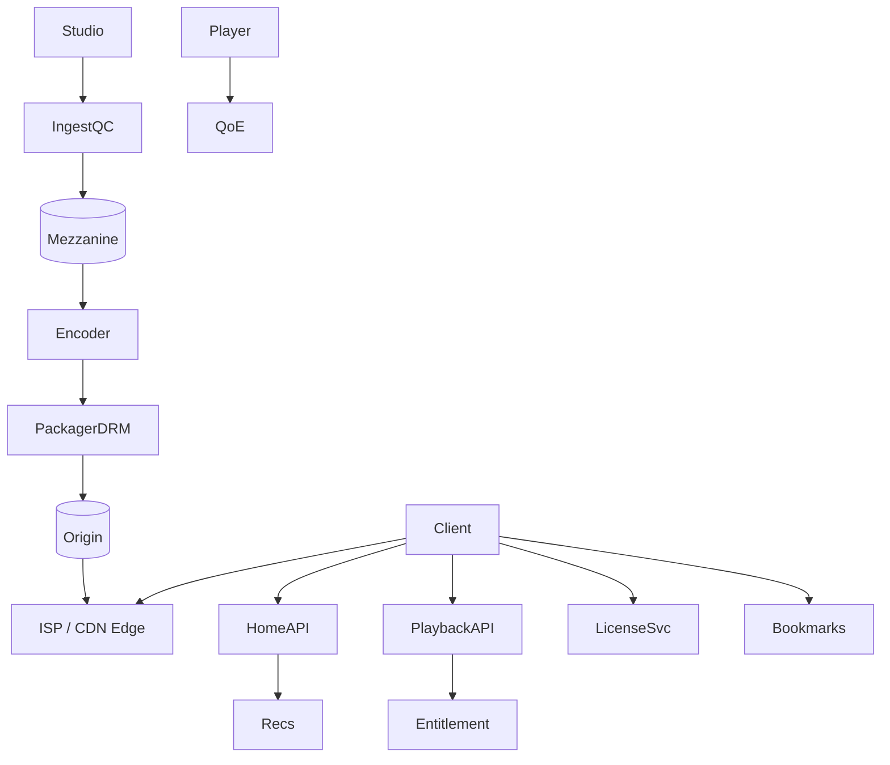

# System Design: Netflix

> **Focus areas:** Studio ingest · QC · Per-title encode · DRM · ABR · Open Connect/CDN · Personalized home · Profiles · Offline · Season-drop peaks
> **Style:** End-to-end product design with progressive scale (10× → 100× → 1,000×)
> **Quality bar:** Domain-specific numbers and failure modes; explicit trade-offs; deal-breakers; CDN / ABR / encoding / DRM where relevant
> **Interview theme:** Senior / Staff — **Netflix-like catalog streaming**

---

## Table of Contents

1. [Clarify Requirements (Interview Q&A)](#1-clarify-requirements-interview-qa)
2. [Back-of-the-Envelope Estimation](#2-back-of-the-envelope-estimation)
3. [High-Level Design](#3-high-level-design)
4. [Architecture Diagram](#4-architecture-diagram)
5. [Design Deep Dive](#5-design-deep-dive)
6. [Wrap-Up](#6-wrap-up)
7. [Deeper / Related Interview Questions](#7-deeper--related-interview-questions)
8. [Appendices](#8-appendices)

---
## 1. Clarify Requirements (Interview Q&A)

Goal: design a **Netflix-like** streaming service—licensed catalog (not UGC), global ABR with deep CDN/ISP edge, DRM, personalized home, profiles, continue watching, offline downloads.

### 1.0 What this is / is not

| Dimension | This doc | Not this |
|-----------|----------|----------|
| Content | Curated catalog + partner ingest | YouTube UGC firehose |
| Delivery | VOD + downloads | Zoom conferencing |
| Edge | ISP appliances / deep CDN | Recursive public DNS |
| Lens | QoE, DRM, personalization, COGS | Social graph at FB scale |

### 1.1 Functional Requirements

| # | Question | Expected interviewer answer | Design implication |
|---|----------|----------------------------|--------------------|
| F1 | Content source? | Studio mezzanine + QC | Partner portal + QC gates |
| F2 | Playback? | ABR HLS/DASH + multi-DRM | License + packager |
| F3 | Devices? | TV, mobile, web, consoles | Capability matrix |
| F4 | Home? | Personalized rows | Recsys + layout |
| F5 | Search? | Title/person/genre | Search index |
| F6 | Profiles? | Multi-profile accounts | Profile-scoped prefs |
| F7 | Offline? | Downloads + rental windows | Persistent licenses |
| F8 | Resume? | Continue watching | Bookmark store |
| F9 | Artwork? | Merch images A/B | Image service |
| F10 | Regions? | Per-country windows | Entitlement |
| F11 | Peaks? | Season drops | Pre-position |
| F12 | QC? | Loudness, black frames, subs | Ingest QC |
| F13 | Ads? | Optional ad tier | SSAI hooks |
| F14 | Analytics? | QoE + engagement | Beacons |

**MVP scope:** catalog + availability; ingest→encode→DRM package; playback+license+CDN; home rows; search; bookmarks; profiles; basic offline; QoE beacons.

**Out of MVP:** full ISP partnership ops tooling, interactive specials, perfect global active-active catalog writes day one.

### 1.2 Non-Functional Requirements

| # | NFR | Target |
|---|-----|--------|
| N1 | Startup | p50 < 1–2s warm path |
| N2 | Rebuffer | <<1% target cohorts |
| N3 | License | p99 < 200–400ms |
| N4 | Availability | 99.99% control plane ambition |
| N5 | Durability | Mezzanine never silently lost |
| N6 | Security | DRM + account abuse resistance |
| N7 | Global | Multi-region active-active reads |
| N8 | Cost | Edge/ISP offload sacred |

### 1.3 Cases

**Happy:** Home → play → ABR → bookmark → next-episode.  
**Edges:** finale herd; license brownout; geo-block; weak device 4K request; offline expiry; subtitle language missing.

| Case | Behavior |
|------|----------|
| Geo-blocked | Entitlement deny pre-license |
| License brownout | Regional hedge; careful short TTL cache |
| Finale drop | Pre-position all rungs at edge/ISP |
| Bookmark race | Merge by server updated_at |
| DRM L1-only device | Cap HD ladder |

### 1.4 Progressive scale

| Metric | Baseline | 10× | 100× | 1,000× |
|--------|----------|-----|------|--------|
| Subscribers | 5M | 50M | 200M | 300M+ |
| Titles | 5K | 15K | 30K | 50K+ |
| Peak concurrent | 200K | 2M | 20M | 100M+ |
| Peak egress | 1 Tbps | 10 Tbps | 100 Tbps | Offload-heavy |
| Encode titles/mo | 200 | 1K | 5K | 10K+ |
| Device types | 50 | 200 | 1K | 2K+ |
| Home QPS | 5K | 50K | 500K | 2M+ |
| Edge offload | 85% | 92% | 97% | 99%+ |

**Jumps:** 10× multi-region DRM; 100× ISP appliances + cell homes; 1,000× global TE + codec economics.

### 1.5 Scope repeat-back

> Netflix-like catalog streaming: studio ingest/QC, DRM ABR ladders, deep edge/ISP offload, personalized home with fallbacks, profiles, bookmarks, offline—QoE and entitlement correctness first.

---

## 2. Back-of-the-Envelope Estimation

### 2.1 Egress

```text
10M concurrent × 4 Mbps = 40 Tbps
95% offload ⇒ ~2 Tbps into origin/transit
Always show offload math before giant origin clusters
```

### 2.2 Storage

```text
30K titles × multi-hour × multi-codec ladders → tens–hundreds PB
Artwork tiny bytes, huge QPS
```

### 2.3 Control plane

```text
Home opens dominate API QPS; cache row stubs
Licenses ≈ playback starts + renewals
Bookmarks: coalesce client writes every N seconds
```

### 2.4 Hot titles

```text
New season can attract large concurrent fraction on same objects
Pre-position; protect license + metadata
```

### 2.5 Cost

```text
Transit without ISP offload dominates COGS
AV1 invest CPU to save bits/egress over popular corpus
```

---

## 3. High-Level Design

### 3.1 Planes

| Plane | Responsibility | Consistency |
|-------|----------------|-------------|
| Catalog/entitlement | What can be seen/played | Strong windows |
| Processing | Encode/package/QC | Idempotent jobs |
| Delivery | Bytes at edge | Immutable |
| License | DRM keys | Strong authZ |
| Personalization | Home | Stale-OK + fallback |
| Playback state | Bookmarks | Per-profile merge |

### 3.2 Components

1. Partner Ingest & QC  
2. Encoding platform (optional shot-based)  
3. Packager / multi-DRM  
4. Catalog service  
5. Entitlement  
6. Playback service  
7. License service  
8. CDN / Open Connect  
9. Image/artwork service  
10. Home layout service  
11. Recommendations  
12. Search  
13. Bookmark service  
14. Offline download service  
15. QoE analytics  
16. Experimentation  
17. Account/profile  
18. Support playback debugger  

### 3.3 APIs

```text
GET  /metadata/title/{id}?locale=
GET  /home?profile_id=
POST /playback/context {title_id, device}
POST /license  (DRM challenge)
PUT  /bookmark {profile_id, title_id, position_ms}
POST /offline/licenses
GET  /search?q=
```

### 3.4 Data model

```text
Title/Season/Episode
Availability{title, country, start, end}
EncodedAsset{title, codec, rung, path, checksum}
Bookmark{profile, title, pos, updated_at}
ProfilePrefs{languages, maturity}
```

### 3.5 Trade-offs

| Topic | Choice | Why |
|-------|--------|-----|
| Edge | Deep ISP caches | COGS + QoE |
| Encode | Per-title optimize | Bits vs CPU |
| Home | Precompute + light online | Latency |
| DRM | Multi-DRM | Device coverage |

### 3.6 Deal-breakers

| Temptation | Failure |
|------------|---------|
| No DRM | Studio contracts |
| Thin 3-region CDN | Global QoE fail |
| Personalized segment URLs | Cache miss apocalypse |
| Sync recs on play start | Startup regression |

---

## 4. Architecture Diagram

### 4.1 Flow



### 4.2 Play sequence

```text
Home select → PlaybackAPI entitlement → manifest + license URL
Player license → segments from edge → coalesce bookmarks → QoE beacons
```

### 4.3 Season drop

```text
Encode done → push OC → scale license/playback → watch ASN QoE
```

---

## 5. Design Deep Dive

### 5.1 Reliability

1. Dual-region mezz before partner delete.  
2. Content-addressed encode outputs.  
3. Audited entitlement→license.  
4. Stale edge serve on origin brownout for cached titles.  
5. Hedged license requests.  
6. Bookmark coalesce.  
7. Key compromise re-package runbook.  
8. Game-day finale drills.

### 5.2 Scalability

| Scale | Moves |
|-------|-------|
| 1× | Cloud CDN; commercial DRM; SQL catalog |
| 10× | Multi-region control; shield; profile cells |
| 100× | ISP appliances; shot-based encode; hybrid CDN |
| 1,000× | Global TE; broad AV1; edge artwork |

### 5.3 Maintainability

Device cert matrix as data; VMAF canaries; audited catalog windows; privacy-safe playback traces.

### 5.4 Open Connect philosophy

Push popular bytes into ISPs; control plane stays yours—business + systems design.

### 5.5 Personalization budget

Never block video start on recs; strict popular-in-country fallback.

### 5.6 Offline

Encrypted downloads; persistent licenses; renew online; quotas; quality vs disk.

### 5.7 Progressive narrative

1× cloud VOD → 10× multi-region DRM → 100× ISP offload → 1,000× TE/codecs.

---

## 6. Wrap-Up

### 6.1 Designed

Catalog streaming: ingest/QC, DRM ladders, deep edge, personalized home, bookmarks, offline.

### 6.2 Decisions

1. Entitlement ≠ CDN bytes  
2. Multi-DRM  
3. ISP offload first-class  
4. Home precompute + fallback  
5. Per-title encode ROI  
6. Bookmark coalesce  
7. Season-drop runbooks  
8. QoE SLOs  

### 6.3 Risks

License outages; surprise viral doc miss; account sharing; encoder regression; subtitle quality.

### 6.4 45-minute plan

| Min | Focus |
|-----|-------|
| 0–5 | Catalog vs UGC; DRM |
| 5–15 | Ingest/encode/package |
| 15–25 | Playback + offload |
| 25–35 | Home/bookmarks |
| 35–45 | Offline, scale, COGS |

### 6.5 Closer

> **Netflix**: studio pipelines, DRM ABR, deep edge offload, entitlement correctness, personalized home with fallbacks—QoE and COGS co-equal.

## 7. Deeper / Related Interview Questions

### Q1. Why not copy YouTube architecture?

Catalog+DRM+ISP offload+predictable drops ≠ UGC firehose + social.

### Q2. Shot-based encoding trade-off?

Better bits; more CPU; ROI on popular titles first.

### Q3. SSAI vs CSAI?

SSAI more control/QoE complexity; CSAI simpler, adblock-prone.

### Q4. Account sharing?

Device graphs + product policy; sensitive UX.

### Q5. Open Connect why?

Cut transit; improve QoE; bulk predictable push.

### Q6. Artwork A/B?

Variant images; sticky assignment; take-rate metrics.

### Q7. 4K HDR fragmentation?

Capability matrix; separate ladders; security levels.

### Q8. Previews data cost?

Lower rungs; mute; user settings.

### Q9. Piracy of downloads?

DRM HW path; optional forensic watermark.

### Q10. Search vs browse?

Browse/home dominates—optimize that.

### Q11. Where is strong consistency mandatory?

Publish/ACL/entitlement and anything that could leak private media; not view counters.

### Q12. How do signed URLs interact with CDN caching?

Prefer cookies/tokens excluded from cache key; immutable segment paths shared across users.

### Q13. HLS vs DASH?

HLS for reach; DASH common on Android/web; CMAF shared segments; dual manifests.

### Q14. What is the #1 cost lever?

Edge hit ratio / offload; then codec bits for same quality.

### Q15. How do you prevent premiere stampedes?

Pre-warm, origin shield, coalescing, long TTL immutables, scale license/playback APIs.

### Q16. Idempotent processing pattern?

Deterministic output keys + job_id; CAS publish to READY.

### Q17. When multi-CDN?

At ~100× for resilience and pricing leverage; needs steering and coherent cache keys.

### Q18. ABR oscillation fix?

Dwell timers, asymmetric up/down thresholds, buffer-based hysteresis.

### Q19. Where consistent hashing helps?

Sharding comments, workers, sticky realtime nodes—not static CDN GETs.

### Q20. Offline + DRM?

Persistent licenses, rental windows, secure client storage, renew while online.

### Q21. QoE vs QPS?

Staff answers talk rebuffer/startup/bitrate; QPS alone is junior.

### Q22. Ladder too dense?

Storage+encode cost up; QoE gains diminish—tune with data.

### Q23. Hot metadata key?

Cache + cell isolation for celebrity titles; never couple to segment path.

### Q24. Backpressure on encode?

Priority queues; shed archival; keep interactive SLAs.

### Q25. Manifest personalization risk?

Can destroy cache; prefer constant media manifests; personalize ads/artwork separately.

---

## 8. Appendices

### A1. Netflix domain notes

**OC push:** off-peak fills; prioritize imminent drops; verify appliance checksums.  
**Per-title ladders:** complexity analysis; anime ≠ live action.  
**Household ≠ profile ≠ device** for policy.  
**Merchandizing overrides** for brand moments.  
**Finale checklist:** encode, OC fill, license scale, images warm, support macros.

### A2. SLOs

| SLO | Target |
|-----|--------|
| Play start success | 99.9% |
| License success | 99.95% |
| Wrong-region play | ~0 |


---

## Appendix: Cross-cutting media patterns (interview ammunition)

### Encoding ladder reference

| Rung | Resolution | H.264 bitrate band | Typical role |
|------|------------|--------------------|--------------|
| L0 | 256×144 | 100–200 kbps | Extreme constrained |
| L1 | 426×240 | 300–500 kbps | Poor mobile |
| L2 | 640×360 | 600–1000 kbps | Mobile floor |
| L3 | 854×480 | 1.0–1.8 Mbps | SD |
| L4 | 1280×720 | 2.5–5 Mbps | HD |
| L5 | 1920×1080 | 4.5–9 Mbps | FHD |
| L6 | 2560×1440 | 8–14 Mbps | QHD optional |
| L7 | 3840×2160 | 12–35 Mbps | 4K (prefer HEVC/AV1) |

**Staff signal:** dual-codec strategy (H.264 reach + AV1/HEVC efficiency), capped by source resolution; packaged footprint often ≈ 1.6–2.8× mezzanine.

### ABR control loop

```text
inputs: throughput_EMA, buffer_seconds, last_switch_ts, device_display_cap
if buffer < B_danger: switch down aggressively (skip rungs if needed)
elif buffer > B_safe and throughput > next_bitrate * headroom:
  if now - last_switch > dwell: switch up one rung
else: hold
penalize oscillation; honor save-data / save-battery modes
```

QoE KPIs: startup time, rebuffer ratio, average bitrate, bitrate switches, abandon-before-start, encode canary VMAF.

### CDN hierarchy

```text
Client → PoP (SSD) → Regional mid-tier → Origin shield → Object origin
Immutable versioned segment URLs → long TTL
Keep personalization in control plane; never in segment cache keys
```

### DRM sketch

```text
Packager: CENC/CBCS; key IDs in manifest
License service: entitlement + device security level → short-lived license
Offline: persistent license + rental window + secure storage
Rotate keys via dual-key windows; never log clear content keys
```

### Progressive scale pattern language

| Jump | Typical forced moves |
|------|----------------------|
| 10× | Multi-AZ, queues, origin shield, metadata cache |
| 100× | Multi-region, cells/shards, multi-CDN / deeper mid-tier, dedicated live/DRM planes |
| 1,000× | Fleet codec efficiency, edge experiments, cost/QoE executive KPIs, compliance cells |

### Reliability checklist

1. Idempotent upload chunks and deterministic job output keys.
2. Publish gate: artifacts exist before READY.
3. At-least-once jobs; exactly-once user-visible publish via CAS.
4. No orphan manifests.
5. Encode queue backpressure + priorities.
6. Poison mezzanine quarantine.
7. Signing/license key rotation runbooks.
8. Immutable segments; careful manifest TTL.

### Hot-key / viral playbook

Pre-warm rungs; origin coalescing/shield; isolate celebrity metadata/comments; shed archival re-encodes; protect license pools.

### Cost levers

Cache hit ratio; codec efficiency; ladder density; cold tiering; player prefetch discipline.

### Observability beyond QPS

| Signal | Why |
|--------|-----|
| Rebuffer by ASN/device | CDN/network truth |
| Startup p90 | Manifest + first bytes |
| Encode queue lag | Creator/partner UX |
| Origin bandwidth | Hit-ratio health |
| License errors | DRM SEVs |
| Segment 4xx | Publish races |

### Consistency cheat-sheet

| Data | Consistency |
|------|-------------|
| ACL / publish / entitlement | Strong |
| Immutable segments | WORM |
| Counters / views | Eventual aggregates |
| Search / recs | Eventual + fallbacks |
| License | Strong authZ; short TTL cache OK |

### Common deal-breakers

| Temptation | Why fatal |
|------------|-----------|
| Single progressive MP4 globally | No ABR; origin melt |
| User-specific segment URLs | Cache bypass |
| Sync ML/copyright on upload request | Tail latency death |
| DB BLOBs for media | Throughput/cost death |
| Skip DRM on licensed premium | Contractual SEV |

### Algorithms & DS

| Tool | Use |
|------|-----|
| Consistent hashing | Shard comments/workers/state |
| Bloom filters | Dup upload / negative cache |
| Fingerprints / MinHash | Copyright / near-dup |
| WFQ / priority queues | Encode fleets |
| EMA + hysteresis | ABR |
| ANN (HNSW/IVF) | Recs / fingerprint retrieve |

### Sample control-plane APIs

```text
POST /uploads → upload_id
PUT  /uploads/{id}/parts/{n}
POST /uploads/{id}/complete → asset_id
GET  /playback/session?asset_id= → manifest, license?, exp
GET  /library | /feed | /search
GET  /jobs/{id} | webhooks on state changes
```

### Storage math templates

```text
mezz/day = uploads/day * duration_s * mezz_bitrate / 8
packaged ≈ mezz * ladder_multiplier
cdn_egress/day ≈ watch_hours * 3600 * avg_bitrate / 8
origin ≈ cdn_egress * (1 - hit_ratio)
```

### Security extras

Malware scan; signed playback; geo/account-sharing heuristics; audit takedowns; no open SSRF in processors.

### Reusable closer

> Separate **bytes planes** (CDN) from **control planes** (entitlement, metadata, processing). Atomic publish. Measure QoE. Price egress. Idempotent pipelines. Progressive cells and shields.
