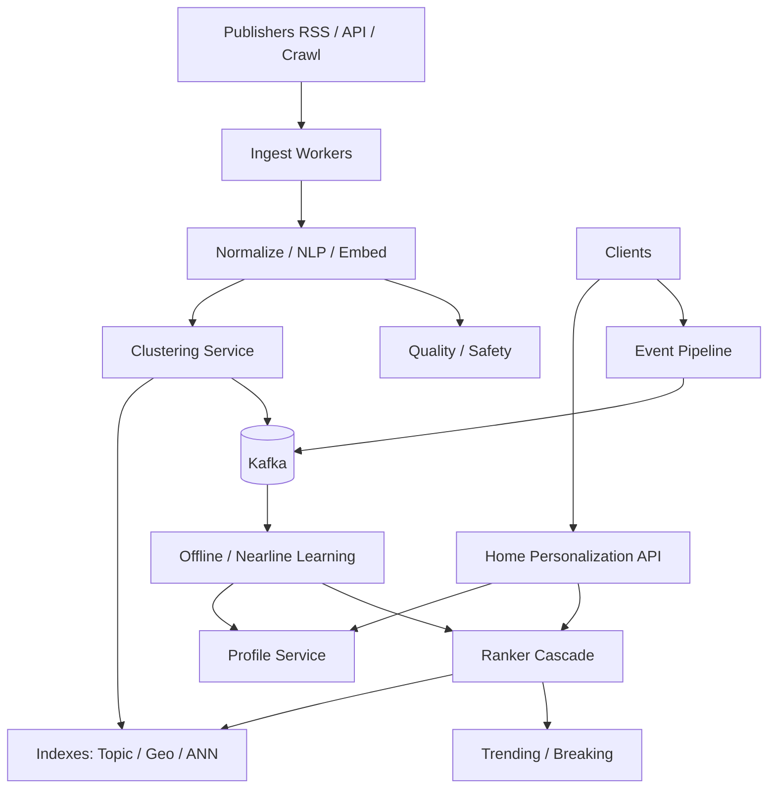

# System Design: News Aggregation & Personalization

> **Focus areas:** Ingestion · Dedup · Topic graphs · Personalized ranking · Freshness vs relevance · Notifications · Progressive scale  
> **Style:** Senior/staff interview prep with progressive scale (10× → 100× → 1,000×)  
> **Product orientation:** Google News / Apple News–style aggregator: crawl/partner ingest, cluster stories, personalize home

---

## Table of Contents

1. [Clarify Requirements (Interview Q&A)](#1-clarify-requirements-interview-qa)
2. [Back-of-the-Envelope Estimation](#2-back-of-the-envelope-estimation)
3. [High-Level Design](#3-high-level-design)
4. [Architecture Diagram](#4-architecture-diagram)
5. [Design Deep Dive](#5-design-deep-dive)
6. [Wrap-Up](#6-wrap-up)
7. [Deeper / Related Interview Questions](#7-deeper--related-interview-questions)

---

## 1. Clarify Requirements (Interview Q&A)

News aggregation blends **content ingestion pipelines** with **feed personalization**. Bound source types, clustering, and ranking objectives (relevance × freshness × diversity × publisher quality).

### 1.0 What this is / is not

| This is | This is not |
|---------|-------------|
| Multi-source news ingest + personalized home | Social follow feed (Twitter doc) |
| Story clustering / dedup of same event | Full publisher CMS |
| Topic & entity personalization | TikTok short-video ranker (different media) |
| Breaking news distribution | Realtime stock ticker |

### 1.1 Functional Requirements

| # | Question to ask | Expected / typical interviewer answer | Design implication |
|---|-----------------|----------------------------------------|--------------------|
| F1 | Sources? | Partner feeds (RSS/API) + crawl | Connector framework + crawl politeness |
| F2 | Unit of ranking? | **Story cluster** then articles inside | Two-level rank |
| F3 | Personalization signals? | Topics, publishers, entities, click/dwell history | Profile + online features |
| F4 | Breaking news? | Global/regional inject | Fast path bypasses heavy personalization |
| F5 | Languages / locales? | Multi-locale home | Locale-keyed indexes |
| F6 | Paywall / licensing? | Respect partner rights; metadata only sometimes | Store rights flags; clickout |
| F7 | Dedup? | Same event many articles → one cluster | Simhash + embeddings + entity timelines |
| F8 | User controls? | Follow topics/publishers; mute | Explicit preferences overlay |
| F9 | Notifications? | Breaking + digests | Separate notifier with quiet hours |
| F10 | Comments? | Out of MVP | — |
| F11 | Search? | Basic Phase 1 | Index articles async |
| F12 | Fake news / quality? | Publisher reputation + classifiers | Re-ranker penalties |
| F13 | Offline reading? | Phase 2 | Packets / downloads |

**MVP scope:**

1. Ingest RSS/partner articles.
2. Normalize, dedup, cluster into stories.
3. Personalize home ranked list for locale.
4. Topic follow + mute publisher.
5. Clickout tracking for learning.
6. Breaking news rail.

**Out of MVP:** Full web-scale crawl of entire internet, user-generated posts, video-native product, complex ads exchange.

### 1.2 Non-Functional Requirements

| # | Question | Expected answer | Target |
|---|----------|-----------------|--------|
| N1 | Home latency | Instant | p99 < 200ms |
| N2 | Ingest lag | Fresh news | Partner p50 < 2 min; crawl varies |
| N3 | Breaking inject | Very fast | < 30–60s globally regional |
| N4 | Availability | High | 99.9%+; stale personalization OK |
| N5 | Consistency | Eventual profiles | RYW on explicit follows |
| N6 | Compliance | Licensing, GDPR, robots.txt | First-class |
| N7 | Diversity | Avoid single-publisher monopoly | Re-rank constraints |

### 1.3 Cases

**Happy paths**

1. Publisher pushes article → ingested → clustered → eligible → appears for relevant users.
2. User opens home → personalized story cards → clickout → dwell logged.
3. Earthquake breaking → editorial/auto inject to top for geo.

**Edge / failure cases**

| Case | Behavior |
|------|----------|
| Duplicate rewrites of same AP story | Cluster together; pick canonical/top articles |
| Clickbait title | Quality model downranks despite CTR |
| Source outage | Mark connector unhealthy; rely on others |
| Profile cold start | Locale popular + trending topics |
| Topic spam flooding | Publisher caps; diversity rules |
| Wrong cluster merge (two events) | Precision-oriented clustering; manual tools |
| Rights expired | Stop serving; keep tombstone |
| Personalization outage | Locale top stories fallback |

### 1.4 Scales

| Metric | Baseline | 10× | 100× | 1,000× |
|--------|----------|-----|------|--------|
| DAU | 5M | 50M | 500M | 5B |
| Articles ingested / day | 2M | 20M | 200M | 2B |
| Active story clusters | 200K | 2M | 20M | 200M |
| Home requests / day | 50M | 500M | 5B | 50B |
| Peak home QPS | 3K | 30K | 300K | 3M |
| Click events / day | 20M | 200M | 2B | 20B |
| Topics in ontology | 50K | 100K | 500K | 1M+ |

**Jumps:**

- **10×:** Cluster service; Redis home cache; profile store.
- **100×:** ANN retrieval; feature store; regional cells; quality ML.
- **1,000×:** Publisher-scale crawl ops; nearline personalization; multi-objective rank at huge QPS.

### 1.5 Etc.

> Design a news aggregation and personalization system: ingest articles, cluster into stories, rank a personalized home with freshness and diversity, support topic follows and breaking injects, from ~5M DAU to 1000×.

---

## 2. Back-of-the-Envelope Estimation

### 2.1 Ingest

```text
2M articles/day ≈ 23/s avg → ~200/s peak
Each: fetch, parse, lang detect, embed, cluster assign
CPU-bound NLP pipeline with queues
```

### 2.2 Storage

```text
Article metadata 5–10 KB (not full HTML if clickout)
2M × 8 KB ≈ 16 GB/day metadata
Embeddings 768-d float16 ≈ 1.5 KB → +3 GB/day
Fulltext optional / selective
```

### 2.3 Personalization

```text
3K QPS home × candidate 1K stories scored
→ cascade retrieval; cache anonymous/locale shelves
Personal cache for heavy users
```

### 2.4 Bandwidth

```text
Home JSON 50 stories × 1 KB = 50 KB
50M requests × 50 KB = 2.5 TB/day API
Images via publisher/CDN clickout — may not proxy
```

---

## 3. High-Level Design

### 3.1 Pipeline overview

```text
Sources → Ingest Connectors → Normalize
    → Dedup / Cluster → Index (topic, geo, entity)
    → Quality / Safety scores
    → Candidate serving stores
         ↓
User request → Profile + Retrievers → Rank → Re-rank → Home
         ↓
Click/dwell events → Profile updater + training lake
```

### 3.2 Clustering / dedup

| Technique | Use |
|-----------|-----|
| Canonical URL / URL normalize | Exact dupes |
| Simhash / MinHash on title+lede | Near-dupes |
| Embedding similarity + time window | Same story rewrites |
| Entity + event templates | “Earthquake in X” clustering |

**Cluster object:**

```text
StoryCluster {
  cluster_id,
  first_seen,
  peak_velocity,
  entities[],
  topics[],
  member_articles[],
  canonical_article_id,
  geo_scope
}
```

**Precision > recall** for merges (wrong merge is worse UX than split).

### 3.3 Personalization funnel

```text
Retrievers (parallel):
  - Followed topics / publishers
  - User embedding ↔ story embedding ANN
  - Locale trending / breaking
  - Entity graph expansions
  - Explore / serendipity
→ Light rank (freshness, affinity, quality)
→ Heavy rank (P(click), P(dwell), P(satisfaction))
→ Re-rank: diversity (topic, publisher), fatigue, political balance knobs, breaking pins
```

### 3.4 Freshness vs relevance

```text
final = relevance^a * freshness^b * quality^c
freshness = exp(-age / tau_topic)
```

Breaking topics use smaller `tau` (decay slower while velocity high) or explicit pin.

### 3.5 Domain model

```text
Article, StoryCluster, Publisher, Topic, Entity
UserProfile { follows, mutes, embeddings, affinity_scores }
Impression / Click / Dwell events
```

### 3.6 APIs

| Method | Path | Purpose |
|--------|------|---------|
| GET | `/v1/home?locale=` | Personalized home |
| GET | `/v1/stories/{id}` | Cluster + member articles |
| POST | `/v1/follows/topics` | Follow topic |
| POST | `/v1/mutes/publishers` | Mute |
| POST | `/v1/events/client` | Clicks/dwells |
| GET | `/v1/trending` | Non-personalized |

### 3.7 Ingest connectors

```text
Connector interface:
  poll()/webhook() → raw payload
  map to ArticleNormalized
  checkpoint watermarks
  respect rate limits / robots / contracts
```

Idempotency key: `(publisher_id, external_id)` or content hash.

### 3.8 Storage

| Data | Store | Why |
|------|-------|-----|
| Articles/clusters | KV/SQL + search | Metadata |
| Embeddings / ANN | Vector service | Retrieval |
| User profiles | KV + feature store | Personalization |
| Trending | Redis time series / Count-Min | Velocity |
| Events | Kafka → lake | Learning |
| Raw snapshots | Object store | Reprocess |

### 3.9 Breaking news path

```text
Velocity detector OR editorial trigger
  → write BreakingPin(locale, cluster_id, expiry)
  → home re-ranker always merges pins at top slots
  → notification service evaluates user interest / geo
```

Don’t wait for batch profile jobs.

### 3.10 Home assembly (modules)

Think in **modules**, not one giant ranked list compute:

| Module | Source | Personalization |
|--------|--------|-----------------|
| Breaking pins | Velocity + editorial | Locale / geo |
| For You top | Cascade ranker | Strong |
| Followed topics | Topic indexes | Explicit |
| Local | Geo retriever | Medium |
| Top stories | Trending | Weak |
| Explore | Serendipity pool | Controlled |

API merges modules with slot templates (e.g. slots 1–2 breaking-capable, then diversified For You).

### 3.11 Clustering windowing

```text
For each new article A:
  candidates ← ANN_query(embed(A), time_window=12–48h, locale)
  for C in candidates:
    if title_lede_sim(A,C) > t1 OR entity_jaccard > t2 AND same_event_features:
       assign A → cluster(C)
       update cluster velocity
       break
  else create new cluster
```

**Online clustering** for low latency; **periodic reclustering** offline to fix splits/merges (versioned cluster IDs; redirects).

### 3.12 Quality & safety scores

| Signal | Use |
|--------|-----|
| Publisher reputation prior | Floor/ceiling on rank |
| Clickbait title classifier | Penalty |
| Hate/medical misinformation | Fail closed remove |
| Duplicate site networks | Publisher diversity |
| Corrections / retractions | Demote / label |

**Training-serving:** never let raw CTR dominate without dwell/quality — news products die by clickbait otherwise.

### 3.13 Profile representation

```text
UserProfile:
  explicit: followed_topics[], muted_publishers[], muted_topics[]
  affinities: map topic→score, publisher→score, entity→score
  embedding: float[]
  session: short-term interests (last hours)
  demographics_locale: country, lang, optional metro
```

**Update path:**

```text
click/dwell event → nearline affinity bumps → periodic embedding refresh
explicit follow → strong immediate boost (RYW)
```

### 3.14 Trade-offs

**Crawl vs partner feeds**

| | Partners | Web crawl |
|--|----------|-----------|
| Rights | Clearer | Murky |
| Freshness | Push/webhook good | Poll variance |
| Coverage | Limited | Broad |
| Ops | Contract mgmt | robots/politeness |

MVP: partners + selective crawl.

**Cluster-first vs article-first rank**

| | Cluster-first | Article-first |
|--|---------------|---------------|
| Dedup UX | Excellent | Poor |
| Complexity | Higher | Lower |
| Publisher choice | Second-stage | Mixed |

Choose **cluster-first** for Google/Apple News–like products.

### 3.15 Notification design hooks

```text
Breaking candidate → user interest score (geo, topics, past reads)
  → quiet hours / frequency cap
  → push via notification platform
  → collapse by cluster_id
```

Digest emails: offline job ranking top clusters per user daily.

### 3.16 End-to-end latency budgets

| Stage | Budget |
|-------|--------|
| Auth + profile load | 10–20ms |
| Retrievers (parallel) | 20–40ms |
| Feature gather | 10–20ms |
| Light + heavy rank | 30–50ms |
| Re-rank + pack | 10ms |
| **Total p99 target** | **< 200ms** |

On exceed: skip heavy ranker; fill from trending modules.

---

## 4. Architecture Diagram



---

## 5. Design Deep Dive

### 5.1 Reliability

- Connector checkpoints; at-least-once ingest with idempotent article upserts.
- Clustering reprocessable from raw store (deterministic versions).
- Home degrade: locale trending if personalization fails.
- Poison articles: quality fail closed for safety categories.
- Backpressure: drop explore compute before breaking/ingest durability.
- **Schema evolution:** articles carry `pipeline_version`; re-embed jobs bump versions without breaking serve.
- **Partial publisher outage:** connector health dashboard; automatic de-weight of stale publishers.
- **Exactly-once not required:** idempotent keys on `(publisher, external_id)` prevent dup articles; clusters tolerate re-add.

**Disaster modes**

| Mode | Behavior |
|------|----------|
| Ranker down | Trending + follows only |
| ANN down | Disable embedding retriever |
| Kafka down | Buffer events at edge; delay learning |
| Ingest storm | Priority queues: breaking publishers first |

### 5.2 Scalability

**Shard** articles by `article_id`; profiles by `user_id`; indexes by locale/topic.

**Scale jumps:**

- **10×:** Async NLP; cluster IDs; cached home modules.
- **100×:** ANN + feature store; regional home cells; publisher score models.
- **1,000×:** Multi-continent ingest; nearline emb; heavy experimentation platform.

**Parallelization:** retrievers in parallel; batch embedding; map-reduce clustering windows.

**Storage tiers:** hot clusters days; warm weeks; cold archive for analytics.

**Candidate volume control**

```text
Per request: ≤1–2k cluster candidates before light rank
Trending indexes pre-truncated by locale
Followed topics: top N stories each, capped
```

**Multi-region:** ingest region-near publisher; replicate cluster metadata globally; personalize in user home region.

### 5.3 Maintainability

- Metrics: ingest lag, cluster precision sampling, home p99, CTR/dwell, diversity entropy, breaking inject latency, clickbait penalty triggers.
- Human eval queues for cluster mistakes.
- Ontology versioning for topics.
- Publisher contract config as code.
- Kill switches per retriever.
- **Eval harness:** offline NDCG on human-judged home pages; online A/B with retention guardrails.
- **Debug:** why-this-story endpoint (retriever sources + scores) gated for internal users.
- **Compliance:** right-to-delete user profiles/events; retain article corpus per license.

---

## 6. Wrap-Up

| Decision | Choice | Why |
|----------|--------|-----|
| Rank unit | Story cluster | Dedup UX |
| Serving | Multi-retriever cascade | Scale + coverage |
| Freshness | Explicit decay + breaking pins | News product |
| Learning | Click/dwell with quality guardrails | Avoid clickbait collapse |
| Degrade | Locale trending | Availability |

**Phases:** ingest+trending → clustering → explicit follows → personalized rank → notifications/quality ML.

> “News personalization is a recommender where freshness, clustering, and publisher quality are first-class constraints — not optional re-rankers.”

---

## 7. Deeper / Related Interview Questions

**Q1. Why cluster before rank?**  
A: Users want events, not 30 rewrites of the same AP wire. Clustering improves UX and diversity control.

**Q2. How do you avoid clickbait optimization?**  
A: Predict dwell/satisfaction; publisher quality; post-click regret features; not raw CTR alone.

**Q3. Cold start user?**  
A: Locale top + onboarding topic picker; fast explore; don’t wait for long history.

**Q4. Cold start article?**  
A: Publisher prior + content embeddings; limited explore traffic; promote if velocity/quality good.

**Q5. Clustering false merge?**  
A: Prefer split; use tight time/entity constraints; provide editor split tools; version cluster IDs.

**Q6. Breaking news vs personalization conflict?**  
A: Reserved top slots for pins; personalized below; user mute still honored unless catastrophic alert policy.

**Q7. Political balance?**  
A: Product/policy choice; diversity constraints over publishers/viewpoint clusters if required; transparent controls.

**Q8. robots.txt / legal?**  
A: Crawl politeness; honor contracts; store license; prefer partner APIs for Google/Apple News–like products.

**Q9. Feature timing skew?**  
A: Log served features; train point-in-time; avoid using post-click future info.

**Q10. Trending detection structure?**  
A: Count-Min / sliding windows per topic/entity; spike vs baseline z-score.

**Q11. Home cache personalization?**  
A: Cache modules (trending, topic X) and assemble; full user page cache short TTL for heavy users.

**Q12. Multi-language?**  
A: Separate indexes; translation optional; don’t mix languages unless user consumes both.

**Q13. How is this different from TikTok ranker?**  
A: Longer documents, clustering, publisher contracts, stronger freshness/breaking, lower swipe density, clickout model.

**Q14. Entity linking importance?**  
A: Powers topic graphs (“Boeing”, “Fed rates”); retrieval and explanations.

**Q15. Notification spam?**  
A: Cap daily; relevance threshold; quiet hours; cluster-level not per article.

**Q16. Dedup at URL vs content?**  
A: Both; URLs miss syndications; content hash catches mirrors.

**Q17. Ranker latency budget?**  
A: Similar cascade: 1k→300→50 with timeouts and fallbacks.

**Q18. Storage of full article body?**  
A: Often snippet + clickout for legal; fulltext only when licensed.

**Q19. Graph of topics?**  
A: Ontology edges for expansion (interest propagation) with careful dilution.

**Q20. Footgun?**  
A: Ranking individual articles without clustering/dedup — spammy home.

**Q21. A/B metrics?**  
A: Dwell, satisfied reads, return rate, diversity, complaint rate; not just clicks.

**Q22. Geo local news?**  
A: Geo entity + user location cell retriever; privacy fuzzing.

**Q23. Publisher gaming velocity?**  
A: Normalize by publisher; detect refresh-spam; quality priors.

**Q24. Consistent hashing for profile store?**  
A: Shard by user_id; vnodes; migrate with dual-read.

**Q25. Realtime profile updates?**  
A: Nearline on clicks; session features online; full emb refresh minutes–hours.

**Q26. Load shed?**  
A: Disable heavy ranker → light; disable ANN → follows+trending; keep breaking.

**Q27. Why Kafka between ingest and cluster?**  
A: Decouple spikes; replay; multiple consumers (search, cluster, analytics).

**Q28. Mutual connections? (trick)**  
A: Not core — unless “friends reading” social layer; keep optional retriever.

**Q29. Memory for ANN?**  
A: Billions of embeddings need PQ/disk-ANN; news may keep only hot weeks in RAM.

**Q30. Close?**  
A: Ingest→cluster→multi-retriever personalized rank with freshness/diversity/breaking — that’s the news aggregator spine.

---

*End of news aggregation & personalization system design prep doc.*
