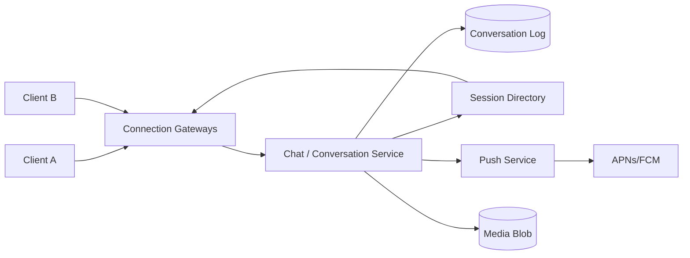
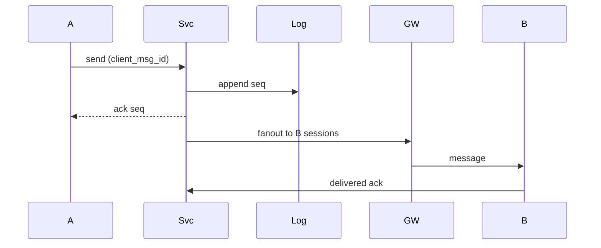

# System Design: One-to-One Chat

> **Focus areas:** Persistent connections · Per-conversation ordering · Offline sync · Push wakeup · Multi-device · Receipts · Idempotent send · Block/spam  
> **Style:** End-to-end product design with progressive scale (10× → 100× → 1,000×)  
> **Quality bar:** Conversation single-writer; cursor sync; push ≠ transport; progressive scale  
> **Interview theme:** Senior / Staff — **DM messenger** (WhatsApp 1:1 subset / iMessage-like)

---

## Table of Contents

1. [Clarify Requirements (Interview Q&A)](#1-clarify-requirements-interview-qa)
2. [Back-of-the-Envelope Estimation](#2-back-of-the-envelope-estimation)
3. [High-Level Design](#3-high-level-design)
4. [Architecture Diagram](#4-architecture-diagram)
5. [Design Deep Dive](#5-design-deep-dive)
6. [Wrap-Up](#6-wrap-up)
7. [Deeper / Related Interview Questions](#7-deeper--related-interview-questions)
8. [Appendices](#8-appendices)

---

## 1. Clarify Requirements (Interview Q&A)

Goal: design **one-to-one chat** between two users: realtime delivery when online, durable history, multi-device sync, offline push, delivery/read receipts—without group fan-out complexity (defer to group-chat / WhatsApp docs).

### 1.0 What this is / is not

| Dimension | This doc | Not this |
|-----------|----------|----------|
| Job | 1:1 messaging | Group chat / channels (siblings) |
| Fan-out | 2 users × devices | N-member hybrid fan-out |
| E2EE | Optional Phase 2 | Required Signal protocol MVP |
| Ordering | Per-conversation total order | Global order across chats |

### 1.1 Functional Requirements

| # | Question | Expected answer | Design implication |
|---|----------|-----------------|--------------------|
| F1 | Who chats? | Two authenticated users | Conversation_id = f(u1,u2) |
| F2 | Message types? | Text, image/video pointers, reactions later | Media in object store |
| F3 | Ordering? | Strict per conversation | Server seq |
| F4 | Delivery? | At-least-once to devices | Durable log + sync |
| F5 | Offline? | History sync + push | Push wakeup |
| F6 | Multi-device? | Yes | Session fan-out + cursors |
| F7 | Receipts? | Delivered + read | Receipt events |
| F8 | Typing/presence? | Best-effort | Ephemeral |
| F9 | Edit/delete? | Soft delete / edit flag | New seq events |
| F10 | Block? | Yes | Authz on send |
| F11 | Unread? | Per user | Cursor / read_seq |
| F12 | Search? | Phase 1.5 | Async index |
| F13 | Media? | Upload then send pointer | Resumable upload |
| F14 | Idempotency? | Client msg_id | Exactly-one persist |

**MVP scope:**

1. Create/get 1:1 conversation between two users.  
2. Send text with client `message_id` idempotency.  
3. Per-conversation monotonic `seq`.  
4. Realtime fan-out to online sessions via WS/HTTP2.  
5. Offline: store + push notification.  
6. Sync API `after_seq`.  
7. Delivered/read receipts.  
8. Block list; basic rate limits.  
9. Multi-device session registry.

**Out of MVP:** groups, E2EE, disappearing mode polish, payments, status/stories, server-side full search at extreme scale.

### 1.2 Non-Functional Requirements

| # | NFR | Target |
|---|-----|--------|
| N1 | Online delivery after persist | p50 < 200ms, p99 < 1s in-region |
| N2 | Durability | ACK’d send never lost |
| N3 | Ordering | Total order per conversation |
| N4 | Availability | 99.9%+ messaging |
| N5 | Multi-region | Conn gateways AA; conversation home cell |
| N6 | Consistency | Read-your-writes for sender |
| N7 | Privacy | Blocks honored; no cross-user leak |
| N8 | Push privacy | Optional opaque notifications |

### 1.3 Cases

**Happy:** A online sends → persist seq→n → push to B sessions → B ACK delivered → B reads → read receipt to A.

| Case | Behavior |
|------|----------|
| Double tap | Same client message_id → one row |
| B offline | Persist; APNs/FCM; sync on open |
| A multi-device | Other A devices also get fan-out (echo) |
| Reconnect | Sync gaps by seq |
| Block | Reject send; optional hide |
| Out-of-order receipt | Apply by seq rules; UI sorts by seq |
| Media pending | Message state UPLOADING → SENT |
| Partition | Home cell owns writes; edges forward |
| Clock skew | Ignore client clock for order |
| Push duplicate | Client dedupe by message_id |

### 1.4 Progressive scale

| Metric | Baseline | 10× | 100× | 1,000× |
|--------|----------|-----|------|--------|
| MAU | 1M | 10M | 100M | 1B |
| DAU | 200K | 2M | 20M | 200M |
| Peak connections | 100K | 1M | 10M | 100M |
| Msgs / day | 20M | 200M | 2B | 20B |
| Peak ingest / s | 500 | 5K | 50K | 500K |
| Peak session pushes / s | 1K | 10K | 100K | 1M |
| Avg devices / user | 1.5 | 1.5 | 1.8 | 2 |
| Media msgs % | 15% | 15% | 20% | 20% |

**Jumps:** 10× = WS gateway fleet + Kafka fan-out; 100× = conversation cells; 1,000× = extreme conn tier + cold history.

### 1.5 Scope repeat-back

> Design **1:1 chat** with durable per-conversation sequences, multi-device realtime delivery, offline sync + push, and receipts—scaling via connection fleets and home-cell conversation writes.

---

## 2. Back-of-the-Envelope Estimation

```text
20M msgs/day ≈ 230/s avg; peak ×5 ⇒ ~1K/s ingest
Each msg → ~2 users × 1.5 sessions online fraction
Assume 50% recipients online → ~1.5K session pushes/s peak baseline

Storage: 300 B metadata × 20M = 6 GB/day
Media separate: 15% × 200 KB = huge — object store

Connections: 100K × 20 KB ≈ 2 GB RAM across gateways
```

### Fan-out (simple)

1:1 is easy: max amplify small. Still multiply by devices. Groups are where hybrid matters—mention boundary.

### Hot keys

Celebrity DMs; pair of bots chatting; reconnect sync storms after outage.

---

## 3. High-Level Design

### 3.1 Planes

| Plane | Role |
|-------|------|
| Conversation log | SoT messages + seq |
| Session / conn directory | user → gateway nodes |
| Fan-out | Deliver to online sessions |
| Push | Wake offline |
| Receipts | Side channel events |

### 3.2 Components

1. **Chat API** — send/sync/history.  
2. **Conversation Service** — assign seq, persist.  
3. **Message Store** — shard by conversation_id.  
4. **Connection Gateway** — WS.  
5. **Presence / Session Directory**.  
6. **Fan-out Workers**.  
7. **Push Service**.  
8. **Media Service**.  
9. **Block/Abuse Service**.  
10. **Receipt Service**.

### 3.3 APIs

```text
POST /v1/conversations/with/{user_id} → {conversation_id}

POST /v1/conversations/{id}/messages
Idempotency / client_msg_id
{ "client_msg_id":"c1", "type":"text", "text":"hi" }
→ { "seq": 42, "server_ts": ... }

GET  /v1/conversations/{id}/messages?after_seq=41&limit=100

POST /v1/conversations/{id}/ack { "delivered_upto": 42 }
POST /v1/conversations/{id}/read { "read_upto": 42 }
```

### 3.4 Data model

```text
conversations(conversation_id, user_a, user_b, created_at, home_cell)
messages(conversation_id, seq, client_msg_id, sender_id, type, body_ref, server_ts)
user_conv_state(user_id, conversation_id, read_seq, delivered_seq, muted)
sessions(session_id, user_id, gateway_id, device_id, last_seen)
blocks(blocker, blockee)
```

`conversation_id = hash(min(u1,u2), max(u1,u2))` canonical.

### 3.5 Trade-offs

| Topic | Choice | Why |
|-------|--------|-----|
| Client timestamps for order | **No** | Cheating/skew |
| Persist before fan-out | **Yes** | Durability |
| E2EE MVP | Defer | Complexity |
| Push full body | Optional opaque | Privacy |
| DB per message inbox copy | Single conversation log | Enough for 1:1 |

**Deal-breaker:** fan-out before durable persist.

---

## 4. Architecture Diagram





---

## 5. Design Deep Dive

### 5.1 Reliability

**Invariants**

1. Persist + assign seq before ACK to sender.  
2. Idempotent `(conversation_id, sender_id, client_msg_id)`.  
3. Fan-out at-least-once; clients dedupe.  
4. Sync by seq fills gaps — push is hint.  
5. Blocks enforced on send path.  
6. Receipts do not reorder messages.  
7. Media: message references only committed objects.

**Ordering:** single-writer partition per conversation (cell + seq allocator).  
**Offline:** store forever (product TTL optional); push with collapse key `conv:{id}`.  
**Guarantees table:**

| Guarantee | Scope |
|-----------|-------|
| Durability | After send ACK |
| Delivery | At-least-once to devices |
| Order | Per conversation seq |
| Exactly-once display | Client dedupe |

**Backpressure:** slow device kicked to sync mode; don’t block append.

### 5.2 Scalability

| Scale | Moves |
|-------|-------|
| 1× | Monolith + Redis pubsub |
| 10× | Gateway fleet; Kafka; session directory |
| 100× | Conversation home cells; regional gateways |
| 1000× | Cold history tier; extreme conn sharding |

**Sharding:** `hash(conversation_id)` for log; directory for sessions by user_id.

### 5.3 Maintainability

- Cursor compatibility tests.  
- Chaos: kill gateway, ensure sync recovers.  
- Load test reconnect storms.  
- Feature flags for receipts.

### 5.4 Multi-device read receipts

Read on device1 updates `read_seq`; fan-out receipt to peer and echo to device2. Use max(read_seq) monotonic.

### 5.5 Deal-breakers

1. ACK before persist.  
2. Client clock ordering.  
3. Relying on push alone for history.  
4. Ignoring blocks.  
5. Unbounded reconnect sync without rate limits.

---

## 6. Wrap-Up

| Decision | Choice |
|----------|--------|
| SoT | Conversation log + seq |
| Delivery | Persist → fan-out → push |
| Sync | after_seq |
| Scale | Gateways + home cells |

**Phases:** text 1:1 → media/receipts → cells → E2EE hooks.

> “1:1 chat is a **single-writer log** plus a connection fleet; push wakes, sync heals, seq orders.”

---

## 7. Deeper / Related Interview Questions

**Q1. Why server seq not Lamport client?**  
Adversarial clocks; total order easier with single writer.

**Q2. How to generate conversation_id?**  
Canonical sorted user pair hash; create-on-first-send.

**Q3. Exactly-once?**  
Exactly-once persist via client_msg_id; delivery at-least-once.

**Q4. Push vs sync?**  
Push wakeup; sync authoritative.

**Q5. Echo to sender’s other devices?**  
Yes — linked device UX.

**Q6. Presence accuracy?**  
Best-effort; debounce; privacy settings.

**Q7. Media virus?**  
Scan before making URL available.

**Q8. Hot conversation?**  
1:1 rarely hot enough; still partition alone.

**Q9. Multi-region friends?**  
Write to home cell of conversation; may pick user_min’s cell.

**Q10. Receipt storms?**  
Batch; coalesce delivered upto.

**Q11. Message edit?**  
New event `edit` referencing seq; or mutate with edit_ts — event better.

**Q12. Delete for everyone?**  
Tombstone event within time window; clients hide.

**Q13. Unread badge?**  
Derive from max_seq - read_seq across convos carefully; cache.

**Q14. WS vs long poll?**  
WS/HTTP2 for scale; fallback long poll.

**Q15. Session directory consistency?**  
Soft state; miss → sync path still works.

**Q16. Rate limits?**  
Per user send/s; per pair; media separate.

**Q17. E2EE impact?**  
Server stores ciphertext; push opaque; search broken.

**Q18. Backup history?**  
User-level export; encrypted backups Phase 2.

**Q19. Consistent hashing gateways?**  
Users stick to gateway for conn; not for conversation writes.

**Q20. Outage catch-up?**  
Rate-limit sync; prioritize recent convos.

**Q21. Idempotency key TTL?**  
Days; unique index retained or hashed bloom+DB.

**Q22. Typing indicators?**  
Ephemeral pubsub; drop under load.

**Q23. DB choice?**  
Cassandra/Dynamo for message log by (conv, seq); SQL for account.

**Q24. How do you test order?**  
Concurrent sends; verify seq monotonic and UI sort.

**Q25. Partial fan-out failure?**  
Retry per session; sync covers.

**Q26. Block race with in-flight?**  
Authz at send; in-flight may deliver — document.

**Q27. Metrics?**  
Send ACK latency, fan-out latency, sync lag, push CTR proxy, error rates.

**Q28. Relation to group chat?**  
Same log model; fan-out strategy changes with N.

**Q29. Relation to WhatsApp?**  
WhatsApp adds E2EE, groups, phone identity graph.

**Q30. Staff signal?**  
Persist-first, seq, sync/push split, multi-device cursors.

---

## 8. Appendices

### A. Message state

```text
PENDING_CLIENT → PERSISTED → DELIVERED_TO_DEVICE → READ
```

### B. Collapse push

```text
collapse_key = "dm:" + conversation_id
```

### C. Related

Group chat · WhatsApp · Push notifications · Presence system

### D. Latency budget

```text
Client → edge RTT: 20–80ms
Authz + idempotency lookup: 5–15ms
Append log quorum: 10–30ms
Fan-out directory lookup: 5ms
Gateway hop to peer: 5–20ms
Total p50 often 50–150ms in-region after network
Budget alarms: persist p99, fan-out p99, sync p99 separately
```

### E. Failure drills

1. Gateway SIGKILL — clients reconnect; sync fills gaps.  
2. Conversation cell pause — sender errors with retry-after; no split brain.  
3. Push provider down — messages still sync on open.  
4. Session directory stale — fan-out miss; peer syncs within seconds.  
5. Duplicate client_msg_id replay — single seq.

### F. Backpressure & load shed

```text
If fan-out queue lag high: disable typing/presence first
Then delay push for mute-able categories
Never drop persist of ACK path without explicit 503 to sender
Rate-limit sync storms: token bucket per user
```

### G. Security checklist

- Authn on every WS message  
- Membership/block checks server-side  
- Media URLs signed + short TTL  
- Rate limits anti-spam  
- Report/block pipeline  
- E2EE hooks: store ciphertext only when enabled  

### H. Progressive scale narrative

**1×:** modular monolith, Redis pubsub, PG/Cassandra log.  
**10×:** gateway fleet, Kafka, session directory.  
**100×:** home cells for conversations, regional gateways.  
**1000×:** cold tiers, extreme conn packing, careful multi-device multipliers.

### I. Worked reconnect example

```text
Client last_seq=100; offline 2h; 40 new msgs
On resume: GET after_seq=100 → apply 101..140 in order
Push may have woken with collapse summary — still sync
If payload truncated, fetch bodies by seq range
```

### J. Extended deeper questions

**Q31. Why not use Kafka as the client-facing log?**  
Kafka great internally; clients need conversation semantics, authz, per-user cursors—wrap it.

**Q32. How do you migrate conversation to another cell?**  
Quiesce writes, replicate log, flip directory, drain.

**Q33. Message search?**  
Async indexer; authz filter; eventual.

**Q34. Sticky online notifications vs mute?**  
Per-conversation mute stored in user_conv_state; push suppressor.

**Q35. What’s the biggest 1:1 scaling myth?**  
That 1:1 needs hybrid fan-out like huge groups—it doesn’t; devices and connections dominate.

### K. Interview closing checklist

- Persist before ACK  
- Seq SoT  
- Sync heals, push wakes  
- Multi-device cursors  
- Blocks on send path  
- Home cell single-writer  

### L. Comparison with related designs

| System | Fan-out | E2EE | Primary ID |
|--------|---------|------|------------|
| One-to-one chat | 2 users | Optional | user_id |
| Group chat | N hybrid | Optional | group_id |
| WhatsApp | 1:1+groups | Required | phone+device |

### M. Sample send pseudocode

```text
def send(conv_id, sender, client_msg_id, body):
  assert not blocked(sender, peer(conv_id))
  msg = db.insert_idempotent(conv_id, client_msg_id, sender, body)  # assigns seq
  sessions = directory.online_sessions(members(conv_id))
  for s in sessions:
    gateway.deliver(s, msg)  # at-least-once
  for u in offline_members:
    push.notify(u, collapse=conv_id)
  return msg.seq
```

### N. Capacity worksheet

```text
gateway_nodes ≈ peak_conns / conns_per_node
log_shards ≈ peak_ingest × write_amp / shard_write_capacity
push_qps ≈ offline_message_rate × devices
```

### Z. Interview 45-minute timebox

| Min | Focus |
|-----|-------|
| 0–5 | Scope, is/is-not, MVP lock |
| 5–12 | Estimation + fan-out/delivery math |
| 12–22 | HLD components + mermaid |
| 22–35 | Reliability: guarantees, offline, ordering, idempotency |
| 35–40 | Scale jumps 10×/100×/1000× |
| 40–45 | Deeper traps + wrap-up |

### Z2. Explicit delivery guarantee card (say this)

```text
Producer ACK  => durable intent/log
Transport     => at-least-once to devices/providers
Display       => client dedupe / inbox idempotency
Order         => per conversation/group/mailbox — not global
Offline       => sync cursor is source of healing; push is wakeup
```

### Z3. Operability golden signals

- Accept/persist latency & errors  
- Fan-out / provider lag  
- Queue depth by priority  
- Sync catch-up lag after reconnect  
- Invalidation / bounce / membership error rates  
- Cost proxies (SMS, media egress, push)

### Z4. Kill switches

- Disable typing/presence  
- Shed marketing/push previews  
- Freeze hot group / tenant  
- Force sync-only mode (no realtime)  
- Pause GC only with storage alarm (disposable)

### Z5. Final one-liner bank

- Notifications: priority lanes + preference snapshots  
- Push: wakeup fabric + token hygiene  
- Email ESP: reputation + suppression  
- Gmail: hostile MX + user-sharded mailbox  
- Disposable: TTL GC is the product  
- 1:1: single-writer seq log  
- WhatsApp: E2EE envelope relay  
- Groups: hybrid fan-out math  
