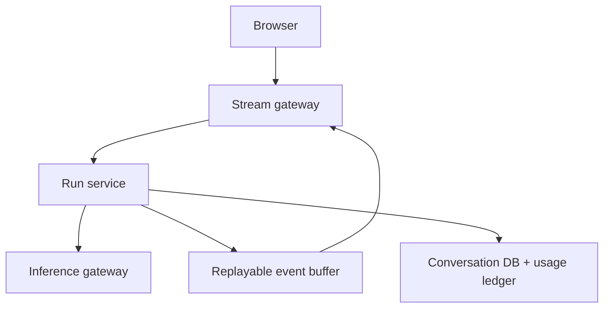

<!-- Adapted into Fundamentals bank from OpenAI/openai-playground-system-design.md for cross-company prep. -->

# System Design: OpenAI Playground

> **Focus areas:** UI/wireframes · Prompt configuration · Conversation threads · APIs · Persistence · Streaming · Experimentation  
> **Style:** End-to-end product design with progressive scale (10× → 100× → 1,000×)  
> **API orientation:** Responses / Conversations style (2026), not Chat Completions–centric

---

## Table of Contents

1. [Clarify Requirements (Interview Q&A)](#1-clarify-requirements-interview-qa)
2. [Back-of-the-Envelope Estimation](#2-back-of-the-envelope-estimation)
3. [High-Level Design](#3-high-level-design)
4. [Architecture Diagram](#4-architecture-diagram)
5. [Design Deep Dive](#5-design-deep-dive)
6. [Wrap-Up](#6-wrap-up)
7. [Deeper / Related Interview Questions](#7-deeper--related-interview-questions)

---

## 1. Clarify Requirements (Interview Q&A)

The goal of this phase is to **bound the problem**: what we build, what we defer, and at what scale we must succeed.

### 1.1 Functional Requirements

| # | Question to ask | Expected / typical interviewer answer | Design implication |
|---|-----------------|----------------------------------------|--------------------|
| F1 | Who is the primary user? Developers experimenting, end consumers, or enterprise teams? | Developers and power users prototyping prompts; **not** a consumer ChatGPT clone | Optimize for configurability, inspectability, reproducibility, and comparison—not social chat |
| F2 | What makes this Playground rather than ChatGPT? | Side-by-side runs, regenerate-with-one-knob-changed, raw request/response inspector, per-run metrics/cost, copy-as-code, structured-output editor, fork-from-run | Experimentation is a **first-class product surface**, not a footnote |
| F3 | What models do we support? | Multiple models; catalog is dynamic from a Model Registry; capabilities differ per model | Capability-driven config UI; resolve alias → immutable model version at run start |
| F4 | Core UI surfaces? | (1) Conversation canvas, (2) Config panel, (3) Conversation list, (4) Run inspector / compare view | SPA: left conversations, center items + runs, right config, bottom/drawer inspector |
| F5 | Prompt configuration knobs? | Instructions/system, temperature, top_p, max output tokens, penalties, stop, response format / JSON schema, seed, tools, reasoning effort (model-dependent) | Persist workspace defaults + per-run immutable snapshots; presets are versioned |
| F6 | Conversation model? | Create / rename / delete / continue; **fork from any prior run**; share is Phase 2 | Conversation = ordered Items + Response/Run DAG; branching via parent pointers |
| F7 | Streaming required? | Yes — token streaming is a hard UX requirement | POST + `text/event-stream` via `fetch`/`ReadableStream` (not native `EventSource`) |
| F8 | Stream resume after disconnect / crash? | **MVP:** show incomplete + Retry. **Later:** decoupled Run Service with replayable event buffer | Do not promise seamless continuation in MVP; see §3.5 |
| F9 | Auth & tenancy? | Logged-in users; workspaces/projects for orgs later | `tenant_id` / `project_id` / `user_id` on all rows from day 1; shard by tenant |
| F10 | File / image / tool calling? | Text MVP; multimodal + tools Phase 1.5 | `ContentPart[]` polymorphism from day 1 even if only text ships |
| F11 | Rate limits / billing visibility? | Show estimated + actual cost; enforce tenant/project quotas | Soft reservation in Redis + append-only billing ledger keyed by `run_id` |
| F12 | Context overflow behavior? | **Never silently alter developer prompts** | Reject with precise token explanation, or require explicit truncation/compact policy |

**MVP functional scope (lock this with interviewer):**

1. Authenticated user opens Playground in a workspace.
2. Configure model + sampling params + instructions (capability-driven form).
3. Atomic **create run** on a conversation; receive **streamed** output events.
4. Persist conversations, items, and runs; reload history with run snapshots.
5. Explicit **Stop** cancels inference; browser disconnect policy is product-decided (MVP: detach viewer, optionally keep run if Run Service exists; otherwise cancel with BFF).
6. Experimentation basics: regenerate, compare two runs side-by-side, raw request/response inspector, per-run TTFT/latency/tokens/cost, “Copy as curl/Python/JS”.
7. Usage metering, quota reservation/reconciliation, rate limiting.
8. Context overflow: reject or explicit policy—**no silent truncation**.

**Out of MVP (explicitly defer):**

- Public sharing / multi-user collab editing
- Strong multi-gateway stream replay (keep as scale/Phase-2 architecture)
- Fine-tuning UI
- Multi-agent orchestration
- Mobile native apps / offline mode
- Zero-retention enterprise mode (design hooks only)

### 1.2 Non-Functional Requirements

| # | Question | Expected answer | Target |
|---|----------|-----------------|--------|
| N1 | Latency to first token (TTFT)? | Feels interactive | p50 < 500ms, p99 < 2s (excluding model cold start) |
| N2 | Streaming smoothness? | No multi-second stalls mid-stream | Chunk flush ≤ 50–100ms once tokens arrive |
| N3 | Availability? | Playground important, not payments-critical | 99.9% control plane; inference depends on model fleet |
| N4 | Durability invariants? | No lost committed runs; clear partial RPO | User input durable **before** inference; `response.completed` only after final output + usage durable; partial checkpoint RPO ≈ **1s** |
| N5 | Consistency? | Read-your-writes in home cell | Strong in home writable cell; eventual for analytics/search |
| N6 | Multi-region model? | Not naive active-active for conversations | Stateless gateways global; **single-writer home cell** per tenant/workspace |
| N7 | Security / privacy? | Prompts may contain secrets | TLS, encryption at rest, IDOR-safe IDs, optional zero-retention later |
| N8 | Safety vs streaming? | Streaming makes moderation harder | Buffering / inline classifiers / post-checks with explicit latency trade-off |
| N9 | Cost efficiency? | Inference dominates | No shared completion cache by default; cache catalog + conversation lists |

### 1.3 Cases (User Flows & Edge Cases)

**Happy paths**

1. New conversation → configure → create run → stream deltas → completed run with usage/cost.
2. Reload → conversation list → open conversation → items + prior runs + last config restored.
3. Stop → run `cancelled`, partial output durable, quota reconciled.
4. Regenerate with one parameter changed → new run forked from same input leaf; side-by-side compare.
5. Context too large → server rejects with token breakdown → user picks explicit truncate/compact → new run with policy recorded in snapshot.
6. Inspect run → see effective input, resolved model version, raw provider request/response, timings.

**Edge / failure cases**

| Case | Behavior |
|------|----------|
| Model overloaded / 503 | Bounded admission queue; short deadline; “model busy”; no unbounded Kafka wait for interactive UX |
| Context window exceeded | **Reject** or require explicit policy; show which items would drop; preserve tool-call/result groups |
| Duplicate submit | Idempotency-Key on `POST .../runs`; same key+body → same run; different body → `409` |
| Network drop mid-stream | MVP: load partial via `GET /runs/{id}`; offer Retry. Strong design: reconnect with `after_sequence` |
| Browser disconnect vs Stop | **Stop** cancels inference. **Disconnect** detaches viewer; cancel only if coupled BFF owns the run (MVP) |
| Cancellation races completion | Single terminal transition via compare-and-set; loser is no-op |
| Content filtered | Typed safety event; may truncate visible stream; persist safety outcome on run |
| Extremely long conversation | Paginate items; virtualize UI; do not silently summarize |
| Concurrent tabs | Optimistic concurrency via `expected_leaf_id`; conflict → `409` with current leaf |
| Client too slow to consume deltas | Bound gateway buffer; apply backpressure; disconnect slow consumer; run may continue (strong) or cancel (MVP) |
| Model alias changes mid-run | Run stores **resolved model version** at admit time; alias mutation does not alter in-flight run |

### 1.4 Scales (Progressive)

Establish a **baseline**, then stress-test at 10× / 100× / 1,000×.

| Metric | Baseline | 10× | 100× | 1,000× |
|--------|----------|-----|------|--------|
| MAU | 100K | 1M | 10M | 100M |
| DAU | 20K | 200K | 2M | 20M |
| Concurrent streaming sessions (peak) | 2K | 20K | 200K | 2M |
| Runs / day | 500K | 5M | 50M | 500M |
| Avg tokens in+out / run | ~2K | ~2K | 2–4K | 2–4K |
| Peak **output** tokens/sec | ~53K | ~530K | ~5.3M | ~53M |
| Conversations / user (avg stored) | 50 | 50 | 80 | 100 |
| Items / conversation (avg) | 20 | 20 | 30 | 40 |
| Stored items (order of) | ~100M | ~1B | ~24B | **~400B** |
| Read QPS (list + open) | 1K | 10K | 100K | 1M |
| Postgres durable writes (peak, order) | ~0.2–1K | ~2–10K | ~20–100K | ~0.2–1M |
| Redis checkpoint ops (peak) | ~2–10K | ~20–100K | ~0.2–1M | ~2–10M |
| Stream events/sec (if batch 20 tokens/event) | ~2.6K | ~26K | ~260K | **~2.6M** |
| Kafka analytics/usage events (peak) | ~1–5K | ~10–50K | ~0.1–0.5M | ~1–5M |

**Stored-item math (1,000×):**

```text
100M MAU × 100 conversations/user × 40 items/conversation ≈ 400B items
(Not 100B — that undercounted by 4×.)
```

**What each jump forces architecturally:**

- **10×:** Connection-heavy streaming needs a dedicated gateway tier; Redis for quotas/partials; Postgres read replicas; separate write classes (see §2.4).
- **100×:** Shard by **`tenant_id` / `workspace_id`** (not only `user_id`); hot path (runs/streaming) vs cold path (history); object storage for attachments/archives; CDN for SPA.
- **1,000×:** Cell architecture + home-region single-writer; global directory; cold tiering; decoupled Run Service + replay buffer if resume is required; fair multi-tenant scheduling.

### 1.5 Etc. (Constraints & Assumptions)

Ask and record:

- **Single cloud vs multi-cloud?** One primary cloud + multi-AZ; multi-region DR.
- **Build inference or call internal Model Serving API?** Playground is a **client of an Inference Gateway**.
- **Web only?** Yes for MVP; responsive web.
- **API dogfooding?** Playground uses the same **Responses / Conversations–style** public API shapes internally.
- **Data retention?** Free tier TTL (e.g. 30 days); paid longer — soft-delete + staged purge across DB, cache, search, archives.
- **Disconnect policy?** Confirm with interviewer: MVP coupled cancel vs Phase-2 background completion.

**Scope statement to repeat back:**

> Design a web OpenAI-style **Playground** (experimentation product): Responses-style runs with streaming, durable conversations/items/runs, transparent context handling, usage-aware quotas, starting at ~20K DAU and evolving cleanly to 1000×. Inference is a dependency via an Inference Gateway. MVP does not promise seamless stream resume across BFF failure.

---

## 2. Back-of-the-Envelope Estimation

### 2.1 Traffic (requests)

**Baseline peak concurrent streams:** 2,000  
Assume each stream holds a connection for avg **30s**.

```text
Connection concurrency ≈ 2,000
Gateway rule of thumb: 10K–50K concurrent SSE-style conns / fat event-loop node
→ Start with 4–8 streaming gateway nodes (N+2)
```

**Runs/day:** 500K → ≈ **6 QPS average**, **~60–100 QPS peak** (10–15× peak factor).

At **1,000×:** 500M/day → ≈ **6K QPS avg**, **~60–100K QPS peak** runs.

### 2.2 Token throughput (more important than run QPS)

```text
Baseline peak output throughput
≈ 2,000 active streams × 800 output tokens / 30 s
≈ 53,000 output tokens/second

1,000×
≈ 53 million output tokens/second globally
```

If the gateway batches **20 token deltas** into each SSE event:

```text
Baseline ≈ 53K / 20 ≈ 2.6K stream events/s
1,000×  ≈ 53M / 20 ≈ 2.6M stream events/s
```

This drives connection gateway CPU, framing cost, and replay-buffer write rates—not Postgres.

### 2.3 Bandwidth

Assume average streamed response **800 tokens ≈ 3.2 KB** text; with SSE framing ~**5 KB** egress / run.

```text
Baseline: 500K × 5 KB ≈ 2.5 GB/day egress (trivial)
1,000×:  500M × 5 KB ≈ 2.5 TB/day   ← not PB
```

Still manageable with regional egress + HTTP/2; images/attachments later dominate. At 1,000×, geography and compression matter more than raw GB/day.

### 2.4 Separate write classes (do not lump “write QPS”)

| Write class | What | Baseline peak (order) | 1,000× (order) | Store |
|-------------|------|------------------------|----------------|-------|
| **Postgres durable writes** | Create run TX (input item + run + output placeholder + idempotency + outbox); terminal update | ~0.2–1K/s | ~0.2–1M/s → **must shard / cell** | Postgres |
| **Redis checkpoints** | Partial output every ~1s or N tokens | ~2–10K/s | ~2–10M/s | Redis / Streams |
| **Stream events to browser** | SSE frames (batched) | ~2.6K/s | ~2.6M/s | Gateway memory / replay buffer |
| **Kafka / analytics** | Usage, audit, search index jobs | ~1–5K/s | ~1–5M/s | Kafka |

**Anti-pattern:** counting “2K write QPS” that mixes all four. Interviewers will ask you to split them.

### 2.5 Storage

```text
Item size avg (text + metadata): ~2 KB

Baseline: ~100M items × 2 KB ≈ 200 GB raw (~400 GB with indexes)

1,000× items: ~400B × 2 KB ≈ 800 TB raw
+ indexes, replication, backups, WAL → commonly **2–4 PB** unless retention
  materially cuts retained items (TTL, cold delete, zero-retention modes)
```

**Archive strategy:** operational cold store = **per-conversation or per-segment compressed objects + manifest** for random retrieval. Emit **Parquet separately** for analytics—not as the OLTP archive format for “open this old thread.”

### 2.6 Stream persistence write amplification

```text
Naive: 800 tokens/run × 500K runs/day = 400M OLTP row writes/day → fatal
```

**Design:** buffer in memory / Redis (or replay stream); **one durable finalize** on terminal state; checkpoints for RPO≈1s. At 1,000× with strong resume: append-only regional event buffer, not row-per-token Postgres.

### 2.7 Memory (gateway)

```text
Per connection state: ~50–100 KB (buffers, auth, partial window)
2K conns  → ~100–200 MB
2M conns  → ~100–200 GB across the fleet   ← not 100–200 TB
```

Still requires **sharding connection gateways** and terminating near users; a single cluster cannot hold 2M conns operationally even if RAM theoretically fits in a large fleet.

### 2.8 Cache

| Data | Size | TTL | Hit goal |
|------|------|-----|----------|
| Model catalog + capability schemas | < few MB | 30–60s | ~100% |
| Quota reservation counters | tiny | seconds | Redis |
| Conversation list per user/project | ~50 KB | 30–60s + write | high |
| Hot conversation item tail | medium | short + invalidate | medium |
| Presets | small | minutes | high |

**Do not** shared-cache model outputs in Playground (privacy + non-determinism). Provider-side KV/prompt caching is compute reuse, not a shared response cache.

---

## 3. High-Level Design

### 3.1 Product / UI Wireframes (Experimentation-first)

```text
+--------------------------------------------------------------------------------+
| Logo  Playground   Project: Acme v    Model: gpt-4o v    Usage $1.20   [User] |
+--------------+------------------------------------------+----------------------+
| CONVERSATIONS|  ITEMS / RUNS                            | CONFIG               |
|              |                                          | (capability-driven)  |
| [+ New]      |  [System/Instructions]                   | Model / version      |
|              |  ...                                     | Temperature          |
| o Bug fix    |  User: Explain EXPLAIN ANALYZE           | Max output           |
| * SQL help   |                                          | Schema / tools       |
| o Rewrite    |  Run r_92  completed  420ms TTFT  $0.01  | Reasoning effort     |
|              |  Assistant: ...                          |                      |
|              |                                          | [Save preset]        |
|              |  [Compare r_91 | r_92]  [Inspect]        | [Copy as code]       |
|              |  [ Composer...              ] [Stop][Run]|                      |
+--------------+------------------------------------------+----------------------+
| INSPECTOR: effective input | raw request | raw response | events | cost/latency |
+--------------------------------------------------------------------------------+
```

**Compare view (side-by-side):** two runs sharing the same input leaf, different config snapshots; diff config JSON; show metric deltas (TTFT, tokens, cost).

**UI state machine (client):**

```text
Idle → CreatingRun → Streaming → Idle
                   ↘ Incomplete (offer Retry)
                   ↘ Failed / Cancelled / Filtered
```

**Client responsibilities:**

- Optimistic input item (reconcile with server IDs from `response.created`)
- `fetch` + `ReadableStream` SSE parser (native `EventSource` is **GET-only**—cannot POST)
- Track `sequence` for gap/dup detection; reconnect protocol is app-built
- Virtualized item list; draft autosave (IndexedDB)
- AbortController for **Stop** (explicit cancel API), distinct from tab close
- Inspector + compare panes driven by run snapshots

Server remains SoT for committed items/runs after ACK.

### 3.2 Core Domain Model

`Thread → Message → GenerationRequest` is too narrow. Use:

```text
Tenant / Project / User
  └── Conversation
        ├── Item[]                          # append-only conversation DAG nodes
        │     ├── Message { role, ContentPart[] }
        │     ├── ToolCall
        │     ├── ToolResult
        │     └── AttachmentReference
        └── Response / Run                  # unit of generation + billing + metrics
              ├── immutable RequestConfigSnapshot
              ├── resolved ModelSnapshot (id, version, capabilities used)
              ├── input item references (+ expected_leaf_id)
              ├── output item references (candidates N>=1)
              ├── ContextPolicySnapshot (reject | truncate_explicit | compact_opt_in)
              ├── status + termination_reason
              ├── safety_outcome
              ├── usage + cost ledger pointer
              ├── provider_request_id
              └── latency / trace metadata (TTFT, total, queue_wait)
```

**Content** is `ContentPart[]` (text, image_ref, audio_ref, …) stored as JSONB—not a single `TEXT` column pretending to be forever-text.

**The Run owns** (not the assistant message alone):

- Model alias requested + **resolved version**
- Sampling / tools / output schema / reasoning effort
- Context-management decision
- Token usage, cost, safety, timings, provider IDs

**Run state machine:**

```text
created → admitted → queued → in_progress
                              ├→ completed
                              ├→ incomplete   # durable partial, non-success terminal
                              ├→ failed
                              └→ cancelled
```

Only **one** terminal transition wins (CAS / conditional update).

### 3.3 API Shape (Responses / Conversations style)

Dogfood a **Responses-style** API. Conversations hold durable state; runs create outputs. (Chat Completions may exist as a compatibility shim; do not center the design on it.)

| Method | Path | Purpose |
|--------|------|---------|
| GET | `/v1/models` | Catalog + capability schemas |
| GET/POST | `/v1/conversations` | List / create |
| PATCH/DELETE | `/v1/conversations/{id}` | Rename / archive / soft-delete |
| GET | `/v1/conversations/{id}/items` | Paginated items |
| **POST** | **`/v1/conversations/{id}/runs`** | **Atomic create-and-start run** (stream optional) |
| GET | `/v1/runs/{id}` | Run status + output snapshot |
| GET | `/v1/runs/{id}/events?after_sequence=N` | Reconcile / replay (strong design) |
| POST | `/v1/runs/{id}/cancel` | Explicit Stop |
| POST | `/v1/runs/{id}/fork` | New run from prior input + patched config |
| GET | `/v1/runs:compare?left=&right=` | Compare metadata (or client-side from two GETs) |

**Atomic create-and-run** (preferred over separate “POST message” + “POST completion”):

```http
POST /v1/conversations/{conversation_id}/runs
Idempotency-Key: idem_...
Content-Type: application/json

{
  "expected_leaf_id": "item_...",
  "input": [
    { "type": "message", "role": "user", "content": [{"type":"text","text":"..."}] }
  ],
  "configuration": {
    "model": "gpt-4o",
    "temperature": 0.7,
    "max_output_tokens": 2048,
    "response_format": {"type": "json_schema", "schema": {...}},
    "tools": [],
    "context_policy": "reject_if_overflow"
  },
  "stream": true,
  "n": 1
}
```

**Single DB transaction creates:**

1. Input item(s) (durable **before** inference begins)
2. Run/response record (`created` → `admitted`)
3. Output placeholder item(s)
4. Immutable configuration + resolved model snapshots
5. Idempotency record (key, body hash, run_id)
6. Dispatch outbox row (or direct dispatch after commit)

Same POST may return `text/event-stream`. Non-stream clients poll `GET /runs/{id}`.

**Idempotency rules:**

| Rule | Behavior |
|------|----------|
| Scope | `tenant_id` + `project_id` + route |
| Body hash | Canonical JSON hash stored with key |
| Same key + same body | Return original run (or attach to in-progress stream) |
| Same key + different body | **`409 Conflict`** |
| In-progress duplicate | Return `202`/`200` with same `run_id` + stream attach instructions |
| Expiration | e.g. 24h; durable unique constraint in Postgres is SoT |

**SSE event envelope** (typed, sequenced):

```json
{
  "event_id": "evt_...",
  "sequence": 42,
  "response_id": "resp_...",
  "item_id": "item_...",
  "output_index": 0,
  "type": "response.output_text.delta",
  "delta": "Hello"
}
```

Representative event types: `response.created`, `response.in_progress`, `response.output_text.delta`, `response.output_item.done`, `response.completed`, `response.incomplete`, `response.failed`, `response.cancelled`, safety events.

`sequence` detects duplicates and gaps. **`Last-Event-ID` is not free:** native `EventSource` cannot POST; with `fetch` streaming you implement reconnection yourself (`after_sequence` query on `/events`).

**Why SSE over WebSocket for ordinary Playground text?**

| | SSE (POST + fetch stream) | WebSocket |
|--|---------------------------|-----------|
| Direction | Mostly server → client | Bidirectional |
| Infra | HTTP/2, standard LBs | Upgrade + idle tuning |
| Fit | Text deltas, tools with short round-trips | Long tool-heavy bidirectional sessions |
| Cancel | `POST /cancel` + abort body stream | Client frame |

SSE remains the default. WebSocket mode is a later option for long tool loops—not MVP.

### 3.4 High-Level Component Architecture

**MVP (coupled streaming — simpler, honest about resume):**

```text
                 +-------------+
                 |  CDN / Web  |  SPA
                 +------+------+
                        |
                 +------v------+
                 | API Gateway |  Auth, TLS, WAF, tenant→cell routing
                 +------+------+
        +---------------+----------------+
        |               |                |
        v               v                v
 Conversation     Streaming BFF     Quota / Billing
 Service          (owns browser     (Redis reserve +
 (CRUD)            + inference      ledger worker)
        |           connections)
        v               |
   Postgres             +-- checkpoints --> Redis
   (home cell)          |
                        v
                 Inference Gateway --> Model Serving
                        |
                        +-- usage outbox --> Kafka --> Billing ledger / analytics
```

**Phase-2 / 1000× strong resume (decouple generation from delivery):**

```text
Browser --> Stream Gateway --> (subscribe run_id, after_sequence)
                 ^
                 | replay
         Replayable event buffer (Redis Streams / NATS JetStream)
                 ^
                 | append sequenced events
            Run Service  --> Inference Gateway
                 |
                 v
         Conversation DB + usage ledger
```

- **Run Service** owns the inference RPC.
- Events get monotonic `sequence` numbers into a **regional replay buffer**.
- **Stream Gateway** only delivers events (stateless, non-sticky OK).
- Reconnect: `GET /v1/runs/{id}/events?after_sequence=N`.
- Terminal `response.completed` emitted only after durable commit of output + usage.

### 3.5 Stream ownership: resolve the contradiction

These cannot all be true at once:

1. BFF owns the upstream inference connection  
2. Redis holds partial checkpoints  
3. Sticky sessions are unnecessary  
4. Another BFF can **seamlessly continue** the live inference stream  

Redis can replay **already checkpointed text**; it cannot attach a new BFF to an inference RPC owned by a dead process.

#### Option A — Simpler MVP (choose this unless interviewer demands resume)

| Property | Choice |
|----------|--------|
| Ownership | BFF owns browser stream **and** inference stream |
| BFF crash | Generation **terminates** |
| Redis role | Recent partial for RPO≈1s; UI shows **incomplete** + **Retry** |
| Sticky routing | Helpful for reconnect-to-same-pod UX, **not required** for correctness |
| Promise | **No** seamless continuation across BFF failure |
| Disconnect | MVP default: treat as cancel **or** (product choice) cancel after grace period |
| Stop button | Always explicit cancel of inference |

This is reasonable for a 99.9% Playground.

#### Option B — Strong resumable design

Separate **Run Service** (generation) from **Stream Gateway** (delivery) as in §3.4. Then non-sticky delivery + replay are real. Cost: more moving parts, buffer retention, exactly-once-ish terminal commit discipline.

#### Product distinctions (must say out loud)

| Event | Meaning |
|-------|---------|
| **Stop** | User cancels inference |
| **Browser disconnect** | Detach viewer; cancel only if coupled design / policy says so |
| **Gateway/BFF failure** | Run continues **only** in Option B |

**Doc decision:** MVP = **Option A**. Call out Option B as the 100×–1,000× evolution if resume SLOs demand it.

### 3.6 Option Analysis & Trade-offs

#### A. Persistence store

| Option | Pros | Cons | Deal-breaker |
|--------|------|------|--------------|
| **Postgres (partitioned / Citus / app shards)** | Transactions for atomic run creation; strong consistency | Hot cells at extreme scale | Fine through ~100× with cells; shard earlier if measured limits hit |
| Cassandra / Scylla | Write throughput | Weak multi-row TX for atomic run create | Painful for idempotency + CAS terminals |
| DynamoDB | Managed scale | Careful indexes; cost | AWS-centric multi-region |

**Choice:** Postgres SoT in home cell. **Vitess is MySQL sharding—not a Postgres option.** For Postgres use Citus, native partitioning + app directory, or similar.

**Shard key:** `tenant_id` / `workspace_id` (org-shared conversations must not span shards). Huge tenants may get **directory overrides** to shard conversations independently.

#### B. Partials buffer

| Option | MVP | Strong resume |
|--------|-----|---------------|
| Memory on BFF | OK + lose on crash | Insufficient alone |
| Redis blob / Streams checkpoint | RPO≈1s partial for Retry UX | Events sequenced for replay |
| Kafka as interactive wait queue | **No** for admission | OK for analytics/outbox |

#### C. Finalize timing

Emit `response.completed` **only after** final output + usage row are durable (sync in TX or confirmed fsync path). Async billing projection from outbox is fine; lying to the UI about completion is not.

#### D. Monolith → services

| Phase | Structure |
|-------|-----------|
| Baseline–10× | Modular monolith: conversation API + stream worker |
| 100× | Split Stream Gateway, Run Service, Conversation, Quota |
| 1000× | Cells; optional Option B replay; per-model admission |

#### E. Load balancing

- LB idle timeouts ≥ max generation time (or heartbeats)
- HTTP/2 to clients
- Sticky **not required** for Option B; optional convenience for Option A
- Deal-breaker: 60s idle timeout killing long runs

### 3.7 Progressive Scale Evolution

**Baseline:** SPA → Gateway → Monolith (Conversation + Stream) → Postgres + Redis → Inference.

**10×:** Dedicated stream tier; read replicas; Kafka for usage/analytics; idempotency table; HPA on connections.

**100×:** Tenant/workspace cells; object storage attachments + operational archives; connection gateway; bounded per-model admission queues; fair scheduling.

**1000×:** Global directory (tenant → home cell); multi-region DR with explicit RPO/RTO; Option B if resume required; cold object archives + separate analytics Parquet; inference affinity for prefix cache where valuable.

**Not default:** CRDTs for conversations. Prefer conversation DAG + `expected_leaf_id` optimistic concurrency + single-writer home cell.

---

## 4. Architecture Diagram

### 4.1 End-to-End (MVP Option A)

```text
+--------+  POST /runs + SSE   +---------------+  gRPC stream  +------------------+
| Browser|--------------------->| Streaming BFF |-------------->| Inference Gateway|
|  SPA   |<---------------------| (coupled)     |<--------------|                  |
+---+----+  sequenced events    +-------+-------+               +--------+---------+
    |                                   |                                |
    | GET conversations                 | checkpoint ~1s                 v
    |                                   v                         +-------------+
    |                            +------+------+                  | Model Pods  |
    v                            | Redis       |                  +-------------+
+---+----------+                 | partials +  |
| Conversation |                 | reservations|
| Service      |                 +------+------+
+---+----------+                        |
    |                                   | terminal finalize
    v                                   v
+---+----------+                 +------+------+                 +-------------+
| Postgres     |<----------------| finalize TX |---- outbox ---->| Kafka       |
| (home cell)  |                 | + CAS state |                 | usage/audit |
+--------------+                 +-------------+                 +-------------+
                                      |
                                      v
                               Billing ledger (append-only by run_id)
```

### 4.2 Strong Resume (Option B)



### 4.3 Sequence: Atomic `POST .../runs` (stream)

```text
Client        API/BFF         Postgres              Redis         Inference
  |              |               |                    |              |
  | POST /runs  |               |                    |              |
  |------------->| BEGIN TX      |                    |              |
  |              |-------------->| insert items+run+  |              |
  |              |               | idempotency+outbox |              |
  |              |               | (input durable)    |              |
  |              | reserve quota |                    |              |
  |              |----------------------------------->|              |
  |              | COMMIT        |                    |              |
  |  SSE response.created        |                    |              |
  |<-------------|               |                    |              |
  |              | open inference|                    |              |
  |              |-------------------------------------------------->|
  |              | delta...      |                    |              |
  |  SSE delta   |<--------------------------------------------------|
  |<-------------| checkpoint    |                    |              |
  |              |----------------------------------->|              |
  |              | CAS -> completed + usage + ledger outbox          |
  |              |-------------->|                    |              |
  |  SSE response.completed (only after durable)      |              |
  |<-------------|               |                    |              |
```

Orphan user messages from “POST message then POST completion never came” **cannot happen**—one atomic operation.

### 4.4 Multi-region / cell model (clarify “active-active”)

```text
                 Global Directory (tenant/workspace → home cell)
                              |
              +---------------+---------------+
              v               v               v
         Cell A            Cell B          Cell C
         [writable PG]     ...             ...
         [Redis][Run/BFF]
              \               |               /
               \              v              /
                Regional Inference Pools (capacity + policy)

Stateless API/stream gateways: active-active globally (route to home cell).
Conversation writes: single-writer home cell only.
Cross-region replicas: DR + optional stale reads.
Failover: explicit RPO/RTO runbook (promote secondary, freeze stale writers).
```

---

## 5. Design Deep Dive

### 5.1 Reliability — invariants, races, retries, limits

#### 5.1.1 Hard invariants

1. **Input durability before inference:** user/input items committed before model call.
2. **Single terminal transition:** `UPDATE runs SET status=$terminal WHERE status='in_progress' AND id=?` (CAS); loser is no-op.
3. **`response.completed` after durability:** final output items + usage record durable before terminal event.
4. **Partial RPO declared:** checkpoints ≤ ~1s; on crash, UI may miss up to RPO tokens → `incomplete` + Retry.
5. **Quota reservation exactly-once reconcile:** reserve on admit; release/settle on terminal (including cancel/fail); sweeper repairs leaks.
6. **Billing ledger append-only** keyed by `run_id` (and usage line ids)—not “Redis counters are billing.”
7. **Orphan sweeper:** runs stuck in `queued` / `in_progress` past deadline → `failed`/`incomplete`, release reserves, cancel inference if still live.

#### 5.1.2 Data-loss & dual-write

| Risk | Mitigation |
|------|------------|
| BFF crash (MVP) | Partial in Redis; run → `incomplete`; Retry new run (idempotent new key) |
| Run Service crash (Option B) | Buffer + another gateway replays; run ownership in Run Service with lease |
| Postgres down at finalize | Retry finalize from buffer; do not emit `completed` early |
| Billing dual-write | Outbox in same TX as terminal transition → ledger worker |
| Duplicate inference charge | Idempotency + **no auto-retry after first token**; retries create new `run_id` only on user action |
| Soft delete | Tombstone; staged purge: primary → cache → search → archive → backups policy |

#### 5.1.3 Cancellation vs completion race

```text
Stop arrives while model finishes:
  both attempt CAS to terminal
  winner persists that terminal reason
  loser no-ops
  quota reconcile once
  client may see completed OR cancelled — never both
```

#### 5.1.4 Retries, deadlines, admission

| Layer | Policy |
|-------|--------|
| Client → API | Idempotent retry with same Idempotency-Key |
| API → Inference | Retry only **before first token** within budget; circuit breaker per model pool |
| Interactive admission | Short deadline queues **per model**; fair scheduling by tenant weight—not infinite Kafka backlog |
| User Retry | New run; optionally continue-from-partial as explicit prefix (model-dependent)—never silent |

Propagate deadlines (`timeout_ms`) end-to-end. Bound retry budgets. Shed load with `429`/`503` + `Retry-After`.

#### 5.1.5 Rate limiting & quota reservation

**Dimensions:** RPM, TPM (estimate then reconcile), concurrent runs, per-model capacity.

```text
ADMIT:
  reserve estimated tokens + concurrency slot (Redis)
  if fail -> 429
ON TERMINAL:
  settle actual usage to ledger; adjust TPM windows; release concurrency
SWEEPER:
  expire reservations for dead runs
```

**Fairness at 1,000×:** hierarchical limits (user → project → tenant → model pool); isolate abusive tenants; weighted fair queueing so one enterprise cannot starve thousands of small users.

#### 5.1.6 Backpressure & slow clients

- Bound per-connection outbound buffer.
- Apply backpressure to inference read loop when possible.
- Disconnect slow consumers; in Option A this may cancel; in Option B run continues and client catches up via `/events`.
- Never unbounded-queue tokens in gateway heap.

#### 5.1.7 Streaming safety / moderation

Streaming shows tokens **before** full-output evaluation—OpenAI docs call this out as a moderation challenge.

Design levers (pick with interviewer):

| Approach | UX | Safety |
|----------|----|--------|
| Stream immediately + async post-check | Best TTFT | May briefly show unsafe text; then redact/`incomplete` |
| Buffer first N tokens / first sentence | Slightly worse TTFT | Better early filter |
| Inline classifier on rolling window | Medium | Ongoing cost/latency |
| Non-stream for high-risk modes | Worst TTFT | Strongest |

Persist `safety_outcome` on the run. Emit typed safety events. Prefer **fail closed** for policy blocks.

### 5.2 Scalability

#### 5.2.1 Scale up/down

| Component | Trigger | Strategy |
|-----------|---------|----------|
| SPA/CDN | global hits | immutable asset cache |
| Stream gateway | conns, CPU, RSS | HPA/KEDA on connections; warm pools; long drain |
| Run Service (B) | active runs | scale on in-flight runs + CPU |
| Conversation API | QPS, p99 | HPA; primary for writes; replicas for reads |
| Postgres | CPU, disk, conns, p99 | PgBouncer; partition; **shard when measured** (see below) |
| Redis | memory/CPU | cluster; split quota vs cache vs stream buffer |
| Kafka | consumer lag | partition by tenant; not interactive wait queue |
| Inference | queue depth, TTFT | separate autoscaling; Playground soft-fails |

**When to shard Postgres (measurement, not folklore “100×”):**

- Primary CPU or IOPS saturated after tuning
- Table/index size hurts vacuum/autovacuum & p99
- Connection storm despite pooling
- Blast radius / noisy neighbor requirements
- Backup/restore RTO exceeds SLO

#### 5.2.2 Storage scaling

1. Partition items/runs by time or hash within a cell.
2. Hot/cold: aged conversations → **compressed per-conversation objects + manifest**; metadata stays queryable.
3. Analytics → separate Parquet pipelines.
4. Indexes: `(tenant_id, project_id, updated_at DESC)` for lists; `(conversation_id, sequence)` unique for items—**unique constraint already creates an index; do not add a redundant duplicate index**.
5. Attachments in object storage; DB holds references.

#### 5.2.3 Context management (transparency — no silent mutation)

Playground rule: **developers must see the exact effective input.**

Preferred order:

1. **Reject** with precise token counts: limit, used, overflow, tokenizer/model.
2. Offer **explicit** truncation policy in UI; preview **which items** would be removed.
3. Opt-in **compact/summarize** action that creates a new item and records policy in the run snapshot.
4. Preserve complete **tool-call / tool-result** groups (never orphan a result).
5. Inspector shows effective input bytes/tokens actually sent.

Silent rolling summaries that replace history are a **deal-breaker** for an experimentation product—they change behavior and hide errors.

#### 5.2.4 Parallelization & fanout

- Page load: parallel conversation list + model catalog.
- Side-by-side compare: two runs; optionally limited parallel `n` candidates under quota.
- Shared-view fanout (Phase 2): one run publisher → Redis/NATS → many SSE subscribers; never N inference streams.

#### 5.2.5 Multi-region summary

| Plane | Mode |
|-------|------|
| Stateless gateways | Active-active globally |
| Tenant/workspace data | Single writable home cell |
| Replicas | DR + optional stale read |
| Failover | Explicit RPO/RTO; directory update; fence old primary |
| Inference | Route to allowed region with capacity; co-locate when possible |
| Shard key | `tenant_id`/`workspace_id` + directory overrides for huge tenants |

### 5.3 Maintainability

#### 5.3.1 Modular boundaries

```text
/apps/web                    # SPA (compare, inspector, capability forms)
/services/conversation       # CRUD items/conversations
/services/run                # admit, execute, finalize (Split at 100×)
/services/stream-gateway     # SSE delivery / replay subscribe
/services/quota-billing      # reserve, ledger, settle
/packages/api-types          # OpenAPI + event schemas
/packages/content-parts      # polymorphic content
```

#### 5.3.2 Contract-first & schema evolution

- OpenAPI for REST; golden fixtures for SSE event types.
- **Stream schema upgrades while hour-long connections are open:** additive events only; clients ignore unknown `type`; version field in envelope; break only on new major route.
- Model aliases mutable; **resolved version immutable per run**.
- Capability registry drives which config knobs render; unsupported params → clear 400 with model-specific message (never silently drop).

#### 5.3.3 Observability (avoid high-cardinality death)

| Signal | Notes |
|--------|-------|
| Metrics | TTFT, tokens/sec, queue_wait, cancel rate, 429, finalize latency, checkpoint lag, CAS conflict rate — labels: model, cell, status — **not** raw `user_id`/`run_id` on metrics |
| Logs | `run_id`, `conversation_id`, tenant hashed; prompts redacted by default |
| Traces | Client → gateway → run → inference |
| High cardinality | Exemplars / trace links for individual runs; bounded tag sets |

#### 5.3.4 Testing

- Unit: idempotency hash, CAS terminal, context reject math, quota settle
- Integration: testcontainers Postgres/Redis
- Chaos: kill BFF mid-stream (MVP incomplete path); kill gateway with Option B replay
- Load: k6 concurrent SSE; slow-consumer tests
- Eval suites for model/prompt regressions (product quality)

#### 5.3.5 Experimentation features (maintain in product, not only Q&A)

| Feature | Implementation sketch |
|---------|----------------------|
| Side-by-side compare | Two `run_id`s, shared input leaf, diff snapshots + metrics |
| Regenerate one knob | `POST /runs/{id}/fork` with JSON patch on config |
| Multiple candidates | `n>1` output items under one run or N child runs |
| Raw inspector | Store redacted-able raw request/response blobs (object storage if large) |
| Per-run metrics | TTFT, total latency, tokens, estimated+actual cost on run row |
| Copy as code | Client codegen from immutable snapshot |
| Schema editor | JSON Schema validate before admit |
| Tool timeline | Items of type tool_call/result rendered as waterfalls |
| Fork from any run | New conversation branch or new leaf under same parent |
| Reproducibility | Snapshot config + resolved model + effective input; honesty: temperature>0 ⇒ not bit-exact |

### 5.4 Security & Privacy

- Auth: session cookie (Playground) + API keys for dogfood API
- Authz: every conversation/run scoped by tenant/project; ULID/UUID; continuous IDOR tests
- Encryption at rest (KMS); TLS 1.2+
- XSS: sandboxed markdown; no raw HTML
- CSRF on cookie auth
- Tools Phase-1.5: egress allowlists, no SSRF to link-local/metadata IPs, short-lived credentials, argument size limits
- Deletion propagation checklist: primary DB → Redis → search → archives → CDN → backup expiry policy
- Retention modes: standard vs future zero-retention (skip content durability; keep usage metadata)

### 5.5 UI ↔ API mapping

| UI | API |
|----|-----|
| Conversation list | `GET /conversations` |
| Config panel | Local state → `configuration` on run create; Save preset → presets API |
| Run / Send | `POST /conversations/{id}/runs` + stream |
| Stop | `POST /runs/{id}/cancel` + abort fetch body |
| Inspect | `GET /runs/{id}` (+ raw blob URLs) |
| Compare | two GETs or `runs:compare` |
| Copy as code | Client-side from snapshot |
| Reconnect (B) | `GET /runs/{id}/events?after_sequence=N` |

Server assembles conversation history for the model from durable items (client may also send patch input). Client is not SoT for history.

### 5.6 Branching / fork semantics

- Items form a **DAG/tree** via `parent_item_id`.
- Conversation stores `active_leaf_id`.
- Edit-old-message → fork sibling path; regenerate → new run + new output item(s).
- `expected_leaf_id` on create prevents lost updates across tabs.
- Materialized path optional at scale.

---

## 6. Wrap-Up

### 6.1 What we designed

An **experimentation-first OpenAI Playground**: capability-driven config, atomic Responses-style runs, typed sequenced SSE events, durable conversations/items/runs with immutable snapshots, transparent context policies, Redis reservations + append-only billing ledger, Postgres home-cell SoT, Inference Gateway dependency. MVP uses **coupled BFF streaming** with honest incomplete+Retry recovery; strong resume via Run Service + replay buffer is the scale-up path. Scale story: modular monolith → tenant cells → multi-region single-writer + DR.

### 6.2 Key decisions worth defending

1. **Playground ≠ ChatGPT** — compare, inspect, fork, copy-as-code, per-run cost/latency are MVP.  
2. **Atomic `POST .../runs`** — no orphan input items.  
3. **SSE via `fetch` streams** — not native `EventSource`; app-level `after_sequence` resume.  
4. **MVP Option A stream ownership** — no fake seamless resume across BFF death.  
5. **No silent prompt mutation** — reject or explicit context policy in run snapshot.  
6. **Run owns config/usage/safety/timings** — assistant text is an output item, not the aggregate root.  
7. **`response.completed` after durable finalize** + CAS terminal states.  
8. **Shard/home-cell by tenant/workspace**; gateways active-active; data single-writer.  
9. **Split write classes** in estimates; fix 1,000× arithmetic (TB not PB; GB not TB for gateway RAM; ~400B items).  
10. **Billing ledger by `run_id`**; Redis is reservation/cache, not the books.

### 6.3 Risks & follow-ups

| Risk | Follow-up |
|------|-----------|
| Inference latency dominates | Regional routing; warm pools; admission fairness |
| Streaming vs safety | Buffering policy; classifiers; product mode switches |
| Resume expectations | Don’t over-promise on MVP; budget Option B |
| Huge tenants | Directory override sharding |
| Retention vs 2–4 PB | TTLs, cold delete, archive manifests |
| Tool SSRF | Egress policy from day tools ship |

### 6.4 How to present in 45 minutes

1. Requirements + “why Playground” (6–8 min)  
2. Numbers with **token throughput** + corrected 1,000× (3–4 min)  
3. Domain model + atomic runs API + wireframe (8–10 min)  
4. Stream ownership Option A vs B (8 min)  
5. Invariants: durability, CAS, billing, safety (6 min)  
6. Scale/cells/multi-region (5 min)  
7. Q&A (remaining)

---

## 7. Deeper / Related Interview Questions

### 7.1 Streaming & protocols

**Q: SSE vs WebSocket vs chunked HTTP?**  
A: POST + `text/event-stream` via `fetch`/`ReadableStream` for one-way text; WS for long bidirectional tool loops. Native `EventSource` is GET-only—don’t claim it for POST bodies.

**Q: Can reconnect survive browser failure, gateway failure, and inference-worker failure?**  
A: Browser-only: reload + `GET /runs/{id}` (partial). Gateway failure with Option A: run dies → incomplete. Option B: replay from buffer. Inference-worker failure: usually incomplete/failed; may not seamlessly continue generation without model-side support.

**Q: What exactly becomes durable before the first token is shown?**  
A: Input items, run row, config/model snapshots, idempotency record, quota reservation—not the output text.

**Q: Should disconnect cancel generation?**  
A: Product choice. MVP coupled BFF often cancels (or grace then cancel). Option B can background-complete and let user fetch later—cost implications.

**Q: Slow client?**  
A: Bound buffers; backpressure; disconnect; Option B catches up via `/events`.

**Q: Why is Redis “durable enough” for partials?**  
A: It isn’t durable like Postgres. It meets **RPO≈1s** for UX partials. Terminal truth is Postgres. AOF/replication reduces but does not eliminate loss risk—state that in the interview.

**Q: Proxy buffering?**  
A: Disable buffering, flush per event, heartbeats every ~15s, watch LB idle timeouts.

### 7.2 Runs, idempotency, billing

**Q: Quota reservation vs final reconciliation?**  
A: Reserve estimate at admit; settle actual tokens on terminal; sweeper expires leases; ledger is append-only by `run_id`.

**Q: Avoid duplicate inference charges after retries?**  
A: No auto-retry after first token; Idempotency-Key dedupes admit; user Retry = new run_id; ledger unique on run_id.

**Q: Cancellation races completion?**  
A: CAS single terminal; reconcile quota once.

**Q: Model alias changes during a run?**  
A: Resolved version frozen at admit; alias map changes don’t mutate in-flight runs.

**Q: Reproducibility without determinism?**  
A: Snapshot effective input + config + model version + seed if any; disclose that temperature>0 and provider nondeterminism prevent bit-exact replay.

### 7.3 Data model, storage, indexing

**Q: Schema at hundreds of billions of items?**  
A: Cell by tenant; partition within cell; unique `(conversation_id, sequence)` (index comes with UNIQUE); archive to per-conversation objects; analytics Parquet aside.

**Q: Why not Parquet for “open old thread”?**  
A: Poor random retrieval; use object segments + manifest; Parquet for scan analytics.

**Q: Vitess for Postgres?**  
A: No—Vitess is MySQL. Use Postgres-native sharding approaches / Citus / app directory.

**Q: When do you shard?**  
A: Measured CPU/IOPS/RTO/noisy-neighbor limits—not a symbolic “100×” poster.

**Q: Deletion propagation?**  
A: Ordered purge across primary, caches, search, archives; backup lag means delayed true erasure—document retention.

### 7.4 Caching, LB, hashing

**Q: Cache completions?**  
A: Generally no in Playground; provider KV cache ≠ shared response cache.

**Q: Sticky sessions?**  
A: Optional in Option A; unnecessary in Option B if replay buffer holds events.

**Q: Consistent hashing uses?**  
A: Redis Cluster; cell assignment; optional inference affinity for prefix-cache locality (`session_id`/`tenant_id`).

### 7.5 Multi-region & fairness

**Q: Active-active conversations?**  
A: No multi-writer. Active-active gateways + single-writer home cell + DR replicas.

**Q: Evacuate a failed home region?**  
A: Fence primary, promote secondary per RPO, update global directory, drain in-flight runs (fail incomplete), verify ledger.

**Q: Fair scheduling enterprise vs many small users?**  
A: Weighted fair queues + hierarchical quotas + per-tenant concurrency; isolate noisy tenants in separate admission classes.

### 7.6 Safety, tools, observability

**Q: Streaming moderation trade-off?**  
A: Early tokens vs safety; buffer/classify/post-redact; persist safety_outcome.

**Q: Tools without SSRF / credential leakage?**  
A: Egress allowlist, block link-local/metadata, vaulted short-lived creds, argument size limits, human-in-loop for sensitive tools.

**Q: High-cardinality metrics?**  
A: No per-run_id Prometheus labels; use traces/exemplars; aggregate by model/cell/status.

**Q: Stream schema upgrade with long-lived connections?**  
A: Additive event types; ignore-unknown client policy; major version via new endpoint.

**Q: Unsupported params by model?**  
A: Capability schema server-side validation; 400 with explicit unsupported field list—never silent drop.

### 7.7 Algorithms & structures

**Q: Conversation branches?**  
A: Tree/DAG via parent pointers; active leaf; fork on edit/regenerate.

**Q: Context fit?**  
A: Tokenize/estimate; if overflow and policy=reject → error; if explicit truncate → drop oldest message pairs but keep instructions + whole tool groups; record policy on run.

**Q: Idempotency store?**  
A: Postgres unique `(tenant, key)` + body hash + run_id; Redis cache optional.

**Q: Ordering?**  
A: Monotonic `sequence` per conversation allocated in the admit TX.

### 7.8 Failure injection

1. Redis down: fail **closed** on reservations (abuse/billing); degrade compare caches.  
2. Kafka down: interactive runs still work if outbox in Postgres.  
3. Half model pods unhealthy: circuit break + admission shed.  
4. Thundering herd on new model: per-model lottery/queue.  
5. Orphan `in_progress` after deploy: sweeper + inference cancel best-effort.

### 7.9 Comparison questions

**Q: Playground vs ChatGPT?**  
A: Playground is an **experimentation workbench**—compare, inspect, fork, schemas, copy-as-code, transparent context—not a consumer assistant with memory/social features.

**Q: Playground vs public API alone?**  
A: Shared Responses semantics; Playground adds UI state, presets, compare, inspectors, and server-side conversation SoT.

---

## Appendix A — Example Tables (Postgres)

```sql
CREATE TABLE conversations (
  id              UUID PRIMARY KEY,
  tenant_id       UUID NOT NULL,
  project_id      UUID NOT NULL,
  user_id         UUID NOT NULL,
  title           TEXT NOT NULL DEFAULT 'New chat',
  status          TEXT NOT NULL DEFAULT 'active', -- active|archived|deleted
  default_config  JSONB NOT NULL,
  active_leaf_id  UUID,
  item_seq        BIGINT NOT NULL DEFAULT 0,
  created_at      TIMESTAMPTZ NOT NULL DEFAULT now(),
  updated_at      TIMESTAMPTZ NOT NULL DEFAULT now()
);
CREATE INDEX conversations_project_updated
  ON conversations (tenant_id, project_id, updated_at DESC)
  WHERE status = 'active';

CREATE TABLE items (
  id              UUID PRIMARY KEY,
  tenant_id       UUID NOT NULL,
  conversation_id UUID NOT NULL REFERENCES conversations(id),
  parent_item_id  UUID,
  sequence        BIGINT NOT NULL,
  type            TEXT NOT NULL, -- message|tool_call|tool_result|attachment_ref
  role            TEXT,          -- for messages
  content_parts   JSONB NOT NULL, -- ContentPart[]
  status          TEXT NOT NULL,
  run_id          UUID,          -- producing or consuming run
  created_at      TIMESTAMPTZ NOT NULL DEFAULT now(),
  UNIQUE (conversation_id, sequence) -- creates the supporting index; no duplicate INDEX needed
);

CREATE TABLE runs (
  id                 UUID PRIMARY KEY,
  tenant_id          UUID NOT NULL,
  project_id         UUID NOT NULL,
  conversation_id    UUID NOT NULL,
  status             TEXT NOT NULL, -- created|admitted|queued|in_progress|completed|incomplete|failed|cancelled
  termination_reason TEXT,
  expected_leaf_id   UUID,
  config_snapshot    JSONB NOT NULL,
  model_snapshot     JSONB NOT NULL, -- alias + resolved version
  context_policy     JSONB NOT NULL,
  safety_outcome     JSONB,
  usage_json         JSONB,
  cost_micros        BIGINT,
  provider_request_id TEXT,
  metrics_json       JSONB, -- ttft_ms, total_ms, queue_wait_ms
  created_at         TIMESTAMPTZ NOT NULL DEFAULT now(),
  updated_at         TIMESTAMPTZ NOT NULL DEFAULT now()
);
CREATE INDEX runs_conversation_created ON runs (conversation_id, created_at DESC);

CREATE TABLE idempotency_keys (
  tenant_id    UUID NOT NULL,
  project_id   UUID NOT NULL,
  key          TEXT NOT NULL,
  body_hash    TEXT NOT NULL,
  run_id       UUID NOT NULL,
  created_at   TIMESTAMPTZ NOT NULL DEFAULT now(),
  expires_at   TIMESTAMPTZ NOT NULL,
  PRIMARY KEY (tenant_id, project_id, key)
);

CREATE TABLE usage_ledger (
  id           UUID PRIMARY KEY,
  tenant_id    UUID NOT NULL,
  project_id   UUID NOT NULL,
  run_id       UUID NOT NULL UNIQUE, -- one settlement line per run (or expand to line_items)
  usage_json   JSONB NOT NULL,
  cost_micros  BIGINT NOT NULL,
  created_at   TIMESTAMPTZ NOT NULL DEFAULT now()
);

CREATE TABLE usage_outbox (
  id           BIGSERIAL PRIMARY KEY,
  run_id       UUID NOT NULL,
  payload      JSONB NOT NULL,
  created_at   TIMESTAMPTZ NOT NULL DEFAULT now(),
  published_at TIMESTAMPTZ
);
```

## Appendix B — Scale Checklist

| Scale | Must add |
|-------|----------|
| 1× | SPA, atomic runs, Postgres, Redis reservations/partials, SSE fetch streams, Inference Gateway, inspector/compare basics |
| 10× | Autoscale stream tier, read replicas, Kafka outbox consumers, idempotency table, orphan sweeper |
| 100× | Tenant/workspace cells, object archives (+ separate analytics Parquet), connection gateway, per-model admission, fair queues |
| 1000× | Global directory, home-region DR with RPO/RTO, Option B replay if resume SLO requires, 2–4 PB-aware retention |

## Appendix C — Glossary

| Term | Meaning |
|------|---------|
| TTFT | Time to first token |
| Run / Response | Unit of generation, billing, safety, metrics |
| Item | Conversation DAG node (message, tool call/result, …) |
| ContentPart | Typed multimodal content element |
| RPO | Recovery point objective (e.g. ≤1s partial loss) |
| Home cell | Single-writer shard for a tenant/workspace |
| Option A / B | Coupled BFF streaming vs Run Service + replay buffer |
| SoT | Source of truth |
| CAS | Compare-and-set terminal status transition |

## Appendix D — Review corrections changelog

| Topic | Fix applied |
|-------|-------------|
| 1,000× egress | 2.5 **TB**/day (not PB) |
| Gateway memory | 100–200 **GB** fleet-wide (not TB) |
| Stored items | ~**400B** at 1,000× |
| Raw storage | ~**800 TB** raw → **2–4 PB** with overhead unless retention cuts |
| Write QPS | Split Postgres / Redis / stream events / Kafka |
| Indexes | Removed redundant index beside `UNIQUE (conversation_id, sequence)` |
| Token throughput | Added ~53K → ~53M output tokens/s and event/s estimates |
| Stream resume | Contradiction resolved via Option A (MVP) vs Option B (strong) |
| API | Atomic runs + Responses-style events; `fetch` SSE caveat |
| Domain | Conversation / Item / Run + ContentPart[] |
| Playground | Experimentation features in FR + design |
| Context | No silent truncation |
| Multi-region | Active-active gateways, single-writer home cell; Vitess note; archive vs Parquet; no CRDT default |
| Invariants | Run state machine, billing ledger, safety streaming, orphan sweeper |

---

*End of design doc. Use section 1 as interview opening script; sections 3–5 as the whiteboard core; section 7 for grilling practice.*
