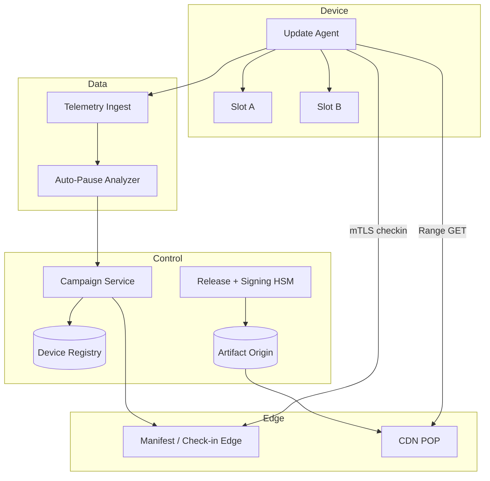
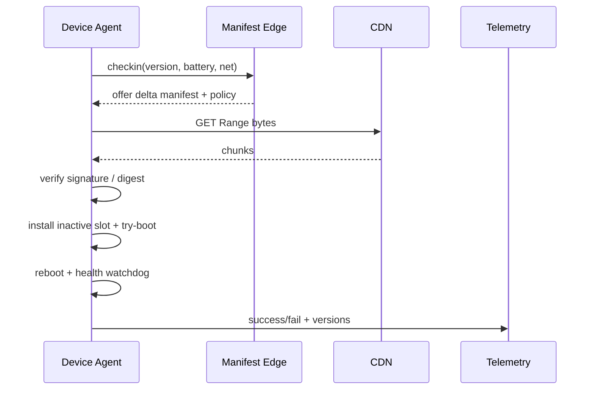

# System Design: OTA Updates for Millions of Devices

> **Focus areas:** Device fleet · Signed firmware · Staged rollout · Bandwidth · Resume · Brick prevention · Telemetry  
> **Style:** Core primitive design with progressive scale (10× → 100× → 1,000×)  
> **Product analogy:** Mobile app OTA + IoT/firmware OTA (Tesla/Phone/IoT-class constraints)

---

## Table of Contents

1. [Clarify Requirements (Interview Q&A)](#1-clarify-requirements-interview-qa)
2. [Back-of-the-Envelope Estimation](#2-back-of-the-envelope-estimation)
3. [High-Level Design](#3-high-level-design)
4. [Architecture Diagram](#4-architecture-diagram)
5. [Design Deep Dive](#5-design-deep-dive)
6. [Wrap-Up](#6-wrap-up)
7. [Deeper / Related Interview Questions](#7-deeper--related-interview-questions)

---

## 1. Clarify Requirements (Interview Q&A)

### 1.0 What this is / is not

| This is | This is not |
|---------|-------------|
| An **OTA update platform** delivering signed software/firmware to millions of devices safely | App Store review/marketplace product |
| Staged rollouts, device targeting, download resume, install + health gate, rollback/A-B slots | General CDN design alone (we use CDN) |
| Fleet inventory + campaign control plane + telemetry | Real-time command-and-control for actuators (related but separate) |
| Support constrained IoT **or** rich mobile—clarify which; design can cover both with profiles | Server canary deploy (related patterns, different failure modes) |

### 1.1 Functional Requirements

| # | Question | Expected answer | Design implication |
|---|----------|-----------------|--------------------|
| F1 | Device types? | Phones / IoT / vehicles—pick primary; mention variants | Payload size, battery, A/B partition |
| F2 | Update package? | Full image + delta/patches | Delta generator; integrity per chunk |
| F3 | Signing? | Mandatory code signing; secure boot chain | Certs, key rotation, anti-rollback |
| F4 | Targeting? | Model, HW revision, OS version, cohort %, region | Rules engine |
| F5 | Rollout? | Canary devices → % waves → halt on errors | Campaign state machine |
| F6 | Download? | Background, resumable, metered-network aware | Range GETs; CDN |
| F7 | Install window? | Idle/charging/night; user defer on phones | Policy on device + server |
| F8 | Rollback? | A/B slots for firmware; app previous version | Dual partition critical for IoT |
| F9 | Telemetry? | Download success, install success, boot health, crash rate | Pipeline + auto-pause |
| F10 | Forced update? | Security critical can force with deadline | Policy flags |
| F11 | Offline? | Download when online; install later | Local package store |
| F12 | Bandwidth cost? | Minimize; deltas; peer optional later | Delta + CDN + pacing |
| F13 | Auth device? | Mutual TLS / device certs | Device identity registry |
| F14 | Compliance? | Age rating / region legal | Targeting constraints |

**MVP scope (assume mixed but IoT+mobile capable):**

1. Device registry (id, model, current version, capabilities).
2. Publish signed update artifact (+ optional delta).
3. Campaign: target rules + % rollout + health thresholds.
4. Device check-in → offered update manifest.
5. Resumable download via CDN; verify signature; install; report result.
6. Auto-pause campaign on elevated failure rate.
7. Admin dashboards for fleet version histograms.

**Out of MVP:**

- P2P mesh delivery
- Over-the-air radio firmware for basebands (specialized)
- Full remote wipe MDM suite
- Server-side binary delta for every pair (start with key baselines)

### 1.2 Non-Functional Requirements

| # | Target |
|---|--------|
| N1 Availability of check-in/manifest | 99.9–99.99% |
| N2 Download integrity | Cryptographic verify before install; bit-rot detected |
| N3 Brick rate | ≈0 for recoverable devices; A/B mandatory for firmware |
| N4 Scale | Millions → billions check-ins/day |
| N5 Privacy | Minimal telemetry; aggregate crash rates |
| N6 Rollout control | Pause propagation globally in minutes |

### 1.3 Cases

**Happy paths**

1. Publish v1.2 signed → canary 1K devices → success >99.5% → 5% → 25% → 100%.
2. Device on Wi-Fi downloads delta 12 MB, verifies, schedules night install, boots healthy, ACKs.
3. Campaign auto-pauses when install failure rate > threshold.
4. Security force-update: deadline T; device blocks features after T until updated (product policy).

**Edge / failure**

| Case | Behavior |
|------|----------|
| Download interrupted | Resume byte ranges; re-verify |
| Signature fail | Abort; report; quarantine artifact |
| Power loss mid-flash | A/B: boot old slot; mark failed |
| Wrong hardware package | Manifest targeting prevents offer; device refuses |
| Rollback attack (old vuln firmware) | Anti-rollback version counter in fuses/OTP |
| Thundering herd midnight | Jittered schedules; CDN; rate limit campaigns |
| Delta apply fail | Fall back to full image once |
| Clock skew on deadline | Use server time from check-in |
| Compromised signing key | Revoke; emergency campaign; key rotation ceremony |
| Metered network | Defer large downloads unless security-critical |

### 1.4 Scales

| Metric | Baseline | 10× | 100× | 1,000× |
|--------|----------|-----|------|--------|
| Devices | 5M | 50M | 500M | 5B |
| Check-ins/day | 10M | 100M | 1B | 10B |
| Peak check-in QPS | 2K | 20K | 200K | 2M |
| Concurrent downloads | 100K | 1M | 10M | 100M |
| Artifact size (avg) | 50 MB | 50 MB | 80 MB | 100 MB |
| Delta size (avg) | 8 MB | 8 MB | 10 MB | 12 MB |
| Bandwidth/day (delta-heavy) | 40 TB | 400 TB | 5 PB | 50 PB |
| Campaigns active | 20 | 100 | 500 | 2K |

**What jumps force:**

- **10×:** CDN mandatory; check-in horizontally scaled; jitter.
- **100×:** Regional manifest edges; delta from multiple baselines; auto-pause ML thresholds.
- **1,000×:** Hierarchical cohorts; ISP peering; optional peer-to-peer; extreme telemetry aggregation.

### 1.5 Etc.

**Scope statement:**

> Design an **OTA update system** for millions→billions of devices: signed artifacts, resumable downloads, staged campaigns with auto-pause, A/B-safe install, and fleet telemetry—without building a full MDM/app store.

---

## 2. Back-of-the-Envelope Estimation

### 2.1 Check-in QPS

```text
5M devices × 2 check-ins/day = 10M/day ≈ 116 QPS avg
Peak 15–20× with diurnal → ~2K QPS ✓

5B devices × 2/day = 10B/day ≈ 116K QPS avg → ~2M peak
→ edge/region local manifests + cache
```

### 2.2 Bandwidth

```text
Naive full 50 MB × 5M = 250 PB — impossible monthly if everyone full daily
Reality: small % update/day

Assume 5%/day get 8 MB delta:
5M × 0.05 × 8 MB = 2M × 8 MB = 16 TB/day (order; table used higher concurrency peaks)

At 5B × 0.05 × 12 MB = 250M × 12 MB = 3 PB/day → CDN + deltas + pacing critical
```

### 2.3 Storage

```text
Versions retained: 20 × 100 MB × 50 models = 100 GB origin (small)
Device registry: 5M × 500 B = 2.5 GB; 5B × 500 B = 2.5 TB
```

### 2.4 Telemetry

```text
1 event / update attempt × 250K updates/day ≈ trivial
At scale: aggregate client-side; sample success; keep failures rich
```

### 2.5 Canary math

```text
Failure rate p=0.1% true bad update
Canary 1K devices → expect ~1 failure; need larger canary or time for crash reports
Use 10K canary + 24–72h soak for firmware
```

---

## 3. High-Level Design

### 3.1 Domain model

```text
Device {
  device_id, model, hw_rev, current_version, slot_active,
  cohort, region, last_seen, cert_id, capabilities
}

Artifact {
  version, model_constraints, size, digest_sha256,
  signature, type: full|delta, baseline_version?,
  cdn_urls[], min_battery, needs_ab_slot
}

Campaign {
  id, artifact_version, rules, percent, waves,
  state: draft|running|paused|stopped|completed,
  success_thresholds, start/end
}

DeviceUpdateState {
  device_id, campaign_id, phase: offered|downloading|ready|installing|ok|failed,
  bytes_downloaded, error_code, attempts
}
```

### 3.2 Device check-in protocol

```http
POST /v1/checkin
mTLS device cert
{
  "device_id": "...",
  "current_version": "1.1.4",
  "battery": 0.82,
  "network": "wifi",
  "free_bytes": 2e9,
  "boot_ok": true
}

→ 200
{
  "server_time": 1735689600,
  "update": {
    "campaign_id": "c_9",
    "version": "1.2.0",
    "artifact": {
      "url": "https://cdn/.../delta",
      "size": 8392102,
      "digest": "sha256:...",
      "signature": "...",
      "delta_from": "1.1.4"
    },
    "policy": {
      "install_when": ["charging", "idle"],
      "deadline": null,
      "priority": "normal"
    }
  }
}
```

No update → `{ "update": null, "next_checkin_s": 3600 + jitter }`.

### 3.3 Signing & anti-rollback

- Artifacts signed by offline/HSM-backed release key; devices trust intermediate.
- Manifest includes `min_version` / security patch level; device rejects lower.
- Hardware anti-rollback counters where available.
- Critical: **verify signature before writing inactive slot**; verify again before switch.

### 3.4 A/B install flow (firmware)

```text
1. Download to inactive slot / staging
2. Verify digest + signature
3. Flash inactive slot
4. Set “try boot” once flag
5. Reboot into new slot
6. Health watchdog (boot + N minutes)
7. Mark slot successful permanently OR revert to old slot
8. Report telemetry
```

Mobile apps: less brick risk; still stage APK/IPA via store or sideload policy; can keep last APK for rollback where OS allows.

### 3.5 Campaign engine

```text
percent rollout:
  offer if hash(device_id, campaign_id) % 100 < percent
  AND rules match (model, version range, region)
  AND campaign running

auto-pause if:
  install_fail_rate > T1 OR
  boot_fail_rate > T2 OR
  crash_rate delta > T3
within window after wave start
```

Waves: increase percent on schedule **only if** gates pass.

### 3.6 Delivery path

```text
Origin Object Store → CDN (signed URLs, short TTL)
Device Range-GET bytes
Optional: regional caches / ISP caches
```

Delta generation: bsdiff/courgette-like offline job from common baselines; if device baseline missing delta, offer full.

### 3.7 Components

| Component | Role |
|-----------|------|
| Device Registry | Identity, versions |
| Release / Signing | Artifact publish |
| Campaign Service | Targeting + % + pause |
| Manifest Edge | Check-in cheap path |
| CDN | Bytes |
| Telemetry Pipeline | Outcomes |
| Auto-Pause Analyzer | Health gates |
| Admin Console | Ops |

### 3.8 Trade-offs

| Option | Pros | Cons | Deal-breaker |
|--------|------|------|--------------|
| Single global full image only | Simple | Bandwidth explosion | At millions+ |
| Delta from all pairs | Small downloads | Combinatorial explosion | Need baseline set |
| P2P | Saves CDN $ | Security/complexity | Later |
| No A/B slots | Cheaper HW | Bricking | **Firmware deal-breaker** |
| Push SMS wake | Fast | Battery/cost | Optional |

**Choice:** signed full+delta from N baselines; CDN; A/B for firmware; hash cohorts; auto-pause.

---

## 4. Architecture Diagram





---

## 5. Design Deep Dive

### 5.1 Reliability

- Resumable downloads; atomic slot switch.
- Campaign pause is global kill switch (feature flag + config push).
- Telemetry at-least-once; analyzer uses rates not single events.
- Origin multi-region replication before campaign start.
- Poison artifact: signature revoke list on devices (short) + stop CDN URLs.

### 5.2 Scalability

- Check-in: stateless edges + cached campaign snapshots (5–30s).
- Registry updates async from check-in.
- Cohort hash avoids centralized assignment DB.
- Telemetry: aggregate counters per campaign wave; raw events sampled.
- 1,000×: regional campaign copies; Anycast check-in; BitTorrent-like optional.

### 5.3 Maintainability

- Device agent versions themselves OTA’d carefully (chicken/egg canary).
- Integration tests on hardware farm models.
- Runbooks: pause, pin version, force channel.
- Multi-tenant OEM: separate signing domains and campaigns.

---

## 6. Wrap-Up

| Decision | Choice |
|----------|--------|
| Integrity | Sign + digest + secure boot |
| Brick safety | A/B slots + health revert |
| Bandwidth | Deltas + CDN + jitter |
| Risk control | Staged % + auto-pause |
| Targeting | Rules + hash cohort |
| Scale | Edge manifests + registry async |

**Phases:** (1) full image + canary % (2) deltas (3) auto-pause analytics (4) regional/P2P optimizations.

---

## 7. Deeper / Related Interview Questions

**Q1. Why jitter check-ins?**  
A: Avoid thundering herds on campaign start and diurnal peaks.

**Q2. Why not expose unsigned HTTP artifacts?**  
A: CDN compromise or MITM could brick/fleet-pwn; signature end-to-end required.

**Q3. Delta combinatorial explosion?**  
A: Generate deltas only from last K baselines + major LTS; else full.

**Q4. How does auto-pause avoid false pause?**  
A: Minimum sample size; compare to baseline crash rate; hysteresis.

**Q5. Device lies about version?**  
A: Attestation where possible; still server tracks last ACK; constrained devices limited.

**Q6. Metered LTE downloads?**  
A: Policy defer; security exceptions; user consent on phones.

**Q7. Anti-rollback why?**  
A: Prevent attacker reflashing vulnerable old firmware after patch.

**Q8. Canary device selection?**  
A: Diverse models/regions; include dogfood; avoid only lab devices.

**Q9. Manifest caching vs instant pause?**  
A: Short TTL + push invalidation / epoch in check-in response `campaign_epoch`.

**Q10. Dual-commit install?**  
A: Try-boot flag: success path clears; failure reverts—classic A/B.

**Q11. Bandwidth cost ownership?**  
A: CDN billing; deltas; pacing percent; off-peak preferences.

**Q12. Relationship to server canary?**  
A: Same progressive ideas; devices add brick/bandwidth/offline constraints.

**Q13. Deal-breaker: in-place flash without recovery?**  
A: Yes for unattended IoT firmware.

**Q14. How to handle half-updated fleet forever?**  
A: Campaign deadlines; force channels; compatibility windows for backends.

**Q15. Backend must be compatible with N versions?**  
A: Yes—API versioning while fleet lags; track histogram.

**Q16. Telemetry PII?**  
A: Device ids hashed/pseudonymous; aggregate crash groups.

**Q17. Seeded RNG cohort stable?**  
A: `hash(device_id, campaign)` stable so % increases don’t reshuffle downloaded set chaotically—actually increasing % should be monotonic inclusion: use `hash(device) % 100 < percent`.

**Q18. Queue downloads on device?**  
A: One active package; storage quotas; expire stale downloads.

**Q19. Key rotation?**  
A: Dual-sign period; devices trust old+new; retire old after fleet updated.

**Q20. Vehicle OTA special?**  
A: Safety modes (parked), longer soak, legal; same skeleton.

**Q21. Why mTLS devices?**  
A: Inventory integrity; prevent unauthorized manifest pulls at scale; bind device id.

**Q22. Global pause SLO?**  
A: Propagate epoch within minutes via edge config; devices see on next check-in—force shorter check-in during active campaigns.

**Q23. Fail open or closed on telemetry outage?**  
A: Prefer pause new waves; don’t auto-promote.

**Q24. Chunk verification?**  
A: Per-chunk hashes in manifest for early fail; whole-image signature still required.

**Q25. Staff punchline?**  
A: “OTA is progressive delivery where rollback may require a reboot and a brick is a SEV-0—optimize for signature, A/B, and pause.”

**Q26. Mobile store vs own OTA?**  
A: Phones often store-mediated; IoT own OTA; design adapters.

**Q27. Clock attackers set time back?**  
A: Secure time / monotonic counters; don’t solely trust device clock for anti-rollback.

**Q28. Capacity planning CDN?**  
A: Wave schedules; per-POP limits; token bucket per campaign.

**Q29. Lab simulation?**  
A: Device farms + fault injection (power pull mid-flash).

**Q30. MVP cut?**  
A: Signed full image + % rollout + resume + A/B + manual pause before fancy deltas/P2P.

---

### Appendix A — Campaign thresholds example

```yaml
canary:
  devices: 10000
  soak_hours: 48
  max_boot_fail_rate: 0.001
  max_install_fail_rate: 0.01
waves:
  - percent: 5
    soak_hours: 24
  - percent: 25
    soak_hours: 24
  - percent: 100
on_breach: pause
```

### Appendix B — Device agent state machine

```text
Idle → Checkin → Offered → Downloading → Verifying → Ready → Installing → BootTry → Healthy → Idle
                              ↓ fail        ↓ fail              ↓ fail         ↓ fail
                           Idle(report)   Idle(report)       RevertSlot     RevertSlot
```

### Appendix C — Bandwidth controls

| Lever | Effect |
|-------|--------|
| Delta | 5–20× less bytes |
| % waves | Caps concurrent |
| Jitter | Smooth peaks |
| Wi-Fi only | Cuts LTE cost |
| CDN | Absorb load |

---

---

### Appendix D — Security threat model (short)

| Threat | Mitigation |
|--------|------------|
| CDN compromise | End-to-end signature verify on device |
| Rollback to vulnerable build | Anti-rollback counters / min version |
| Campaign targeting wrong model | Manifest rules + device refuse |
| Stolen device cert | Revocation list; attest when possible |
| Telemetry poisoning pause | Auth devices; rate-limit; robust stats |

### Appendix E — Check-in caching & pause epoch

```text
Edge caches CampaignSnapshot with epoch E
Admin pause → E++
Device check-in sends last_epoch
If snapshot.epoch > device view, edge fetches fresh (or push invalidate)
Target: global pause visible ≤ few minutes (shorter during active waves via next_checkin_s↓)
```

### Appendix F — Interview scoreboard

1. Signatures + A/B slots before fancy P2P.
2. Hash cohorts for monotonic % rollout.
3. Auto-pause with minimum sample size.
4. Deltas from limited baselines, not all pairs.
5. Backend must tolerate N fleet versions.

---

*End of OTA updates for millions of devices design.*

