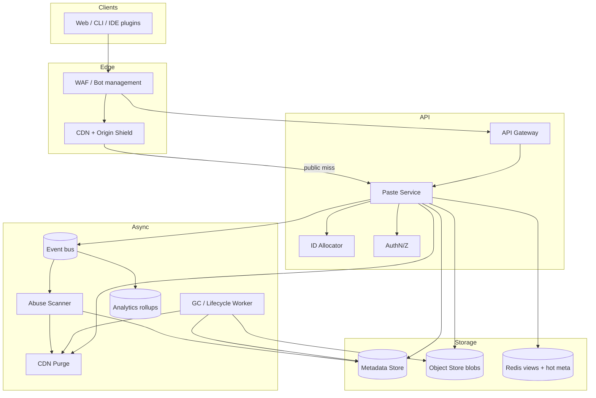

<!-- Adapted into Fundamentals bank from Amazon/pastebin-system-design.md for cross-company prep. -->

# System Design: Pastebin (Amazon-Style Paste Service)

> **Focus areas:** Short IDs · Metadata/blob split · Expiry/GC · CDN caching · Public/private authz · Abuse scanning · Burn-after-read · Multi-region
> **Style:** End-to-end product design with progressive scale (10× → 100× → 1,000×)
> **Quality bar:** Delete/expiry correctness; enumeration resistance; read-heavy economics; XSS/malware safety
> **Interview theme:** Amazon SDE III / L6 — classic **Pastebin** with Amazon operational bar (ownership, abuse, cost)

---

## Table of Contents

1. [Clarify Requirements (Interview Q&A)](#1-clarify-requirements-interview-qa)
2. [Back-of-the-Envelope Estimation](#2-back-of-the-envelope-estimation)
3. [High-Level Design](#3-high-level-design)
4. [Architecture Diagram](#4-architecture-diagram)
5. [Design Deep Dive](#5-design-deep-dive)
6. [Wrap-Up](#6-wrap-up)
7. [Deeper / Related Interview Questions](#7-deeper--related-interview-questions)
8. [Appendices](#8-appendices)

---
## 1. Clarify Requirements (Interview Q&A)

Goal: Design a **Pastebin-like service**: create/read/delete text (and small file) pastes with short URLs, expiry, public/unlisted/private visibility, abuse controls, and global read scale.

### 1.0 What this is / is not
| Dimension | This doc | Not this |
|-----------|----------|----------|
| Job | Paste CRUD + expiry + share URLs | Full Google Docs |
| Collaboration | Optional comments out of MVP | Realtime CRDT editing |
| Amazon lens | Abuse, privacy delete, cost, cells | Toy localhost demo |

### 1.1 Functional requirements
| # | Q | A | Implication |
|---|---|---|-------------|
| F1 | Create paste? | Text/code, optional title, expiry, visibility | Meta+blob |
| F2 | ID? | Short URL id | Collision math |
| F3 | Visibility? | Public / unlisted / private / password | Authz + cache rules |
| F4 | Expiry? | TTL + burn-after-read | GC + purge |
| F5 | Edit? | Immutable MVP or versioned | Scope lock |
| F6 | Size? | e.g. 1MB default / larger tier | Classes |
| F7 | Abuse? | Malware/phishing/spam | Async scan |
| F8 | Analytics? | Approximate views | No per-view SQL |
| F9 | Auth? | Optional login for private/manage | Identity |
| F10 | API? | REST create/get/delete | Idempotent create |

**MVP:** create/get/delete, IDs, expiry GC, CDN public, private authz, size caps, async abuse scan, metrics.
**Out:** Collaborative editing; full-text search of all pastes; zero-knowledge unless explicitly scoped.

### 1.2 NFRs
Create p99 < 300ms (small); read p99 < 100ms cached; 99.99% read avail; delete/expiry privacy SLO (CDN purge bound); durability 11-nines blob store class.

### 1.3 Cases
Happy: create→share→CDN read; expire GC; private auth read; burn-after-read once.
Edges: Slashdot hot paste; enumeration; malware; delete vs CDN; allocator failure; huge upload; XSS HTML paste.

### 1.4 Progressive scale
| Metric | Base | 10× | 100× | 1,000× |
|--------|------|-----|------|--------|
| Creates/day | 1M | 10M | 100M | 1B |
| Reads QPS peak | 50K | 500K | 5M | 50M |
| Stored pastes | 100M | 1B | 10B | 100B |
| Avg size | 5KB | 5KB | 8KB | 10KB |
| Storage | 0.5PB | 5PB | 80PB | PB× | 

Jumps: CDN+shard meta → multi-region/cells → edge+tiered cold+enterprise cells.

### 1.5 Scope repeat-back
> Pastebin with short IDs, metadata/blob split, expiry/GC with CDN purge, visibility-aware caching, abuse scanning, progressive global scale—Amazon bar on privacy deletes and abuse.

---
## 2. Back-of-the-Envelope Estimation

### 2.1 Load classes
Writes 10–50/s avg (spikes higher); reads 50K/s mostly CDN; deletes/GC workers; scan pipeline.

### 2.2 Storage math
```text
100M pastes × 5KB = 500GB raw (+ versions/replication)
At 100× with longer retention → tens of PB → lifecycle tiers mandatory
```

### 2.3 ID space
```text
base62 length 8 → 62^8 ≈ 2.1e14
At 1B pastes, collision negligible if uniform random/allocator unique
Unlisted/private: prefer 10+ chars against enumeration
```

### 2.4 Latency budget
Create: auth 5ms + ID 1ms + S3 put 50–100ms + meta 10ms.
Read: CDN 10–30ms; origin meta+S3 50–100ms.

### 2.5 Cost
CDN egress dominant for viral public; storage next; scan CPU. Default TTLs are cost control.

---
## 3. High-Level Design

**Components:** API Gateway, Paste Service, ID Allocator, Metadata Store (Dynamo), Object Store (S3), CDN, Auth, Abuse Scanner, GC/Lifecycle Worker, View Counter (Redis), Admin/Takedown, Cells.

**APIs:**
```text
POST /v1/pastes {content, visibility, expiry, password?} -> {id, url}
GET  /v1/pastes/{id}
DELETE /v1/pastes/{id}
POST /v1/pastes/{id}/burn  # optional
```

**Write path:** validate → alloc id → put blob → put meta(ttl) → return.
**Read path:** authz → CDN/public or origin → increment approx views.
**Delete/expiry:** meta delete → blob delete → CDN purge.

**Tradeoffs:** ID length vs UX; CDN cache vs privacy; immutable vs edit; server-side scan vs E2E encryption.

---
## 4. Architecture Diagram



```text
 Client
   |
   v
 API Gateway --> Paste Service --> ID Allocator
                     |               |
                     |               +--> Metadata DB (paste_id, vis, expiry, owner, hash)
                     +--> Object Store (blob)
                     +--> Redis (views, rate limits)
 Public GET <-- CDN (origin shield) <-- Paste Service
 Abuse Scanner <-- object create events
 GC Worker: expired meta -> delete blob -> purge CDN
 AuthN/Z for private/password
```

Degrade: CDN stale within purge SLO; if meta down, public CDN still serves cached; creates fail closed.

---
## 5. Design Deep Dive

### 5.1 Reliability (R)
Invariants: unique IDs; blob+meta linked; delete removes blob+meta+CDN; expiry eventually deletes; burn-after-read atomic; password hashes salted; XSS-safe render defaults (`text/plain`).

### 5.2 Scalability (S)
| Scale | Architecture |
|-------|--------------|
| 1× | Single region API + Dynamo + S3 + CDN |
| 10× | Shard/partition meta; origin shield; scan fleet |
| 100× | Multi-region CRR; tenant cells; cold tier |
| 1,000× | Edge auth for public; hierarchical caches; dedicated viral cells |

### 5.3 Maintainability (M)
Clear TTL policies; takedown runbooks; allocator HA; lifecycle tests; XSS regression tests; ownership: Paste serving vs Trust scanning.

### 5.4 Privacy delete deep dive
Deletion SLA e.g. publicly unreachable < 60s (CDN purge); physically GC blob < 24h; legal holds exempt; audit trail of deletes.

### 5.5 Burn-after-read
Conditional delete on meta version; only one winner; loser gets 404; race-safe with transactions/conditions.

---
## 6. Wrap-Up

### 6.1 What we designed
Pastebin: ID allocation, meta/blob, CDN, expiry GC+purge, visibility authz, abuse scanning, progressive multi-region/cells.

### 6.2 Key decisions worth defending
1. Meta/blob split
2. Non-guessable IDs for unlisted/private
3. CDN only for public immutable
4. TTL + sweeper + lifecycle
5. Async abuse scan with explicit fail mode
6. Approx view counters
7. Delete purge SLO
8. text/plain default against XSS

### 6.3 Risks & follow-ups
CDN privacy bugs; allocator outage; malware lag window; storage cost; enumeration.

### 6.4 Closer
> **Pastebin**: explicit planes, SLOs, ownership, progressive scale, customer trust, unit economics.

---
## 7. Deeper / Related Interview Questions — Pastebin

**Q1. How are IDs generated?**

**A:** Base62 from unique allocator (Snowflake-ish / Redis incr ranges) or crypto random with uniqueness check; length from collision math.

**Q2. Where is content stored?**

**A:** Object store for blobs; metadata DB for keys/expiry/visibility; cache/CDN in front.

**Q3. Public caching safe?**

**A:** Only for public immutable; purge on delete; private never shared CDN without signed URLs.

**Q4. Expiry implementation?**

**A:** Metadata TTL + async GC + object lifecycle; verify delete.

**Q5. Password pastes?**

**A:** Store salted hash; decrypt/view path checks; no CDN body cache.

**Q6. Custom URLs?**

**A:** Reserved namespace; abuse/squatting controls; uniqueness.

**Q7. Size limits?**

**A:** Hard caps; large via multipart; virus scan async.

**Q8. Analytics?**

**A:** View counters approximate (HyperLogLog/redis); don’t write DB per view.

**Q9. Multi-region writes?**

**A:** Home region affinity; replicate metadata; blob cross-region CRR selective.

**Q10. Enumeration?**

**A:** Long IDs; rate limits; anomaly detect; unlisted not secret.

**Q11. Edit/versioning?**

**A:** Optional versions as new object versions; or immutable pastes only—lock scope.

**Q12. Deal-breaker?**

**A:** Guessable sequential IDs for private/unlisted; delete without CDN purge.

**Q13. GDPR delete?**

**A:** Hard delete blob+meta+cache; verify; audit.

**Q14. Hot paste traffic?**

**A:** CDN + origin shield + rate limits on origin.

**Q15. Who pages?**

**A:** Storage/CDN for 5xx; Trust for malware; Identity for auth.

**Q16. Burn-after-read?**

**A:** Atomic delete-on-read with conditional writes; race-safe.

**Q17. Syntax highlight?**

**A:** Client-side; don’t block storage on render.

**Q18. Enterprise tenant?**

**A:** Cell isolation; private link; retention policies.

**Q19. Consistency after write?**

**A:** Read-after-write in home region; global eventual via CDN TTLs.

**Q20. Cost control?**

**A:** Default TTLs; max size; cold tier; egress caching.


---
## 8. Appendices

### A — Glossary
| Term | Meaning |
|------|---------|
| Unlisted | URL secret-ish, not browsable |
| Burn-after-read | Single view then delete |
| Origin shield | CDN mid-tier collapse |
| CRR | Cross-region replication |
| GC | Garbage collection of expired |
| Cell | Tenant/region isolation |
| Deal-breaker | Sequential private IDs / undeleted CDN |
| Two-pizza | Ownership with pager |

### B — Oncall checklist
- [ ] Create/read error rates
- [ ] GC lag
- [ ] CDN purge failures
- [ ] Scanner lag
- [ ] Allocator health
- [ ] Storage growth

### C — Metadata schema
```text
paste_id (PK), owner_id, visibility, password_hash, content_key,
size, content_type, created_at, expires_at, burned, scan_status, version
```

### D — Scale checklist
CDN+shards → multi-region/cells → edge+cold tier.

### E — Estimation cheat-sheet
```text
storage ≈ pastes × avg_size × replication
id_bits >= log2(pastes * safety)
```

### F — Closer checklist
- [ ] ID math
- [ ] Meta/blob
- [ ] Expiry+purge
- [ ] Cache vs private
- [ ] Abuse

## Deep Technical Notes — Pastebin

### ID allocator HA
Pre-allocate ranges per instance/AZ in Dynamo conditional updates; avoid single Redis; monitor leftover ranges.

### S3 key layout
`s3://bucket/{shard}/{paste_id}` random prefix against hot partitions; lifecycle rules by prefix/tags for expiry.

### CDN cache keys
Include visibility version; `Cache-Control: public, max-age=...` only if public&clean scan; `private, no-store` otherwise.

### XSS & content-type
Default download/view as text/plain; if HTML allowed, strict sanitize CSP; never reflect unsanitized.

### Abuse pipeline
S3 event → scanner → update scan_status → block; phishing URL list; spam classifier on create rate.

### View counters
Redis INCR with TTL shard; periodic sink to meta approx; lossy OK.

### Enterprise cells
Separate buckets/KMS keys; private connectivity; retention legal holds; admin roles.

## Interview Cards — Pastebin

### Card 1: How are IDs generated?

Base62 from unique allocator (Snowflake-ish / Redis incr ranges) or crypto random with uniqueness check; length from collision math.

**Follow-ups to expect:** What breaks at 10×? Who pages? What is the fallback? What metric proves it worked?

**Amazon ownership angle:** Name the two-pizza boundary, the artifact you deploy, and the customer-trust failure mode if this card is ignored.

### Card 2: Where is content stored?

Object store for blobs; metadata DB for keys/expiry/visibility; cache/CDN in front.

**Follow-ups to expect:** What breaks at 10×? Who pages? What is the fallback? What metric proves it worked?

**Amazon ownership angle:** Name the two-pizza boundary, the artifact you deploy, and the customer-trust failure mode if this card is ignored.

### Card 3: Public caching safe?

Only for public immutable; purge on delete; private never shared CDN without signed URLs.

**Follow-ups to expect:** What breaks at 10×? Who pages? What is the fallback? What metric proves it worked?

**Amazon ownership angle:** Name the two-pizza boundary, the artifact you deploy, and the customer-trust failure mode if this card is ignored.

### Card 4: Expiry implementation?

Metadata TTL + async GC + object lifecycle; verify delete.

**Follow-ups to expect:** What breaks at 10×? Who pages? What is the fallback? What metric proves it worked?

**Amazon ownership angle:** Name the two-pizza boundary, the artifact you deploy, and the customer-trust failure mode if this card is ignored.

### Card 5: Password pastes?

Store salted hash; decrypt/view path checks; no CDN body cache.

**Follow-ups to expect:** What breaks at 10×? Who pages? What is the fallback? What metric proves it worked?

**Amazon ownership angle:** Name the two-pizza boundary, the artifact you deploy, and the customer-trust failure mode if this card is ignored.

### Card 6: Custom URLs?

Reserved namespace; abuse/squatting controls; uniqueness.

**Follow-ups to expect:** What breaks at 10×? Who pages? What is the fallback? What metric proves it worked?

**Amazon ownership angle:** Name the two-pizza boundary, the artifact you deploy, and the customer-trust failure mode if this card is ignored.

### Card 7: Size limits?

Hard caps; large via multipart; virus scan async.

**Follow-ups to expect:** What breaks at 10×? Who pages? What is the fallback? What metric proves it worked?

**Amazon ownership angle:** Name the two-pizza boundary, the artifact you deploy, and the customer-trust failure mode if this card is ignored.

### Card 8: Analytics?

View counters approximate (HyperLogLog/redis); don’t write DB per view.

**Follow-ups to expect:** What breaks at 10×? Who pages? What is the fallback? What metric proves it worked?

**Amazon ownership angle:** Name the two-pizza boundary, the artifact you deploy, and the customer-trust failure mode if this card is ignored.

### Card 9: Multi-region writes?

Home region affinity; replicate metadata; blob cross-region CRR selective.

**Follow-ups to expect:** What breaks at 10×? Who pages? What is the fallback? What metric proves it worked?

**Amazon ownership angle:** Name the two-pizza boundary, the artifact you deploy, and the customer-trust failure mode if this card is ignored.

### Card 10: Enumeration?

Long IDs; rate limits; anomaly detect; unlisted not secret.

**Follow-ups to expect:** What breaks at 10×? Who pages? What is the fallback? What metric proves it worked?

**Amazon ownership angle:** Name the two-pizza boundary, the artifact you deploy, and the customer-trust failure mode if this card is ignored.

### Card 11: Edit/versioning?

Optional versions as new object versions; or immutable pastes only—lock scope.

**Follow-ups to expect:** What breaks at 10×? Who pages? What is the fallback? What metric proves it worked?

**Amazon ownership angle:** Name the two-pizza boundary, the artifact you deploy, and the customer-trust failure mode if this card is ignored.

### Card 12: Deal-breaker?

Guessable sequential IDs for private/unlisted; delete without CDN purge.

**Follow-ups to expect:** What breaks at 10×? Who pages? What is the fallback? What metric proves it worked?

**Amazon ownership angle:** Name the two-pizza boundary, the artifact you deploy, and the customer-trust failure mode if this card is ignored.

### Card 13: GDPR delete?

Hard delete blob+meta+cache; verify; audit.

**Follow-ups to expect:** What breaks at 10×? Who pages? What is the fallback? What metric proves it worked?

**Amazon ownership angle:** Name the two-pizza boundary, the artifact you deploy, and the customer-trust failure mode if this card is ignored.

### Card 14: Hot paste traffic?

CDN + origin shield + rate limits on origin.

**Follow-ups to expect:** What breaks at 10×? Who pages? What is the fallback? What metric proves it worked?

**Amazon ownership angle:** Name the two-pizza boundary, the artifact you deploy, and the customer-trust failure mode if this card is ignored.

### Card 15: Who pages?

Storage/CDN for 5xx; Trust for malware; Identity for auth.

**Follow-ups to expect:** What breaks at 10×? Who pages? What is the fallback? What metric proves it worked?

**Amazon ownership angle:** Name the two-pizza boundary, the artifact you deploy, and the customer-trust failure mode if this card is ignored.

### Card 16: Burn-after-read?

Atomic delete-on-read with conditional writes; race-safe.

**Follow-ups to expect:** What breaks at 10×? Who pages? What is the fallback? What metric proves it worked?

**Amazon ownership angle:** Name the two-pizza boundary, the artifact you deploy, and the customer-trust failure mode if this card is ignored.


## 9. Interview Walkthrough (45 min)

| Time | Focus |
|------|-------|
| 0–5 | Scope visibility/expiry |
| 5–12 | ID+storage math |
| 12–22 | HLD + ASCII |
| 22–35 | CDN privacy, GC, abuse, burn-after-read |
| 35–45 | Scale jumps & Q&A |

---
## 10. Operability

### Golden signals
Create/read latency, errors, GC lag, scan lag, CDN hit, storage $, 404 anomalies (enum).

### Rollback ladder
Disable HTML mode → revert API → CDN config revert → cell isolate.

### Kill switches
Disable creates; force private-only; block downloads pending scan; emergency takedown API.

### Security/privacy
KMS; authz; purge SLO; enumeration defenses; XSS defaults.

### Cost worksheet
Egress + storage. Lever: TTL defaults + CDN hit.

```text
monthly_storage_$ ≈ PB * $/GB-month
```

### Progressive scale
10× CDN/shard; 100× multi-region/cells; 1,000× edge+cold.

### Cross-team deps
Identity, CDN, malware platform, WAF, billing quotas.

---
## More Interview Q&A — Pastebin

**Q1. Base64 vs base62?**

**A:** Base62 URL-safe shorter; avoid ambiguous chars if needed.

**Q2. Collision handling?**

**A:** Retry allocate; monitor collision rate ~0.

**Q3. SQL or Dynamo for meta?**

**A:** Dynamo/key-value fits paste_id PK + TTL; SQL if rich query admin.

**Q4. Full-text search pastes?**

**A:** Usually out of MVP; if needed, async index public only.

**Q5. Rate limit creates?**

**A:** Per IP/account to stop spam dumps.

**Q6. WAF rules?**

**A:** Block known bad payloads; bot management.

**Q7. Encryption at rest?**

**A:** S3 SSE/KMS; optional client-side zero-knowledge (harder features).

**Q8. Zero-knowledge tradeoff?**

**A:** Server can’t scan malware—product choice.

**Q9. Pre-signed upload?**

**A:** Client→S3 direct for large; complete API attaches meta.

**Q10. Lifecycle incomplete uploads?**

**A:** Abort MPU GC.

**Q11. CDN purge storms?**

**A:** Soft TTL preference; purge only private deletes.

**Q12. View counter accuracy?**

**A:** Approx OK; sample.

**Q13. Paste folders?**

**A:** Out of MVP or thin meta edges.

**Q14. Clone paste?**

**A:** New ID copy blob ref or dup bytes—policy.

**Q15. Legal request?**

**A:** Freeze GC; export tooling; audit.

**Q16. Terraform/IaC?**

**A:** Mention cells and buckets per env.

**Q17. Chaos?**

**A:** Delete race; CDN stale; GC lag; ID allocator loss.

**Q18. Allocator HA?**

**A:** Multi-range per AZ; avoid single Redis SPOF.

**Q19. Unicode/content-type?**

**A:** Store content-type; sniff carefully; XSS escape on HTML views.

**Q20. XSS risk?**

**A:** Serve text/plain default; sanitize HTML mode.

**Q21. Mobile apps?**

**A:** Same API; deep links.

**Q22. SLA for create?**

**A:** p99 < 200–300ms excluding huge uploads.

**Q23. Thundering herd delete?**

**A:** Idempotent delete; CDN purge coalesce.

**Q24. Observability?**

**A:** create/read/delete QPS, GC lag, scan lag, CDN hit, 404 rate.


## Additional Interview Q&A — Pastebin

**Q25. Why not store blobs in MySQL?**

**A:** DB bloat, backup cost, poor large-object serving; object store + CDN wins.

**Q26. How short can IDs be?**

**A:** Compute birthday bound at expected cardinality × safety factor; lengthen for unlisted.

**Q27. Region outage read path?**

**A:** CDN + secondary region metadata replicas for public; private may fail-region.

**Q28. Password brute force?**

**A:** Rate limit attempts; lockout; Argon2/scrypt hashes.

**Q29. Malware false positive?**

**A:** Quarantine + appeal; hash allowlist carefully.

**Q30. Immutable pastes simplify?**

**A:** Yes—edits create new IDs; easier CDN.

**Q31. Tenant fair use?**

**A:** Quotas per account bytes/day.

**Q32. Object versioning vs paste versions?**

**A:** S3 versioning for ops recovery; product versions explicit.

**Q33. HEAD vs GET authz?**

**A:** Same authz—don’t leak existence inconsistently if private.

**Q34. Signed URL leak?**

**A:** Short TTL; scope to object; no broader IAM.

**Q35. Cold storage after 30d?**

**A:** Transition rarely read pastes; retrieve fee acceptable.

**Q36. GraphQL vs REST?**

**A:** REST simple CRUD enough for interview.

**Q37. Idempotent create?**

**A:** Client request_id → same paste returned.

**Q38. Spam SEO pastes?**

**A:** Nofollow; robots; abuse classifiers.

**Q39. Internationalization?**

**A:** Content opaque bytes; UI localized.

**Q40. SLA vs best-effort free tier?**

**A:** Separate capacity classes / cells.


## Deep Technical Addenda — Pastebin

### Worked Slashdot scenario
Paste hits 100K rps. Origin melts without CDN. With CDN+shield, origin sees hundreds rps. Still protect create path separately—reads shouldn’t starve writes (queues/pools).

### Worked privacy miss
User deletes paste; CDN caches 24h max-age without purge → secret leaked. Fix: conservative max-age for deletable pastes OR mandatory purge API on delete; integration test.

### Burn-after-read race
Two GETs concurrent: use `DELETE WHERE version=:v` returning success to one; second 404; never return body twice.

### ID length table
| Len | Space | Use |
|-----|-------|-----|
| 7 | ~3.5e12 | Public OK carefully |
| 8 | ~2e14 | Default public |
| 10+| huge | Unlisted/private |

## Tradeoff Matrices — Pastebin

| Choice | Pros | Cons | Amazon pick |
|--------|------|------|-------------|
| Sequential IDs | Simple | Enumerable | Random/allocator base62 |
| Blob in SQL | Single system | Scale/backup pain | Object store |
| Long CDN TTL | Cheap | Privacy risk | Short TTL or purge discipline |
| E2E encrypt | Privacy | No server scan | Optional tier; default scannable |

## Operability Addenda — Pastebin

Pages: create 5xx, GC lag breach, purge fail, malware viral, allocator range exhaustion, storage budget.

## Worked Capacity Narrative — Pastebin

Reads dominate; if you design for write DB per view you fail. CDN + approx counters is the L6 signal.

## Customer-Trust Paragraph — Pastebin

Leaked “deleted” pastes, XSS cookies, malware distribution—trust SEVs. Expiry/delete correctness is customer obsession, not a GC footnote.

## Progressive Scale Recap — Pastebin

- **10×:** CDN, meta sharding, scan fleet
- **100×:** multi-region, cells, cold tier
- **1,000×:** edge, viral cells, smarter lifecycle

For each jump, state **what breaks if you only add servers**.

## Supplemental Depth Pack — Pastebin

### S1. ID generation

Use base62 IDs from unique counters or hash+reject; size for collision probability ≪ traffic; never sequential guessable IDs for private pastes.
**Invariant:** Write the rule as a testable assert in design review.
**Metric:** Name a dashboard panel that detects violation within minutes/hours as appropriate.
**10× note:** Explain whether this theme’s mechanism still holds or must jump architecturally.
**Ownership:** Serving vs science vs privacy/policy—who pages?

### S2. Metadata vs blob split

Metadata (owner, expiry, visibility) in Dynamo/SQL; blob in object store; cache hot metadata+small bodies.
**Invariant:** Write the rule as a testable assert in design review.
**Metric:** Name a dashboard panel that detects violation within minutes/hours as appropriate.
**10× note:** Explain whether this theme’s mechanism still holds or must jump architecturally.
**Ownership:** Serving vs science vs privacy/policy—who pages?

### S3. Expiry & GC

TTL attributes + async GC sweeper; legal hold exceptions; never rely only on CDN for deletion.
**Invariant:** Write the rule as a testable assert in design review.
**Metric:** Name a dashboard panel that detects violation within minutes/hours as appropriate.
**10× note:** Explain whether this theme’s mechanism still holds or must jump architecturally.
**Ownership:** Serving vs science vs privacy/policy—who pages?

### S4. Public vs private/unlisted

Authz on read; signed URLs optional; unlisted ≠ secret—rate-limit enumeration.
**Invariant:** Write the rule as a testable assert in design review.
**Metric:** Name a dashboard panel that detects violation within minutes/hours as appropriate.
**10× note:** Explain whether this theme’s mechanism still holds or must jump architecturally.
**Ownership:** Serving vs science vs privacy/policy—who pages?

### S5. Abuse & malware scanning

Async AV/content scanners; blocklist; phishing URL detect; fail-closed for downloads when scanner down optional.
**Invariant:** Write the rule as a testable assert in design review.
**Metric:** Name a dashboard panel that detects violation within minutes/hours as appropriate.
**10× note:** Explain whether this theme’s mechanism still holds or must jump architecturally.
**Ownership:** Serving vs science vs privacy/policy—who pages?

### S6. Read-heavy caching

CDN for public immutable pastes; short TTL/private bypass; purge on delete/expiry.
**Invariant:** Write the rule as a testable assert in design review.
**Metric:** Name a dashboard panel that detects violation within minutes/hours as appropriate.
**10× note:** Explain whether this theme’s mechanism still holds or must jump architecturally.
**Ownership:** Serving vs science vs privacy/policy—who pages?

### S7. Paste size classes

Inline small; multipart large; reject unbounded; virus scan large async before public.
**Invariant:** Write the rule as a testable assert in design review.
**Metric:** Name a dashboard panel that detects violation within minutes/hours as appropriate.
**10× note:** Explain whether this theme’s mechanism still holds or must jump architecturally.
**Ownership:** Serving vs science vs privacy/policy—who pages?

### S8. Multi-region

Regional write affinity; global read via replication/CDN; cell isolation for enterprise tenants.
**Invariant:** Write the rule as a testable assert in design review.
**Metric:** Name a dashboard panel that detects violation within minutes/hours as appropriate.
**10× note:** Explain whether this theme’s mechanism still holds or must jump architecturally.
**Ownership:** Serving vs science vs privacy/policy—who pages?


## Scenario Runbooks — Pastebin

| Scenario | Immediate action | Customer impact | Follow-up |
|-----------|------------------|-----------------|----------|
| Delete not honored on CDN | Hard purge + short TTL | Privacy restored | TTL policy fix |
| ID enumeration attack | Rate limit + longer IDs + WAF | Private pastes safe | Monitoring |
| Malware paste viral | Takedown + hash block | User safety | Scanner tune |
| GC lag disk growth | Raise sweeper; lifecycle rules | Cost control | Capacity |
| Hot paste Slashdot | CDN + origin shield | Availability | Cache headers |
| Metadata DB hotspot | Shard by paste_id | Write path healthy | Partitioning |


## Rapid-Fire Q&A — Pastebin

**RQ1. Why does 'ID generation' matter in an L6 interview?**

**A:** Use base62 IDs from unique counters or hash+reject; size for collision probability ≪ traffic; never sequential guessable IDs for private pastes. Call the deal-breaker alternative and the unit-cost or trust implication.

**RQ2. How would you test 'ID generation' in staging?**

**A:** Define fixtures, chaos/failure injection, canary metrics, and a rollback path. Include at least one customer-trust assertion.

**RQ3. What regresses if 'ID generation' is ignored at 100×?**

**A:** Latency/error-budget burn, trust incidents, or linear cost growth. State which progressive-scale jump fixes it.

**RQ4. Why does 'Metadata vs blob split' matter in an L6 interview?**

**A:** Metadata (owner, expiry, visibility) in Dynamo/SQL; blob in object store; cache hot metadata+small bodies. Call the deal-breaker alternative and the unit-cost or trust implication.

**RQ5. How would you test 'Metadata vs blob split' in staging?**

**A:** Define fixtures, chaos/failure injection, canary metrics, and a rollback path. Include at least one customer-trust assertion.

**RQ6. What regresses if 'Metadata vs blob split' is ignored at 100×?**

**A:** Latency/error-budget burn, trust incidents, or linear cost growth. State which progressive-scale jump fixes it.

**RQ7. Why does 'Expiry & GC' matter in an L6 interview?**

**A:** TTL attributes + async GC sweeper; legal hold exceptions; never rely only on CDN for deletion. Call the deal-breaker alternative and the unit-cost or trust implication.

**RQ8. How would you test 'Expiry & GC' in staging?**

**A:** Define fixtures, chaos/failure injection, canary metrics, and a rollback path. Include at least one customer-trust assertion.

**RQ9. What regresses if 'Expiry & GC' is ignored at 100×?**

**A:** Latency/error-budget burn, trust incidents, or linear cost growth. State which progressive-scale jump fixes it.

**RQ10. Why does 'Public vs private/unlisted' matter in an L6 interview?**

**A:** Authz on read; signed URLs optional; unlisted ≠ secret—rate-limit enumeration. Call the deal-breaker alternative and the unit-cost or trust implication.

**RQ11. How would you test 'Public vs private/unlisted' in staging?**

**A:** Define fixtures, chaos/failure injection, canary metrics, and a rollback path. Include at least one customer-trust assertion.

**RQ12. What regresses if 'Public vs private/unlisted' is ignored at 100×?**

**A:** Latency/error-budget burn, trust incidents, or linear cost growth. State which progressive-scale jump fixes it.

**RQ13. Why does 'Abuse & malware scanning' matter in an L6 interview?**

**A:** Async AV/content scanners; blocklist; phishing URL detect; fail-closed for downloads when scanner down optional. Call the deal-breaker alternative and the unit-cost or trust implication.

**RQ14. How would you test 'Abuse & malware scanning' in staging?**

**A:** Define fixtures, chaos/failure injection, canary metrics, and a rollback path. Include at least one customer-trust assertion.

**RQ15. What regresses if 'Abuse & malware scanning' is ignored at 100×?**

**A:** Latency/error-budget burn, trust incidents, or linear cost growth. State which progressive-scale jump fixes it.

**RQ16. Why does 'Read-heavy caching' matter in an L6 interview?**

**A:** CDN for public immutable pastes; short TTL/private bypass; purge on delete/expiry. Call the deal-breaker alternative and the unit-cost or trust implication.

**RQ17. How would you test 'Read-heavy caching' in staging?**

**A:** Define fixtures, chaos/failure injection, canary metrics, and a rollback path. Include at least one customer-trust assertion.

**RQ18. What regresses if 'Read-heavy caching' is ignored at 100×?**

**A:** Latency/error-budget burn, trust incidents, or linear cost growth. State which progressive-scale jump fixes it.

**RQ19. Why does 'Paste size classes' matter in an L6 interview?**

**A:** Inline small; multipart large; reject unbounded; virus scan large async before public. Call the deal-breaker alternative and the unit-cost or trust implication.

**RQ20. How would you test 'Paste size classes' in staging?**

**A:** Define fixtures, chaos/failure injection, canary metrics, and a rollback path. Include at least one customer-trust assertion.

**RQ21. What regresses if 'Paste size classes' is ignored at 100×?**

**A:** Latency/error-budget burn, trust incidents, or linear cost growth. State which progressive-scale jump fixes it.

**RQ22. Why does 'Multi-region' matter in an L6 interview?**

**A:** Regional write affinity; global read via replication/CDN; cell isolation for enterprise tenants. Call the deal-breaker alternative and the unit-cost or trust implication.

**RQ23. How would you test 'Multi-region' in staging?**

**A:** Define fixtures, chaos/failure injection, canary metrics, and a rollback path. Include at least one customer-trust assertion.

**RQ24. What regresses if 'Multi-region' is ignored at 100×?**

**A:** Latency/error-budget burn, trust incidents, or linear cost growth. State which progressive-scale jump fixes it.


## Narrative Walkthrough — Pastebin

### Walkthrough beat 1

User creates paste: auth optional; validate size; allocate ID; write blob to S3; write metadata with expiry; return URL. Metric: create_p99, storage_bytes.

Call out one tradeoff you are making (short-id collision vs length, CDN freshness vs privacy, durability vs cost) and why Amazon customer obsession prefers that tradeoff here.

### Walkthrough beat 2

Public read: CDN edge hit; miss → origin API → metadata+blob; cache immutable max-age if no password. Degradation: serve from replica region.

Call out one tradeoff you are making (short-id collision vs length, CDN freshness vs privacy, durability vs cost) and why Amazon customer obsession prefers that tradeoff here.

### Walkthrough beat 3

Private/password paste: no CDN cache of body; authz check; optional signed URL short TTL.

Call out one tradeoff you are making (short-id collision vs length, CDN freshness vs privacy, durability vs cost) and why Amazon customer obsession prefers that tradeoff here.

### Walkthrough beat 4

Expiry: Dynamo TTL + S3 lifecycle + sweeper verifies; purge CDN. Legal hold skips GC.

Call out one tradeoff you are making (short-id collision vs length, CDN freshness vs privacy, durability vs cost) and why Amazon customer obsession prefers that tradeoff here.

### Walkthrough beat 5

Abuse: async scan; if bad, mark blocked; public reads fail-closed; notify.

Call out one tradeoff you are making (short-id collision vs length, CDN freshness vs privacy, durability vs cost) and why Amazon customer obsession prefers that tradeoff here.

### Walkthrough beat 6

10×: shard metadata + CDN. 100×: multi-region + cell tenants. 1,000×: edge computes + smarter ID oracles + tiered cold storage.

Call out one tradeoff you are making (short-id collision vs length, CDN freshness vs privacy, durability vs cost) and why Amazon customer obsession prefers that tradeoff here.

### Walkthrough beat 7

Deal-breaker: sequential IDs for unlisted; or delete that only removes metadata leaving CDN forever.

Call out one tradeoff you are making (short-id collision vs length, CDN freshness vs privacy, durability vs cost) and why Amazon customer obsession prefers that tradeoff here.

### Walkthrough beat 8

Unit economics: GB-month storage + CDN egress; expiry is a cost feature as well as privacy.

Call out one tradeoff you are making (short-id collision vs length, CDN freshness vs privacy, durability vs cost) and why Amazon customer obsession prefers that tradeoff here.


## Pre-Onsite Checklist — Pastebin

- [ ] Can explain **ID generation** with numbers and a deal-breaker
- [ ] Can explain **Metadata vs blob split** with numbers and a deal-breaker
- [ ] Can explain **Expiry & GC** with numbers and a deal-breaker
- [ ] Can explain **Public vs private/unlisted** with numbers and a deal-breaker
- [ ] Can explain **Abuse & malware scanning** with numbers and a deal-breaker
- [ ] Can explain **Read-heavy caching** with numbers and a deal-breaker
- [ ] Can explain **Paste size classes** with numbers and a deal-breaker
- [ ] Can explain **Multi-region** with numbers and a deal-breaker
- [ ] Has a 30-second runbook for **Delete not honored on CDN**
- [ ] Has a 30-second runbook for **ID enumeration attack**
- [ ] Has a 30-second runbook for **Malware paste viral**
- [ ] Has a 30-second runbook for **GC lag disk growth**
- [ ] Has a 30-second runbook for **Hot paste Slashdot**
- [ ] Has a 30-second runbook for **Metadata DB hotspot**
- [ ] Progressive scale 10×/100×/1,000× story rehearsed
- [ ] Pager ownership one-liner ready
- [ ] Unit-cost metric named

### Extra drill

Rehearse explaining Pastebin to a skeptical SDM: start from customer trust, then SLO numbers, then one architecture diagram box that owns the risk, then the kill switch. Mention what you would not build.

### Extra drill

Rehearse explaining Pastebin to a skeptical SDM: start from customer trust, then SLO numbers, then one architecture diagram box that owns the risk, then the kill switch. Mention what you would not build.

### Extra drill

Rehearse explaining Pastebin to a skeptical SDM: start from customer trust, then SLO numbers, then one architecture diagram box that owns the risk, then the kill switch. Mention what you would not build.

### Extra drill

Rehearse explaining Pastebin to a skeptical SDM: start from customer trust, then SLO numbers, then one architecture diagram box that owns the risk, then the kill switch. Mention what you would not build.

### Extra drill

Rehearse explaining Pastebin to a skeptical SDM: start from customer trust, then SLO numbers, then one architecture diagram box that owns the risk, then the kill switch. Mention what you would not build.

### Extra drill

Rehearse explaining Pastebin to a skeptical SDM: start from customer trust, then SLO numbers, then one architecture diagram box that owns the risk, then the kill switch. Mention what you would not build.

### Extra drill

Rehearse explaining Pastebin to a skeptical SDM: start from customer trust, then SLO numbers, then one architecture diagram box that owns the risk, then the kill switch. Mention what you would not build.

### Extra drill

Rehearse explaining Pastebin to a skeptical SDM: start from customer trust, then SLO numbers, then one architecture diagram box that owns the risk, then the kill switch. Mention what you would not build.

### Extra drill

Rehearse explaining Pastebin to a skeptical SDM: start from customer trust, then SLO numbers, then one architecture diagram box that owns the risk, then the kill switch. Mention what you would not build.

### Extra drill

Rehearse explaining Pastebin to a skeptical SDM: start from customer trust, then SLO numbers, then one architecture diagram box that owns the risk, then the kill switch. Mention what you would not build.


*End of document — Pastebin (Amazon-Style Paste Service) (SDE III)*
