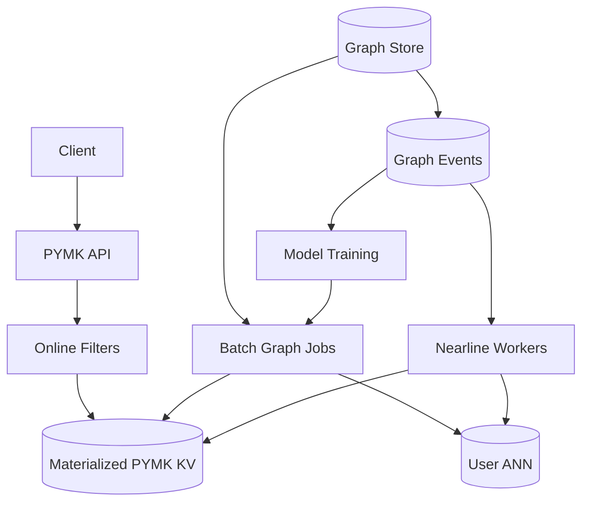

# System Design: People You May Know (PYMK)

> **Focus areas:** Social graph affinity · Friend-of-friend · Embeddings · Candidate generation · Ranking · Privacy · Progressive scale  
> **Style:** Senior/staff interview prep with progressive scale (10× → 100× → 1,000×)  
> **Product orientation:** “People You May Know” / “Suggested Friends” / LinkedIn “People You May Know”

---

## Table of Contents

1. [Clarify Requirements (Interview Q&A)](#1-clarify-requirements-interview-qa)
2. [Back-of-the-Envelope Estimation](#2-back-of-the-envelope-estimation)
3. [High-Level Design](#3-high-level-design)
4. [Architecture Diagram](#4-architecture-diagram)
5. [Design Deep Dive](#5-design-deep-dive)
6. [Wrap-Up](#6-wrap-up)
7. [Deeper / Related Interview Questions](#7-deeper--related-interview-questions)

---

## 1. Clarify Requirements (Interview Q&A)

PYMK is a **graph + ranking** recommendation problem with strict privacy and abuse constraints. Bound edge types and refresh cadence.

### 1.0 What this is / is not

| This is | This is not |
|---------|-------------|
| Suggest users to connect/follow | Full feed ranking product |
| FoF, co-engagement, embedding similarity | Dating match swipe product (Tinder doc) |
| Explanation (“12 mutual friends”) | Global people search |
| Periodic + on-demand candidate lists | Realtime chat presence |

### 1.1 Functional Requirements

| # | Question to ask | Expected / typical interviewer answer | Design implication |
|---|-----------------|----------------------------------------|--------------------|
| F1 | Edge type? | Friends (undirected) and/or follows (directed) | Support both; LinkedIn=undirected connect |
| F2 | Primary signals? | Mutual friends, work/school, co-interactions, contacts | Multi-retriever candidates |
| F3 | Explanations? | Yes — “N mutual friends” | Precompute mutual counts for top candidates |
| F4 | Negative feedback? | Dismiss / ignore | Tombstone + downweight |
| F5 | Refresh frequency? | Daily batch + nearline on graph change | Hybrid compute |
| F6 | Invite contacts? | Optional phone hash match | Careful privacy; salted hashing |
| F7 | Block / restrict? | Never suggest blocked; honor hide | Hard filters |
| F8 | Ranking goal? | Accept rate / successful connects | Train on outcomes |
| F9 | Pagination? | Top K (10–50) widget + see-all | Materialized list per user |
| F10 | Cold start? | Import address book / popular / org | Fallback retrievers |
| F11 | Realtime after new friendship? | Update within minutes–hours OK | Event-driven invalidation |
| F12 | Cross-product (FB/IG)? | Out of MVP | Graph federation later |
| F13 | Celebrity suggestions? | Rarely useful; demote | Popularity penalty |

**MVP scope:**

1. Build candidate set via FoF + shared org/school.
2. Rank by mutual friends and simple affinity.
3. Serve top K with explanations.
4. Dismiss + never-suggest filters.
5. Recompute daily; nearline on major graph edits.

**Out of MVP:** Deep GNN real-time, SMS spam invites, global search, ads as PYMK.

### 1.2 Non-Functional Requirements

| # | Question | Expected answer | Target |
|---|----------|-----------------|--------|
| N1 | Widget latency | Instant | p99 < 100ms (precomputed) |
| N2 | Freshness | Hours OK | Batch ≤24h; nearline ≤15–60 min |
| N3 | Privacy | Strict | No leaking private edges via explanations |
| N4 | Availability | High | 99.9%; stale list OK |
| N5 | Fairness / safety | No stalking vectors | Restrict graph visibility rules |
| N6 | Cost | Graph compute heavy | Precompute offline; limit online FoF |

### 1.3 Cases

**Happy paths**

1. User opens app → PYMK widget shows 10 people with mutual friend counts.
2. Send connect → candidate removed; graphs update; friends’ PYMK refresh nearline.
3. Dismiss → not shown again for long TTL.

**Edge / failure cases**

| Case | Behavior |
|------|----------|
| User with 0 friends | Org/school/contact/popular fallbacks |
| User with 5k friends | FoF explosion — sample / truncate neighbors |
| Stalking via mutuals | Only show mutuals if edges visible to viewer |
| Blocked users | Hard exclude both directions |
| Viral influencer in FoF | Popularity penalty; prefer meaningful affinity |
| Graph partition / lag | Serve last materialized list |
| Explanation inconsistency | Count from snapshot used at compute time |

### 1.4 Scales

| Metric | Baseline | 10× | 100× | 1,000× |
|--------|----------|-----|------|--------|
| Users | 50M | 500M | 5B | 50B-class ids |
| Edges | 2B | 20B | 200B | 2T |
| Avg degree | 200 | 300 | 400 | 500 |
| PYMK requests / day | 100M | 1B | 10B | 100B |
| Peak QPS | 5K | 50K | 500K | 5M |
| Candidates scored / user / day | 1K | 1K | 2K | 5K |

**FoF explosion math:**

```text
degree 300 → FoF upper bound ~90K unique (with overlap less)
Scoring 90K online per request at 500K QPS → impossible
→ Precompute / sample / ANN; never raw FoF on request path at scale
```

**Jumps:**

- **10×:** Offline FoF batch jobs; Redis serve lists.
- **100×:** Graph processing platform (Spark/GraphX/Pregel); embeddings; nearline.
- **1,000×:** Approximate FoF; GNN embeddings; cell-local graphs.

### 1.5 Etc.

> Design PYMK: suggest connections using mutual friends and affinity signals, with explanations, dismissals, privacy filters, precomputed top-K lists, scaling from tens of millions of users to 1000×.

---

## 2. Back-of-the-Envelope Estimation

### 2.1 Serve path

```text
Precomputed list ~50 candidates × 100 B ≈ 5 KB / user
50M users × 5 KB ≈ 250 GB — fits Redis cluster / KV
Peak 5K QPS → trivial if precomputed
```

### 2.2 Offline FoF compute

```text
Naive: for each user, intersect neighbor sets of all friends
50M × 200 friends × 200 neighbors — catastrophic without pruning

Practical:
- Sample top-M friends by intimacy
- Count common neighbors with hash sketches / inverted index
- Emit top candidates only
```

### 2.3 Nearline events

```text
Friend adds: 10M/day → trigger localized recompute for endpoints + samples of their friends
```

### 2.4 Embedding index

```text
50M users × 128-d float16 ≈ 50M × 256 B ≈ 12.5 GB — workable ANN
```

---

## 3. High-Level Design

### 3.1 Multi-retriever + rank (same idea as TikTok, smaller corpus per user)

```text
Retrievers:
  1. FoF / mutual friends
  2. Shared company / school / group
  3. Co-interaction (likes, comments, co-appear in threads)
  4. Address-book match (hashed)
  5. Embedding KNN
        │
        ▼
Filters: existing friends, blocks, dismissals, age gates, privacy
        │
        ▼
Ranker: P(connect | features) + diversity
        │
        ▼
Materialize top K + explanations → KV
```

### 3.2 Mutual friends count

**Exact (small degree):** intersect sorted neighbor IDs.

**Large degree:** 

- MinHash / bottom-k sketches for similarity
- Precomputed inverted index: `user → friends` sharded; count with mapreduce
- Cap explanation display (“99+ mutual friends”)

**Privacy:** Only cite mutuals that viewer can see.

### 3.3 Domain model

```text
Edge { u, v, type, ts, strength }
PYMKItem { viewer_id, candidate_id, score, reason_codes, mutual_count, computed_at }
Dismissal { viewer_id, candidate_id, until }
UserFeatures { orgs, schools, geo, embedding }
```

### 3.4 APIs

| Method | Path | Purpose |
|--------|------|---------|
| GET | `/v1/pymk?limit=` | Serve suggestions |
| POST | `/v1/pymk/dismiss` | Negative feedback |
| POST | `/v1/connections` | Send invite / friend |
| GET | `/v1/pymk/{id}/explanation` | Optional detail |

### 3.5 Compute architecture

| Mode | When | How |
|------|------|-----|
| Batch | Daily | Spark job over graph snapshots |
| Nearline | On edge add/remove | Recompute for impacted users |
| Online | Rare | Light re-rank / filter only |

**Deal-breaker:** BFS FoF on every widget render.

### 3.6 Ranking features

- `mutual_friend_count` / Jaccard
- Edge strength to mutuals (intimacy)
- Same employer / school / city
- Profile completeness
- Historical accept rates (viewer + candidate)
- Popularity penalty
- Reciprocal interest signals (viewed profile)

### 3.7 Storage

| Data | Store |
|------|-------|
| Graph edges | Sharded graph store / Cassandra |
| PYMK lists | Redis / DynamoDB |
| Embeddings | ANN + feature store |
| Dismissals | KV with TTL |
| Training events | Kafka → lake |

### 3.8 FoF batch algorithm (interview detail)

```text
Input: undirected edge list snapshot (or directed "friend" projection)

Job 1 — emit neighbor pairs (sampled):
  for user u with neighbors N(u):
    take sample S(u) ⊆ N(u)  # top by intimacy / recency, |S|≤M (e.g. 64–128)
    for a in S(u):
      for b in S(u), a < b:
        emit key (a,b) with witness u   # or emit to inverted: a → (u), join

Job 2 — aggregate candidates per viewer:
  for each viewer v:
    candidates[c] += score(mutuals, intimacy, org_overlap)
    emit top K to KV with reason codes
```

**Join-based variant (often clearer):**

```text
edges(u,f) ⋈ edges(f,c) → candidate (u,c) with witness f
WHERE u ≠ c AND NOT already_friends(u,c)
GROUP BY u,c → mutual_count, witness_sample
```

At 100× this join needs **skew handling**: mega-node `f` must not explode. Strategies:

| Skew strategy | Mechanism |
|---------------|-----------|
| Salting | Split hot `f` into `f#0..n` with replicated small side |
| Non-expandable set | Skip witnesses with degree > T |
| Two-phase | Count only; materialize witnesses for top candidates |
| Truncation | Cap edges processed per user per day |

### 3.9 Intimacy / edge strength

Not all friends are equal for PYMK:

```text
strength(u,f) ≈
  α * interactions_30d(u,f)
+ β * reciprocal_messages
+ γ * profile_views
+ δ * edge_age_decay
```

Use strength both for **sampling which neighbors to expand** and as a **feature** on candidates (sum/mean strength through witnesses).

### 3.10 Explanation safety matrix

| Witness visible to viewer? | Candidate visibility | Show mutual count? | Show names? |
|----------------------------|----------------------|--------------------|-------------|
| Yes | Public/friends-ok | Yes | Optional |
| No (blocked/hidden) | Any | Exclude witness | Never |
| Yes | Restricted profile | Maybe count only | No |

**Staff point:** explanation generation runs on the **viewer-authorized projection** of the graph, not the raw global graph.

### 3.11 Trade-off: batch daily vs streaming nearline

| | Daily batch | Nearline per edge event |
|--|-------------|-------------------------|
| Cost | Predictable | Spiky with viral friend adds |
| Freshness | Stale ≤24h | Minutes |
| Complexity | Lower | Higher (priority queues) |
| Correctness | Snapshot consistent | Need versioning |

**Production:** batch baseline + nearline for active users / high-value edges.

### 3.12 Serving path sequence diagram

```text
Client GET /pymk
  → AuthN/Z
  → Load dismissals + blocks (online)
  → MGET pymk:{user} materialized
  → Filter + light re-rank (boost newly online candidates)
  → Hydrate profile cards (batch)
  → Return
```

If KV miss: synchronous fallback to **cheap retriever only** (same org sample) + async fill; never FoF BFS in request.

### 3.13 End-to-end latency & size budgets

```text
GET /pymk p99 < 100ms
Materialized list 50 × ~80 B ≈ 4 KB
Hydrate 50 profiles × ~500 B ≈ 25 KB response
Redis multi-get + filter ≪ ranker cost (precomputed)
```

**Storage at 500M users with active PYMK lists (40%):**

```text
200M × 4 KB ≈ 800 GB KV — shard regionally; compress reason codes
```

---

## 4. Architecture Diagram



---

## 5. Design Deep Dive

### 5.1 Reliability

- Materialized lists mean serve path independent of Spark outages (stale OK).
- Dismissals applied online even if list stale.
- Graph event idempotency for nearline (`event_id` dedupe).
- Privacy regression tests: never suggest blocked; never leak hidden edges.
- **Poison candidate:** if profile deleted/suspended, hydrate drops + async scrub from KV.
- **Partial job failure:** write candidates under `computed_at` version; serve previous version until new complete (blue/green key swap).
- **Invite spam backpressure:** connection-request quotas independent of PYMK list length.

**Idempotency & retries**

| Operation | Idempotency key | Retry safety |
|-----------|-----------------|--------------|
| Dismiss | `(viewer, candidate)` | Upsert TTL |
| Materialize write | `(viewer, compute_version)` | Overwrite immutable version |
| Nearline recompute enqueue | `(viewer, edge_event_id)` | Dedup queue |

### 5.2 Scalability

- Shard graph by `user_id`; replicate hot egonets carefully.
- Sample neighbors for mega-nodes (celebrities): PYMK often excludes celebs or special-cases.
- Approximate algorithms for FoF at 100×+.
- Cells: compute PYMK in home region; don’t ship full graphs cross-region each day.

**Progressive compute cost control**

```text
Priority score for recompute =
  activity(user) * graph_churn(user) * product_surface_weight
```

Only top P% users get daily full recompute; long-tail weekly; dormant on login catch-up.

**ANN retrieval scaling**

```text
50M users × 128-d = manageable single cluster
5B users → sharded ANN by locale/community + IQF-style routing
```

**What 10× / 100× / 1,000× change**

| Jump | FoF | Serve | Rank |
|------|-----|-------|------|
| 10× | Spark join + Redis lists | KV hit | Heuristic |
| 100× | Skew-safe joins + intimacy sample | Regional KV | ML accepts model |
| 1,000× | Sketches + GNN emb | Cell-local | Multi-objective + fairness |

### 5.3 Maintainability

- Monitor accept rate, dismiss rate, compute lag, empty-slot rate, explanation audit fail rate.
- Explanation correctness audits (sampled human + automated witness visibility checks).
- Model/version in materialized payload for debug.
- Kill switch → fallback to FoF-only heuristic lists.
- **Data quality:** track % candidates with zero valid witnesses after privacy filter (should be ~0).
- **Ops runbooks:** “Spark FoF skew hotspot”, “KV miss storm”, “privacy incident — disable explanations”.
- **Multi-tenant / multi-product:** same graph, different rankers (FB friends vs LinkedIn connects) via `surface_id` in compute.

---

## 6. Wrap-Up

| Decision | Choice | Why |
|----------|--------|-----|
| Serve | Precomputed top-K | Latency + cost |
| Candidates | Multi-retriever | Coverage beyond FoF |
| FoF | Offline/nearline | Explosion online |
| Privacy | Hard filters + safe explanations | Trust |
| Learning | Optimize accepts | Product KPI |

**Phases:** mutual-friends lists → org signals → dismissals → embeddings → nearline quality.

> “PYMK is offline graph recommendation with an online filter veneer — not a live BFS API.”

### Interview checklist (60s recap)

1. Bound edge types + privacy for explanations.
2. Show FoF explosion math → precompute.
3. Multi-retriever candidates + accept-rate ranker.
4. Online path = KV + hard filters only.
5. Mega-node / skew handling in batch joins.
6. Metrics: accept, dismiss, compute lag, privacy audits.

---

## 7. Deeper / Related Interview Questions

**Q1. How do you compute mutual friends efficiently?**  
A: Sorted intersect for small sets; batch inverted-index counting for large graphs; sketches when approximate is OK.

**Q2. Celebrity with 50M followers breaks FoF — how?**  
A: Don’t expand mega-nodes; mark non-expandable; use embeddings/org signals instead.

**Q3. Privacy leak via “1 mutual friend” when mutual is blocked?**  
A: Compute explanation under viewer’s visibility graph; drop illegal witnesses.

**Q4. Jaccard vs raw mutual count?**  
A: Jaccard prefers niche overlap; raw count favors popular. Use both features; let model weigh.

**Q5. When to online-compute?**  
A: Only filters/re-rank. Candidate generation stays precomputed at scale.

**Q6. Address book imports risks?**  
A: Hash tokens with secret salt; rate-limit invites; don’t expose who has whose number publicly.

**Q7. How fast after befriending someone?**  
A: Nearline recompute minutes; widget can inject new FoF optimistically for that edge.

**Q8. Training labels?**  
A: Impression → invite → accept/ignore; correct for position bias.

**Q9. Diversity in list?**  
A: Cap same employer/school; mix weak ties / strong ties.

**Q10. Graph DB vs Cassandra adjacency?**  
A: Specialized graph DBs help traversals; at FAANG scale often custom sharded adjacency + compute jobs. Choose based on ops.

**Q11. Empty PYMK?**  
A: Fallbacks: popular in geo, same company unverified, “grow your network” UX — not infinite celebs.

**Q12. Bidirectional intent?**  
A: Features like “candidate viewed you” improve accepts; careful with creepy UX.

**Q13. Consistent hashing of graph shards?**  
A: Shard by user; edges stored twice (u→v and v→u) for undirected fast egonet reads, or store once + secondary index.

**Q14. Memory for egonet cache?**  
A: Cache hot users’ neighbor ID lists compressed (varint). Mega-nodes special-cased.

**Q15. Dismissal TTL?**  
A: 30–90 days typical; permanent for report/block.

**Q16. Multi-reason explanations?**  
A: Rank reasons by strength; show one primary to reduce clutter.

**Q17. How does LinkedIn differ from Facebook PYMK?**  
A: Stronger org/school/title features; connect vs friend semantics; email domain signals.

**Q18. Spam connection requests from PYMK?**  
A: Quota invites; rank by quality not volume; detect invite spam.

**Q19. Load shedding?**  
A: Serve slightly stale KV; pause nearline first; batch can lag.

**Q20. Footgun?**  
A: Live FoF intersection in the request path for all users.

**Q21. Using GNNs?**  
A: Staff+; produce embeddings offline; still serve via KV/ANN — GNN inference per request rare.

**Q22. Indexing for shared org?**  
A: Inverted index `org_id → members` (capped); sample for huge orgs (Google employees).

**Q23. A/B testing PYMK?**  
A: Holdouts on invite/accept; long-term network growth metrics; watch abuse.

**Q24. Data structures for intersect?**  
A: Sorted vectors + two-pointer; roaring bitmaps for dense communities.

**Q25. Reciprocal PYMK?**  
A: Not required; asymmetric suggestions OK.

**Q26. How to handle edge deletes?**  
A: Event → remove candidates that depended exclusively on that bridge; or full recompute user.

**Q27. Cost saver #1?**  
A: Don’t recompute everyone daily — priority by activity / graph churn.

**Q28. Security: enumeration?**  
A: Authz on API; rate limits; don’t reveal existence of hidden profiles via explanations.

**Q29. Relation to Mutual Connections API?**  
A: Mutual connections service answers `mutual(u,v)`; PYMK uses it as a feature generator at scale via batch, not per widget call for all pairs.

**Q30. Closing line?**  
A: Precompute candidates with multi-retrievers, rank accepts, serve from KV with online privacy filters.

---

*End of People You May Know system design prep doc.*
