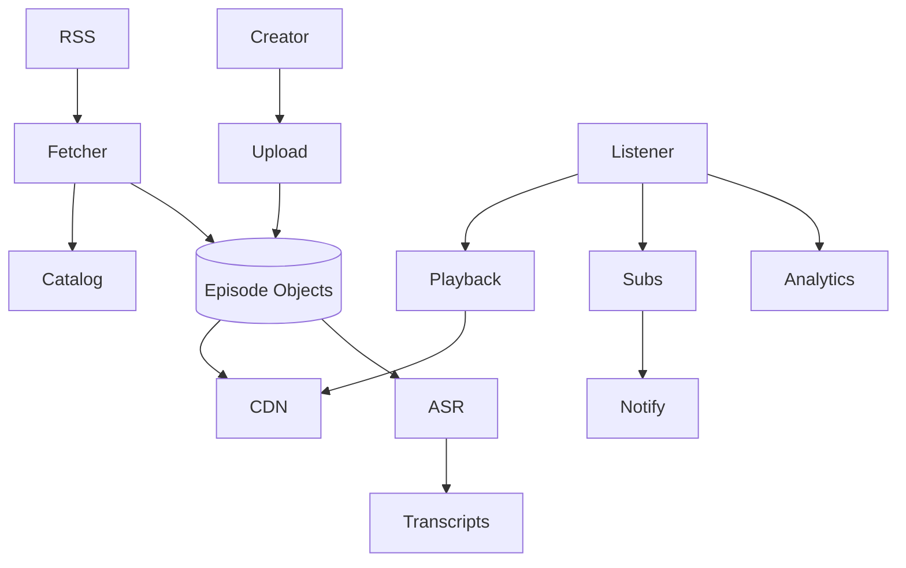

# System Design: Podcast Platform

> **Focus areas:** RSS ingest · Long-form audio · Episode CDN · Subscriptions · Transcripts · Chapters · Offline · Analytics · Creator tools
> **Style:** End-to-end product design with progressive scale (10× → 100× → 1,000×)
> **Quality bar:** Domain-specific numbers and failure modes; explicit trade-offs; deal-breakers; CDN / ABR / encoding / DRM where relevant
> **Interview theme:** Senior / Staff — **Podcast platform (Spotify/Apple/Anchor-class)**

---

## Table of Contents

1. [Clarify Requirements (Interview Q&A)](#1-clarify-requirements-interview-qa)
2. [Back-of-the-Envelope Estimation](#2-back-of-the-envelope-estimation)
3. [High-Level Design](#3-high-level-design)
4. [Architecture Diagram](#4-architecture-diagram)
5. [Design Deep Dive](#5-design-deep-dive)
6. [Wrap-Up](#6-wrap-up)
7. [Deeper / Related Interview Questions](#7-deeper--related-interview-questions)
8. [Appendices](#8-appendices)

---

## 1. Clarify Requirements (Interview Q&A)

Goal: design a **podcast platform**: show/episode catalog (RSS + native), global audio delivery, subscriptions, offline, transcripts/chapters, creator analytics, and discovery.

### 1.0 What this is / is not

| Dimension | This doc | Not this |
|---|---|---|
| Job | Podcast hosting + listening + discovery | Music rights platform alone |
| Ingest | RSS pull + native upload | Live radio regulatory system |
| Lens | Long episodes, transcripts, creator stats | Short-form TikTok video |

### 1.1 Functional Requirements

| # | Question | Expected interviewer answer | Design implication |
|---|---|---|---|
| F1 | Ingest? | RSS + native multipart upload | Fetcher + upload service |
| F2 | Playback? | Audio via CDN; progressive/HLS audio | CDN delivery |
| F3 | Subscribe? | Follow shows; new episode notify | Sub graph + push |
| F4 | Offline? | Download episodes | Device storage + optional DRM |
| F5 | Transcripts? | ASR + editor | Async ASR pipeline |
| F6 | Chapters? | Time-marked sections | Metadata sidecars |
| F7 | Discovery? | Search, categories, personalized | Index + recs |
| F8 | Analytics? | Streams, listeners, geo for creators | Event pipeline |
| F9 | Monetization? | Ads Dynamic Insertion optional | DAI hooks |
| F10 | Clips? | Shareable snippets MVP optional | Clip service |
| F11 | Video podcasts? | Optional video episodes | Reuse video ladder lightly |
| F12 | Payments? | Subscriptions/paywalled shows optional | Entitlement |
| F13 | Moderation? | Takedowns, copyright claims | Safety queue |
| F14 | Cross-app? | OPML import | Import tool |

**MVP scope:**

1. RSS ingest + native upload
2. Episode CDN play
3. Subscribe + notify
4. Search/browse
5. Basic transcripts
6. Creator download stats
7. Offline download
8. Chapters

**Out of MVP:**

- Full DAI marketplace
- Complete video-first product
- Global active-active writes

### 1.2 Non-Functional Requirements

| # | NFR | Target |
|---|---|---|
| N1 | RSS freshness | Minutes for popular; hours long-tail |
| N2 | Play start | p50 < 500ms–1s |
| N3 | Durability episodes | Object store durable |
| N4 | Notify latency | Minutes after publish |
| N5 | Transcript lag | Hours OK initially |
| N6 | Analytics delay | Near-real-time dashboards eventual |
| N7 | Availability | 99.9% listen path |
| N8 | Cost | Storage heavy (long audio); egress moderate |

### 1.3 Cases

**Happy:** Creator publishes → ingest → listeners notified → play/download → analytics.  
**Edges:** malformed RSS; huge episode; host bandwidth steal; transcript fail; copyright music bed; flash crowd on celebrity drop.

| Case | Behavior |
|---|---|
| RSS 5xx | Retry with backoff; keep last good enclosure |
| Enclosure hotlink | Prefer rehost/cache bytes on our CDN |
| Duplicate GUID | Idempotent episode identity |
| Paywall episode | Entitlement before URL |
| Transcript poison audio | Mark failed; manual retry |

### 1.4 Progressive scale

| Metric | Baseline | 10× | 100× | 1,000× |
|---|---|---|---|---|
| Shows | 100K | 1M | 10M | 50M |
| Episodes | 1M | 20M | 200M | 1B |
| MAU listeners | 5M | 50M | 200M | 500M |
| Publish events/day | 10K | 100K | 1M | 5M |
| Peak play Gbps | 20 | 200 | 2K | 10K |
| ASR hours/day | 1K | 20K | 200K | 1M |
| Notify fanout/day | 10M | 200M | 2B | 10B |
| CDN hit | 85% | 92% | 97% | 99% |

**Jumps:** 10× rehost+CDN+notify; 100× ASR fleet + creator analytics lake; 1,000× DAI + global catalog cells.

### 1.5 Etc. constraints + scope repeat-back

Constraints: RSS ecosystem quirks, creator portability, long retention, music licensing in beds.

> Podcast platform: RSS/native ingest, durable episode audio on CDN, subscriptions/notifications, transcripts/chapters, discovery, creator analytics, offline—tolerant of messy RSS.

---

## 2. Back-of-the-Envelope Estimation

### 2.1 Storage

```text
200M episodes × 40 MB avg ≈ 8 EB? calibrate: 20M × 30 MB = 600 TB; rehost multiplies.
```

### 2.2 RSS poll

```text
1M feeds × poll/hour naive = huge; prioritize by popularity + PubSubHubbub/webhooks.
```

### 2.3 Notify fanout

```text
Celebrity show 5M subs × push = thundering herd → batch + collapse.
```

### 2.4 ASR cost

```text
1 hour audio ASR $; prioritize popular + creator-opt-in.
```

### 2.5 Analytics

```text
play heads every N sec → aggregate per episode.
```

### 2.N Bottleneck ranking

1. Egress / edge bandwidth and hit ratio
2. Hot keys (viral titles, celebrity metadata)
3. Processing fleets (encode/ASR/ML)
4. Control-plane fanout (manifests, licenses, personalization)
5. Cold retrieval / long-tail

### 2.N+1 Cost intuition

```text
Storage << egress at watch scale.
Cache hit ratio and codec efficiency are executive levers.
Processing ($GPU/CPU-hours) matters for UGC firehose and ML pipelines.
```

---

## 3. High-Level Design

### 3.1 Planes (critical split)

| Plane | Responsibility | Consistency |
|---|---|---|
| Ingest | RSS/native → episode objects | Idempotent |
| Catalog | Shows/episodes metadata | Strong per show |
| Delivery | Audio CDN | Immutable |
| Social/sub | Follows + notify | Eventual fanout |
| Intelligence | ASR/chapters/recs | Async |
| Analytics | Creator metrics | Eventual |

**Why this split:** Unreliable external RSS must not block listening of already-cached episodes.

### 3.2 Components

1. RSS Fetcher/Scheduler
2. Native Upload
3. Episode Store
4. CDN
5. Catalog
6. Subscription/Notify
7. Search
8. ASR/Transcript
9. Chapters
10. Analytics
11. Entitlement/Paywall
12. Moderation
13. DAI (optional)
14. OPML import
15. Creator Studio
16. Recs

### 3.3 APIs (sketch)

```text
POST /shows (native)
POST /shows/{id}/episodes/upload
POST /shows/import_rss {url}
GET  /episodes/{id}/playback
POST /shows/{id}/subscribe
GET  /inbox/episodes
GET  /episodes/{id}/transcript
GET  /creator/stats?show_id=
```

### 3.4 Data model (core)

```text
Show{id, title, rss_url?, owner}
Episode{id, show_id, guid, enclosure_path, duration, publish_at, status}
Subscription{user_id, show_id}
Transcript{episode_id, lang, path, status}
PlayAggregate{episode_id, day, starts, unique_listeners_approx}
```

### 3.5 Trade-offs

| Topic | Choice | Why |
|---|---|---|
| Rehost vs hotlink | Rehost popular | QoE + control |
| Poll vs push | Hybrid | Freshness vs cost |
| ASR all vs popular | Tiered | Cost |
| Notify | Collapse batches | Herd control |

### 3.6 Deal-breakers

| Temptation | Failure |
|---|---|
| Poll all feeds every minute | Ban/cost death |
| Hotlink only forever | Broken enclosures / poor QoE |
| Per-subscriber sync notify storm | Outage |

---

## 4. Architecture Diagram

### 4.1 C4-ish / flow



### 4.2 RSS publish

```text
Fetcher sees new GUID → download enclosure → store → catalog READY → enqueue notify + ASR.
```

### 4.3 Subscribe inbox

```text
User opens app → inbox query by subscribed show_ids ordered by publish_at → play.
```

---

## 5. Design Deep Dive

### 5.1 Reliability (data loss prevention, retries, idempotency, rate limits, backpressure)

1. Idempotent GUID/show; retries on RSS; durable raw enclosure; notify at-least-once with client dedup; ASR retry; takedown removes playback auth.
2. Rate-limit fetch per host; backoff 429/503.
3. Poison RSS XML quarantine.
4. Analytics exactly-once-ish via event_id.
5. Paywall URL signing short TTL.
6. Multi-AZ object store.
7. Replay fetcher from cursor.
8. Creator delete → GC with legal retention.
9. Chapter JSON validate.
10. Push provider failure → inbox pull still works.

### 5.2 Scalability (scale up/down, sharding, storage tiers, parallelization)

| Scale | Architecture moves |
|---|---|
| 1× | Cron fetchers; single region CDN |
| 10× | Priority fetch; rehost; push notify |
| 100× | ASR fleet; analytics lake; shard inbox |
| 1,000× | Global catalog cells; DAI; ML discovery |

### 5.3 Maintainability (ops, observability, migrations, multi-tenant)

- RSS quirk compatibility layer
- Fetcher canaries
- Transcript model version pins
- Creator-facing SLO dashboards

### 5.4 RSS realities

GUID vs link identity; redirects; huge feeds; PubSubHubbub; per-host politeness.


### 5.5 Dynamic ad insertion

SSAI for podcasts: stitch ad audio; tracking beacons; stale download conflict with ads freshness.


### 5.6 Inbox architecture

Fan-in query vs per-user materialization; hybrid for celebrities.


### 5.7 Transcripts

ASR → punctuation → speaker diarization optional → editor; serve WebVTT-like.


### 5.8 Progressive scale

1× hosting → 10× CDN/notify → 100× ASR/analytics → 1,000× DAI/global.


---

## 6. Wrap-Up

### 6.1 Designed

Podcast platform with RSS/native ingest, CDN audio, subscriptions, transcripts/chapters, analytics, offline.

### 6.2 Decisions to defend

1. Rehost popular enclosures
2. Hybrid poll/push
3. Tiered ASR
4. Collapsed notify
5. Idempotent GUID
6. Inbox pull always works
7. Signed paywall URLs
8. Creator analytics aggregates

### 6.3 Risks

- RSS ecosystem breakage
- Notify herds
- ASR cost
- DAI vs offline
- Copyright music

### 6.4 45-minute plan

| Min | Focus |
|---|---|
| 0–5 | RSS vs native |
| 5–15 | Ingest+CDN |
| 15–25 | Subs/notify/inbox |
| 25–35 | Transcripts/analytics |
| 35–45 | Scale/DAI |

### 6.5 Closer

> **Podcast platform**: messy RSS tamed, durable CDN episodes, sane notify, tiered transcripts, creator truth in analytics.

---

## 7. Deeper / Related Interview Questions

### Q1. GUID vs URL identity?

Prefer GUID; fallback link+pubDate; idempotent upsert.

### Q2. Why rehost?

QoE, longevity, DAI control, protect against origin die.

### Q3. Notify 5M subs?

Batch/collapse; inbox pull; push best-effort.

### Q4. Offline vs DAI conflict?

Downloaded episode may have stale ads; policy choices.

### Q5. ASR prioritization?

Creator opt-in + popularity + language.

### Q6. Feed politeness?

Per-host limits; respect 429; exponential backoff.

### Q7. Unique listeners?

HLL / daily sketches; not exact count.

### Q8. Paywalled RSS?

Tokenized enclosures; private feeds.

### Q9. Chapter edits after publish?

Version chapters; clients refresh metadata.

### Q10. Spam shows?

Reputation + abuse classifiers on ingest.

### Q11. Where is strong consistency mandatory?

ACL/publish/entitlement and private media access; not counters.

### Q12. Signed URLs vs CDN cache?

Don't put per-user uniqueness into segment cache keys; use cookies/tokens.

### Q13. HLS vs DASH vs CMAF?

Dual manifests over shared CMAF segments when possible.

### Q14. #1 cost lever at watch scale?

Edge hit ratio / offload; then codec efficiency.

### Q15. Premiere stampede controls?

Pre-warm, shield, coalesce, scale license/playback, shed noncritical work.

### Q16. Idempotent jobs?

Deterministic output keys + CAS publish.

### Q17. ABR oscillation?

Dwell + asymmetric thresholds + buffer hysteresis.

### Q18. Consistent hashing where?

Shard stateful workers/comments—not static CDN GETs.

### Q19. QoE vs QPS?

Talk rebuffer/startup/bitrate; QPS alone is weak.

### Q20. Multi-CDN when?

~100× for resilience/pricing; needs steering.

### Q21. Offline + DRM?

Persistent licenses, windows, secure storage, online renew.

### Q22. Hot metadata?

Cache + cell isolation; decouple from byte paths.

### Q23. Encode backpressure?

Priority queues; shed archival reencodes.

### Q24. Manifest personalization risk?

Can kill cache hit ratio—keep media manifests stable.

### Q25. Deal-breaker example?

Serving one giant progressive file without ABR at global scale.

---

## 8. Appendices

### A1. Podcast notes

OPML import; chapter markers; video podcasts as optional render; music bed scanning hooks.


### A-Z. Interview checklist

- [ ] Clarified product shape and non-goals
- [ ] Progressive scale jumps that change architecture
- [ ] Control plane vs data/bytes plane
- [ ] CDN / ABR / ladder / DRM called out where relevant
- [ ] Hot-key and failure modes
- [ ] Idempotency and publish gates
- [ ] QoE / domain SLOs not just QPS
- [ ] Cost levers
- [ ] Security / abuse / compliance
- [ ] Phased rollout + kill switches


---

## Appendix: Cross-cutting media patterns (interview ammunition)

### Encoding ladder reference

| Rung | Resolution | H.264 bitrate band | Typical role |
|------|------------|--------------------|--------------|
| L0 | 256×144 | 100–200 kbps | Extreme constrained |
| L1 | 426×240 | 300–500 kbps | Poor mobile |
| L2 | 640×360 | 600–1000 kbps | Mobile floor |
| L3 | 854×480 | 1.0–1.8 Mbps | SD |
| L4 | 1280×720 | 2.5–5 Mbps | HD |
| L5 | 1920×1080 | 4.5–9 Mbps | FHD |
| L6 | 2560×1440 | 8–14 Mbps | QHD optional |
| L7 | 3840×2160 | 12–35 Mbps | 4K (HEVC/AV1) |

Dual-codec (H.264 + AV1/HEVC); packaged ≈ 1.6–2.8× mezzanine.

### ABR loop

```text
throughput_EMA + buffer → downswitch if danger; upswitch with dwell/hysteresis
QoE: startup, rebuffer ratio, avg bitrate, switches, abandon
```

### CDN hierarchy

```text
PoP → mid-tier → origin shield → object store
Immutable versioned segments; personalization in control plane only
```

### DRM

```text
CENC packager; license = entitlement + device level; offline persistent TTL
```

### Scale jumps

| Jump | Moves |
|------|-------|
| 10× | Multi-AZ, queues, shield, caches |
| 100× | Multi-region, cells, multi-CDN, dedicated planes |
| 1,000× | Codec economics, edge experiments, compliance cells |

### Reliability checklist

Idempotent chunks/jobs; publish CAS gate; no orphan manifests; encode backpressure; poison quarantine; key rotation; immutable segments.

### Cost levers

Hit ratio; codec bits; ladder density; cold tiering; prefetch discipline.

### Consistency

Strong: ACL/publish/entitlement. Eventual: counters/search/recs. WORM: segments.

### Deal-breakers

Progressive-only MP4 globally; user-specific segment URLs; sync ML on upload path; DB BLOBs for media; skip DRM on licensed premium.

### Algorithms

Consistent hash shards; Bloom dup; fingerprints/MinHash; WFQ encode; EMA ABR; ANN recs.

### Math templates

```text
cdn_egress ≈ watch_hours * 3600 * bitrate / 8
origin ≈ cdn_egress * (1 - hit_ratio)
mezz/day ≈ uploads/day * dur_s * mezz_bitrate / 8
```

### Reusable closer

> Bytes plane (CDN) ≠ control plane (entitlement/metadata/processing). Atomic publish. QoE. Egress. Idempotent pipelines. Progressive cells/shields.
