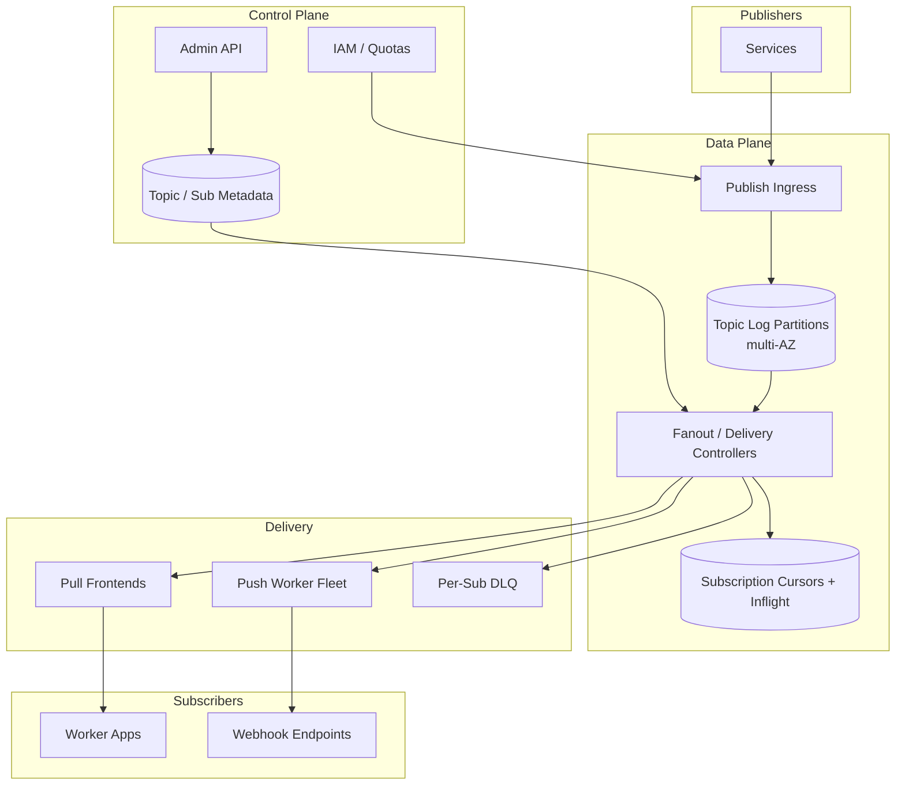
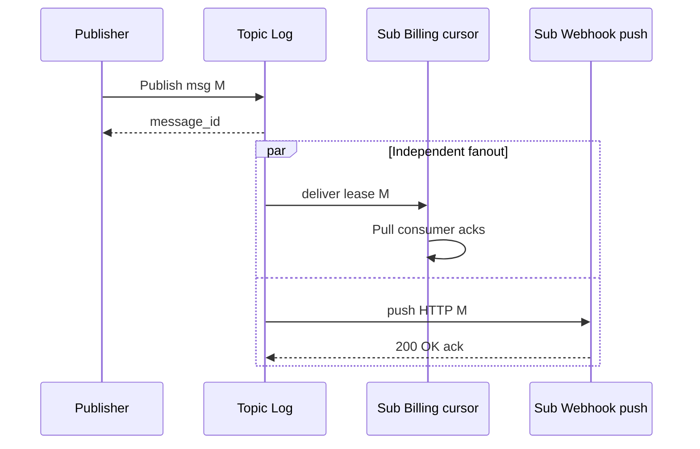

# System Design: Publish/Subscribe Infrastructure

> **Focus areas:** Topics · Subscriptions · Fanout · Push vs pull · Filtering · Ordering · Retention · Exactly-once / ack deadlines · Backpressure · Progressive scale  
> **Style:** End-to-end infrastructure design with progressive scale (10× → 100× → 1,000×)  
> **Interview theme:** Pub/Sub messaging fabric (SNS+SQS / Google Pub/Sub / Kafka fanout patterns) — one publish, many independent subscribers  
> **Quality bar:** Fanout math; subscription isolation; ack deadline; filter pushdown; clear MQ/Kafka boundaries

---

## Table of Contents

1. [Clarify Requirements (Interview Q&A)](#1-clarify-requirements-interview-qa)
2. [Back-of-the-Envelope Estimation](#2-back-of-the-envelope-estimation)
3. [High-Level Design](#3-high-level-design)
4. [Architecture Diagram](#4-architecture-diagram)
5. [Design Deep Dive](#5-design-deep-dive)
6. [Wrap-Up](#6-wrap-up)
7. [Deeper / Related Interview Questions](#7-deeper--related-interview-questions)

---

## 1. Clarify Requirements (Interview Q&A)

Design **pub/sub infrastructure**: publishers send messages to a **topic**; each **subscription** independently receives a copy (per its semantics); subscribers pull or receive push delivery.

### 1.0 What this is / is not

| Dimension | This doc | Not this |
|-----------|----------|----------|
| Core | Topic → N subscriptions fanout | Single competing work queue only |
| Independence | Slow subscription must not block others | Shared cursor across all readers |
| Delivery | At-least-once typical; ack deadline | Fire-and-forget UDP fantasy |
| Storage | Retain for subscription lag window | Infinite Kafka-style lake (optional backend) |
| Filtering | Server-side filters per subscription | Only client-side skip |

### 1.1 Functional Requirements

| # | Question to ask | Expected / typical interviewer answer | Design implication |
|---|-----------------|----------------------------------------|--------------------|
| F1 | Fanout model? | Each subscription gets every message (unless filtered) | Per-sub cursor / queue |
| F2 | Push and pull? | Both: pull for workers; push HTTPS for webhooks | Delivery adapters |
| F3 | Ack? | Ack deadline / ack id (pull); HTTP status (push) | Redelivery on nack/timeout |
| F4 | Filtering? | Attribute / CEL-like filters | Filter at fanout to save bandwidth |
| F5 | Ordering? | Optional per ordering_key | Ordered keys shards |
| F6 | Retention? | Hours–days sought by lagging subs | Backlog storage per topic/sub |
| F7 | Dead letter? | Per subscription DLQ | Poison isolation |
| F8 | Replay? | Seek subscription to time/snapshot | Cursor control |
| F9 | Exactly-once? | Optional dedup + idempotent sinks | EOS window |
| F10 | Schema? | Optional registry | Compatibility gates |
| F11 | Multi-tenant? | Projects/topics quotas | Isolation |
| F12 | Cross-region? | Regional topics + mirror | No sync global ISR MVP |
| F13 | Message size? | 1–10 MB max; claim-check larger | Enforce limits |
| F14 | Authz? | Publisher/subscriber IAM on topic/sub | Principal checks |

**MVP functional scope:**

1. CreateTopic / CreateSubscription (pull).
2. Publish (single + batch).
3. Pull + Acknowledge / ModifyAckDeadline.
4. Push subscription to HTTPS endpoint with OIDC/auth.
5. Per-subscription backlog and independent lag.
6. Basic attribute filters.
7. DLQ on max delivery attempts.
8. Quotas and metrics (publish rate, sub lag, push error rate).
9. Seek to time (Phase 1 ok if cursor rewind designed).

**Out of MVP:**

- Complex stream processing joins (use Flink/Dataflow on top)
- Exactly-once push to arbitrary HTTP without receiver help
- Global virtual topic with sync multi-region write
- Full AMQP broker feature parity

### 1.2 Non-Functional Requirements

| # | NFR | Target |
|---|-----|--------|
| N1 | Publish p99 | < 20–40ms in-region |
| N2 | End-to-end to healthy pull sub | p50 < 1s |
| N3 | Fanout isolation | Slow sub does not delay others |
| N4 | Durability | Multi-AZ persist before publish ack |
| N5 | Availability | 99.9%+ publish path |
| N6 | Delivery | At-least-once; duplicates possible |
| N7 | Push retry | Exponential backoff + DLQ |
| N8 | Security | TLS, IAM, signed push, encryption at rest |

### 1.3 Cases (User Flows & Edge Cases)

**Happy paths**

1. Service publishes `order.created` → billing pull sub + analytics pull sub + webhook push sub all receive.
2. Filter `region=eu` on EU billing sub → only matching messages delivered.
3. Push endpoint 503 → backoff retry → success.
4. Seek analytics sub to rewind 2 hours → reprocess.
5. Poison message fails 10× → subscription DLQ.

**Edge / failure cases**

| Case | Behavior |
|------|----------|
| One sub down for hours | Its backlog grows; others unaffected |
| Push endpoint too slow | Ack deadline / concurrency caps; backoff |
| Filter syntax error | Reject subscription update |
| Hot topic × 500 subs | Fanout amplification — shards + async fanout |
| Duplicate publish | Optional publisher message_id dedup |
| Ordering key stuck | HOL for that key in ordered mode |
| Retain expired | Cannot seek before retention; error |
| Unauthorized push receiver | Signature/OIDC fail; retry then DLQ |
| Schema incompatible | Reject publish if gating enabled |
| Thundering rewind | Rate-limit seek catch-up |

### 1.4 Scales (Progressive)

| Metric | Baseline | 10× | 100× | 1,000× |
|--------|----------|-----|------|--------|
| Topics | 20K | 200K | 2M | Multi-cell |
| Subscriptions | 100K | 1M | 10M | 100M |
| Publish msg/s | 100K | 1M | 10M | 100M |
| Fanout msg/s (deliveries) | 500K | 5M | 50M | 500M |
| Avg subs/topic | 5 | 5 | 5–10 | 5–20 |
| Push endpoints | 50K | 500K | 5M | Global |
| Retention | 1–3d | 3–7d | tiered | tiered |
| Projects/tenants | 5K | 50K | 500K | Cells |

**Fanout math:**

```text
Publish 100K msg/s × avg 5 subs = 500K deliveries/s baseline
Payload 2 KB → delivery bandwidth 1 GB/s order (plus retries)
100× → 50M deliveries/s → must be cellized and filtered early
```

**What each jump forces:**

- **10×:** Async fanout workers; per-sub storage shards; push delivery fleet.
- **100×:** Topic cells; filter pushdown; tiered backlog; subscription routing directory.
- **1,000×:** Regional fabrics; hierarchical fanout trees; tenant isolation clusters.

### 1.5 Etc. (Constraints & Assumptions)

- Pull is default for reliable processing; push for integration convenience.
- Filters evaluated server-side when selective.
- Backends may be log-structured (Kafka-like) **plus** per-sub cursors — architecture can reuse log ideas without exposing raw partitions to all users.

**Scope statement to repeat back:**

> Design **pub/sub infrastructure** with topics, independent subscriptions, pull and push delivery, ack deadlines, optional filters and ordering keys, retention for lagging consumers, DLQ, and backpressure—scaling via sharded topics and async fanout so one slow subscriber never stalls the topic.

---

## 2. Back-of-the-Envelope Estimation

### 2.1 Amplification

```text
deliveries ≈ publishes × matching_subscriptions
Filters may cut 10–90% depending on selectivity
Unfiltered 10M publish/s × 20 subs = 200M deliveries/s → PB/day territory
```

### 2.2 Storage

```text
Retain publish stream 3 days:
100K msg/s × 2 KB × 86400 × 3 ≈ 51.8 TB raw messages
Per-sub cursors tiny; backlog indexes larger if materializing per-sub queues
If copy-per-sub storage model: × avg subs — **avoid full copy**; prefer shared log + cursors
```

**Deal-breaker:** physically copying full payload N times per subscription at hyper-scale without shared storage.

### 2.3 Push fleet

```text
50K push subs, 10% active concurrent HTTPS → 5K outcalls
Each with concurrency 10 → 50K HTTP conns — dedicated delivery workers
```

### 2.4 Ack deadline tracking

```text
Inflight per busy sub: 10K × 200 B = 2 MB — trivial
Cluster-wide 100M inflight → 20 GB → shard by subscription
```

### 2.5 Control plane

```text
2M topics metadata OK in sharded KV
Watch config watch/fanout to data plane — eventually consistent OK with version
```

### 2.6 Hot keys / hot topics

Product launch topic with 2K subs → fanout storm; needs hierarchical distribution and admission.

### 2.7 Memory on pull clients

Client libraries buffer leased messages; server must bound outstanding leases per sub.

---

## 3. High-Level Design

### 3.1 Abstractions

```text
Project
  └── Topic (publish endpoint, schema optional)
        └── Subscription[] (filter, push/pull config, DLQ, ack deadline, ordering?)
              └── Cursor / backlog state
Message { id, data, attributes, publish_time, ordering_key? }
```

### 3.2 Shared log + subscription cursors (recommended)

```text
Publish appends to topic log partitions (by key/hash)
Each subscription stores cursor(s) per partition
Delivery = read from cursor → lease → ack advances cursor
```

**vs materialize-per-sub queue:** simpler isolation ops but storage ×N; use only for small fanout or special push buffers.

### 3.3 Partitioning

| Level | Key | Purpose |
|-------|-----|---------|
| Topic partitions | `hash(ordering_key or message_id)` | Scale publish/throughput |
| Subscription | id | Cursor + inflight shard |
| Fanout workers | `hash(topic, partition)` | Parallel deliver |

**Consumer groups analogy:** each subscription ≈ independent consumer group on the topic log.

### 3.4 Pull delivery

```text
Pull(max, return_immediately?)
→ lease messages until ack_deadline
Ack(ack_ids) / Nack / ModifyAckDeadline
```

### 3.5 Push delivery

```text
HTTPS POST signed body
2xx → ack
non-2xx / timeout → retry backoff → DLQ
Concurrency and max outstanding configurable
```

### 3.6 Filtering

| Approach | Pros | Cons |
|----------|------|------|
| Client filter | Simple | Wasted delivery |
| Server attribute match | Saves bandwidth | CPU at fanout |
| Partition by attribute | Great if selective | Inflexible keys |

**MVP:** server-side equality/presence filters on attributes. **100×:** pushdown + precompute filter indexes for common predicates.

### 3.7 Ordering

- Ordered subscriptions: per `ordering_key` serial delivery (pause key on outstanding unacked).
- Unordered: max parallelism.

### 3.8 Exactly-once / dedup

| Layer | Tool |
|-------|------|
| Publish | Optional `message_id` dedup window |
| Deliver | At-least-once leases |
| Sink | Idempotent handlers; EOS store for ack |

Push EOS is rare; prefer pull + transactional sink.

### 3.9 Retention & seek

```text
Topic retention window T
Subscription can seek to timestamp ≥ now-T
Compacted topics optional for changelog-style
```

### 3.10 Backpressure

- Publish quotas per topic/project.
- Per-subscription outstanding lease caps.
- Push concurrency caps; backoff on receiver 429/503.
- Topic-level overload: reject publishes; never drop silently without policy.
- Slow sub: lag metric; optional drop-oldest **only if** explicit subscription policy (rare).

### 3.11 Trade-off table: push vs pull

| | Pull | Push |
|--|------|------|
| Backpressure | Natural | Must tune concurrency |
| Receiver complexity | Client library | HTTPS endpoint |
| Firewall | Outbound from worker | Inbound publicly reachable |
| Batching | Easy | Possible |
| Exactly-once | Easier with local TX | Hard |

### 3.12 Compare siblings

| Need | Pick |
|------|------|
| Competing workers on tasks | Message Queue |
| Replayable event log / analytics | Kafka distributed log |
| Many independent subscribers / webhooks | **Pub/Sub** |

---

## 4. Architecture Diagram





---

## 5. Design Deep Dive

### 5.1 Reliability

**Data loss prevention**

- Persist+replicate before publish ACK.
- Don't advance cursor until ack; redeliver on deadline.
- DLQ after max attempts with error context.

**Retries & idempotency**

- Publish retries with publisher `message_id`.
- Delivery retries with backoff; subscribers idempotent on `message_id`.
- Push: idempotency keys in headers.

**Rate limits & backpressure**

- Project publish tokens; topic caps.
- Subscription outstanding caps.
- Push worker global concurrency budget; fair scheduling across subs.

**Failure isolation**

| Failure | Blast radius | Mitigation |
|---------|--------------|------------|
| Bad push URL | That sub | Circuit break; DLQ |
| Slow pull consumer | That sub lag | Cap leases; alert |
| Hot partition | Topic throughput | Repartition / key fix |
| Cell outage | Region subset | Multi-AZ; multi-cell DR |

### 5.2 Scalability

**Fanout architecture evolution**

1. **Baseline:** delivery service reads log, fans to cursors.  
2. **10×:** partitioned fanout workers; batch cursor updates.  
3. **100×:** hierarchical fanout (topic → sub-groups → subs); filter indexes.  
4. **1,000×:** regional meshes; subscription affinity; dedicated noisy-tenant cells.

**Storage tiers**

- Hot log segments local SSD; cold to object storage; seek may be slower for cold.

**Parallelization**

- More topic partitions → more publish/delivery parallelism.
- Ordered keys limit parallelism intentionally.

### 5.3 Maintainability

**Ops:** create/delete topics; drain subscriptions; seek; snapshot; redrive DLQ; adjust ack deadlines.

**Observability:** publish QPS, delivery QPS, sub lag (time + messages), push success/latency, ack deadline expirations, filter pass rate, DLQ rate, dedup hits.

**Migrations:** message envelope versioning; dual-write schema registry.

**Multi-tenant:** hard isolation for enterprise; fair share for free tier; abuse detection on push.

---

## 6. Wrap-Up

### Decision summary

| Decision | Choice | Why |
|----------|--------|-----|
| Storage | Shared topic log + per-sub cursors | Efficient fanout |
| Isolation | Independent subscriptions | Slow consumer safety |
| Delivery | Pull + push adapters | Broad integration |
| Ack | Deadline leases | Crash safety |
| Filters | Server-side | Save amplification |
| Ordering | Optional per key | Explicit tradeoff |
| Backpressure | Quotas + outstanding caps | Protect fabric |

### Phased rollout

1. **MVP:** topics, pull subs, publish, ack deadline, basic metrics.  
2. **Phase 1:** push, filters, DLQ, seek.  
3. **Phase 2:** ordering keys, tiered storage, hierarchical fanout.  
4. **Phase 3:** multi-region mirror, enterprise cells.

### Risks

- Unbounded push retries without DLQ.  
- Materializing N full copies per sub.  
- Ignoring fanout amplification in capacity plans.  
- Promising global ordering + infinite scale.

---

## 7. Deeper / Related Interview Questions

**Q1. How is a subscription different from a Kafka consumer group?**  
Similar idea (independent position on a log). Pub/Sub productizes IAM, push, filters, ack deadlines as first-class.

**Q2. Why shared log over per-sub queues?**  
Storage efficiency; still isolate via cursors. Per-sub queues explode disk with fanout.

**Q3. What happens if ack deadline is too short?**  
Duplicate deliveries; wasted work; possible side-effect dups.

**Q4. How do filters interact with ordering?**  
Filtered-out messages skip; ordering among delivered matches still holds for key.

**Q5. Push vs pull backpressure?**  
Pull: stop pulling. Push: 429/503 + concurrency limits + backoff.

**Q6. Exactly-once publish?**  
Dedup by message_id for a window; subscribers still see ≥1 without sink idempotency.

**Q7. How to rewind safely?**  
Seek API; bound rate; warn about non-idempotent sinks.

**Q8. Hot topic with thousands of subs?**  
Tree fanout; subscription sharding; require filters; tier subscriptions.

**Q9. Cross-region pub/sub?**  
Publish locally; async replicate topics; subscribers regional for latency.

**Q10. Poison message in ordered key?**  
Blocks key until DLQ policy moves it; surface metrics.

**Q11. Schema registry necessity?**  
Not required MVP; critical when many teams share topics.

**Q12. How to size partitions?**  
Target publish throughput and ordered-key distribution; watch per-partition lag.

**Q13. Security for push?**  
OIDC tokens / signed JWT; endpoint allowlists; rotate secrets.

**Q14. Retention too short?**  
Lagging subs lose data — alert lag vs retention SLO (same Kafka trap).

**Q15. Multi-tenant noisy neighbor?**  
Per-project quotas; move offenders to isolated cells.

**Q16. Can pub/sub replace MQ?**  
For fanout yes; for pure competing tasks MQ UX/VT may be simpler.

**Q17. Can pub/sub replace Kafka?**  
Productized ops vs raw log power; analytics often still want Kafka/lake.

**Q18. Delivery attempt counters?**  
Stored with lease; increment on redelivery; DLQ threshold.

**Q19. Batch publish atomicity?**  
Usually per-message success; document partial batch failures.

**Q20. Memory issues in fanout workers?**  
Bound batch sizes; streaming send; backpressure to log readers.

**Q21. Consistent hashing for sub assignment?**  
Assign push workers to subscriptions with consistent hash to reduce churn.

**Q22. Load balancing pull frontends?**  
Stateless; cursor ownership in backend; any FE can serve Pull for sub.

**Q23. Algorithm: exponential backoff for push?**  
`min(cap, base * 2^attempt)` + jitter; reset on success.

**Q24. Indexing attributes for filters?**  
At high selectivity, maintain inverted indexes topic→attr→offsets (advanced).

**Q25. Observability red flags?**  
Push error spikes, rising lag vs retention, publish throttle, fanout lag, DLQ growth.

**Q26. Exactly-once with push webhooks?**  
Receiver dedup store keyed by message_id; pub/sub cannot alone guarantee.

**Q27. Why ack ids opaque?**  
Capability security; encode partition/offset/generation; prevent cursor forging.

**Q28. Comparison to SNS+SQS?**  
SNS fanout to SQS/HTTP ≈ pub/sub; unified cursor model is Google-style alternative.

**Q29. Testing isolation?**  
Block one sub; assert others' E2E latency unchanged under load.

**Q30. First prototype?**  
Single topic log (one partition), two pull subscriptions with cursors, ack deadline, one push worker; kill subscriber test.

---

## Appendix A — Fanout Amplification Worked Example

```text
Topic: user-events
Publish: 20K msg/s
Subscriptions:
  - realtime-notify (filter 5% match) → 1K deliv/s
  - billing (100%) → 20K
  - analytics (100%) → 20K
  - audit (100%) → 20K
  - webhook-partner (filter 1%) → 200
Total ≈ 61.2K deliveries/s vs 100K if all unfiltered 5×20K
Filters matter.
```

## Appendix B — Ack Deadline State Machine

```text
AVAILABLE → LEASED (on pull/push send)
LEASED → ACKED (success) → cursor advance
LEASED → AVAILABLE (nack / deadline expiry) → redeliver
LEASED → DLQ (attempts > max)
```

## Appendix C — Hierarchical Fanout (100×)

```text
Topic partition leader
  → Fanout aggregator (per 100 subs)
      → Leaf delivery workers (per sub batch)
Reduces O(subs) work on critical publish path; publish returns after log append, fanout async
```

**Consistency note:** publish ACK means durable in topic log, not yet delivered to all subs (by design).

## Appendix D — Ordering Key HOL

```text
Key K has message M1 leased unacked
M2 for K waits
Unrelated key J continues
Policy: timeout M1 → redeliver or DLQ to unblock
```

## Appendix E — Progressive Scale Checklist

| Jump | Publish | Fanout | Delivery | Storage |
|------|---------|--------|----------|---------|
| 10× | More partitions | Async workers | Push fleet | Multi-AZ log |
| 100× | Cells | Hierarchy + filter index | Fair push scheduler | Tiered cold |
| 1,000× | Regional topics | Mesh | Edge push | Tenant cells |

## Appendix F — Capacity Planning Sheet

```text
Inputs: publish_rate, avg_sub_match_rate, avg_msg_size, retention_days, push_fraction
deliveries = publish_rate * sum(match_rate_i)
storage ≈ publish_rate * size * retention * RF
push_conns ≈ active_push_subs * concurrency
```

## Appendix G — Talk Track (8 minutes)

1. Topic vs queue vs log (1)  
2. Shared log + cursors (2)  
3. Pull/push + ack deadline (1)  
4. Filters & fanout math (1)  
5. Isolation + backpressure (1)  
6. Scale hierarchy/cells (1)  
7. Failure / DLQ drill (1)

## Appendix H — API Sketch

| Method | Path | Notes |
|--------|------|-------|
| POST | `/v1/projects/{p}/topics` | Create topic |
| POST | `/v1/topics/{t}:publish` | Batch publish |
| POST | `/v1/subscriptions` | Pull/push config + filter |
| POST | `/v1/subscriptions/{s}:pull` | Lease messages |
| POST | `/v1/subscriptions/{s}:acknowledge` | Ack ids |
| POST | `/v1/subscriptions/{s}:modifyAckDeadline` | Extend |
| POST | `/v1/subscriptions/{s}:seek` | Rewind |

---

*End of pub/sub infrastructure system design.*
