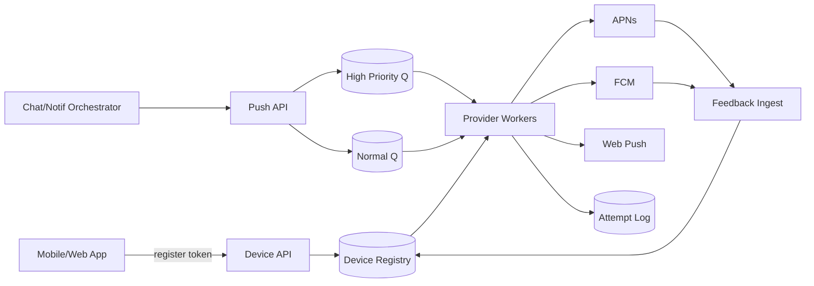
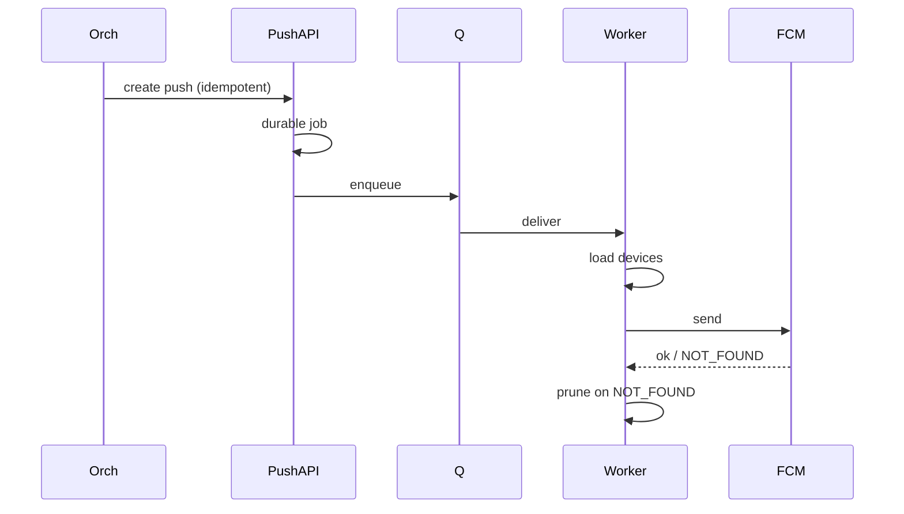

# System Design: Push Notifications

> **Focus areas:** Device tokens · APNs/FCM/WebPush · Token lifecycle · Collapse keys · Offline wake · Provider fan-out · Invalidation · Multi-app tenants  
> **Style:** End-to-end product design with progressive scale (10× → 100× → 1,000×)  
> **Quality bar:** Token hygiene; provider realities; at-least-once wakeups; collapse/priority; progressive scale  
> **Interview theme:** Senior / Staff — **mobile/web push delivery subsystem** (often under a multi-channel platform)

---

## Table of Contents

1. [Clarify Requirements (Interview Q&A)](#1-clarify-requirements-interview-qa)
2. [Back-of-the-Envelope Estimation](#2-back-of-the-envelope-estimation)
3. [High-Level Design](#3-high-level-design)
4. [Architecture Diagram](#4-architecture-diagram)
5. [Design Deep Dive](#5-design-deep-dive)
6. [Wrap-Up](#6-wrap-up)
7. [Deeper / Related Interview Questions](#7-deeper--related-interview-questions)
8. [Appendices](#8-appendices)

---

## 1. Clarify Requirements (Interview Q&A)

Goal: design the system that **registers devices, stores tokens securely, fans out push payloads to APNs/FCM/WebPush**, handles invalidations, and wakes offline apps—without treating push as a durable inbox.

### 1.0 What this is / is not

| Dimension | This doc | Not this |
|-----------|----------|----------|
| Job | Device push wakeup + payload delivery to OS vendors | Full notification preference orchestration (sibling doc) |
| Durability | Best-effort via vendor + our retry to vendor | Guaranteed in-app message history |
| Payload | Small, often data-only / encrypted pointer | Full email-sized HTML |
| Success | Vendor accepted (and optionally receipt) | User definitely saw banner |

### 1.1 Functional Requirements

| # | Question | Expected answer | Design implication |
|---|----------|-----------------|--------------------|
| F1 | Platforms? | iOS APNs, Android FCM, Web Push (VAPID) | Multi-provider adapters |
| F2 | Registration? | App uploads device token after permission | Device registry API |
| F3 | User mapping? | user_id ↔ many devices/sessions | Fan-out to all or filtered devices |
| F4 | Payload types? | Alert vs silent/data; rich media via URL | Size limits; collapse keys |
| F5 | Collapse / replace? | Chat “3 new messages” collapses | `collapse_id` / FCM collapse key |
| F6 | Priority? | High for OTP/chat; normal for marketing | Provider priority fields |
| F7 | TTL? | Expire undelivered pushes | `expiration` / TTL |
| F8 | Invalid tokens? | Unregister on vendor feedback | Async invalidation pipeline |
| F9 | Multi-app / brands? | Multiple bundle IDs / FCM projects | Tenant×app credentials |
| F10 | Topics / segments? | Optional topic subscribe | FCM topics or own cohort fan-out |
| F11 | Receipts? | Optional delivery receipts where supported | Best-effort status |
| F12 | Localization? | Title/body localized server-side or client | Prefer server render for consistency |
| F13 | Auth to vendors? | Token auth (APNs), service accounts (FCM) | Secret management + rotation |
| F14 | Dry-run / test? | Sandbox devices | Env separation |

**MVP scope:**

1. Register/unregister device tokens bound to `user_id` + `app_id`.  
2. `POST /v1/push` to user or device list with idempotency.  
3. Resolve devices → enqueue provider jobs.  
4. Send via APNs HTTP/2 and FCM HTTP v1; Web Push.  
5. Process invalid token feedback; prune registry.  
6. Support collapse keys, priority, TTL, silent pushes.  
7. Basic metrics: accept, send success, invalidation rate.  
8. Credential management per app.

**Out of MVP:** perfect cross-vendor delivery receipts; in-house long-poll substitute for web; guaranteed ordering of pushes; full preference engine (call upstream).

### 1.2 Non-Functional Requirements

| # | NFR | Target |
|---|-----|--------|
| N1 | Accept latency | p99 < 50–100ms durable |
| N2 | Time-to-vendor (chat/OTP) | p99 < 1–2s healthy |
| N3 | Durability of intent | Accepted push jobs not lost |
| N4 | Availability | 99.9% accept; vendor deps explicit |
| N5 | Token privacy | Tokens encrypted at rest; least privilege |
| N6 | Multi-region | Gateways global; registry home-cell |
| N7 | Fan-out | 1 user × 5 devices cheap; topics need planner |
| N8 | Cost/connections | Efficient HTTP/2 multiplexing to APNs |

### 1.3 Cases

**Happy:** Install → grant → register token → chat message → push all devices → tap opens deep link.

| Case | Behavior |
|------|----------|
| Token rotated | New register supersedes; old invalidated |
| User reinstall | New token; old becomes Unregistered |
| APNs 410 Gone | Delete token |
| FCM NOT_FOUND | Delete token |
| Collapse key storm | Vendor keeps latest |
| Payload too large | Reject at API; suggest data-only + fetch |
| OS notifications disabled | Sends “succeed”; no UI — product must handle |
| Credential expiry | Page; failover secondary key if any |
| Topic 10M | Use provider topics or own sharded fan-out |
| Duplicate send | Idempotency key collapses |

### 1.4 Progressive scale

| Metric | Baseline | 10× | 100× | 1,000× |
|--------|----------|-----|------|--------|
| MAU with push enabled | 1M | 10M | 100M | 1B |
| Devices registered | 1.5M | 15M | 150M | 1.5B |
| Pushes / day | 20M | 200M | 2B | 20B |
| Peak send / s | 1K | 10K | 100K | 1M |
| Invalidations / day | 50K | 500K | 5M | 50M |
| Apps / tenants | 5 | 30 | 100 | 500 |
| Avg devices / user | 1.5 | 1.5 | 1.8 | 2.0 |
| Topic broadcasts / day | 10 | 50 | 200 | 1K |

**Jumps:** 10× = dedicated push workers + HTTP/2 pools; 100× = sharded device registry + topic planner; 1,000× = regional vendor pinning, token tiering, extreme invalidation pipelines.

### 1.5 Scope repeat-back

> Build a **push delivery platform**: device registry, multi-provider send, collapse/TTL/priority, token invalidation, idempotent intents—optimized for wakeups at consumer scale, not as a source of truth inbox.

---

## 2. Back-of-the-Envelope Estimation

### 2.1 QPS

```text
20M pushes/day ≈ 230/s avg; peak ×8 ⇒ ~2K/s
Each push × 1.5 devices ⇒ ~3K vendor calls/s peak baseline
100×: ~200K device-sends/s peak — connection & shard design mandatory
```

### 2.2 Storage

```text
Device row ≈ 200–400 B → 1.5M devices ≈ 0.5–1 GB
Push attempt log 7d: 20M × 150 B ≈ 3 GB/day
```

### 2.3 Bandwidth / connections

```text
Payload 1 KB × 3K/s ≈ 3 MB/s; at 100K/s ≈ 100 MB/s
HTTP/2: in-flight ≈ QPS × RTT ≈ 10K × 0.05 = 500 streams shared across tens of conns
```

### 2.4 Hot keys

Broadcast-all without sharding; single FCM project credential rotation thundering herd; buggy client registering thousands of devices per user.

### 2.5 Latency budget (chat wakeup)

```text
Enqueue 5ms + device lookup 10–30ms + vendor 20–80ms → often <150ms p50 after persist
SLO: high-lane queue lag < 500ms
```

---

## 3. High-Level Design

### 3.1 Planes

| Plane | Role | Consistency |
|-------|------|-------------|
| Device registry | SoT for tokens | Strong per user shard |
| Push intent | Durable job | Idempotent create |
| Provider egress | Vendor I/O | At-least-once |
| Feedback | Invalidations | Eventual prune |

**Deal-breaker:** blocking chat message ACK on APNs round-trip.

### 3.2 Components

1. **Device API** — register, heartbeat, unregister.  
2. **Device Store** — sharded by `user_id`; token_hash index.  
3. **Push API** — create push intent.  
4. **Resolver** — user → devices; filters.  
5. **Queues** — high/normal priority.  
6. **APNs / FCM / WebPush Workers** — pooled connections.  
7. **Feedback Consumer** — prune tokens.  
8. **Credentials KMS** — per app secrets.  
9. **Metrics / Tracing**.

### 3.3 APIs

```text
POST /v1/apps/{app_id}/devices
{ user_id, platform, token, app_version, locale, device_id }

DELETE /v1/apps/{app_id}/devices/{device_id}

POST /v1/push
Idempotency-Key: ...
{
  "app_id": "ios_prod",
  "user_id": "u1",
  "notification": {"title":"...","body":"..."},
  "data": {"deeplink":"app://..."},
  "collapse_key": "chat:c9",
  "priority": "high",
  "ttl_seconds": 3600,
  "silent": false
}
```

### 3.4 Data model

```text
devices(device_pk, user_id, app_id, platform, token_hash, token_enc,
  push_endpoint, keys, app_version, locale, status, last_seen_at)

push_jobs(job_id, app_id, user_id, payload_ref, collapse_key,
  priority, ttl, status, idem_key, created_at)

push_attempts(attempt_id, job_id, device_pk, provider, status,
  provider_id, error_code, sent_at)
```

### 3.5 Trade-offs

| Topic | Choice | Why |
|-------|--------|-----|
| Push as inbox | **No** | OS drops; use chat/inbox SoT |
| Store raw tokens | Encrypt + hash for lookup | Breach impact |
| Topic via FCM | Huge broadcasts | Saves fan-out compute |
| Own cohort fan-out | Per-user personalization | More control |
| Sync send | Async after durable | Vendor latency |

---

## 4. Architecture Diagram





---

## 5. Design Deep Dive

### 5.1 Reliability

**Invariants**

1. Push job durable before API ACK (transactional outbox).  
2. Device register upsert by `(app_id, device_id)` or token hash.  
3. Invalid tokens removed/quarantined quickly.  
4. Retries honor collapse/TTL — don’t resurrect expired.  
5. High priority lane isolated from marketing.  
6. Secrets never in logs; lock-screen PII minimized.  
7. At-least-once to vendor; app dedupes via `notification_id` in data payload.

**Offline:** OS + vendor store until device online (within TTL). App on wake fetches authoritative state. Prefer **pointer payloads**, especially if E2EE.

**Ordering:** No global push order. Collapse keys = latest wins for a thread. Clients sync logs for true order.

**Idempotency layers:** HTTP Idempotency-Key → job_id; attempt_id per device; `notif_id` in payload.

**Backpressure:** Vendor 429 → reduce concurrency; delay queue; shed marketing; alert on chat lag.

**Delivery guarantees (honest)**

| Claim | Reality |
|-------|---------|
| Intent durable | Yes |
| Vendor accepted | At-least-once attempt |
| Banner shown | Not guaranteed |
| Order preserved | Only via app sync |

### 5.2 Scalability

| Scale | Moves |
|-------|-------|
| 1× | PG registry; worker fleet; few apps |
| 10× | Redis device cache; HTTP/2 pools; Kafka |
| 100× | Shard registry by user; separate feedback cluster |
| 1000× | Regional egress; topic planner; cold token tier |

**Token tiering:** active (seen 30d) vs dormant — marketing skips dormant; OTP may still try.

**Shard plan:** `hash(user_id) % N`; secondary `token_hash → user_id` for feedback deletes.

### 5.3 Maintainability

- Per-app credential rotation runbooks.  
- Provider contract tests + sandbox canaries.  
- Dashboards: invalidation spikes (often bad app release).  
- Multi-tenant: credential isolation mandatory.  
- Chaos: revoke key, 429 storm, feedback backlog.

### 5.4 Token lifecycle

```text
REGISTERED → ACTIVE (heartbeats)
          → INVALID (vendor)
          → STALE (no seen N days)
          → PURGED
Logout: unbind user_id; optionally keep device row
Cap devices per user (e.g. 20) — keep most recent last_seen
```

### 5.5 Web Push

Store endpoint + p256dh + auth encrypted; VAPID per app; 410 → delete; payload encryption RFC 8291.

### 5.6 Collapse & priority

| Use case | collapse_key | priority |
|----------|--------------|----------|
| Chat thread | `chat:{id}` | high |
| OTP | unique | high |
| Marketing | campaign id | normal |
| Badge | `badge` | normal |

### 5.7 Deal-breakers

1. Treating vendor ACK as durable product state.  
2. Giant payloads.  
3. Shared credentials across brands.  
4. Blocking producer on vendor RTT.  
5. Never processing invalidations.

---

## 6. Wrap-Up

| Decision | Choice |
|----------|--------|
| SoT | App backend / inbox — not push |
| Send path | Durable job → provider workers |
| Scale | Shard devices by user; topics for blasts |
| Hygiene | Aggressive invalidation |

**Phases:** MVP iOS+Android → Web Push → topics/regional → advanced receipts.

> “Push is a **wakeup fabric** with messy tokens; invest in registry hygiene, HTTP/2 egress, priority isolation, and make every payload safe to drop.”

---

## 7. Deeper / Related Interview Questions

**Q1. Why not use push as the message transport for chat?**  
Payload limits, OS dropping, no reliable order, E2EE tension. Use sync protocol + push wakeup.

**Q2. How do collapse keys interact with retries?**  
Retry must reuse collapse key so vendor replaces, not stacks duplicates.

**Q3. APNs JWT vs certificate?**  
Token auth scales better; rotate keys; cache JWT ~50 min.

**Q4. Fan-out to 5 devices vs 5M topic?**  
Per-user resolve for 5; FCM topic or sharded campaign for 5M.

**Q5. Silent push limitations?**  
iOS budgets/background limits; not guaranteed; don’t rely for critical.

**Q6. Multi-region token store?**  
Home cell per user or globally replicated registry with careful delete consistency.

**Q7. How to secure tokens at rest?**  
Envelope encryption; hash for index; decrypt only in workers.

**Q8. What causes invalidation spikes?**  
App bugs; cert mismatch; bulk reinstall; feedback backlog.

**Q9. Exactly-once push?**  
Not real. Idempotent job + app dedupe id.

**Q10. Priority lane starvation prevention?**  
Reserved workers + separate topics; latency SLOs per lane.

**Q11. Web Push vs FCM for Chrome Android?**  
Often FCM under the hood; still store endpoint correctly.

**Q12. Rate limit per device?**  
Yes — buggy loops; also per user and per app.

**Q13. Consistent hashing for workers?**  
Optional sticky by app_id for connection reuse.

**Q14. Delivery receipts reliability?**  
Best-effort; never gate product correctness.

**Q15. Provider outage?**  
Buffer with TTL; status page; SMS fallback via orchestrator—not inside pure push service.

**Q16. Badge counts?**  
Server authoritative unread; push sends badge integer; collapse key `badge`.

**Q17. Personalization at 1M broadcast?**  
Render offline (expensive) or generic push + app fetch.

**Q18. Data-only for E2EE?**  
Yes — ciphertext or ping; fetch sealed content.

**Q19. device_id vs token PK?**  
Stable `device_id` + rotating token field.

**Q20. Testing APNs in CI?**  
Mock adapter + periodic sandbox integration.

**Q21. Tenant 100× burst?**  
Ingress throttles; isolate queues; protect HTTP/2 pools.

**Q22. Ordering across collapse keys?**  
None — client sync.

**Q23. Stale tokens and cost?**  
Prune by last_seen; marketing excludes stale.

**Q24. HTTP/2 stream limits?**  
Bound concurrent streams; measure resets.

**Q25. Why encrypt web push payloads?**  
Push services intermediate; encryption protects content.

**Q26. Cross-app logout?**  
Unbind all devices for session; audit.

**Q27. SLO metrics?**  
Time-to-vendor, accept QPS, % invalid, collapse effectiveness, high-lane lag.

**Q28. DLQ for pushes?**  
Terminal non-invalid errors; invalid tokens → delete, not DLQ.

**Q29. Relation to multi-channel doc?**  
This is the push adapter + device plane; orchestrator calls it.

**Q30. Staff-level insight?**  
Token lifecycle + vendor connection management decide reliability more than “just Kafka.”

---

## 8. Appendices

### A. Provider errors

| Provider | Code | Action |
|----------|------|--------|
| APNs | 410 | Delete token |
| APNs | 429 | Backoff |
| FCM | UNREGISTERED | Delete |
| FCM | QUOTA | Backoff / shed |
| WebPush | 410 | Delete |

### B. Payload budgets

```text
APNs/FCM ~4 KB practical — prefer {id,type,collapse,deeplink}
```

### C. Worker pseudocode

```text
for job in high_priority_queue:
  if job.expired: mark EXPIRED; continue
  devices = registry.list_active(job.user_id, job.app_id)
  for d in devices:
    res = provider.send(d, job.payload, collapse=job.collapse, ttl=job.ttl)
    if res.invalid_token: registry.invalidate(d)
    elif res.retryable: requeue(job, backoff)
    else: record(attempt, res)
```

### D. Progressive scale narrative

**Baseline:** one region, PG devices, workers.  
**10×:** Kafka, HTTP/2 pools, Redis cache, invalidation consumer.  
**100×:** user-sharded registry, topic planner, feedback SLO.  
**1,000×:** regional egress cells, dormant token tier, tenant pool isolation.

### E. Related

Multi-channel notification · Mobile offline sync · Chat systems · Email delivery

### F. Dual-write outbox

```text
Begin tx: insert push_jobs; insert outbox_events; Commit
Publisher relays outbox → Kafka
Reconciler scans stuck outbox — never best-effort publish without reconciler
```

### G. Privacy

Tokens are credentials; prefer data-only for sensitive apps; GDPR delete removes devices + tombstones logs; never spam OS re-prompt from server.

### H. Multi-app config

```text
AppConfig { app_id, platform, bundle_id, credentials_ref, env, default_ttl,
  max_payload_bytes, rate_limit_qps }
```

### I. Failure drills

1. Revoke APNs key → page, not silent failure.  
2. FCM 429 → autotune concurrency; shed marketing.  
3. Feedback backlog 1h → measure dead-token send rate.  
4. Redis cache down → DB fallback.  
5. Idempotency replay → zero double send.

### J. Capacity worksheet

```text
Batch marketing must not align with OTP peak
Spread campaigns over 10–20 minutes
Reserved high-lane capacity = % of workers never stolen by P3
```

### K. Extended Qs

**Q31.** Hash tokens for lookup to avoid raw tokens in indexes/logs.  
**Q32.** Cap fan-out at N devices; alert on anomalies.  
**Q33.** Version payloads with `schema_v`; old apps ignore unknown.  
**Q34.** Regional egress near vendor POPs after home-cell job create.  
**Q35.** Collapse effectiveness = reduction in stacked banners for busy threads.

### L. Interview closing checklist

- Push ≠ inbox SoT  
- Token encrypt + invalidation pipeline  
- Priority queues + collapse + TTL  
- HTTP/2 connection pools  
- Outbox durability  
- Scale: shard by user → regional egress

### Z. Interview 45-minute timebox

| Min | Focus |
|-----|-------|
| 0–5 | Scope, is/is-not, MVP lock |
| 5–12 | Estimation + fan-out/delivery math |
| 12–22 | HLD components + mermaid |
| 22–35 | Reliability: guarantees, offline, ordering, idempotency |
| 35–40 | Scale jumps 10×/100×/1000× |
| 40–45 | Deeper traps + wrap-up |

### Z2. Explicit delivery guarantee card (say this)

```text
Producer ACK  => durable intent/log
Transport     => at-least-once to devices/providers
Display       => client dedupe / inbox idempotency
Order         => per conversation/group/mailbox — not global
Offline       => sync cursor is source of healing; push is wakeup
```

### Z3. Operability golden signals

- Accept/persist latency & errors  
- Fan-out / provider lag  
- Queue depth by priority  
- Sync catch-up lag after reconnect  
- Invalidation / bounce / membership error rates  
- Cost proxies (SMS, media egress, push)

### Z4. Kill switches

- Disable typing/presence  
- Shed marketing/push previews  
- Freeze hot group / tenant  
- Force sync-only mode (no realtime)  
- Pause GC only with storage alarm (disposable)

### Z5. Final one-liner bank

- Notifications: priority lanes + preference snapshots  
- Push: wakeup fabric + token hygiene  
- Email ESP: reputation + suppression  
- Gmail: hostile MX + user-sharded mailbox  
- Disposable: TTL GC is the product  
- 1:1: single-writer seq log  
- WhatsApp: E2EE envelope relay  
- Groups: hybrid fan-out math  
