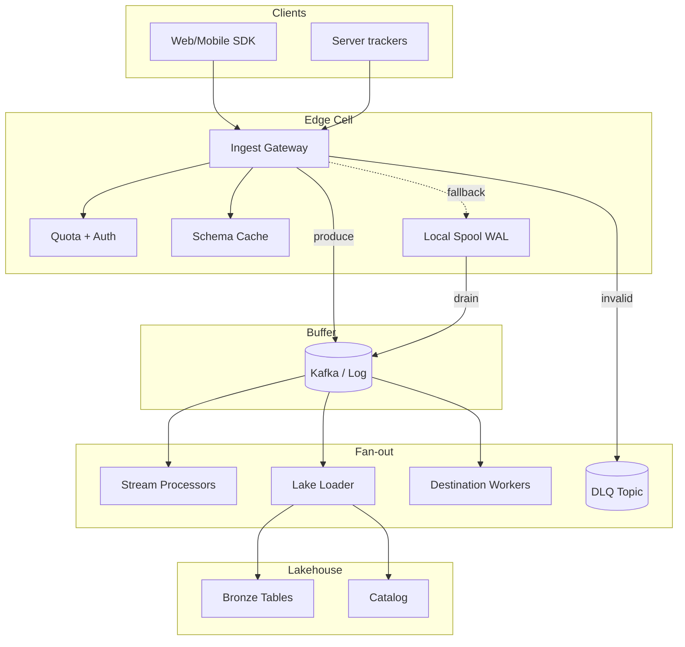
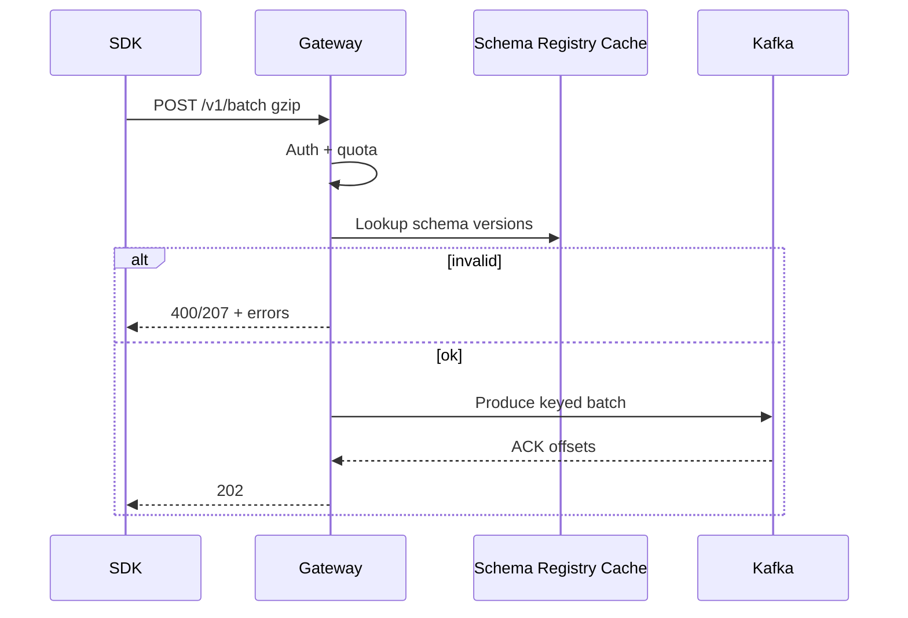

# System Design: Real-time Event Ingestion Platform

> **Focus areas:** Edge ingest · Validation & schema · Partitioned buffering · Backpressure · Fan-out to stream/lake/search · Exactly-once-ish sinks · Multi-tenant quotas · Progressive scale  
> **Style:** End-to-end product/infrastructure design with progressive scale (10× → 100× → 1,000×)  
> **Interview theme:** Segment / Snowplow / Amplitude / Kafka-ingest gateway class — high-EPS telemetry & product analytics events  
> **Quality bar:** Domain-specific EPS math, explicit loss vs latency trade-offs, failure-first buffering

---

## Table of Contents

1. [Clarify Requirements (Interview Q&A)](#1-clarify-requirements-interview-qa)
2. [Back-of-the-Envelope Estimation](#2-back-of-the-envelope-estimation)
3. [High-Level Design](#3-high-level-design)
4. [Architecture Diagram](#4-architecture-diagram)
5. [Design Deep Dive](#5-design-deep-dive)
6. [Wrap-Up](#6-wrap-up)
7. [Deeper / Related Interview Questions](#7-deeper--related-interview-questions)

---

## 1. Clarify Requirements (Interview Q&A)

Design a **real-time event ingestion platform**: accept massive volumes of product/telemetry events from clients and servers, validate them, durably buffer, and fan out to streaming, lakehouse, and online consumers with controlled loss policies.

### 1.0 What this is / is not

| Dimension | This doc | Not this |
|-----------|----------|----------|
| Product | Multi-tenant event ingest + pipeline | Full product analytics UI / BI tool |
| Hot path | HTTP/SDK collect → validate → buffer → fan-out | Ad-hoc warehouse SQL as ingest |
| Latency | Seconds to low minutes to lake; sub-second to stream optional | Hard real-time control loop (<10ms) |
| Delivery | At-least-once into buffer; sink EOS patterns | Magical exactly-once from browser |
| Schema | Versioned event contracts | Schemaless infinite JSON forever without governance |

### 1.1 Functional Requirements

| # | Question to ask | Expected / typical interviewer answer | Design implication |
|---|-----------------|----------------------------------------|--------------------|
| F1 | Event sources? | Mobile/web SDKs, server track APIs, IoT lightly | Batching SDK; gzip; offline queue |
| F2 | ACK semantics? | 202 after durable buffer (or edge disk) | Do not ACK only after warehouse load |
| F3 | Schema? | Registered event types + optional open props | Schema registry; drop/DLQ invalid |
| F4 | Ordering? | Per `anonymous_id`/`user_id` best-effort | Partition key; not global order |
| F5 | PII? | Emails/IPs possible; hashing/redaction options | Edge enrich + policy; encryption |
| F6 | Destinations? | Kafka/stream, lakehouse tables, optional reverse-ETL | Connector framework |
| F7 | Dedup? | Client retries → need event_id dedup window | See exactly-once companion doc |
| F8 | Late events? | Hours–days late from mobile offline | Event-time vs ingest-time; watermarking downstream |
| F9 | Multi-tenant isolation? | Hard noisy-neighbor protection | Quotas + per-tenant topics/partitions |
| F10 | Replay? | Reprocess last N days from lake/buffer | Retain raw bronze |
| F11 | Admin? | Source catalog, schema evolve, destination config | Control plane separate |
| F12 | Bot/abuse? | Flood protection | WAF, API keys, rate limits, anomaly |
| F13 | Sync track vs batch? | Both `/v1/track` and `/v1/batch` | Batch preferred from SDKs |
| F14 | Consent / opt-out? | Region + user flags | Drop before durable store when required |

**MVP functional scope:**

1. Authenticated `track` / `batch` HTTP APIs + server SDK.
2. Validate envelope (event name, timestamp, message_id, write_key/tenant).
3. Schema check against registry (compat mode); invalid → DLQ + reason.
4. Durable append to streaming log (Kafka) partitioned by tenant+user key.
5. Fan-out workers: (a) real-time stream consumers, (b) lakehouse bronze loader.
6. Per-tenant quotas (EPS / bytes); 429 with Retry-After.
7. Idempotency via `message_id` dedup window (e.g. 24–72h).
8. Metrics: accept QPS, validate fail %, buffer lag, sink lag, DLQ rate.

**Out of MVP:**

- Full identity graph resolution (stitching) as synchronous path
- Sub-10ms ingest ACK with global multi-region sync
- Complex CEP engine inside ingest gateway
- Guaranteed exactly-once to every SaaS destination

### 1.2 Non-Functional Requirements

| # | Question | Expected answer | Target |
|---|----------|-----------------|--------|
| N1 | Ingest ACK latency? | SDK non-blocking | p50 < 30ms, p99 < 100ms edge→ACK (same region) |
| N2 | Durability of ACK? | No silent loss after 2xx | Quorum log or fsynced edge spool |
| N3 | Availability? | Collect must survive AZ loss | 99.99% edge; multi-AZ |
| N4 | End-to-end to lake? | Near-real-time | p95 < 1–5 min bronze visible |
| N5 | Consistency? | At-least-once; deduped best-effort | Document residual dup risk after TTL |
| N6 | Multi-region? | Regional ingest; aggregate to home lake | Geo DNS / Anycast |
| N7 | Burst tolerance? | Flash sales / viral spikes | Edge buffers + elastic consumers |
| N8 | Cost? | Dominated by volume | Compression, sampling tiers, cold retention |

### 1.3 Cases (User Flows & Edge Cases)

**Happy paths**

1. SDK batches 20 events → POST `/v1/batch` → edge validates → produce Kafka → 202.
2. Stream processor reads tenant topic → updates online counters.
3. Loader micro-batches to bronze Parquet every 30–60s → catalog commit.
4. Schema adds optional field → forward-compatible consumers continue.
5. Mobile offline 8h → flush queue → late events accepted with original `timestamp`.
6. Replay job reads bronze for one day → rebuilds silver.

**Edge / failure cases**

| Case | Behavior |
|------|----------|
| Kafka unavailable | Edge local spool (disk) up to capacity; then 503/429; never lie 202 |
| Invalid schema | 400 for sync strict API; or accept+DLQ for best-effort collect |
| Duplicate `message_id` | Drop or mark duplicate; do not double-count in sinks with dedup |
| Oversized payload | Reject >1–512KB policy; suggest object pointer pattern |
| Clock skew | Server `received_at`; keep client `timestamp`; clamp extreme future |
| Tenant flood | Quota → 429; other tenants unaffected |
| PII in free-form props | Optional tokenization pipeline; policy pack per tenant |
| Partial batch | Per-event status or all-or-nothing — pick and document (prefer per-event in batch response) |
| Destination down | Buffer lag grows; alert; do not block ingest ACK |
| Consent revoke | Drop matching events at enrich stage; audit |

### 1.4 Scales (Progressive)

| Metric | Baseline | 10× | 100× | 1,000× |
|--------|----------|-----|------|--------|
| Peak events/sec (cluster) | 100K | 1M | 10M | 100M |
| Avg event size (compressed wire) | 500 B | 500 B | 400–600 B | 400–600 B |
| Peak ingress | ~50 MB/s | ~500 MB/s | ~5 GB/s | ~50 GB/s |
| Tenants | 1K | 10K | 100K | 1M |
| Hot tenant share | 20% | 20% | 30% | whale cells |
| Distinct event types | 5K | 20K | 100K | 500K |
| Bronze storage / day | ~4 TB | ~40 TB | ~400 TB | ~4 PB |
| Edge POPs / regions | 2 | 5 | 15 | Global |
| Stream consumers | 50 | 500 | 5K | Multi-cluster |

**What each jump forces:**

- **10×:** Separate ingest gateway from processing; Kafka sizing; schema cache; per-tenant partitions or fair share.
- **100×:** Regional cells; edge spool; hierarchical quotas; lake micro-batch tuning; cold/raw compaction.
- **1,000×:** Whale tenants on dedicated pipelines; sampling/aggregation tiers; multi-cluster Kafka; object-store first buffering for some paths.

### 1.5 Etc. (Constraints & Assumptions)

- **Browser constraints:** `sendBeacon` / keepalive; limited retries; batch aggressively.
- **Mobile:** battery — large batches, exponential backoff, disk queue.
- **Compliance:** GDPR drop / hash IP; regional residency for raw events if required.
- **Not building:** full Kafka from scratch — use Kafka-class buffer as dependency (can deep-dive).

**Scope statement to repeat back:**

> Design a **real-time event ingestion platform**: global collect APIs, schema-validated events, durable streaming buffer, fan-out to stream + lakehouse bronze, multi-tenant quotas and dedup, starting at ~100K EPS and scaling through regional cells to 100M EPS. ACK means durable buffer, not warehouse commit.

---

## 2. Back-of-the-Envelope Estimation

### 2.1 Traffic

```text
Baseline peak: 100,000 events/s
Avg 500 B on wire compressed → 50 MB/s
Daily events ≈ 100K * 0.3 duty * 86400 ≈ 2.6B/day (if peak:avg ~3–5, tune)
Use interviewer numbers; show method:

Peak EPS × avg size = ingress MB/s
Kafka RF=3 → ~3× network for storage plane
```

### 2.2 Edge concurrency

```text
If each HTTP batch averages 20 events and 40ms server time:
Batch QPS = 100K/20 = 5K batch/s
Concurrent requests ≈ 5K * 0.04 = 200 → trivial for gateway fleet
At 100M EPS: batch QPS 5M → need heavy batching (200+/batch) or UDP/gRPC streaming ingest
```

### 2.3 Storage (bronze)

```text
100K EPS × 500 B × 86400 ≈ 4.3 TB/day raw compressed-equivalent
× 365 ≈ 1.6 PB/year before compaction/expiry
Retention 90 days → ~390 TB — plan lifecycle policies
```

### 2.4 Dedup store

```text
message_id UUID 16 B + overhead ~32–64 B
Window 48h unique ids: 100K EPS × 48 × 3600 ≈ 1.7e10 ids
× 40 B ≈ 680 GB — too big for single Redis
→ sharded Redis/Bloom+exact tier / retain hash only / probabilistic for analytics
```

### 2.5 Schema registry cache

```text
5K event types × 5 versions × 2 KB schema ≈ 50 MB — cache on every gateway
100× types → still RAM-friendly; use version digests
```

### 2.6 Fan-out amplification

```text
1 ingest → Kafka + 2 sinks = ~1 write + 2 reads of same data
Lake loader commit every 60s: files ≈ partitions × (60s / microbatch)
Small files risk: 1K partitions × 1 file/min = 1.4M files/day → compact
```

### 2.7 Hot tenants

```text
Top tenant 20% of 100K = 20K EPS alone
Needs dedicated partitions / cluster slice; fair scheduler so 999 others live
```

### 2.8 Bandwidth (multi-region)

```text
Cross-region mirror of raw firehose is expensive — prefer regional bronze + aggregated silver centralization
```

---

## 3. High-Level Design

### 3.1 Recommended architecture

```text
SDK / Partners
  → Edge Ingest Gateway (TLS, auth, quota, validate, enrich)
      → Durable Buffer (Kafka topics per cell / tenant class)
          → Stream Router (real-time consumers)
          → Lake Loader (bronze → silver jobs)
          → Optional Destinations (webhooks, warehouses) via delivery workers
Control plane: schema registry, source/destination config, keys, quotas
```

### 3.2 API sketch

```text
POST /v1/track
POST /v1/batch          # preferred
POST /v1/identify       # traits (may be separate store)
GET  /v1/health

Headers: Authorization: Bearer <write_key>, Content-Encoding: gzip
Body event:
{
  "message_id": "uuid",
  "event": "Order Completed",
  "timestamp": "ISO-8601",
  "user_id": "...",
  "anonymous_id": "...",
  "properties": {...},
  "context": { "ip", "ua", "library", "locale", ... }
}

Responses:
202 Accepted { "success": true }           # durable buffer
207 Multi-Status for partial batch
429 { "Retry-After": seconds }
400 validation error (sync strict)
```

### 3.3 Envelope vs payload

| Field | Purpose |
|-------|---------|
| `message_id` | Dedup / idempotency |
| `event` + schema version | Contract |
| `timestamp` | Event time |
| `received_at` | Ingest time (server) |
| `tenant_id` / `write_key` | Tenancy |
| `partition_key` | `hash(tenant, user_id \| anonymous_id)` |
| `properties` | Business payload |

### 3.4 Schema strategy

| Mode | Behavior | Use |
|------|----------|-----|
| Strict | Reject unknown / missing required | Server critical pipelines |
| Compat-forward | Allow new optional fields | Product analytics default |
| Open properties | `properties` map with size limits | Growth teams |
| Evolve | Registry compatibility checks on publish | Governed types |

**Deal-breaker:** silent schema coercion that drops fields without DLQ/metrics.

### 3.5 Buffer choice

| Option | Pros | Cons | When |
|--------|------|------|------|
| Kafka-class log | Replay, fan-out, proven | Ops | **Default** |
| Pulsar | Tiered native | Ecosystem | Alt |
| Kinesis | Managed | Cost/lock-in | Cloud-std |
| S3 first + manifest | Cheap huge bursts | Higher latency | Extreme cold path |

**MVP:** Kafka; gateway never ACKs before produce success (or local spool with crash-safe WAL).

### 3.6 Edge spool (reliability upgrade)

```text
On Kafka 5xx / timeout:
  append to local disk WAL (or Redis Streams regional)
  background drain when healthy
  ACK 202 only if spool durable OR Kafka durable
Capacity limit → shed load (503) rather than OOM
```

### 3.7 Fan-out sinks

1. **Real-time:** consumer groups per product (fraud, personalization).
2. **Bronze lake:** partitioned by `tenant_id`, `date`, `hour`; Parquet; transactional commits.
3. **Delivery:** webhook workers with exponential backoff + DLQ (at-least-once).

### 3.8 Control vs data plane

| Plane | Contents |
|-------|----------|
| Data | Gateway, Kafka, loaders, delivery |
| Control | Schema registry, API keys, quota configs, destination connectors, audit |

Control plane outage: gateways use **cached schemas/quotas** with TTL; fail-closed on auth if keys unverifiable.

### 3.9 Trade-offs

| Choice | Prefer | Avoid |
|--------|--------|-------|
| ACK after Kafka | Correct durability story | ACK on HTTP receive only |
| Per-tenant topic | Strong isolation | Millions of topics — use shared topics + tenant field + quotas |
| Dedup 48h exact | Low dupes | Unbounded memory — shard/tier |
| Regional ingest | Latency + residency | Hairpin all to one region |

### 3.10 Why not “write Postgres then stream”?

OLTP cannot sustain 100K–100M EPS event writes. Use log/object buffer; derived stores async.

---

## 4. Architecture Diagram



### 4.1 Ingest sequence



### 4.2 Cell layout (100×)

```text
DNS → regional cell (us-east, eu-west, ...)
Each cell: gateway fleet + Kafka + spool
Bronze in regional bucket; silver curated to home region if needed
```

---

## 5. Design Deep Dive

### 5.1 Reliability

**Loss prevention**

- 2xx ⇒ event in Kafka **or** crash-safe spool.
- Replication RF≥3 on buffer; disk WAL fsync on spool.
- Never drop on validate failure without DLQ+metric (unless consent-required drop).

**Retries & idempotency**

- Clients retry with same `message_id`.
- Dedup store / sink unique keys suppress duplicates (see exactly-once doc).
- Loaders use idempotent partition overwrites or MERGE on `message_id`.

**Backpressure**

- Kafka produce buffer timeout → spool → if spool full, 503/429.
- Quotas before heavy validation work.
- Sink lag alerts; autoscaling consumers; load shedding on non-critical destinations first.

**Rate limits**

- Hierarchical: org → workspace → source write_key (EPS + bytes + connections).
- Burst tokens for mobile reconnect storms.

**Failure checklist**

| Failure | Behavior |
|---------|----------|
| Schema registry down | Use cache; optionally accept with `schema_unverified` flag |
| Kafka down | Spool; expire oldest only with loud alarms |
| Lake commit fail | Retry; do not ACK already-acked (already durable) |
| Poison event | DLQ; skip |
| Clock jump | Prefer server time for partitioning received_at |

### 5.2 Scalability

**Sharding**

- Kafka key: `tenant_id:user_key` for locality; random for pure throughput topics.
- Cells by geography; whale tenants → dedicated cluster.
- Gateway stateless; scale horizontally behind L7 LB / Anycast.

**Storage tiers**

| Tier | Retention | Format |
|------|-----------|--------|
| Kafka hot | 1–3 days | Log |
| Bronze | 30–90 days | Parquet |
| Silver/Gold | Longer curated | Tables |
| Archive | Years | Cold objects |

**Parallelization**

- Loaders: one task per Kafka partition.
- Compaction jobs coalesce small files hourly/daily.
- Destination deliveries sharded by destination id.

**Progressive scale**

| Jump | Change |
|------|--------|
| 10× | Kafka expansion; gateway autoscaling; schema cache |
| 100× | Regional cells; spool; hierarchical quotas; file compaction |
| 1,000× | Whale isolation; sampling products; S3-buffer path; multi-cluster |

### 5.3 Maintainability

**Observability**

| SLI | SLO idea |
|-----|----------|
| Accept success rate | 99.99% excluding client 4xx |
| ACK latency p99 | <100ms regional |
| Buffer produce fail | ~0 sustained |
| DLQ rate | budget per tenant |
| Bronze freshness | <5 min p95 |
| Dedup residual | measured via canaries |

**Schema migrations**

- Publish new version to registry with compatibility check.
- Gateways pull versions; dual-read period.
- Consumers pin min version.

**Multi-tenant ops**

- Per-tenant dashboards: EPS, error %, lag.
- Kill switch: drop event names / sources.
- Backfill API: replay bronze → destination.

**Ops runbooks**

1. Kafka under-replicated → pause noncritical sinks; protect ingest.
2. Spool growth → scale brokers / emergency sampling.
3. Small files → raise microbatch; run OPTIMIZE.
4. Hot tenant → move to dedicated topic set.

---

## 6. Wrap-Up

### 6.1 Decisions

| Decision | Choice |
|----------|--------|
| ACK point | Durable Kafka/spool |
| Buffer | Kafka-class log |
| Schema | Registry + compat modes |
| Isolation | Quotas + cells + optional dedicated |
| Lake path | Bronze micro-batch + compaction |
| Dedup | message_id windowed |

### 6.2 Phased delivery

1. MVP collect + Kafka + bronze + quotas + DLQ  
2. Edge spool + regional cells + hierarchical quotas  
3. Advanced identity (async) + destination framework + sampling tiers  
4. Whale architecture + autonomous compaction/rebalance  

### 6.3 Closing line

> **ACK means durable buffer, not warehouse.** Validate and quota at the edge, fan out asynchronously, keep bronze for replay, and scale with cells—not a bigger monolith gateway.

---

## 7. Deeper / Related Interview Questions

**Q1. Why not ACK after Snowflake insert?**  
Adds seconds–minutes latency and couples collect availability to warehouse; violates SDK UX and magnifies loss during WH outages.

**Q2. sendBeacon and retries?**  
Best-effort; may not retry. Prefer SDK queue + batch; server dedup for duplicates when both fire.

**Q3. Event time vs processing time?**  
Partition lake by `received_at` for ops; analytics use `timestamp` with late-arrival windows.

**Q4. How to avoid millions of Kafka topics?**  
Shared topics with `tenant_id` field + quotas; dedicated topics only for enterprise whales.

**Q5. Bloom filter for dedup?**  
Good accelerator; false positives hurt — use exact store for money events; probabilistic OK for approximate analytics.

**Q6. How do you handle schema breaking changes?**  
Registry rejects incompatible publish; dual-write new event name; consumers migrate; sunset old.

**Q7. IP anonymization where?**  
Edge enrich before Kafka if residency/PII policy requires; document irreversible hash.

**Q8. Backpressure vs losing events?**  
Prefer degrade destinations and spool; only sample/drop with explicit policy + customer agreement.

**Q9. Multi-region active-active dedup?**  
Hard — home region for exact dedup or accept cross-region residual duplicates.

**Q10. gRPC streaming ingest vs HTTP batch?**  
Streaming lowers overhead at 10M+ EPS server-to-server; HTTP batch enough for MVP SDKs.

**Q11. How to test ingest correctness?**  
Canary events with known IDs; assert exactly one bronze row after retries/chaos.

**Q12. Partition count for loaders?**  
Balance Kafka parallelism vs small files; often hundreds not tens of thousands per topic.

**Q13. What belongs in `context` vs `properties`?**  
Context = library/runtime; properties = business; enforce size limits separately.

**Q14. Cost runaway controls?**  
Per-tenant byte budgets; property allowlists; server-side sampling configs.

**Q15. Exactly-once to webhook?**  
At-least-once + destination idempotency key header; cannot control SaaS fully.

**Q16. Why gzip at edge?**  
Wire savings dominate; CPU cheap relative to egress; SDK compresses batches.

**Q17. Hot partition from one user?**  
Salt partition key for firehose; keep unsalted where order required.

**Q18. Control plane cache poisoning?**  
Signed schema versions; version pins; short TTL + ETag.

**Q19. GDPR delete after ingest?**  
Bronze deletion jobs by user_id; Kafka retention natural expiry; document RPO for deletes.

**Q20. How does this differ from logging pipeline (ELK)?**  
Stricter product schema, multi-tenant billing/quotas, lakehouse contracts, SDK semantics — not only free text logs.

**Q21. Load balancer algorithm?**  
L7 least-requests / EWMA latency; connection draining for deploys; sticky not required.

**Q22. Memory on gateway?**  
Bound request body; stream decompress with caps; recycle parsers; no unbounded batch assemble.

**Q23. When S3-first ingest?**  
Extreme bursty bulk loads (partner dumps) where minutes latency OK; still publish notify event to Kafka.

**Q24. Observability cardinality?**  
Careful label sets — do not put `user_id` on metrics; use tenant + event_name aggregates.

**Q25. Deal-breakers?**  
ACK without durability; single shared DB queue; no quotas; no DLQ; global one-region hairpin for EU data.

---

*End of real-time event ingestion platform system design.*

---

## Appendix — Operational and Interview Depth


### A.1 SDK design constraints

Mobile/web SDKs must survive offline, app kill, and flaky networks. Persist a local queue with
max bytes and an explicit drop-oldest or drop-newest policy. Use exponential backoff with full
jitter. Prefer /batch with gzip. Generate message_id client-side before enqueue so retries are
stable. Design for hours of late arrival from mobile background limits.


### A.2 Enrichment pipeline

Edge enrichers add received_at, careful geo, library versions, and write_key to tenant_id.
Heavy enrichments (identity graph, bot scores) belong async after the buffer -- never block ACK
on ML. Feature-flag enrichment packs per tenant.


### A.3 DLQ taxonomy

| Reason | Action |
|--------|--------|
| SCHEMA_INVALID | Fix producer; replay from DLQ after |
| AUTH_REVOKED | Drop; audit |
| PAYLOAD_TOO_LARGE | Client fix; optional pointer upload |
| CONSENT_BLOCK | Silent drop with metric |
| SINK_TIMEOUT | Retry sink; not ingest DLQ |


### A.4 Bronze partitioning strategy

Partition by tenant_id / dt / hour / event. Avoid high-cardinality user_id partitions.
Compaction merges small files per partition hour. For GDPR deletes, plan rewrite jobs or a
secondary index; naive bronze scans are expensive.


### A.5 Sampling and cost tiers

Server-side sample rates per event name using deterministic hash(message_id) so retries do not
bias. Always keep errors and security events at 100% sample.


### A.6 Abuse and bot resistance

API keys + per-key quotas; WAF; anomaly on EPS spikes. Browser write_keys are exposeable --
bind origins, rate limit, and treat all client payloads as untrusted.


### A.7 Multi-region residency

EU tenants resolve to an EU cell; bronze stays in EU. Mirror only aggregated or anonymized data
globally. Call out that cross-region raw PII mirror may be illegal.


### A.8 E2E canary

Synthetic SDK emits a unique id every minute per cell; assert Kafka visibility within seconds
and bronze within minutes; page on miss. Keep canaries out of customer billing metrics.


### A.9 Capacity dialogue sample

At 1M EPS and 500B, ingress is about 500MB/s, about 1.5GB/s with RF=3. That is tens of brokers
with headroom. Exact 48h UUID dedup is on the order of 1e10+ keys -- shard Bloom+Redis or lean
on sink-level dedup for analytics-grade pipelines.


### A.10 Staff talking points

ACK after durable buffer; schema+DLQ; quotas/cells; bronze for replay; late events are normal;
never block collect on warehouse; whale isolation at 100x.

