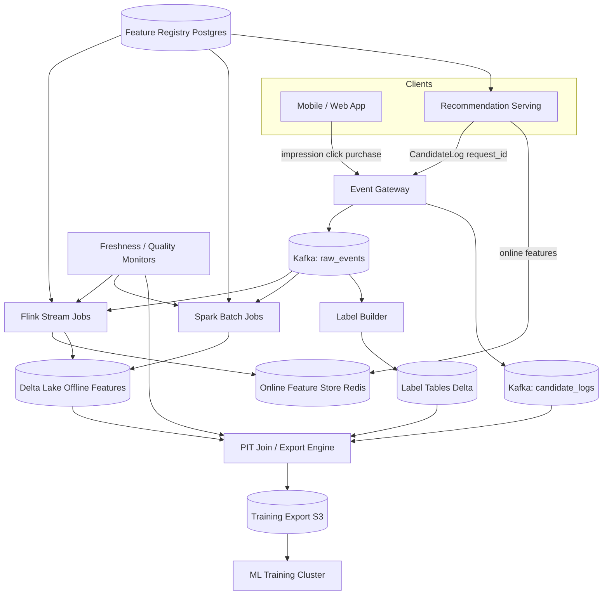
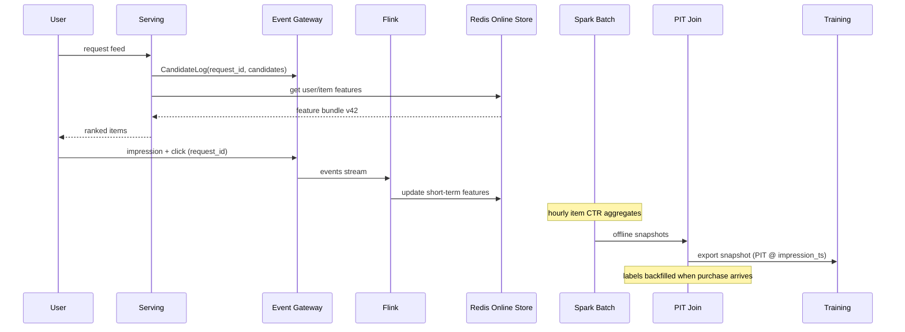

# System Design: Recommendation Data Pipeline

> **Focus areas:** Events → features → candidates → training labels · Batch + streaming · Leakage prevention · Freshness · Feature store · Point-in-time correctness  
> **Style:** End-to-end ML data platform with progressive scale (10× → 100× → 1,000×)  
> **Quality bar:** Domain-specific numbers, explicit train/serve invariants, honest batch/stream trade-offs, failure-first reasoning  
> **Interview theme:** Staff-level ML platform — how recommendation systems get **correct, fresh, non-leaky** data from clicks to model training and online serving

---

## Table of Contents

1. [Clarify Requirements (Interview Q&A)](#1-clarify-requirements-interview-qa)
2. [Back-of-the-Envelope Estimation](#2-back-of-the-envelope-estimation)
3. [High-Level Design](#3-high-level-design)
4. [Architecture Diagram](#4-architecture-diagram)
5. [Design Deep Dive](#5-design-deep-dive)
6. [Wrap-Up](#6-wrap-up)
7. [Deeper / Related Interview Questions](#7-deeper--related-interview-questions)

---

## 1. Clarify Requirements (Interview Q&A)

The goal of this phase is to **bound the problem**: what data flows exist, what "correct" means for ML (no leakage, freshness SLOs), and at what scale the pipeline must succeed without collapsing training or serving.

### 1.0 What this is / is not

| Dimension | This is | This is not |
|-----------|---------|-------------|
| Job | End-to-end **recommendation data plane**: raw events → feature materialization → candidate/label datasets → training exports + online feature serving | Designing the ranking model architecture (two-tower, deep FM, LLM reranker) |
| Primary artifact | Feature store + label join engine + batch/stream pipelines with **point-in-time (PIT)** guarantees | A generic ETL tool or a single Kafka topic |
| Correctness focus | **No label leakage**, train/serve consistency, freshness SLAs, reproducible training snapshots | Sub-millisecond p99 for every batch job |
| Users | ML engineers, data scientists, recsys platform team, downstream training/serving systems | End consumers clicking recommendations |
| Output consumers | Offline training (Spark/TFX), online inference (candidate generation + ranker), experimentation (A/B analysis) | Real-time UI for shoppers |

### 1.1 Functional Requirements

| # | Question to ask | Expected / typical interviewer answer | Design implication |
|---|-----------------|----------------------------------------|--------------------|
| F1 | What recommendation surface? | Home feed, product detail "similar items," search reranking, notifications | Different event schemas and label definitions; multi-tenant pipeline registry |
| F2 | What raw events? | Impression, click, add-to-cart, purchase, dwell, hide, share; with `request_id`, `user_id`, `item_id`, `position`, `surface`, `timestamp` | Canonical event envelope; dedup by `(event_id)`; partition by `user_id` for user features |
| F3 | What are "features"? | User (history aggregates, embeddings), item (category, price band, popularity), context (device, geo, time), cross (user×category affinity) | Separate **entity feature groups** with different refresh cadences |
| F4 | What are "candidates"? | Retrieval pool per request (e.g., 500–2000 item IDs from ANN / inverted index) logged at serve time | Persist **candidate sets with request_id** for training joins; not just final ranked list |
| F5 | What are training labels? | Click (binary), purchase (delayed), watch-time (regression), multi-task labels | Label **delay windows** (purchase may arrive 7d later); delayed label backfill path |
| F6 | Batch vs streaming? | **Both**: streaming for near-real-time features + online store; batch for heavy aggregates, embeddings, backfills | Lambda architecture with **shared feature definitions** (single source of truth) |
| F7 | Leakage prevention? | **Hard requirement** — features at time T must not use events after T; labels must not influence pre-event features | Point-in-time joins; `as_of` timestamps; forbid "global future stats" without lag |
| F8 | Freshness targets? | User short-term features: minutes; item popularity: 5–15 min; embeddings: hours–daily; labels: hours for click, days for purchase | Tiered materialization; SLA per feature group; staleness metrics |
| F9 | Train/serve consistency? | Same transformation logic; same entity keys; versioned feature definitions | Feature registry + compiled transforms; shadow compare in CI |
| F10 | Backfill / retrain? | Rebuild 90–365 days of training data when logic changes | Deterministic replay from raw events + PIT snapshots; `pipeline_version` on exports |
| F11 | Experimentation? | Holdout groups, interleaving logs, treatment flags on events | Join experiment metadata by `request_id`; separate eval datasets |
| F12 | Privacy / compliance? | PII minimization; GDPR delete propagates to features and labels | `user_id` pseudonymization; tombstone cascade; retention policies |
| F13 | Multi-tenant / multi-product? | Shared platform; isolated namespaces per product line | `tenant_id` on all tables; quota isolation; config-driven schemas |
| F14 | Data quality gates? | Block training export if schema drift, null spike, or label delay breach | Integration with DQ platform (expectations on exports); circuit breakers |
| F15 | Who owns schema? | Platform owns envelope; product teams own feature groups via registry PRs | Git-backed feature specs; breaking change review |

**MVP functional scope (lock this with interviewer):**

1. Ingest canonical impression/click/purchase events (at-least-once) with dedup.
2. Materialize **user**, **item**, and **context** feature groups into offline store (Parquet/Delta) and online store (Redis/Dynamo) with documented freshness SLAs.
3. Log **candidate sets** per recommendation request with `request_id`.
4. Build **training examples** via point-in-time join: `(request, features@T, label@T+window)` without leakage.
5. Support **delayed label backfill** (e.g., purchase within 7 days updates label table).
6. Versioned feature definitions in registry; training export pinned to `(feature_version, label_version, data_snapshot_id)`.
7. Observability: freshness lag, join coverage, null rates, train/serve skew samples.
8. Operator backfill API for date range + pipeline version.

**Out of MVP (explicitly defer):**

- Real-time model training (online learning on every click)
- Automatic feature discovery / AutoML feature synthesis
- Cross-company federated learning
- Full column-level lineage UI (integrate later with governance platform)
- GPU feature computation inside serving path
- Zero-downtime arbitrary schema migration without backfill

### 1.2 Non-Functional Requirements

| # | Question | Expected answer | Target |
|---|----------|-----------------|--------|
| N1 | Event ingest latency | Near-real-time for serving features | p99 < 30s from client event to online feature update (short-term groups) |
| N2 | Batch feature job latency | Hourly/daily acceptable for heavy features | User long-term aggregates: complete within 2h of window close |
| N3 | Training export build time | Hours, not weeks | 1 day of data at baseline: < 2h; 90-day backfill: < 24h with parallel Spark |
| N4 | Availability (online features) | Serving path critical | 99.95% online feature read path; batch can degrade with delay |
| N5 | Durability | Never lose raw events | Raw log retention 13–24 months; RPO ≈ minutes on Kafka |
| N6 | Consistency | PIT correctness > linearizable global consistency | Offline snapshots consistent at `snapshot_ts`; online may lag with bounded staleness |
| N7 | Reproducibility | Same snapshot → same training rows | Immutable raw + versioned transforms + deterministic joins |
| N8 | Cost | Storage and compute dominate | Tiered storage; incremental materialization; avoid full recompute daily |
| N9 | Multi-region | Users global; data residency constraints | Regional event ingestion; federated exports; no naive cross-region PIT without clocks |

### 1.3 Cases (Happy Paths & Edge / Failure)

**Happy paths**

1. User sees feed → impression logged with `request_id` + candidates → click event → streaming pipeline updates short-term user features in online store within SLA.
2. Nightly batch recomputes item 7-day CTR aggregates → publishes to offline store partition `dt=2026-08-05` → online store refreshed for hot items.
3. Training job requests snapshot `2026-08-01` → label join engine PIT-joins features at impression time → exports TFRecord/Parquet with `(feature_version=v3, label_version=v2)`.
4. Purchase arrives 3 days after click → delayed label worker updates label table → backfill job patches training rows idempotently by `(request_id, item_id)`.
5. ML engineer registers new feature group `user_category_affinity_30d` → CI runs PIT validation on sample day → promoted to registry → backfill orchestrated.
6. Serving reads user features from online store + item features from cache → same keys and transforms as training export validator.

**Edge / failure cases**

| Case | Behavior |
|------|----------|
| Duplicate events (retry) | Dedup by `event_id`; metrics on dup rate; do not double-count labels |
| Late events (after watermark) | Update streaming aggregates if within allowed lateness; else route to correction batch |
| Clock skew on client timestamps | Trust server ingest time for PIT; store both `client_ts` and `server_ts` |
| Missing candidate log for request | Exclude from training or impute empty candidate set with explicit flag; metric alert |
| Feature not yet materialized at impression time | PIT join returns NULL; training row includes `feature_missing_mask`; block export if coverage < threshold |
| Global popularity feature without lag | **Leakage** — require `stats_as_of = impression_ts - lag` |
| User deletes account (GDPR) | Tombstone propagates to feature store, label tables, exports (future snapshots exclude) |
| Backfill while online serving continues | Dual-write new version; flip read pointer after validation; no mixed-version row in same export |
| Schema breaking change | New `feature_version`; old snapshots remain reproducible |
| Hot item / celebrity user | Shard partitions; isolate heavy aggregations; rate-limit per key |
| Training export partial failure | Atomic partition commits; manifest with checksums; no half-written snapshot |
| Purchase label never arrives | Censor at window end; label = 0 or `unknown` per policy; document in spec |

### 1.4 Scales (Progressive)

Establish a **baseline** (mid-size e-commerce / content recsys), then stress at 10× / 100× / 1,000×.

| Metric | Baseline | 10× | 100× | 1,000× |
|--------|----------|-----|------|--------|
| DAU | 5M | 50M | 500M | 5B |
| Impressions / day | 500M | 5B | 50B | 500B |
| Peak events / sec | 20K | 200K | 2M | 20M |
| Unique users / day | 5M | 50M | 500M | 5B |
| Unique items | 50M | 200M | 1B | 10B |
| Candidates logged / impression | 1K | 1K | 500–2K | 200–1K (sampled) |
| Raw event storage / day | ~2 TB | ~20 TB | ~200 TB | ~2 PB |
| Feature groups (entity types) | 80 | 200 | 800 | 3K+ |
| Online feature read QPS (peak) | 100K | 1M | 10M | 100M |
| Offline feature storage (total) | 200 TB | 2 PB | 20 PB | 200 PB+ |
| Training export row count / day | 500M | 5B | 50B | 500B |
| Label delay window (purchase) | 7d | 7d | 7d | 7d (policy) |
| Backfill recompute window | 90d | 180d | 365d | tiered + sampling |

**What each jump forces architecturally:**

- **10×:** Dedicated Flink/Spark clusters; Redis Cluster for online store; feature registry service; separate hot/cold paths for candidate logs.
- **100×:** Partition by `tenant_id` + hash(`user_id`); incremental Delta/Iceberg; approximate candidate logging (sample negatives); cell per region; async embedding pipelines on GPU fleet.
- **1,000×:** Regional data planes with federated training; aggressive negative sampling; feature computation hierarchy (sketch → exact); candidate log compaction; separate **money-path** freshness for ads vs organic.

### 1.5 Etc. (Constraints & Assumptions)

Ask and record:

- **Cloud / lake format?** S3 + Delta Lake / Iceberg; Kafka for streaming.
- **Feature store product?** Build vs Feast/Tecton-like — design is product-agnostic but needs offline + online + registry.
- **Training framework?** TensorFlow / PyTorch / XGBoost — export format is columnar + metadata sidecar.
- **Serving dependency?** Ranking service reads online store; candidate generator logs to same `request_id` bus.
- **Label definition owner?** Product + ML agree on attribution window (click vs view-through purchase).

**Scope statement to repeat back:**

> Design a **recommendation data pipeline** that ingests impression/click/purchase events, materializes versioned user/item/context features (batch + streaming), logs candidate sets, and produces **leakage-safe, reproducible training datasets** with delayed label backfill and freshness SLAs — from ~20K events/s baseline through 1,000× — without designing the ranker model itself.

---

## 2. Back-of-the-Envelope Estimation

### 2.1 Event ingest

```text
Baseline peak: 20,000 events/s
Avg event JSON (after compression on wire): ~800 bytes
Raw ingress: 20K × 800B ≈ 16 MB/s ≈ 128 Mbps
Kafka with RF=3: ~48 MB/s broker write (order of magnitude)

Daily volume: 500M events × 800B ≈ 400 GB/day raw
+ candidate logs (1K IDs × 8B × 500M impr) ≈ 4 TB/day if full logging
  → MVP log full; at 100× sample negatives + delta encoding → ~40–400 GB/day candidates
```

**1,000×:** 20M events/s → 16 GB/s raw → **multi-region Kafka**, not one cluster.

### 2.2 Storage (raw + derived)

| Layer | Baseline | 10× | 100× | 1,000× |
|-------|----------|-----|------|--------|
| Raw events (13 mo) | ~150 TB | ~1.5 PB | ~15 PB | ~150 PB (tier/lifecycle) |
| Candidate logs (90d) | ~360 TB | ~3.6 PB | compacted | sampled heavily |
| Offline features (all groups) | 200 TB | 2 PB | 20 PB | 200 PB |
| Online store (hot features) | 500 GB | 5 TB | 50 TB | 500 TB ( sharded ) |

**Feature row sizing:**

```text
User feature vector (hot): ~2 KB (dense + sparse IDs)
50M users × 2 KB ≈ 100 GB logical; ×3 replicas ≈ 300 GB Redis (baseline)
Item features accessed: top 10M hot × 1 KB ≈ 10 GB cache working set
```

### 2.3 Compute (batch)

```text
Daily training export: 500M impression rows
Assume 200 features avg, 8 bytes numeric + sparse overhead → ~3 KB/row
Export size ≈ 500M × 3 KB ≈ 1.5 TB/day Parquet (compressed ~400–600 GB)

Spark: 500M rows join with PIT
  200 executors × 8 cores, 32 GB
  Shuffle if naive: O(users) — partition by user_id
  Target: 1–2 hours with bucketing + pre-materialized feature snapshots
```

**PIT join cost:** without snapshots, each row scans history — unacceptable. **Pre-materialize feature snapshots hourly/daily** per entity.

### 2.4 Streaming compute

```text
20K events/s through Flink
  state: user session aggregates ~10 KB × active sessions
  1M concurrent sessions × 10 KB ≈ 10 GB state (baseline)
Checkpoint every 60s, delta ~5% → 500 MB/s checkpoint IO at scale — tune RocksDB incremental
```

### 2.5 Online feature read path

```text
100K QPS peak reads
p99 latency budget: 5–10 ms
Redis: 100K GET/s per shard ~50K — need ~4–8 shards + app cache
Batch read (100 features): MGET or server-side feature bundle API
```

### 2.6 Separate load classes (do not lump QPS)

| Class | What | Baseline peak | 1,000× | Store |
|-------|------|---------------|--------|-------|
| A | Raw event append | 20K/s | 20M/s | Kafka |
| B | Streaming feature updates | 15K/s | 15M/s | Flink → Redis |
| C | Online feature reads | 100K/s | 100M/s | Redis / Dynamo |
| D | Batch aggregate writes | bursty | continuous | Delta/Iceberg |
| E | PIT join / export | nightly | hourly | Spark |
| F | Delayed label updates | 5K/s avg | 500K/s | Label table |

### 2.7 Bandwidth (training)

```text
Daily export 600 GB compressed to training cluster
At 10 Gbps: ~8 minutes transfer — negligible vs join compute
At 100×: 60 TB/day → need regional co-location or incremental day-chunk training
```

### 2.8 Memory anti-patterns

| Anti-pattern | Why it fails |
|--------------|--------------|
| Store full user history in online Redis | Unbounded; 5B users impossible |
| PIT join by scanning all past events per row | O(rows × history) |
| Single global popularity counter updated synchronously | Hot key + leakage if not lagged |
| Keep all candidate IDs in training row uncompressed | Storage explodes at 100× |

---

## 3. High-Level Design

### 3.1 Core invariants (say these out loud)

1. **Point-in-time correctness:** for impression at time `T`, feature vector `F(T)` uses only data with `event_time ≤ T` (minus explicit allowed lag for batch snapshots).
2. **Label causality:** label for `(user, item, request)` depends only on outcomes **after** impression time and within attribution window.
3. **Train/serve parity:** same feature names, transforms, defaults, and entity keys in offline export and online serving bundle.
4. **Reproducibility:** training snapshot identified by `(raw_data_cutoff, feature_version, label_version, join_logic_version)`.
5. **Candidate logging:** every training row links to **served candidate set** (or explicit negative sampling policy documented).

### 3.2 Event canonical model

```text
RecommendationEvent {
  event_id,              # UUID dedup key
  event_type,            # impression | click | add_to_cart | purchase | dwell
  server_ts,             # authoritative for PIT
  client_ts,
  tenant_id,
  user_id,               # pseudonymous
  session_id,
  request_id,            # ties impression + rank + candidates
  item_id,
  position,
  surface,               # home | pdp | search
  experiment { exp_id, variant },
  device, geo,
  payload_json           # dwell_ms, query, etc.
}

CandidateLog {
  request_id,
  server_ts,
  user_id,
  candidate_item_ids[],  # ordered retrieval pool
  retrieval_sources[],   # ann | popular | sponsored
  model_version_serving
}
```

### 3.3 Feature registry (single source of truth)

```text
FeatureGroup {
  name,                  # user_clicks_7d
  entity_type,           # user | item | user_item | request
  keys,                  # [user_id]
  freshness_sla,         # 15m streaming | 1d batch
  materialization,       # streaming | batch | both
  transform_ref,         # git SHA of SQL/Spark/Flink job
  version,
  schema,                # typed columns
  offline_table,
  online_store_mapping,
  owner_team
}
```

**Version bump triggers:** logic change, schema change, SLA tier change.

### 3.4 Feature store dual stores

| Store | Purpose | Format | Read pattern |
|-------|---------|--------|--------------|
| **Offline** | Training, batch analytics | Delta/Iceberg partitions by `entity_id`, `snapshot_ts` | Spark PIT join, scan |
| **Online** | Serving ranker/candidate | Redis/Dynamo key = `(entity_type, entity_id)` → protobuf/hash | ms latency GET |
| **Metadata** | Registry, lineage pointers | Postgres | Control plane |

**Critical:** offline maintains **time-travel snapshots** (`feature_snapshot_ts` partitions or SCD Type 2 rows with `[valid_from, valid_to)`).

### 3.5 Point-in-time join engine

Training row construction:

```text
FOR each impression I at time T:
  F_user  = PIT_LOOKUP(user_features, I.user_id, T)
  F_item  = PIT_LOOKUP(item_features, I.item_id, T)
  F_ctx   = context features from I (device, surface, ...)
  L       = LABEL_JOIN(I.request_id, I.item_id, window [T, T+7d])
  C       = candidates from CandidateLog by request_id
  EMIT row { keys, F_*, L, C_metadata, experiment, versions }
```

**PIT_LOOKUP implementation options:**

| Approach | Pros | Cons | When |
|----------|------|------|------|
| ASOF join on snapshot tables | Standard in Spark 3+ | Needs dense snapshots | Default |
| Event-sourced feature log | Exact | Heavy storage | High-value audit |
| Approximate lagged batch | Cheap | Risk of leakage if lag wrong | Only with proven lag |

**Deal-breaker:** joining to `item_features` table partitioned by `dt=event_date` without temporal validity → **leakage**.

### 3.6 Label pipeline

```text
LabelDefinition {
  name: purchase_7d,
  positive_events: [purchase],
  attribution: clicked_item only | last_touch | multi_touch (explicit)
  window: 7d,
  delay_policy: censor_at_window_end
}

LabelTable partitioned by impression_date
  PK: (request_id, item_id)
  columns: label, label_ts, label_version, is_delayed_update
```

**Delayed label worker:** consumes purchase stream; updates label rows; triggers incremental export patch or marks rows `label_final=false` until window closes.

### 3.7 Batch + streaming unified logic

```text
                    ┌─────────────────┐
  Raw Events ──────►│ Stream Layer    │──► Online store (short-term)
                    │ (Flink)         │
                    └────────┬────────┘
                             │ merge
                    ┌────────▼────────┐
                    │ Batch Layer     │──► Offline store (long-term)
                    │ (Spark hourly)  │
                    └────────┬────────┘
                             │
                    ┌────────▼────────┐
                    │ Feature Registry│
                    └─────────────────┘
```

**Avoid two definitions:** stream job and batch job must compile from same spec (Feast-style) or batch overwrites stream with reconciliation job.

### 3.8 Candidate → training sampling

| Strategy | Use | Storage |
|----------|-----|---------|
| Full candidate log | Research, small scale | Huge |
| Logged positives + random negatives from candidate pool | Standard | Moderate |
| In-batch negatives only | Scale | Loses retrieval signal |
| Two-stage export | Retrieval model vs ranker | Separate datasets |

Document **negative sampling policy** in export manifest.

### 3.9 APIs

| Method | Path | Purpose |
|--------|------|---------|
| POST | `/events` | Ingest (usually via Kafka proxy) |
| GET | `/features/online/{entity}/{id}` | Serving bundle read |
| GET | `/features/offline/snapshot` | List available PIT snapshots |
| POST | `/training/exports` | Request export `{date_range, feature_versions, label_version}` |
| GET | `/training/exports/{id}` | Status + manifest URI |
| POST | `/backfill` | Orchestrate feature group recompute |
| GET | `/registry/feature-groups` | Discovery |
| POST | `/registry/feature-groups` | Register / version bump |

### 3.10 Architecture options

#### Option A — Lambda (batch + speed layer) — MVP default

| Layer | Tech | Freshness |
|-------|------|-----------|
| Speed | Flink → Redis | minutes |
| Batch | Spark → Delta | hourly/daily |
| Serving | Redis + local cache | minutes |
| Training | Spark PIT join | daily snapshot |

**Pros:** Well understood; cost-efficient batch.  
**Cons:** Reconciliation complexity; dual logic risk.

#### Option B — Kappa (log-only recompute)

| Layer | Tech |
|-------|------|
| All features from stream | Flink with retention + compaction |
| Periodic snapshot | Savepoints to Delta |

**Pros:** Single logic path.  
**Cons:** Expensive at 100× history; long retention Kafka costly.

#### Option C — Managed feature platform (Tecton/Feast enterprise)

**Pros:** Faster delivery.  
**Cons:** Interview wants **your** design; reference as buy vs build.

**Doc decision:** **Option A** with registry-enforced single definitions and nightly reconciliation.

### 3.11 Trade-off tables

| Decision | Choose | Over | Why |
|----------|--------|------|-----|
| PIT correctness | Snapshot + ASOF join | "Join on date partition" | Prevents leakage |
| Candidate logging | Full at baseline; sample at 100× | Never log | Training needs retrieval labels |
| Purchase labels | 7d delayed backfill | Wait 7d to train | Fresher click models + patched purchase |
| Online store | Redis Cluster | Postgres | Read QPS + latency |
| Offline store | Delta/Iceberg | Raw Parquet only | ACID partitions + time travel |
| Feature definition | Git registry | Ad hoc SQL | Train/serve parity |
| Dedup | event_id in stream | Trust producer | Retries duplicate labels |

### 3.12 Deal-breakers (interview red flags)

- Joining features from partition `dt` = impression date without temporal column.
- Using post-impression clicks to build **same-request** user features.
- Training on final ranked list only without candidate negatives.
- No `request_id` linking events.
- "We backfill globally popular items using today's counts for yesterday's impressions."

---

## 4. Architecture Diagram





---

## 5. Design Deep Dive

### 5.1 Reliability

#### 5.1.1 Data loss prevention

| Risk | Mitigation |
|------|------------|
| Kafka retention too short | 7–30d minimum; archive to S3 via Kafka Connect |
| Flink checkpoint failure | Alert; pause consumer; restore from savepoint |
| Partial export write | Manifest with `_SUCCESS` + partition checksums |
| Lost candidate log | Serving must sync log before response; async buffer with retry |
| Label update lost | Idempotent upsert on `(request_id, item_id)` |

**Durability order:** raw event durable in Kafka → derived feature → label → export manifest.

#### 5.1.2 Idempotency & dedup

```text
Dedup key: event_id (producer UUID)
Candidate log: upsert by request_id (last write wins with monotonic version)
Label update: upsert; delayed purchases patch same row
Export job: deterministic job_id; overwrite partition if rerun
```

#### 5.1.3 Leakage prevention (deep)

| Leakage type | Example | Fix |
|--------------|---------|-----|
| Temporal | Item 7d CTR includes same-day clicks from future hours | Snapshot at hour boundary; ASOF join with `valid_from` |
| Label leakage | Feature includes `is_purchased` | Remove post-outcome fields from features |
| Population | Train on clicked-only impressions | Log all impressions; correct sampling weights |
| Spatial | Global stats computed with future data | Per-snapshot materialization |
| Join fanout | User deleted but features remain | GDPR tombstone + join filters |

**Validation job:** on sample day, assert `max(feature_event_time) ≤ impression_time` for 100% rows (within allowed batch lag).

#### 5.1.4 Freshness & staleness

```text
Per feature group:
  freshness_lag = now() - last_successful_materialization_ts
Alert if lag > SLA
Serving: expose feature_version + computed_at in bundle
Training: reject export if critical groups exceed staleness vs snapshot_ts
```

#### 5.1.5 Backpressure

- Pause Flink if Redis write p99 > threshold.
- Spark fair scheduler queues; per-tenant caps.
- Delay training export if upstream batch jobs incomplete (dependency DAG).

#### 5.1.6 Failure matrix

| Failure | Impact | Mitigation |
|---------|--------|------------|
| Redis unavailable | Serving degraded | Default features; cache last good; fail open with metrics |
| Batch job late | Stale long-term features | Extend SLA alert; block export if critical |
| PIT join skew | Wrong training | Pre-validation; row count reconciliation |
| Duplicate events | Inflated CTR | Dedup; separate metrics stream |

### 5.2 Scalability

#### 5.2.1 Partitioning strategy

```text
Kafka raw events: partition by hash(user_id)  # locality for user aggregations
Candidate logs: partition by hash(request_id)
Offline features: partition by (entity_type, hash(entity_id))
Training export: partition by impression_date + hash(user_id)
```

#### 5.2.2 Scale jumps

| Jump | Architectural move |
|------|---------------------|
| 10× | Separate Kafka clusters ingest vs internal; Redis sharding; Flink rescale |
| 100× | Regional cells; candidate log sampling; incremental Delta MERGE; dedicated export fleet |
| 1,000× | Federated training per region; sketch features; negative sampling 1:100; cold archive Glacier |

#### 5.2.3 Hot keys

- Celebrity item: local combiner in Flink; rate-limited counter sync.
- Power user: shard sub-session keys; cap feature list size.
- Global trending: pre-aggregate in hierarchical topology (region → global).

#### 5.2.4 Storage tiers

| Tier | Data | Retention |
|------|------|-----------|
| Hot | Online Redis, recent Delta | hours–days |
| Warm | Full offline features | 90–365d |
| Cold | Raw events, old exports | 13–24mo |
| Archive | Compliance | 7y metadata only |

#### 5.2.5 Incremental materialization

```text
Instead of recompute all users daily:
  track changed_users from event stream
  MERGE only touched keys into daily snapshot
  100× reduction when 5% DAU active
```

### 5.3 Maintainability

#### 5.3.1 Observability

| Metric | Purpose |
|--------|---------|
| `feature_freshness_lag_seconds{group}` | SLA |
| `pit_join_violation_count` | Leakage detector |
| `label_coverage_ratio` | Missing labels |
| `train_serve_skew_psi` | Distribution drift |
| `export_row_count` | Reconciliation |
| `candidate_log_missing_rate` | Join completeness |
| `event_dedup_rate` | Producer quality |

Dashboards per feature group owner; page on export blockers.

#### 5.3.2 Train/serve skew detection

Nightly sample: same `user_id`, `item_id` from live serving log vs offline export — compare feature values. PSI > threshold blocks promotion.

#### 5.3.3 Migrations

- New feature version: shadow run parallel; compare distributions.
- Breaking key change: new entity type; never mutate in place.
- Backfill orchestrator: date-chunk parallel Spark with checkpoint.

#### 5.3.4 Multi-tenant isolation

- Namespace prefix on keys and tables.
- Quota on export GB/day and Flink CU.
- No cross-tenant PIT joins unless explicit shared features.

#### 5.3.5 Ops runbooks

| Symptom | Action |
|---------|--------|
| Freshness lag spike | Check Flink backpressure; Redis memory; upstream Kafka lag |
| Export row drop | Compare impression count vs export; candidate join filter |
| Leakage alert | Halt promotion; bisect feature group version |
| Label delay backlog | Scale delayed label consumer; extend window only via policy PR |

---

## 6. Wrap-Up

### 6.1 Decision summary

| Area | Decision |
|------|----------|
| Correctness | Point-in-time snapshots + ASOF join; explicit label windows |
| Architecture | Lambda: Flink speed + Spark batch + unified registry |
| Stores | Kafka raw; Delta offline; Redis online; S3 exports |
| Candidates | Log per request_id; sample at extreme scale |
| Labels | Streaming click; delayed purchase backfill |
| Freshness | Per-group SLA with export blockers |
| Scale | Partition by user; incremental MERGE; regional cells |

### 6.2 Phased rollout

1. **Phase 0:** Raw events + batch-only features + daily export (no online store).
2. **Phase 1:** Flink short-term features → Redis; candidate logging; PIT join v1.
3. **Phase 2:** Delayed labels; registry; train/serve skew checks; backfill API.
4. **Phase 3:** Multi-region cells; sampled candidates; federated training exports.

### 6.3 Risks & follow-ups

| Risk | Mitigation |
|------|------------|
| Dual batch/stream logic drift | Single registry compilation; reconciliation job |
| Leakage in new feature group | CI PIT tests mandatory |
| Candidate log cost | Compression + sampling + retrieval model stage split |
| GDPR deletes | Async tombstone pipeline |
| Export time at 100× | Incremental day training; feature selection |

### 6.4 How to present in 45 minutes

1. Requirements + leakage definition (8 min)  
2. Event/feature/label model + invariants (8 min)  
3. Estimation: events, candidate storage, export size (5 min)  
4. Lambda architecture + PIT join (10 min)  
5. Freshness, delayed labels, train/serve (8 min)  
6. Scale path + trade-offs (6 min)

### 6.5 One-liner

> **Log everything with `request_id`, materialize versioned features with point-in-time snapshots, join labels without future data, and serve the same definitions online that you export offline.**

---

## 7. Deeper / Related Interview Questions

**Q1. What is label leakage vs feature leakage?**  
Feature leakage: features at T use information after T. Label leakage: features include the label or proxies (e.g., `purchased_flag` in user features). Both inflate offline metrics.

**Q2. Why not join features on `dt = date(impression)`?**  
Batch partition `dt=2026-08-05` often reflects **compute time**, not valid-time. Item stats on that partition may include events from the whole day including after the impression hour.

**Q3. ASOF join vs window join?**  
ASOF join picks latest feature row where `feature_ts ≤ impression_ts`. Window join aggregates events in windows — different semantics; don't confuse.

**Q4. How handle purchase labels delayed 7 days?**  
Train click model on fresh data; purchase labels backfill; multi-task with `label_weight=0` until final; or train purchase head on older cohort only.

**Q5. Log all impressions or only clicks?**  
Log all impressions for unbiased training; click-only skews to positive-rich distribution (survivorship bias).

**Q6. Negative sampling strategies?**  
Random from candidate pool, in-batch negatives, hard negatives from impressions without click — document and keep consistent train/serve eval.

**Q7. Feature store: build vs buy?**  
Buy speeds MVP; build for custom PIT, candidate joins, and tenancy. Interview: design primitives (registry, offline, online) either way.

**Q8. How fresh must user embeddings be?**  
Product decision: hours for content, days for stable commerce; expose staleness; ranker may down-weight stale bundles.

**Q9. Two-tower retrieval training data?**  
Needs `(user, pos_item, neg_items)` from candidate log; separate export pipeline from pointwise ranker rows.

**Q10. Prevent training-serving skew?**  
Same transform code path; same default for missing; log served `feature_version`; nightly skew PSI.

**Q11. Kafka exactly-once for features?**  
At-least-once + idempotent upserts into Redis/Delta; EOS Kafka alone doesn't fix PIT.

**Q12. Global popularity feature?**  
Materialize with `stats_as_of` hourly snapshots; join with ASOF; never read "live counter" for historical rows.

**Q13. Backfill 365 days — how long?**  
Parallel by date partition; incremental if logic change localized; estimate executors from §2.3.

**Q14. User sequence features (transformers)?**  
Store bounded event sequence in offline; online may truncate last N; watch train/serve length mismatch.

**Q15. Multi-touch purchase attribution?**  
Define explicitly (last click, Shapley approx); store attribution weights; don't hide in SQL magic.

**Q16. Experiment interference in training?**  
Include variant id as feature or filter to control; don't pool without awareness.

**Q17. Cold start users/items?**  
Default embedding buckets; `is_cold_start` flag; separate metrics; don't impute from future.

**Q18. Item churn and catalog deletes?**  
Retain historical item features for old impressions; tombstone for serving only.

**Q19. Real-time personalisation without online learning?**  
Update short-term counts in Flink; ranker weights static until retrain — common and sane.

**Q20. Delta vs Iceberg for features?**  
Both fine; need time travel + MERGE; Iceberg hidden partitioning; pick one ecosystem.

**Q21. Redis memory eviction vs feature loss?**  
Use TTL per group; never evict hot user keys randomly without fallback defaults; monitor hit rate.

**Q22. Candidate log 4 TB/day — compress?**  
Store item_id dictionary, delta from prior request, sample 10% negatives at 100×.

**Q23. GDPR delete user?**  
Tombstone in raw; purge Redis keys; filter exports; retrain excludes deleted ids from snapshot forward.

**Q24. Watermark in Flink for late events?**  
Allowed lateness 1–24h; side output to batch correction; metrics on late fraction.

**Q25. Feature importance debugging?**  
Lineage to feature group job; replay single user PIT for inspection API.

**Q26. Holdout data contamination?**  
Time-based split only; no random split on users with overlapping time ranges for temporal data.

**Q27. Sponsored vs organic labels?**  
Separate label definitions or multi-task heads; mixed logs need `ad_flag` on events.

**Q28. Cross-region user travel?**  
Home region for PIT storage; merge with conflict policy; feature staleness across regions.

**Q29. Schema evolution on events?**  
Schema registry; required fields backward compatible; quarantine unknown types.

**Q30. When to block training export?**  
PIT violations > 0; critical feature freshness miss; label coverage < 95%; schema contract fail — integrate DQ platform circuit breaker.
