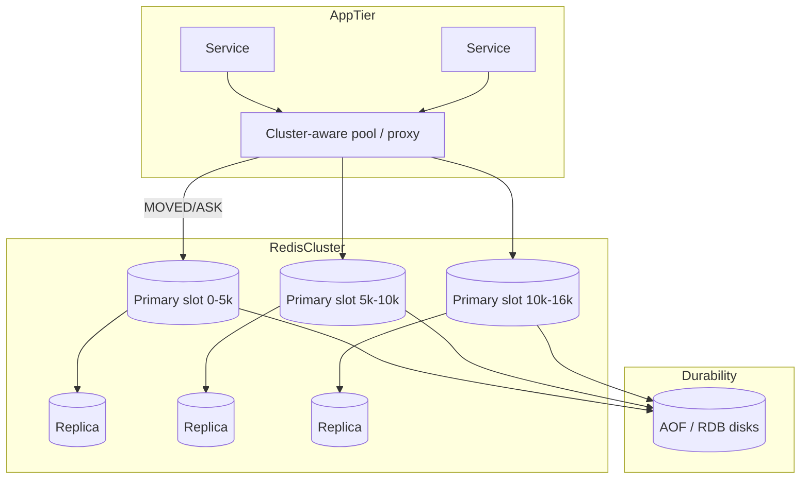
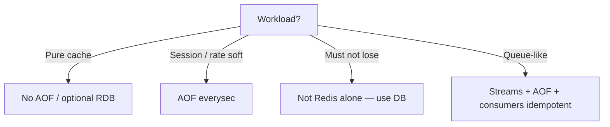

# System Design: Redis

> **Focus areas:** In-memory data structures · Single-threaded event loop · RDB/AOF persistence · Replication · Redis Cluster slots · Sentinels · Memory policies · Hot keys · Modules  
> **Style:** End-to-end platform design with progressive scale (10× → 100× → 1,000×)  
> **Quality bar:** Correct persistence/consistency trade-offs; cluster vs footprint; when Redis is cache vs primary

---

## Table of Contents

1. [Clarify Requirements (Interview Q&A)](#1-clarify-requirements-interview-qa)
2. [Back-of-the-Envelope Estimation](#2-back-of-the-envelope-estimation)
3. [High-Level Design](#3-high-level-design)
4. [Architecture Diagram](#4-architecture-diagram)
5. [Design Deep Dive](#5-design-deep-dive)
6. [Wrap-Up](#6-wrap-up)
7. [Deeper / Related Interview Questions](#7-deeper--related-interview-questions)

---

## 1. Clarify Requirements (Interview Q&A)

Design **Redis as a platform building block**: what API guarantees you offer, how you persist/replicate, and how you scale from one instance to a global fleet of clusters—without pretending Redis is a universal database.

### 1.0 What this is / is not

| Dimension | This design | Not this |
|-----------|-------------|----------|
| Job | Ultra-low-latency in-memory structures + optional durability | Distributed SQL / analytical warehouse |
| Engine model | Redis command API, Cluster, replication | Generic “distributed cache” only (subset) |
| Persistence | RDB snapshots, AOF, hybrid — configurable RPO | Invisible always-durable disk DB by default |
| Consistency | Primary serializability per key; async replicas lag | Multi-key linearizability across slots always |
| Related docs | Distributed cache · In-memory DB · Leader election | ZooKeeper replacement (usually wrong) |

### 1.1 Functional Requirements

| # | Question to ask | Expected / typical interviewer answer | Design implication |
|---|-----------------|----------------------------------------|--------------------|
| F1 | Workloads? | Cache, session, rate limit, leaderboard, queue-ish, lock | Different persistence & HA profiles per use case |
| F2 | Data structures? | String, Hash, List, Set, ZSet, Stream, Bitmap, HyperLogLog, Geo | Memory encoding matters (ziplist/listpack) |
| F3 | Persistence need? | **Per workload:** cache=none/RDB; queue/session=AOF everysec/always | Never one global persistence policy |
| F4 | HA? | Primary + replicas; failover via Sentinel or Cluster | RPO/RTO explicit on failover |
| F5 | Scale out? | Redis Cluster with hash slots | Multi-key ops limited to same slot (hash tags) |
| F6 | Multi-key transactions? | `MULTI/EXEC` single-node; Cluster caveats | Design keys with hash tags |
| F7 | Lua / functions? | Yes for atomic server-side logic | CPU risk; sandbox timeouts |
| F8 | Pub/Sub vs Streams? | Pub/Sub ephemeral; Streams durable-ish log | Pick correctly per product |
| F9 | Max memory? | `maxmemory` + eviction policy | Mandatory for cache; careful for primary store |
| F10 | Security? | ACL users, TLS, protected mode | Multi-tenant via Redis prefixes or separate DBs/clusters |
| F11 | Modules? | Optional (RedisJSON, Search, TimeSeries) | Ops & version coupling |
| F12 | Observability? | `INFO`, latency spikes, slowlog, memory | Fork/COW spikes during BGSAVE |
| F13 | Client features? | Pipelining, connection pool, cluster-aware redirects | MOVED/ASK handling |

**MVP functional scope:**

1. Single primary + ≥1 replica for a namespace; Cluster mode optional for MVP scale tier.
2. Core structures: String/Hash/ZSet/List + TTL + `SET NX` for locks.
3. Persistence profiles: volatile cache vs AOF everysec for semi-durable.
4. Sentinel **or** Cluster failover (pick one story for MVP HA).
5. `maxmemory` policies; hot-key guidance.
6. ACL + TLS; namespaces via key prefixes.
7. Metrics/slowlog; backup story for AOF/RDB.

**Out of MVP:**

- Using Redis as sole SoT for financial ledger
- Cross-slot multi-key transactions without hash tags
- Global active-active CRDT (Redis Enterprise/conflict types — mention as Phase 2)
- Replacing Kafka with Pub/Sub
- Huge values (>MB) as normal path

### 1.2 Non-Functional Requirements

| # | Question | Expected answer | Target |
|---|----------|-----------------|--------|
| N1 | Latency? | Micro/milliseconds | p50 < 0.5–1 ms in-AZ; p99 < 2–5 ms |
| N2 | Throughput? | 100K–1M+ ops/s per primary (command mix dependent) | Benchmark true mix, not PING |
| N3 | Availability? | Failover tens of seconds typical | RTO ~15–60s (config); RPO depends AOF |
| N4 | Durability? | Configurable | `no` / `everysec` (~1s RPO) / `always` (fsync/cmd) |
| N5 | Consistency? | Primary linearizable per command; replicas async | Reads from replica may lag |
| N6 | Memory efficiency? | Encodings + eviction | < overhead budgets |
| N7 | Multi-region? | Active-passive or regional clusters | Avoid sync cross-region primary |
| N8 | Cost? | DRAM-heavy | Right-size; tier flash if available (Redis on Flash / OS) |

### 1.3 Cases

**Happy paths**

1. Cache GET/SET with TTL; eviction under pressure.
2. Session store with AOF everysec; replica promotion on primary death.
3. Rate limit via `INCR` + `EXPIRE` or token bucket Lua.
4. Leaderboard `ZINCRBY` / `ZRANGE`.
5. Cluster rescale: migrate slots; clients follow MOVED.

**Edge / failure cases**

| Case | Behavior |
|------|----------|
| BGSAVE fork spikes RSS | COW memory; can OOM — monitor; diskless repl; AOF rewrite care |
| AOF rewrite + traffic | Temporary disk & CPU load |
| Replica lag | Stale reads; `min-replicas-to-write` optional |
| Split brain / dual primary | Fencing via epoch (Cluster/Sentinel); clients must not write both |
| Hot key | CPU/NIC pin one shard; mitigate L1 / split / replicate |
| Big key | Ops block / timeout; redesign structure; `UNLINK` |
| Cluster cross-slot | Error; use hash tags `{userId}.cart` |
| Persistence disabled + crash | Data loss — acceptable only for pure cache |
| Slow clients / huge replies | Output buffer limits; connection kill |
| Lua infinite loop | `lua-time-limit`; kill script |

### 1.4 Scales (Progressive)

| Metric | Baseline | 10× | 100× | 1,000× |
|--------|----------|-----|------|--------|
| Ops/s (fleet) | 200K | 2M | 20M | 200M |
| Memory working set | 200 GB | 2 TB | 20 TB | 200 TB |
| Primaries | 1–6 | ~20–50 | hundreds | thousands (cells) |
| Keys | 100M | 1B | 10B | 100B |
| Connections | 5K | 50K | 500K | proxy/pool tiers |
| Streams backlog | optional | GB | partitioned | many clusters |
| Regions | 1 | 2 | cells | global cells |

**What each jump forces:**

- **10×:** Cluster mode; pipelining; connection pools; separate cache vs durable instances.
- **100×:** Cell clusters; proxies (Twemproxy/Otter/cluster proxy); hot-key tooling; persistence off for pure cache fleets.
- **1,000×:** Many small clusters > few giant ones; workload isolation; optional flash tier; app L1.

### 1.5 Etc.

- **Redis version features:** ACL, functions, sharded Pub/Sub — note without depending on bleeding edge.
- **Managed vs self-host:** Same design principles; ops differ.
- **Scope repeat-back:**

> Design Redis deployment patterns for cache and selected semi-durable workloads: data structures, memory policies, RDB/AOF trade-offs, replication/failover, Cluster slots, and progressive scale via many sharded clusters—with explicit RPO/RTO and “not a ledger” boundaries.

---

## 2. Back-of-the-Envelope Estimation

### 2.1 Throughput

```text
Single primary (in-memory, simple GET/SET): often 100K–500K+ ops/s
Pipeline batches of 10–100 → fewer syscalls → higher throughput
Lua / big keys / RDB fork → much less
```

### 2.2 Memory

```text
100M keys × avg 200 B value + Redis overhead (~50–100 B+ depending type)
≈ 100M × 300 B ≈ 30 GB raw → plan 2× for fragmentation, replicas, headroom
ZSet/Hash encodings matter hugely (listpack vs hashtable)
```

### 2.3 Persistence I/O

```text
AOF everysec: fsync 1/s; RPO ≈ 1s of acknowledged writes
AOF always: fsync/cmd → durability ↑ throughput ↓ latency ↑
RDB every 5 min: RPO up to 5 min; fork COW spike
```

### 2.4 Replication bandwidth

```text
Write 50K cmds/s × 200 B ≈ 10 MB/s replication stream per replica
Full sync = RDB transfer ≈ entire dataset — dangerous at TB scale (prefer incremental)
```

### 2.5 Cluster slots

```text
16384 slots; 32 primaries → 512 slots each
Hot slots → migrate; hash tags control co-location
```

### 2.6 Failover RTO

```text
Sentinel quorum detects down_after_ms (e.g. 5s) + failover election + client refresh
≈ 10–30s typical if tuned; not sub-second HA without specialized setups
```

---

## 3. High-Level Design

### 3.1 Process architecture

```text
Client → TCP RESP → Event loop (I/O + command exec)
                  → Memory objects (SDS, dict, skiplist, ...)
                  → Optional AOF/RDB
                  → Replica feed
```

**Single-threaded execution** (core command execution): simplifies atomicity; CPU-bound by one core for many workloads. I/O threads (newer Redis) help networking, not parallelize all command CPU.

### 3.2 Data structures & encodings (interview gold)

| Type | Use | Structure notes |
|------|-----|-----------------|
| String | Cache, counters | SDS; INT encoding |
| Hash | Objects | listpack → hashtable |
| List | Queues (careful) | quicklist |
| Set | Tags / unique | intset / hashtable |
| ZSet | Leaderboards | skiplist + dict; listpack small |
| Stream | Consumer groups | radix tree of entries |
| Bitmap / HLL / Geo | Analytics-ish | Probabilistic / packed |

**Big key anti-pattern:** one hash with 1M fields → `HGETALL` disaster. Shard fields or use multiple keys.

### 3.3 Persistence trade-off table

| Mode | RPO | Perf impact | When |
|------|-----|-------------|------|
| No persistence | All RAM | Best | Pure cache |
| RDB periodic | Minutes | Fork spikes | Warm backup / cache |
| AOF everysec | ~1s | Moderate | Sessions, soft state |
| AOF always | ~0 (fsync) | High latency | Rare; still not disk DB |
| RDB+AOF | Hybrid restart | Complex | Common production |

**Deal-breaker:** claiming AOF everysec = zero data loss.

### 3.4 HA: Sentinel vs Cluster

| | Sentinel | Cluster |
|--|----------|---------|
| Sharding | No (one primary logical DB) | Yes (slots) |
| Failover | Yes | Yes |
| Multi-key | Full (one node) | Same slot only |
| Scale writes | Vertical / multiple independent | Horizontal |

MVP small dataset: primary+replicas+Sentinel. Large: Cluster.

### 3.5 Replication & failover semantics

- Async replication by default → **possible loss on failover**.
- `WAIT` for sync ack trade-off latency.
- Clients must handle reconnect + topology refresh; prefer idempotent writes.

### 3.6 Memory policies

| Policy | Behavior | Use |
|--------|----------|-----|
| `noeviction` | Errors on write when full | Durable-ish primary |
| `allkeys-lru` | Evict any | Cache |
| `volatile-lru` | Evict with TTL | Mixed |
| `allkeys-lfu` | Frequency | Scan-resistant cache |

### 3.7 Cluster key model

```text
slot = crc16(key) % 16384
hash tag: {user100}.profile and {user100}.cart → same slot
```

Multi-key ops (`MGET`, transactions, Lua) require same slot.

### 3.8 Redis as lock / leader election

`SET key token NX PX ttl` + fencing token stored in value; extend carefully; prefer etcd/ZK for strong coordination under hard partitions (call out Redlock debate). For many app locks with DB fencing, Redis OK.

---

## 4. Architecture Diagram



**Persistence decision flow:**



---

## 5. Design Deep Dive

### 5.1 Reliability

**Data loss prevention**

- Choose RPO explicitly; for money, write DB first.
- Disk monitoring; AOF rewrite capacity.
- Replicas in other AZs; test failover.
- `min-replicas-to-write` / `min-replicas-max-lag` to reduce loss window (availability trade-off).

**Retries & idempotency**

- Networks retry `INCR` → bug; use Lua/token or idempotent SET.
- Streams: consumer groups + idempotent handlers.

**Rate limits & backpressure**

- `maxclients`; output buffer limits for Pub/Sub.
- Separate clusters for noisy Pub/Sub vs cache.
- Slowlog + latency monitor.

**Split brain**

- Cluster bus epochs; clients should use single endpoints/proxy that understands roles.
- On uncertain failover, prefer read-only until primary clear.

### 5.2 Scalability

**Vertical:** faster CPU/RAM; avoid huge keys; pipeline.

**Horizontal:** Cluster slots; many clusters per cell; app-level sharding by tenant.

**Scale down:** migrate slots off node; forget node.

**Parallelization:** multiple primaries; client pipeline; I/O threads; **not** multi-threaded arbitrary command CPU historically.

**Storage tiers:**

| Tier | Role |
|------|------|
| DRAM | Primary working set |
| Replica DRAM | HA / read scale (stale OK?) |
| Disk AOF/RDB | Restart durability |
| Flash (optional) | Larger-than-RAM cold keys |

### 5.3 Maintainability

**Ops**

- Rolling replica restart; primary failover planned.
- Upgrade compatibility; module versions.
- Backup: copy RDB/AOF from replicas.

**Observability**

| Signal | Why |
|--------|-----|
| `used_memory` / fragmentation | Capacity |
| `instantaneous_ops_per_sec` | Load |
| `latest_fork_usec` | BGSAVE risk |
| `aof_delayed_fsync` | Disk pressure |
| `connected_clients` | Pool leaks |
| `blocked_clients` | BLPOP etc. |
| slowlog | Big keys / bad cmds |
| Cluster: slot imbalance | Hot shards |

**Migrations**

- Slot migration online; dual cluster cutover with careful TTLs for cache.
- Key format versioning in values.

**Multi-tenant**

- Prefer **cluster per tier/tenant class**; ACL + prefix as soft isolation; noisy neighbor = separate hardware.

### 5.4 Workload playbooks (interview patterns)

**Cache-aside session store**

```text
App → GET session:{id}
miss → load DB → SETEX session:{id} 1800 blob
logout → DEL
Persistence: AOF everysec or none if sessions recreatable
Eviction: volatile-lru; never share with noeviction ledger keys
```

**Rate limiter (cluster-safe)**

```text
key = rl:{tenant}:{window}
INCR + EXPIRE NX on first hit
OR Lua token bucket on single key
Hash tag {tenant} if multi-key Lua needed
On failover: counters may reset/lag — design limits as soft
```

**Leaderboard**

```text
ZINCRBY lb:game 1 user:42
ZREVRANGE lb:game 0 99 WITHSCORES
Shard by game_id; avoid one global ZSET for all users forever
Persistence optional; rebuild from DB events if lost
```

**Distributed lock (pragmatic)**

```text
SET lock:res token NX PX 10000
do work with fencing token to DB
extend with Lua compare token
DEL only if token matches
If GC pause > TTL → rely on DB fence, not Redis alone
```

### 5.5 Progressive architecture sketches

**Baseline (≤200 GB, ≤200K ops/s)**

```text
1 primary + 2 replicas + 3 Sentinels
AOF everysec for sessions; second instance LRU cache-only
```

**10×**

```text
Redis Cluster 6–12 primaries
App cluster clients; connection pools
Separate Pub/Sub cluster if chatty
```

**100×**

```text
Cell-local clusters (tenant or product)
Optional proxy for MOVED absorption
Hot-key dashboard + automated L1 advice
Persistence disabled on pure cache cells
```

**1,000×**

```text
Hundreds of small clusters; no mega-ring
Edge/L1 filters; regional cells
CRDT/active-active only for specialized global counters
```

### 5.6 Memory encoding cheatsheet

| Structure size | Encoding | Implication |
|----------------|----------|-------------|
| Small Hash/ZSet/List | listpack / ziplist-era | CPU decode; great RAM |
| Large Hash | hashtable | O(1) field; more RAM |
| Huge ZSet | skiplist+dict | Rank ops OK; watch memory |
| Integer String | shared int | Tiny |

**Rule:** measure `MEMORY USAGE key` and `OBJECT ENCODING`; redesign before 100MB keys.

### 5.7 Client reliability checklist

| Concern | Practice |
|---------|----------|
| Timeouts | Aggressive socket timeouts; fail fast |
| Retries | Idempotent commands only; jitter |
| Topology | Refresh on MOVED/ASK; respect `cluster-require-full-coverage` |
| Pools | Cap per pod; watch `connected_clients` |
| Blocking cmds | Isolate `BLPOP` workers from cache pools |
| Pipelines | Bound batch size to control tail latency |

---

## 6. Wrap-Up

### Decision summary

| Decision | Choice | Why |
|----------|--------|-----|
| API | Redis structures | Productive primitives |
| Persistence | Per-workload profile | Honest RPO |
| HA | Sentinel or Cluster | Size-dependent |
| Scale | Slots + many clusters | Single primary ceiling |
| Boundaries | Not financial SoT | Durability/consistency limits |

### Phased rollout

1. MVP primary+replica, cache profile, metrics, ACL.
2. AOF profiles for sessions; Sentinel failover drills.
3. Cluster for growth; hot-key runbooks; proxies.
4. Cell isolation; optional enterprise active-active for niche.

### Interview close

Show you know **fork/COW**, **AOF everysec RPO**, **cluster hash tags**, **big/hot keys**, and when to say **use a database**.

---

## 7. Deeper / Related Interview Questions

**Q1. Why is Redis so fast?**  
**A:** In-memory, efficient structures, single-threaded command execution (no lock contention), pipelining, simple protocol. Not magic distributed consensus on the data plane.

**Q2. Does single-threaded mean one core only?**  
**A:** Command execution largely one thread; I/O threads / bio threads exist for some work. CPU-heavy Lua/commands still contend on main thread.

**Q3. RDB vs AOF?**  
**A:** RDB compact snapshots, fork cost, worse RPO. AOF command log, better RPO, rewrite compaction. Hybrid common.

**Q4. What does `appendfsync everysec` guarantee?**  
**A:** Roughly ≤1s data loss on crash—not zero. OS may delay; disks fail.

**Q5. What is copy-on-write memory spike during BGSAVE?**  
**A:** Fork shares pages; writes during save duplicate pages → RSS grows toward ~2×; can OOM.

**Q6. How does Redis Cluster find keys?**  
**A:** 16384 slots; clients map key→slot→node; MOVED redirects update cache of slots.

**Q7. What are hash tags for?**  
**A:** Force related keys into same slot so multi-key ops/transactions/Lua work.

**Q8. Can you do CROSSSLOT transactions?**  
**A:** No in Cluster. Redesign keys or use a single-node deployment.

**Q9. Pub/Sub vs Streams?**  
**A:** Pub/Sub: fire-and-forget, no persistence, fanout. Streams: append log, consumer groups, ACK, more Kafka-like (still Redis scale limits).

**Q10. Is Redis a good Kafka replacement?**  
**A:** Generally no for durable high-volume logs. Streams help small/medium cases; retention/perf/ops differ.

**Q11. How do you delete a big key safely?**  
**A:** `UNLINK` (async), or incremental field deletes; avoid `DEL`/`KEYS`/`HGETALL` on huge structures.

**Q12. `KEYS *` in production?**  
**A:** Never—O(N) blocks. Use `SCAN`.

**Q13. How do replicas handle writes?**  
**A:** Replicas are read-only (typical); writes go to primary and propagate asynchronously.

**Q14. What is Sentinel?**  
**A:** Distributed monitors that vote to failover a primary and update configs. Not a data shard planner.

**Q15. Redlock—why controversial?**  
**A:** Under pauses/partitions, safety arguments disputed. Prefer fencing tokens with a CP store for hard mutual exclusion; Redis locks OK with careful TTL + DB fencing for many apps.

**Q16. How to implement rate limiting?**  
**A:** Token bucket / sliding window with `INCR`+TTL or Lua; Cluster: per-key shard; expect approximation under failover.

**Q17. Memory fragmentation?**  
**A:** Allocator returns free lists; `mem_fragmentation_ratio` high → restart/reshard; avoid many size classes thrash.

**Q18. How do you scale reads?**  
**A:** Replicas (stale OK), client caching, Cluster more primaries for spread, L1.

**Q19. Consistency of `WAIT`?**  
**A:** Blocks until N replicas ack write—reduces loss window, increases latency; still not multi-region sync consensus.

**Q20. Multi-key atomicity without Cluster issues?**  
**A:** Hash tags; or single primary; or move atomicity to DB/Lua on co-located keys.

**Q21. Hot key mitigation specific to Redis?**  
**A:** Local cache, read replica fanout (still one primary write), split key, Redis Enterprise replication-to-all, or application striping.

**Q22. Security basics?**  
**A:** Disable dangerous commands (`FLUSHALL`, `CONFIG`) via ACL; TLS; no exposed 6379 to internet; rename/disable `DEBUG`.

**Q23. How do modules change the design?**  
**A:** Extra crash/version surface; some commands heavier; capacity planning must include module CPU.

**Q24. Cache + durable data on same Redis?**  
**A:** Risky—eviction may drop durable keys if misconfigured (`noeviction` vs LRU). Prefer separate instances.

**Q25. What causes latency spikes?**  
**A:** Forks, big keys, AOF fsync, swapping (never swap Redis), slow clients, CPU saturation, expired key sweeps bursts.

**Q26. Expirations at scale?**  
**A:** Lazy + active expiry; expired keys may linger briefly; TTLs jittered to avoid stampedes.

**Q27. Diskless replication?**  
**A:** Primary streams RDB to replicas without local disk write—helps when disk slow; still CPU/memory cost.

**Q28. Active-active Redis?**  
**A:** Needs CRDT types / enterprise geo; conflict rules; not vanilla OSS async replica both ways.

**Q29. When is Redis the wrong tool?**  
**A:** Large datasets ≫ RAM without tiering; complex queries/joins; strong durable multi-row transactions; analytical scans.

**Q30. How do you capacity-plan a cluster?**  
**A:** Benchmark real command mix; size by memory headroom (50–70% util), peak ops/s per primary, replica count, failover headroom, and big/hot key budgets—not only average QPS.

---

*End of doc — Redis*
