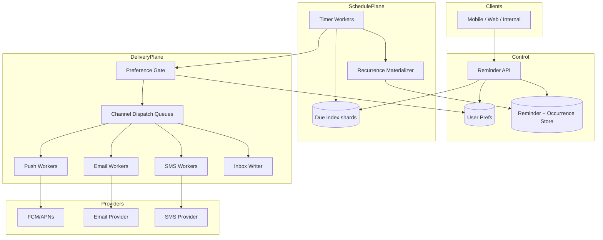
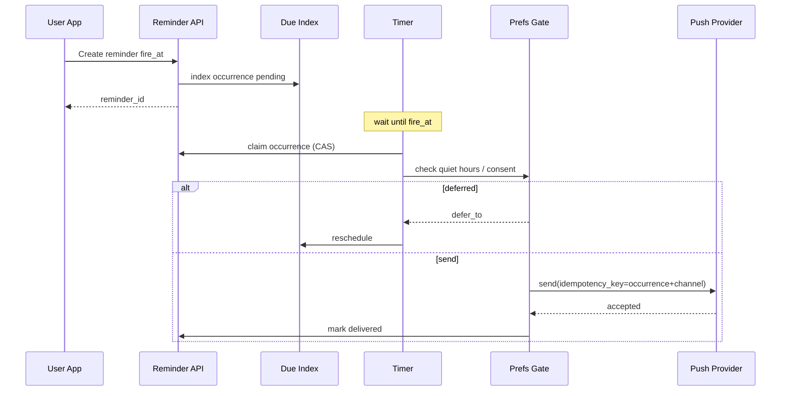
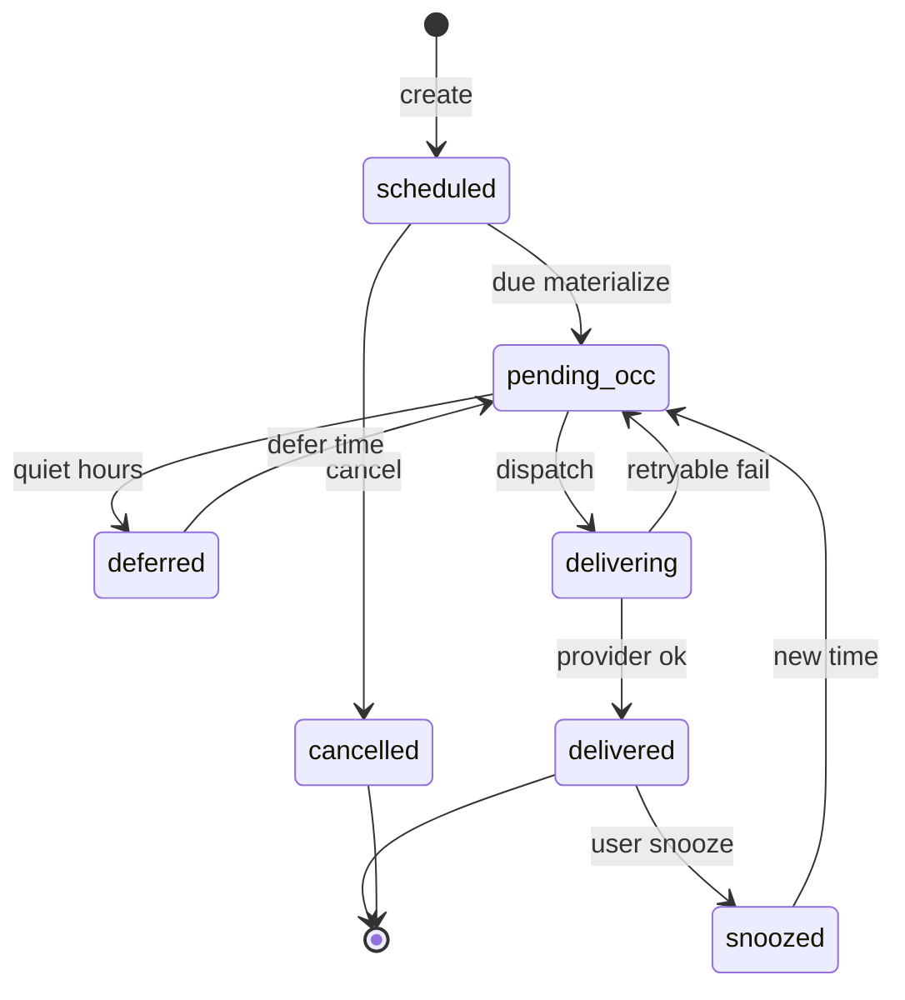

# System Design: Reminder Service

> **Focus areas:** Reminder CRUD · Due-time indexing · Delivery channels · At-least-once notify · Idempotent sends · User prefs / quiet hours · Cancel & snooze · Partitioned timers  
> **Style:** End-to-end product design with progressive scale (10× → 100× → 1,000×)  
> **Interview theme:** Productized “remind me at time T” (calendar pings, todo due, medication, deal expiry)—built on scheduling primitives with **notification semantics**

---

## Table of Contents

1. [Clarify Requirements (Interview Q&A)](#1-clarify-requirements-interview-qa)
2. [Back-of-the-Envelope Estimation](#2-back-of-the-envelope-estimation)
3. [High-Level Design](#3-high-level-design)
4. [Architecture Diagram](#4-architecture-diagram)
5. [Design Deep Dive](#5-design-deep-dive)
6. [Wrap-Up](#6-wrap-up)
7. [Deeper / Related Interview Questions](#7-deeper--related-interview-questions)

---

## 1. Clarify Requirements (Interview Q&A)

Goal: design a **reminder service**—users/apps create reminders for a future time (one-shot or recurring), the system fires deliveries via channels (push, email, SMS, in-app), supports cancel/snooze/ack, respects preferences, and remains correct under scale and failure.

### 1.0 What this is / is not

| Dimension | This doc | Not this |
|-----------|----------|----------|
| Product | Reminder lifecycle + notification delivery | Generic opaque delayed queue alone |
| Scheduling | Uses delay indexes / cron under the hood | Full DAG workflows |
| Delivery | Multi-channel notify with templates | Marketing campaign platform |
| Users | End-users + first-party apps | Arbitrary message broker tenants |
| Success | User gets timely reminder (SLO) | Exactly-once SMS without provider help |

### 1.1 Functional Requirements

| # | Question | Typical answer | Implication |
|---|----------|----------------|-------------|
| F1 | Who creates reminders? | Mobile/web apps + internal services | Public + internal API |
| F2 | One-shot and recurring? | Both; recurring uses cron-like RRULE subset | Reminder + occurrence materialization |
| F3 | Channels? | Push, email, SMS, in-app inbox | Channel adapters; fallback chains |
| F4 | Timezone? | User TZ; store `fire_at` UTC + display TZ | DST-safe |
| F5 | Cancel / snooze / complete? | Yes before/at delivery | State machine |
| F6 | Ack / dismiss? | Track delivery + user ack optional | Delivery attempts log |
| F7 | Quiet hours / prefs? | Yes per user/channel | Gate before send |
| F8 | Dedup? | Same logical reminder not double-notify | occurrence_id idempotency |
| F9 | Localization? | Templates + locale | Template service |
| F10 | Priority? | Critical vs normal (meds vs optional) | Bypass quiet hours policy |
| F11 | Fan-out? | Reminder to one user MVP; optional shared later | Keep MVP 1:1 |
| F12 | Max horizon? | Up to 2–5 years | Tiered storage |
| F13 | Delivery guarantee? | At-least-once; best-effort timely | Retries + provider idempotency |
| F14 | Recurrence exceptions? | Skip dates / cancel series | Series + exception table |

**MVP scope:**

1. Create/update/cancel one-shot reminder with `fire_at`, channel set, payload/template.
2. Durable store; timer promotion when due.
3. Deliver via ≥1 channel (push + in-app); record attempt.
4. Snooze → new `fire_at`; cancel series/instance.
5. User prefs: quiet hours, channel enablement.
6. Basic recurring (daily/weekly) with materialization window.
7. Query upcoming reminders; delivery history.

**Out of MVP:** rich calendar sync (Google/Outlook bi-di), ML send-time optimize, SMS globally all countries, social shared reminders, Exact-once telecom, voice calls.

### 1.2 Non-Functional Requirements

| # | NFR | Target |
|---|-----|--------|
| N1 | Create latency | p99 < 50–100ms |
| N2 | Fire lateness | p99 < 5–15s (stricter for critical tier) |
| N3 | Availability | 99.9% create; 99.99% fire path multi-AZ |
| N4 | Durability | No lost accepted reminders |
| N5 | Privacy | Encrypt payloads; PII controls |
| N6 | Cost | SMS expensive—prefer push |
| N7 | Multi-region | Home region per user |

### 1.3 Cases

**Happy:** Create reminder for tomorrow 9am local → fire → push + inbox → user opens.  
**Snooze:** User snoozes 10m → reschedule occurrence.  
**Cancel:** Delete before fire → no notify.  
**Recurring:** Daily 8am → materialize next N occurrences.

| Case | Behavior |
|------|----------|
| User in quiet hours | Defer to end (unless critical) |
| Push token invalid | Mark channel bad; fallback email if allowed |
| Duplicate fire workers | Idempotent `delivery_id` / occurrence key |
| Provider timeout | Retry with backoff; at-least-once |
| DST spring/fall | Compute next in TZ; store UTC instants |
| Clock skew | Server time for fire |
| User deletes account | Cascade cancel + purge PII |
| Thundering herd 9:00 local | Shard + jitter optional for non-critical |
| SMS spend spike | Budget circuit breaker |
| Recurring + cancel-one | Exception on that date only |
| Device offline | Push best-effort; inbox durable |
| Reminder updated after materialize | Generation bump; supersede pending deliveries |

### 1.4 Scales

| Metric | Baseline | 10× | 100× | 1,000× |
|--------|----------|-----|------|--------|
| MAU | 5M | 50M | 500M | 5B (unrealistic global—treat as multi-app) |
| Reminders created / day | 20M | 200M | 2B | 20B |
| Active pending reminders | 100M | 1B | 10B | 100B |
| Fires / s peak | 3K | 30K | 300K | 3M |
| Push sends / s peak | 2K | 20K | 200K | 2M |
| SMS / s peak | 100 | 1K | 10K | 50K (capped) |
| Recurring series | 10M | 100M | 1B | 10B |

**Jumps:** 10× partitioned due-index; 100× occurrence materializer + channel microservices; 1,000× cells by user home + tiered cold reminders.

### 1.5 Etc.

- Built **on** delayed queue + optional cron materializer—not a replacement for those primitives.
- Compliance: CAN-SPAM/TCPA for email/SMS; consent flags.

**Scope repeat-back:**

> Multi-channel reminder service: durable one-shot/recurring reminders, TZ-aware firing, cancel/snooze, preference gating, at-least-once idempotent delivery, progressive partitioning—product SLOs on lateness, not just queue semantics.

---

## 2. Back-of-the-Envelope Estimation

### 2.1 Traffic

```text
20M creates/day ≈ 230/s avg; peak ~2K/s
100M pending; fires clustered at local mornings
Assume 10% of MAU fire in same 5-min window worldwide → severe peak
Need geographic/TZ spreading naturally + shards
```

### 2.2 Storage

```text
Reminder row ~500 B–1 KB
100M × 800 B ≈ 80 GB
Occurrence/delivery logs 200 B × 20M/day ≈ 4 GB/day
1,000×: tens of PB without tiering → cold archive completed
```

### 2.3 Delivery fan-out

```text
1 reminder × 2 channels avg = 2 sends
Peak fires 3K/s → 6K sends/s baseline
Provider rate limits dominate SMS
```

### 2.4 Memory / timers

Near-term wheel per shard for next 5–15 minutes; far reminders in disk buckets (same as delayed queue).

### 2.5 Cost sketch

```text
Push ~cheap; email moderate; SMS $0.01–0.05
1M SMS/day → $10K–50K/day → product must gate SMS
```

### 2.6 Hot keys

Celebrity/shared lists out of MVP; per-user shard fine. Global 9am local peaks → many users, distributed if sharded by `user_id`.

---

## 3. High-Level Design

### 3.1 Domain model

```text
User { user_id, home_region, tz, prefs }
Reminder {
  reminder_id, user_id,
  title, body_ref / template_id+params,
  fire_at (UTC) | rrule + tz,
  channels[], priority,
  status: scheduled | fired | cancelled | completed,
  generation,
  series_id?
}
Occurrence {
  occurrence_id,  # = hash(series_id, scheduled_fire_time) or uuid
  reminder_id / series_id,
  scheduled_fire_time,
  status: pending | delivering | delivered | skipped | snoozed | cancelled,
  generation
}
DeliveryAttempt {
  delivery_id, occurrence_id, channel,
  provider_msg_id, status, attempt_n, error
}
UserPrefs {
  quiet_hours, channel_enabled, locale, consent_sms
}
```

### 3.2 State machine

```text
Reminder scheduled
  → cancel → cancelled
  → due → materialize Occurrence(pending)
Occurrence pending
  → prefs skip/defer → skipped | pending(new time)
  → send → delivering → delivered
  → snooze → pending(new fire_at)
  → cancel → cancelled
```

### 3.3 APIs

| Method | Path | Purpose |
|--------|------|---------|
| POST | `/v1/reminders` | Create |
| PATCH | `/v1/reminders/{id}` | Update / reschedule |
| DELETE | `/v1/reminders/{id}` | Cancel |
| GET | `/v1/reminders` | List upcoming |
| POST | `/v1/reminders/{id}/snooze` | Snooze |
| POST | `/v1/occurrences/{id}/ack` | User ack |
| PUT | `/v1/users/{id}/prefs` | Preferences |
| GET | `/v1/reminders/{id}/deliveries` | History |

**Create:**

```http
POST /v1/reminders
Idempotency-Key: ...
{
  "user_id": "u_1",
  "title": "Dentist",
  "fire_at": "2026-08-07T16:00:00Z",
  "timezone": "America/Los_Angeles",
  "channels": ["push", "inbox"],
  "priority": "normal",
  "template_id": "generic_reminder",
  "data": {"when_local": "9:00 AM"}
}
```

### 3.4 Why not “just use cron + email”?

Reminders need: per-user ops (snooze/cancel), prefs, multi-channel, occurrence identity, product analytics, cost controls. Cron is a component for recurrence materialization.

### 3.5 Component architecture

1. **API** — CRUD, authz (user owns reminder)  
2. **Reminder store** — SoT  
3. **Due index / timer plane** — partitioned by `hash(user_id)`  
4. **Occurrence materializer** — one-shot promote or recurring expand  
5. **Preference gate** — quiet hours / consent  
6. **Dispatcher** — enqueue channel sends with idempotent keys  
7. **Channel workers** — push/email/SMS/inbox  
8. **Provider adapters** — FCM/APNs/SES/Twilio  
9. **Inbox store** — durable in-app notifications  

### 3.6 Trade-offs

| Approach | Pros | Cons | Use |
|----------|------|------|-----|
| Per-reminder delay msg | Simple | Update/cancel hard | Tiny MVP |
| **Due index + occurrence** | Cancel/snooze natural | More tables | **Default** |
| Materialize all recurring 5y | Simple fire | Storage blowup | No |
| **Sliding window materialize** | Bounded | Complex | Recurring |
| Sync send in timer | Fewer parts | Tail latency / blast | No |
| **Async channel queues** | Isolate failures | At-least-once | **Default** |

**Deal-breakers:** fire without occurrence idempotency; ignore TZ; SMS without consent; single global timer.

### 3.7 Scheduling correctness

Reuse delayed-queue patterns:

- `UNIQUE(occurrence_id)` or `(series_id, scheduled_fire_time)`  
- CAS pending → delivering  
- Cancel increments `generation`; send checks generation  

**Exactly-once notify?** No—providers + retries ⇒ **at-least-once**. Dedupe with `delivery_id` and provider idempotency keys to make duplicates rare.

### 3.8 Recurring materialization

```text
For each series: keep next_fire_at
On fire: create occurrence for t; compute next; insert into due index
Optionally pre-materialize next K (e.g. 2) for UX listing
Do NOT prewrite years of rows
```

### 3.9 Quiet hours

```text
if priority!=critical and now in quiet_hours(user.tz):
  defer_to = end_of_quiet_hours
  reschedule occurrence (or hold with due=defer_to)
```

### 3.10 Snooze

```text
POST snooze { "until": "...", "or_minutes": 10 }
CAS occurrence → cancelled_for_snooze / new occurrence with new fire_at
generation++
```

---

## 4. Architecture Diagram







---

## 5. Design Deep Dive

### 5.1 Reliability

#### No lost reminders

ACK create only after durable write to store + due index (txn/outbox). Multi-AZ.

#### At-least-once delivery

Timer crash after claim before send → lease expiry → retry.  
Send crash after provider accept before DB → retry with same idempotency key → provider dedupe.

#### Retries

Per-channel retry policy; fallback chain optional (`push → inbox → email`). SMS last resort.

#### Idempotency keys

```text
provider_key = hash(occurrence_id, channel, generation)
```

#### Rate limits / backpressure

Per-user create caps; global SMS budget; defer non-critical when channel queue depth high.

#### Cancel races

Same as delayed queue: rare deliver-after-cancel if race; include generation in payload; client ignores stale; mark cancelled suppresses inbox display.

### 5.2 Scalability

#### Sharding

```text
shard = hash(user_id) % N
Timers own shards via leases
```

#### Tiered due index

Hierarchical buckets for far `fire_at` (years out)—critical for reminder horizons.

#### Materialization window

List API shows next 30–90 days; compute on read for far recurrence if needed.

#### Channel isolation

Separate queues/workers so SMS provider slowness doesn’t block push.

#### Multi-region

User home region; roaming users still fire in home (or route to nearest with sticky SoT). Avoid dual writers.

#### Peak dampening

Optional ±jitter for low-priority; never jitter medication/critical without product approval.

### 5.3 Maintainability

#### Observability

`reminder_lateness`, `delivery_success_ratio`, `quiet_defer_total`, `cancel_after_dispatch`, `sms_spend`, shard lag.

#### Ops

Replay failed deliveries; suppress broken template; kill switch per channel.

#### Migrations

Template versioning; channel adapter upgrades; tzdb updates recompute next for series.

#### Multi-tenant / multi-app

`app_id` on reminders; quotas; brand templates.

#### Privacy

Encrypt body; retention TTL after fire; GDPR delete path across store, inbox, logs (redact).

---

## 6. Wrap-Up

| Decision | Choice |
|----------|--------|
| Core | Occurrence + due index, not fire-and-forget |
| Delivery | At-least-once + provider idempotency keys |
| Recurrence | Sliding next_fire, not years of rows |
| Prefs | Gate in delivery path |
| Scale | Shard by user_id; channel queues; cells |

**Phases:** (0) one-shot + push/inbox + PG due index → (1) leases, snooze, prefs → (2) recurring + SMS budget → (3) cells + hierarchical timers.

> A reminder service is a **productized scheduler + notification orchestrator**: scheduling correctness from delayed/cron primitives, plus preferences, channels, and human actions (snooze/cancel).

---

## 7. Deeper / Related Interview Questions

**Q1. How is this different from a delayed message queue?**  
A: Queue is opaque delivery; reminders add user model, prefs, channels, snooze, recurrence UX, cost/compliance.

**Q2. How is this different from distributed cron?**  
A: Cron is schedule→fire for systems; reminders are user-centric with per-instance mutations.

**Q3. Exactly-once push?**  
A: Not guaranteed; idempotency keys minimize dupes; inbox upsert by occurrence_id.

**Q4. Design quiet hours across TZ change (travel).**  
A: Prefs store TZ; update on travel; fire uses current prefs at delivery time.

**Q5. Recurring “every month on the 31st”?**  
A: Define policy (skip vs last day); document; test.

**Q6. Top-of-hour stampede.**  
A: Shard by user; scale timers; optional jitter; priority lanes.

**Q7. Cancel after push sent.**  
A: Can’t unsend push; update inbox state; show cancelled.

**Q8. Provider outage.**  
A: Buffer in channel queue; fallback; status degraded banner.

**Q9. Storage for 5-year reminder.**  
A: Cold bucket; load to hot wheel when near.

**Q10. Security IDOR.**  
A: Authz user_id match; opaque IDs; no sequential leak.

**Q11. SMS TCPA.**  
A: Consent timestamp; STOP handling; quiet hours legal.

**Q12. Dedup create retries.**  
A: Idempotency-Key on POST.

**Q13. Should fire use local or UTC comparison?**  
A: Store/compare UTC; derive from local+TZ at write/recompute.

**Q14. Multi-device push.**  
A: Fan-out tokens; collapse_key=occurrence_id.

**Q15. Read-your-writes list after create.**  
A: Home region strong read; or read-through from primary.

**Q16. Analytics: reminder effectiveness.**  
A: Ack/open events async; don’t block delivery path.

**Q17. Shared family reminder?**  
A: Phase 2; occurrence per user or shared with fan-out table.

**Q18. Consistency of snooze vs in-flight send.**  
A: generation fence; late send dropped or marked superseded.

**Q19. Why materialize occurrences?**  
A: Stable id for delivery idempotency + history + snooze.

**Q20. Integration with calendar.**  
A: External sync connector; conflict rules; don’t block MVP.

**Q21. SLO tighter for critical?**  
A: Separate shard pool / no jitter / page on lag.

**Q22. Backfill after downtime.**  
A: Policy: deliver if within grace (e.g. 2h) else skip+badge “missed”; never flood 48h of daily reminders at once without cap.

**Q23. Template injection?**  
A: Safe templating; escape; size limits.

**Q24. Hot user with 100K reminders.**  
A: Cap; paginate; fair timer quotas per user.

**Q25. Relationship to job scheduler.**  
A: Channel sends can be jobs; keep reminder SoT separate.

**Q26. Testing DST.**  
A: Golden tests America/Los_Angeles transitions for local 9am series.

**Q27. Inbox vs push as SoT for “seen”?**  
A: Inbox durable UX; push ephemeral signal.

**Q28. Cost controls.**  
A: Per-tenant SMS budget; prefer push; anomaly detection.

**Q29. Data model for series exception.**  
A: `exceptions(series_id, date, action=skip|reschedule)`.

**Q30. Biggest footgun?**  
A: Naive catch-up after outage spamming users + missing generation on cancel/snooze races.

---

## Appendix A — Fire path pseudocode

```text
function OnDue(occurrence):
  if not cas(occurrence, pending → delivering, gen): return
  prefs = load_prefs(user)
  if should_defer(prefs, occurrence.priority):
    reschedule(occurrence, defer_to(prefs)); return
  for ch in channels:
    enqueue_send(delivery_id=hash(occ,ch,gen), ch)
```

## Appendix B — Create transactional outbox

```text
txn:
  insert reminder
  insert occurrence (one-shot)
  insert due_index(shard, fire_at, occurrence_id)
  insert outbox optional
commit
```

## Appendix C — Capacity worksheet

| Input | Notes |
|-------|-------|
| Pending P | Index size |
| Peak fire F | Timer workers ≈ F / batch / util |
| Channels C | Send QPS ≈ F × C |
| SMS fraction s | Cost ≈ F × s × price |

## Appendix D — Preference examples

```json
{
  "timezone": "America/New_York",
  "quiet_hours": {"start": "22:00", "end": "07:00"},
  "channels": {"push": true, "email": true, "sms": false},
  "critical_bypass_quiet_hours": true
}
```

## Appendix E — Comparison

| System | User ops | Channels | Recurrence |
|--------|----------|----------|------------|
| Delay queue | No | Opaque | No |
| Cron | Weak | Target job | Yes |
| Calendar | Rich | Limited notify | Yes |
| Reminder svc | First-class | Multi | Windowed |

## Appendix F — Failure drills

1. Timer rebalance mid-fire  
2. Cancel vs send race  
3. Quiet hours defer loop  
4. APNs invalid token storm  
5. SMS budget trip  
6. DST series  
7. Catch-up after 6h outage  

## Appendix G — Privacy checklist

- Encrypt at rest  
- TTL completed reminders  
- Delete user cascade  
- Redact logs  
- Consent audit for SMS  

## Appendix H — Progressive architecture map

| Scale | Architecture |
|-------|----------------|
| MVP | API + PG + poller + FCM + inbox table |
| 10× | Sharded due index + leases + channel queues |
| 100× | Recurrence materializer + prefs service + budgets |
| 1,000× | User cells + hierarchical timers + cold tier |

## Appendix I — Lateness SLO math

```text
lateness = actual_send_enqueue_time - scheduled_fire_time
critical: p99 < 5s
normal: p99 < 15s
monitor per shard max(lateness)
```

## Appendix J — Idempotent inbox upsert

```text
UPSERT inbox_items
SET status='delivered', generation=?
WHERE occurrence_id=? AND generation<=?
```
