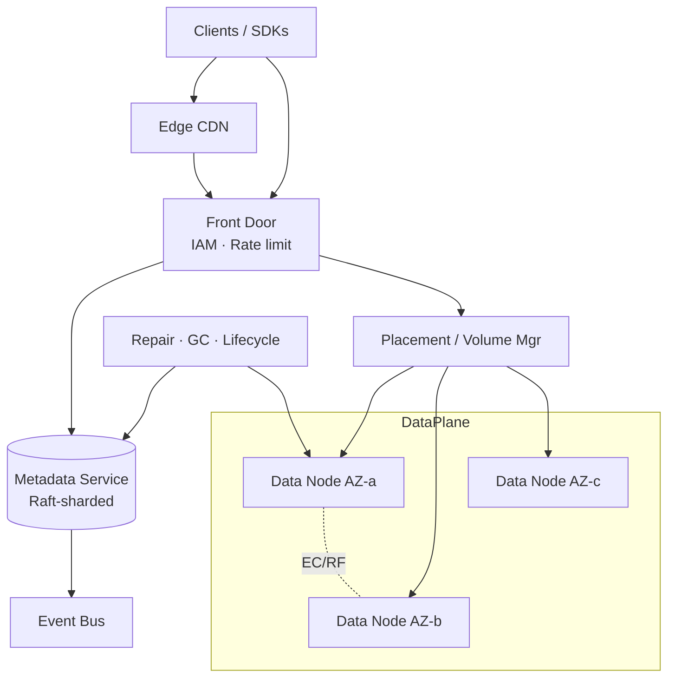
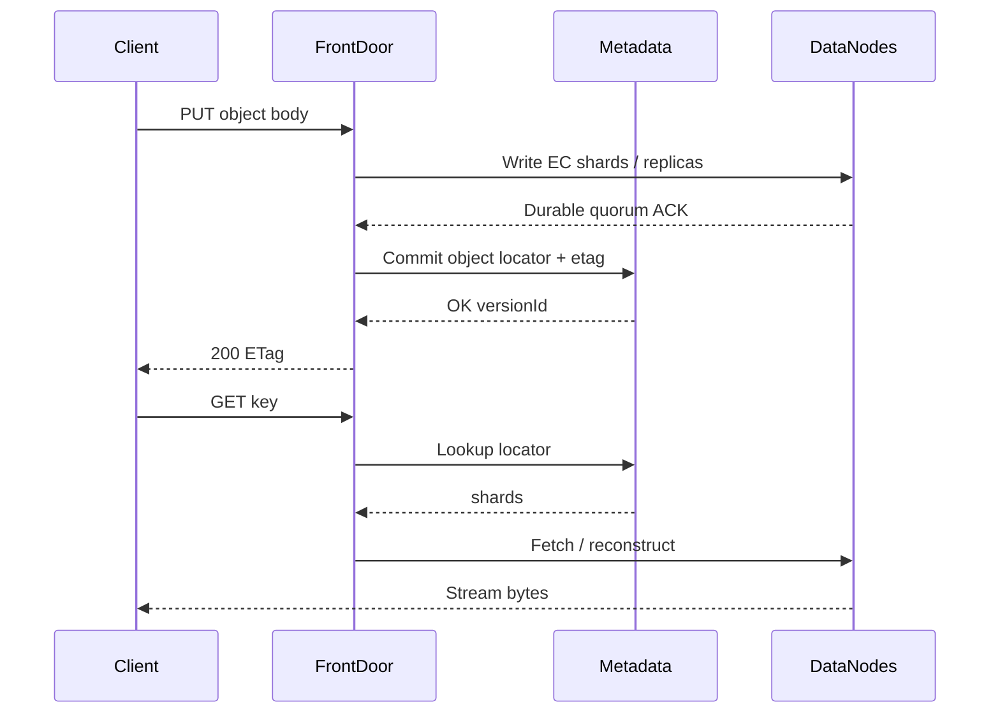

# System Design: S3 / Blob Storage

> **Focus areas:** Object immutability · Metadata service · Data plane · Erasure coding · Multipart upload · Consistency · Tiering  
> **Style:** AWS S3 / GCS / Azure Blob–class object store  
> **API orientation:** Bucket/object REST (`PUT`/`GET`/`DELETE`/`LIST`, multipart, presigned URLs)

---

## Table of Contents

1. [Clarify Requirements (Interview Q&A)](#1-clarify-requirements-interview-qa)
2. [Back-of-the-Envelope Estimation](#2-back-of-the-envelope-estimation)
3. [High-Level Design](#3-high-level-design)
4. [Architecture Diagram](#4-architecture-diagram)
5. [Design Deep Dive](#5-design-deep-dive)
6. [Wrap-Up](#6-wrap-up)
7. [Deeper / Related Interview Questions](#7-deeper--related-interview-questions)

---

## 1. Clarify Requirements (Interview Q&A)

Design a **hyperscale object/blob store**: flat namespace of objects in buckets, optimized for large immutable blobs, extreme durability, and cheap capacity—not POSIX filesystem semantics.

### 1.0 What this is / is not

| This is | This is not |
|---------|-------------|
| **Object storage**: `bucket + key → bytes` | POSIX disk (random overwrite, hard links) |
| Immutable object versions (PUT replaces wholesale) | In-place byte-range mutate (except compose/patch products) |
| Separate **control/metadata plane** vs **data plane** | Single DB storing all bytes as BLOBs |
| 11-nines-class durability via replication / erasure coding | Best-effort CDN cache alone |
| Strong or read-after-write consistency for new objects (modern S3) | Strongly consistent global cross-region listing by default |
| Multipart for large uploads | Small-KV replacement for 100 B hot keys (use KV/cache) |

### 1.1 Functional Requirements

| # | Question to ask | Expected / typical interviewer answer | Design implication |
|---|-----------------|----------------------------------------|--------------------|
| F1 | Max object size? | 5 TB class; multipart required > threshold | Chunk into parts; assemble metadata |
| F2 | Typical object size? | Bimodal: KB metadata + MB–GB media | Different placement / packing strategies |
| F3 | Consistency? | Read-after-write for PUT of new object; list eventual-ish historically, strong now | Discuss metadata journal + caching carefully |
| F4 | Versioning? | Optional per bucket | Version IDs; delete markers |
| F5 | Lifecycle / tiers? | Hot → warm → cold / glacier | Background migrate; restore API |
| F6 | Encryption? | SSE-S3 / SSE-KMS / client-side | Envelope encryption; key hierarchy |
| F7 | Presigned URLs? | Yes—direct upload/download | Authz tokens with expiry; bypass app servers |
| F8 | Listing? | Prefix + delimiter (folder illusion) | Indexed metadata, not directory inodes |
| F9 | Cross-region replication? | Phase 2 async CRR | Replication service on complete |
| F10 | Object lock / WORM? | Compliance optional | Legal hold; retention |
| F11 | Range GET? | Yes for media | Byte-range from EC shards / chunks |
| F12 | Multipart abort/complete? | Yes | Garbage-collect incomplete parts |
| F13 | Bucket policies / IAM? | Yes | Authn/Z at front door |
| F14 | Notifications? | Optional event to queue on PUT/DELETE | Async bus |

**MVP functional scope:**

1. Create/delete buckets; PUT/GET/DELETE objects; LIST by prefix.
2. Multipart upload (init / upload part / complete / abort).
3. Metadata service mapping `(bucket, key, version) → locator + etag + size`.
4. Data nodes storing chunks/shards with checksums.
5. Durability: RF=3 **or** erasure coding (e.g. 6+3) across AZs/fault domains.
6. Presigned URL support; SSE at rest.
7. Basic lifecycle: expire / transition cold.
8. Metrics: durability risk, PUT/GET latency, rebuild IO.

**Out of MVP:**

- Full cross-region active-active sync
- POSIX mount (s3fs semantics) as first-class guarantee
- Bit-identical AWS API surface completeness
- Object transform Lambdas (design hook only)

### 1.2 Non-Functional Requirements

| # | Question | Expected answer | Target |
|---|----------|-----------------|--------|
| N1 | Durability | “11 nines” aspirational | Design for ≤ 10⁻¹¹ annual object loss risk |
| N2 | Availability PUT/GET | High | 99.99% regional |
| N3 | GET TTFB small object | Interactive | p50 < 20ms, p99 < 100ms in-region |
| N4 | GET large sequential | Throughput | Saturate NIC (Gbps class per stream) |
| N5 | PUT multipart | Reliable | Resume parts; complete atomic |
| N6 | Consistency | R-A-W new writes | Metadata commit before GET visibility |
| N7 | Cost | Dominated by capacity | EC > RF for cold/hot capacity trade-off |
| N8 | Multi-AZ | Survive AZ loss | Placement across domains |

### 1.3 Cases

**Happy paths**

1. Single-part PUT ≤ 100 MB → data nodes store shards → metadata commit → `200` + ETag.
2. Multipart: init → N parts parallel → complete → metadata points to part set → object visible.
3. GET with `Range: bytes=` → fetch needed chunks → stream.
4. LIST `prefix=foo/` `delimiter=/` → common prefixes + truncated token.
5. Lifecycle: after 30 days move to cold EC pool; update locator.

**Edge / failure cases**

| Case | Behavior |
|------|----------|
| Lost shard during GET | Reconstruct via EC parity / fetch replica |
| Complete multipart with missing part | Reject complete |
| Duplicate complete | Idempotent same ETag / version |
| Orphan parts after abort crash | GC sweeper by upload-id age |
| Bitrot | Checksum fail → rebuild from parity/replica |
| Hot object | Cache at edge / regional gateway; immutable helps |
| LIST during heavy churn | Pagination tokens; possible tombstone races—document |
| Bucket delete with objects | Fail unless empty (or async delete job) |
| Presigned URL leak | Short TTL; scoped verb/key; optional IP bind |
| Metadata quorum loss | Control plane unavailable; data durable but dark |
| AZ loss | Survive via cross-AZ placement |
| Tiny-file storm | Pack small objects into shared volumes / aggregates |

### 1.4 Scales (Progressive)

| Metric | Baseline | 10× | 100× | 1,000× |
|--------|----------|-----|------|--------|
| Objects | 1B | 10B | 100B | 1T |
| Capacity | 10 PB | 100 PB | 1 EB | 10 EB |
| Avg size | 1 MB | 1 MB | 1 MB | mixed |
| GET QPS | 50K | 500K | 5M | 50M |
| PUT QPS | 5K | 50K | 500K | 5M |
| Buckets | 10K | 100K | 1M | 10M |
| Peak egress | 100 Gbps | 1 Tbps | 10 Tbps | 100 Tbps |
| Metadata peak | 55K ops/s | 550K | 5.5M | 55M |

**What each jump forces:**

- **10×:** Sharded metadata; EC rebuild automation; dedicated gateways.
- **100×:** Hierarchical volume managers; small-object packing; cell’d data planes.
- **1,000×:** Global namespace cells; CRR pipelines; cold archive media (tape/optical class); request routers with isolation.

### 1.5 Etc.

- Objects are **opaque bytes**; search is not a core feature (use Athena/catalog sibling).
- “Folders” are UI prefix illusions.
- Compare to **HDFS** (namenode) and **distributed filesystem** sibling—different API & mutate model.

**Scope statement:**

> Design an **S3-like blob store**: bucket/object API, multipart upload, metadata service + chunk data plane, multi-AZ durability via replication or erasure coding, read-after-write visibility, lifecycle tiering, and progressive scale to exabytes. POSIX and full global sync are out of MVP.

---

## 2. Back-of-the-Envelope Estimation

### 2.1 Capacity & durability overhead

```text
Raw user data: 10 PB
RF=3 → 30 PB raw disks
EC 6+3 (1.5×) → 15 PB raw disks   ← huge savings
Choose EC for large objects; RF for tiny/super-hot metadata volumes
```

### 2.2 Metadata size

```text
1B objects × ~200–500 B metadata ≈ 200–500 GB logical
With indexes + versions ×3 → multi-TB metadata fleet at baseline
At 1T objects → metadata becomes its own distributed DB problem
```

### 2.3 Bandwidth

```text
50K GET/s × 1 MB avg would be 400 Gbps—impossible average
Reality: heavy-tailed; many small GETs + fewer large streams
Design for: many metadata ops + cacheable hot objects + throughput path for large
```

### 2.4 Rebuild / repair IO (EC)

```text
Disk 20 TB fails; EC 6+3 cluster
Rebuild reads ~20 TB from survivors (plus overhead)
Must throttle rebuild vs foreground customer IO
Time objective: hours–day depending on cluster free bandwidth
```

### 2.5 Multipart math

```text
5 GB object / 16 MB parts ≈ 320 parts
Complete must commit part ETags set atomically in metadata
```

### 2.6 Small object problem

```text
1B × 10 KB objects = 10 TB data but enormous metadata + seek overhead
Pack into multi-MB “aggregate” files / tablet blobs with internal index
```

---

## 3. High-Level Design

### 3.1 API surface (core)

| API | Purpose |
|-----|---------|
| `PUT /b/{bucket}/{key}` | Single-part upload |
| `GET /b/{bucket}/{key}` | Download; supports Range |
| `DELETE` | Delete / delete marker |
| `GET /b/{bucket}?list-type=2&prefix=&delimiter=&token=` | List |
| `POST ?uploads` | Multipart init |
| `PUT ?partNumber=&uploadId=` | Upload part |
| `POST ?uploadId=` | Complete |
| `DELETE ?uploadId=` | Abort |
| Presigned query auth | Temporary capability URL |

**ETag:** often MD5 of content (single-part) or multipart-specific hash—document honestly.

### 3.2 System components

```text
Client
  → Front Door / API Gateway (IAM, rate limit, TLS)
    → Metadata Service (bucket, object index, multipart state)
    → Placement Service (which volumes / EC set)
    → Data Nodes / Chunk Servers (durable bytes)
    → Repair / Lifecycle / GC workers
    → Optional CDN / edge cache
```

**Critical split:** never put object bytes in the metadata DB.

### 3.3 Data model

```text
Bucket:
  name, owner, region, versioning, default encryption, lifecycle rules

Object (logical):
  bucket, key, version_id
  size, etag, content_type, user_metadata
  storage_class, encryption_key_id
  creation_time, delete_marker?

Physical:
  chunk_id[] or ec_stripe_id[] + codec params
  OR aggregate_file_id + offset + length  # small object packing
```

### 3.4 Write path (single-part)

```text
1. AuthZ bucket/key
2. Choose placement: fault domains for shards
3. Stream bytes to data nodes in parallel (RF or EC encode)
4. Persist shards with checksums; quorum/EC durability threshold
5. Commit metadata pointer (atomic)
6. ACK client with ETag / version
7. On failure after data before metadata: GC orphan chunks
```

**Visibility:** object GET-able only after metadata commit ⇒ read-after-write.

### 3.5 Multipart

```text
Init → uploadId
Parts stored as independent objects/chunks keyed by (uploadId, partNumber)
Complete:
  validate part list + ETags
  create final object metadata referencing part set (or compose copy)
  mark upload committed
Abort / GC: delete parts
```

Atomicity of Complete is a **metadata transaction**.

### 3.6 Replication vs erasure coding

| Scheme | Storage overhead | Rebuild cost | Partial read | When |
|--------|------------------|--------------|--------------|------|
| RF=3 | 3.0× | Copy from one good | Easy | Small objects, low latency |
| EC k+m (e.g. 6+3) | 1.5× | Read k fragments | Recompute / read subsets | Large objects, capacity |
| EC + local RF hybrid | Medium | Tunable | Complex | Hot large objects |

**Interview pick:** EC for ≥ few MB objects; replicate or pack small objects.

### 3.7 Metadata service design

Requirements: high QPS, strong consistency for commits, prefix list.

| Option | Pros | Cons |
|--------|------|------|
| Sharded KV + Raft ranges | Scales; strong | Build complexity |
| NewSQL (DistSQL) | Transactions for complete | Heavier |
| Bigtable-style tablets | Proven for metadata | Need secondary for lists |

**LIST** needs secondary index `(bucket, key)` ordered—or store keys sorted in tablets.

**Buckets** fewer—can live in strongly consistent small store.

### 3.8 Consistency model (staff talking points)

Modern S3: strong read-after-write and strong list within region for most ops. Design:

- Single metadata commit defines truth.
- Caches must be version-aware or invalidated on update.
- Cross-region: eventual via CRR.

Overwriting key: new version id; readers may need cache bust (`If-None-Match` / versionId).

### 3.9 Why not “store files on NFS / HDFS”?

| | Object store | HDFS / DFS |
|--|--------------|------------|
| API | HTTP object | POSIX / blocks for compute |
| Mutability | Immutable PUT | Append / truncate variants |
| Metadata | Per-object | Per-block namenode pressure |
| Multi-tenant IAM | First-class | Different |

### 3.10 Presigned URLs

```text
Sign: method + bucket + key + expiry + headers subset
Gateway verifies HMAC/SigV4 without central session
Enables direct-to-store browser uploads
```

---

## 4. Architecture Diagram





---

## 5. Design Deep Dive

### 5.1 Reliability

#### 5.1.1 Durability math (order-of)

```text
Independent disk AFR 1%; with EC/RF and fast repair,
object loss requires many correlated failures within repair window.
Cross-AZ + scrubbing + checksums → approach “11 nines” engineering culture
(not a magic formula—show you understand correlated risk: rack, software bug)
```

**Correlated failure killers:** bad rolling deploy wiping shards; same firmware bug; metadata delete bugs. Guard with: rate-limited deletes, soft-delete windows, multi-person schema changes.

#### 5.1.2 Checksums end-to-end

- Client Content-MD5 / SHA256 optional.
- Per-shard checksums on disk.
- GET path verifies; mismatch triggers repair.

#### 5.1.3 Repair / scrubbing

- Background scrub reads shards, verifies checksums.
- On disk failure: reconstruct to new node; update placement.
- Throttle using IO tokens so customer GETs win.

#### 5.1.4 Idempotency

- PUT with same key: new version or overwrite per bucket config.
- Multipart complete idempotent.
- Retries may create orphan shards → GC.

#### 5.1.5 Rate limits & backpressure

| Layer | Limit |
|-------|-------|
| Per-prefix / per-account | Request + bandwidth tokens |
| Data node | Outstanding writes; disk queue depth |
| Metadata | Per-shard QPS; list cost higher |
| Rebuild | Separate lower priority class |

#### 5.1.6 CAP

- Within region: metadata CP (Raft) so visibility is consistent; if metadata majority down, fail requests.
- Data plane can still hold bytes; **availability of API** tied to metadata + enough shards.
- Cross-region CRR: AP-style eventual copies.

### 5.2 Scalability

#### 5.2.1 Metadata sharding

```text
shard = hash(bucket) or hash(bucket + key_prefix)
Avoid hot bucket listing: secondary range partitioned by key
Whale buckets: dedicated metadata cells
```

#### 5.2.2 Data plane volumes

- Cluster disks into **volumes / placement groups** with free-space tracking.
- Large object stripes across many disks for throughput.
- Cells: region split into storage cells for blast radius.

#### 5.2.3 Small object packing

Aggregate builder process:

```text
Buffer many small objects → write 64 MB pack file + index
Metadata points into pack
GC rewrite packs with live objects (like LSM compaction!)
```

This is the **compaction** analogue in blob storage.

#### 5.2.4 Tiering

| Tier | Media | Latency | EC |
|------|-------|---------|----|
| Standard | NVMe/SSD | ms | 1.5–2× |
| Infrequent | HDD | ms–tens | 1.4–1.5× |
| Archive | Dense HDD/tape class | minutes restore | Higher |

Lifecycle worker copies then flips metadata pointer then GC old.

#### 5.2.5 Throughput GETs

- Parallel fetch shards.
- HTTP/2 / multiple ranges.
- CDN for public hot objects (immutable versioned URLs best).

### 5.3 Maintainability

#### 5.3.1 Observability

| Metric | Notes |
|--------|-------|
| `put_latency` / `get_ttfb` / `get_throughput` | SLIs |
| `unhealthy_shards` / `repair_backlog_bytes` | Durability |
| `metadata_qps` / `list_qps` | Control plane |
| `orphan_gc_bytes` | Leak detector |
| `multipart_incomplete_age` | Abuse / crash |

#### 5.3.2 Operability

- Drain data node: re-replicate/EC move off node.
- Rolling upgrades with placement avoiding same-version correlated risk (diversity).
- Chaos: pull power on disk, AZ, metadata leader.

#### 5.3.3 Security

- IAM + bucket policies + optional object ACL legacy.
- SSE-KMS: DEK wrapped per object; audit key use.
- Object Lock: WORM compliance mode.
- Presigned URL scope minimization.

#### 5.3.4 Multi-tenant isolation

- Noisy neighbor bandwidth caps.
- Separate placement pools for enterprise.
- Per-account metadata partitions.

#### 5.3.5 Migrations / format

- Chunk format version in headers.
- Dual-read during codec upgrades.
- Re-encode jobs for EC parameter changes.

---

## 6. Wrap-Up

### Decision summary

| Area | Decision |
|------|----------|
| API | S3-style object + multipart |
| Planes | Metadata ≠ data |
| Durability | EC for large; RF/pack for small |
| Consistency | Metadata commit ⇒ R-A-W |
| Scale | Shard metadata; cell data; pack small |
| Tiering | Lifecycle workers |

### Phased rollout

1. **MVP:** RF=3, single-part + multipart, sharded metadata, one region 3 AZ.
2. **Prod:** EC, scrubber, lifecycle, presigned, KMS.
3. **Scale:** Small-object packing, cells, CDN integration.
4. **Global:** CRR, multi-region buckets, archive tier.

---

## 7. Deeper / Related Interview Questions

1. **Why immutability simplifies caching?**  
   A versioned object can be cached forever; updates create new version IDs.

2. **How does CompleteMultipartUpload stay atomic?**  
   Metadata transaction switches pointer from nonexistent → full part set; partial not visible.

3. **EC vs replication for 1 KB objects?**  
   EC overhead & seek cost dominate; pack + replicate packs instead.

4. **What is the small-files problem?**  
   Metadata explosion + random IO; solved by aggregation / packing.

5. **How do you LIST efficiently?**  
   Ordered key index per bucket shard; pagination tokens = last key.

6. **Read-after-write vs list consistency history?**  
   Older S3 had edge cases on overwrite/list; modern strong—design metadata carefully.

7. **How to rebuild degraded EC without melting cluster?**  
   Throttle, prioritize under-min-copy objects, schedule off-peak, adaptive rate.

8. **Presigned URL security failure modes?**  
   Over-broad scope, long expiry, verb mismatch, leaked logs.

9. **Compare to distributed KV store.**  
   KV: small values, low latency mutability; Blob: large immutable, throughput, cheaper EC.

10. **Compare to distributed filesystem.**  
   DFS: hierarchical inodes, append/consistency for compute; object: simpler API, different locking.

11. **How do delete markers work with versioning?**  
   Soft delete inserts marker; LIST may hide; hard delete versions per request.

12. **GDPR delete across tiers & CRR?**  
   Propagate delete; confirm cold/archive; track completion; backups policy.

13. **ETag semantics multipart?**  
   Not a simple MD5 of body—SDKs must not assume; use checksum headers (CRC32C/SHA256).

14. **Hot key / hot object?**  
   Cache; replicate more copies; fanout from gateway; versioned CDN.

15. **Metadata as single SQL DB?**  
   Fails at tens of K QPS and billions rows—must shard / use wide-column or DistSQL cells.

16. **Why separate placement service?**  
   Encodes fault domains, free space, drain state—keep out of request path business logic.

17. **Orphan chunk GC safety?**  
   Only delete if no metadata references **and** older than grace; careful races with slow commits.

18. **Cross-region replication ordering?**  
   Per-key latest version wins; delete markers replicate; lag monitored.

19. **How to offer byte-range GET with EC?**  
   Map ranges to shards; fetch subset; decode needed slices.

20. **Bucket rate limit fairness?**  
   Token buckets per account/prefix; isolate pathological LIST crawlers.

21. **Object Lock vs soft retention?**  
   Compliance mode prevents root delete until retain until; governance can override with audit.

22. **Encryption key rotation?**  
   Re-encrypt DEK wrappers (metadata) without rewriting all data; or lazy rewrite.

23. **Disaster recovery of metadata?**  
   Geo-backup metadata; object data without metadata is unaddressable—protect metadata harder.

24. **Can PUT be append-friendly?**  
   Not in classic S3; use multipart compose / new object versions.

25. **Throughput vs IOPS hardware?**  
   Large objects: sequential throughput; small: IOPS/metadata bound—different pools.

26. **How does lifecycle transition avoid data loss?**  
   Write new tier fully → checksum verify → metadata swap → GC old after grace.

27. **Multi-part parallel upload corruption?**  
   Part ETags validated; complete rejects mismatch; optional trailing checksums.

28. **Why cells at EB scale?**  
   Limit blast radius of software bugs and rebuild storms; independent ops.

29. **Notification exactly-once?**  
   At-least-once to bus; consumers idempotent by `(bucket,key,version,event_id)`.

30. **When is S3 the wrong answer?**  
   Highly mutable small records with transactions—use DistSQL/KV; low-latency chatty POSIX—use local disk/DFS.

---

*End of S3 / Blob Storage system design.*
