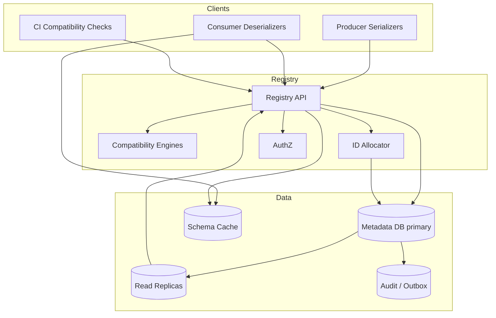

# System Design: Schema Registry

> **Focus areas:** Schema subjects · Compatibility · Avro/Protobuf/JSON Schema · Evolution · Producer/consumer contracts · Multi-tenant  
> **Style:** End-to-end data-platform design with progressive scale (10× → 100× → 1,000×)  
> **API orientation:** Confluent-compatible + richer governance APIs; control plane for streaming/event contracts—not the message bus itself

---

## Table of Contents

1. [Clarify Requirements (Interview Q&A)](#1-clarify-requirements-interview-qa)
2. [Back-of-the-Envelope Estimation](#2-back-of-the-envelope-estimation)
3. [High-Level Design](#3-high-level-design)
4. [Architecture Diagram](#4-architecture-diagram)
5. [Design Deep Dive](#5-design-deep-dive)
6. [Wrap-Up](#6-wrap-up)
7. [Deeper / Related Interview Questions](#7-deeper--related-interview-questions)

---

## 1. Clarify Requirements (Interview Q&A)

The goal of this phase is to **bound the problem**: what we build, what we defer, and at what scale we must succeed.

### 1.0 What this is / is not

| This is | This is not |
|---------|-------------|
| A **schema registry** for evolving event/message schemas (Avro, Protobuf, JSON Schema) | Kafka itself / the log storage |
| Compatibility enforcement between producers and consumers | A general metadata catalog for lakehouse tables (complementary) |
| ID assignment for schemas used in wire formats | An API gateway or proto reflection service for all RPCs (can overlap) |
| Governance: ownership, soft deletes, references | A full data-quality / testing platform |

### 1.1 Functional Requirements

| # | Question to ask | Expected / typical interviewer answer | Design implication |
|---|-----------------|----------------------------------------|--------------------|
| F1 | Who registers schemas? | CI/CD of producer teams; sometimes centralized stewards | AuthZ per subject; audit; automation-friendly API |
| F2 | Subject naming? | `{topic}-value`, `{topic}-key`, RecordName, TopicRecordName strategies | Pluggable subject strategy; uniqueness constraints |
| F3 | Formats? | Avro + Protobuf + JSON Schema in MVP | Normalized AST for compatibility checks per format |
| F4 | Compatibility modes? | BACKWARD, FORWARD, FULL, *_TRANSITIVE, NONE | Store mode per subject; transitive needs history walk |
| F5 | Schema IDs? | Globally unique monotonic (or cell-unique) IDs in wire header | ID allocator; map id→schema bytes |
| F6 | Lookups? | By id (hot path deserialize); by subject+version; by schema fingerprint | Cache by id everywhere; fingerprint dedup |
| F7 | Soft delete / hard delete? | Soft delete versions; hard delete rare with rules | Tombstones; prevent reuse of ids; careful hard delete |
| F8 | References? | Protobuf imports / Avro named types across subjects | Reference graph; register dependencies first |
| F9 | Validation only? | `POST /compatibility` without registering | Dry-run for CI |
| F10 | Multi-tenancy? | Per-context / per-tenant registry | Isolate subjects; optional global read for platform |
| F11 | Normalized vs raw? | Store canonical form + original text | Fingerprint on canonical; display original |
| F12 | Brokers integration? | Producers fetch id; consumers fetch by id | Client serializers; registry HA critical |
| F13 | Evolution CI? | PR checks must call compatibility API | Token-scoped CI credentials |
| F14 | Encryption / PII in schema? | Schemas rarely secret but field names sensitive | ACLs on subjects; optional private contexts |

**MVP functional scope (lock this with interviewer):**

1. Register schema under subject with compatibility check.
2. Fetch schema by id / subject version / latest.
3. Configure compatibility level (global default + per-subject).
4. Soft-delete subject/version; list versions.
5. Avro + JSON Schema + Protobuf support with references.
6. AuthN (API keys / mTLS) + subject-level AuthZ.
7. High-QPS read path with caching; durable metadata store.
8. Compatibility dry-run for CI.

**Out of MVP (explicitly defer):**

- Automatic consumer lag-aware “safe to deploy” gating across all fleets
- Schema-derived data contracts with SLO measurement (hooks only)
- GraphQL schema registry
- Fully offline air-gapped multi-primary WAN

### 1.2 Non-Functional Requirements

| # | Question | Expected answer | Target |
|---|----------|-----------------|--------|
| N1 | Read latency by id? | Every message deserialize potentially | p50 < 2ms cached local; p99 < 10ms remote cache; origin rare |
| N2 | Register latency? | CI / deploy time | p99 < 300ms including compatibility |
| N3 | Availability? | Registry down breaks new producers / cold consumers | 99.99% reads; 99.9% writes |
| N4 | Durability? | Never lose registered id mapping | Multi-AZ DB; id never reassigned |
| N5 | Consistency? | Strong for register; global id uniqueness | Primary authorizes ID; replicas for read |
| N6 | Multi-region? | Active-passive or regional registries with id ranges | Avoid dual-allocate same id |
| N7 | Cache safety? | Schemas immutable by id | Cache forever by id; subject latest is mutable |
| N8 | Security? | Least privilege on subjects | ACLs + audit |
| N9 | Compatibility correctness? | No false BACKWARD allow that breaks consumers | Format-specific checker tests; golden suites |

### 1.3 Cases (User Flows & Edge Cases)

**Happy paths**

1. CI dry-run compatibility → register new version → producer uses schema id in wire header → consumer resolves id from cache.
2. Change compatibility mode to FULL_TRANSITIVE → next register validates against all history.
3. Soft-delete old version → latest points to previous; id still resolvable for old messages.
4. Register Protobuf with references → dependency subjects resolved → store reference graph.
5. Two identical schemas → fingerprint match returns existing id (dedup) under policy.

**Edge / failure cases**

| Case | Behavior |
|------|----------|
| Incompatible register | `409 Conflict` with detailed diff paths |
| Register race two new schemas | Tx / unique fingerprint; one wins id; other retries |
| Subject soft-deleted recreate | Policy: allow new version after recreate with clear rules; never reuse ids |
| Huge schema (1 MB proto set) | Size limits; reject; encourage references |
| Compatibility NONE abuse | Guardrails / require elevated role |
| Cache poison (wrong id map) | Immutable ids make poison rare; checksum schemas; versioned cache keys |
| Regional failover | ID ranges / sequence fencing so no duplicate ids |
| Transitive check timeout | Bound history depth; async warn; or precomputed check points |
| JSON Schema `additionalProperties` traps | Explicit checker rules; document quirks |
| Consumer sees latest, producer mid-register | By-id path stable; don't require latest for consumers |

### 1.4 Scales (Progressive)

| Metric | Baseline | 10× | 100× | 1,000× |
|--------|----------|-----|------|--------|
| Tenants / contexts | 20 | 200 | 2K | 20K |
| Subjects | 10K | 100K | 1M | **10M** |
| Schema versions | 100K | 1M | 10M | 100M |
| Unique schema ids | 80K | 800K | 8M | 80M |
| Register QPS (peak) | 20 | 200 | 2K | 20K |
| Read-by-id QPS (logical) | 100K | 1M | 10M | **100M** |
| Read-by-id hitting registry origin | 500 | 2K | 10K | 50K |
| Avg schema size | 2 KB | 2 KB | 2–5 KB | 2–5 KB |
| Compatibility checks / day | 50K | 500K | 5M | 50M |
| Client processes caching | 5K | 50K | 500K | 5M |

**What each jump forces architecturally:**

- **10×:** Redis cache; read replicas; client memory caches forever-by-id.
- **100×:** Shard by context/tenant; precompute transitive fingerprints; rate-limit registers.
- **1,000×:** Cell-local registries with global id service or ID ranges; edge caches; push schema bundles for popular ids to consumers.

### 1.5 Etc. (Constraints & Assumptions)

- **Wire format?** Confluent wire: magic byte + 4-byte schema id + payload.
- **Kafka-only?** Primary; also Pulsar/Kinesis serializers possible.
- **Build vs Confluent?** Design capabilities; APIs can be compatible.
- **Canonicalization?** Avro parsing canonical form; Protobuf FileDescriptor digests.

**Scope statement to repeat back:**

> Design a multi-tenant **schema registry** that assigns immutable schema IDs, enforces configurable compatibility on subject evolution, serves ultra-hot read-by-id for deserializers, supports Avro/Protobuf/JSON Schema with references, and scales from tens of thousands of subjects to 1000× via caching and sharding—without ever reassigning IDs.

---

## 2. Back-of-the-Envelope Estimation

### 2.1 Storage

```text
100K versions × 2 KB ≈ 200 MB raw schemas
+ indexes, references, ACLs → ~1–2 GB baseline

100M versions × 3 KB ≈ 300 GB raw → sharded DB / object store for blobs
Keep OLTP: id, fingerprint, subject, version, uri to blob
```

### 2.2 Read amplification reality

```text
Logical deserialize QPS 100K does NOT mean 100K registry HTTP calls.
Client cache hit rate target: 99.99%+ after warmup
Origin QPS stays small; design for cold start storms (new consumer fleet)
```

### 2.3 Cold-start storm

```text
5K new pods start × 200 unique schema ids = 1M fetches
If uncached simultaneously → thundering herd

Mitigation: staggered starts, bundle endpoint, Redis, client negative caching
```

### 2.4 Compatibility CPU

```text
Transitive FULL over 500 versions × complex schema ≈ expensive
Bound: check against cached "compatibility frontier" or last N + milestones
Register QPS 2K with heavy checks → scale checker workers horizontally
```

### 2.5 ID space

```text
32-bit schema ids: 4B — usually enough globally
At multi-cell: allocate ranges (e.g., cell << 20) or use 64-bit extension carefully for wire compat
```

### 2.6 Cache memory

```text
Client: 200 schemas × 2 KB = 400 KB (trivial)
Edge Redis: 1M hot schemas × 2 KB = 2 GB
```

---

## 3. High-Level Design

### 3.1 Core domain model

```text
Context / Tenant
  └── Subject { name, compatibility_policy, owner, state }
        └── SchemaVersion { version, schema_id, schema_blob_ref, refs[], deleted }
SchemaId → SchemaImmutable { id, fingerprint, format, bytes, created_at }
Reference: subject + version (+ name)
```

**Register state machine:**

```text
validate → check compatibility → allocate id (or dedup) → commit subject version → audit
```

**Immutability invariant:** `schema_id` bytes never change. Subject “latest” pointer moves.

### 3.2 API shape

| Method | Path | Purpose |
|--------|------|---------|
| POST | `/subjects/{subject}/versions` | Register (or return existing) |
| GET | `/schemas/ids/{id}` | Fetch by id (hot) |
| GET | `/subjects/{subject}/versions/{v}` | Fetch version |
| GET | `/subjects/{subject}/versions/latest` | Latest |
| POST | `/compatibility/subjects/{subject}/versions/latest` | Dry-run |
| PUT | `/config/{subject}` | Compatibility mode |
| DELETE | `/subjects/{subject}/versions/{v}` | Soft delete |
| GET | `/subjects` | List |
| POST | `/subjects/{subject}/versions?normalize=true` | Canonicalize options |

**Register body:**

```json
{
  "schemaType": "AVRO",
  "schema": "{...}",
  "references": [
    {"name": "com.acme.Common", "subject": "common", "version": 3}
  ]
}
```

**Responses:** `{ "id": 123 }` on success; detailed `messages[]` on incompatibility.

### 3.3 Why choose A over B

| Decision | Prefer | Over | Why | Deal-breaker if wrong |
|----------|--------|------|-----|------------------------|
| ID immutability | Forever cache by id | Mutable schemas | Hot path simplicity | Cache corruption / poison |
| Compatibility | Server-side enforce | Trust producers | Platform guarantee | Silent consumer breakage |
| Dedup | Fingerprint → same id | New id always | Smaller id space; cache reuse | Optional per policy |
| Store | DB metadata + blob | Schemas only in Git | Runtime lookup by id | Consumers can't deserialize |
| Transitive | Explicit modes | Always full history naive | Perf vs safety dial | Timeouts / false confidence |
| Multi-region | ID ranges / single allocator | Independent ids per region | Global wire ids | Duplicate ids collide |

### 3.4 Compatibility deep dive

| Mode | Producer evolve allowed when… | Protects |
|------|-------------------------------|----------|
| BACKWARD | New schema can read old data | New consumers reading old + new |
| FORWARD | Old schema can read new data | Old consumers during rollout |
| FULL | Both | Rolling both ways |
| *_TRANSITIVE | Holds vs all history / all prior | Long-lived topics |
| NONE | Anything | Break-glass |

**Avro rules (examples):** add field with default → backward-friendly; delete field without default → breaks backward; widen int→long careful; rename needs aliases.

**Protobuf:** field numbers stable; don't reuse numbers; optional/required evolution differs proto2/3.

**JSON Schema:** draft version matters; `required` array changes; `additionalProperties: false` is footgun.

### 3.5 Write path

1. AuthZ: `SUBJECT_WRITE`.
2. Parse + normalize schema; resolve references (must exist).
3. Fingerprint; if exists and dedup on → return id.
4. Load compatibility policy; fetch compared versions (latest or all).
5. Run checker; on fail return structured errors.
6. Allocate id (sequence).
7. Tx: insert schema_id mapping; insert subject version; bump latest; audit/outbox.
8. Invalidate subject-latest cache (not by-id).

### 3.6 Read path

1. Client deserializer sees id → local map hit? return.
2. Else Redis / edge → return + populate local.
3. Else registry replica GET `/schemas/ids/{id}` → populate.
4. Missing id → hard error (data corruption or wrong cluster).

### 3.7 Client responsibilities

- Cache by id indefinitely (with optional soft memory bound LRU for millions of rare ids).
- Retry with jitter on register conflicts.
- CI calls dry-run before merge.
- Do not call `latest` on per-message path.

---

## 4. Architecture Diagram



```mermaid
sequenceDiagram
  participant P as Producer App
  participant R as Registry
  participant K as Kafka
  participant C as Consumer App

  P->>R: POST subject schema
  R->>R: compatibility check
  R-->>P: schema id=42
  P->>K: magic|42|bytes
  C->>K: poll record
  C->>C: local cache miss id=42
  C->>R: GET /schemas/ids/42
  R-->>C: schema bytes
  C->>C: deserialize; cache id=42 forever
```

---

## 5. Design Deep Dive

### 5.1 Reliability

**Data loss prevention**

- Schema id rows durable before ACK.
- Backups + PITR; export schemas regularly (disaster = cannot decode history).

**Idempotency**

- Identical schema fingerprint returns same id.
- Idempotency-Key on register for CI retries.

**Retries**

- Clients retry 5xx with backoff; do not invent local ids.

**Rate limits**

- Separate limits: register/compat vs read-by-id.
- Protect primary from cold-start storms with cache layers + request coalescing (`singleflight` per id).

**Failure modes**

| Failure | Mitigation |
|---------|------------|
| Primary down | Reads from replicas/cache; writes fail closed |
| Split-brain id allocate | Single allocator / fenced sequence |
| Incompatible checker bug | Canary subjects; diff engines; kill-switch to stricter mode |
| Soft-delete confusion | APIs distinguish deleted; fetch by id still works |

### 5.2 Scalability

**Sharding**

- Shard by `context_id` / tenant.
- Global ID allocator: central sequence with ranges batched to cells (cell pulls 10K ids at a time).

**Caching hierarchy**

1. Process-local by id.
2. Redis/edge by id.
3. DB replicas.
4. Optional: schema bundles pushed to large consumer fleets.

**Scale jumps**

- **10×:** Redis + replicas.
- **100×:** tenant shard + coalesced fetches + checker worker pool.
- **1,000×:** cells with ID ranges; CDN-like schema edge; minimize cross-cell subject references.

**Hot subjects**

- `latest` is hot for producers at deploy; cache short TTL.
- Popular ids cached everywhere; rare ids may LRU out of client memory.

### 5.3 Maintainability

**Ops**

- SLOs: read p99, register p99, checker latency, cache hit rate, allocate lag.
- Rebuild Redis from DB anytime (ids immutable).

**Observability**

- Incompatibility top reasons; subject growth; oversized schemas.
- Audit who registered what.

**Migrations**

- Add format support behind feature flags.
- Wire 64-bit ids only with dual-read period (prefer avoid).

**Multi-tenant**

- Contexts isolate subjects; optional shared library contexts read-only for common types.
- Quotas on versions per subject / register rate.

---

## 6. Wrap-Up

### Decision summary

| Area | Choice |
|------|--------|
| Identity | Immutable global (or ranged) schema ids |
| Evolution | Per-subject compatibility modes + CI dry-run |
| Hot path | Forever cache by id; never latest-per-message |
| Storage | Transactional metadata + schema blobs |
| Scale | Cache hierarchy + tenant cells + batched ID ranges |
| Safety | Structured incompatibility errors; audit |

### Phased rollout

1. **MVP:** Avro+JSON Schema, BACKWARD/FULL, Postgres, client caches.
2. **Phase 1.5:** Protobuf references, Redis, soft delete, Confluent API compat.
3. **Phase 2:** Sharding, transitive optimization, schema bundles.
4. **Phase 3:** Multi-region cells with ID ranging, governance workflows.

---

## 7. Deeper / Related Interview Questions

**Q1. Why cache forever by schema id?**  
Schemas are immutable. Invalidation complexity disappears. Memory is bounded by LRU on rare ids if needed.

**Q2. Why not put schemas in Kafka topic headers as full text?**  
Blowup per message; no centralized compatibility; harder governance. ID indirection wins.

**Q3. BACKWARD vs FORWARD — which for typical event topics?**  
Common default **BACKWARD**: consumers upgrade first, then producers. Document rollout order with mode.

**Q4. What is a transitive mode for?**  
Topics with long retention / many historical versions—compatibility must hold against more than just previous.

**Q5. How do you canonicalize Avro for fingerprinting?**  
Parsing into canonical form (Avro spec sorting of fields/names) before hash. Whitespace-different texts can be same schema.

**Q6. Duplicate field numbers in Protobuf?**  
Reject at register; catastrophic for decode. Checker must validate FileDescriptor sets.

**Q7. How to allocate ids without a single DB bottleneck?**  
Batch ranges to app nodes with lease; or Snowflake-style with datacenter bits—ensure 32-bit wire constraints.

**Q8. Soft delete then recreate subject?**  
Allow with new versions; old ids remain for old data; uniqueness of subject name after soft delete is a product policy.

**Q9. Can compatibility check be async?**  
No for register ACK—must be sync. Async only for advisory lint jobs.

**Q10. JSON Schema evolution pitfalls?**  
`additionalProperties`, `oneOf` changes, draft mismatches. Prefer stricter internal guidelines.

**Q11. Multi-region dual register?**  
Risk of divergent ids for same subject. Prefer home registry or deterministic global allocator.

**Q12. How do references affect compatibility?**  
Changing a referenced schema may break dependents; optional “impact analysis” API walks reverse refs.

**Q13. Registry as HA dependency—degrade how?**  
Warm consumers continue via local cache; new ids / cold start fail. Runbooks: don't bounce all consumers simultaneously during registry outage.

**Q14. Security: schema exfiltration?**  
ACLs on subjects; private contexts; audit reads of sensitive subjects.

**Q15. Exactly-once register?**  
Idempotency key + fingerprint uniqueness. Two different schemas never share id.

**Q16. Relationship to metadata catalog?**  
Registry = event contracts; catalog = dataset tables. Ingestion bridges both at landing.

**Q17. How to test checkers?**  
Golden pairs (old, new, mode → allow/deny); property tests on generators; language-specific serde roundtrips.

**Q18. Thundering herd on id 1–50?**  
Coalesce in-flight GETs; seed Redis; client libraries ship with optional preload list.

**Q19. Should `latest` be used by producers at runtime?**  
Prefer pinned version or id from CI artifact for reproducibility; `latest` OK for some flexible producers with risk.

**Q20. Schema size limits?**  
Hard cap (e.g. 1MB); encourage composition via references; huge schemas slow checks and caches.

**Q21. Load balancing registry nodes?**  
Stateless API; sticky not required; careful with range allocator stickiness if local batches.

**Q22. How does FULL differ from BACKWARD+FORWARD pairwise?**  
FULL checks both directions against compared set; pairwise sequential upgrades may still need transitive for history.

**Q23. Avro unions and evolution?**  
Adding union branch often OK; removing branches breaks; defaults matter. Call out in interview.

**Q24. Can you renumber schema ids?**  
Never in production. Migration would rewrite all retained messages—impractical.

**Q25. Observability of poison messages?**  
Consumer metrics: unknown schema id rate; alert → wrong cluster or hard-deleted too early.

**Q26. Hard delete risks?**  
Cannot decode archived data; legal holds. Prefer soft delete + retention policy aligned with log retention.

**Q27. Graph of subject dependencies—cycle?**  
Reject cyclic references at register.

**Q28. Cost model?**  
Charge on subjects, versions, and register ops—not on by-id reads (reads should be free/cheap to encourage cache use... actually reads are free at client). Origin reads metered lightly.

**Q29. Consistent hashing?**  
For caching layer sharding of schema ids; registry DB shard by tenant/context primarily.

**Q30. Interview red flag?**  
Designing registry without discussing **immutability of ids**, **compatibility modes**, and **client-side caching**—those are the core.

---

*End of Schema Registry system design.*
