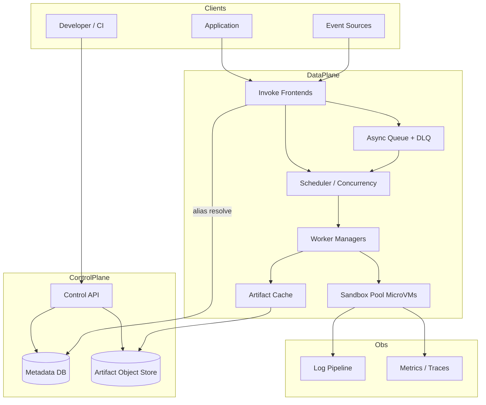
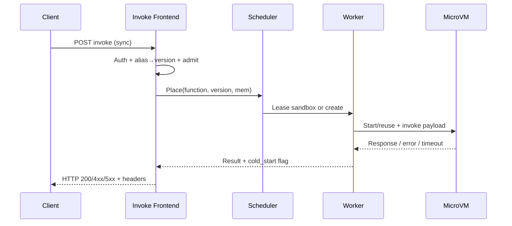

# System Design: Serverless Execution Platform

> **Focus areas:** Invoke API · Cold/warm starts · Isolation & sandboxing · Autoscaling · Multi-tenant fairness · Packaging & versions · Observability  
> **Style:** Core primitive design with progressive scale (10× → 100× → 1,000×)  
> **Product analogy:** AWS Lambda / Cloud Functions / Cloudflare Workers–class FaaS (control plane + data plane)

---

## Table of Contents

1. [Clarify Requirements (Interview Q&A)](#1-clarify-requirements-interview-qa)
2. [Back-of-the-Envelope Estimation](#2-back-of-the-envelope-estimation)
3. [High-Level Design](#3-high-level-design)
4. [Architecture Diagram](#4-architecture-diagram)
5. [Design Deep Dive](#5-design-deep-dive)
6. [Wrap-Up](#6-wrap-up)
7. [Deeper / Related Interview Questions](#7-deeper--related-interview-questions)

---

## 1. Clarify Requirements (Interview Q&A)

The goal of this phase is to **bound the problem**: what we build, what we defer, and at what scale we must succeed.

### 1.0 What this is / is not

| This is | This is not |
|---------|-------------|
| Multi-tenant **Function-as-a-Service**: upload code, invoke synchronously/async, pay for execution time | A general Kubernetes PaaS or long-running always-on service host |
| Short-lived, event-driven compute with **strong isolation** between tenants | Untrusted arbitrary VM rental (EC2) or full container orchestration product |
| Control plane (functions, versions, concurrency) + data plane (schedulers, workers, sandboxes) | A workflow/DAG engine (Step Functions)—may *invoke* us |
| Per-invocation billing, cold-start management, burst limits | Batch Spark/GPU training platform |

### 1.1 Functional Requirements

| # | Question to ask | Expected / typical interviewer answer | Design implication |
|---|-----------------|----------------------------------------|--------------------|
| F1 | Who are the users? | App developers + platform teams; event sources (HTTP, queues, schedules) | Public Invoke API + event adapters; IAM-style auth |
| F2 | Sync vs async invoke? | **Both**: sync HTTP-style with response; async fire-and-forget with retries | Two paths; async needs durable queue + DLQ |
| F3 | Runtimes? | Node, Python, Java, custom container (Phase 2); MVP: 2–3 managed runtimes | Runtime images + language-specific init; version pin |
| F4 | Package size / deps? | Zip ≤ 50–250 MB; layers/shared deps; later OCI images up to ~1–10 GB | Object storage for artifacts; local cache on workers |
| F5 | Isolation model? | Strong multi-tenant; untrusted customer code | MicroVM (Firecracker) or gVisor; never bare process sharing |
| F6 | Concurrency model? | Per-function reserved + account burst; scale-to-zero | Admission control + warm pool + scale-from-zero |
| F7 | Timeouts / resources? | Timeout 1s–15m; memory 128 MB–10 GB; CPU proportional to memory | Enforce cgroup/VM limits; kill on timeout |
| F8 | Versions & aliases? | Immutable versions; aliases (`prod` → v12); traffic shifting | Versioned artifacts; weighted routing for canary |
| F9 | Triggers? | HTTP gateway, SQS-like queue, cron, object-storage events | Pluggable event ingress; at-least-once for async |
| F10 | Secrets / env? | Env vars + secret refs; no secrets in logs | Inject at start; scrub logs; KMS-backed |
| F11 | VPC / private networking? | Phase 1.5: ENI/VPC attach for some functions | Cold-start cost rises; pool ENIs carefully |
| F12 | Idempotency? | Sync: client retries; Async: platform retries with backoff; optional idempotency key | Dedup window for async; document at-least-once |
| F13 | Observability? | Logs, metrics, traces per invoke; X-Ray-like | Sidecar/agent; structured log drain; invoke ID propagation |
| F14 | Regional vs global? | Regional data plane; control plane multi-region DR | Invoke stays in-region; no cross-region sync invoke |

**MVP functional scope (lock this with interviewer):**

1. Create/update/delete **functions**; publish immutable **versions**; point **aliases**.
2. Upload zip artifact to object storage; platform pulls to workers.
3. **Synchronous invoke** with JSON payload/response; hard timeout.
4. **Asynchronous invoke** with durable queue, retries, DLQ.
5. Scale-to-zero and warm-up; per-account concurrency limits.
6. Isolation via microVM or equivalent sandbox.
7. Logs + basic metrics (invocations, errors, duration, cold starts).
8. IAM auth on control/data plane APIs.

**Out of MVP (explicitly defer):**

- Custom container images / GPU functions
- Full VPC networking for every function
- Provisioned concurrency as a paid SKU (design hooks only)
- Multi-region active-active sync invoke
- Edge/Workers isolate model (V8) as primary—mention as alternative
- Step-functions-style orchestration UI

### 1.2 Non-Functional Requirements

| # | Question | Expected answer | Target |
|---|----------|-----------------|--------|
| N1 | Sync invoke latency (warm)? | Feels like RPC | p50 < 10–20ms overhead + user code; p99 < 100ms platform overhead |
| N2 | Cold start? | Acceptable but measured | Managed runtime p50 < 200–500ms; p99 < 1–2s (no VPC); with VPC higher |
| N3 | Availability? | Critical path for apps | 99.95% regional invoke; multi-AZ workers |
| N4 | Durability (async)? | No silent drop | Queue durable across AZ; retries until DLQ |
| N5 | Isolation / security? | Hostile tenants | Hardware virt or strong sandbox; no cross-tenant FS/net |
| N6 | Fairness? | No noisy neighbor | Per-tenant concurrency + CPU credits; load shed |
| N7 | Consistency (control plane)? | Read-your-writes for versions | Strong for function metadata in region |
| N8 | Cost? | Idle ≈ $0; pay per GB-s | Scale-to-zero; dense packing of warm sandboxes |

### 1.3 Cases (User Flows & Edge Cases)

**Happy paths**

1. Developer `CreateFunction` → upload artifact → `PublishVersion` → alias `prod` → sync invoke → 200 + payload.
2. API Gateway / queue event → async invoke → worker executes → success; metrics emit.
3. Burst traffic → warm pool exhausts → scale-out creates new sandboxes → within burst limit.
4. Alias canary: 5% traffic to v13, 95% to v12 → promote after metrics OK.
5. Function timeout → sandbox killed → caller gets `TimeoutError`; async → retry or DLQ per policy.

**Edge / failure cases**

| Case | Behavior |
|------|----------|
| Artifact too large / corrupt | Reject at upload or first pull; clear error |
| OOM in sandbox | Kill; report `OutOfMemory`; count against error rate |
| Infinite loop | Hard timeout + CPU throttle |
| Thundering herd cold starts | Admission queue; prefetch warm; provisioned concurrency later |
| Worker host death mid-invoke | Sync: fail caller; Async: redeliver (at-least-once) |
| Poison message | Max receive count → DLQ; alert |
| Tenant hits concurrency limit | `429` / `TooManyRequests`; retry-after |
| Secrets rotated mid-flight | New invokes see new secret; in-flight keep old env |
| Duplicate async delivery | User code should be idempotent; optional platform dedup key TTL |
| Control plane vs data plane lag | Invoke by **version ARN** (immutable); alias resolution cached with short TTL + version pin |

### 1.4 Scales (Progressive)

| Metric | Baseline | 10× | 100× | 1,000× |
|--------|----------|-----|------|--------|
| Functions (active) | 10K | 100K | 1M | 10M |
| Invokes / day | 100M | 1B | 10B | 100B |
| Peak sync QPS | 10K | 100K | 1M | 10M |
| Peak concurrent executions | 50K | 500K | 5M | 50M |
| Avg duration | 100ms | 100ms | 80–150ms | 80–150ms |
| Cold-start fraction | 5% | 3–5% | 1–3% | <1–2% (pools) |
| Artifact storage | 5 TB | 50 TB | 500 TB | 5 PB |
| Log volume / day | 2 TB | 20 TB | 200 TB | 2 PB |
| Worker hosts (order) | ~200 | ~2K | ~20K | ~200K |

**What each jump forces architecturally:**

- **10×:** Sharded invoke frontends; per-AZ worker fleets; Redis/local caches for alias→version; dedicated async queue clusters.
- **100×:** Cell / partition by account or function hash; regional placement; warm-pool predictors; log pipeline tiering.
- **1,000×:** Global control-plane federation; predictive pre-warming; microVM snapshotting (Firecracker snapstart-class); heavy multi-tenant packing; SLO-based admission.

### 1.5 Etc. (Constraints & Assumptions)

- **Single cloud region** for MVP data plane; multi-AZ.
- **Untrusted code** assumed; isolation is non-negotiable.
- **Billing** GB-second + request count; design metering hooks day 1.
- **Languages:** start with Node + Python managed runtimes.
- **Not building** the public HTTP API Gateway product—only Invoke + event adapters.

**Scope statement to repeat back:**

> Design a regional **serverless FaaS** platform: versioned functions, sync/async invoke, strong sandbox isolation, scale-to-zero with warm pools, concurrency limits, and progressive scale from ~10K peak QPS to 1000×—without becoming a general container PaaS.

---

## 2. Back-of-the-Envelope Estimation

### 2.1 Invoke QPS and concurrency

```text
Baseline: 100M invokes/day
≈ 100e6 / 86400 ≈ 1,157 QPS average
Peak factor 8–10× → ~10K peak QPS  ✓ matches table

Concurrent executions ≈ peak_QPS × avg_duration
≈ 10,000 × 0.1s = 1,000 average concurrency during peak second
With heavy-tail and burstiness, provision for 50K peak concurrent (headroom + long tails)
```

At **1,000×:** ~10M peak QPS; concurrent ≈ 10M × 0.1 = **1M** average in-flight at peak second; design for **tens of millions** concurrent with long-running tails.

### 2.2 Cold starts and warm pool

```text
Baseline cold-start fraction 5% of 10K QPS = 500 cold starts/s
If cold start creates a sandbox in ~300ms CPU-equivalent work:
  need careful pooling — cannot create 500 full VMs/s naively on one AZ without snapshot reuse

Warm pool target:
  keep W sandboxes per hot function / per account
  W sized by predicted QPS × duration × (1 + safety)
```

### 2.3 Bandwidth

```text
Avg payload in+out: 10 KB
Baseline peak: 10K QPS × 10 KB ≈ 100 MB/s ≈ 0.8 Gbps (trivial)
1,000×: ~800 Gbps regional → need many frontends + AZ distribution
```

Artifact pulls dominate cold path:

```text
Avg artifact 50 MB compressed; cold pulls cached after first
Cache hit goal > 99% on worker local SSD / node cache
```

### 2.4 Storage

```text
10K functions × 5 versions × 50 MB ≈ 2.5 TB artifacts (+ layers)
1,000×: 10M functions → multi-PB object store; lifecycle delete unreferenced versions
```

### 2.5 Logging

```text
1 KB log / invoke average
Baseline: 100M × 1 KB ≈ 100 GB/day raw (table used 2 TB with verbosity—use 0.1–2 KB range)
At 100B invokes/day: 100 TB–2 PB/day → must sample, tier, and charge for retention
```

### 2.6 Worker capacity

```text
Assume microVM: 256 MB function → ~1 GB host overhead packing → ~64 concurrent / 64 GB host
50K concurrent → ~800 hosts (order) + headroom → ~1–2K hosts baseline peak
Match table ~200 if denser packing / smaller avg memory—state assumptions explicitly
```

**Interview tip:** state memory mix (many 128–512 MB functions) to reconcile host counts.

### 2.7 Control-plane QPS

```text
Deploy/publish is rare vs invoke: ~0.01–0.1% of invoke rate
Metadata reads (alias resolve): every invoke → must be cached locally on frontend (TTL 1–5s + push invalidate)
```

---

## 3. High-Level Design

### 3.1 Core domain model

```text
Account / Tenant
  └── Function (name, runtime, role, timeout, memory, env, tags)
        ├── Version (immutable): code_digest, config_snapshot, created_at
        ├── Alias (mutable pointer): name → version (+ weights for canary)
        ├── ConcurrencyConfig: reserved, burst, per-function limit
        └── EventSourceMappings (queue, schedule, …)
```

**Invoke identity:** `arn:…:function:name:version|alias`  
Resolve alias → weighted version → artifact digest + config snapshot (immutable for that invoke).

**Execution state machine (async):**

```text
accepted → queued → running → succeeded
                           ├→ failed (retryable) → queued
                           └→ dead_lettered
```

Sync path: `accepted → running → response | error` (no durable queue).

### 3.2 APIs

| Method | Path | Purpose |
|--------|------|---------|
| POST | `/functions` | Create function |
| PUT | `/functions/{name}/code` | Upload / point artifact |
| POST | `/functions/{name}/versions` | Publish immutable version |
| POST | `/functions/{name}/aliases` | Create/update alias + weights |
| POST | `/functions/{name}/invocations` | Sync invoke (`InvocationType=RequestResponse`) |
| POST | `/functions/{name}/invocations?type=Event` | Async invoke |
| GET | `/functions/{name}` | Describe |
| PUT | `/functions/{name}/concurrency` | Reserved / limits |
| GET | `/invocations/{id}` | Async status (optional) |

**Sync invoke (conceptual):**

```http
POST /functions/order-handler/invocations
X-Amz-Invocation-Type: RequestResponse
Content-Type: application/json

{"order_id": "ord_123"}
```

Headers returned: `X-Executed-Version`, `X-Cold-Start: 0|1`, duration, billed GB-s.

**Idempotency (async):** optional `Idempotency-Key` stored TTL 24h keyed by account+function+key → result handle.

### 3.3 Component architecture

```text
Client / Event source
        │
        v
+------------------+     +-------------------+
| Invoke Frontend  |---->| Alias/Version     |
| (auth, admit,    |     | Cache + Control   |
|  route)          |     | Plane DB          |
+--------+---------+     +-------------------+
         |
    sync |  async
         |     \
         |      v
         |   +------+     +-----+
         |   | Queue|---->| DLQ |
         |   +--+---+     +-----+
         |      |
         v      v
+---------------------+
| Placement / Scheduler|
| (concurrency tokens)|
+----------+----------+
           |
           v
+---------------------+     +------------------+
| Worker Host Manager |---->| Artifact Cache   |
| + Sandbox Pool      |     | (local SSD / CDN)|
+----------+----------+     +------------------+
           |
           v
     MicroVM / gVisor sandbox → user code
           |
           v
     Log / Metric / Trace agents → observability pipeline
```

### 3.4 Isolation choice

| Option | Pros | Cons | Deal-breaker |
|--------|------|------|--------------|
| **Process + cgroup** | Fast start | Weak isolation | **Hostile multi-tenant** |
| **gVisor / user-space kernel** | Better isolation, denser | Compat edges | OK for many workloads |
| **MicroVM (Firecracker)** | Hardware virt boundary | Slightly heavier | **Preferred for untrusted** |
| **V8 isolates** | Ultra-fast cold start | Not general native runtimes | Different product (Workers) |

**Choice:** MicroVM for general-purpose runtimes; mention Workers-style isolates as a parallel SKU.

### 3.5 Cold start pipeline

1. Admit invoke → resolve version → check concurrency token.
2. Prefer **warm sandbox** matching (account, function version, memory).
3. Else **restore from snapshot** (Phase 2) or **boot runtime image** + mount artifact.
4. Inject credentials/env (short-lived tokens).
5. Invoke handler; capture response; freeze or destroy per policy.
6. Emit metrics: `ColdStart=true`, init duration vs invoke duration.

**Warm pool policies:**

- Keep N warm per alias for top-K hot functions (predictive).
- Idle TTL (e.g. 5–45 min) then reclaim.
- **Reserved concurrency** pins capacity; **provisioned concurrency** pre-inits (paid).

### 3.6 Concurrency & fairness

```text
Account burst limit B
Function reserved R_f (sum R_f ≤ account reserved pool)
Function max M_f

On admit:
  if in_flight_f >= M_f → reject
  if in_flight_account >= B → reject
  else acquire token (Redis / local sharded counters)
```

**Sharded counters:** per-frontend local tokens with periodic sync, or Redis cluster keyed by `account_id` / `function_id`. At 1,000×, use **cell-local** concurrency (account pinned to cell).

### 3.7 Async delivery

- Durable queue (Kafka / SQS-like) partitioned by `function_arn` or `account_id`.
- Visibility timeout ≥ function timeout + skew.
- Max receive count → DLQ.
- At-least-once: document duplicate invokes.

### 3.8 Option analysis & trade-offs

#### A. Placement

| Option | Pros | Cons | Deal-breaker |
|--------|------|------|--------------|
| Random worker | Simple | Bad cache locality | Artifact thrash |
| **Consistent hash(function)** | Artifact + warm locality | Hot functions hotspot | Mitigate with function×salt shards |
| Bin-pack by free mem | Dense | Slow scheduling | OK with approx scores |

**Choice:** hash(function_id, salt) → worker set; salt expands hot keys.

#### B. Metadata store

| Option | Pros | Cons | Deal-breaker |
|--------|------|------|--------------|
| **Postgres** | Strong version publish TX | Scale control plane | OK with cache on invoke path |
| DynamoDB | Scale | Multi-item TX patterns | Fine for AWS-like |
| etcd | Watch | Not for huge tenant metadata | Wrong primary store |

**Choice:** Postgres/Dynamo for control plane; **never** hit DB on every invoke—frontend cache + pub/sub invalidate.

#### C. Sync path buffering

Do **not** put sync invokes on Kafka (extra latency). Sync → scheduler → worker RPC/gRPC stream. Async → queue.

---

## 4. Architecture Diagram





---

## 5. Design Deep Dive

### 5.1 Reliability

**Data loss prevention (async)**

- Persist message before ACK to producer.
- Visibility timeout + heartbeat for long invokes.
- Poison → DLQ with payload + request ID preserved.

**Retries & idempotency**

- Sync: client retries; platform returns deterministic errors (`429`, `5xx`).
- Async: exponential backoff with jitter; optional idempotency key.
- User responsibility for handler idempotency—platform provides `request_id` / `attempt`.

**Rate limits & backpressure**

- Per-account/function concurrency and TPS limits.
- When worker pool saturated: fail fast sync; slow drain async (queue depth alerts).
- Load shed low-priority tenants first (fairness weights).

**Zonal failure**

- Worker fleets in ≥3 AZs; queue replicated; frontends anycast/DNS.
- Function data plane continues if one AZ lost; capacity N+1.

**Invoke exactly-once?**  
Do not promise. Promise **at-least-once** async and **at-most-one in-flight per token** for concurrency—not exactly-once execution.

### 5.2 Scalability

**Scale up/down**

- Horizontal invoke frontends (stateless).
- Worker autoscaler: queue depth, concurrent executions, CPU, warm-pool miss rate.
- Scale-to-zero: reclaim idle sandboxes; keep tiny control capacity.

**Sharding**

- **Cell architecture** at 100×+: account → cell; all concurrency/queues/workers local.
- Hot function: shard by `hash(execution_id)` across worker subsets.

**Storage tiers**

- Artifacts: hot SSD cache on workers; origin object store; lifecycle old versions to infrequent access.
- Logs: hot search 7–30 days; cold object/Parquet.

**Parallelization**

- Event batching for async (process N messages per sandbox when safe)—opt-in; default 1 for isolation simplicity.

**Progressive scale mapping**

| Scale | Change |
|-------|--------|
| 10× | Cache alias aggressively; multi-AZ queues; predictive warm for top functions |
| 100× | Cells; per-cell concurrency; snapshot boot |
| 1,000× | Global control federation; ML warm pools; extreme multi-tenant density |

### 5.3 Maintainability

**Ops**

- Runtime image pipelines (CVE patch → rolling worker AMI/image).
- Sandbox break-glass kill switches per function/account.
- Dark launch new isolation versions.

**Observability**

- Metrics: `Invocations`, `Errors`, `Throttles`, `Duration`, `InitDuration`, `ConcurrentExecutions`, `ColdStartRate`.
- Trace: frontend span → worker → sandbox handler.
- Logs: `{tenant, function, version, request_id}` mandatory fields; PII scrubbing.

**Migrations**

- Version immutability avoids config drift mid-flight.
- Alias flip is the migration tool; weighted traffic for canaries.
- Worker host drains: no new sandboxes → wait in-flight → terminate.

**Multi-tenant**

- Hard quota + soft fairness.
- No shared writable FS across tenants.
- Network egress allowlists / NAT metering.

---

## 6. Wrap-Up

### Decision summary

| Decision | Choice | Why |
|----------|--------|-----|
| Isolation | MicroVM | Hostile multi-tenant boundary |
| Sync path | Frontend → scheduler → worker RPC | Avoid queue latency |
| Async path | Durable queue + DLQ | Retries without client |
| Metadata | Control DB + invoke-path cache | RY W publishes; fast invoke |
| Concurrency | Token admit per account/function | Noisy-neighbor control |
| Scale model | Cells at large scale | Blast-radius + local limits |
| Cold start | Warm pool + later snapshots | Latency SLO vs cost |

### Phased rollout

1. **MVP:** zip + 2 runtimes, sync/async, microVM, basic warm pool, logs/metrics.
2. **Phase 1.5:** aliases with weights, provisioned concurrency, VPC attach, DLQ tooling.
3. **Phase 2:** container images, snapshot restore, cell architecture, predictive warming.
4. **Phase 3:** edge isolate SKU, multi-region DR for control plane, advanced fairness.

---

## 7. Deeper / Related Interview Questions

**Q1. Why not run all functions as plain Docker containers on Kubernetes?**  
A: K8s is a great substrate for *workers*, but per-invoke pod start is too slow/expensive; multi-tenant isolation and scale-to-zero economics need a FaaS control plane, sandbox pooling, and invoke admission—not raw Deployment objects per customer function.

**Q2. How do you prevent one tenant from exhausting the AZ?**  
A: Per-account concurrency and burst TPS, cell isolation, fair queueing on schedulers, and host-level packing limits. Also separate “reserved” capacity SKUs from opportunistic burst.

**Q3. Where is the source of truth for “which code runs”?**  
A: Immutable **version** records with content digest. Aliases are mutable pointers. Invoke resolves alias → version once and pins that version for the execution.

**Q4. How does alias caching not serve stale code forever?**  
A: Short TTL + pub/sub invalidation on alias update. For safety, publish is create-only for versions; rollback = point alias to older version.

**Q5. Sync invoke through Kafka—why is that usually wrong?**  
A: Adds disk/replication latency and backpressure complexity to an interactive path. Use Kafka/SQS for async; sync should be RPC to a running/warm sandbox.

**Q6. How do you bill accurately?**  
A: Meter `max(memory_configured) × billed_duration_ms` with minimum quantum (e.g. 1ms). Emit usage events with `request_id` for idempotent billing ledger ingest.

**Q7. What breaks with VPC-attached functions?**  
A: ENI attachment latency dominates cold start; mitigate with ENI pools / precreations and hyperplane-style sharing. Still call out higher p99 cold starts.

**Q8. How do microVM snapshots help?**  
A: Snapshot after runtime init (and optionally after static init) restores memory/CPU state in tens of ms instead of full boot—huge cold-start win for Java/Node heavy init.

**Q9. Exactly-once async processing?**  
A: Platform gives at-least-once. Exactly-once *effects* require idempotency keys in user storage or transactional outbox in the handler’s own DB.

**Q10. How do you handle 10K concurrent cold starts after a deploy?**  
A: Stagger alias traffic shift; provisioned concurrency before flip; rate-limit init; reuse layers; pre-spread artifacts to worker caches.

**Q11. Sticky sessions for sandboxes?**  
A: Stickiness is for warm reuse locality (function→worker set), not for client session affinity. Frontends remain mostly stateless.

**Q12. How are secrets injected safely?**  
A: Resolve at sandbox start via short-lived tokens; never bake into artifact; redact from logs; rotate → only new sandboxes.

**Q13. What is the difference between throttle and error?**  
A: Throttle = admission reject (`429`) before execution; error = user code / timeout / OOM after admit. SLOs and alarms must split them.

**Q14. Design a fair multi-tenant scheduler score.**  
A: `score = remaining_quota_weight × locality_bonus × (1 - host_load) × priority_class`. Avoid pure FIFO under overload.

**Q15. How do you test isolation?**  
A: Red-team suite: `/proc` escapes, noisy neighbor CPU, metadata service SSRF, shared disk reads—block before GA.

**Q16. Java cold starts are terrible—options?**  
A: Provisioned concurrency, snapshots, lighter runtimes, tiered compilation hints, or move steady traffic off FaaS.

**Q17. Global invoke anycast?**  
A: Data plane is regional for latency and data gravity. Global DNS can route to nearest region, but state/queues are regional; don’t pretend seamless cross-region sync without replication design.

**Q18. How do event source mappings avoid double processing on rebalance?**  
A: Cursor/checkpoint per shard with lease; visibility timeouts; handler idempotency. Same as consumer-group semantics.

**Q19. What metrics prove warm-pool health?**  
A: `WarmPoolHitRatio`, `InitDuration p99`, `OverprovisionedSandboxes`, cost of idle GB-s vs latency SLO.

**Q20. Deal-breaker: shared process multi-tenancy for untrusted code?**  
A: Yes—hostile tenants make process isolation insufficient. Require microVM/gVisor/isolate model with clear threat model.

**Q21. How does canary for functions differ from service canary?**  
A: Alias weighted routing per invoke; instant rollback by weight flip; no need to drain long-lived pods if sandboxes are short-lived—still watch error/latency/throttle metrics.

**Q22. Memory vs CPU allocation?**  
A: Classic model: CPU proportional to configured memory (simpler packing). Alternative: explicit vCPU—harder UX and packing.

**Q23. Local disk in sandbox?**  
A: Ephemeral scratch with size cap; wiped on freeze/destroy; no durability guarantees—push state to external stores.

**Q24. How do you cap log amplification attacks?**  
A: Per-invoke and per-second log byte quotas; drop with metric `LogsThrottled`; charge retention.

**Q25. Why pin account to a cell at large scale?**  
A: Concurrency counters, queues, and noisy-neighbor blast radius stay local; cross-cell invoke is rare and explicit.

**Q26. Container image functions—extra movers?**  
A: Image registry, larger caches, longer pulls, vulnerability scanning, and different snapshot strategy—Phase 2 for a reason.

**Q27. How to support WebSocket long-lived connections?**  
A: Poor fit for pure FaaS; use API Gateway connection table + short invokes on messages, or recommend always-on compute.

**Q28. Backpressure when observability pipeline dies?**  
A: Local disk buffer with drop-oldest; never block invoke path indefinitely on log ship; mark `PartialLogs`.

**Q29. What is a good MVP non-goal to say out loud?**  
A: “We are not building a general workflow engine or Kubernetes for end users—we invoke functions.”

**Q30. How do you migrate a function’s runtime version safely?**  
A: Publish new version with new runtime → weighted alias → compare error/duration → promote. Never mutate old version’s runtime in place.

---

*End of serverless execution platform design.*
