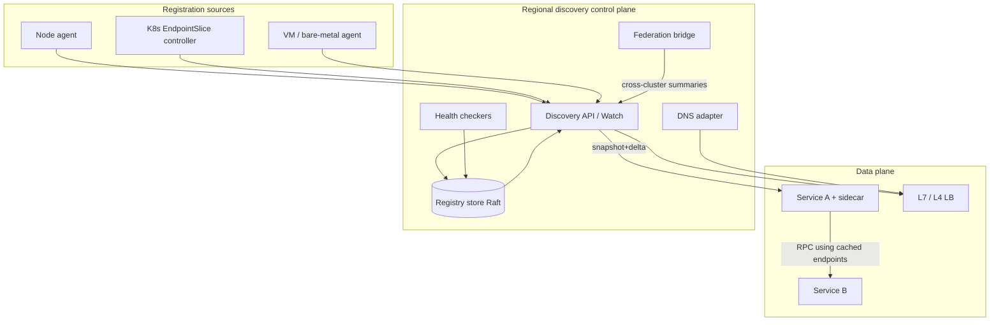
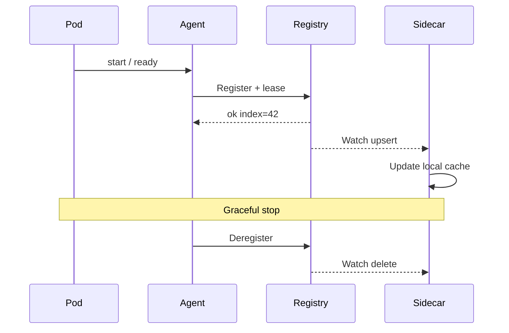

# System Design: Service Discovery

> **Focus areas:** Registry · Health · Client vs server discovery · Push vs pull · DNS vs control plane · Consistency under partition · Multi-cluster / multi-region · Hot path latency  
> **Style:** End-to-end platform design with progressive scale (10× → 100× → 1,000×)  
> **Quality bar:** Correctness under stale membership beats clever routing; deal-breakers explicit; discovery must not become a global SPOF for request path  
> **Interview theme:** Senior / Staff — **service discovery & membership** as a distributed systems primitive

---

## Table of Contents

1. [Clarify Requirements (Interview Q&A)](#1-clarify-requirements-interview-qa)
2. [Back-of-the-Envelope Estimation](#2-back-of-the-envelope-estimation)
3. [High-Level Design](#3-high-level-design)
4. [Architecture Diagram](#4-architecture-diagram)
5. [Design Deep Dive](#5-design-deep-dive)
6. [Wrap-Up](#6-wrap-up)
7. [Deeper / Related Interview Questions](#7-deeper--related-interview-questions)

---

## 1. Clarify Requirements (Interview Q&A)

Goal: design a **service discovery** system so clients (or proxies) can find healthy instances of named services under churn, failure, and multi-region scale—without turning the registry into a request-path SPOF.

### 1.0 What this is / is not

| Dimension | This doc | Not this |
|-----------|----------|----------|
| Job | Membership + endpoint resolution + health signaling | Full service mesh (mTLS, retries, traffic split) alone |
| Truth | Which instances exist and are routable *now* | Application config / feature flags (related, separate) |
| Plane | Control plane for endpoints; data plane consumes views | L7 business API gateway product |
| Client | Sidecars, libraries, DNS resolvers, Envoy xDS | End-user mobile SDKs resolving product APIs |

### 1.1 Functional Requirements

| # | Question to ask | Expected / typical interviewer answer | Design implication |
|---|-----------------|----------------------------------------|--------------------|
| F1 | Who registers instances? | Workloads self-register *or* orchestrator (K8s) injects endpoints | Dual registration adapters; identity from platform, not free-form |
| F2 | Discovery model? | Both **client-side** (library/sidecar) and **server-side** (LB/DNS) must be supported | Publish catalog; multiple consumers of same SoT |
| F3 | What is a “service”? | Logical name + namespace/env + optional cluster/region | Hierarchical naming: `ns/svc` + locality labels |
| F4 | Endpoint payload? | IP/port, protocol, weight, zone, version, metadata | Versioned endpoint schema; forward-compatible fields |
| F5 | Health model? | Active checks *and* passive (outlier) + TTL heartbeats | Separate liveness (in registry) from readiness (serve traffic) |
| F6 | Consistency? | Prefer availability of *some* endpoints over perfect global sync | Eventual membership + bounded staleness SLOs |
| F7 | Watch / push? | Clients need push watches; polling alone too slow at scale | Long-poll / streaming watch + snapshot+delta |
| F8 | DNS required? | Yes for legacy / off-mesh clients | DNS adapter over same catalog; short TTLs + negative caching care |
| F9 | Multi-cluster? | Many clusters; cross-cluster discovery optional Phase 1.5 | Per-cluster registry + federation / global directory |
| F10 | AuthZ on register? | Only authenticated agents; prevent spoofing endpoints | mTLS / SPIFFE; signed registration tokens |
| F11 | Deregister on crash? | Soft fail via heartbeat expiry; hard deregister on graceful stop | Lease/TTL on every instance record |
| F12 | Traffic subsets? | Canary by version label; zone-aware routing | Labels + locality-aware selectors, not separate registries |
| F13 | Scale of churn? | Rolling deploys: thousands of register/deregister/min | Write path batching; watch coalescing |
| F14 | Offline / partition? | Clients must keep last-known-good endpoints | Local cache mandatory; fail-open vs fail-closed policy |

**MVP functional scope:**

1. Register / renew / deregister instance with lease TTL.
2. Resolve service → healthy endpoints (filter by namespace, labels).
3. Watch API: snapshot + incremental updates.
4. Health: heartbeat + optional active HTTP/TCP check.
5. Client library or sidecar with local cache + refresh.
6. DNS A/SRV adapter for selected services.
7. AuthN of agents; audit of registrations.
8. Basic UI/CLI: list services, instances, health reason.

**Out of MVP (explicitly defer):**

- Full Envoy xDS control plane (EDS can be adapter later)
- Global anycast / multi-cloud active-active write registry
- Automatic traffic shifting / weighted canary controller (consume labels only)
- Service graph / dependency discovery product
- Perfect CAP strong consistency for all readers worldwide

### 1.2 Non-Functional Requirements

| # | Question | Expected answer | Target |
|---|----------|-----------------|--------|
| N1 | Resolve latency (cached)? | Hot path local | p99 < 1ms in-process; network resolve p99 < 20ms |
| N2 | Watch propagation? | Deploy visibility | p99 < 2–5s regionally for membership change |
| N3 | Registry availability? | Control plane critical | 99.99% read path; writes 99.9% |
| N4 | Durability? | Membership is soft state | Leases expire; durable catalog of *services* yes, instances ephemeral |
| N5 | Consistency | Eventual OK | Monotonic watches preferred; no silent delete without notify |
| N6 | Multi-region | Prefer regional registries | Cross-region federation for global names optional |
| N7 | Security | No endpoint spoofing | AuthZ + namespace isolation; secrets not in metadata |
| N8 | Cost | Registry cheap vs mesh data plane | CPU dominated by watches/heartbeats; bound fanout |
| N9 | Blast radius | Registry outage ≠ total outage | Clients serve from cache; degrade gracefully |

### 1.3 Cases (User Flows & Edge Cases)

**Happy paths**

1. Pod starts → agent registers with lease → appears in resolve/watch → LB routes.
2. Rolling deploy → new version registers → old deregisters / lease expires → watchers update.
3. Instance fails health → marked unhealthy → removed from ready set (still listed as unhealthy optionally).
4. Client restart → loads disk/memory cache → resolves immediately → refreshes in background.
5. DNS client queries `payments.svc.local` → short-TTL A records from healthy set.

**Edge / failure cases**

| Case | Behavior |
|------|----------|
| Heartbeat missed (GC pause) | Grace period then expire; avoid flapping with hysteresis |
| Split brain two registries | Regional independence; cross-region prefer local endpoints |
| Stale client cache after mass redeploy | Soft max age + periodic full reconcile; force refresh on empty healthy set |
| Thundering herd on registry recovery | Jittered reconnect; watch resume from index |
| Malicious register of victim IP | Require platform identity; reject foreign namespaces |
| DNS TTL too long | Cap TTL (e.g. 5–15s); document negative cache pitfalls |
| Health check false positive | Multi-probe; zone isolation; require N failures |
| Registry leader election flap | Followers serve reads; leases still advance via quorum |
| Empty healthy set | Fail closed for payments; fail open with stale for best-effort (policy) |
| Metadata explosion | Cap size; reject oversized labels |

### 1.4 Scales (Progressive)

| Metric | Baseline | 10× | 100× | 1,000× |
|--------|----------|-----|------|--------|
| Services | 500 | 5K | 50K | 500K |
| Instances (endpoints) | 10K | 100K | 1M | 10M |
| Clusters / cells | 2 | 10 | 50 | 200+ |
| Heartbeats / s | 2K | 20K | 200K | 2M |
| Resolve QPS (uncached) | 1K | 10K | 50K | must be near-zero uncached |
| Active watches | 5K | 50K | 500K | 5M |
| Membership events / s peak | 50 | 500 | 5K | 50K |
| Regions | 1–2 | 3 | 5+ | global |

**What each jump forces:**

- **10×:** Move from single Consul/etcd box to clustered store; separate read replicas / watch fanout tier.
- **100×:** Per-cluster registry; global name → cluster directory; push deltas not full dumps; DNS caching layers.
- **1,000×:** Hierarchical federation; sharded catalog by namespace; watch multiplexing; regional independence as first-class; avoid global synchronous heartbeats.

### 1.5 Etc. (Constraints & Assumptions)

- **K8s-native vs multi-runtime?** Both: EndpointSlices + VM/agent registration.
- **Service mesh present?** Optional consumer; discovery SoT remains.
- **DNS-only OK?** No—DNS alone lacks rich health/metadata and pushes.
- **Strong consistency required?** Only within a region for lease fencing; global eventual.

**Scope statement to repeat back:**

> Design a multi-tenant **service discovery** control plane: lease-based registration, health-aware resolution, push watches, DNS adapter, and mandatory client caching—scaled from ~10K to ~10M endpoints—optimized so registry failure degrades routing from last-known-good rather than blackholing the fleet.

---

## 2. Back-of-the-Envelope Estimation

### 2.1 Heartbeat / lease traffic

Assume lease TTL **10s**, renew every **3s**, 10K instances baseline:

```text
Renew QPS ≈ 10,000 / 3 ≈ 3,300/s
Payload ~200 B → ~0.7 MB/s ingress (trivial)

1,000× (10M instances): 10M / 3 ≈ 3.3M renew/s
→ Must shard by service/namespace; cannot hit one etcd
→ Push renewals to local agents aggregated per node (1 renew per node × pods)
```

**Node-level aggregation** (critical optimization):

```text
100 pods/node, 100K nodes at 1,000×
Node agent renews once / 3s → ~33K renew/s globally vs 3.3M
```

### 2.2 Watch fanout

```text
Baseline: 5K watchers × 50 events/s × 500 B ≈ 125 MB/s worst if naive broadcast
Coalesce: per-service watch; delta only; server-side filter by namespace
Target: events only to interested watchers
```

### 2.3 Catalog storage

```text
Endpoint record ~300–500 B
10K × 500 B ≈ 5 MB (+ indexes ~20 MB)
10M × 500 B ≈ 5 GB (+ indexes/replication 20–50 GB)
Fits memory-first regional stores easily if sharded
```

### 2.4 Resolve path (anti-pattern)

```text
If every RPC does remote Resolve:
1M QPS × resolve = death

Correct: local cache hit ≈ 100%; remote only on miss / watch update / TTL reconcile
Uncached resolve budget: <0.1% of RPC QPS
```

### 2.5 DNS load

```text
Short TTL 10s, 10K clients, 100 names hot
Query rate ≈ 10K × 100 / 10 = 100K QPS DNS → need anycast + cache
Prefer stub resolver cache on every host
```

### 2.6 Memory (client sidecar)

```text
Full mesh catalog rare; typically subset
5K endpoints × 500 B ≈ 2.5 MB + indexes
Bound memory; subscribe only to needed services
```

---

## 3. High-Level Design

### 3.1 Core abstractions

```text
Namespace / Environment
  └── Service (name, ports, selectors)
        └── Instance / Endpoint
              ├── address (IP/port or hostname)
              ├── lease_id + expire_at
              ├── health: unknown | healthy | unhealthy
              ├── locality: region, zone, node
              ├── labels: version, canary, shard
              └── metadata (size-capped)
```

**Service** is durable config. **Instance** is ephemeral soft state under lease.

### 3.2 APIs

| Method | Path | Purpose |
|--------|------|---------|
| PUT | `/v1/register` | Upsert instance + start/renew lease |
| POST | `/v1/renew` | Batch renew leases |
| DELETE | `/v1/deregister` | Graceful remove |
| GET | `/v1/resolve?service=` | Point-in-time healthy endpoints |
| GET | `/v1/watch?service=` | Stream snapshot+deltas (`index`) |
| GET | `/v1/services` | Catalog list |
| GET | `/dns-query` | Internal DNS adapter (or bind :53) |

**Register body (sketch):**

```json
{
  "service": "payments",
  "namespace": "prod",
  "instance_id": "i-9f3a",
  "address": {"ip": "10.1.2.3", "port": 8080},
  "labels": {"version": "1.8.2", "zone": "us-east-1a"},
  "ttl_seconds": 10,
  "check": {"http": "/healthz", "interval_ms": 5000}
}
```

**Watch protocol:** initial snapshot with `index=N`; then events `{type: upsert|delete, index, endpoint}`; client resumes with `index>N`.

### 3.3 Architecture choices

| Option | Pros | Cons | When |
|--------|------|------|------|
| **Client-side discovery** | Low latency; rich policy | Library sprawl; language support | Polyglot + mesh sidecars |
| **Server-side (LB)** | Simple clients | LB becomes discovery consumer; less app control | Classic 3-tier |
| **DNS-only** | Universal | TTL lag; no push; poor metadata | Legacy only |
| **xDS / mesh** | Unified data plane | Heavy; couple to Envoy | Mesh-first orgs |

**Recommended MVP:** regional **Registry Service** (Raft/etcd-backed or equivalent) + **Agent** on each node + **Client SDK/sidecar** with cache + **DNS adapter**. Mesh EDS optional consumer.

### 3.4 Consistency & leases

- Registration write goes to **quorum** in the regional cluster.
- Lease expiry is **monotonic** via cluster clock / logical time—not wall clock alone on clients.
- On partition: minority cannot extend leases (fencing); majority keeps serving.
- Readers may be slightly stale; watches are **monotonic per stream**.

### 3.5 Health pipeline

```text
Heartbeat (lease)     → existence
Active check (optional) → readiness
Passive outlier (LB)  → temporary eject (data plane), may feedback
```

Do **not** conflate “process up” with “ready for traffic.” Ready set = lease valid ∧ health pass ∧ not drained.

### 3.6 Trade-offs & deal-breakers

| Decision | Trade-off | Deal-breaker if wrong |
|----------|-----------|------------------------|
| No client cache | Registry on every request | Total outage when registry blips |
| Infinite DNS TTL | Less query load | Route to dead pods for minutes |
| Global single registry | Simple mental model | Cross-region latency + blast radius |
| Strong sync all regions | “Correct” membership | Availability collapse under WAN partition |
| Trust any registrant | Easy demo | Endpoint hijack / SSRF pivot |

### 3.7 Why not “just Kubernetes DNS”?

K8s DNS + EndpointSlices solve **in-cluster** well. Gaps: multi-cluster federation, VMs, non-K8s, rich watches for non-mesh clients, cross-cloud. Build discovery that **ingests** K8s as a source of truth adapter.

---

## 4. Architecture Diagram





---

## 5. Design Deep Dive

### 5.1 Reliability

**Data loss prevention**

- Instances are leases: loss of registry state → instances re-register (agents retry).
- Durable: service definitions, auth policies, federation links.
- Persist watch indexes so clients can resume without full snap when possible.

**Retries & idempotency**

- `Register` is upsert by `(namespace, service, instance_id)`.
- Renewals carry `lease_id`; mismatched lease → `410` re-register.
- Agents use jittered exponential backoff on outage.

**Rate limits & backpressure**

- Per-namespace register rate limits.
- Watch subscription caps per client identity.
- On overload: shed new watches first; keep renewals for existing leases; publish “stale mode” metric.

**Failure modes**

| Failure | Mitigation |
|---------|------------|
| Registry AZ down | Multi-AZ Raft; reads on followers |
| Agent crash | Lease expiry removes endpoints |
| Network partition client↔registry | Serve cache; mark `discovery_stale=true` |
| Health checker storm | Sample checks; prefer agent-local checks |
| Poison watch update | Schema validation; version gate |

**Anti-flapping:** require `N` failed checks or `grace` on lease; dampen re-adds.

### 5.2 Scalability

**Scale up/down**

- Stateless Discovery API tier horizontally.
- Registry store: start 3–5 Raft; at 100× **shard by namespace hash**.
- Health checkers: sharded ownership of instance IDs (consistent hash).

**Locality**

- Prefer same-zone endpoints in client LB policy.
- Regional registries; federation ships **summaries** (service exists in cluster X), not every heartbeat cross-region.

**Parallelization**

- Batch renew from node agent.
- Coalesce watch events per service (100ms window) under churn.

**Progressive architecture**

| Scale | Pattern |
|-------|---------|
| Baseline | Single regional cluster + agents |
| 10× | Read replicas / watch brokers |
| 100× | Namespace shards + per-cluster SoT |
| 1,000× | Hierarchical federation; push compact bloom/version vectors |

### 5.3 Maintainability

**Ops**

- SLOs: renew success, watch lag p99, resolve cache hit ratio, empty-ready-set rate.
- Break-glass: freeze membership (no expiry) during incident carefully documented.
- Drain API: mark instance `draining` before deregister for connection shedding.

**Observability**

- Trace `index` through watch paths.
- Per-service ready count dashboards; alert on ready=0 with demand.
- Audit log: who registered what address.

**Migrations**

- Endpoint schema v1→v2 with unknown-field ignore.
- Dual-run DNS and watch consumers during mesh adoption.

**Multi-tenant**

- Namespace isolation; quota on instances and watches.
- No cross-tenant resolve without explicit export policy.

---

## 6. Wrap-Up

### Decision summary

1. **Ephemeral instances + leases**, durable service catalog.
2. **Push watches + mandatory client cache**; remote resolve is rare.
3. **Regional registry** with optional federation—not one global heartbeat plane.
4. **Health ≠ liveness**; ready set is explicit.
5. **AuthN/Z on registration** to prevent spoofing.
6. **DNS as adapter**, not SoT.
7. **Fail with last-known-good** under control-plane loss (policy-dependent).

### Phased rollout

| Phase | Deliver |
|-------|---------|
| MVP | Register/renew/watch/resolve + agent + cache + DNS for pilot NS |
| 1.5 | K8s EndpointSlice ingest; zone-aware client LB hints |
| 2 | Namespace sharding; watch broker tier |
| 3 | Multi-cluster federation; mesh EDS exporter |

---

## 7. Deeper / Related Interview Questions

**Q1. Client-side vs server-side discovery—which do you pick?**  
A: Prefer client/sidecar for rich locality and avoiding LB as chokepoint; keep server-side LB as a consumer of the same catalog for simple clients. Dual consumption beats dual SoT.

**Q2. Why are leases mandatory?**  
A: Crashes don’t deregister cleanly. Without TTL, dead endpoints linger forever. Leases bound staleness; grace handles GC pauses.

**Q3. How do you prevent thundering herds when the registry returns?**  
A: Jittered reconnect, session resume tokens, rate-limited full snapshots, preferential delta resume from `index`.

**Q4. Is etcd/ZooKeeper enough?**  
A: Fine for baseline; watch fanout and multi-tenant scale usually need an API tier and sharding in front—raw etcd watches to 5M clients won’t fly.

**Q5. How does this differ from load balancing?**  
A: Discovery answers “who exists/ready?”; LB answers “whom do I pick *this request*?” Outlier ejection is LB; membership is discovery.

**Q6. DNS TTL 60s vs 1s?**  
A: 60s risks long blackholes; 1s melts resolvers. Typical: 5–15s + client-side app cache with watches for modern clients.

**Q7. What consistency do watches need?**  
A: Per-stream monotonicity (no reappearing deleted without upsert). Global linearizability across regions is unnecessary and harmful.

**Q8. How do you handle canaries?**  
A: Same service name; `version` label; client/mesh subset routing. Don’t create `payments-canary` as a forever parallel service unless intentional.

**Q9. Registry outage—fail open or closed?**  
A: Product policy. Payments: maybe fail closed if cache older than X. Read-mostly: fail open on stale. Emit loud `discovery_stale`.

**Q10. How do you stop endpoint spoofing?**  
A: Platform identity (SPIFFE), bind registration to allocatable IPs on the node, admission webhooks, deny arbitrary remote IPs.

**Q11. Active vs passive health checks?**  
A: Active from registry/agent for readiness; passive outlier in data plane for fast local eject. Feedback loop optional and careful (avoid cascade).

**Q12. Multi-region service name collision?**  
A: Namespaces + region affinity; global FQDN maps to regional subsets via federation directory.

**Q13. What goes wrong with naive Consul-style gossip at 1,000×?**  
A: Gossip bandwidth and convergence time; better hierarchical membership (SWIM locally, summaries upward).

**Q14. Should resolve return unhealthy instances?**  
A: Optional `include_unhealthy` for debug; default ready-only. Ops UIs need full set.

**Q15. How do you test discovery?**  
A: Chaos: kill registry majority, partition agent, flap health, verify clients don’t thundering-herd and don’t sticky to dead pods beyond SLO.

**Q16. Relation to leader election?**  
A: Related primitive; often same coordination store. Don’t overload discovery registry with app locks without isolation.

**Q17. gRPC name resolver integration?**  
A: Implement resolver that subscribes to watch; update picker addresses; respect backoff.

**Q18. What metrics prove it’s healthy?**  
A: Cache hit >99.9%, watch lag p99 <5s, renew error rate, ready=0 pages, stale-cache age histogram.

**Q19. Why not store instances in MySQL?**  
A: Lease expiry + watch fanout + low-latency renewals fit ZK/etcd/raft-KV or specialized membership store; RDBMS possible with NOTIFY but awkward at heartbeat rates.

**Q20. Cross-cluster east-west?**  
A: Export policy + gateway addresses or ClusterIP equivalents; don’t flat-routable all pods globally without network design.

**Q21. How big can metadata be?**  
A: Cap (e.g. 4KB). Large blobs belong in config service, not discovery.

**Q22. Idempotent deregister?**  
A: DELETE by instance_id returns 404/204 both OK; watches must be delete-idempotent.

**Q23. Time sync issues with TTL?**  
A: Expiry decided by registry cluster time; clients only renew. Never trust client `expire_at` alone.

**Q24. Can discovery replace config management?**  
A: No. Endpoints ≠ app config. Separate systems; sometimes co-located products but different SLOs.

**Q25. Staff follow-up: design watch broker**  
A: API nodes subscribe once to shard store; fan out to N clients with filtering; spill to disk slow consumers; disconnect slow clients to protect cluster.

**Q26. IPv6 / dual stack?**  
A: Endpoint can carry multiple addresses; clients prefer family by policy.

**Q27. Weighted instances?**  
A: Weight in endpoint; LB consumes. Discovery only transports weight updates via watch.

**Q28. Empty service after deploy bug—what happens?**  
A: Alert; clients keep stale if policy allows; deployment gates on “ready >= min” before killing old RS.

**Q29. Security of DNS adapter?**  
A: Internal zones only; no public exposure of internal IPs; split-horizon DNS.

**Q30. Biggest senior red flag in interviews?**  
A: Putting remote discovery on the RPC hot path with no cache—instant veto.

---

*End of service discovery system design.*

## Appendix — Deep dive notes for Service discovery

### Hardest invariants
- Define the correctness property that must not break under retries, partial failures, or overload.
- Define multi-tenant isolation boundaries if applicable.
- Define delete/TTL/privacy semantics across primary + cache + search + logs.

### Likely bottlenecks
1. Hot keys / hot partitions for core entity ids
2. Synchronous dependency latency tails (p99)
3. Write amplification from secondary indexes / fanout
4. Compaction / GC / backfill stealing cluster IO
5. Cross-region chatty patterns

### Suggested metrics (RED + business)
| Metric | Why |
|--------|-----|
| Request rate / error / duration | Golden signals |
| Saturation (CPU, pool, queue lag) | Leading indicator |
| Idempotency conflict rate | Client retry health |
| Cache hit ratio | Origin protection |
| Business SLI for Service discovery | Product truth |

### Migration & rollout
- Expand/contract schema changes
- Dual-write or shadow reads for store migrations
- Feature-flagged cutover; canary on error budget
- Backfill with checkpoints and replayable logs

### What interviewers poke next
- Memory footprint of your cache/index choice
- Exact concurrency control (locks vs OCC vs ledger)
- Cost model at 100×
- Abuse cases unique to Service discovery

## Appendix A — Interview execution checklist

1. **Repeat scope** in one sentence; list out-of-scope.
2. **Write NFRs as numbers** (QPS, p99, RPO/RTO).
3. **Draw** clients → edge → svc → store → async.
4. **Call the hardest invariant** early.
5. **Pick consistency** deliberately; do not say “strong everywhere.”
6. **Show scale jumps** at 10× / 100× / 1,000× with architecture changes.
7. **Name failure modes** and degraded behavior.
8. **Close** with metrics, rollout, and residual risks.

## Appendix B — Trade-off flashcards

| Topic | Prefer | Avoid |
|-------|--------|-------|
| Sync vs async | Sync for money/authz ack | Sync for fanout/email/indexing |
| SQL vs KV | Multi-row invariants | Ultra-high simple point ops |
| Cache | Read-heavy + tolerable stale | Incorrect money reads |
| Queue | Spike absorb + retry | Hidden request/response bus |
| Multi-region | Home cell single-writer | Multi-writer without merge rules |

## Appendix C — Reliability patterns to name drop correctly

- Idempotency keys + request hash
- Outbox / transactional messaging
- Leases + fencing tokens
- Quorum / consensus (Raft) for coordination—not for every data path
- Bulkheads + circuit breakers + deadlines
- Load shedding + admission control
- Canary + automatic rollback on SLO burn
- Backup restore drills (backup ≠ restore tested)

## Appendix D — Scalability patterns

- Consistent hashing with virtual nodes
- Hierarchical sharding (cell → shard → partition)
- CQRS / projections for read models
- Hot-key splitting and salting
- Tiered storage + compaction budgets
- Consumer parallelization by partition
- Edge caching with purge/surrogate keys

## Appendix E — Sample capacity dialogue

```text
Interviewer: Assume 10M DAU.
You: 10M DAU × 5 key actions/day ≈ 50M events/day ≈ 580 QPS avg.
Peak 15× ⇒ ~9K QPS. With 70% cache hit on reads, origin ~2.7K QPS.
At 100×, origin ~270K QPS ⇒ shard + edge mandatory.
```

Customize the action rate to this problem; do not reuse social-feed numbers for a ledger.


*Enriched for interview drill · `service-discovery`*
