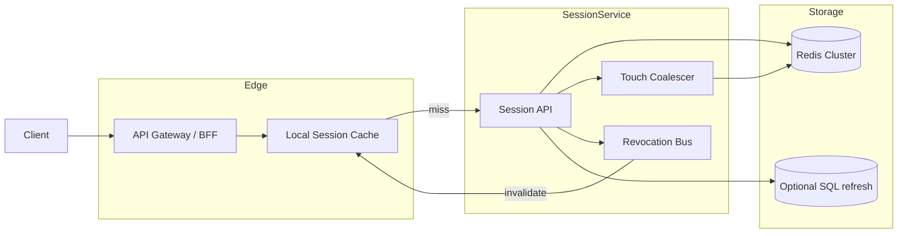
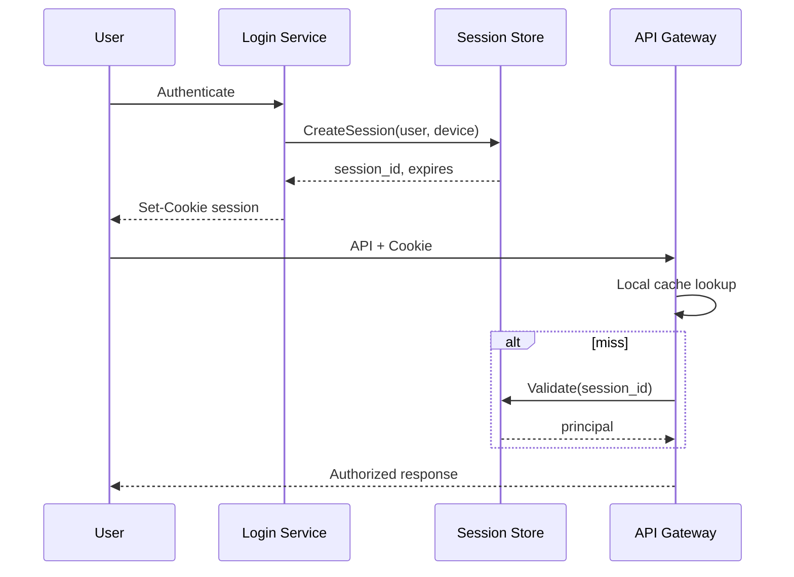

# System Design: Session / Token Store

> **Focus areas:** Session creation & validation · TTL / sliding expiration · Revocation · Multi-device · Horizontal scale · Security · Sticky vs shared store  
> **Style:** Core primitive design with progressive scale (10× → 100× → 1,000×)  
> **Product analogy:** Central session service backing web/mobile auth (not a full IdP)

---

## Table of Contents

1. [Clarify Requirements (Interview Q&A)](#1-clarify-requirements-interview-qa)
2. [Back-of-the-Envelope Estimation](#2-back-of-the-envelope-estimation)
3. [High-Level Design](#3-high-level-design)
4. [Architecture Diagram](#4-architecture-diagram)
5. [Design Deep Dive](#5-design-deep-dive)
6. [Wrap-Up](#6-wrap-up)
7. [Deeper / Related Interview Questions](#7-deeper--related-interview-questions)

---

## 1. Clarify Requirements (Interview Q&A)

The goal of this phase is to **bound the problem**: what we build, what we defer, and at what scale we must succeed.

### 1.0 What this is / is not

| This is | This is not |
|---------|-------------|
| A **session / token store**: create, validate, refresh, revoke opaque sessions | A full OAuth/OIDC identity provider (login UI, social login, MFA UX) |
| Fast authorization checks for APIs and edge | Long-term audit warehouse for every auth event (emit events elsewhere) |
| Support for multi-device sessions and forced logout | User profile database of record |
| Optional JWT validation helpers + server-side session records | “JWT-only, never store anything” as the only mode |

### 1.1 Functional Requirements

| # | Question to ask | Expected / typical interviewer answer | Design implication |
|---|-----------------|----------------------------------------|--------------------|
| F1 | Opaque session vs JWT? | **Hybrid common:** opaque session ID in cookie/header; or JWT access + refresh with server-side revocation list | Design primary **server-side session record**; JWT as optional access token |
| F2 | Who calls validate? | API gateways, BFF, microservices — very high QPS | Validate must be ≤ single-digit ms p99 in-region |
| F3 | Session payload? | `user_id`, roles/scopes, device_id, IP/UA hash, created/expires, idle timeout | Keep record small; large claims in user service |
| F4 | TTL model? | Absolute lifetime + **sliding idle** timeout | Touch updates `last_seen` carefully (write amp) |
| F5 | Multi-device? | Yes; list sessions; revoke one or all | Index by `user_id`; session_id primary |
| F6 | Revocation latency? | Global logout visible in **seconds** | Pub/sub invalidate + short cache TTL |
| F7 | Refresh tokens? | Optional rotating refresh tokens for mobile | Store refresh hash; rotate; reuse detection |
| F8 | Cookie vs Bearer? | Web: HttpOnly Secure SameSite cookie; API: Bearer | Store doesn’t care; issuance layer sets cookies |
| F9 | Cross-region? | Users roam; prefer low-latency validate | Regional stores + replication or sticky home region |
| F10 | Step-up / MFA flags? | Session may be `aal1`/`aal2` | Store auth level; APIs enforce |
| F11 | Concurrent session limits? | e.g. max 10 devices; evict oldest | On create, prune by policy |
| F12 | Admin impersonation? | Later | Actor vs subject fields in session |
| F13 | CSRF / fixation? | Session fixation prevention on login | Rotate session ID at privilege change |
| F14 | Compliance? | GDPR delete user → wipe sessions | Delete by `user_id` + tombstones |

**MVP functional scope:**

1. `CreateSession` after authentication (caller is IdP/login service).
2. `ValidateSession` / `GetSession` by session token (constant-time compare / keyed lookup).
3. `TouchSession` for sliding expiration (batched).
4. `RevokeSession` and `RevokeAllForUser`.
5. `ListSessionsForUser` (device management UI).
6. Optional refresh-token rotate endpoint.
7. Metrics: create/validate/revoke rates, hit latency, cache hit ratio.

**Out of MVP:**

- Full login/MFA/password reset
- WebAuthn attestation storage as primary
- Global strongly consistent active-active writes
- Rich risk scoring engine (hook only)

### 1.2 Non-Functional Requirements

| # | Question | Expected answer | Target |
|---|----------|-----------------|--------|
| N1 | Validate latency | Hot path | p50 < 1–2ms, p99 < 5–10ms in-region (cached) |
| N2 | Availability | Auth critical | 99.99% validate; degrade gracefully |
| N3 | Durability | Restart must not log everyone out (product choice) | Persist sessions; RPO seconds |
| N4 | Consistency | Revoke must be fast | Read-your-writes in region; revoke propagation < 1–5s global |
| N5 | Security | Token theft resistance | High-entropy IDs; hash at rest; TLS; binding optional |
| N6 | Scale | Validate ≫ create | Read-optimized; cache aggressively |
| N7 | Privacy | Minimal PII in session | Store hashes of IP/UA if needed |

### 1.3 Cases

**Happy paths**

1. Login → create session → set cookie → subsequent API validate → allow.
2. Sliding TTL: activity touches expiry; idle user expires.
3. User revokes phone session from settings → next validate fails.
4. Password change → revoke all sessions except current (or all).
5. Refresh token rotation → new access/refresh; old refresh rejected.

**Edge / failure cases**

| Case | Behavior |
|------|----------|
| Token not found / expired | `401`; clear cookie if web |
| Cache hit on revoked session | Must not happen beyond revoke SLA — version/epoch or bloom + neg cache carefully |
| Duplicate create (retry) | Idempotency key from login request → same session |
| Thundering herd touch writes | Batch touches; probabilistic touch; write behind |
| Store outage | Fail closed for sensitive; optional short JWT grace **only if product accepts risk** |
| Session fixation | Mint new session ID on login / privilege escalation |
| Refresh token reuse | Revoke token family; alert steal |
| Clock skew | Store absolute expiry server-side; allow small skew on JWT `exp` only |
| Mega-user 1M sessions bug | Hard cap per user; admin cleanup |

### 1.4 Scales (Progressive)

| Metric | Baseline | 10× | 100× | 1,000× |
|--------|----------|-----|------|--------|
| MAU | 5M | 50M | 500M | 5B |
| DAU | 1M | 10M | 100M | 1B |
| Active sessions | 5M | 50M | 500M | 5B |
| Validate QPS peak | 50K | 500K | 5M | 50M |
| Create QPS peak | 1K | 10K | 100K | 1M |
| Revoke QPS peak | 100 | 1K | 10K | 100K |
| Avg session size | 500 B | 500 B | 500 B | 400–600 B |
| Session RAM (raw) | 2.5 GB | 25 GB | 250 GB | 2.5 TB |
| Regions | 1–2 | 3 | 5–8 | 10+ |

**What each jump forces:**

- **10×:** Redis Cluster; local caches on gateways; touch coalescing.
- **100×:** Shard by `session_id` / `user_id`; regional pools; async replication for DR.
- **1,000×:** Cell/region sticky sessions; edge validation caches with epoch revocation; careful global logout fanout.

### 1.5 Etc.

- Login service is **upstream**; we trust mTLS/service auth from issuers.
- Prefer **opaque random tokens** (128+ bits) over interpretable IDs.
- Cookies: `Secure`, `HttpOnly`, `SameSite=Lax|Strict` as product requires.

**Scope statement:**

> Design a highly available **session/token store** for create/validate/revoke/list with sliding TTL and multi-device logout, optimized for validate QPS from ~50K to 1000×, without building a full IdP.

---

## 2. Back-of-the-Envelope Estimation

### 2.1 Traffic

```text
Baseline DAU 1M; each user 100 API calls/day with session validate
→ 100M validates/day ≈ 1.16K QPS avg
Peak 40–50× for global diurnal → ~50K peak ✓

Creates: ~1–2 logins/day/DAU → ~1–2M/day ≈ 20 QPS avg, ~1K peak
```

### 2.2 Memory & storage

```text
5M sessions × 500 B = 2.5 GB values
+ Redis overhead (~1.5–2×) → ~5 GB
Replicas ×3 → ~15 GB cluster memory baseline

1,000×: 5B × 500 B = 2.5 TB raw → multi-TB Redis/Flash or tiered (hot recent + disk)
```

### 2.3 Bandwidth

```text
Validate request+response ~300 B
50K QPS × 300 B ≈ 15 MB/s ≈ 0.12 Gbps (easy)
50M QPS → 120 Gbps → many frontends + L4
```

### 2.4 Touch write amplification

```text
Naive: every validate writes last_seen → write QPS = validate QPS = disaster

Fix:
  - Touch only if last_touch older than T (e.g. 60s)
  - Or probabilistic touch p=0.01
  - Or write-behind buffer per shard

Effective touch QPS ≈ validate / (T / avg_interarrival)
If T=60s and user hits every 6s → ~10× reduction minimum; often 50–100×
```

### 2.5 Hot keys

```text
Celebrity user: list/revoke-all scans many sessions — shard by user_id carefully;
validate is by session_id (high cardinality) → naturally balanced if random IDs
```

### 2.6 Cache

| Layer | Data | TTL | Notes |
|-------|------|-----|-------|
| Gateway local | session → principal | 1–5s | Revoke SLA bound |
| Redis | session record | idle TTL | SoT or cache-aside |
| Negative cache | missing token | 1–5s | Cap to avoid abuse |

---

## 3. High-Level Design

### 3.1 Token formats

**Option A — Opaque session ID (recommended primary)**

```text
Cookie: session=base64url(32 random bytes)
Store key: sess:{id} → {user_id, …, exp, ver}
At rest: store HMAC/hash of token if token is bearer secret; or store id and keep secret only in cookie
```

Practical pattern: ID is the lookup key; value is not secret beyond possession of ID → treat ID as password-equivalent (HTTPS only).

**Option B — JWT access + server session/refresh**

```text
Access JWT (5–15 min): sub, sid, scp, exp, ver
Refresh opaque (days): stored hashed
Revocation: bump session ver / revoke sid
```

Validate path: JWT signature + check `sid` not revoked (cache). Pure JWT without revocation store fails forced logout.

### 3.2 Data model

```text
Session {
  session_id,          # PK
  user_id,             # secondary index
  device_id,
  created_at,
  expires_at,          # absolute
  idle_expires_at,     # sliding
  last_seen_at,
  auth_level,
  scopes_hash or scopes[],
  ip_hash, ua_hash,
  version,             # bump on privilege change
  refresh_family_id?,  # if refresh rotation
  state: active|revoked
}

RefreshToken {
  token_hash PK,
  session_id,
  family_id,
  expires_at,
  rotated_from?,
  revoked bool
}
```

**Indexes:** `user_id → [session_id]` (Redis SET/ZSET by last_seen); TTL on keys.

### 3.3 APIs

| Method | Path | Purpose |
|--------|------|---------|
| POST | `/sessions` | Create (from login service) |
| GET | `/sessions/{id}` | Validate + return principal |
| POST | `/sessions/{id}/touch` | Explicit touch (or implicit on GET) |
| DELETE | `/sessions/{id}` | Revoke one |
| DELETE | `/users/{uid}/sessions` | Revoke all |
| GET | `/users/{uid}/sessions` | List devices |
| POST | `/refresh` | Rotate refresh → new access/session |

**Validate response (minimal):**

```json
{
  "user_id": "u_123",
  "session_id": "s_...",
  "auth_level": 2,
  "scopes": ["read", "write"],
  "expires_at": 1735689600
}
```

### 3.4 Component architecture

```text
                   +-------------+
                   | Login / IdP |
                   +------+------+
                          | create / revoke-all
                          v
+----------+       +------+------+       +----------------+
| API GW / |------>| Session API |<----->| Redis Cluster  |
| Services |validate| (+ cache)  |       | (sessions)     |
+----------+       +------+------+       +--------+-------+
                          |                       |
                          | pub/sub invalidate    | AOF/repl
                          v                       v
                   +-------------+         +-------------+
                   | Local caches|         | Disk / Snap |
                   +-------------+         +-------------+
```

### 3.5 Sliding expiration strategies

| Strategy | Writes | Accuracy | Choice |
|----------|--------|----------|--------|
| Touch every validate | Huge | Exact | No |
| Touch if `now - last > 60s` | Low | Good | **Yes** |
| Probabilistic | Lowest | Approximate | Large scale |
| Client refresh only | Low | Depends | Mobile JWT |

Absolute `max_age` (e.g. 30 days) always enforced even if sliding.

### 3.6 Revocation

1. Mark session `revoked` or `DEL` key + add to bloom/epoch.
2. Publish `revoke(session_id)` / `bump_user_epoch(user_id)` to all GW caches.
3. Validate checks: missing/revoked → deny; if JWT, check `ver >= session.ver`.

**Revoke-all:** increment `user_session_epoch[user_id]`; sessions carry `epoch` at mint; validate requires match. Avoids enumerating millions of keys synchronously (still async delete for hygiene).

### 3.7 Cross-region

| Option | Pros | Cons | Deal-breaker |
|--------|------|------|--------------|
| Sticky home region | Simple consistency | Roaming latency | Bad for global mobile if home far |
| **Replicate sessions async** | Local validate | Revoke lag | Need revoke SLA design |
| Global Redis / CRDT | Fancy | Cost/complexity | Rarely needed MVP |
| JWT-only + regional revoke list | Fast | Revoke list scale | Works with short access TTL |

**Choice:** Issue in region; **async multi-region replication** for active sessions; revokes fan out via pub/sub + epoch; accept revoke p99 a few seconds cross-region.

### 3.8 Trade-offs

#### Store engine

| Option | Pros | Cons | Deal-breaker |
|--------|------|------|--------------|
| **Redis Cluster** | Latency, TTL | Memory cost | Fine with eviction policy careful |
| DynamoDB | Scale, TTL | p99/cost | Good AWS |
| Postgres | Durable | Too slow alone at 5M QPS | Need cache |
| Memcached only | Fast | Weak persistence | Mass logout on restart — product risk |

**Choice:** Redis as primary session store with persistence (AOF/RDB) + optional durable backup of refresh tokens in SQL.

#### Cookie session vs Bearer opaque

Same store. Cookie needs CSRF strategy for browser mutating requests; Bearer needs XSS-resistant token storage on clients (mobile secure storage).

---

## 4. Architecture Diagram





---

## 5. Design Deep Dive

### 5.1 Reliability

**Data loss**

- Redis AOF every second or better; multi-AZ replicas.
- Refresh tokens in SQL for long-lived mobile if Redis loss unacceptable.
- Product decision: losing sessions = mass re-login — communicate RPO.

**Retries & idempotency**

- Create with `Idempotency-Key` from login.
- Revoke is idempotent DELETE.

**Security reliability**

- Constant-time compare if storing secrets.
- Rate-limit validate on missing tokens (enumeration).
- Rotate signing keys for JWTs with `kid`.

**Backpressure**

- Validate must fail closed under overload for sensitive routes; optionally shed touch writes first.

### 5.2 Scalability

**Sharding**

- Primary key `session_id` (random) → even load.
- User index: `user:{id}:sessions` ZSET — watch large cardinality; cap sessions.

**Scale jumps**

| Scale | Change |
|-------|--------|
| 10× | Cluster + GW local cache |
| 100× | Regional clusters; async repl; touch coalescing service |
| 1,000× | Epoch-based mass revoke; edge caches; tier cold sessions to Flash/disk |

**Storage tiers**

- Hot: sessions active in last N days in Redis.
- Warm: infrequently used sessions on Redis-on-Flash / Dynamo.
- Delete expired via TTL; no batch job required for Redis TTL.

### 5.3 Maintainability

**Ops:** key prefix conventions; kill switch to force global epoch bump; dashboards for cache hit and revoke lag.

**Observability:** `validate_latency`, `cache_hit`, `revocation_propagation_seconds`, `sessions_created`, `refresh_reuse_detected`.

**Migrations:** dual-read old/new cluster; session version field for schema evolution.

**Multi-tenant SaaS:** prefix keys with `tenant_id`; quotas per tenant; noisy neighbor isolation via separate clusters for enterprise.

---

## 6. Wrap-Up

### Decision summary

| Decision | Choice | Why |
|----------|--------|-----|
| Primary token | Opaque session ID | Revocation & sliding TTL natural |
| Store | Redis Cluster + TTL | Validate latency |
| Sliding TTL | Coalesced touches | Control write amp |
| Mass logout | User epoch | Avoid huge deletes on critical path |
| Cross-region | Async replicate + revoke fanout | Latency vs consistency balance |
| JWT | Optional short access | Needs server revocation still |

### Phased rollout

1. **MVP:** Redis sessions, create/validate/revoke/list, absolute+sliding TTL, single region.
2. **Phase 1.5:** GW local cache + pub/sub; refresh rotation; multi-device UI APIs.
3. **Phase 2:** Multi-region replication; epoch revoke-all; Redis Flash tiering.
4. **Phase 3:** Risk signals, device binding, enterprise cluster isolation.

---

## 7. Deeper / Related Interview Questions

**Q1. Why not store sessions only in JWTs?**  
A: Forced logout, idle timeout, and server-side state changes require a revocation authority. Pure JWT shifts complexity to short TTL + refresh, which still needs a store.

**Q2. Is Redis persistence enough?**  
A: For many consumer apps yes. For banking, pair with durable refresh records and shorter access sessions; define RPO explicitly.

**Q3. How do you stop session fixation?**  
A: Issue a new session ID on login and when elevating privileges; invalidate the anonymous/pre-login ID.

**Q4. Cookie theft via XSS?**  
A: HttpOnly cookies mitigate JS read; still need CSP/XSS defenses. For Bearer tokens in JS, XSS is catastrophic—prefer HttpOnly for web.

**Q5. How does SameSite help?**  
A: Reduces CSRF from cross-site POSTs. Still use CSRF tokens for `SameSite=Lax` edge cases if needed.

**Q6. Design sliding TTL without melting Redis.**  
A: Touch if older than 60s; pipeline; or sample 1% of validates; never write on every read.

**Q7. Negative caching danger?**  
A: Caching “not found” after revoke is OK; caching “not found” before create can hide a new session briefly—keep neg TTL tiny or key by version.

**Q8. How to list devices efficiently?**  
A: Maintain `user:{id}:sessions` set updated on create/revoke; store device metadata in session hash; cap length.

**Q9. Refresh token rotation reuse detection?**  
A: On reuse of an already-rotated refresh, revoke entire family—assumes theft.

**Q10. Sticky load balancers instead of shared store?**  
A: Breaks with LB changes, mobile roaming, and multi-service validate. Shared store wins; stickiness is optional optimization only.

**Q11. What entropy for session IDs?**  
A: ≥128 bits from CSPRNG; avoid predictable sequences.

**Q12. Should you store IP in session?**  
A: Optional bind or risk signal; hashing helps privacy; hard bind breaks mobile networks—usually soft signal.

**Q13. Global revoke SLA of 1 second—how?**  
A: Pub/sub + local cache TTL ≤1s; epoch in Redis with synchronous read on miss; accept regional lag if multi-region.

**Q14. Hot partition on celebrity user?**  
A: Validate path uses session_id (OK). Revoke-all/list uses user index—rate-limit and shard secondary index if needed.

**Q15. Fail open vs fail closed?**  
A: Almost always fail closed for authz. Fail open is a deal-breaker for sensitive systems.

**Q16. How do microservices validate without central bottleneck?**  
A: Sidecar/SDK local cache; mTLS to session service; or JWT with sid revocation bloom filter pushed to edges.

**Q17. Bloom filter for revocation?**  
A: Good for “definitely not revoked” short access JWTs; false positives force Redis check. Reset filter on epoch.

**Q18. GDPR delete.**  
A: Delete user index + all session keys; emit audit; ensure backups expire; document residual TTL.

**Q19. Multi-tenant key layout?**  
A: `{tenant}:sess:{id}` and enforce tenant from auth context to prevent cross-tenant IDOR.

**Q20. Session version vs new session on password change?**  
A: Either bump version (JWTs) or revoke-all + mint one new session for current device—clearer security story for password change.

**Q21. Memory estimate interview trick?**  
A: Always multiply by replica factor and Redis overhead; mention fragmentation.

**Q22. Why hash refresh tokens at rest?**  
A: DB leak should not yield usable refresh tokens; lookup by hash of presented token.

**Q23. Can Gateway validate without Session API?**  
A: Yes with Redis access from GW—couples infra. Prefer Session API for policy/metrics; cache beside GW.

**Q24. Clock skew on expiry?**  
A: Server compares `now` from store nodes; for JWT allow small leeway; sync NTP.

**Q25. Deal-breaker: storing passwords in session store?**  
A: Yes—never. Session store holds session metadata only.

**Q26. How to migrate Redis cluster?**  
A: Dual-write create; dual-read validate; switch; TTL drains old.

**Q27. WebSocket auth?**  
A: Validate on connect; periodically revalidate or subscribe to revoke channel to kill sockets.

**Q28. Rate limiting vs session validate?**  
A: Orthogonal; usually rate limit by user_id after validate, or by IP before for anonymous.

**Q29. What belongs in session vs token claims?**  
A: Stable authn facts in session; frequently changing profile data fetched from user service—avoid stale authz from bloated sessions.

**Q30. Opaque tokens in logs?**  
A: Never log full tokens; log prefix/hash only.

---

*End of session/token store design.*
