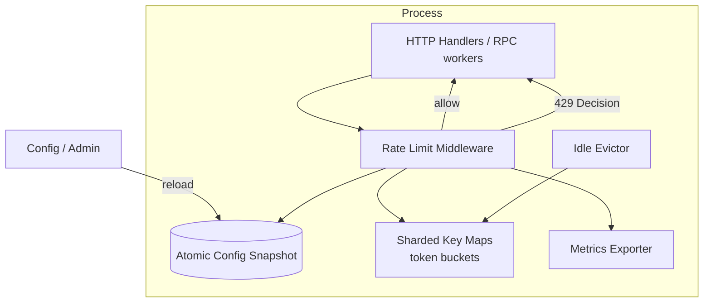
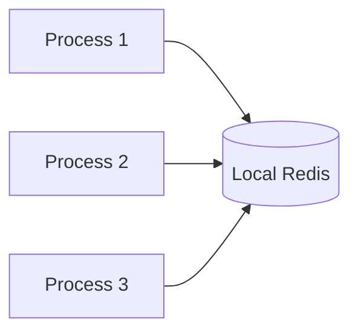

# System Design: Single-Machine Rate Limiter

> **Focus areas:** Token bucket · Leaky bucket · Fixed/sliding window · In-process vs Redis-on-box · Fairness · Burst control · Headers · Lock-free/atomic design · Memory bounds  
> **Style:** End-to-end component design with progressive scale (10× → 100× → 1,000×) **on one machine / one OS process boundary**  
> **Quality bar:** Correct algorithm math, concurrency safety, explicit approx vs exact, when to graduate to distributed

---

## Table of Contents

1. [Clarify Requirements (Interview Q&A)](#1-clarify-requirements-interview-qa)
2. [Back-of-the-Envelope Estimation](#2-back-of-the-envelope-estimation)
3. [High-Level Design](#3-high-level-design)
4. [Architecture Diagram](#4-architecture-diagram)
5. [Design Deep Dive](#5-design-deep-dive)
6. [Wrap-Up](#6-wrap-up)
7. [Deeper / Related Interview Questions](#7-deeper--related-interview-questions)

---

## 1. Clarify Requirements (Interview Q&A)

Goal: Design a **single-machine rate limiter**—a library or local daemon used inside one API node / gateway process / host—to enforce per-key request rates with correct burst behavior, low latency, and bounded memory. This is the foundation before distributed rate limiting.

### 1.0 What this is / is not

| Dimension | This design | Not this |
|-----------|-------------|----------|
| Scope | One machine / one process (or co-located Redis on host) | Cluster-wide global exact limit |
| Job | Allow/deny (+ optionally delay) per key | Full WAF / bot management product |
| Consistency | Exact **within the machine** | Exact across fleet (see distributed doc) |
| Placement | In-process library or localhost sidecar | Cross-region quota service |

### 1.1 Functional Requirements

| # | Question to ask | Expected / typical interviewer answer | Design implication |
|---|-----------------|----------------------------------------|--------------------|
| F1 | What is limited? | Requests per API key / user / IP / route | Key taxonomy + composite keys |
| F2 | Algorithm? | Token bucket default; know sliding window | Pluggable strategies |
| F3 | Return behavior? | Allow / deny; `Retry-After`; rate limit headers | Standard client contract |
| F4 | Burst vs sustained? | e.g. 100/s sustained, burst 200 | Bucket capacity ≠ refill rate |
| F5 | Costed requests? | Optional weight (uploads cost more) | `TryAcquire(key, n)` |
| F6 | Sync vs async delay? | Prefer **reject** (429) over sleep in server threads | Avoid thread-starve |
| F7 | Config reload? | Dynamic limits per route/key class | Atomic swap of config snapshot |
| F8 | Override / allowlist? | Admin bypass for health checks | Short-circuit before bucket |
| F9 | Metrics? | Allows, denies, key cardinality, latency | Essential for tuning |
| F10 | Multi-algorithm? | Different routes different policies | Policy registry by route matcher |
| F11 | Warm idle keys? | Evict idle keys from memory | LRU / TTL on state |
| F12 | Clock? | Monotonic clock for intervals | Avoid NTP step issues in process |
| F13 | Thread safety? | Many request threads | Atomcs / shards / mutex per key |
| F14 | Fail mode? | If limiter broken, fail-open or closed per route | Explicit policy |

**MVP functional scope (lock with interviewer):**

1. In-process token bucket limiter: `Allow(key) -> Decision`.
2. Per-route default limits + optional per-key overrides.
3. 429 + `Retry-After` + `X-RateLimit-*` headers.
4. Weighted acquire.
5. Bounded memory via idle eviction.
6. Hot-reload config.
7. Prometheus metrics.
8. Clear statement: **limits apply per machine**, not global.

**Out of MVP (explicitly defer):**

- Exact global fleet limits (distributed rate limiter)
- Complex fair queuing / weighted fair queueing across tenants
- ML adaptive limits
- Persistent durable quotas across process restart (optional soft)

### 1.2 Non-Functional Requirements

| # | Area | Target | Notes |
|---|------|--------|-------|
| N1 | Overhead | p99 < 50µs in-process allow check | Hot path |
| N2 | Correctness | No under-limit thundering within machine beyond burst spec | Algorithm math |
| N3 | Memory | Bound e.g. ≤ 100MB for key states | Eviction policy |
| N4 | Availability | Limiter must not deadlock; fail policy explicit | Watchdog |
| N5 | Concurrency | Correct under 100+ threads / async tasks | Sharding |
| N6 | Observability | Deny rate, top keys, map size | Cardinality-safe labels |
| N7 | Config | Reload < 1s without restart | Atomic pointer swap |
| N8 | Restart | Soft reset of buckets OK unless durable required | Document |

### 1.3 Cases (Flows & Edge Cases)

**Happy paths**

1. Requests under limit → allow; tokens decrement; headers show remaining.
2. Burst within capacity → allow; then sustained limited to refill rate.
3. Over limit → deny 429 with `Retry-After`.
4. Weighted upload `TryAcquire(key, 10)` consumes 10 tokens.
5. Config update doubles limit → new acquires use new rate.

**Edge / failure cases**

| Case | Behavior |
|------|----------|
| Key cardinality explosion (unique IP botnet) | Cap map size; LRU evict; optionally fail-closed for new keys under attack |
| Clock jump (wall clock) | Use monotonic clock for refill math |
| Highly contended single key | Per-key lock or CAS; shard map |
| Refill starvation (no requests long time) | Idle bucket refills up to capacity (token bucket) |
| Process restart | Counters reset → brief extra burst—document |
| Allowlist probe | Health `/healthz` bypasses |
| Negative / zero limit config | Reject config; don’t divide by zero |
| Huge weight > capacity | Deny immediately |
| Async runtime (node/go) | No blocking sleep; return deny |

### 1.4 Scales (Progressive) — single machine

| Metric | Baseline | 10× | 100× | 1,000× |
|--------|----------|-----|------|--------|
| Peak RPS through process | 10K | 100K | 1M | 10M |
| Distinct keys / min | 10K | 100K | 1M | 10M |
| Limiter CPU budget | 1% | 3% | 10% | specialized / XDP |
| State memory | 10 MB | 50 MB | 200 MB | external local Redis / eBPF |
| Threads / goroutines | 50 | 200 | 1K | eventloop + shards |

**What each jump forces:**

- **10×:** Shard the key map; reduce lock scope; batch metrics.
- **100×:** Lock-free token updates where possible; careful false sharing; maybe localhost Redis for shared state across processes on same host.
- **1,000×:** Kernel/XDP/eBPF or dedicated NIC policies; or split traffic—process-level limiter alone is insufficient; move to edge.

**Graduation criterion → distributed:** When product requires **one logical limit across N machines**, this design is insufficient alone.

### 1.5 Etc. (Constraints & Assumptions)

- Language-agnostic design; examples in Go/Java-style atomics.
- Limits are **enforcement**, not authn.
- Single-machine accuracy does **not** imply global accuracy (N gateways ⇒ ~N× effective rate if uncoordinated).

**Scope statement to repeat back:**

> Design a single-machine rate limiter library using token bucket (and contrast sliding window), with thread-safe per-key state, bounded memory, standard 429 headers, dynamic config, and clear scaling limits—explicitly **not** a fleet-global quota service.

---

## 2. Back-of-the-Envelope Estimation

### 2.1 Token bucket parameters

```text
rate R = 100 tokens/s
capacity B = 200 tokens   # burst
refill: tokens = min(B, tokens + R * Δt)

Average sustained ≤ R
Instantaneous burst ≤ B
```

**Sanity:** If clients send 200 at t=0 then 100/s forever → OK. If they send 300 at once → deny 100.

### 2.2 Sliding window log vs counter

```text
Log: store timestamp per request — memory O(RPS_per_key)
Counter sliding: two fixed windows weighted — O(1) memory, approximate
Fixed window: O(1) but boundary burst 2× allowed
```

### 2.3 Memory for key states

```text
Token bucket state ≈ 32–64 B (tokens float/int, last_ms, mutex/seqlock)
10K keys × 64 B ≈ 640 KB
1M keys × 64 B ≈ 64 MB
10M keys × 64 B ≈ 640 MB → need eviction / external store
```

### 2.4 Hot path cost

```text
Hash lookup + refill math + decrement ≈ tens of ns to few µs
At 1M RPS: 1µs × 1M = 1.0 core-second/s → ~1 core → optimize
```

### 2.5 Fixed window boundary spike

```text
Limit 100/s fixed windows
Client sends 100 at 0.999s and 100 at 1.001s → 200 in 2ms
Token bucket / sliding window avoid this classic footgun
```

### 2.6 Multi-process on one host

```text
4 worker processes uncoordinated with 100/s each → 400/s effective
Fix: share state via shmem / localhost Redis / move limit to LB
```

---

## 3. High-Level Design

### 3.1 Placement options

| Placement | Pros | Cons | Use when |
|-----------|------|------|----------|
| In-process library | Fastest; simple deploy | Per-process budgets; reset on restart | Single process servers |
| Sidecar on localhost | Language-agnostic | Hop + ops | Polyglot host |
| Local Redis on host | Share across processes | Dependency; still not fleet-global | Multi-process VM |
| Envoy/local gateway filter | Central per-host policy | Platform coupling | Service mesh |

**MVP:** in-process library.

### 3.2 Core API

```text
interface RateLimiter {
  Decision Allow(String key);
  Decision TryAcquire(String key, int weight);
  void Reconfigure(Config cfg);
}

class Decision {
  boolean allowed;
  long remaining;       // tokens or requests left in window
  long limit;
  long resetEpochMs;    // or retryAfterMs
  String policyName;
}
```

HTTP mapping:

```text
HTTP/1.1 429 Too Many Requests
Retry-After: 0.05
X-RateLimit-Limit: 100
X-RateLimit-Remaining: 0
X-RateLimit-Reset: 1710000000
```

### 3.3 Algorithms (implement + know trade-offs)

#### Token bucket (default)

- State: `tokens`, `last_refill_ts`
- On ask: refill by elapsed × rate; if tokens ≥ weight → consume; else deny
- Pros: smooth sustained + controlled burst; O(1)
- Cons: float precision if naive; need monotonic time

#### Leaky bucket

- Queue/drain at constant rate; shapes traffic
- Pros: smooth egress
- Cons: queuing delays; less natural for HTTP deny model

#### Fixed window counter

- Count in `[epoch, epoch+W)`
- Pros: trivial
- Cons: **boundary burst 2×**

#### Sliding window log

- Exact over last W; store timestamps
- Pros: precise
- Cons: memory/CPU at high RPS

#### Sliding window counter (approx)

- Weight previous window by overlap fraction + current count
- Pros: O(1), reduces boundary spike
- Cons: Approximate

### 3.4 Data structures

```text
ConcurrentHashMap / sharded maps: key → BucketState
BucketState { tokens, lastTs, policyId }
Policy { ratePerSec, burst, algorithm }
ConfigSnapshot { matchers: route → policyId; overrides: key → policyId }
Idle eviction: LRU or TTL sampling
```

**Sharding:** `shard = hash(key) % N` independent maps/locks → less contention.

### 3.5 Concurrency strategies

| Strategy | Pros | Cons |
|----------|------|------|
| Mutex per key | Simple | Storage of locks; convoying |
| Sharded maps + fine locks | Good balance | More complex |
| CAS on packed state | Fast | Retry loops; ABA care |
| Thread-local + periodic merge | Very fast | Approximate; not exact per key |

For interview MVP: **sharded map + per-key synchronized refill/consume**.

### 3.6 Config & hot reload

```text
Admin / file / control plane pushes JSON policies
Loader validates → builds immutable ConfigSnapshot
AtomicReference.set(snapshot)
Allow() always reads latest snapshot
```

### 3.7 Trade-offs

| Decision | Choose | Over | Why | Deal-breaker |
|----------|--------|------|-----|--------------|
| Algorithm | Token bucket | Fixed window alone | Burst control without 2× boundary | Silent 2× spike |
| Deny vs queue | Deny 429 | Sleep threads | Tail latency / deadlock | Thread pool collapse |
| Memory | Evict idle | Unbounded map | Cardinality attacks | OOM |
| Clock | Monotonic | Wall clock | NTP steps | Negative Δt → NaN tokens |
| Scope honesty | Document per-machine | Claim global | Correctness | False security |
| Precision | Exact in-process | Sampling only | Enforcement | Under-enforcement |

---

## 4. Architecture Diagram



**Optional same-host Redis:**



Still **not** multi-host global.

---

## 5. Design Deep Dive

### 5.1 Reliability

**Invariants**

1. Under concurrent acquires, consumed tokens never exceed capacity accounting (no lost updates making limit limp).
2. Refill never exceeds burst capacity.
3. Config swap is atomic—no torn reads of rate/burst.
4. Eviction never corrupts neighboring keys.

**Idempotency:** Rate limiting is intentionally **not** idempotent across retries—retries consume again unless client uses application-level idempotency and you charge once (advanced).

**Fail modes**

| Mode | When | Behavior |
|------|------|----------|
| Fail-closed | Auth/login / payment | Deny if limiter error |
| Fail-open | Static public read | Allow if limiter error; metric+alert |

**Backpressure:** Limiter itself should not allocate per request beyond map insert; pre-size shards.

### 5.2 Scalability (within one machine)

| Scale | Technique |
|-------|-----------|
| 10K RPS | Single map + mutex OK |
| 100K RPS | Shard by key; pool Decision objects |
| 1M RPS | CAS; pin threads; huge pages optional; minimize metrics labels |
| 10M RPS | eBPF/XDP or NIC rate limit; app limiter for complex keys only |

**Scale down:** Evict idle; shrink shard count on small hosts.

**Parallelization:** Request threads independent except same-key contention.

**Storage tiers:** Hot keys in RAM; optional local Redis for multi-process; cold policies in config store.

### 5.3 Maintainability

**Observability**

- `rate_limit_allows`, `rate_limit_denies` with `policy` label (not raw key—cardinality bomb).
- Separate top-K deny keys via sampled logger / count-min sketch.
- Map size gauge; eviction count; reload success.

**Migrations**

- Algorithm change per policy version; dual-run shadow metrics before enforce.

**Testing**

- Deterministic fake clock for refill tests.
- Concurrency soak on single key and many keys.
- Boundary tests for fixed window vs token bucket contrast.

**Ops**

- Runbook: deny spike → is attack or bad limit? adjust policy; allowlist health.

---

## 6. Wrap-Up

### 6.1 Decision summary

| Topic | Decision |
|-------|----------|
| Algorithm | Token bucket default; know sliding/fixed |
| Placement | In-process library MVP |
| Concurrency | Sharded maps |
| Memory | TTL/LRU eviction |
| Client contract | 429 + Retry-After + X-RateLimit-* |
| Honesty | Per-machine scope |

### 6.2 Phased rollout

1. Library + middleware + metrics.  
2. Config hot reload + overrides.  
3. Local Redis if multi-process.  
4. Graduate to distributed limiter for global quotas.

### 6.3 Risks

Claiming global enforce; OOM on key cardinality; wall-clock bugs; fixed-window spikes; blocking sleep.

### 6.4 Closer

> **Single-machine rate limiter:** token buckets with sharded concurrent state, bounded memory, standard deny headers, and explicit scope limits—the right building block before distributed coordination.

---

## 7. Deeper / Related Interview Questions

**Q1. Token bucket vs leaky bucket?**  
**A:** Token bucket allows bursts up to capacity then sustained rate; leaky bucket emits at constant rate (shapes). HTTP APIs usually token bucket + deny.

**Q2. Why is fixed window problematic?**  
**A:** Boundary burst up to 2× limit across adjacent windows.

**Q3. How does sliding window counter work?**  
**A:** `count = prev * (1-overlap) + curr`; O(1) memory; approximate.

**Q4. How do you refill without a background thread?**  
**A:** Lazy refill on each `Allow` using elapsed time since `last_ts`.

**Q5. Integer vs float tokens?**  
**A:** Prefer integer math with “millitokens” or refill at ms granularity to avoid float drift.

**Q6. How to handle 1M unique IPs?**  
**A:** Cap map; LRU; approximate structures (Count-Min) for low-value IP limits; authenticate users for finer buckets.

**Q7. Mutex vs CAS?**  
**A:** Mutex simpler correctness; CAS faster under contention if state packs cleanly; shards reduce need.

**Q8. Should `Allow` block until token available?**  
**A:** Generally no in request threads—return 429. Optional separate delay queue for job systems.

**Q9. How do weighted requests work?**  
**A:** `TryAcquire(key, w)` requires `tokens ≥ w`; large `w > burst` always denies.

**Q10. Process restart burst?**  
**A:** Buckets reset full → brief extra burst. Mitigate with shared Redis or accept soft.

**Q11. Monotonic vs wall clock?**  
**A:** Monotonic for Δt refill; wall clock for `Reset` header absolute time.

**Q12. How to unit test?**  
**A:** Inject `Clock`; advance time; assert allow/deny sequences and burst.

**Q13. Rate limit header standards?**  
**A:** Legacy `X-RateLimit-*`; IETF `RateLimit-Limit/Remaining/Reset` drafts—pick one consistently.

**Q14. Composite keys?**  
**A:** `user:123|route:/pay|ip:1.2.3.4` with policy precedence (most specific wins).

**Q15. Fail-open vs fail-closed?**  
**A:** Risk-based: payments closed; public static open with alert.

**Q16. Why not Redis for single machine?**  
**A:** Extra hop/ops; use when multiple local processes must share. Still not global.

**Q17. Fairness among keys?**  
**A:** Per-key buckets isolate tenants; global machine CPU still shared—use admission control separately.

**Q18. Token bucket at 0 RPS idle for hours?**  
**A:** Caps at burst capacity—doesn’t accumulate infinity.

**Q19. Deal-breakers?**  
**A:** Unbounded key map; fixed window only; sleep-in-handler; claiming fleet-global accuracy.

**Q20. Interaction with retries?**  
**A:** Client exponential backoff honors `Retry-After`; server may add jitter recommendation.

**Q21. Sliding log memory at 10K RPS key?**  
**A:** 10K timestamps/s × 8B × window 60s ≈ 4.8 MB **per hot key** — unsustainable; use counter algorithms.

**Q22. False sharing?**  
**A:** Pad shard line caches; avoid contiguous atomic counters in one cache line under multi-core.

**Q23. Can GC pause cause over-allow?**  
**A:** If another thread still running, OK; if all freeze, requests freeze too. Problem is more about shared external clocks.

**Q24. Hierarchical limits?**  
**A:** Check user bucket then tenant bucket then IP bucket—deny if any fails; order for performance (cheapest first).

**Q25. Shadow mode?**  
**A:** Compute decision but don’t enforce; log would-deny—safe rollout.

**Q26. When move to distributed?**  
**A:** When N instances make effective limit N×R unacceptable for business (billing, SMS, login abuse).

**Q27. Lua in local Redis?**  
**A:** Atomic refill+consume script; still single-host unless Redis is remote clustered (then distributed doc).

**Q28. Load balancer rate limits vs app?**  
**A:** LB good for coarse IP; app for user/API-key semantics—defense in depth.

**Q29. Exact remaining tokens under concurrency?**  
**A:** Headers may be slightly stale; don’t promise perfect remaining under race—document.

**Q30. Algorithm selection cheat-sheet?**  
**A:** Need burst → token bucket; need strict window accuracy → sliding log (low volume) or sliding counter; simplicity only → fixed window with caveat.

---

## Appendix A — Worked Token-Bucket Trace

```text
Policy: R = 5 tokens/s, B = 10 tokens, weight = 1
t=0.0s  tokens=10  Allow → 9
t=0.0s  Allow ×9 more → 0
t=0.0s  Allow → DENY (Retry-After ≈ 0.2s for 1 token)
t=0.2s  refill +1 → Allow → 0
t=2.0s  idle refill +10 capped at B=10
```

This is the narrative interviewers expect when they say “show me the burst.”

## Appendix B — Pseudocode (Sharded Map)

```text
shards = Array[N] of ConcurrentMap<Key, Bucket>

Allow(key, weight, policy):
  snap = config.get()
  p = snap.resolve(key, policy)
  if p.allowlist: return ALLOW(p)
  s = shards[hash(key) % N]
  synchronized (s.lockFor(key)):  # or stripe lock
    b = s.getOrCreate(key, p)
    now = monoNano()
    elapsed = now - b.last
    b.tokens = min(p.burst, b.tokens + elapsed * p.rate / 1e9)
    b.last = now
    if b.tokens >= weight:
      b.tokens -= weight
      touchLRU(key)
      return ALLOW(remaining=b.tokens, limit=p.burst, reset=...)
    return DENY(retryAfter=(weight - b.tokens) / p.rate)
```

## Appendix C — When Single-Machine Is Enough

| Situation | Verdict |
|-----------|---------|
| One monolith / one gateway | Enough |
| N stateless replicas, limit is “protect this process” | Enough (per-node) |
| N replicas, limit is “100 SMS/user/day globally” | **Not enough** → distributed |
| Multi-process on one VM sharing one budget | Local Redis/shmem bridge |

## Appendix D — Header Examples

```text
HTTP/1.1 200 OK
X-RateLimit-Limit: 100
X-RateLimit-Remaining: 73
X-RateLimit-Reset: 1723000000

HTTP/1.1 429 Too Many Requests
Retry-After: 1
X-RateLimit-Limit: 100
X-RateLimit-Remaining: 0
X-RateLimit-Reset: 1723000001
Content-Type: application/json

{"error":"rate_limit_exceeded","policy":"api_default"}
```

---

*End of Single-Machine Rate Limiter system design.*
