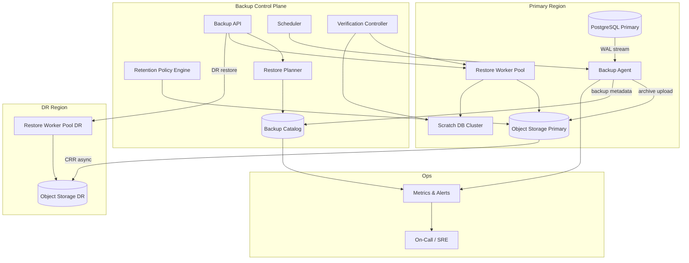

# System Design: Snapshot, Backup & Point-in-Time Recovery (PITR)

> **Focus areas:** WAL / incremental backups · Snapshot consistency · RPO/RTO targets · Backup verification · Cross-region DR · Restore orchestration  
> **Style:** Database/platform backup plane with progressive scale (10× → 100× → 1,000×)  
> **API orientation:** Backup Control API (`POST /backups`, `POST /restores`, PITR timestamp selection) + internal snapshot agents

---

## Table of Contents

1. [Clarify Requirements (Interview Q&A)](#1-clarify-requirements-interview-qa)
2. [Back-of-the-Envelope Estimation](#2-back-of-the-envelope-estimation)
3. [High-Level Design](#3-high-level-design)
4. [Architecture Diagram](#4-architecture-diagram)
5. [Design Deep Dive](#5-design-deep-dive)
6. [Wrap-Up](#6-wrap-up)
7. [Deeper / Related Interview Questions](#7-deeper--related-interview-questions)

---

## 1. Clarify Requirements (Interview Q&A)

The goal of this phase is to **bound the problem**: what we build, what we defer, and at what scale we must succeed.

### 1.0 What this is / is not

| This is | This is not |
|---------|-------------|
| A **backup and PITR platform** for operational databases (Postgres, MySQL, Mongo) and attached volumes | A full disaster-recovery runbook for every microservice |
| **Continuous WAL/archive** + periodic **snapshots** (full + incremental) enabling restore to arbitrary timestamp | Nightly `mysqldump` only with no PITR |
| **RPO/RTO-driven** design with verification, restore drills, and cross-region replication | "We have backups" with untested S3 objects |
| Orchestrated **restore workflows** (validate → stage → promote → cutover) | Manual `pg_restore` on a laptop |
| Immutable, encrypted backup objects with catalog metadata | Rsync of live data directory while DB is running (corrupt) |

### 1.1 Functional Requirements

| # | Question to ask | Expected / typical interviewer answer | Design implication |
|---|-----------------|----------------------------------------|--------------------|
| F1 | Which systems to protect? | Primary OLTP: Postgres (MVP); later MySQL, Mongo, Redis persistence | Pluggable **backup agents** per engine |
| F2 | PITR granularity? | Restore to **any second** within retention window | Continuous WAL shipping + base backup chain |
| F3 | Snapshot types? | Full weekly + incremental daily + WAL continuous | Backup chain graph in catalog |
| F4 | Retention policy? | 30-day PITR; 12-month monthly full for compliance | Lifecycle rules + legal hold override |
| F5 | Cross-region? | DR copy in secondary region; survive region loss | Async replicate backup objects + separate KMS |
| F6 | RPO / RTO targets? | RPO ≤ **5 min**; RTO ≤ **1 hour** for tier-1 DB | WAL lag monitoring; pre-provisioned restore infra |
| F7 | Consistency model? | Crash-consistent minimum; **application-consistent** preferred for multi-DB | Quiesce hooks / filesystem freeze / logical export |
| F8 | Verification? | Automated restore test to scratch cluster + checksum | Weekly full restore drill per critical DB |
| F9 | Encryption? | At rest + in transit; customer-managed keys optional | KMS envelope; per-backup DEK |
| F10 | Multi-tenant? | Many DB instances across teams | Instance registry; RBAC per database |
| F11 | Restore modes? | New instance (safe default); in-place overwrite (dangerous) | Default **restore-as-new** + promote via DNS/config |
| F12 | Incremental mechanism? | Page-level or file-level changed blocks since last snapshot | Changed Block Tracking (CBT) or WAL-only with less frequent full |
| F13 | Backup during load? | No unacceptable production impact | Throttle IO; snapshot via storage layer when possible |
| F14 | Catalog / lineage? | Know parent snapshot, WAL range, checksum, region copies | Backup catalog service is SoT |
| F15 | Point-in-time API? | `restore_to_timestamp(T)` selects correct chain automatically | Planner computes base + WAL replay window |

**MVP functional scope (lock this with interviewer):**

1. Register database instances with connection + storage metadata.
2. **Base backup** (full) via `pg_basebackup` or storage snapshot.
3. **Continuous WAL archiving** to object storage (1–5 min flush batches).
4. Backup catalog records chain: `full → incremental* → WAL segments`.
5. **PITR restore API**: given `instance_id` + `target_time`, provision scratch cluster, replay WAL, health check.
6. Encryption at rest; immutable object lock (WORM) optional for compliance tier.
7. Cross-region async replication of backup objects (secondary region).
8. Automated **verification job**: restore latest backup weekly to scratch; run `pg_checksums` / smoke queries.
9. Metrics: WAL lag, backup success, last verified restore, RPO breach alerts.

**Out of MVP (explicitly defer):**

- Active-active multi-master PITR merge (design for single primary)
- Cross-engine distributed transaction consistent backup (2PC freeze)
- Instant clone via copy-on-write storage (Phase 2 — valuable for RTO)
- Backup deduplication global pool across all tenants (Phase 2)
- Tape/offline vault integration

### 1.2 Non-Functional Requirements

| # | Question | Expected answer | Target |
|---|----------|-----------------|--------|
| N1 | RPO (data loss window)? | Tier-1: ≤ **5 min** | WAL archive lag p99 ≤ **300s** |
| N2 | RTO (time to restore service)? | Tier-1: ≤ **1 hour** | Pre-baked AMIs + parallel WAL fetch |
| N3 | Backup window impact? | ≤ **10%** IO latency increase during snapshot | Storage-level snapshot preferred |
| N4 | Durability of backups? | 11 nines object storage + cross-region | ≥ 2 geographic copies |
| N5 | Availability of backup control plane? | 99.9%; data plane backup continues if control plane blips | Agents buffer WAL locally |
| N6 | Consistency? | Restore produces transactionally consistent DB at T | Replay to target time + `recovery_target_inclusive` |
| N7 | Security? | Least privilege; no plaintext credentials in backups | mTLS agents; short-lived tokens |
| N8 | Cost? | WAL volume dominates at high write rates | Compression; lifecycle to IA/Glacier for old fulls |

### 1.3 Cases (Happy Paths & Edge / Failure)

**Happy paths**

1. Continuous WAL archive → nightly incremental → weekly full → catalog chain complete.
2. Operator requests PITR to `2026-08-05 14:32:00 UTC` → planner picks base + WAL → restore succeeds → read-only validation → promote.
3. Weekly verification restores to scratch → checksum OK → metric green.
4. Region failure → failover reads backup catalog in DR region → restore from secondary copy.
5. Retention expiry deletes WAL older than 30 days + corresponding incremental orphans.

**Edge / failure cases**

| Case | Behavior |
|------|----------|
| WAL archive gap (network blip) | Alert RPO breach; agent buffers locally (bounded disk); backfill when up |
| Corrupt WAL segment | Checksum fail → use prior good segment; restore may stop before target T |
| Incremental based on missing parent | Catalog rejects; force full backup |
| Restore target T before oldest full | Fail fast: "retention insufficient" |
| Restore target T during active transaction burst | Replay longer; RTO extends—document |
| Split-brain promote restored DB | Require explicit promote API + fence old primary |
| Encryption key rotated | Retain old KMS key versions for decrypt; catalog stores key id |
| Mass delete / ransomware | Immutable WORM backups + separate admin account |
| Very large DB (50 TB) | Full backup takes days → rely on storage snapshots + incremental CBT |
| Logical corruption (bad UPDATE) | PITR to minute before incident; not backup's job to detect logic bugs |
| Clock skew on target_time | Use DB timeline + LSN mapping; UTC only in API |
| Parallel restores same backup | CoW clone cache shares base (Phase 2) |

### 1.4 Scales (Progressive)

| Metric | Baseline | 10× | 100× | 1,000× |
|--------|----------|-----|------|--------|
| Protected DB instances | 50 | 500 | 5K | 50K |
| Total protected data | 10 TB | 100 TB | 1 PB | 10 PB |
| WAL generation (aggregate) | 50 GB/day | 500 GB/day | 5 TB/day | 50 TB/day |
| Full backup size (aggregate) | 10 TB | 100 TB | 1 PB | 10 PB |
| Incremental/day (avg 5% churn) | 500 GB | 5 TB | 50 TB | 500 TB |
| Backup object count | 500K | 5M | 50M | 500M |
| Archive upload bandwidth (peak) | 100 MB/s | 1 GB/s | 10 GB/s | 100 GB/s |
| Restore requests / month | 20 | 200 | 2K | 20K |
| Cross-region replication factor | 2 regions | 2 | 3 | 3+ |
| Catalog metadata rows | 1M | 10M | 100M | 1B |

**What each jump forces architecturally:**

- **10×:** Dedicated WAL ingest workers; per-instance throttling; parallel multipart uploads.
- **100×:** **Regional backup cells**; storage-snapshot-first for large DBs; dedupe within instance; verification sampling not 100% full restore.
- **1,000×:** Global catalog shard; erasure-coded cold fulls; instant clone via CoW for RTO; separate network path for backup traffic; tiered retention automation.

### 1.5 Etc. (Constraints & Assumptions)

- **Engine focus:** Postgres semantics (`pg_basebackup`, WAL-G/WAL-E class) for concrete discussion; patterns generalize.
- **Object storage:** S3-compatible with versioning + optional Object Lock.
- **Network:** Backup traffic on separate NIC/VPC endpoint to avoid saturating app network.
- **Not replacing:** Engine-native replicas for HA—backups protect against logical errors and regional loss.

**Scope statement to repeat back:**

> Design a **snapshot + WAL backup platform** with a cataloged chain of full/incremental snapshots and continuous WAL archives, enabling **PITR** to arbitrary timestamps within retention, cross-region DR copies, automated verification restores, and orchestrated restore workflows—starting at ~50 DB instances / 10 TB and scaling to 1,000× with RPO ≤ 5 min and RTO ≤ 1 hour for tier-1.

---

## 2. Back-of-the-Envelope Estimation

### 2.1 WAL volume (dominant cost driver)

```text
Postgres WAL ≈ write throughput to DB (order of magnitude)

Example tier-1 instance: 500 GB DB, 10% daily write churn → 50 GB/day WAL
50 instances → 2.5 TB/day aggregate WAL

1,000× scale (50K instances, same per-DB churn assumption):
  50 GB/day × 50K = 2.5 PB/day WAL  ← extreme; real world uses tiering + fewer whale DBs

More realistic 1,000×: 5K heavy instances × 50 GB/day = 250 TB/day WAL
```

Compress WAL (`gzip`/`zstd`): **50–70%** reduction → 250 TB → **75–125 TB/day** upload.

### 2.2 Full + incremental storage

```text
Baseline: 10 TB full + 30 days WAL @ 50 GB/day × 50 inst → simplification:

Aggregate baseline protected: 10 TB
Daily WAL (50 inst avg 1 GB/day each): 50 GB/day
30-day WAL retention: 1.5 TB
Weekly full (10 TB) + daily incremental 5% (500 GB):

Monthly storage growth order:
  Full copies retained: 4 weekly × 10 TB = 40 TB (if no dedupe—use lifecycle)
  Practical with 1 full + incrementals: 10 TB + 30 × 500 GB ≈ 25 TB per month chain
```

Use lifecycle: keep 1 monthly full 12 months; dailies 30 days.

### 2.3 Upload bandwidth

```text
50 GB/day WAL = 50e9 / 86400 ≈ 580 KB/s average per 50-instance fleet
Peak 10×: ~5.8 MB/s (trivial)

100× WAL: 5 TB/day ≈ 58 MB/s avg, ~580 MB/s peak (needs dedicated paths)

1,000×: 250 TB/day compressed ~80 TB/day ≈ 925 MB/s avg sustained
→ Regional ingest clusters; multipart; colocate with storage
```

### 2.4 Restore time (RTO breakdown)

Postgres PITR restore for **500 GB** DB:

| Phase | Duration (order) |
|-------|------------------|
| Provision VM + disks | 3–5 min (pre-warmed pool: 1 min) |
| Fetch base backup (500 GB @ 1 GB/s) | 8 min |
| Fetch WAL (24h @ 50 GB) | 5 min |
| Replay WAL | 10–30 min (depends on churn) |
| Recovery + consistency checks | 5 min |
| **Total** | **~30–50 min** (meets 1h RTO) |

**10 TB DB:** base fetch dominates → storage snapshot clone (Phase 2) cuts to minutes.

### 2.5 Catalog metadata size

```text
Per WAL segment metadata ~500 B; 16 MB segment; 50 GB/day → 3200 segments/day
50 instances → 160K segment records/day × 500 B ≈ 80 MB/day metadata

1,000×: 16M records/day → 8 GB/day → partition catalog by month/instance
```

### 2.6 Verification cost

Full restore weekly per instance:

```text
Baseline 50 instances: 50 restores/week → ~7/day staggered
100× 5K instances: impossible full weekly → verify 5% sample + continuous checksum on archive
```

### 2.7 Cross-region replication

```text
Replicate same WAL bytes to DR region ≈ 2× egress cost
50 GB/day → 50 GB/day cross-region (baseline trivial)
250 TB/day at 1,000× → CR replication must be **region-local ingest** (primary writes locally, CRR async)
```

### 2.8 Memory / compute for restore workers

```text
WAL replay is CPU + disk bound; 4 vCPU can replay ~50–100 MB/s WAL
500 GB DB restore worker: 8 vCPU, 32 GB RAM, 1 TB NVMe staging
Pool of 20 warm workers for tier-1 SLA
```

---

## 3. High-Level Design

### 3.1 Backup chain model

```text
BackupChain (per database instance)
  ├── FullSnapshot (weekly)           backup_id=F1, LSN range [L0, L1]
  ├── IncrementalSnapshot (daily)     backup_id=I1, parent=F1, LSN [L1, L2]
  ├── IncrementalSnapshot             backup_id=I2, parent=I1, LSN [L2, L3]
  └── WalSegment[] (continuous)       wal_id, LSN range, s3_key, checksum, archived_at

PITR to time T:
  1. Find latest Full/Incremental with end_LSN_time ≤ T
  2. Collect WAL segments from that LSN through T
  3. restore → recovery_target_time = T
```

**Catalog graph (DAG):**

```text
F1 ──► I1 ──► I2 ──► I3
         ╲ WAL stream ─────────────► segments w1..wN
```

### 3.2 Component architecture

```text
┌─────────────────────────────────────────────────────────────┐
│                    Backup Control Plane                      │
│  API │ Catalog │ Policy Engine │ Restore Planner │ Scheduler │
└────────────┬───────────────────────────────┬────────────────┘
             │                               │
     ┌───────▼────────┐              ┌───────▼────────┐
     │ Backup Agent   │              │ Restore Worker │
     │ (per DB host   │              │ Pool           │
     │  or sidecar)   │              │                │
     └───────┬────────┘              └───────┬────────┘
             │                               │
     ┌───────▼───────────────────────────────▼────────┐
     │           Object Storage (primary region)       │
     │  /instances/{id}/full/ /incr/ /wal/             │
     └───────┬────────────────────────────────────────┘
             │ async CRR
     ┌───────▼────────────────────────────────────────┐
     │           Object Storage (DR region)              │
     └──────────────────────────────────────────────────┘
```

### 3.3 API surface

| Method | Path | Purpose |
|--------|------|---------|
| POST | `/v1/instances` | Register DB instance |
| POST | `/v1/instances/{id}/backups/full` | Trigger full (or schedule) |
| GET | `/v1/instances/{id}/backups` | List chain |
| GET | `/v1/instances/{id}/recovery-window` | Earliest/latest PITR time |
| POST | `/v1/instances/{id}/restores` | PITR or latest restore |
| GET | `/v1/restores/{id}` | Restore job status |
| POST | `/v1/restores/{id}/promote` | Make restored DB primary |
| POST | `/v1/verification-jobs` | Manual verification trigger |

**PITR restore request:**

```http
POST /v1/instances/db_prod_users/restores
Content-Type: application/json

{
  "target_time": "2026-08-05T14:32:00Z",
  "mode": "new_instance",
  "instance_class": "db.r6g.2xlarge",
  "reason": "accidental_table_drop"
}
```

Response:

```json
{
  "restore_id": "rst_7a2...",
  "status": "planning",
  "planned_base_backup": "I2",
  "wal_segments_required": 184,
  "estimated_rto_minutes": 42
}
```

### 3.4 Backup agent responsibilities

1. **WAL archive hook:** `archive_command` ships closed segments to local spool → uploader.
2. **Full backup:** `pg_basebackup -Ft -z -P` OR storage snapshot API (EBS/PD snapshot).
3. **Incremental:** If storage CBT available, snapshot diff; else Postgres file-level diff or `pgBackRest` delta.
4. **Metadata:** Report LSN boundaries, size, checksum to catalog on completion.
5. **Local spool:** Buffer WAL if object store unavailable (capacity **≥ RPO × WAL rate × 3**).

### 3.5 Snapshot vs WAL-only trade-offs

| Strategy | RPO | Storage cost | Complexity |
|----------|-----|--------------|------------|
| WAL continuous only + rare full | Minutes | Lower full count | Long restore (replay from old full) |
| Daily incremental + WAL | Minutes | Medium | Balanced **default** |
| Storage snapshot every hour + WAL | Minutes | Higher snapshot count | Fast base restore; vendor lock-in |
| Logical dump nightly | Hours | Low | No fine PITR |

### 3.6 Incremental backup approaches

| Method | How | Pros | Cons |
|--------|-----|------|------|
| **Postgres native** | Full base + WAL (no true incremental base) | Simple | Large base copies |
| **pgBackRest / WAL-G** | File-level incremental/differential | Mature | Agent complexity |
| **Storage CBT** | EBS snapshot diff blocks | Fast, low DB load | Cloud-specific; crash consistent unless quiesced |
| **Page tracking** | Postgres ext track changed pages | Efficient incrementals | Extension dependency |

**Interview recommendation:** Daily **incremental via pgBackRest** + continuous WAL + weekly full; migrate large DBs to **storage snapshots** for base.

### 3.7 Cross-region DR

```text
Primary region:
  Agent → S3 primary bucket (WORM optional)

CRR (Cross-Region Replication) async → DR bucket
  Lag metric: object_replication_lag_seconds

DR restore:
  Catalog reads replica metadata
  Restore worker in DR region pulls from DR bucket only
  No dependency on primary region during region failure
```

**RPO for region loss:** `WAL_archive_lag + CRR_lag` (typically **< 15 min** if tuned).

### 3.8 Verification pipeline

```text
VerificationJob:
  1. Pick backup chain point (latest full or random sample)
  2. Restore to scratch VPC (isolated)
  3. Run pg_checksums / amcheck
  4. Execute golden SQL probes (row counts, checksum agg)
  5. Record latency + success in catalog
  6. Tear down scratch instance
```

| Tier | Frequency | Scope |
|------|-----------|-------|
| Tier-1 | Weekly automated full restore | 100% critical instances |
| Tier-2 | Monthly sample | 10% non-critical |
| Tier-3 | Daily | WAL segment checksum only |

### 3.9 Restore orchestration

**States:**

```text
planning → provisioning → fetching_base → fetching_wal → replaying → validating → ready → promoted | failed
```

**Promote checklist:**

- Replication lag zero on new instance
- App migration: update DNS / service discovery
- **Fence old primary** (prevent split brain)
- Incremental backups re-register from new timeline

### 3.10 Trade-off tables

#### RPO vs cost

| RPO target | Mechanism | Cost multiplier |
|------------|-----------|-----------------|
| 24 hours | Daily full dump | 1× |
| 1 hour | Hourly WAL + daily full | 3–5× |
| 5 min | Continuous WAL + monitoring | 5–8× |
| ~0 | Sync replica + sync WAL (not backup) | HA not backup |

#### Snapshot consistency levels

| Level | Method | Consistency |
|-------|--------|-------------|
| Crash-consistent | Storage snapshot without quiesce | OK for WAL replay engines |
| Application-consistent | `pg_start_backup()` / FS freeze | Better for multi-volume |
| Logical-consistent | Coordinated quiesce across DBs | Hard; rarely MVP |

#### Restore modes

| Mode | Risk | RTO |
|------|------|-----|
| New instance (default) | Low | Medium |
| In-place overwrite | High (total loss if fail) | Lower |
| Instant clone (CoW) | Low | **Lowest** |

### 3.11 Deal-breakers

- No WAL continuity → no true PITR.
- Untested backups → unknown RTO.
- Single region, no CRR → region loss = total loss.
- Restore over production without fence → split brain.
- Missing catalog lineage → cannot pick correct incremental parent.

---

## 4. Architecture Diagram



---

## 5. Design Deep Dive

### 5.1 Reliability

#### 5.1.1 Preventing backup data loss

- Object storage: versioning + replication + optional Object Lock (WORM).
- **3-2-1 rule:** 3 copies, 2 media types, 1 offsite (CRR satisfies offsite).
- Catalog stored separately from backups (multi-AZ DB).
- Checksum every segment (`sha256`); verify on upload and restore.

#### 5.1.2 WAL gap prevention

```text
archive_command fails → PostgreSQL retains WAL (disk fill risk)
→ Alert at 80% pg_wal disk
→ Local spool on agent with backpressure
→ RPO breach page if lag > 300s
```

**Dual-path archive (100× scale):** sync to local MinIO + async to S3.

#### 5.1.3 Idempotent uploads

- WAL segment filename includes timeline + LSN range (unique).
- S3 PUT with `If-None-Match` or conditional on key existence.
- Catalog upsert idempotent on `(instance_id, wal_segment_id)`.

#### 5.1.4 Retries & backpressure

| Component | Policy |
|-----------|--------|
| WAL uploader | Exponential backoff; never drop segment |
| Full backup | Resume multipart upload |
| Restore fetch | Parallel ranged GETs; 32 threads |
| Agent throttle | Max 100 MB/s upload unless burst |

#### 5.1.5 Ransomware / malicious admin

- Immutable backups (Object Lock compliance mode).
- **Separate AWS account** for backup bucket (vault account).
- MFA delete; restore requires break-glass role with approval.

### 5.2 Scalability

#### 5.2.1 Scale paths

- **10×:** Horizontal uploader workers; instance-level queues.
- **100×:** Regional backup ingest endpoints; storage snapshot first for DBs > 5 TB.
- **1,000×:** Catalog sharded by `instance_id`; erasure coding for old fulls; dedupe within instance chains.

#### 5.2.2 Parallelization

- Multipart upload 64 MB parts; 10 parallel parts per WAL batch.
- Restore: parallel WAL download while base still copying if network allows.
- Verification jobs sharded across worker pool.

#### 5.2.3 Large database strategy

| DB size | Base strategy | RTO tactic |
|---------|---------------|------------|
| < 1 TB | pg_basebackup | Standard |
| 1–10 TB | Compressed base + incremental | Pre-warmed workers |
| > 10 TB | Storage snapshot + WAL | **Instant CoW clone** for base |

#### 5.2.4 Hot instances (WAL firehose)

- Dedicated upload NIC; pgWal compression.
- Increase `archive_timeout` only if RPO allows (trade alert).
- Shard WAL to multiple prefix paths (`/wal/00/`, `/wal/01/`).

#### 5.2.5 Catalog at billion-object scale

- Partition by `(instance_id, month)`.
- Store segment index in SQLite sidecar per instance on agent; sync summary to central.
- GC orphaned metadata with lifecycle jobs.

### 5.3 Maintainability

#### 5.3.1 Observability

| Metric | SLO |
|--------|-----|
| `wal_archive_lag_seconds` | p99 < 300 |
| `backup_last_success_timestamp` | < 25h for daily |
| `verification_last_success` | < 8 days tier-1 |
| `restore_job_duration_seconds` | track p95 vs RTO |
| `crr_lag_seconds` | p99 < 900 |

Dashboards per instance + fleet rollup.

#### 5.3.2 Operability

- Runbook: WAL gap → manual `pg_waldump` verify → restore from last good LSN.
- Runbook: failed incremental → force full.
- Game day: quarterly region-down restore drill.

#### 5.3.3 Migrations

- Agent version rollout: canary 5% instances.
- Catalog schema v2 supports new incremental types alongside v1.

#### 5.3.4 Multi-tenant fairness

- Upload bandwidth token bucket per instance.
- Restore concurrency limits; tier-1 preempts tier-3 verification.

#### 5.3.5 Retention & compliance

```text
Policy template:
  wal_days: 30
  incremental_days: 30
  full_weekly: 4
  full_monthly: 12
  legal_hold: overrides delete
```

Lifecycle transitions: Standard → Infrequent Access (30d) → Glacier (90d) for old fulls.

---

## 6. Wrap-Up

### Decision summary

| Area | Decision |
|------|----------|
| PITR mechanism | Full + incremental base chain + continuous WAL |
| Catalog | Central DAG of backups + WAL index |
| RPO | ≤ 5 min via WAL lag alerting |
| RTO | ≤ 1 hour via pre-warmed restore workers + parallel fetch |
| DR | Cross-region async replication of backup objects |
| Verification | Weekly full restore tier-1; checksum daily |
| Default restore | New instance + explicit promote + fence |
| Encryption | KMS envelope; vault account isolation |

### Phased rollout

1. **Phase 0:** Postgres agent; WAL to S3; weekly full; manual PITR restore runbook.
2. **Phase 1:** Catalog API; automated restore worker; RPO/RTO metrics; CRR.
3. **Phase 2:** Incremental dailies; verification scheduler; Object Lock for tier-1.
4. **Phase 3:** Storage snapshot bases for whales; instant clone; multi-engine agents.

### RPO/RTO cheat sheet

| Tier | RPO | RTO | Mechanism |
|------|-----|-----|-----------|
| Tier-1 | 5 min | 1 hour | Continuous WAL + weekly full + warm restore pool |
| Tier-2 | 1 hour | 4 hours | Hourly WAL batch + daily incremental |
| Tier-3 | 24 hours | 24 hours | Daily logical/logical snapshot |

---

## 7. Deeper / Related Interview Questions

1. **Difference between replica and backup?**  
   Replica protects HA; backup protects logical corruption, operator error, ransomware, region loss.

2. **Why WAL needed if you have daily snapshots?**  
   Snapshots alone give RPO up to 24h; WAL shrinks RPO to minutes.

3. **Crash-consistent snapshot enough for Postgres?**  
   Yes with WAL replay—Postgres recovers to consistent point as if crash recovery.

4. **How pick base backup for PITR time T?**  
   Latest backup whose `end_time ≤ T` and WAL chain continuous to T.

5. **WAL gap impact?**  
   Restore stops at gap start; cannot reach T after gap—RPO breach.

6. **Incremental corrupt—now what?**  
   Fall back to previous full in chain; replay extra WAL; longer RTO.

7. **pg_dump vs physical backup?**  
   Logical dump: portable, slow restore, coarse PITR. Physical+WAL: fast restore, fine PITR.

8. **How estimate replay time?**  
   Proportional to WAL bytes × transaction density; benchmark ~50–100 MB/s per vCPU.

9. **Split brain after restore promote?**  
   Fence old primary via STONITH / revoke credentials / isolate SG.

10. **Cross-region RPO math?**  
    `primary_wal_lag + crr_replication_lag`.

11. **Object Lock vs versioning?**  
    Versioning helps accidental delete; Lock prevents malicious overwrite/delete for retention period.

12. **Dedupe across instances?**  
    Content-addressable chunks (global dedupe) saves space; complexity in catalog; per-instance dedupe simpler.

13. **Instant clone technology?**  
    EBS fast snapshot restore, ZFS send, Ceph RBD clone—base appears in minutes, replay WAL on clone.

14. **Backup encryption key rotation?**  
    KMS retains old versions; catalog stores `kms_key_id` per object; re-encrypt optional background job.

15. **Verify without full restore?**  
    Checksum on upload + `pg_verifybackup` on base files + sample table restores—not full substitute for periodic full restore.

16. **Multi-table logical corruption?**  
    PITR to minute before; accept lost legitimate writes after bad transaction—document trade-off.

17. **MongoDB PITR difference?**  
    Oplog instead of WAL; continuous oplog archive + snapshot; replay oplog to timestamp.

18. **MySQL binlog PITR?**  
    `mysqlbinlog --stop-datetime=T`; base from `xtrabackup` + binlog chain.

19. **Rate limit backups during Black Friday?**  
    Dynamic throttle; extend RPO temporarily with stakeholder approval; never stop WAL archive.

20. **Catalog as SoT if S3 listing slow?**  
    Never rely on LIST for chain; catalog indexes all objects; S3 is dumb storage.

21. **Consistent backup across Postgres + Redis?**  
    Hard without app quiesce; document RPO skew; use Redis persistence snapshot time alignment approximate.

22. **LSN vs timestamp mapping?**  
    Catalog stores `(lsn, wall_time)` pairs from `pg_walfile_name_offset()` sampling; restore uses timestamp API internally mapped.

23. **Parallel restore of sharded DB?**  
    Per-shard backup chains; coordinated PITR time T on all shards; global clock alignment critical.

24. **Cost optimize 30-day retention?**  
    IA/Glacier for fulls; keep WAL hot 7 days then IA; lifecycle automation.

25. **Air-gapped backup?**  
    Async tape/export from Glacier; RTO hours–days; ransomware defense in depth.

26. **Backup agent failure modes?**  
    Sidecar vs host agent: sidecar survives app container restart; host agent sees storage snapshots.

27. **Thundering herd on regional failure?**  
    Pre-provisioned DR restore capacity; queue restores; tier-1 first.

28. **How test PITR without prod risk?**  
    Continuous restore to shadow instance comparing checksum queries.

29. **WAL compression trade-off?**  
    CPU vs bandwidth; zstd level 3 typical; decompress on restore adds minutes.

30. **When is PITR wrong tool?**  
    Need row-level undelete across long window without DB downtime—consider audit tables / CDC undo streams.

---

## Appendix A — Catalog Schema (simplified)

```sql
CREATE TABLE backup_instances (
  id            TEXT PRIMARY KEY,
  engine        TEXT NOT NULL, -- postgres
  region        TEXT NOT NULL,
  tier          INT NOT NULL DEFAULT 2,
  storage_bytes BIGINT,
  registered_at TIMESTAMPTZ NOT NULL DEFAULT now()
);

CREATE TABLE backup_objects (
  id            UUID PRIMARY KEY,
  instance_id   TEXT NOT NULL REFERENCES backup_instances(id),
  type          TEXT NOT NULL, -- full|incremental|wal
  parent_id     UUID REFERENCES backup_objects(id),
  s3_key        TEXT NOT NULL,
  start_lsn     TEXT,
  end_lsn       TEXT,
  start_time    TIMESTAMPTZ,
  end_time      TIMESTAMPTZ,
  size_bytes    BIGINT NOT NULL,
  checksum      TEXT NOT NULL,
  kms_key_id    TEXT,
  created_at    TIMESTAMPTZ NOT NULL DEFAULT now()
);
CREATE INDEX backup_objects_instance_time
  ON backup_objects (instance_id, end_time DESC);

CREATE TABLE restore_jobs (
  id              UUID PRIMARY KEY,
  instance_id     TEXT NOT NULL,
  target_time     TIMESTAMPTZ,
  status          TEXT NOT NULL,
  base_backup_id  UUID,
  wal_count       INT,
  started_at      TIMESTAMPTZ,
  completed_at    TIMESTAMPTZ,
  promoted_at     TIMESTAMPTZ
);
```

## Appendix B — Postgres config snippets

```text
# postgresql.conf
archive_mode = on
archive_timeout = 60s        # force segment switch ≤ RPO
wal_level = replica          # or logical if CDC also needed

# archive_command (agent spool)
archive_command = 'backup-agent wal-push %p %f'
```

## Appendix C — Scale Checklist

| Scale | Must add |
|-------|----------|
| 1× | Agent, S3, catalog, manual restore, WAL lag metric |
| 10× | Scheduler, restore workers, CRR, verification weekly |
| 100× | Snapshot bases for large DBs, regional ingest, sampled verify |
| 1,000× | Catalog shard, erasure cold tier, CoW instant clone, vault account |

## Appendix D — Glossary

| Term | Meaning |
|------|---------|
| WAL | Write-Ahead Log (Postgres redo) |
| PITR | Point-in-Time Recovery |
| RPO | Recovery Point Objective (max data loss) |
| RTO | Recovery Time Objective (max downtime) |
| CBT | Changed Block Tracking |
| CRR | Cross-Region Replication |
| LSN | Log Sequence Number |

---

*End of Snapshot/Backup/PITR system design doc. Use section 1 as interview opening script; sections 3–5 as the whiteboard core; section 7 for grilling practice.*
