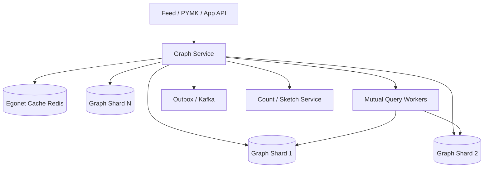

# System Design: Social Graph & Mutual Connections

> **Focus areas:** Graph storage · Adjacency lists · Mutual friends · Common connections API · Sharding mega-nodes · Caching · Progressive scale  
> **Style:** Senior/staff interview prep with progressive scale (10× → 100× → 1,000×)  
> **Product orientation:** Core social graph service powering follows/friends, egonet reads, and `mutual(u, v)` queries

---

## Table of Contents

1. [Clarify Requirements (Interview Q&A)](#1-clarify-requirements-interview-qa)
2. [Back-of-the-Envelope Estimation](#2-back-of-the-envelope-estimation)
3. [High-Level Design](#3-high-level-design)
4. [Architecture Diagram](#4-architecture-diagram)
5. [Design Deep Dive](#5-design-deep-dive)
6. [Wrap-Up](#6-wrap-up)
7. [Deeper / Related Interview Questions](#7-deeper--related-interview-questions)

---

## 1. Clarify Requirements (Interview Q&A)

This is the **platform primitive** under feeds, PYMK, and privacy. Nail edge semantics, query SLAs, and celebrity degree handling.

### 1.0 What this is / is not

| This is | This is not |
|---------|-------------|
| Durable social graph + query APIs | News feed fanout product (consumer) |
| Mutual connections / common friends | Full PYMK ranking product |
| Follow / friend / block edge types | General graph DB for all company graphs |
| Low-latency egonet reads | Offline analytics warehouse (export only) |

### 1.1 Functional Requirements

| # | Question to ask | Expected / typical interviewer answer | Design implication |
|---|-----------------|----------------------------------------|--------------------|
| F1 | Directed or undirected? | Support **both**: follow (dir) + friend (undir) | Edge type enum; undirected stored canonically |
| F2 | Core APIs? | add/remove edge; list neighbors; count; mutual; exists | Separate read-optimized structures |
| F3 | Mutual connections? | Return intersection + count; paginate | Sorted IDs / bitmaps |
| F4 | Blocks / mutes? | First-class edges with precedence | Filter layer on all reads |
| F5 | Edge metadata? | ts, strength, source | Optional payload; don’t bloat hot lists |
| F6 | Privacy? | Some friend lists private | Authz per viewer |
| F7 | Fanout consumers? | Emit graph change events | Kafka outbox |
| F8 | Consistency? | Strong for edge write ACK; reads mostly RYW | Leader per shard |
| F9 | Pagination of followers? | Cursor required for celebs | Bucketed follower lists |
| F10 | Degree queries? | counts cached | Approx OK for huge; exact when cheap |
| F11 | Path queries (degrees of separation)? | Optional 2-hop only in MVP | Bound hops |
| F12 | Multi-graph (work vs social)? | Single graph + edge types MVP | Namespace later |
| F13 | Admin / GDPR delete? | Yes | Erasure across replicas + events |

**MVP scope:**

1. Follow / unfollow; friend request accept → undirected edge.
2. `GET /neighbors`, `GET /exists`, `GET /count`.
3. `GET /mutual?u&v` with pagination + count.
4. Block edges override.
5. Change events for downstream fanout/PYMK.
6. Handle users with >1M followers without melting.

**Out of MVP:** Arbitrary k-hop queries, graph neural APIs, global graph search, multi-region active-active conflicts without CRDTs.

### 1.2 Non-Functional Requirements

| # | Question | Expected answer | Target |
|---|----------|-----------------|--------|
| N1 | Edge write latency | Interactive | p99 < 50–100ms |
| N2 | Egonet read (first page) | Very hot | p99 < 20–50ms cached |
| N3 | Mutual(u,v) for normal users | Interactive | p99 < 100ms |
| N4 | Mutual involving celeb | Best effort / approximate / sampled | Document limits |
| N5 | Availability | Tier-0 | 99.99% reads |
| N6 | Durability | No lost edges | Quorum / multi-AZ |
| N7 | RYW | Required for actor | Session stickiness or sync cache |

### 1.3 Cases

**Happy paths**

1. A follows B → edge durable → B follower count++ → event emitted.
2. Mutual(A,B) returns sorted common friends with cursor.
3. A blocks B → remove follow edges as policy dictates; filter everywhere.

**Edge / failure cases**

| Case | Behavior |
|------|----------|
| Celebrity follower list read | Bucketed pages; never load 100M IDs in one response |
| Mutual(celeb, celeb) | Reject / approximate / async job — set product policy |
| Double follow | Idempotent success |
| Thundering herd on celeb count | Cached counters; async reconcile |
| Shard hot key | Bucket by `(user_id, bucket)` |
| Privacy restricted list | 403 or empty per policy — don’t leak via mutual timing if possible |
| Event bus down | Outbox retained; downstream lag; graph still serves |

### 1.4 Scales

| Metric | Baseline | 10× | 100× | 1,000× |
|--------|----------|-----|------|--------|
| Users | 100M | 1B | 10B | 100B ids |
| Edges | 10B | 100B | 1T | 10T |
| Edge writes / day | 50M | 500M | 5B | 50B |
| Neighbor read QPS | 100K | 1M | 10M | 100M |
| Mutual QPS | 10K | 100K | 1M | 10M |
| Max degree | 100M | 200M | 500M | 1B+ |

**Jumps:**

- **10×:** Cache egonets; shard adjacency; Kafka events.
- **100×:** Bucket mega-nodes; bitmap compression; dedicated mutual service.
- **1,000×:** Regional graph cells; approximate structures; tiered storage for cold edges.

### 1.5 Etc.

> Design a tier-0 social graph service: directed/undirected edges, blocked edges, paginated neighbor lists, mutual connections API, change events, correctly handling mega-degree nodes from 100M users toward 1000×.

---

## 2. Back-of-the-Envelope Estimation

### 2.1 Storage

```text
Edge record minimal: 16 B (2× int64) + type → ~24–32 B
10B edges × 32 B = 320 GB raw
With indexes (both directions) ≈ 2× → ~640 GB
+ replication 3× → ~2 TB baseline — fine
100× → petabyte-class graph → compression + cold tier essential
```

### 2.2 Celebrity problem

```text
User with 50M followers × 8 B id = 400 MB for one adjacency list
Cannot cache whole list on every host; cannot mutual-intersect naively
→ bucket into 5K–50K shards; store compressed; special APIs
```

### 2.3 Mutual complexity

```text
Intersect sorted lists: O(deg(u) + deg(v))
Normal: deg 300 → trivial
If deg(v)=50M → must not fully scan; use:
  - iterate smaller list; membership bloom/hash of larger
  - or precomputed inverted postings
  - or approximate
```

### 2.4 QPS memory

```text
Hot egonets cached: 10M active × 200 friends × 8 B = 16 GB
Fits Redis cluster
```

---

## 3. High-Level Design

### 3.1 Edge model

```text
EdgeType: FOLLOW | FRIEND | BLOCK | MUTE
Direction:
  FOLLOW/BLOCK/MUTE: directed
  FRIEND: undirected canonical (min_id, max_id) + secondary index

Edge {
  src, dst, type, state, created_at, mtime, metadata_ref?
}
```

**Precedence:** `BLOCK` hides/overrides other relationships in product APIs.

### 3.2 Storage layout

**Primary adjacency (hot path):**

```text
out:{user}:{type} → sorted ID list / ZSET / columnar page
in:{user}:{type}  → bucketed pages for high degree
```

| Approach | Pros | Cons |
|----------|------|------|
| Relational edges table | Simple | Hot celebs kill single table indexes |
| Wide-column `(src, type, dst)` | Good writes/reads | Ops complexity |
| Custom graph shard | Fast | Build cost |
| Redis-only | Fast | Durability/cost |

**Staff choice:** durable wide-column / KV adjacency + Redis cache for hot small egonets.

### 3.3 Mega-node bucketing

```text
followers(celeb) stored as:
  in:celeb:FOLLOW:bucket_k → [user ids]
bucket_k = hash(follower_id) % N  (N=1024..8192)
```

- Pagination walks buckets.
- Counts = sum bucket counts (cached).
- Fanout systems already avoid full scans (hybrid feed).

### 3.4 Mutual connections algorithm

**Case A — both degrees small (<10k):**  
Load sorted neighbor arrays; two-pointer intersection; paginate.

**Case B — one large:**  
Iterate smaller; probe membership structure of larger (hash set pages / bloom + verify).

**Case C — both large:**  
Product-limit; sample; or async materialization.

```text
mutual_count estimate: MinHash / sketch on neighbor sets
exact count: maintain when cheap; else compute async
```

### 3.5 APIs

| Method | Path | Purpose |
|--------|------|---------|
| PUT | `/v1/edges` | Create/idempotent edge |
| DELETE | `/v1/edges` | Remove |
| GET | `/v1/users/{id}/neighbors?type=&cursor=` | List |
| GET | `/v1/users/{id}/degree?type=` | Count |
| GET | `/v1/edges/exists` | Boolean |
| GET | `/v1/mutual?user_a=&user_b=&cursor=` | Intersection |
| GET | `/v1/mutual/count` | Count / estimate flag |

**Mutual response:**

```json
{
  "user_a": "u1",
  "user_b": "u2",
  "count": 12,
  "count_is_exact": true,
  "users": [{"id":"u9","name":"..."}],
  "next_cursor": "..."
}
```

### 3.6 Write path

```text
1. Authz + rate limit
2. Validate block precedence
3. Durable write both directions as needed (txn/outbox)
4. Update cached counts (async OK with reconcile)
5. Invalidate egonet cache keys
6. Outbox GraphEdgeChanged event
7. ACK
```

**Idempotency:** natural key `(src,dst,type)`.

### 3.7 Why not Neo4j for everything?

Fine at smaller scale / complex queries. At Twitter/FB scale, companies build **custom sharded graph services** optimized for egonet + mutual, not Cypher generality. Mention trade-off honestly.

### 3.8 Integration contracts

| Consumer | Needs |
|----------|-------|
| Feed fanout | paged followers of author |
| PYMK | egonets + mutual features |
| Privacy/ACL | blocks + friend checks |
| Notifications | edge events |

Emit **stable event schema** with versions.

### 3.9 Mutual query — worked examples

**Example 1: two normal users (deg 200, 350)**

```text
Load sorted friend IDs for A and B from cache/shard
Two-pointer intersect → ~O(550)
Paginate first 20 for UI; count exact
p99 comfortably < 50ms with cache warm
```

**Example 2: normal × celebrity (deg 200 × 50M)**

```text
smaller = friends(normal)
For each id in smaller:
  membership_check(celeb_followers_index, id)  # bloom + verify OR bucket hash locate
Return matches
Cost O(200 * check) — NOT O(50M)
```

**Example 3: celebrity × celebrity**

```text
Policy options (pick with interviewer):
  (a) 503 / "too large" for exact
  (b) approximate Jaccard via MinHash sketches
  (c) async job materializes top mutual sample for profile views
Never silently scan 50M×50M
```

### 3.10 Cache hierarchy

| Layer | Contents | TTL / invalidation |
|-------|----------|--------------------|
| L1 process | Tiny hot egonets | Version stamp |
| Redis | `out:user:FRIEND` ID lists (deg < 10k) | Write bump version |
| Negative cache | missing users | short |
| Count cache | degrees | async + rebuild |
| Sketch cache | MinHash for mega-nodes | periodic recompute |

**Invalidation protocol:** write to durable → bump `ego_version[user]` → cache keys embed version → lazy miss.

### 3.11 Consistency models by API

| API | Consistency | Notes |
|-----|-------------|-------|
| Edge write ACK | Strong (home shard quorum) | Client may retry idempotently |
| `exists(u,v)` | RYW for actor; eventual others | |
| Neighbor list | RYW for actor out-edges | Follower lists may lag seconds |
| Mutual | Timeline consistency best-effort | Document snapshot caveat |
| Degree count | Eventual | UI may round |

### 3.12 Failure modes table (ops)

| Failure | User impact | Mitigation |
|---------|-------------|------------|
| Shard primary down | Writes fail for slice | Failover replica; backoff |
| Redis cache outage | Higher latency | Read shards direct; shed noncritical |
| Kafka outage | Downstream lag (feeds/PYMK) | Outbox retains; graph still serves |
| Hot celeb bucket | Elevated write p99 | Split buckets; admission control |
| Repair backlog | Divergent replicas | Throttle reads to quorum |

### 3.13 API authz pseudocode

```text
list_neighbors(viewer, user, type):
  if type == FRIEND and profile_friends_private(user):
    if not is_friend(viewer, user) and viewer != user:
      return ForbiddenOrEmpty
  if is_blocked_either(viewer, user):
      return Empty
  return page(user, type)
```

Graph service must take `viewer_id` on read APIs — not only service-to-service trust without viewer context.

---

## 4. Architecture Diagram



---

## 5. Design Deep Dive

### 5.1 Reliability

- Quorum writes; repair read if replicas diverge.
- Cache is never SoT; miss rebuilds from shard.
- Outbox pattern so events aren’t lost if Kafka blips.
- Rate-limit edge writes to stop follow-spam bots.
- GDPR: delete user node → async purge edges both ways.
- **Dual-write undirected edges:** reconcile job detects one-sided friendship rows; metrics on asymmetry.
- **Idempotent retries:** client `Idempotency-Key` or natural key prevents double counters if using non-idempotent increments — prefer absolute set membership over increments for edge existence.

**Data loss prevention**

```text
Edge durable on N/2+1 replicas before ACK
Outbox row in same partition/transaction when possible
Cache writes after durable (or async with version)
```

### 5.2 Scalability

**Sharding key:** `user_id` for ownership of out-edges; in-edges co-located by `dst` with buckets.

**Cross-shard friend create:** 2-phase / async reconciliation carefully; or store undirected edge on both user shards with idempotent reconcile job (practical approach).

**Scale jumps:**

- **10×:** Redis egonet cache; Kafka; shard splits.
- **100×:** Mega-node buckets; roaring bitmaps; mutual special path.
- **1,000×:** Regional cells + global ID directory; cold edge storage; sketches default for huge degrees.

**Compression:** delta-encode sorted IDs; roaring bitmaps for dense communities.

**Capacity sketch — neighbor read QPS**

```text
100K QPS × 90% cache hit → 10K QPS to shards
Avg payload 200 IDs × 8 B ≈ 1.6 KB
Shard egress ≈ 16 MB/s — trivial
At 100M QPS with low hit rate → cache is mandatory, not optional
```

**Rebalancing:** consistent hashing with virtual nodes; copy adjacency segments; dual-read during move; avoid rehashing celeb buckets mid-viral event without drain.

### 5.3 Maintainability

- Metrics: edge write QPS, cache hit, mutual p99 by degree bucket, shard imbalance, outbox lag, asymmetry rate.
- Tools: graph doctor (sample verify both directions), celeb bucket rebalancer, mutual explain (which algorithm path fired).
- Compatibility: edge event v1/v2.
- SLO dashboards by degree class (normal vs mega).
- **Load tests:** synthetic celebs; mutual matrix of degree classes.
- **Migration:** SQL → wide-column via dual-write; shadow mutual service compares results.

---

## 6. Wrap-Up

| Decision | Choice | Why |
|----------|--------|-----|
| Store | Sharded adjacency + cache | Hot egonet SLAs |
| Mega-nodes | Buckets | Avoid hot keys / huge values |
| Mutual | Adaptive algorithm by degree | Correct + bounded |
| Events | Outbox → Kafka | Downstream reliability |
| Consistency | Strong write, cache RYW | Product expectations |

**Phases:** CRUD edges → cached lists → mutual for normals → mega-node buckets → sketches/cells.

> “The graph service succeeds when celebrity degrees are boring operationally and mutual queries have an explicit complexity policy.”

### Interview checklist (60s recap)

1. Directed vs undirected + block precedence.
2. Sharded adjacency + egonet cache.
3. Mega-node buckets — never one 400MB value.
4. Adaptive mutual: two-pointer / membership / reject-approx.
5. Outbox events for feed/PYMK consumers.
6. Authz takes `viewer_id` on every read.

---

## 7. Deeper / Related Interview Questions

**Q1. Store undirected edges once or twice?**  
A: Often twice (both adjacency lists) for read locality; reconcile with canonical record. Single store forces cross-shard reads.

**Q2. How do you page 50M followers?**  
A: Bucket + cursor `(bucket, last_id)`; never OFFSET.

**Q3. Bloom filter false positives in mutual?**  
A: Bloom only candidate prune; verify membership in durable structure before return.

**Q4. RYW after follow?**  
A: Update actor’s cache inline on write; or read from leader shard with session token.

**Q5. Count accuracy?**  
A: Redis counter + periodic rebuild from lists; show “rounded” in UI if needed.

**Q6. Mutual timing attacks to infer hidden friends?**  
A: Constant-time-ish policies hard; prefer authz that refuses; add jitter; don’t return partial secrets.

**Q7. Graph partition hot spots?**  
A: Hash user ids; celebs still hot on in-edge shards → buckets spread write load from new followers.

**Q8. Why sorted IDs?**  
A: Efficient intersect + compression + deterministic pagination.

**Q9. 2-hop neighbors API?**  
A: Expensive; sample; or offline only. Bound max expansion.

**Q10. Consistency vs availability on edge write?**  
A: Prefer consistency for social edges (no phantom friend). Use regional leader.

**Q11. Migration from SQL?**  
A: Dual-write; shadow reads; cut over shard by hash range.

**Q12. Memory vs CPU for intersect?**  
A: Streaming two-pointer minimizes memory; hash set of smaller list if other is huge.

**Q13. Edge metadata growth?**  
A: Keep hot path IDs-only; sidecar KV for payloads.

**Q14. Fanout service reading followers?**  
A: Provide streaming paged iterator API with rate limits; push system must chunk.

**Q15. CRDTs for multi-region follows?**  
A: Possible for presence-like, risky for friendships; prefer single-writer home cell.

**Q16. Roaring bitmaps when?**  
A: Dense communities / mid-size sets; not sparse random 50M celeb followers (use sorted varints).

**Q17. Delete user with 100M edges?**  
A: Async staged deletion; tombstone user; GC buckets gradually; downstream consumers handle user_deleted.

**Q18. Load balancer?**  
A: L7 to graph gateways; shard-aware routing inside (consistent hash to shard owners).

**Q19. Secondary index: “who follows both A and brand?”**  
A: That’s intersection queries — precompute for hot brands or use offline.

**Q20. Footgun?**  
A: `SELECT * FROM followers WHERE followee=?` without bucketing/pagination plan for celebs.

**Q21. Exact mutual count for celeb-normal?**  
A: Iterate normal’s friends; check membership in celeb’s structure (hash/bloom+verify) — O(deg(normal)).

**Q22. Cache invalidation?**  
A: Version stamp per egonet; write bumps version; reads miss if stale version.

**Q23. Relation to Tarjan/Union-Find?**  
A: Not for online social graph serving; those are offline analytics.

**Q24. Adjacency in SSTable/LSM?**  
A: Good write throughput; range read neighbors; watch compaction on hot celebs (buckets help).

**Q25. Authorization layer placement?**  
A: Graph service enforces list privacy; callers must pass viewer identity — never trust client alone.

**Q26. Rate limits?**  
A: Follows/hour; mutual QPS per caller; bulk export separate path.

**Q27. Testing mega-nodes?**  
A: Synthetic celebs in staging; chaos on bucket nodes; verify pagination completeness.

**Q28. Export to data lake?**  
A: CDC/events to Parquet; don’t let analysts query OLTP graph shards.

**Q29. Why mutual is harder than exists?**  
A: `exists` is point lookup O(1)/O(log); mutual is set intersection with pathological degrees.

**Q30. Interview close?**  
A: Show adaptive mutual algorithm, mega-node buckets, cache layers, and event outbox — that’s staff-level graph design.

---

*End of social graph & mutual connections system design prep doc.*
