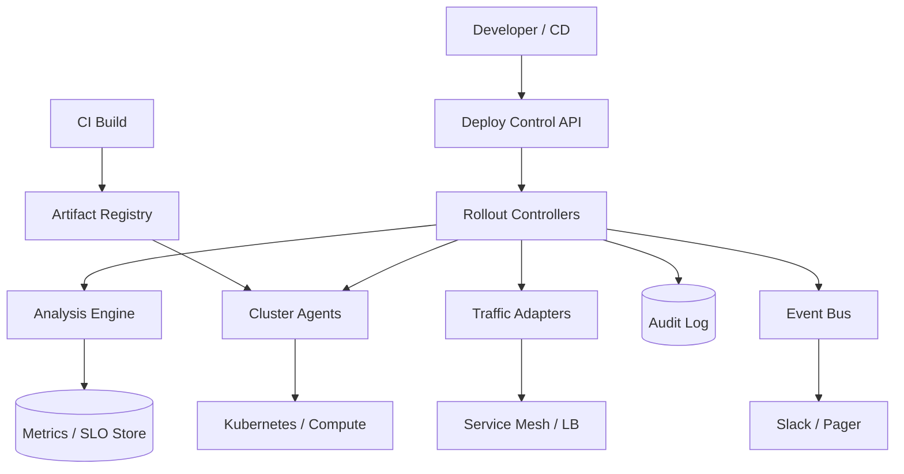
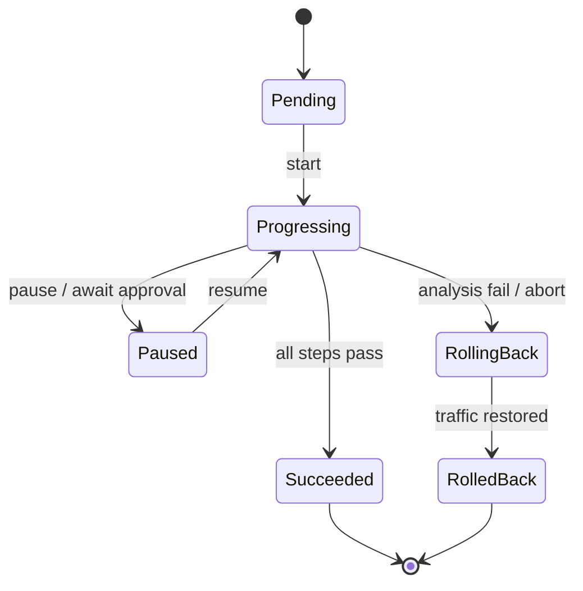

# System Design: Software Deployment with Canaries & Rollback

> **Focus areas:** Progressive delivery · Canary analysis · Automatic rollback · Traffic shifting · Artifact immutability · Blast-radius control  
> **Style:** Core primitive design with progressive scale (10× → 100× → 1,000×)  
> **Product analogy:** Spinnaker / Argo Rollouts / CodeDeploy–class progressive delivery control plane

---

## Table of Contents

1. [Clarify Requirements (Interview Q&A)](#1-clarify-requirements-interview-qa)
2. [Back-of-the-Envelope Estimation](#2-back-of-the-envelope-estimation)
3. [High-Level Design](#3-high-level-design)
4. [Architecture Diagram](#4-architecture-diagram)
5. [Design Deep Dive](#5-design-deep-dive)
6. [Wrap-Up](#6-wrap-up)
7. [Deeper / Related Interview Questions](#7-deeper--related-interview-questions)

---

## 1. Clarify Requirements (Interview Q&A)

### 1.0 What this is / is not

| This is | This is not |
|---------|-------------|
| A **deployment control plane** that rolls out immutable artifacts with **canary → progressive promote → rollback** | CI system that builds code (Jenkins/GitHub Actions)—we consume artifacts |
| Metrics-driven automated analysis gates | Feature-flag product (LaunchDarkly)—complementary |
| Support for k8s services, VMs, maybe functions | Hardware/BIOS OTA for devices (separate problem) |
| Fast rollback to last known good | DB schema migration framework (must coordinate, not own) |

### 1.1 Functional Requirements

| # | Question | Expected answer | Design implication |
|---|----------|-----------------|--------------------|
| F1 | What do we deploy? | Container images / AMIs / packages to services | Artifact registry integration |
| F2 | Environments? | dev → staging → prod; multi-region prod | Pipeline graphs; promotion |
| F3 | Canary definition? | % traffic or % instances; bake time; success metrics | Traffic split + analysis engine |
| F4 | Traffic shifting? | Service mesh / LB weights / parallel stacks | Pluggable traffic managers |
| F5 | Rollback triggers? | SLO burn, error rate, latency, custom queries, manual | Automated + one-click |
| F6 | Rollback speed? | Minutes to last known good | Keep previous version warm |
| F7 | Approval gates? | Optional human approve before 100% | Policy engine |
| F8 | Multi-service? | MVP single service; later coordinated | Don’t orchestrate distributed tx |
| F9 | Config vs code? | Versioned config as artifact or ref | Pin config digest with deploy |
| F10 | Secrets? | Injected by platform; not baked | Reference by version |
| F11 | Wave deploys? | Region/cell waves for large fleets | Scheduler with pauses |
| F12 | Observability? | Deploy markers on metrics; audit log | Emit events |
| F13 | Conflicts? | One active rollout per service env | Lock / lease |
| F14 | Hotfix? | Out of band; document | Emergency path |

**MVP scope:**

1. Register deployment pipeline for a service (artifact → canary → 100%).
2. Start rollout; shift 5% → analyze → 25% → 50% → 100% (configurable steps).
3. Automatic rollback on failed analysis or manual abort.
4. Audit trail: who/what/when/metrics snapshots.
5. Integrate with k8s Deployments or ReplicaSets + Ingress/mesh weights.
6. Pause / resume / promote-now (with authz).

**Out of MVP:**

- Multi-service atomic deploy
- Automatic schema migrate/rollback
- ML anomaly detection as sole gate
- Multi-cloud abstract drivers beyond 1–2

### 1.2 Non-Functional Requirements

| # | Target |
|---|--------|
| N1 Control-plane availability | 99.95% (deploy during incidents matters) |
| N2 Rollback start | < 1 minute decision→action for hot path |
| N3 Analysis correctness | Low false rollback; tunable; prefer safety |
| N4 Scalability | Thousands of concurrent rollouts at large scale |
| N5 Security | Signed artifacts; RBAC; break-glass audited |
| N6 Consistency | One rollout authority per service/env |

### 1.3 Cases

**Happy paths**

1. CI publishes image `@sha256:abc` → deploy prod → canary 5% 15m healthy → promote steps → 100%.
2. Canary error rate +2% absolute vs baseline → auto rollback → traffic 100% previous → ticket.
3. Manual bake: pause at 25% overnight → resume.
4. Regional wave: us-east canary+full → us-west → eu.

**Edge / failure**

| Case | Behavior |
|------|----------|
| Metrics pipeline down | Fail closed (pause) or fail open (policy); **default pause** |
| Canary too small statistically | Minimum bake time + min requests before decide |
| Bad baseline (prior also bad) | Compare to windowed SLI / sibling regions |
| Rollback artifact missing | Never garbage-collect last-N versions |
| Two deploys race | Lease; second rejected |
| Partial wave failure | Stop waves; don’t continue |
| Config drift mid-rollout | Pin digest at start |
| Sticky sessions skew canary | Use random header/cookie consistent hash carefully |
| DB incompatible migrate | Pre-check; block deploy if migrate not backward compatible |

### 1.4 Scales

| Metric | Baseline | 10× | 100× | 1,000× |
|--------|----------|-----|------|--------|
| Services | 200 | 2K | 20K | 200K |
| Deploys/day | 500 | 5K | 50K | 500K |
| Concurrent rollouts | 20 | 200 | 2K | 20K |
| Regions/cells | 3 | 10 | 50 | 200 |
| Analysis queries/min | 1K | 10K | 100K | 1M |
| Traffic shifts/min | 100 | 1K | 10K | 100K |

**Jumps:**

- **10×:** Workflow engine; metrics query fan-out cache.
- **100×:** Shard control plane by service hash; region agents.
- **1,000×:** Cell-local deploy agents; hierarchical waves; analysis sampling.

### 1.5 Etc.

**Scope statement:**

> Design a **progressive delivery** system: immutable artifacts, staged traffic/instance canaries, metrics analysis, automatic rollback, and multi-region waves—from hundreds of services to 1000×—without owning CI builds or DB migrations.

---

## 2. Back-of-the-Envelope Estimation

### 2.1 Control-plane load

```text
Baseline 500 deploys/day ≈ 0.006/s avg; peaks ~1 deploy/s
Each rollout: 5 steps × (traffic patch + 10 metric queries × 30 samples)
≈ 5 × (1 + 300) ≈ 1,500 ops / rollout
500 × 1500 = 750K ops/day trivial

1,000×: 500K deploys/day → control plane + metrics query load becomes real
Analysis queries 1M/min → must cache & push metrics, not pull scrape every service naively
```

### 2.2 Rollback SLA math

```text
Detect bake every 30s; 3 consecutive bad windows → ~90s detect
Traffic shift API p99 5s; pod ready 30–60s if scale new
Keep previous ReplicaSet scaled → rollback traffic weight only ≈ seconds–1 min
```

### 2.3 Storage

```text
Rollout records 10 KB × 500/day × 365 ≈ 1.8 GB/year
Metric snapshots larger—store references + small digests; raw in TSDB
```

---

## 3. High-Level Design

### 3.1 Core concepts

```text
Application / Service
  └── Environment (prod-cell-a)
        └── Pipeline (strategy: canary)
              └── Rollout {
                    id, artifact_digest, config_digest,
                    steps[], status, started_by,
                    baseline_version, canary_version
                  }
```

**Rollout state machine:**

```text
pending → progressing → paused ⇄ progressing
                     → succeeded
                     → failed → rolling_back → rolled_back
                     → aborted
```

**Step example:**

```yaml
steps:
  - setWeight: 5
    pause: { duration: 15m }
    analysis: { templates: [error-rate, p99-latency] }
  - setWeight: 25
    pause: { duration: 15m }
    analysis: ...
  - setWeight: 100
```

### 3.2 APIs

| Method | Path | Purpose |
|--------|------|---------|
| POST | `/rollouts` | Start rollout |
| GET | `/rollouts/{id}` | Status |
| POST | `/rollouts/{id}/pause` | Pause |
| POST | `/rollouts/{id}/resume` | Resume |
| POST | `/rollouts/{id}/promote` | Skip to next/full |
| POST | `/rollouts/{id}/rollback` | Force rollback |
| GET | `/services/{id}/versions` | Last known good history |
| PUT | `/pipelines/{id}` | Strategy config |

### 3.3 Components

```text
CI --> Artifact Registry (signed)
          |
          v
   Deploy API / UI --> Rollout Controller (workflow)
          |                |           |
          |                v           v
          |         Analysis Engine  Traffic Manager Adapter
          |                |           | (mesh/LB/k8s)
          |                v           v
          |           Metrics TSDB   Cluster Agents
          v
     Audit + Event Bus --> Notifications / Incident hooks
```

### 3.4 Traffic shifting strategies

| Strategy | Pros | Cons | Deal-breaker |
|----------|------|------|--------------|
| **Weight % (mesh/LB)** | True traffic canary | Needs mesh/LB support | None if available |
| Instance % (pods) | Simple k8s | Uneven traffic if skew | OK MVP |
| Parallel stack + DNS | Easy rollback | Slow; sticky DNS | Not for fast canary |
| Header-based canary | Good for internal testers | Not representative | Supplement only |

**Choice:** prefer weighted traffic; fall back to replica percent.

### 3.5 Analysis engine

Compare **canary cohort** vs **baseline cohort** (or previous window):

| Metric | Fail if |
|--------|---------|
| Error rate | canary > baseline + abs_thresh AND relative |
| Latency p99 | similar |
| Saturation | CPU thrash |
| Business KPI | checkout success ↓ |
| Custom PromQL | user-defined |

**Decision:** `pass` / `fail` / `inconclusive` (not enough data → wait, don’t promote).

Statistical notes (interview):

- Minimum request count N before fail.
- Multiple consecutive failing intervals.
- Optional Mann-Whitney on latency distributions (Phase 2).

### 3.6 Rollback mechanics

1. Mark rollout `rolling_back`.
2. Set traffic weight baseline=100%, canary=0% **first** (fast).
3. Scale down canary pods; keep artifacts.
4. Emit `DeployRollback` marker; notify.
5. Optionally auto-open incident with analysis snapshots.

**Last known good (LKG):** pointer updated only on `succeeded`. Rollback always to LKG digest.

### 3.7 Coordination with schema changes

Rules to state:

- Expand/contract migrations only; deploy system checks `migration_compat: backward|forward` metadata.
- Block canary if incompatible flag set without expand completed.
- Rollback of code must remain compatible with expanded schema.

### 3.8 Trade-offs

| Option | Pros | Cons | Deal-breaker |
|--------|------|------|--------------|
| Blue/Green only | Simple rollback | 2× resources; coarse | Costly at scale |
| Rolling update no analysis | Native k8s | Slow fail discovery | Misses canary value |
| Feature flags instead | Instant off | Code complexity; not artifact | Complementary not replace |
| Push metrics vs pull | Lower query load | More plumbing | Needed at 100× |

**Choice:** progressive canary with analysis; blue/green optional for special services; flags for UX toggles.

---

## 4. Architecture Diagram





---

## 5. Design Deep Dive

### 5.1 Reliability

- Controller leases prevent split-brain dual rollouts.
- Steps are idempotent (`setWeight(25)` safe to retry).
- If controller crashes, another picks lease and reconciles desired step.
- Artifact immutability by digest; never “latest” tag in prod.
- Fail-safe: analysis unavailable → **pause** (config: `onMetricsOutage=pause|rollback|ignore`).

### 5.2 Scalability

- Shard rollouts by `hash(service_id)`.
- Region agents execute local traffic shifts; central plans waves.
- Analysis: push sidecar evaluations or recording rules for canary SLIs.
- At 1,000×: hierarchical org→cell controllers.

### 5.3 Maintainability

- Pipeline-as-code in git; controller renders.
- Audit everything for SOC2.
- Dry-run mode; chaos “fail canary metrics”.
- Version analysis templates centrally.

---

## 6. Wrap-Up

| Decision | Choice |
|----------|--------|
| Unit | Immutable artifact digest |
| Strategy | Weighted canary + bake + analysis |
| Rollback | Traffic first to LKG |
| Metrics outage | Pause by default |
| Scale | Agents + sharded controllers |

**Phases:** MVP k8s+weights+error/latency → waves → push analysis → multi-service awareness (non-atomic).

---

## 7. Deeper / Related Interview Questions

**Q1. Canary at 1% with low QPS—why inconclusive?**  
A: Not enough samples; enforce min requests or longer bake; don’t promote on ignorance.

**Q2. Why not always blue/green?**  
A: Double capacity cost; coarse; canary finds issues cheaper with small exposure.

**Q3. Feature flags vs canary?**  
A: Flags toggle code paths instantly; canaries validate **artifact+config** on real infra. Use both.

**Q4. How do sticky sessions bias canary?**  
A: Heavy users stick to baseline; use consistent hashing on randomized canary cookie for new sessions or mesh weights at request level.

**Q5. Automatic rollback flapping?**  
A: Consecutive windows; cooldown; require clear fail; human lock after N rollbacks/day.

**Q6. Who is source of truth for desired version?**  
A: Control plane rollout object; cluster agents reconcile toward it.

**Q7. Deploy during metrics outage?**  
A: Policy pause—shipping blind is how you amplify outages.

**Q8. Multi-region compose?**  
A: Waves with soak; don’t parallel all regions on first push of risky change.

**Q9. Hotfix path?**  
A: Bypass bake with break-glass role; still audit; optionally still keep instant rollback ready.

**Q10. How to version configs?**  
A: Config digest pinned with app digest in rollout; configmaps immutable.

**Q11. Kubernetes RollingUpdate enough?**  
A: No analysis/auto-rollback intelligence; wrap with Rollouts controller.

**Q12. False positive on diurnal traffic?**  
A: Compare canary vs baseline **simultaneous** cohorts, not vs yesterday only.

**Q13. Deal-breaker: mutable `latest` tag?**  
A: Yes for prod—digests only.

**Q14. Crashloop vs high error rate?**  
A: Both fail analysis; crashloop may fail before traffic shift—watch pod ready/restart metrics.

**Q15. Coordinating 10 services?**  
A: Don’t atomic 2PC; use expand/contract + ordered pipelines; or flag-based dark launch.

**Q16. Security of traffic adapter creds?**  
A: Short-lived per-cluster creds; agents in-cluster; least privilege.

**Q17. Canary for stateful services?**  
A: Harder; often instance replacement with backups; or dual-write patterns—call out separately.

**Q18. SLI vs raw CPU?**  
A: Prefer customer SLIs; CPU as secondary saturation signal.

**Q19. Rollout ID propagation?**  
A: Trace baggage / header `x-deploy-version` for metric slicing.

**Q20. How to store LKG?**  
A: Pointer in control DB; retain images in registry with GC protect policy last N.

**Q21. Progressive delivery vs continuous deployment?**  
A: CD may push often; progressive adds automated risk control on path to 100%.

**Q22. Analysis in-process vs PromQL?**  
A: Start PromQL templates; later dedicated evaluator for scale.

**Q23. Partial success step?**  
A: Reconcile loop until weight observed matches desired.

**Q24. Clock skew on bake timers?**  
A: Controller time; steps use absolute `promote_after` timestamps.

**Q25. Multi-tenant SaaS deploy system?**  
A: Hard isolation of agents/credentials per tenant; noisy neighbor on analysis queries.

**Q26. What metrics prove system works?**  
A: Change failure rate, MTTR rollback, % auto-rollback correct, deploy frequency.

**Q27. Interactive vs automated approve?**  
A: Risk tiers: tier-0 requires human at 50%; tier-2 fully auto.

**Q28. Shadow traffic?**  
A: Send copied reqs to canary without user response—good complement before weighted.

**Q29. Why agents not central kubectl?**  
A: Blast radius, credentials, scale, regional independence.

**Q30. Staff summary?**  
A: “Canary without automated rollback is a dashboard; rollback without canary is a coin flip—ship both with immutable digests.”

---

### Appendix — Example analysis template

```yaml
apiVersion: deploy/v1
kind: AnalysisTemplate
metadata: { name: error-rate }
spec:
  metrics:
    - name: error-rate
      interval: 30s
      successCondition: result[0] < 0.01
      failureLimit: 3
      provider:
        prometheus:
          query: |
            sum(rate(http_requests{status=~"5..",version="{{canary}}"}[1m]))
            /
            sum(rate(http_requests{version="{{canary}}"}[1m]))
```

### Appendix — Wave plan

```text
wave 1: cell-a canary→100%
soak 2h
wave 2: cell-b, cell-c
soak
wave 3: remaining cells
stop on any wave rollback
```

### Appendix — Failure mode matrix

| Failure | System behavior |
|---------|-----------------|
| Canary 5xx spike | Rollback weights |
| Agent unreachable | Pause that cluster; alert |
| Registry outage | Cannot start new; rollback still uses local cached images |
| Dual controller active | Lease prevents |

---

---

### Appendix D — Control-plane lease & reconciliation

```text
RolloutController leader per service/env:
  acquires lease in etcd/SQL with TTL 10s, heartbeat 3s
  desired = Rollout.steps[i].weight
  observed = TrafficAdapter.getWeights(service)
  if observed != desired: setWeights(desired)  # idempotent
  if analysis.fail: desired = rollback weights; status=rolling_back
```

Split-brain prevention: fencing token on lease; adapters reject stale generation.

### Appendix E — Metrics cohort labeling

Emit on every request (mesh filter):

```text
deploy_version = canary|baseline digest
rollout_id = r_123
```

Analysis queries **must** slice by these labels. Without them, canary comparison is fiction.

### Appendix F — Decision matrix: pause vs rollback vs continue

| Observation | Action |
|-------------|--------|
| Error rate ↑ but sample < N | Wait (inconclusive) |
| Error rate ↑ and N met, 3 windows | Rollback |
| Metrics outage | Pause (default) |
| Latency ↑ only on cold start pods | Extend bake; don’t fail yet |
| Manual abort | Rollback immediately |
| Business KPI ↓ within noise | Continue / human approval tier-0 |

### Appendix G — Interview scoreboard

Say out loud:

1. Immutable digests, never `:latest`.
2. Traffic shift before scale-down on rollback.
3. Inconclusive ≠ pass.
4. Schema expand/contract coordination.
5. One rollout lease per service/env.

---

### Appendix H — Progressive scale narrative

- **Baseline:** one controller + k8s adapter; PromQL analysis; 5→25→100 weights.
- **10×:** workflow engine, shared analysis templates, deploy markers in traces.
- **100×:** region agents, rollout sharding, recording rules for canary SLIs.
- **1,000×:** cell-local execution, hierarchical waves, push-based analysis to avoid metrics-query meltdown.

### Appendix I — Anti-patterns (instant interviewer traps)

| Anti-pattern | Why it fails |
|--------------|--------------|
| Promote on green dashboards without cohort labels | Looking at mixed traffic |
| Rollback by “redeploy latest from main” | Non-deterministic; may worsen |
| Canary 0.1% of tiny service | Never reaches significance |
| Ignore schema compatibility | Code rollback leaves broken reads |
| Parallel prod waves worldwide day-1 | Correlated global outage |

---

*End of software deployment canary/rollback design.*

