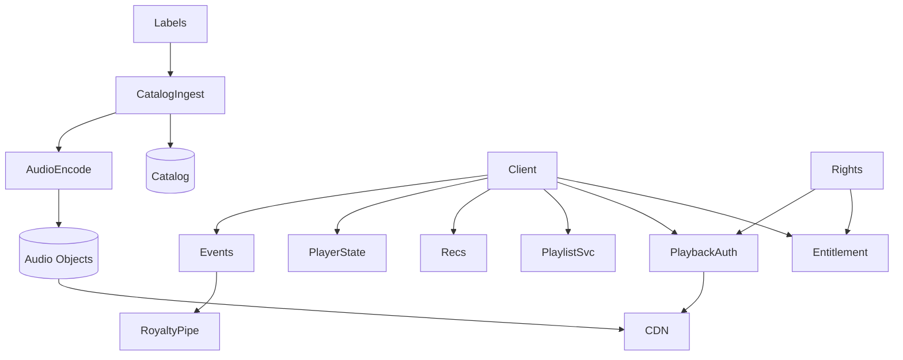

# System Design: Spotify

> **Focus areas:** Music catalog · Audio CDN · Gapless playback · Playlists · Offline · Lyrics sync · Recommendations · Podcasts hook · Rights
> **Style:** End-to-end product design with progressive scale (10× → 100× → 1,000×)
> **Quality bar:** Domain-specific numbers and failure modes; explicit trade-offs; deal-breakers; CDN / ABR / encoding / DRM where relevant
> **Interview theme:** Senior / Staff — **Spotify-like audio streaming**

---

## Table of Contents

1. [Clarify Requirements (Interview Q&A)](#1-clarify-requirements-interview-qa)
2. [Back-of-the-Envelope Estimation](#2-back-of-the-envelope-estimation)
3. [High-Level Design](#3-high-level-design)
4. [Architecture Diagram](#4-architecture-diagram)
5. [Design Deep Dive](#5-design-deep-dive)
6. [Wrap-Up](#6-wrap-up)
7. [Deeper / Related Interview Questions](#7-deeper--related-interview-questions)
8. [Appendices](#8-appendices)

---

## 1. Clarify Requirements (Interview Q&A)

Goal: design a **Spotify-like** audio streaming platform: huge music catalog, low-latency start, gapless playback, playlists, personalized home/radio, offline downloads, lyrics, and rights-aware delivery.

### 1.0 What this is / is not

| Dimension | This doc | Not this |
|---|---|---|
| Job | Music (+ podcast) streaming & library | Full DAW / music creation suite |
| Media | Audio-first; video optional canvases | Netflix long-form video |
| Rights | Label licensing & reporting | UGC Content ID sole focus |
| Lens | Start latency, personalization, offline | Live concert video SFU |

### 1.1 Functional Requirements

| # | Question | Expected interviewer answer | Design implication |
|---|---|---|---|
| F1 | Catalog? | Label deliveries + metadata | Ingest + catalog graph |
| F2 | Playback? | Encrypted audio segments / files via CDN | Audio CDN + DRM/encryption |
| F3 | Bitrates? | 96/160/320 kbps + lossless tier optional | Ladder for audio |
| F4 | Playlists? | User + editorial + algo | Playlist service |
| F5 | Offline? | Downloads with limits | Persistent licenses |
| F6 | Discovery? | Home, radio, search, Daily Mix-like | Recsys |
| F7 | Queue? | Player state cross-device | State sync |
| F8 | Lyrics? | Timed lyrics | Sync transcript plane |
| F9 | Social? | Following, sharing (light) | Social graph light |
| F10 | Podcasts? | Episodes in same player optional | Unified playback |
| F11 | Accounts? | Free vs premium entitlements | Feature gates |
| F12 | Scrubbing? | Seek dense | Segmented or ranged files |
| F13 | Gapless/crossfade? | Client + encoding constraints | Encoder + player |
| F14 | Reporting? | Royalty events | Accurate play events |

**MVP scope:**

1. Catalog browse/search; track play via CDN
2. Premium encryption/entitlement; free tier rules
3. Playlists CRUD; liked songs
4. Basic personalized home + radio seed
5. Offline downloads for premium
6. Cross-device playback state (basic)
7. Play event pipeline for royalties
8. Gapless for encoded catalog subset

**Out of MVP:**

- Full lossless hi-fi everywhere
- Complete social network
- Live audio rooms MVP optional

### 1.2 Non-Functional Requirements

| # | NFR | Target |
|---|---|---|
| N1 | Time-to-first-audio | p50 < 200–500ms cached |
| N2 | Stall rate | Very low; audio intolerance high |
| N3 | Availability | 99.95%+ play start |
| N4 | Durability catalog | No silent track loss |
| N5 | Royalty correctness | Auditable play events |
| N6 | Offline security | Encrypted at rest on device |
| N7 | Global | Multi-region catalog reads |
| N8 | Cost | Audio egress << video but non-zero at scale |

### 1.3 Cases

**Happy:** Search/home → play track → gapless next → add playlist → offline sync.  
**Edges:** license territory; track takedown mid-play; free tier skip limits; offline expiry; lyrics desync; viral playlist spike.

| Case | Behavior |
|---|---|
| Takedown | Stop newly started plays; finish policy legal-dependent |
| Skip limit free | Server-authoritative counters |
| Offline expired | Unplayable until renew |
| Cross-device fight | Last command wins with version |
| Missing lyrics | Degrade UI; don't block audio |

### 1.4 Progressive scale

| Metric | Baseline | 10× | 100× | 1,000× |
|---|---|---|---|---|
| MAU | 10M | 100M | 500M | 600M+ |
| Tracks | 10M | 50M | 100M | 100M+ |
| Peak concurrent plays | 100K | 1M | 10M | 50M |
| Avg bitrate | 160 kbps | 160 | 160–320 | tiered |
| Playlist ops/s | 1K | 10K | 100K | 500K |
| Recs QPS | 2K | 20K | 200K | 1M |
| Play events/day | 100M | 1B | 10B | 50B+ |
| CDN hit | 90% | 95% | 98% | 99% |

**Jumps:** 10× multi-region audio CDN + entitlement; 100× playlist/recs cells + royalty pipeline hardening; 1,000× catalog graph + personalization fleet.

### 1.5 Etc. constraints + scope repeat-back

Constraints: label reporting SLAs, territory rights, free-tier abuse, battery on mobile.

> Spotify-like audio streaming: rights-aware catalog, low-latency encrypted audio CDN, playlists/library, personalization, offline, accurate play events—gapless UX and royalty correctness.

---

## 2. Back-of-the-Envelope Estimation

### 2.1 Concurrent audio math

```text
5M concurrent × 160 kbps ≈ 800 Gbps — large but << video Netflix numbers.
```

### 2.2 Catalog storage

```text
100M tracks × avg 5 MB ≈ 500 PB raw across qualities; dedupe encodings; lyrics small.
```

### 2.3 Play events

```text
10B events/day × 200 B ≈ 2 TB/day raw before aggregate; exactly-once-ish billing semantics matter.
```

### 2.4 Playlist hot keys

```text
Celebrity playlist edits + viral adds; shard playlist_id; cache snapshots for read.
```

### 2.5 Latency budget

```text
DNS+TLS+auth+first chunk < few hundred ms; prefetch next track aggressively.
```

### 2.N Bottleneck ranking

1. Egress / edge bandwidth and hit ratio
2. Hot keys (viral titles, celebrity metadata)
3. Processing fleets (encode/ASR/ML)
4. Control-plane fanout (manifests, licenses, personalization)
5. Cold retrieval / long-tail

### 2.N+1 Cost intuition

```text
Storage << egress at watch scale.
Cache hit ratio and codec efficiency are executive levers.
Processing ($GPU/CPU-hours) matters for UGC firehose and ML pipelines.
```

---

## 3. High-Level Design

### 3.1 Planes (critical split)

| Plane | Responsibility | Consistency |
|---|---|---|
| Catalog/rights | Tracks, territories, takedowns | Strong for rights |
| Delivery | Audio objects CDN | Immutable |
| Library/playlists | User collections | Strong per user |
| Player state | Queue/position | Causal per user |
| Personalization | Home/radio | Stale-OK |
| Royalty events | Play reporting | Durable at-least-once + dedup |

**Why this split:** Royalty and rights correctness must not share fate with best-effort recommendations.

### 3.2 Components

1. **Catalog Service** — tracks, albums, artists, territories
2. **Ingest/Encoding** — normalize loudness, multi-bitrate audio
3. **Entitlement** — free/premium/features
4. **Playback Auth** — signed access to audio
5. **Audio CDN** — global edge
6. **Playlist/Library Service** — liked, playlists
7. **Player State Service** — queue sync
8. **Search** — text + fuzzy
9. **Recs / Radio** — embeddings + rankers
10. **Lyrics Service** — timed lines
11. **Offline License** — persistent
12. **Event Pipeline** — plays for royalties
13. **Takedown/Rights** — emergency stop
14. **Podcast module** (optional unified)
15. **Notifications** — new releases
16. **Abuse** — scraping/download farms

### 3.3 APIs (sketch)

```text
GET  /v1/tracks/{id}
GET  /v1/playback/{track_id} → urls[], format, license?
POST /v1/playlists
POST /v1/playlists/{id}/items
PUT  /v1/player/state
POST /v1/events/play {track_id, ts, duration_played, offline?}
GET  /v1/home
GET  /v1/search?q=
POST /v1/offline/sync
```

### 3.4 Data model (core)

```text
Track{id, album_id, duration_ms, isrc, loudness}
Delivery{track_id, bitrate, codec, path}
Rights{track_id, country, window}
Playlist{id, owner, name, version}
PlaylistItem{playlist_id, idx, track_id, added_at}
PlayEvent{event_id, user_id, track_id, played_ms, context, ts}
```

### 3.5 Trade-offs

| Topic | Choice | Why |
|---|---|---|
| File vs segmented audio | Segmented or ranged | Seek + CDN |
| Gapless | Encoder padding + client | UX differentiator |
| Play events | Client beacons + server validate | Royalty audits |
| Recs | Batch mixes + online | Latency vs freshness |
| Free tier | Server-side limits | Abuse resistance |

### 3.6 Deal-breakers

| Temptation | Failure |
|---|---|
| Trust client for royalty duration only | Fraudulent payouts |
| Unencrypted offline store | Piracy SEV |
| Single region catalog | Global outage |
| Playlist full rewrite every add | Write amp / races |

---

## 4. Architecture Diagram

### 4.1 C4-ish / flow



### 4.2 Play sequence

```text
Resolve track → entitlement → signed URLs → stream/prefetch next → emit play event after threshold.
```

### 4.3 Takedown

```text
Rights marks track blocked → playback auth denies new sessions → CDN can purge optional → clients stop on next license refresh.
```

---

## 5. Design Deep Dive

### 5.1 Reliability (data loss prevention, retries, idempotency, rate limits, backpressure)

1. Play event_id idempotent; dedup store for royalty.
2. Playlist updates versioned; CAS on version.
3. Takedown propagation SLO measured in minutes or less.
4. Offline licenses expire; clock-skew tolerant.
5. Rate-limit scraping patterns on track audio.
6. Encode loudness normalize idempotently.
7. Player state sync with vector clocks / versions.
8. CDN purge hooks for critical rights emergencies.
9. Backpressure on event pipeline with durable buffer.
10. Poison track encodings quarantined without killing catalog row incorrectly.

### 5.2 Scalability (scale up/down, sharding, storage tiers, parallelization)

| Scale | Architecture moves |
|---|---|
| 1× | Object storage + CDN; Postgres catalog; Redis player state |
| 10× | Shard playlists; event bus; multi-region entitlement |
| 100× | Catalog cells; ANN recs; royalty lakehouse |
| 1,000× | Graph metadata platform; extreme personalization; global rights complexity |

### 5.3 Maintainability (ops, observability, migrations, multi-tenant)

- Territory rules as data with audit.
- Encoder loudness policy versioned.
- Canary player clients.
- Royalty reconciliation dashboards with labels.
- Feature flags for free-tier experiments.

### 5.4 Audio delivery specifics

Prefer Ogg/AAC/MP3 ladders; prefetch next; keep buffers modest for skippy UX; canvas video is separate low-bitrate stream.


### 5.5 Gapless & crossfade

Encoder delay/padding metadata; client mixes; not all catalog gapless day one.


### 5.6 Playlists at scale

Append-friendly structures; snapshot cache for large playlist reads; collaborative playlists need OT/CRDT or lock.


### 5.7 Royalty event semantics

Define what counts as a stream (e.g., 30s); offline upload on reconnect; fraud filters.


### 5.8 Personalization

Embeddings for tracks/users; session features; exploration; editorial overlays.


### 5.9 Progressive scale

1× single region → 10× multi-region CDN → 100× recs/royalty hardening → 1,000× global rights+graph.


---

## 6. Wrap-Up

### 6.1 Designed

Spotify-like audio: catalog/rights, encrypted CDN audio, playlists/library, player state, recs, offline, royalty-grade events.

### 6.2 Decisions to defend

1. Rights/entitlement plane separate from CDN bytes
2. Server-authoritative free-tier limits
3. Versioned playlists
4. Idempotent play events with dedup
5. Prefetch-next for UX
6. Offline encrypted + expiring licenses
7. Batch+online recs with fallbacks
8. Takedown fast path

### 6.3 Risks

- Royalty disputes
- Takedown lag
- Playlist races
- Scraping farms
- Lyrics license

### 6.4 45-minute plan

| Min | Focus |
|---|---|
| 0–5 | Audio vs video; rights |
| 5–15 | Catalog + delivery |
| 15–25 | Playlists + player state |
| 25–35 | Recs + offline |
| 35–45 | Royalty events + scale |

### 6.5 Closer

> **Spotify**: rights-aware catalog, low-latency audio CDN, versioned playlists, offline DRM, personalization with fallbacks, auditable play events.

---

## 7. Deeper / Related Interview Questions

### Q1. Why audio still needs CDN hierarchy?

Global start latency + peak fanout on viral tracks/playlists; origin protection.

### Q2. How to count a 'stream'?

Policy threshold (e.g. 30s) + fraud filters; offline reconcile.

### Q3. Lossless tier impact?

Much higher egress/storage; entitlement gated; separate encodes.

### Q4. Crossfade server or client?

Client with encoder metadata; server doesn't remix per listen.

### Q5. Radio vs playlist?

Radio is endless generator; playlist is finite editable list.

### Q6. Lyrics sync correctness?

Timed lines with offsets; user-reported fixes; don't block audio.

### Q7. Celebrity playlist hotspot?

Read snapshots cached; shard writes; eventual item order repair.

### Q8. Why not store audio in DB?

Object store + CDN; DB for metadata only.

### Q9. Territory mismatch mid-travel?

Re-check entitlement periodically; GPS spoofing heuristics.

### Q10. Embedding index ops?

Rebuild/alias swap; dual read during migration.

### Q11. Where is strong consistency mandatory?

ACL/publish/entitlement and private media access; not counters.

### Q12. Signed URLs vs CDN cache?

Don't put per-user uniqueness into segment cache keys; use cookies/tokens.

### Q13. HLS vs DASH vs CMAF?

Dual manifests over shared CMAF segments when possible.

### Q14. #1 cost lever at watch scale?

Edge hit ratio / offload; then codec efficiency.

### Q15. Premiere stampede controls?

Pre-warm, shield, coalesce, scale license/playback, shed noncritical work.

### Q16. Idempotent jobs?

Deterministic output keys + CAS publish.

### Q17. ABR oscillation?

Dwell + asymmetric thresholds + buffer hysteresis.

### Q18. Consistent hashing where?

Shard stateful workers/comments—not static CDN GETs.

### Q19. QoE vs QPS?

Talk rebuffer/startup/bitrate; QPS alone is weak.

### Q20. Multi-CDN when?

~100× for resilience/pricing; needs steering.

### Q21. Offline + DRM?

Persistent licenses, windows, secure storage, online renew.

### Q22. Hot metadata?

Cache + cell isolation; decouple from byte paths.

### Q23. Encode backpressure?

Priority queues; shed archival reencodes.

### Q24. Manifest personalization risk?

Can kill cache hit ratio—keep media manifests stable.

### Q25. Deal-breaker example?

Serving one giant progressive file without ABR at global scale.

---

## 8. Appendices

### A1. Spotify domain notes

**Normalization:** replay gain / loudness (-14 LUFS class) for consistent UX.  
**ISRC/UPC:** identity for rights.  
**Free tier:** skip caps, shuffle constraints—server enforced.  
**Podcasts:** longer files, different royalty; same player shell.


### A-Z. Interview checklist

- [ ] Clarified product shape and non-goals
- [ ] Progressive scale jumps that change architecture
- [ ] Control plane vs data/bytes plane
- [ ] CDN / ABR / ladder / DRM called out where relevant
- [ ] Hot-key and failure modes
- [ ] Idempotency and publish gates
- [ ] QoE / domain SLOs not just QPS
- [ ] Cost levers
- [ ] Security / abuse / compliance
- [ ] Phased rollout + kill switches


---

## Appendix: Cross-cutting media patterns (interview ammunition)

### Encoding ladder reference

| Rung | Resolution | H.264 bitrate band | Typical role |
|------|------------|--------------------|--------------|
| L0 | 256×144 | 100–200 kbps | Extreme constrained |
| L1 | 426×240 | 300–500 kbps | Poor mobile |
| L2 | 640×360 | 600–1000 kbps | Mobile floor |
| L3 | 854×480 | 1.0–1.8 Mbps | SD |
| L4 | 1280×720 | 2.5–5 Mbps | HD |
| L5 | 1920×1080 | 4.5–9 Mbps | FHD |
| L6 | 2560×1440 | 8–14 Mbps | QHD optional |
| L7 | 3840×2160 | 12–35 Mbps | 4K (HEVC/AV1) |

Dual-codec (H.264 + AV1/HEVC); packaged ≈ 1.6–2.8× mezzanine.

### ABR loop

```text
throughput_EMA + buffer → downswitch if danger; upswitch with dwell/hysteresis
QoE: startup, rebuffer ratio, avg bitrate, switches, abandon
```

### CDN hierarchy

```text
PoP → mid-tier → origin shield → object store
Immutable versioned segments; personalization in control plane only
```

### DRM

```text
CENC packager; license = entitlement + device level; offline persistent TTL
```

### Scale jumps

| Jump | Moves |
|------|-------|
| 10× | Multi-AZ, queues, shield, caches |
| 100× | Multi-region, cells, multi-CDN, dedicated planes |
| 1,000× | Codec economics, edge experiments, compliance cells |

### Reliability checklist

Idempotent chunks/jobs; publish CAS gate; no orphan manifests; encode backpressure; poison quarantine; key rotation; immutable segments.

### Cost levers

Hit ratio; codec bits; ladder density; cold tiering; prefetch discipline.

### Consistency

Strong: ACL/publish/entitlement. Eventual: counters/search/recs. WORM: segments.

### Deal-breakers

Progressive-only MP4 globally; user-specific segment URLs; sync ML on upload path; DB BLOBs for media; skip DRM on licensed premium.

### Algorithms

Consistent hash shards; Bloom dup; fingerprints/MinHash; WFQ encode; EMA ABR; ANN recs.

### Math templates

```text
cdn_egress ≈ watch_hours * 3600 * bitrate / 8
origin ≈ cdn_egress * (1 - hit_ratio)
mezz/day ≈ uploads/day * dur_s * mezz_bitrate / 8
```

### Reusable closer

> Bytes plane (CDN) ≠ control plane (entitlement/metadata/processing). Atomic publish. QoE. Egress. Idempotent pipelines. Progressive cells/shields.
