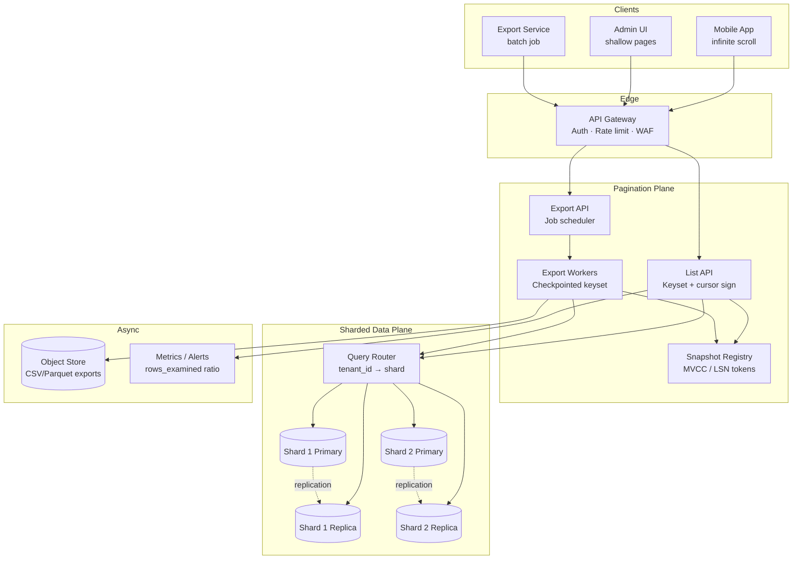

# System Design: Stable Pagination Over Massive Datasets

> **Focus areas:** Keyset/cursor vs offset · Consistent snapshots · Live writes during pagination · Deep-page performance · API contracts · Index design  
> **Style:** End-to-end data-access design with progressive scale (10× → 100× → 1,000×)  
> **Quality bar:** Interview-passable for senior/staff loops — explicit trade-offs, failure modes, and scale jumps

---

## Table of Contents

1. [Clarify Requirements (Interview Q&A)](#1-clarify-requirements-interview-qa)
2. [Back-of-the-Envelope Estimation](#2-back-of-the-envelope-estimation)
3. [High-Level Design](#3-high-level-design)
4. [Architecture Diagram](#4-architecture-diagram)
5. [Design Deep Dive](#5-design-deep-dive)
6. [Wrap-Up](#6-wrap-up)
7. [Deeper / Related Interview Questions](#7-deeper--related-interview-questions)

---

## 1. Clarify Requirements (Interview Q&A)

The goal of this phase is to **bound the problem**: what we build, what we defer, and at what scale we must succeed.

### 1.0 What this is / is not

| Dimension | This doc | Not this |
|-----------|----------|----------|
| Job | Design a **pagination layer** for querying **massive, mutating datasets** with stable, correct cursors | A generic CRUD API or a full search engine |
| Scope | List/query APIs over billions of rows with live writes, deep pages, and snapshot semantics | GraphQL tutorial or OFFSET/LIMIT demo |
| Lens | Correctness under concurrency, index physics, snapshot isolation, cursor contracts | "Just use Elasticsearch" hand-wave |
| Users | Product APIs (feeds, admin tables, audit logs), internal data platforms, export jobs | OLAP warehouse scan design (related but separate) |

### 1.1 Functional requirements

| # | Question to ask | Expected / typical interviewer answer | Design implication |
|---|-----------------|---------------------------|--------------------|
| F1 | What is being paginated? | Time-ordered events (audit log, activity feed), ranked lists (top products), or filtered search results (orders by status+date) | Sort key + tie-breaker must match index; composite cursors |
| F2 | Who are the clients? | Mobile apps (infinite scroll), admin UIs (page numbers), batch exporters (walk entire dataset), partner webhooks | Different page sizes, rate limits, and snapshot needs |
| F3 | Sort order? | Usually **descending created_at** (newest first) or ascending id for exports | Index direction matters; cursor encodes last seen tuple |
| F4 | Filters? | Tenant-scoped, status filters, date ranges, full-text pre-filter | Push filters into index prefix; cursor must include filter fingerprint |
| F5 | Page size? | 20–100 for UI; 500–5K for exports | Cap max `limit`; charge/limit deep export separately |
| F6 | Bidirectional pagination? | Forward (`after`) MVP; backward (`before`) nice for chat UIs | Symmetric keyset predicates; store `(sort_key, id)` not offset |
| F7 | Total count / page numbers? | Often **not** required for infinite scroll; admin wants approximate count | Avoid `COUNT(*)` on hot path; separate async counter or "has_more" |
| F8 | Stable snapshot during multi-page walk? | **Yes** for exports/compliance; **eventual OK** for live feeds showing new items at top | Snapshot token vs live tail; document duplication/skips |
| F9 | Behavior when rows mutate mid-pagination? | Define per product: hide updates, show updates, or freeze view | MVCC snapshot, version tokens, or accept drift |
| F10 | Deletes mid-pagination? | Row disappears → may cause skip unless tombstone in snapshot | Snapshot includes tombstones; or keyset naturally skips deleted |
| F11 | Inserts mid-pagination? | New rows at head shouldn't appear in middle of export | Snapshot cutoff timestamp / xmin / read view |
| F12 | Deep pages (page 10,000)? | Must work without scanning 200K offset rows | **Keyset only**; reject OFFSET for deep pages |
| F13 | Cross-shard global order? | Per-tenant or per-partition order usually enough | Global merge only if required — expensive |
| F14 | Cursor opacity? | Opaque signed/encrypted blob to clients | Prevents tampering; encodes position + snapshot + filter hash |
| F15 | Export entire dataset? | Async job with checkpointed keyset, not synchronous API | Job queue + object storage output |

**MVP functional scope (lock this with interviewer):**

1. **Keyset pagination API** with opaque cursor, `limit`, `has_more`, and stable sort `(sort_col DESC, id DESC)`.
2. **Tenant-scoped lists** with mandatory filter prefix in index (e.g., `tenant_id, created_at, id`).
3. **Live feed mode:** forward pagination without snapshot — new inserts may appear on page 1 only; mid-list drift documented.
4. **Export/snapshot mode:** snapshot token pins a consistent read view for multi-hour walks.
5. **Reject OFFSET** beyond shallow pages (e.g., offset ≤ 1000) with `400` directing clients to cursors.
6. **Idempotent page fetch** — same cursor returns same rows (within snapshot TTL).
7. Basic rate limits per tenant; metrics on cursor age, page depth, p99 latency.

**Out of MVP (explicitly defer):**

- Arbitrary multi-column sort without supporting index
- Real-time total count for billion-row tables
- Bi-directional pagination with edit-in-place reordering
- Federated pagination across heterogeneous stores
- Client-side encrypted cursors with zero server state
- Perfect global ordering across all shards without merge service

### 1.2 Non-functional requirements

| # | Question | Expected answer | Target |
|---|----------|-----------------|--------|
| N1 | Latency per page? | Interactive UI | p50 < 50ms, p99 < 200ms for page size ≤ 100 on indexed path |
| N2 | Deep page latency? | Must not degrade with page number | p99 < 300ms at "page" equivalent depth 1M+ (keyset) |
| N3 | Availability? | Tier-1 read path | 99.95% list API; degrade to cached first page if needed |
| N4 | Consistency? | Snapshot exports: repeatable read; live feeds: monotonic per cursor | Document per mode |
| N5 | Durability | Pagination is read-only; writes separate | Snapshot metadata durable if server-stored |
| N6 | Throughput | Read-heavy | Baseline 5K QPS peak list reads; scale horizontally |
| N7 | Correctness | No duplicates/skips within snapshot walk | Property-test cursor monotonicity |
| N8 | Security | Cursor tampering, IDOR | Signed cursor; authz on every query |
| N9 | Cost | Index storage dominates | Avoid redundant indexes; tier cold partitions |
| N10 | Operability | Detect bad indexes / seq scans | Log `rows_examined/limit` ratio; alert on > 10× |

### 1.3 Cases (User Flows & Edge Cases)

**Happy paths**

1. Mobile feed: client requests first page → receives 30 items + `next_cursor` → scrolls with cursor → no duplicates within session.
2. Admin audit export: starts export with `snapshot=2026-08-06T00:00:00Z` → walks 50K pages via keyset → CSV complete with every row that existed at snapshot time.
3. Filtered orders list: `status=shipped&sort=created_at_desc` → cursor encodes filter hash → changing filter invalidates cursor (`400`).
4. Shallow jump: UI page 5 via offset allowed for first 1K rows only → deeper navigation uses cursor from page-5 response.
5. Empty page: filter matches zero rows → `items=[]`, `has_more=false`, no cursor.

**Edge / failure cases**

| Case | Behavior |
|------|----------|
| Expired snapshot token | `410 Gone` + restart export from new snapshot |
| Tampered cursor | Signature verify fails → `400 invalid_cursor` |
| Duplicate sort keys | Tie-breaker `id` (or `(tenant_id, id)`) guarantees total order |
| Row updated mid live-pagination | Live mode: row may change content between page 2 and page 3; snapshot mode: frozen version |
| Row deleted mid live-pagination | Keyset may **skip** deleted row (acceptable in live mode); snapshot retains tombstone until export ends |
| Hot partition (all writes same second) | Millisecond tie-breaker or snowflake id; avoid pure `created_at` without id |
| Clock skew on created_at | Never use client timestamps for sort; server-generated monotonic ids preferred |
| Concurrent export + heavy writes | Snapshot isolation or MVCC xmin; watch long-running txn bloat |
| Client replays old cursor | Returns same page (idempotent); may be stale in live mode — OK |
| Page size 10,000 abuse | Hard cap 500 sync / 5K async export; 429 |
| Index missing for sort+filter | Query planner seq scan → circuit break at 2s; alert |
| Unicode / collation sort surprises | Define collation explicitly; test cursor boundary strings |
| NULL in sort column | NULLS FIRST/LAST fixed in API contract; cursor encodes null sentinel |

### 1.4 Scales (Progressive)

Establish a **baseline**, then stress-test at 10× / 100× / 1,000×.

| Metric | Baseline | 10× | 100× | 1,000× |
|--------|----------|-----|------|--------|
| Total rows (table) | 500M | 5B | 50B | 500B |
| Rows per tenant (p99) | 2M | 20M | 200M | 2B |
| Peak list read QPS | 5K | 50K | 500K | 5M |
| Peak write QPS (inserts) | 2K | 20K | 200K | 2M |
| Avg row size | 1 KB | 1 KB | 1.5 KB | 2 KB |
| Page size (UI) | 50 | 50 | 50 | 50 |
| Concurrent export jobs | 20 | 200 | 2K | 20K |
| Snapshot duration (p99) | 5 min | 30 min | 2 hr | 8 hr |
| Index size (order) | ~500 GB | ~5 TB | ~50 TB | ~500 TB |
| Deep keyset depth (rows scanned per page) | ~50 | ~50 | ~50 | ~50 |

**Storage math (baseline):**

```text
500M rows × 1 KB ≈ 500 GB heap
Primary index (tenant_id, created_at DESC, id DESC) ≈ 80–120 GB
Total with replicas (3×) ≈ 1.5–2 TB
```

**What each jump forces architecturally:**

- **10×:** Partition table by time or tenant; read replicas for list API; connection pooler; cover index `(tenant_id, created_at, id) INCLUDE (payload cols)`.
- **100×:** Shard by `tenant_id`; separate **export workers** from interactive API; snapshot service with xmin/LSN tokens; deny OFFSET everywhere.
- **1,000×:** Tiered storage (hot SSD recent 90d, cold object store for history); **cell-based** tenant routing; async export only for full walks; optional CDC + search index for complex filters.

### 1.5 Etc. (Constraints & Assumptions)

Ask and record:

- **Database?** Postgres or MySQL for OLTP lists; not claiming to paginate raw S3 without index.
- **Mutability?** Rows mostly append-only (events); updates rare. If heavy updates, snapshot semantics harder.
- **Multi-region?** Reads local to shard home; exports run in home region of tenant.
- **Search vs list?** Full-text search uses search index with search_after cursors — this doc focuses on **structured index pagination**.
- **Compliance?** Audit exports need provable snapshot — MVCC or flash timestamp.

**Scope statement to repeat back:**

> Design a **stable pagination service** for **massive mutating datasets**: keyset/cursor APIs, optional consistent snapshots for exports, live-write behavior documented, deep pages without OFFSET, starting at ~500M rows and ~5K peak list QPS, evolving cleanly to 1,000× via sharding and tiering. MVP covers forward keyset pagination with signed cursors and snapshot exports; not a full-text search engine.

---

## 2. Back-of-the-Envelope Estimation

### 2.1 Traffic (reads dominate)

**Baseline peak list QPS:** 5,000  
Assume avg page size 50 rows, each row ~1 KB payload in response ≈ **50 KB/page**.

```text
Egress bandwidth peak ≈ 5,000 × 50 KB ≈ 250 MB/s ≈ 2 Gbps
Well within a regional cluster; compression (gzip) → ~80 MB/s
```

**Average daily list requests:**

```text
If each DAU paginates 20 pages/day, 100K DAU → 2M pages/day ≈ 23 QPS avg
Peak factor 15× → ~350 QPS (lower than 5K — use 5K as design peak for headroom)
```

At **1,000×:** 5M peak QPS → **2.5 TB/s** raw egress → requires **edge caching of first page**, pagination as regional service, payload slimming (field masks).

### 2.2 Write rate impact on pagination

**Baseline write QPS:** 2,000 inserts/s globally.

```text
Live feed: new rows appear at head — does not invalidate existing cursors (keyset is stable)
Snapshot export: long txn or repeatable-read snapshot may hold MVCC versions
  2K writes/s × 3600 s × 2 hr export ≈ 14.4M row versions retained → watch bloat
```

**Rule:** exports > 30 min should use **replication slot + logical snapshot** or **time-bound snapshot + tombstone log**, not one giant RR transaction.

### 2.3 Index size & cache

Primary pagination index: `(tenant_id, created_at DESC, id DESC)`

```text
Index entry ≈ 8 + 8 + 8 + pointer ≈ 32–40 bytes/row (B-tree, rough)

500M rows → ~16–20 GB index (single copy)
50B rows (100× rows) → ~1.6–2 TB index → must shard; no single-node fit
```

**Buffer pool target:** keep **hot 7 days** of index leaves in memory.

```text
7 days of 2K writes/s ≈ 1.2B rows/day... too much. Use tenant skew:
Top 10% tenants generate 90% reads → cache their recent index ranges in Redis/local
```

### 2.4 Deep page: OFFSET vs keyset

**OFFSET 1,000,000 with LIMIT 50:**

```text
DB must scan/skip 1,000,000 rows → ~seconds to minutes, linear in offset
Cost ∝ O(offset + limit)
```

**Keyset at equivalent depth:**

```text
B-tree seek to cursor boundary + read 50 rows → O(log N + limit)
Cost ∝ O(log N + limit) — independent of "page number"
```

At depth equivalent to row 50,000,000:

```text
OFFSET: scan 50M rows — unacceptable
Keyset: log2(50B) ≈ 36 comparisons + 50 rows — ~same ms as page 1
```

### 2.5 Export throughput

Export job: 5K rows/page, 200ms/page → 25K rows/s per worker.

```text
Export 500M rows → 500M / 25K ≈ 20,000 s ≈ 5.5 hours (single worker)
20 parallel export workers → ~16 min (watch DB load)
```

Cap concurrent export scan IOPS:

```text
Each page ≈ 1 index range scan + 50 heap fetches
25K rows/s × 1 fetch ≈ 25K IOPS — partition exports across shards
```

### 2.6 Cursor storage (if server-side snapshots)

If snapshot metadata stored server-side (optional):

```text
20K concurrent exports × 500 bytes metadata ≈ 10 MB (trivial)
Snapshot sidecar (tombstone bitmap) — avoid; use MVCC/LSN instead
```

### 2.7 Memory per API node

```text
In-flight requests: 500 concurrent × 50 rows × 1 KB ≈ 25 MB response buffers
Cursor sign/verify: negligible
Connection pool: 100 conns × 256 KB ≈ 25 MB
→ Fat API node ~512 MB–1 GB RAM sufficient at baseline
```

---

## 3. High-Level Design

### 3.1 Core concepts

**Stable pagination** means: given the same cursor and snapshot context, the client receives a **deterministic next slice** of the total order, without duplicates or gaps (within defined consistency mode).

Three primitives:

1. **Sort key tuple** `S = (s₁, s₂, …, sₖ)` — must match a supporting index (e.g., `created_at`, `id`).
2. **Keyset predicate** — `WHERE (created_at, id) < (:c_ts, :c_id)` for DESC forward pagination.
3. **Cursor envelope** — signed payload `{ snapshot_id?, filter_hash, position, direction, version }`.

### 3.2 Pagination modes

| Mode | Consistency | Live inserts | Live deletes | Use case |
|------|-------------|--------------|--------------|----------|
| **Live tail** | Per-cursor monotonic | Appear at head only | May skip in tail | Infinite scroll feeds |
| **Snapshot walk** | Repeatable read | Frozen out | Tombstoned in view | Compliance export |
| **Search-after** | Index refresh lag | May drift | May drift | ES/OpenSearch (related) |
| **Shallow offset** | Weak | Undefined | Undefined | Jump to page ≤ 20 only |

### 3.3 API shape

| Method | Path | Purpose |
|--------|------|---------|
| GET | `/v1/{resource}` | List with pagination |
| POST | `/v1/exports` | Start snapshot export job |
| GET | `/v1/exports/{id}` | Export status + download URL |

**List request:**

```http
GET /v1/events?limit=50&cursor=eyJ...&snapshot=snap_abc
Authorization: Bearer ...
```

Query params:

| Param | Required | Notes |
|-------|----------|-------|
| `limit` | No (default 50, max 500) | |
| `cursor` | No (first page) | Opaque; from prior response |
| `snapshot` | No | Required for export mode; pins MVCC view |
| `sort` | No | Default `-created_at`; must be allowlisted |
| Filters | Optional | `status`, `from`, `to` — hashed into cursor |

**List response:**

```json
{
  "items": [ { "id": "evt_99", "created_at": "2026-08-06T12:00:00Z", ... } ],
  "next_cursor": "eyJ...",
  "prev_cursor": null,
  "has_more": true,
  "snapshot": { "id": "snap_abc", "expires_at": "2026-08-06T18:00:00Z" }
}
```

**No `total_count` on hot path** — optional header `X-Total-Count-Approx` from async counter if product insists.

### 3.4 Cursor encoding

**Opaque signed blob** (JWT-like or HMAC-SHA256 over canonical JSON):

```json
{
  "v": 1,
  "pos": { "created_at": "2026-08-06T11:59:50.123Z", "id": "evt_12345" },
  "dir": "forward",
  "sort": ["-created_at", "-id"],
  "filter_hash": "sha256:abc...",
  "snapshot_id": "snap_abc",
  "tenant_id": "tnt_1",
  "issued_at": 1722950000,
  "exp": 1723036400
}
```

| Field | Why |
|-------|-----|
| `filter_hash` | Changing filters mid-walk → reject cursor |
| `snapshot_id` | Bind to MVCC snapshot / export job |
| `tenant_id` | Prevent cursor reuse across tenants (IDOR) |
| `exp` | Limit replay window; force refresh for live feeds |

**Why not client-readable cursors?** Clients tamper with `created_at` to skip authz rows. Sign server-side.

### 3.5 Keyset SQL (Postgres example)

Forward DESC pagination:

```sql
SELECT id, created_at, payload
FROM events
WHERE tenant_id = $1
  AND ($2::timestamptz IS NULL OR (created_at, id) < ($2, $3))
  AND status = $4  -- filter
ORDER BY created_at DESC, id DESC
LIMIT 50;
```

First page: `$2 NULL`. Subsequent: `$2,$3` from last row of previous page.

**Index required:**

```sql
CREATE INDEX events_tenant_list_idx
  ON events (tenant_id, status, created_at DESC, id DESC);
-- or (tenant_id, created_at DESC, id DESC) if status low-cardinality filter
```

### 3.6 OFFSET: when allowed

| Scenario | OFFSET OK? | Reason |
|----------|------------|--------|
| Admin UI pages 1–20, table < 100K rows | Yes (cap 1000) | User expectation; cost bounded |
| Infinite scroll depth 500+ | **No** | O(offset) death |
| Export | **Never** | Always keyset |
| Jump to arbitrary rank | Need search/rank index | Not pagination |

Gate:

```text
if offset > 0 and (offset > 1000 or resource.requires_keyset):
  return 400 USE_CURSOR
```

### 3.7 Snapshot strategies

| Strategy | Mechanism | Pros | Cons |
|----------|-----------|------|------|
| **MVCC txn** | `REPEATABLE READ` single long txn | Exact | Bloat, holds xmin |
| **Postgres snapshot export** | `pg_export_snapshot()` + snapshot id passed to replicas | Scalable reads | Ops complexity |
| **Time cutoff** | `WHERE created_at <= :cutoff` | Simple | Misses late-arriving backdated rows |
| **LSN / SCN bound** | Read at LSN via replica | Good for CDC | Needs engine support |
| **Version column** | `row_version <= :v` | App-level | Must maintain version on every row |

**Recommended MVP:** `snapshot_id` maps to `(xmin, xmax)` or exported snapshot on read replica; export workers connect with `SET TRANSACTION SNAPSHOT '...'`.

### 3.8 Live writes: expected client behavior

**Live feed contract:**

- Pages 2+ are **frozen relative to cursor**, not relative to global table.
- New items may appear when client refreshes page 1 (no cursor).
- **Duplicates:** if client refreshes page 1 and re-fetches overlapping window, dedupe by `id` client-side.
- **Skips:** if row deleted after cursor passed, keyset won't revisit — acceptable.

Document in API guide — interviewers want explicit product semantics.

### 3.9 Component architecture

```text
                    +----------------+
                    |  API Gateway   |  Auth, rate limit, tenant route
                    +-------+--------+
                            |
              +-------------+-------------+
              |                           |
       +------v------+             +------v------+
       | List API    |             | Export API  |
       | (sync pages)|             | (async jobs)|
       +------+------+             +------+------+
              |                           |
              | cursor sign/verify        | snapshot registry
              v                           v
       +-------------+             +-------------+
       | Query Router|             | Export Worker|
       | (shard pick)|             | (keyset walk)|
       +------+------+             +------+------+
              |                           |
     +--------v--------+                  |
     | Shard DB       |<-----------------+
     | (primary +     |
     |  read replicas)|
     +----------------+
```

### 3.10 Trade-off tables

**Keyset vs OFFSET**

| | Keyset / cursor | OFFSET / LIMIT |
|--|-----------------|----------------|
| Deep page cost | O(log N + limit) | O(offset + limit) |
| Jump to page K | Hard | Easy (if cheap) |
| Stable under inserts | Yes (per cursor) | No — rows shift |
| Implementation | Cursor + tie-breaker | Simple |
| Interview verdict | **Default for massive** | Shallow UI only |

**Snapshot vs live**

| | Snapshot | Live |
|--|----------|------|
| Correctness for export | Provable | Incomplete |
| Resource cost | MVCC bloat / storage | Low |
| UX freshness | Stale | Fresh head |
| Cursor complexity | Higher | Lower |

**Monotonic id vs timestamp sort**

| | Snowflake / ULID id | created_at timestamp |
|--|---------------------|----------------------|
| Uniqueness | Built-in | Needs tie-breaker |
| Clock skew | Immune | Problematic |
| Human UX | Weaker | Natural |
| Index locality | Good if time-ordered ids | Good |

**Deal-breakers:**

- Using OFFSET for export of 100M rows — reject in design review.
- Sort column without index — seq scan farm.
- Unsigned cursor — security finding.
- No tie-breaker on non-unique sort key — duplicates/skips guaranteed.

---

## 4. Architecture Diagram



**Read path (live page):**

1. Gateway authenticates tenant `tnt_1`.
2. List API verifies cursor signature + expiry + `filter_hash`.
3. Query router maps `tnt_1 → shard 2 replica`.
4. Execute keyset query with `LIMIT 50`.
5. Sign `next_cursor` from last row; return JSON.

**Export path:**

1. `POST /exports` creates `snap_abc` via `pg_export_snapshot()` on shard primary.
2. Export worker loops: keyset query under snapshot, append CSV to object store, checkpoint cursor to job row.
3. On completion, snapshot released; job marked `completed`.

---

## 5. Design Deep Dive

### 5.1 Reliability

#### 5.1.1 Correctness invariants

1. **Total order:** sort keys define strict weak ordering; tie-breaker `id` makes total.
2. **No duplicates in snapshot walk:** cursor position strictly decreases (DESC); each row once.
3. **No gaps in snapshot walk:** snapshot includes all rows visible at pin time regardless of later deletes (tombstone or MVCC).
4. **Cursor immutability:** same cursor + same snapshot → same result set (until expiry).
5. **Filter consistency:** `filter_hash` mismatch → reject — prevents silent scope change.

#### 5.1.2 Idempotency & retries

List GET is **safe/idempotent**. Client retries on timeout may receive same page twice — dedupe by `id`.

Export workers:

- Checkpoint `(cursor, rows_written)` every N pages in job table.
- At-least-once page writes → idempotent append using byte offset or part files merged at end.

#### 5.1.3 Failure modes

| Failure | Mitigation |
|---------|------------|
| Replica lag | Read-your-writes: route to primary after write; or `min_lag` gate |
| Snapshot expired mid-export | Checkpoint + `410`; resume requires new snapshot + merge strategy |
| Worker crash | Job retry from last checkpoint cursor |
| DB timeout on deep keyset | Shouldn't happen — if seq scan, kill query at 2s |
| Cursor signature key rotation | Support dual HMAC keys; `kid` in cursor header |

#### 5.1.4 Rate limiting & backpressure

| Limit | Value | Reason |
|-------|-------|--------|
| Sync `limit` max | 500 | Protect DB |
| Requests/min/tenant | 600 | Scraping |
| Concurrent exports/tenant | 3 | MVCC bloat |
| Global export scan cap | 10% IOPS | Protect OLTP |

On overload: 429 with `Retry-After`; prioritize sync list over export.

#### 5.1.5 Data loss prevention

Pagination is read-only — loss means **incorrect results**, not dropped writes.

- Use replicas with lag monitoring; stale reads documented.
- Export output to object store with checksum; multipart upload retry.

### 5.2 Scalability

#### 5.2.1 Sharding

**Shard key:** `tenant_id` (hash or range).

Global lists without tenant scope are an anti-pattern at scale — require tenant filter.

```text
shard = consistent_hash(tenant_id) mod num_shards
```

Cross-shard global timeline (rare): merge service pulls `limit/shards` from each shard, k-way merge — **O(shards × limit × log shards)** per page; only for small shard count or admin tools.

#### 5.2.2 Index design & covering indexes

Hot query:

```sql
-- Covering index avoids heap lookups for list cards
CREATE INDEX events_list_covering
  ON events (tenant_id, created_at DESC, id DESC)
  INCLUDE (type, summary, actor_id);
```

Watch **write amplification**: each index adds insert cost. Baseline 2 indexes max for list path.

#### 5.2.3 Partitioning

Time-based partitions (monthly) on `created_at`:

- Prune old partitions from hot path.
- Export spanning months scans multiple partitions — partition-wise keyset still works with global `(created_at, id)`.

At 100×: attach cold partitions to cheaper storage; list API defaults to last 90 days unless export requests history.

#### 5.2.4 Caching

| Cache | Key | TTL | Notes |
|-------|-----|-----|-------|
| First page | `tenant:events:fp:{filter_hash}` | 5–30s | High hit; invalidate on write optional |
| Cursor → not cacheable generically | — | — | Every page unique |
| Snapshot metadata | `snap:{id}` | snapshot lifetime | Small |

**Do not** cache deep pages — long tail, low hit rate.

#### 5.2.5 Parallel export

Split export by key range:

```text
Worker A: (-inf, t_mid)
Worker B: [t_mid, +inf)
```

Requires non-overlapping key ranges and merge sort at end — use only for very large exports with ops approval.

#### 5.2.6 Scale milestones

| Scale | Architecture change |
|-------|---------------------|
| Baseline | Single Postgres + replica, keyset API |
| 10× | Partition + read replicas + connection pooler |
| 100× | Tenant sharding, dedicated export pool, ban OFFSET |
| 1,000× | Tiered storage, cell architecture, CDC to columnar for historical export |

### 5.3 Maintainability

#### 5.3.1 Observability

**Golden signals:**

- List p50/p99 latency by `page_depth_bucket` (first / 2–10 / 10+)
- `rows_examined / limit` — alert if > 20 (seq scan smell)
- Cursor verification failures/min
- Export job duration, rows/sec, snapshot age
- Replica lag during exports

**Tracing:** span attributes `tenant_id`, `shard`, `snapshot_id`, `has_cursor`, `limit`.

#### 5.3.2 Schema migrations

Adding sort fields:

1. Add column + backfill.
2. Create new index concurrently.
3. Dual-read cursors support both `v=1` and `v=2` during rollout.
4. Deprecate old sort after cutover.

Never drop tie-breaker `id` from cursor.

#### 5.3.3 Multi-tenant fairness

Noisy neighbor: tenant running 100 concurrent exports → per-tenant export semaphore.

**Query killer:** auto-cancel queries running > 5s with `pg_cancel_backend`.

#### 5.3.4 API versioning

Cursor includes `v` field. Breaking sort changes → new API version `/v2/events` with fresh cursor namespace.

#### 5.3.5 Runbooks

| Incident | Action |
|----------|--------|
| p99 list latency spike | Check seq scans; missing index; replica lag |
| MVCC bloat | Terminate long snapshots; run vacuum |
| Export backlog | Scale workers; throttle new exports |
| Cursor auth failures | Key rotation mismatch — deploy fix |

---

## 6. Wrap-Up

### 6.1 What we designed

A **stable pagination layer** for billion-row mutating tables: **keyset/cursor** as default, **signed opaque cursors** with filter binding, **snapshot mode** for consistent exports via MVCC/exported snapshots, **live mode** with documented drift for feeds, **OFFSET gated** to shallow pages only, tenant-sharded query routing, async export workers with checkpointed keyset walks, and observability on index efficiency.

### 6.2 Key decisions worth defending

1. **Keyset over OFFSET** for any deep or export pagination — O(log N) vs O(offset).
2. **Composite cursor `(sort_key, id)`** — total order even with duplicate timestamps.
3. **Signed cursor + filter_hash** — prevents tampering and scope drift.
4. **Separate live vs snapshot semantics** — don't promise export correctness in live mode.
5. **No total count on hot path** — async approximate or omit.
6. **Shard by tenant_id** — aligns with filter prefix index.
7. **Long exports use snapshot export + checkpoint**, not one 8-hour transaction.
8. **First-page cache only** — deep pages aren't cache-friendly.
9. **Reject OFFSET > 1000** — force cursor migration in clients.
10. **Covering index** for list cards — cuts random I/O 50× on wide rows.

### 6.3 Phased rollout

| Phase | Ship | Prove |
|-------|------|-------|
| MVP | Keyset API, signed cursor, live mode, shallow OFFSET cap | Property tests: no dupes in snapshot walk |
| Phase 2 | Snapshot exports, read replicas, partition by month | 500M row export < 1 hr |
| 10× | Covering indexes, first-page cache, export worker pool | p99 < 200ms at 50K QPS |
| 100× | Tenant sharding, ban OFFSET, tiered partitions | Shard failover drill |
| 1,000× | Cold storage tier, cell routing, CDC historical export | Multi-region read locality |

### 6.4 Risks & follow-ups

| Risk | Mitigation |
|------|------------|
| MVCC bloat from exports | Snapshot on replica; time-box; monitor xmin age |
| Non-unique sort without tie-breaker | API validation rejects; docs |
| Client OFFSET addiction | Hard cap + metrics on OFFSET usage |
| Filter + sort combo explosion | Allowlist sorts; composite indexes limited set |
| Backdated rows break time snapshot | Use LSN/MVCC not wall-clock cutoff alone |

### 6.5 How to present in 45 minutes

1. Requirements: live feed vs export snapshot (8 min)
2. Keyset vs OFFSET math at row 50M (5 min)
3. Cursor format + SQL + index (10 min)
4. Live write/delete semantics — explicit (7 min)
5. Sharding + export architecture diagram (8 min)
6. Deep dive: MVCC snapshot or replica export (5 min)
7. Q&A traps (remaining)

---

## 7. Deeper / Related Interview Questions

### 7.1 Keyset vs OFFSET fundamentals

**Q: Why does OFFSET fail at scale?**  
A: `OFFSET n` forces the engine to **scan and discard** n rows. Cost grows linearly with page depth. At offset 10M, you're paying for 10M row visits even if `LIMIT 50`. Keyset uses the B-tree to **seek** directly to the boundary encoded in the cursor — cost ~O(log N + limit), independent of depth.

**Q: When is OFFSET acceptable?**  
A: Small tables, shallow admin UIs (page < 20), or when offset capped (≤ 1000) and product accepts latency. Never for exports or infinite scroll depth.

**Q: What's the keyset predicate for ascending sort?**  
A: Forward ASC: `WHERE (created_at, id) > (:c_ts, :c_id) ORDER BY created_at ASC, id ASC`. Direction flips comparators. Interview mistake: using `>` with DESC order.

### 7.2 Cursor design traps

**Q: Client-readable base64 cursor `{ts,id}` — what's wrong?**  
A: Tampering (skip rows, other tenants if id guessable), no filter binding, no expiry, no snapshot context. Sign server-side; bind tenant + filter_hash.

**Q: UUID v4 random id as only sort key?**  
A: Random UUIDs destroy index locality; pagination devolves to random I/O. Prefer time-ordered IDs (UUIDv7, ULID, snowflake) or `(created_at, id)`.

**Q: Cursor from page N works on page N+2?**  
A: No — cursor is **opaque position**, not page number. Must use `next_cursor` sequentially unless you store skip graph (don't).

**Q: Same cursor twice?**  
A: Idempotent — same rows (snapshot mode). Live mode may differ if rows mutated between requests — document.

### 7.3 Live writes & consistency

**Q: User paginating while new rows insert — duplicates?**  
A: Live mode: if client refreshes page 1 without cursor, overlap with old page 1 possible — dedupe by id. Pages 2+ via cursor don't see new inserts **above** cursor position; inserts at tail appear when reaching end.

**Q: Row deleted between page 2 and 3 — gap?**  
A: Live keyset: yes, skipped — usually acceptable. Snapshot: row still visible if deleted after snapshot pin.

**Q: Row updated (timestamp changes) mid-pagination?**  
A: If sort key changes, row may **reappear** or disappear — unstable. Fix: use immutable `created_at` + mutable fields don't affect sort; or snapshot.

**Q: Facebook feed "pagination bugs" root cause?**  
A: Usually OFFSET or unstable sort under concurrent inserts — keyset + tie-breaker fixes.

### 7.4 Snapshots & MVCC

**Q: Single 4-hour REPEATABLE READ transaction for export?**  
A: Works for correctness but causes **MVCC bloat** (dead tuples can't vacuum), WAL pressure, risk of cancel. Prefer `pg_export_snapshot()` on primary, workers read from replica with that snapshot id.

**Q: Time cutoff `created_at <= T` good enough?**  
A: Only if clocks trusted and no backdated inserts. Audit/compliance usually needs MVCC/LSN snapshot.

**Q: How long can snapshot live?**  
A: Product-defined TTL (e.g., 24h max). Monitor xmin horizon on Postgres — `age(datfrozenxid)`.

### 7.5 Indexing & query planner

**Q: Index `(created_at DESC)` enough?**  
A: No — duplicate timestamps cause **nondeterministic order** → duplicates/skips across pages. Always tie-breaker unique id.

**Q: Filter `status=open` — index strategy?**  
A: Composite `(tenant_id, status, created_at DESC, id DESC)` if status selective; partial index `WHERE status='open'` if mostly closed rows.

**Q: `rows_examined` 5000 for LIMIT 50?**  
A: Seq scan or wrong index — alert. Target ratio < 2×.

**Q: Covering index trade-off?**  
A: Faster reads, larger index, slower writes. Worth it when list QPS ≫ write QPS.

### 7.6 Sharding & global order

**Q: Global timeline across 100 shards?**  
A: Query each shard top-K, k-way merge — expensive. Better: per-shard feeds, or centralize hot global stream in dedicated log (Kafka) for reads.

**Q: Cursor spans shards?**  
A: Cursor should include `shard_id` if routing isn't derivable from tenant — usually tenant → single shard simplifies.

### 7.7 Search integration

**Q: Elasticsearch pagination?**  
A: Use `search_after` with sort tuple — same keyset idea. `from/size` OFFSET equivalent capped at 10K default. Point sync lag vs OLTP.

**Q: Dual-write DB + ES — which cursor?**  
A: Separate cursors per store; don't assume row parity without sync watermark.

### 7.8 Export & batch

**Q: Export 10B rows via API?**  
A: Async job only; checkpoint keyset; write object storage parts; SLA hours not seconds.

**Q: Parallel export workers same snapshot?**  
A: Split by key subranges with non-overlapping bounds; merge outputs — careful with open bounds.

**Q: Client wants CSV streaming HTTP response?**  
A: Chunked keyset loop server-side; still keyset internally; watch timeout — use job + download link for large.

### 7.9 Security

**Q: IDOR via cursor from another tenant?**  
A: Bind `tenant_id` inside signed cursor; verify matches auth context.

**Q: Cursor replay attack?**  
A: Expiry `exp` + short TTL for live; revoke snapshot on export cancel.

### 7.10 Caching & CDN

**Q: Cache page 5?**  
A: Poor hit rate — don't. First page only with short TTL + optional invalidation on write.

**Q: ETag with cursor API?**  
A: ETag on first page viable; cursor responses aren't cache-safe at CDN unless snapshot pinned.

### 7.11 Algorithms & data structures

**Q: B-tree vs skip list for pagination?**  
A: B-tree (Postgres default) gives log N seek — skip list similar but disk-oriented DBs use B-trees.

**Q: k-way merge for sharded pagination complexity?**  
A: O(k log k) per page for k shards pulling limit/k each — acceptable for k≤10 admin tools, not consumer feeds at k=1000.

### 7.12 Failure injection scenarios

1. Kill replica mid-export → worker retry on another replica with same snapshot id.  
2. Slow disk → query timeout → return 503, client retry same cursor.  
3. Signature key rotated → dual-key verify window.  
4. Mass delete during export → snapshot still shows rows — verify MVCC correctness.  
5. Filter param changed mid-walk → cursor rejected — client restarts.

### 7.13 Comparison quick answers

| Question | Answer |
|----------|--------|
| Cursor vs page number | Cursor = position in total order; page number implies OFFSET |
| Stable vs consistent | Stable = no dup/skip per walk; consistent = snapshot isolation level |
| Seek method vs keyset | Same family; keyset is seek on indexed tuple |
| Relay cursor (GraphQL) | Base64 `{id, sort}` edges — same principles |

### 7.14 Numbers to memorize

| Rule | Value |
|------|-------|
| OFFSET pain threshold | > 10K rows skipped → noticeable |
| Keyset page cost | ~log₂(1B) ≈ 30 B-tree hops + limit |
| Postgres index row | ~30–40 bytes (order of magnitude) |
| MVCC snapshot max (practical) | Hours not days without bloat ops |
| List p99 target | < 200ms indexed, < 50ms p50 |

---

## Appendix A — Example Schema (Postgres)

```sql
CREATE TABLE events (
  id           UUID PRIMARY KEY,              -- time-ordered UUIDv7 preferred
  tenant_id    UUID NOT NULL,
  created_at   TIMESTAMPTZ NOT NULL DEFAULT now(),
  status       TEXT NOT NULL,
  payload      JSONB NOT NULL,
  deleted_at   TIMESTAMPTZ
);

CREATE INDEX events_tenant_active_list
  ON events (tenant_id, created_at DESC, id DESC)
  WHERE deleted_at IS NULL;

CREATE TABLE export_jobs (
  id            UUID PRIMARY KEY,
  tenant_id     UUID NOT NULL,
  snapshot_id   TEXT NOT NULL,
  status        TEXT NOT NULL,  -- pending|running|completed|failed
  cursor_pos    JSONB,
  rows_written  BIGINT NOT NULL DEFAULT 0,
  object_key    TEXT,
  created_at    TIMESTAMPTZ NOT NULL DEFAULT now(),
  updated_at    TIMESTAMPTZ NOT NULL DEFAULT now()
);
```

## Appendix B — Keyset Predicate Cheat Sheet

| Sort order | Direction | Predicate (forward) |
|------------|-----------|---------------------|
| `created_at DESC, id DESC` | Forward (older) | `(created_at, id) < (:c_ts, :c_id)` |
| `created_at ASC, id ASC` | Forward (newer) | `(created_at, id) > (:c_ts, :c_id)` |
| `created_at DESC, id DESC` | Backward (newer) | `(created_at, id) > (:c_ts, :c_id)` |

---

*Slug: `stable-pagination-massive-datasets` · Customize numbers with the interviewer; always state live vs snapshot semantics explicitly.*
