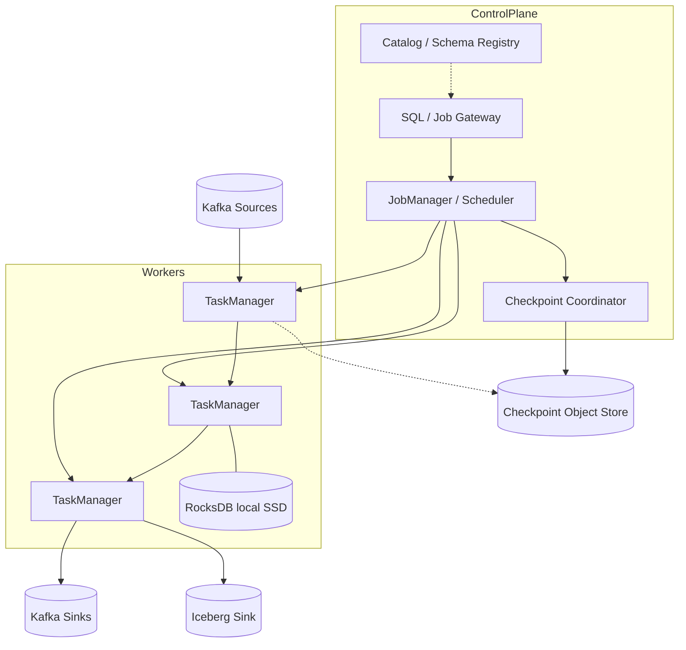
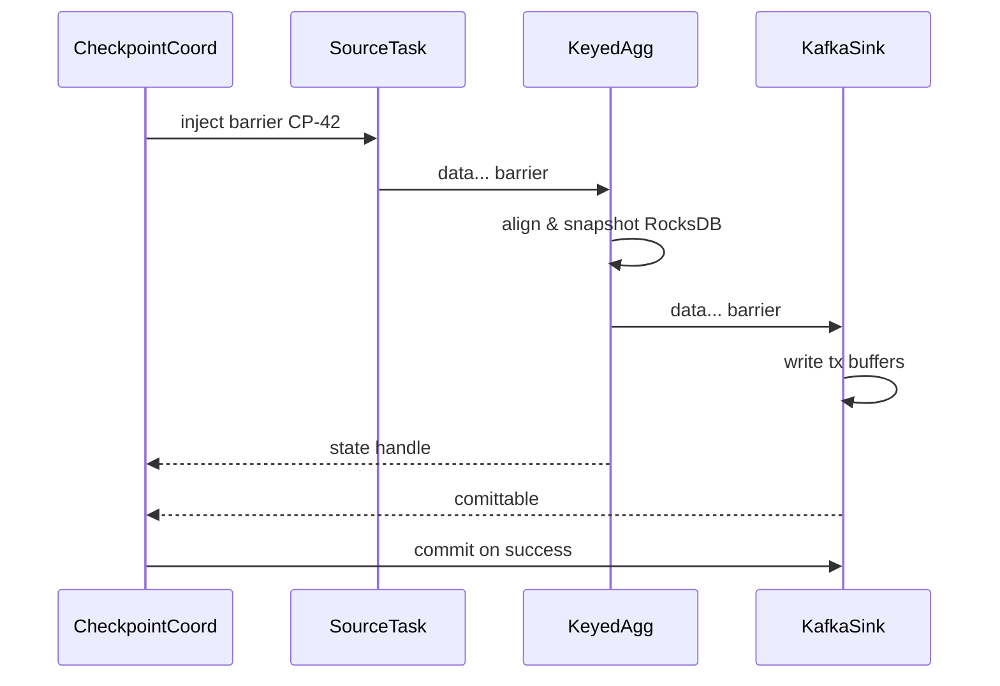
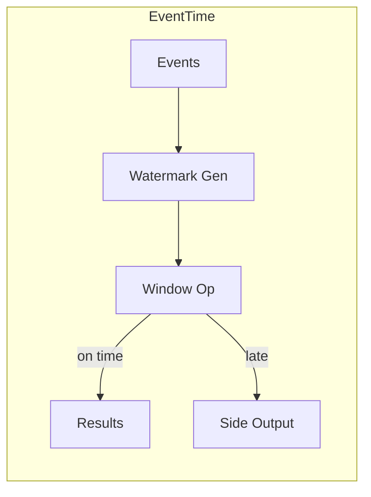

# System Design: Stream-Processing Engine

> **Focus areas:** Operators · Keyed state · Watermarks · Windows · Checkpoints · Exactly-once · Backpressure · Rebalance · Watermark skew · Kafka IO · Flink/Spark Structured Streaming mechanics  
> **Style:** End-to-end product design with progressive scale (10× → 100× → 1,000×)  
> **Quality bar:** Staff-level streaming engine design—not "just call Flink"; explain internals interviewers probe  
> **Interview theme:** Design a Flink-style stream-processing engine / platform for continuous jobs

---

## Table of Contents

1. [Clarify Requirements (Interview Q&A)](#1-clarify-requirements-interview-qa)
2. [Back-of-the-Envelope Estimation](#2-back-of-the-envelope-estimation)
3. [High-Level Design](#3-high-level-design)
4. [Architecture Diagram](#4-architecture-diagram)
5. [Design Deep Dive](#5-design-deep-dive)
6. [Wrap-Up](#6-wrap-up)
7. [Deeper / Related Interview Questions](#7-deeper--related-interview-questions)

---

## 1. Clarify Requirements (Interview Q&A)

Goal: design a **stream-processing engine** (and the platform around it) that continuously ingests events from logs like Kafka, applies transformations/aggregations with **event-time semantics**, maintains large keyed state, and sinks results with **exactly-once** (or well-defined) delivery—under failure, skew, and rebalance.

### 1.0 What this is / is not

| Dimension | This doc | Not this |
|-----------|----------|----------|
| Job | Continuous dataflow engine + job platform | Batch-only Spark warehouse ETL |
| Core | Operators, state, watermarks, checkpoints | Clickstream product UX |
| Consistency | EOS / at-least-once modes | Distributed OLTP transactions |
| Users | Data engineers writing jobs / SQL | End-user analytics UI |
| Scope | Engine mechanics + control plane | Re-implement Kafka |

### 1.1 Functional Requirements

| # | Question | Typical answer | Implication |
|---|----------|----------------|-------------|
| F1 | API? | DataStream + SQL/Table; UDFs | Logical plan → physical operators |
| F2 | Sources/sinks? | Kafka first-class; JDBC/S3/Iceberg | Pluggable connectors + EOS protocols |
| F3 | State? | Large keyed aggregations, joins | Local state store + changelog |
| F4 | Time? | Event time + processing time | Watermarks, idle sources, allowed lateness |
| F5 | Windows? | Tumbling, sliding, session | Window operators + triggers |
| F6 | EOS? | Yes for Kafka↔Kafka / Kafka↔Iceberg | Checkpoint barriers + transactional sinks |
| F7 | Multi-tenant platform? | Many jobs on shared clusters | Isolation, quotas, per-job HA |
| F8 | Elasticity? | Scale parallelism with lag | Rescale with state migration |
| F9 | SQL? | Windowed aggregations, joins | Catalyst-like optimizer optional |
| F10 | Late data? | Side output + correction | Allowed lateness config |
| F11 | Replay? | Savepoints for migrate/version | Consistent snapshots |
| F12 | Observability? | Lag, watermark, state size, backpressure | First-class metrics |
| F13 | Languages? | JVM primary; Python UDF secondary | Process isolation for Py |
| F14 | CEP? | Nice-to-have | Pattern operators Phase 2 |

**MVP scope:**

1. Job submit (JAR/SQL) → schedule tasks on workers.  
2. Kafka source with consumer groups / offsets in checkpoints.  
3. Map/filter/keyBy/aggregate + tumbling event-time windows.  
4. RocksDB keyed state + incremental checkpoints to durable storage.  
5. Exactly-once sink to Kafka (transactions) and at-least-once to others.  
6. Savepoints; restart from checkpoint on failure.  
7. Metrics: watermark, lag, checkpoint duration, backpressure.

**Out of MVP:** full dynamic SQL catalog product, automatic multi-region active-active jobs, GPU operators, perfect autoscaling without savepoint.

### 1.2 Non-Functional Requirements

| # | NFR | Target |
|---|-----|--------|
| N1 | End-to-end latency | Seconds typical; sub-second for simple maps |
| N2 | Checkpoint interval | 10s–1m configurable; p99 duration << interval |
| N3 | Recovery RPO | ≈ checkpoint interval |
| N4 | Availability | Job HA with standby JM; task failover |
| N5 | State size | 100GB–10TB+/job via local SSD + incremental CP |
| N6 | Throughput | Millions events/s/job with enough parallelism |
| N7 | Isolation | Noisy job cannot OOOM whole cluster unchecked |
| N8 | Correctness mode | Explicit: AT_LEAST_ONCE vs EXACTLY_ONCE |

### 1.3 Cases

**Happy**

1. Kafka → keyBy user → 5m tumbling count → Kafka sink; watermarks advance; checkpoints succeed.  
2. Worker dies → restore from checkpoint → resume; no double-count in EOS mode.  
3. Late event within lateness updates window; after lateness → side output.  
4. Savepoint → upgrade job version → restart compatible state.  
5. Skewed key detected → salting / split aggregates.

**Edges**

| Case | Behavior |
|------|----------|
| Idle Kafka partition | Watermark idleness / source idle timeout |
| Checkpoint timeout | Fail CP; eventually fail job if persistent |
| State too large for disk | Backpressure / OOM kill; alert; increase SSD |
| Non-deterministic UDF | Breaks EOS replay semantics—ban or isolate |
| Schema change mid-job | Compatible evolution or dual-topic migration |
| Out-of-order burst | Buffer until watermark; memory pressure |
| Sink unavailable | Backpressure to sources; don't silently ACK |
| Clock skew producers | Bounded out-of-orderness heuristic |
| Join two streams unequal rates | State retention TTL; rowtime alignment |
| Exactly-once + non-tx sink | Document downgrade to ALS |

### 1.4 Scales

| Metric | Baseline | 10× | 100× | 1,000× |
|--------|----------|-----|------|--------|
| Events / s (fleet) | 1M | 10M | 100M | 1B |
| Concurrent jobs | 50 | 500 | 5K | 50K |
| Max state / job | 100 GB | 1 TB | 10 TB | 100 TB (sharded) |
| Parallelism / job | 128 | 512 | 2K | 10K |
| Checkpoint storage / day | 5 TB | 50 TB | 500 TB | multi-PB |
| Workers | 50 | 500 | 5K | 50K cells |
| Watermark skew | seconds | tens of s | minutes | need idle & heuristics |

**Jumps:** 10× = shared platform + RocksDB tuning; 100× = cell clusters + incremental CP + reactive rescale; 1,000× = federated control planes, per-tenant clusters, state backend tiering.

### 1.5 Etc.

- Model after **Flink** mechanics (barriers, aligned/unaligned checkpoints) while staying design-general.  
- Kafka is the default log.  
- Users accept event-time complexity when correctness matters.

**Scope repeat-back:**

> Design a Flink-style stream processor: operator graph, keyed state, event-time watermarks/windows, checkpointed exactly-once IO to Kafka, savepoints, and a multi-tenant platform—scaling from ~1M events/s to cell-federated 1,000×.

---

## 2. Back-of-the-Envelope Estimation

### 2.1 Throughput

```text
Baseline fleet 1M events/s × 500 B = 500 MB/s in
With shuffle (keyBy) network amp ~1–2×
CPU: simple map ~50–200K events/s/core → need tens–hundreds cores
```

### 2.2 State & checkpoints

```text
Job state 500 GB RocksDB
Incremental CP delta 1–5% / interval → 5–25 GB every 30s
Upload bandwidth must sustain deltas; CP timeout if object store slow
```

### 2.3 Watermark delay vs memory

```text
Allowed out-of-orderness 5 min × 1M events/s × 200 B buffered ≈ 60 GB
→ Bound OO, use per-key windows, or drop/side-output earlier
```

### 2.4 Recovery time (RTO)

```text
Download state 500 GB @ 1 GB/s aggregate ≈ 500s naive
→ Local retained SSD + incremental + region locality critical
```

### 2.5 Hot keys

```text
One key 5% traffic → one task hot
Mitigation: pre-aggregate salt buckets then merge
```

---

## 3. High-Level Design

### 3.1 Logical vs physical

```text
User program / SQL
  → Logical operators (scan, project, aggregate, join, sink)
  → Optimized plan
  → Physical tasks chained into JobGraph
  → Scheduled onto TaskManagers / workers with slots
```

### 3.2 Control plane vs data plane

| Plane | Components |
|-------|------------|
| Control | JobManager / dispatcher, scheduler, checkpoint coordinator, REST/SQL gateway |
| Data | TaskManagers running operators; local state; network shuffle |

**Deal-breaker:** putting large state only in JM heap—doesn't scale. State lives with tasks.

### 3.3 Operator types

| Operator | State | Notes |
|----------|-------|-------|
| Source | offsets | Watermark generator |
| Map/Filter | none | Chainable |
| KeyBy / Partition | shuffle | Network buffers |
| Aggregate / Reduce | keyed | RocksDB |
| Window | keyed window | Triggers + lateness |
| Join | both sides | Retention TTL |
| Sink | transactions / idempotency | EOS protocol |

Chaining reduces serialization for operators with same parallelism.

### 3.4 Event time & watermarks

```text
Watermark(t) means "unlikely to see event_time < t hereafter"
Window [5:00,5:05) closes when WM >= 5:05 (+ lateness)
```

**Strategies**

- Periodic watermark from max observed event time − bounded_OO.  
- Punctuated watermarks from special markers.  
- Idle source: advance WM if partition silent.  
- Watermark alignment across skewed partitions (optional) to reduce straggler holding everyone.

### 3.5 Windows

| Type | Definition |
|------|------------|
| Tumbling | Fixed non-overlap |
| Sliding | Fixed slide |
| Session | Gap of inactivity |
| Global | Rare; careful |

Triggers: on watermark, early firings (processing-time), count. Accumulating vs retracting sinks for updating results.

### 3.6 State backends

| Backend | Use |
|---------|-----|
| Heap | Tiny state demos—avoid prod |
| RocksDB | Large keyed state; incremental CP |
| Remote tiered | Phase 2 for huge cold keys |

State primitives: `ValueState`, `ListState`, `MapState`, `AggregatingState`, timers (event/processing).

### 3.7 Checkpointing & exactly-once

**Barrier alignment (classic):**

```text
Coordinator injects checkpoint barrier at sources
Barriers flow with data; operator aligns inputs
Snapshot state when all barriers arrived
Ack to coordinator; complete when all tasks + sinks ready
```

**Unaligned checkpoints:** snapshot in-flight buffers to reduce backpressure stalls—trade storage complexity.

**Kafka EOS sink:**

1. Begin Kafka transaction on checkpoint.  
2. Write records; store offsets in state.  
3. On CP success, commit transaction; on abort, rollback.  
4. Idempotent producer fencing via transactional.id.

**Iceberg/Delta EOS:** stage files → commit metadata atomically with CP ID.

### 3.8 At-least-once vs exactly-once tradeoff

| Mode | Latency | Complexity | Dupes |
|------|---------|------------|-------|
| ALS | Lower | Simpler | Possible |
| EOS | Higher (tx + align) | High | No (for supporting sinks) |

Interview answer: **EOS is end-to-end only if source + sink protocols cooperate**; processing can still be deterministic.

### 3.9 APIs for the platform

| API | Purpose |
|-----|---------|
| `POST /jobs` | Submit JAR/SQL |
| `POST /jobs/{id}/savepoint` | Controlled snapshot |
| `POST /jobs/{id}/rescale` | Change parallelism |
| `GET /jobs/{id}/metrics` | Watermark, lag, CP |
| Catalog | Tables, connectors, schemas |

---

## 4. Architecture Diagram







---

## 5. Design Deep Dive

### 5.1 Reliability

**Failure model**

- Task crash → reschedule → restore state from last successful CP → replay source from CP offsets.  
- JM crash → HA standby takes over with job metadata in ZooKeeper/etcd/K8s.  
- Partial CP failure → discard CP; continue; alert if streak fails.

**Idempotency / EOS**

- Deterministic operators preferred.  
- Sink transactional commit tied to CP.  
- External non-tx systems: use idempotency keys / MERGE.

**Retries**

- Network shuffle retries; producer retries inside EOS fencing rules.  
- UDF exceptions: fail task (restart) vs side-output poison—configurable.

**Backpressure**

- Credit-based network flow control (Flink-style).  
- Slow sink → upstream buffers fill → sources pause.  
- Metrics: `backpressure_ratio` per subtask.  
- Unaligned CP reduces checkpoint-induced stalls.

**Rate limits**

- Platform quotas on records/s, CPU, state size.  
- Kafka source rate limiters for catch-up storms after downtime.

### 5.2 Scalability

**Parallelism**

- Key space hash-partitioned into N slots.  
- Max useful parallelism ≈ key cardinality / skew.  
- Sources: Kafka partitions ≥ parallelism or idle tasks.

**Rescaling**

- Savepoint → redistribute key groups → restart.  
- Reactive scaling on lag with cool-downs.

**State scaling**

- Local SSD NVMe per worker.  
- Incremental checkpoints; compaction of changelog.  
- TTL on join state to bound growth.

**Shuffle**

- Hash partition for keyBy; rebalance for maps; broadcast for dim tables small enough.  
- Large dim: use async IO / external store instead of broadcast OOM.

**Multi-tenancy**

| Approach | When |
|----------|------|
| Shared cluster slots | Baseline |
| Namespace quotas | 10× |
| Dedicated clusters per tier | 100×+ |
| Cells by region/team | 1,000× |

### 5.3 Maintainability

**Observability**

- Per-operator: records in/out, latency, watermark, state size, CP size/time.  
- End-to-end lag: `current_event_time_lag = wall_clock - watermark`.  
- Flame-friendly task CPU; RocksDB properties (block cache hit).

**Upgrades**

- Savepoint compatibility story for serializer versions.  
- Canary jobs; blue/green cluster.

**Schema evolution**

- Catalog + Schema Registry integration.  
- State serializer schema evolution (Avro) carefully tested.  
- Breaking: dual-write job or reprocess from Kafka retention.

**Ops**

- Auto-restart with backoff; dead-letter for poison.  
- Checkpoint storage lifecycle (retain last N).  
- Runbooks for WM stuck (idle partitions, bad OO config).

### 5.4 Watermark deep dive (interview favorite)

**Stuck watermark causes**

1. Idle partition without idle detection.  
2. Extremely late skewed producer.  
3. One subtask OOOM / blocked.  
4. Misconfigured max OO (too large).  

**Mitigations:** source idle timeouts; watermark alignment; alerting on WM lag SLO; per-partition WM metrics.

### 5.5 Window correctness example

```text
Tumbling 1 minute, OO=5s, lateness=2m
Event t=12:00:50 arrives at wall 12:01:10 → still in window
WM advances to 12:01:00 → window [12:00,12:01) closes for on-time
Event t=12:00:40 arrives at 12:02:30 → late update if < lateness else side output
```

### 5.6 Join patterns

| Join | Mechanics |
|------|-----------|
| Stream-stream interval | Buffer both with WM; emit when time bounds satisfied |
| Stream-dim | Async IO lookup with cache; or broadcast small dim |
| Temporal join | Versioned dim table by rowtime |

State TTL essential or memory unbounded.

### 5.7 Spark Structured Streaming contrast

| | Flink-style | Spark micro-batch |
|--|-------------|-------------------|
| Model | Continuous operators | Micro-batch trigger |
| Latency | Lower potential | Batch interval bound |
| State | Native keyed | RocksDB/HDFS checkpoints |
| EOS | Barriers + tx | Epochs + sink commit |
| Use | Complex event time | Lakehouse ETL streaming |

Interview: know both; pick based on latency/state complexity.

---

## 6. Wrap-Up

### Decisions

| Decision | Choice | Why |
|----------|--------|-----|
| Architecture | JM + TM workers | Separates control/data |
| State | RocksDB + incremental CP | Large state |
| Time | Event-time watermarks | Correct windows |
| EOS | CP barriers + tx sinks | End-to-end |
| Platform | Quotas + savepoints | Multi-job reality |
| Scale path | Cells / dedicated clusters | No infinite shared cluster |

### Phased rollout

1. Kafka→Kafka map/agg ALS.  
2. RocksDB + checkpoints + EOS Kafka.  
3. SQL/windows/lateness side outputs.  
4. Multi-tenant platform, rescale, Iceberg EOS.

### Punch lines

- **Watermarks are a completeness contract**, not a clock.  
- **EOS = coordinated snapshots + sink atomicity**, not magic.  
- **Skew and state TTL** kill more jobs than "QPS."

---

## 7. Deeper / Related Interview Questions

**Q1. What does a watermark guarantee?**  
A: A heuristic lower bound on future event times—probabilistic completeness, not absolute truth.

**Q2. Aligned vs unaligned checkpoints?**  
A: Aligned waits for barriers (simpler, can stall under backpressure); unaligned snapshots in-flight data (harder, faster under load).

**Q3. Why barriers flow with data?**  
A: Ensures consistent cut: all events before barrier included in CP state relative to each channel.

**Q4. How does Kafka transactional sink fence zombies?**  
A: `transactional.id` + producer epoch; old producer fenced on reclaim after restart.

**Q5. Can you EOS into Elasticsearch?**  
A: Not truly without idempotent IDs + ALS replay; no 2PC with ES. Prefer deterministic `_id`.

**Q6. Session windows vs tumbling for user activity?**  
A: Sessions capture variable activity gaps; tumbling better for fixed reporting periods.

**Q7. How to handle broadcast state updates?**  
A: Broadcast stream with versioned rules; each task updates local broadcast state; order carefully.

**Q8. Incremental checkpoint algorithm sketch?**  
A: Persist RocksDB compacted SST diffs / changelogs since last CP; materialize baseline periodically.

**Q9. Why is non-deterministic UDF dangerous?**  
A: Replay after failure yields different sink outputs → breaks EOS equivalence.

**Q10. Processing-time windows—when OK?**  
A: Dashboards approximate; never billing/funnels needing event-time truth.

**Q11. How do timers work with RocksDB?**  
A: Timer service stores timestamps; on WM/processing advance, fire callbacks; checkpointed.

**Q12. Max parallelism vs key groups?**  
A: Key groups fixed upper bound for rescale without full redistribute inventiveness; set high enough early.

**Q13. Backpressure vs dropping?**  
A: Prefer backpressure for correctness; drop only with explicit load-shed operators and metrics.

**Q14. Two-phase commit in sinks?**  
A: CP success = global decision to commit; sinks keep "pending commits" until coordinator confirms.

**Q15. Late data correction patterns?**  
A: Retract/upsert sinks; or nightly batch reconcile (lambda).

**Q16. Memory: network buffers vs RocksDB block cache?**  
A: Tune both; OOM often network buffer pileup under shuffle + large keys.

**Q17. Consistent hashing for keys?**  
A: Hash mod key-group count; remap on rescale via key-group ranges.

**Q18. How to test watermark logic?**  
A: Unit harness with scripted event times; assert firings; integration with out-of-order generator.

**Q19. Chaos: delay one Kafka partition?**  
A: WM stalls if min over partitions; idle timeout needed; alignment policies trade completeness vs latency.

**Q20. Exactly-once end-to-end from browser clickstream?**  
A: No—client at-least-once; engine can EOS from Kafka onward.

**Q21. State migration across serializer versions?**  
A: Savepoint + TypeSerializer upgrade path; dual-run; or rebuild state from source replay.

**Q22. CEP vs windows?**  
A: CEP pattern NFA over event sequences; heavier; use when order patterns matter beyond aggregates.

**Q23. SQL semantic: APPEND vs UPSERT sink?**  
A: Updating windows need upsert/retract changelog; append-only for final firings only.

**Q24. How does Spark EOS epoch differ?**  
A: Micro-batch epoch ID committed to sink atomically; similar idea, different runtime.

**Q25. Hot key mitigation algorithms?**  
A: Key salting; two-stage aggregation; split skewed keys to dedicated tasks.

**Q26. Checkpoint storage layout?**  
A: `_checkpoints/job_id/cp_id/{task_state_handles}` + metadata; retain policy.

**Q27. Multi-region streaming job?**  
A: Prefer regional jobs + merge; cross-region shuffle expensive and WM harder.

**Q28. Async I/O operator purpose?**  
A: Non-blocking external lookups with capacity; preserve order optionally with buffers.

**Q29. What SLOs for a streaming platform?**  
A: Checkpoint success rate, WM lag, restart time, EOS violation audits (dup/missing canaries).

**Q30. Staff: prove no double count after failover.**  
A: Canary keys with known rates; transactional sink read committed only; audit table of CP commits vs sink epochs.

---

### Appendix A — Operator chaining example

```text
KafkaSource (p=128)
  → JsonParse (chained)
  → Filter (chained)
  → KeyBy(user_id)  // shuffle
  → TumblingEventWindow(5m).aggregate(Count)
  → KafkaSink transactional
```

### Appendix B — Config knobs cheat sheet

| Knob | Typical | Risk if wrong |
|------|---------|---------------|
| checkpoint.interval | 30s | Too small: thrash; too large: RPO |
| max_out_of_orderness | 5–30s | Too small: late; too large: memory |
| allowed_lateness | 0–10m | Corrections vs cost |
| rocksdb.block.cache | GBs | Miss thrash |
| parallelism | = Kafka parts often | Idle tasks / underutilize |
| restart.backoff | seconds→minutes | Restart storms |

### Appendix C — Savepoint vs checkpoint

| | Checkpoint | Savepoint |
|--|------------|-----------|
| Trigger | Automatic periodic | User/ops |
| Purpose | Failure recovery | Upgrade/migrate/scale |
| Retention | Short | Until deleted |
| Format | Backend-specific optimize | Stable, portable-ish |

---

*End of stream-processing engine system design.*
