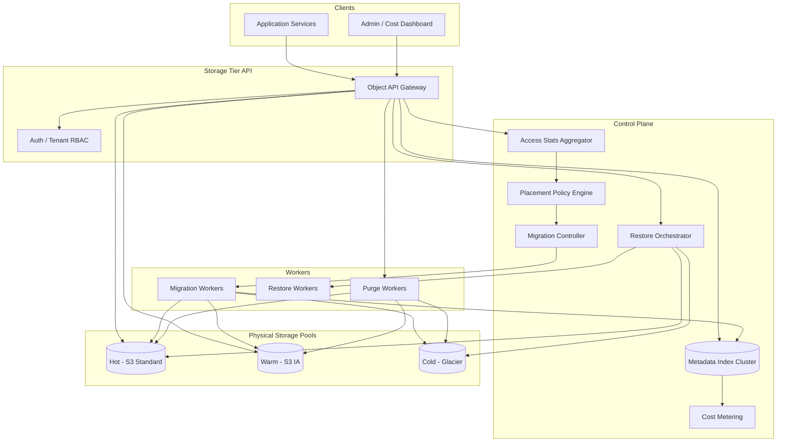

# System Design: Tiered Hot / Warm / Cold Data Storage

> **Focus areas:** Placement policies · Lifecycle migration · Retrieval SLAs · Cost vs latency trade-offs · Object metadata index · Rehydration orchestration  
> **Style:** Multi-tier storage platform with progressive scale (10× → 100× → 1,000×)  
> **API orientation:** Storage Tier API (`PUT /objects`, `GET /objects/{key}`, policy tags) + internal migration workers

---

## Table of Contents

1. [Clarify Requirements (Interview Q&A)](#1-clarify-requirements-interview-qa)
2. [Back-of-the-Envelope Estimation](#2-back-of-the-envelope-estimation)
3. [High-Level Design](#3-high-level-design)
4. [Architecture Diagram](#4-architecture-diagram)
5. [Design Deep Dive](#5-design-deep-dive)
6. [Wrap-Up](#6-wrap-up)
7. [Deeper / Related Interview Questions](#7-deeper--related-interview-questions)

---

## 1. Clarify Requirements (Interview Q&A)

The goal of this phase is to **bound the problem**: what we build, what we defer, and at what scale we must succeed.

### 1.0 What this is / is not

| This is | This is not |
|---------|-------------|
| A **storage tiering platform** that places objects across hot (SSD/NVMe), warm (HDD/IA), and cold (Glacier/archive) based on policy | A single S3 bucket with default Intelligent-Tiering only (no app-aware policies) |
| **Automatic lifecycle migration** driven by access patterns, age, legal class, and cost budgets | Manual ops moving files once a year |
| **Retrieval SLAs** per tier with explicit first-byte latency and restore time | "Cold is cheap" with no UX when user clicks restore |
| Unified **metadata index** so apps query by key without knowing physical tier | Apps hard-coded to three different storage backends |
| Cost attribution and placement explainability for finance/compliance | Opaque caching with no audit trail |

### 1.1 Functional Requirements

| # | Question to ask | Expected / typical interviewer answer | Design implication |
|---|-----------------|----------------------------------------|--------------------|
| F1 | What objects? | User uploads, logs, backups, ML datasets, media | Generic blob model + optional content-type hints |
| F2 | Object size range? | 4 KB – 5 GB common; occasional 100 GB+ | Multipart for large; small-object aggregation for cold |
| F3 | Hot tier definition? | p99 GET latency **< 50ms**; always online | NVMe/SSD regional object or block store |
| F4 | Warm tier? | p99 GET **< 500ms**; minutes OK for rare bulk | Standard HDD / Infrequent Access (IA) |
| F5 | Cold tier? | Retrieval **minutes–hours** acceptable; $/GB minimal | Glacier / Deep Archive / tape gateway |
| F6 | Placement triggers? | Last-access time, age, explicit tag, ML prediction, cost cap | Policy engine evaluates on write + periodic scan |
| F7 | Explicit tier pin? | Legal hold / premium user pins hot | Override automatic demotion |
| F8 | Retrieval API? | Uniform `GET /objects/{key}` hides tier; async for cold | Rehydration job + webhook/poll |
| F9 | Migration transparency? | App never changes URL/key during tier move | Metadata index maps key → current physical location |
| F10 | Durability? | 11 nines; no silent loss on tier change | Copy-then-delete; verify checksum |
| F11 | Multi-region? | Hot in user region; cold may be central cheaper region | Geo policy: data residency constraints |
| F12 | List/prefix browse? | Yes for buckets/prefixes | Index supports prefix listing from metadata DB |
| F13 | Versioning? | Optional object versions | Version id in metadata; tier per version |
| F14 | Delete / GDPR? | Propagate delete across tiers | Tombstone + async physical purge |
| F15 | Cost reporting? | Per-tenant GB-month by tier + retrieval egress | Metering pipeline |

**MVP functional scope (lock this with interviewer):**

1. Unified object API: put, get, head, delete, list prefix.
2. Three tiers: **Hot** (standard S3/SSD), **Warm** (S3 IA), **Cold** (Glacier Flexible).
3. Metadata index (key → tier, location, size, checksum, access_stats).
4. Placement policies: default age-based (0–30d hot, 30–180d warm, 180d+ cold) + tag overrides.
5. Background **migration workers** demote/promote objects; copy-verify-delete.
6. Cold retrieval: async restore with status API; temporary hot copy TTL 7 days.
7. Access tracking on GET (async update last_access_at).
8. Per-tenant quotas and cost dashboards.
9. Durability: checksum on migration; multipart ETag validation.

**Out of MVP (explicitly defer):**

- Custom erasure-coded cold pool (use cloud Glacier first)
- ML-based access prediction (start with age + last-access)
- Global CDN edge caching layer (optional Phase 2 for hot media)
- Block storage tiering for databases (focus object blobs)
- Cross-cloud tier federation

### 1.2 Non-Functional Requirements

| # | Question | Expected answer | Target |
|---|----------|-----------------|--------|
| N1 | Hot GET latency | Interactive apps | p50 **< 20ms**, p99 **< 50ms** (in-region) |
| N2 | Warm GET latency | Acceptable delay | p99 **< 500ms** |
| N3 | Cold first-byte | User notified async | Initiate restore **< 2s** API; data ready **3–12 hours** (tier dependent) |
| N4 | Migration throughput | Must keep up with ingest | Demote **≥ daily ingest volume** |
| N5 | Availability | Hot tier critical | 99.99% hot read path |
| N6 | Durability | No object loss on tier move | 11 nines; verify after copy |
| N7 | Consistency | Read-after-write for new puts | Strong for metadata; eventual for access stats |
| N8 | Cost savings goal | **40–70%** storage $ vs all-hot at baseline access mix | Measure via simulation |
| N9 | Security | Encryption, tenant isolation | SSE-KMS; prefix isolation |

### 1.3 Cases (Happy Paths & Edge / Failure)

**Happy paths**

1. PUT object → default hot → metadata indexed → app GET serves from hot.
2. Object untouched 60 days → policy demotes to warm → GET still works via same key (maybe +100ms).
3. Object 200 days old → cold tier → GET returns `202 Restoring` → worker restores → notify → GET succeeds from temporary hot copy.
4. User tags `tier=hot` on compliance doc → never demoted.
5. Tenant cost cap hit → aggressive demotion policy variant applied.

**Edge / failure cases**

| Case | Behavior |
|------|----------|
| GET during migration | Serve from source tier until copy verified; dual-read window |
| Migration fails mid-copy | Retry; leave object on source; alert |
| Cold restore expires before user GET | Re-restore on next GET (charge retrieval again) |
| Hot GET on object physically in cold (index stale) | Index is SoT—should not happen; repair scanner fixes |
| Small object flood to cold | Batch into packed archives (Phase 2); MVP: accept overhead |
| Concurrent PUT same key | Versioning; latest wins or MVCC |
| Legal hold | Block demotion and delete |
| Region residency violation | Policy rejects migrate-to-central-cold; keep warm in-region |
| Thundering herd restore same viral cold object | Coalesce restore requests; single physical restore |
| Delete during restore | Cancel restore; tombstone |
| Access tracking lag causes wrong demotion | Grace period + minimum hot residency 7 days |

### 1.4 Scales (Progressive)

| Metric | Baseline | 10× | 100× | 1,000× |
|--------|----------|-----|------|--------|
| Tenants | 200 | 2K | 20K | 200K |
| Total objects | 500M | 5B | 50B | 500B |
| Total bytes | 5 PB | 50 PB | 500 PB | 5 EB |
| Hot tier (% bytes) | 20% (1 PB) | 15% | 10% | 8% |
| Warm tier (% bytes) | 30% | 25% | 20% | 15% |
| Cold tier (% bytes) | 50% | 60% | 70% | 77% |
| PUT QPS (peak) | 5K | 50K | 500K | 5M |
| GET QPS (peak) | 50K | 500K | 5M | 50M |
| Migration objects/day | 5M | 50M | 500M | 5B |
| Metadata index rows | 500M | 5B | 50B | 500B |
| Cold restores/day | 10K | 100K | 1M | 10M |

**What each jump forces architecturally:**

- **10×:** Sharded metadata DB; migration worker fleet; access stat aggregation batching.
- **100×:** **Regional tier cells**; cold central pool; restore request coalescing; packed cold archives for tiny objects.
- **1,000×:** Hierarchical metadata (prefix aggregates); approximate access via sampling; erasure-coded private cold pool; CDN for hot read fanout.

### 1.5 Etc. (Constraints & Assumptions)

- **Cloud object storage** as tier backends (S3 Standard, S3 IA, Glacier Flexible/Deep).
- **Access pattern:** 80/20 — 80% reads on 20% objects (recent/hot).
- **Not building:** Custom HDD fleet management (use cloud IA/Glacier classes).
- **Compliance:** Some tenants require in-region cold only.

**Scope statement to repeat back:**

> Design a **tiered object storage platform** with hot/warm/cold placement policies, background migration, unified GET API with async cold rehydration, metadata index as SoT, and per-tenant cost/SLA controls—starting at **5 PB / 500M objects** and scaling to 1,000× while saving **40–70%** storage cost vs all-hot.

---

## 2. Back-of-the-Envelope Estimation

### 2.1 Storage cost comparison (illustrative $/GB-month)

| Tier | $/GB-month (order) | Relative |
|------|-------------------|----------|
| Hot (S3 Standard) | $0.023 | 1× |
| Warm (S3 IA) | $0.0125 | ~0.54× |
| Cold (Glacier Flexible) | $0.0036 | ~0.16× |
| Deep Archive | $0.00099 | ~0.04× |

```text
Baseline 5 PB all-hot:
  5e6 GB × $0.023 ≈ $115K/month

Tiered 20% hot / 30% warm / 50% cold:
  1 PB hot:  $23K
  1.5 PB warm: $18.75K
  2.5 PB cold: $9K
  Total ≈ $50.75K/month → ~56% savings

Retrieval + API costs can eat 5–15% of savings if cold GET abuse
```

### 2.2 Migration throughput

```text
Demote 5M objects/day baseline (1% of 500M catalog churn/day assumption)

Avg object 10 MB → 50 TB/day migration bytes
At 100 MB/s worker throughput:
  50 TB / (100 MB/s) ≈ 500,000 s ≈ 5.8 days with ONE worker
→ Need ~6+ parallel workers sustained; ~60 workers at peak 10× burst

Object-count bound for tiny objects:
  5M metadata ops/day ≈ 58 ops/sec (easy for DB)
```

### 2.3 Metadata index size

```text
Per object metadata ~1 KB (key, tier, loc, stats, checksum, tenant)
500M objects × 1 KB = 500 GB index baseline

1,000×: 500B objects × 1 KB = 500 TB metadata
→ Shard by tenant_id + key hash; hierarchical prefix summaries
```

### 2.4 GET QPS and hot cache

```text
50K peak GET QPS baseline
If 80% served from hot tier physically:
  40K QPS hot storage (S3 scales horizontally)

100×: 5M GET QPS → CDN + regional hot caches required for read-heavy
```

### 2.5 Cold restore volume

```text
10K restores/day × 10 MB avg = 100 TB/day rehydration read
Glacier retrieval $0.01/GB → $1K/day retrieval cost if poorly tiered

Design: minimize cold GET via good policy; coalesce restores
```

### 2.6 Access stat write amplification

Naive: 1 DB write per GET → 50K QPS (bad).

```text
Batch access updates:
  Aggregate in Redis per object_id minute bucket
  Flush to metadata DB every 60s
  50K QPS → ~500K keys/min if all unique → still heavy

Better: sample 1% GETs for access tracking + use age policy as primary
  → 500 QPS stat writes (manageable)
```

### 2.7 List prefix at scale

```text
List 1000 keys under prefix:
  Metadata DB index on (tenant, prefix, key)
  Not S3 LIST (too slow/expensive at 500B objects)
```

### 2.8 Egress bandwidth

```text
50K GET × 1 MB avg = 50 GB/s peak — unrealistic; long tail smaller

Realistic: 50K × 50 KB avg = 2.5 GB/s peak (20 Gbps)
10×: 25 GB/s → multi-region CDN
```

---

## 3. High-Level Design

### 3.1 Logical architecture

```text
                    ┌─────────────────────┐
                    │   Storage Tier API   │
                    │  PUT GET HEAD DELETE │
                    └──────────┬──────────┘
                               │
              ┌────────────────┼────────────────┐
              │                │                │
              v                v                v
      ┌──────────────┐  ┌─────────────┐  ┌──────────────┐
      │ Metadata     │  │ Placement   │  │ Access Stats │
      │ Index (SoT)  │  │ Policy Eng. │  │ Aggregator   │
      └──────┬───────┘  └──────┬──────┘  └──────────────┘
             │                 │
             │    ┌────────────▼────────────┐
             │    │   Migration Controller   │
             │    └────────────┬────────────┘
             │                 │
     ┌───────▼───────┬─────────▼─────────┬───────────────┐
     v               v                   v               v
┌─────────┐   ┌─────────────┐   ┌─────────────┐   ┌──────────────┐
│ Hot Pool│   │ Warm Pool   │   │ Cold Pool   │   │ Restore      │
│ Standard│   │ S3 IA       │   │ Glacier     │   │ Workers      │
│ SSD/NVMe│   │ Regional    │   │ Central opt │   │ (rehydrate)  │
└─────────┘   └─────────────┘   └─────────────┘   └──────────────┘
```

### 3.2 Object metadata model

```text
ObjectRecord {
  tenant_id, bucket, key, version_id
  tier: HOT | WARM | COLD | RESTORING | RESTORED_TEMP
  physical: { backend, region, uri, storage_class }
  size_bytes, checksum_sha256, content_type
  created_at, last_access_at, last_modified_at
  policy_tags: { legal_hold, pin_hot, residency=EU, ... }
  migration_state: idle | copying | verifying | deleting_source
  restore_expires_at  // for temporary hot copy after cold restore
}
```

**Key invariant:** Application always uses `(bucket, key[, version])`; never physical URI.

### 3.3 Placement policy engine

Policies evaluated on:

1. **PUT** (initial tier)
2. **Nightly batch scan** (demotion candidates)
3. **Access event** (promotion candidate)

**Default policy (example):**

```yaml
policies:
  - name: default_age_ladder
    rules:
      - if: age_days < 30 AND NOT policy_tags.pin_hot
        tier: HOT
      - if: age_days >= 30 AND age_days < 180 AND last_access_days > 7
        tier: WARM
      - if: age_days >= 180 AND last_access_days > 30
        tier: COLD
  - name: compliance_pin
    rules:
      - if: policy_tags.legal_hold OR policy_tags.pin_hot
        action: BLOCK_DEMOTION
  - name: eu_residency
    rules:
      - if: policy_tags.residency == EU
        cold_pool: eu-glacier-only
```

**Promotion on access:**

- Cold object GET → trigger restore (not full promote to hot permanently unless repeated access).
- Warm object with **3 GETs in 24h** → promote to hot (configurable).

### 3.4 API surface

| Method | Path | Behavior |
|--------|------|----------|
| PUT | `/v1/buckets/{b}/objects/{key}` | Write to hot; index metadata |
| GET | `/v1/buckets/{b}/objects/{key}` | Route by tier; cold → async |
| HEAD | `/v1/buckets/{b}/objects/{key}` | Metadata only |
| DELETE | `/v1/buckets/{b}/objects/{key}` | Tombstone; async purge all copies |
| GET | `/v1/buckets/{b}?prefix=` | List from metadata index |
| POST | `/v1/objects/{id}/restore` | Explicit cold restore |
| GET | `/v1/objects/{id}/restore-status` | Poll restore |
| PATCH | `/v1/objects/{id}/tags` | Set pin_hot, legal_hold |

**Cold GET flow (HTTP):**

```http
GET /v1/buckets/media/objects/video_2020.mp4

HTTP/1.1 202 Accepted
Retry-After: 3600
Content-Type: application/json

{
  "status": "restoring",
  "restore_job_id": "rjob_abc",
  "estimated_ready_at": "2026-08-06T18:00:00Z",
  "poll_url": "/v1/objects/obj_xyz/restore-status"
}
```

When ready:

```http
HTTP/1.1 302 Found
Location: https://signed-url.../temp-hot-copy
X-Tier-Restored-Until: 2026-08-13T00:00:00Z
```

### 3.5 Migration workflow

```text
Demotion HOT → WARM:
  1. migration_state = copying
  2. Server-side copy (S3 CopyObject) to warm pool + storage class IA
  3. Verify checksum / ETag
  4. Atomically update metadata tier + physical uri (CAS)
  5. Delete hot copy async
  6. migration_state = idle

Promotion WARM → HOT:
  Same pattern reverse direction

Demotion to COLD:
  Initiate Glacier transition OR copy to Glacier bucket
  Minimum size 128 KB for Glacier efficiency—small objects batch (Phase 2)
```

**Copy-then-delete** — never delete source until verify succeeds.

### 3.6 Retrieval SLAs by tier

| Tier | First-byte latency | Throughput | Restore initiation | Notes |
|------|-------------------|------------|-------------------|-------|
| Hot | p99 < 50ms | Full line rate | N/A | Standard regional |
| Warm | p99 < 500ms | High | N/A | IA min duration 30d penalty |
| Cold (Flexible) | Hours | After restore | API < 2s; data 3–5h std | Bulk retrieval cheaper |
| Deep Archive | 12–48h | After restore | API < 2s | Lowest $ |

**Temporary restored copy:** Keep in hot **7 days** (Glacier expedited pattern); then revert metadata to cold (lazy re-archive).

### 3.7 Cost model & tenant budgets

Metering dimensions:

- `gb_month_hot`, `gb_month_warm`, `gb_month_cold`
- `retrieval_gb`, `restore_requests`, `early_deletion_ia_penalty`
- `api_requests` (PUT/LIST/GET)

Budget action when tenant exceeds soft cap:

- Accelerate demotion policies
- Block new hot PUTs > quota (429)
- Notify tenant admin

### 3.8 Trade-off tables

#### Age-only vs access-driven tiering

| | Age-only | Access-driven |
|--|----------|---------------|
| Simplicity | High | Medium |
| Savings | Good for write-once | Better for re-read archives |
| Wrong tier risk | Recent but cold data rare | Needs stat infra |
| Interview pick | Start age; add access | |

#### Central cold vs regional cold

| | Central cold | Regional cold |
|--|--------------|---------------|
| Cost | Lower (one pool) | Higher |
| Residency | May violate GDPR | Compliant |
| Restore latency | Cross-region fetch | Local |
| Pick | Non-PII bulk | Regulated tenants |

#### Transparent vs explicit tier API

| | Transparent GET | Explicit tier in URL |
|--|-----------------|----------------------|
| App complexity | Low | High |
| SLA surprise | Cold 202 response | App knows |
| Pick | **Transparent** | |

### 3.9 Deal-breakers

- No metadata index → LIST/GET cannot find migrated objects.
- Delete source before verify → data loss.
- Cold restore without coalescing → cost explosion on viral object.
- No legal_hold demotion block → compliance failure.
- Per-GET synchronous metadata DB write → won't scale.

---

## 4. Architecture Diagram



---

## 5. Design Deep Dive

### 5.1 Reliability

#### 5.1.1 Durability during migration

- **Server-side copy** within same cloud (no download-upload).
- Post-copy `HeadObject` checksum vs source ETag.
- Metadata CAS: update tier only if `migration_state=copying` and version match.
- Failed migration → object stays on source tier; alert `migration_failure_total`.

#### 5.1.2 Idempotency

- PUT with `Idempotency-Key`: same key returns same `object_id`.
- Migration job idempotent on `(object_id, target_tier)`.
- Restore coalescing: multiple GETs → one `restore_job` per object.

#### 5.1.3 Retries & backpressure

| Queue | Backpressure |
|-------|--------------|
| Migration | Max in-flight bytes/worker; pause demotion if hot pool write pressure |
| Restore | Per-tenant daily restore budget |
| Metadata | Shed non-critical access stat updates |

#### 5.1.4 Split-brain physical copies

During migration dual-read window:

- GET checks metadata `physical` pointer (single primary).
- If `copying`, read from **source** until flip.

#### 5.1.5 Rate limits

- Cold restore: 100 concurrent restores/tenant default.
- LIST: paginate max 1000 keys; token-based.
- PUT: 10K QPS/tenant burst with token bucket.

### 5.2 Scalability

#### 5.2.1 Metadata sharding

```text
shard_id = hash(tenant_id, bucket) mod N
Each shard: Postgres/Cockroach or Dynamo partition
Secondary index: (tenant, prefix, key) for list
```

At 500B objects: **1M shards** unrealistic → hierarchical:

- Prefix aggregate nodes (`/media/2024/` summary)
- Object records only for non-archived prefixes

#### 5.2.2 Migration at billions of objects/day

- Priority queue: age > 365d first (biggest savings).
- Batch Glacier transitions (1000 objects/API where supported).
- **Packed archives** for objects < 128 KB (tar bundle per day/prefix).

#### 5.2.3 Hot read scaling

- Cloud front CDN for public/read-heavy buckets.
- Range GET support for video.
- Optional regional read replica of hot pool (CRR one-way).

#### 5.2.4 Parallelization

- Migration workers partition by `shard_id`.
- Restore workers parallel multipart download from Glacier.
- Policy scan: MapReduce over prefix aggregates.

#### 5.2.5 Scale-down (cost crunch)

- Emergency policy: demote warm→cold after 90d not 180d.
- Increase cold retrieval price to tenant (pass-through).

### 5.3 Maintainability

#### 5.3.1 Observability

| Metric | Use |
|--------|-----|
| `objects_by_tier` | Capacity planning |
| `migration_lag_days` | Policy effectiveness |
| `cold_restore_queue_depth` | User SLA risk |
| `cost_saved_estimate_usd` | Finance |
| `metadata_db_p99_latency` | GET path health |
| `wrong_tier_serve_total` | Should be 0 |

#### 5.3.2 Operability

- **Reconciliation scanner:** Compare metadata vs physical existence weekly sample 0.1%.
- **Tier override drill:** Mass restore for incident.
- Policy simulator: "what if demote after 60d?" on historical access logs.

#### 5.3.3 Multi-tenant

- Prefix isolation `tenant_id/bucket/...`
- No cross-tenant migration ever.
- Per-tenant policy templates.

#### 5.3.4 Migrations (platform upgrades)

- Dual-write metadata v1/v2 during schema change.
- Backend pool addition: register new warm region; migrate gradually.

#### 5.3.5 Testing

- Chaos: delete physical object; scanner detects and restores from replica.
- Load test GET while migration churn 1M objects/hour.

---

## 6. Wrap-Up

### Decision summary

| Area | Decision |
|------|----------|
| API | Unified object key; tier opaque to app |
| SoT | Metadata index, not storage LIST |
| Tiers | Hot Standard / Warm IA / Cold Glacier |
| Migration | Copy-verify-delete; server-side copy |
| Cold read | Async restore + temporary hot copy 7d |
| Policy | Age ladder MVP + access promotion + legal pins |
| Stats | Sampled access tracking + batch flush |
| Scale | Shard metadata by tenant; prefix aggregates at 100×+ |

### Phased rollout

1. **Phase 0:** Hot + metadata index + manual lifecycle rules on bucket.
2. **Phase 1:** Warm IA migration worker; policy engine age-based.
3. **Phase 2:** Cold Glacier + restore orchestrator; cost dashboard.
4. **Phase 3:** Access-driven promotion; packed small objects; CDN; regional residency policies.

### Cost vs SLA summary table

| Profile | Hot % | Warm % | Cold % | Est. savings vs all-hot | Cold GET UX |
|---------|-------|--------|--------|-------------------------|-------------|
| Media archive | 5 | 15 | 80 | ~70% | Rare; async OK |
| SaaS attachments | 25 | 35 | 40 | ~45% | Occasional restore |
| ML training data | 10 | 20 | 70 | ~65% | Batch prefetch |
| Compliance docs | 40 pin | 40 | 20 | ~25% | Low latency needed |

---

## 7. Deeper / Related Interview Questions

1. **Why not just S3 Intelligent-Tiering?**  
   App-aware tags, legal hold, uniform API across clouds, custom SLAs, cost attribution, restore coalescing—not fully provided by vendor auto-tier alone.

2. **Metadata DB vs S3 LIST as catalog?**  
   LIST is O(prefix) expensive and slow at billions; DB index is SoT with custom policies.

3. **Minimum object size for Glacier?**  
   AWS 128 KB billing minimum—batch small objects or accept waste.

4. **IA 30-day minimum charge on promote?**  
   Model early deletion fees in cost engine; avoid thrashing hot↔warm.

5. **How prevent migration thundering herd?**  
   Token bucket demotions/day; spread by hash(tenant, key) time slots.

6. **GET during demotion— which copy?**  
   Source until metadata flip confirmed; dual-read optional safety window.

7. **Viral cold object restored 1M times?**  
   Coalesce restore; keep one temp hot copy; CDN cache signed URL.

8. **Erasure coding vs replicated cold?**  
   EC cheaper at EB scale; cloud Glacier already EC under the hood.

9. **Consistent hashing for metadata shards?**  
   Shard tenant buckets across nodes; resharding when cluster grows.

10. **Write-once read-never workload?**  
    PUT directly to warm or cold via policy tag `archive=true`; skip hot entirely.

11. **GDPR delete across tiers?**  
    Tombstone metadata; purge workers delete all physical copies; verify absence.

12. **Compare to HDFS tiered storage?**  
    Similar policy concept; object storage uses vendor classes not datanode types.

13. **Database row tiering vs this design?**  
    DB tiering (Postgres tablespaces) is block/file level; this doc is object blob platform—often complementary.

14. **Cache aside vs read-through hot?**  
    Hot tier IS the cache for warm/cold; optional CDN is L1.

15. **Access stat sampling bias?**  
    1% sample underestimates frequent objects—combine with age policy and promote on actual GET (always record promote triggers synchronously).

16. **Multi-region hot active-active?**  
    CRRT hot copies expensive; single primary region hot + CDN edge for reads.

17. **Checksum algorithm?**  
    SHA-256 on migration; S3 ETag caveat for multipart (use checksum header).

18. **List performance at 500B keys?**  
    Never full scan; prefix aggregates + delimiter pagination tokens.

19. **Policy conflict resolution?**  
    Deny demotion (legal_hold) beats age rule; explicit pin_hot beats demotion.

20. **Cost cap hit mid-migration?**  
    Pause non-critical demotions; never pause in-progress copy-verify-delete.

21. **S3 Glacier Instant Retrieval?**  
    Middle tier between warm and cold ms latency but higher $—good for predictable occasional access.

22. **Tape gateway tier?**  
    Lowest $/GB; hours retrieval; enterprise archive flavor of cold.

23. **Automated promote ML?**  
    Predict access from ML logs; risky false cold—use as hint not sole signal.

24. **Tenant noisy neighbor on migration?**  
    Fair queue shares migration workers; cap per-tenant bytes/hour.

25. **Object versioning + tier?**  
    Each version independent tier; old versions demote faster.

26. **Signed URL vs proxy GET?**  
    Signed URL offloads bandwidth; proxy allows metering and cold 202 handling—hybrid.

27. **Hot key on metadata shard?**  
    Celebrity object metadata read heavy—cache ObjectRecord in Redis.

28. **Lifecycle vs active migration worker?**  
    S3 lifecycle rules cheap but inflexible; worker needed for access-based + verify + index sync.

29. **5 EB scale metadata?**  
    Hierarchical + aggregated; full ObjectRecord only for hot+warm; cold store minimal fields + bulk archive catalog.

30. **SLA breach on cold restore?**  
    Offer expedited retrieval tier at higher price; pass-through Glacier expedited API.

---

## Appendix A — Object Metadata Schema

```sql
CREATE TABLE objects (
  id              UUID PRIMARY KEY,
  tenant_id       UUID NOT NULL,
  bucket          TEXT NOT NULL,
  key             TEXT NOT NULL,
  version_id      TEXT NOT NULL DEFAULT 'null',
  tier            TEXT NOT NULL,
  migration_state TEXT NOT NULL DEFAULT 'idle',
  backend         TEXT NOT NULL,
  region          TEXT NOT NULL,
  physical_uri    TEXT NOT NULL,
  size_bytes      BIGINT NOT NULL,
  checksum        TEXT NOT NULL,
  created_at      TIMESTAMPTZ NOT NULL,
  last_access_at  TIMESTAMPTZ,
  policy_tags     JSONB NOT NULL DEFAULT '{}',
  restore_job_id  UUID,
  restore_expires_at TIMESTAMPTZ,
  UNIQUE (tenant_id, bucket, key, version_id)
);
CREATE INDEX objects_tenant_prefix
  ON objects (tenant_id, bucket, key text_pattern_ops);

CREATE TABLE migration_jobs (
  id            UUID PRIMARY KEY,
  object_id     UUID NOT NULL REFERENCES objects(id),
  from_tier     TEXT NOT NULL,
  to_tier       TEXT NOT NULL,
  status        TEXT NOT NULL,
  started_at    TIMESTAMPTZ,
  completed_at  TIMESTAMPTZ
);

CREATE TABLE restore_jobs (
  id            UUID PRIMARY KEY,
  object_id     UUID NOT NULL,
  tier          TEXT NOT NULL,
  status        TEXT NOT NULL, -- pending|in_progress|ready|expired|failed
  requested_at  TIMESTAMPTZ NOT NULL,
  ready_at      TIMESTAMPTZ,
  expires_at    TIMESTAMPTZ
);
```

## Appendix B — Example Policy DSL

```yaml
tenant: acme_corp
extends: default_age_ladder
overrides:
  - match: { prefix: "legal/" }
    pin_hot: true
  - match: { prefix: "logs/" }
    demote_warm_after_days: 14
    demote_cold_after_days: 90
budget:
  soft_cap_usd_month: 50000
  over_cap_action: accelerate_demotion
```

## Appendix C — Scale Checklist

| Scale | Must add |
|-------|----------|
| 1× | Metadata index, hot+warm+cold pools, age policy, copy-verify-delete |
| 10× | Sharded metadata, migration fleet, sampled access stats |
| 100× | Regional cells, restore coalescing, prefix aggregates, CDN |
| 1,000× | Hierarchical metadata, packed cold archives, EC private cold, policy simulator |

## Appendix D — Glossary

| Term | Meaning |
|------|---------|
| Rehydration | Restoring cold object to readable hot/warm |
| IA | Infrequent Access storage class |
| Demotion | Moving to colder tier |
| Promotion | Moving to hotter tier |
| SoT | Source of truth (metadata index) |
| CAS | Compare-and-swap metadata update |

---

*End of Tiered Hot/Warm/Cold Storage system design doc. Use section 1 as interview opening script; sections 3–5 as the whiteboard core; section 7 for grilling practice.*
