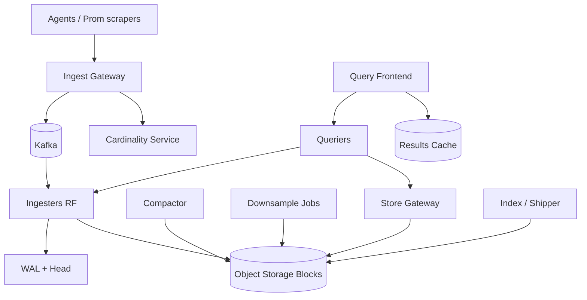
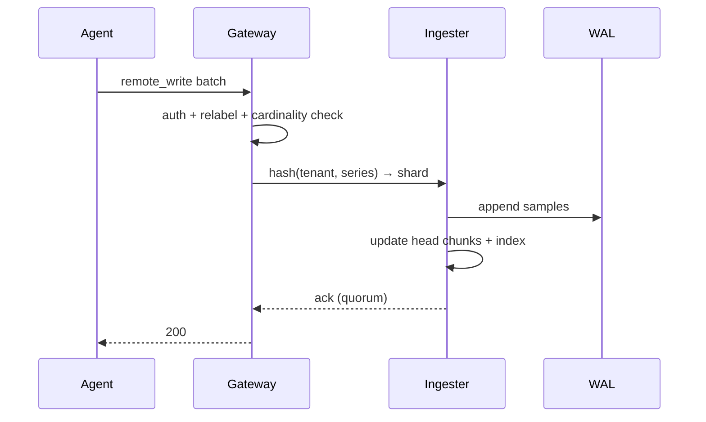

# System Design: Time-Series Database

> **Focus areas:** High-ingest writes · Tag indexes · Hot/warm/cold tiers · Compression · Downsampling · Retention · Query patterns (range, aggregate) · Cardinality explosion  
> **Style:** End-to-end product design with progressive scale (10× → 100× → 1,000×)  
> **Interview theme:** Prometheus / InfluxDB / Timescale / VictoriaMetrics / M3–style depth

---

## Table of Contents

1. [Clarify Requirements (Interview Q&A)](#1-clarify-requirements-interview-qa)
2. [Back-of-the-Envelope Estimation](#2-back-of-the-envelope-estimation)
3. [High-Level Design](#3-high-level-design)
4. [Architecture Diagram](#4-architecture-diagram)
5. [Design Deep Dive](#5-design-deep-dive)
6. [Wrap-Up](#6-wrap-up)
7. [Deeper / Related Interview Questions](#7-deeper--related-interview-questions)

---

## 1. Clarify Requirements (Interview Q&A)

Design a **time-series database (TSDB)** optimized for metrics/telemetry: enormous write rates, tagged series, efficient range scans and aggregations, retention/downsampling, and cardinality control.

### 1.0 What this is / is not

| This is | This is not |
|---------|-------------|
| Append-heavy TSDB for metrics/events with timestamps | General OLTP SQL database |
| Series identified by metric + labels/tags | Full log search engine (though logs may share pipelines) |
| Hot path ingest + rollups + retention | Lakehouse batch warehouse (complements it) |
| Query: range select, rate(), sum by (label) | Ad-hoc multi-join BI across wide dimensions |

### 1.1 Functional Requirements

| # | Question to ask | Expected / typical interviewer answer | Design implication |
|---|-----------------|----------------------------------------|--------------------|
| F1 | Data shape? | `(timestamp, series_id → value)` + labels | Inverted tag index + columnar samples |
| F2 | Write API? | Prometheus remote-write / custom gRPC | Batch ingest; backpressure |
| F3 | Query API? | PromQL-like or SQL-on-TS | Query engine over chunks |
| F4 | Cardinality? | Millions–billions of series; must bound | Limits, relabel, aggregation gateways |
| F5 | Retention? | Raw 15d; 5m 90d; 1h 1y | Tiered storage + downsampling |
| F6 | Resolution? | Scrapes 10–60s; some 1s | Chunk encoding by window |
| F7 | Exact vs approx? | Exact for raw; t-digest/HLL optional | Store type per metric |
| F8 | Out-of-order? | Limited window (minutes) | Buffer / separate OOO path |
| F9 | HA? | Replication factor 2–3 | Quorum or leader+followers |
| F10 | Multi-tenant? | Yes for SaaS observability | Tenant shard + quotas |
| F11 | Alerting? | Often separate; TSDB must query fast for rules | Rule evaluation fanout |
| F12 | Deletes? | Rare; retention TTL primary | Compaction drops old |
| F13 | Exemplars / histograms? | Native histograms Phase 1.5 | Complex encodings |
| F14 | Cold query? | Object storage OK for older data | Query fanout to cold with latency SLO |

**MVP functional scope:**

1. Ingest batched samples with labels; assign/create series IDs.
2. Persist append-only chunks in time-partitioned blocks.
3. Inverted index: label name/value → series IDs.
4. Query: select series by matcher; range aggregate (sum/avg/min/max/count); rate/increase.
5. Retention TTL on raw; simple fixed downsampling jobs.
6. Replication + basic failover.
7. Per-tenant series cardinality quotas.
8. Compression (delta-of-delta timestamps, XOR values — Gorilla-style).

**Out of MVP:**

- Infinite cardinality “just works”
- Full PromQL compatibility surface
- Infinite out-of-order rewrite history
- Cross-region active-active multi-writer without conflict story
- Replacing the warehouse for BI joins

### 1.2 Non-Functional Requirements

| # | Question | Expected answer | Target |
|---|----------|-----------------|--------|
| N1 | Ingest latency | Soft real-time | p99 durable ack &lt; 1s |
| N2 | Query latency | Dashboarding | p95 &lt; 1s for 1h×1K series; slower for huge fanout |
| N3 | Durability | No silent loss after ack | WAL + fsync policy declared |
| N4 | Availability | Ingest critical | 99.9%+ with RF |
| N5 | Compression | High | 10–30× typical for smooth metrics |
| N6 | Consistency | Read-after-write in window | Quorum / leader reads |
| N7 | Cost | Dominated by cardinality × retention | Downsample + cold tier |
| N8 | Multi-region | Home region + DR | Async block replication |

### 1.3 Cases

**Happy paths**

1. Agents push 10K series × 10s scrape → ingest → dashboard `sum by (service)`.
2. Nightly downsample raw → 5m blocks; drop raw past 15d.
3. Query 7d range hits warm local + cold object chunks.
4. Tenant hits series limit → reject new series with clear error; existing continue.

**Edge / failure cases**

| Case | Behavior |
|------|----------|
| Cardinality explosion (`user_id` label) | Quotas; drop/relabel at gateway; alert |
| Out-of-order beyond window | Reject or quarantine OOO store |
| Hot series (huge QPS one series) | Shard by time; buffer; rate limit |
| Query matching 10M series | Hard cap; require aggregation; cost gate |
| Ingest spike 10× | Kafka buffer; shed oldest / sample |
| Disk full | Stop writes; page; never corrupt index |
| Replica lag | Serve from leader; alert |
| Clock skew scrapers | Accept within skew bound; warn |
| Duplicate scrapes | Idempotent by `(series, ts)` last-write or dedup window |
| Label rename | New series IDs; optional recording rules bridge |

### 1.4 Scales (Progressive)

| Metric | Baseline | 10× | 100× | 1,000× |
|--------|----------|-----|------|--------|
| Active series | 10M | 100M | 1B | 10B |
| Samples / s ingest | 5M | 50M | 500M | 5B |
| Tenants | 100 | 1K | 10K | 100K |
| Query QPS | 200 | 2K | 20K | 200K |
| Raw retention | 15d | 15d | 15d | 15d |
| Disk raw (order) | ~50 TB | ~500 TB | ~5 PB | ~50 PB |
| Index entries | 50M | 500M | 5B | 50B |

**What each jump forces:**

- **10×:** Kafka (or equivalent) ingest buffer; horizontal ingesters; separate queriers; compaction fleet.
- **100×:** Shard by tenant + series hash; inverted index sharding; block storage in object store; query scatter-gather with budgets.
- **1,000×:** Hierarchical rollups mandatory; gateway aggregation; cell isolation; strict cardinality product controls; cold-only long retention.

### 1.5 Etc.

- Assume floating-point gauges/counters + labels strings.
- Scrapes may be pull (Prometheus) or push (agents); storage design similar after gateway.
- **Recording rules** materialize expensive queries — product essential at scale.
- Coordinate with metrics-aggregation/rollups design (companion doc).

**Scope statement:**

> Design a multi-tenant TSDB for metrics: high-ingest compressed chunks, tag inverted index, PromQL-like range queries, retention/downsampling tiers, and hard cardinality controls—from 10M to 10B active series.

---

## 2. Back-of-the-Envelope Estimation

### 2.1 Ingest rate

```text
Baseline: 10M series × scrape every 10s → 1M samples/s average
But many series quieter; peak bursts → design 5M samples/s

1,000×: 5B samples/s → impossible as one cluster; cells + aggregation at edge
```

### 2.2 Storage (Gorilla-ish)

```text
Naive: 16B timestamp + 8B value = 24B/sample
Compressed often ~1–3B/sample average for smooth series

5M samples/s × 2B × 86400 ≈ 864 GB/day compressed
× 15d ≈ 13 TB (+ index + replication × RF)
Order-of-magnitude: tens of TB baseline with RF=2 → ~30–50 TB
```

At 100× without downsampling → multi-PB — **rollups required**.

### 2.3 Index size

```text
Series metadata ~200B × 10M = 2 GB
Postings lists: label pairs → series
High-cardinality label values explode postings
100M series → tens–hundreds GB index → mmap / partitioned index
```

### 2.4 Query fanout

```text
Dashboard: 50 panels × 10 queries × 20 series = 10K series reads
Heavy: `count by (instance)` over 1M series → must use inverted index carefully + block merges
Budget max series per query (e.g. 100K) or require recording rules
```

### 2.5 Compaction IO

```text
Ingesters flush head blocks every 1–2h
Compactor merges levels → rewrite amplification 2–5× ingest bytes
Provision compaction IO separately from ingest disks
```

### 2.6 Hot keys

| Hotspot | Mitigation |
|---------|------------|
| `__name__=http_requests` huge | Shard series across ingesters by hash |
| Single tenant flood | Per-tenant token bucket |
| Popular label value matcher | Cache postings; shard postings |

---

## 3. High-Level Design

### 3.1 Data model

```text
SeriesKey = metric_name + sorted(label_k=v pairs)
SeriesID  = hash128(SeriesKey) or snowflake (stable)

Sample = (SeriesID, timestamp_ms, value)

Chunk / Block = time-bounded compressed column of samples for a series (or series stripe)
```

**Labels:** `job`, `instance`, `service`, `env`, … — avoid user IDs / request IDs.

### 3.2 Write path

```text
Agents → Load Balancer → Ingest Gateway (auth, tenant, relabel, cardinality)
  → Kafka topic (optional buffer)
  → Ingester (shard owner)
       → in-memory head (WAL)
       → flush immutable blocks to local disk / object store
  → Index updater (postings)
```

**Ack policy:** after WAL fsync on RF quorum (declare RPO if async replicas).

### 3.3 Read path

```text
Query Frontend (parse, auth, cache, split time range)
  → Querier(s)
       → resolve matchers via Index → SeriesIDs
       → fetch chunks overlapping [start, end] from ingesters (recent) + store (historical)
       → merge & evaluate PromQL-like ops
  → result cache (optional)
```

### 3.4 Storage layout

```text
/tenant={id}/blocks/{block_ulid}/
   meta.json          # time range, series count, stats
   index              # inverted index + series → chunk refs
   chunks/            # compressed segment files
   tombstones         # if any
```

**Time partitioning:** 2h blocks common (Prometheus TSDB style) or larger for object storage.

### 3.5 Compression (Gorilla / related)

| Stream | Technique |
|--------|-----------|
| Timestamps | Delta-of-delta varint |
| Float values | XOR with previous; store leading/trailing zero counts |
| Histograms | Native bucket deltas (later) |

### 3.6 Downsampling & retention

| Tier | Resolution | Retention | Store |
|------|------------|-----------|-------|
| Raw | scrape | 7–15d | Local SSD / fast object |
| L1 | 1–5 min | 90d | Object |
| L2 | 1 h | 1–2y | Cheap object |

Downsample aggregates: `sum/min/max/count` (and `sum_of_squares` if stddev needed). Counters need **increase-aware** downsample (not naive avg).

### 3.7 Option analysis

#### A. Architecture

| Option | Pros | Cons |
|--------|------|------|
| **Prometheus single-node** | Simple | Limited scale |
| **M3 / Thanos / Cortex / Mimir-like** | Horizontally scalable | Ops complexity |
| **Wide SQL (Timescale)** | SQL familiarity | Cardinality & compression trade-offs |
| **Druid/Pinot** | Rollup-native | Heavier for pure metrics |

**Choice:** Cortex/Mimir-style: gateways, ingesters, store-gateway, compactors, queriers — strong interview default for “TSDB at scale.”

#### B. Consistency

| Mode | Notes |
|------|-------|
| Leader per shard | Simple reads |
| Quorum write / read | HA |
| Eventual across regions | DR |

#### C. Index

| Structure | Use |
|-----------|-----|
| Inverted postings (Roaring bitmaps) | Label matchers |
| Forward index SeriesID → labels | Negation / returns |
| TSSS / trie on label names | Memory |

### 3.8 Progressive scale

- **Baseline:** Gateway + ingester StatefulSet + shared object store + querier; RF=2.
- **10×:** Kafka; query frontend cache; shuffle sharding queriers; stricter cardinality defaults.
- **100×:** Cell per region/tenant-group; store-gateway cache; hierarchical rollups; recording rules platform.
- **1,000×:** Edge aggregation; per-cell hard isolation; cold query pools; federated query with budgets.

---

## 4. Architecture Diagram

### 4.1 Mimir/Cortex-style TSDB



### 4.2 Write sequence



### 4.3 Query split

```text
Query [now-7d, now]
  ├─ recent 0–3h → ingesters (fanout to shard owners)
  └─ older → store-gateway (index + chunks from object storage)
Merge chronologically → evaluate rate()/sum()
```

---

## 5. Design Deep Dive

### 5.1 Reliability

#### 5.1.1 Invariants

1. **Ack ⇒ durable** per declared fsync/quorum policy.
2. **Series identity stable** for same label set.
3. **Block immutability** after flush; compaction creates new blocks.
4. **Query cost caps** — no unbounded series explosion.
5. **Tenant isolation** on all paths.

#### 5.1.2 Data loss scenarios

| Risk | Mitigation |
|------|------------|
| Ingester crash | Replay WAL; RF replicas |
| Kafka drain lag | Monitor; scale ingesters |
| Compaction bug | Keep inputs until verify; versioned compactors |
| Partial block upload | Upload then commit meta; readers ignore incomplete |
| Clock jump | Reject far-future samples |

#### 5.1.3 Out-of-order & duplicates

- Accept OOO within e.g. 10m–1h in head.
- Beyond window: reject or dedicated OOO rewrites (expensive).
- Dedup: same `(series, ts)` → last write wins; scrape retries OK.

#### 5.1.4 Backpressure

Gateway returns `429` when Kafka lag or ingester queue high. Prefer shedding new series creation before dropping samples of existing series (policy choice — state it).

#### 5.1.5 Idempotency

Batches may retry; storage dedups by timestamp. Gateways may use request hashes for short TTL dedup.

### 5.2 Scalability

#### 5.2.1 Sharding

```text
shard = hash(tenant_id, series_id) % N
```

Query matchers that don’t include series need **scatter** to all shards or global index — inverted index must be sharded carefully:

- **Option A:** Index per ingester/block; querier merges postings.
- **Option B:** Global index service (harder).

Interview default: **per-block index + querier fanout** with shuffle sharding.

#### 5.2.2 Cardinality control (most important product lever)

| Control | Where |
|---------|-------|
| Max series / tenant | Gateway + ingester |
| Max series / metric | Gateway |
| Max label value length / count | Gateway |
| Relabel drop high-card labels | Gateway |
| Aggregation gateway (`sum without`) | Edge |
| Recording rules | Querier side materialization |

#### 5.2.3 Query scalability

- Split large time ranges into parallel subqueries.
- Results cache keyed by `(tenant, query, step, time bucket)`.
- Limit max parallel chunk fetches.
- Prefer downsampled tiers when step large (`step=5m` → L1).

#### 5.2.4 Compaction & downsample

Leveled compaction of blocks; downsample creates coarser blocks. Schedule off peak; isolate IO.

#### 5.2.5 Multi-region

| Plane | Mode |
|-------|------|
| Ingest | Regional cells |
| Query | Prefer local; federate optional |
| DR | Async block replicate |

### 5.3 Maintainability

#### 5.3.1 Observability of the TSDB itself

Ingest samples/s, WAL lag, head series, compaction backlog, query series touched, cache hit, per-tenant series count. Avoid metrics about each series (meta-cardinality!).

#### 5.3.2 Operability

- Tenant block explorer.
- Series churn dashboards (created/destroyed per hour).
- “Top metrics by series count” killer feature for support.

#### 5.3.3 Schema / encoding evolution

Version chunk encodings; readers support N,N-1; compactors rewrite to new.

#### 5.3.4 Migrations

Re-shard by doubling N with dual-write or block rewrite jobs; prefer consistent hashing virtual nodes.

#### 5.3.5 Security

Per-tenant auth tokens; encrypt blocks at rest; query ACL; PII in labels discouraged + scanners.

---

## 6. Wrap-Up

### 6.1 What we designed

A **Cortex/Mimir-like TSDB**: gateway cardinality controls, sharded ingesters with WAL, immutable compressed blocks in object storage, inverted indexes, queriers spanning hot/cold, compactors/downsamplers, and multi-tenant quotas—scaled via cells and hierarchical rollups.

### 6.2 Key decisions

1. **Series + chunks + inverted index** as core model.  
2. **Gorilla-style compression.**  
3. **Cardinality limits at the door.**  
4. **Immutable blocks + compaction.**  
5. **Tiered retention / downsampling.**  
6. **Query cost gates & recording rules.**  
7. **Shuffle-sharded queriers.**  
8. **Regional cells at 100×+.**

### 6.3 Risks

| Risk | Follow-up |
|------|-----------|
| Label discipline failure | Product UX + defaults + education |
| Compaction debt | SLO + auto-shed ingest |
| Cold query latency | Async query / pre-agg |
| Alerting query storms | Dedicated ruler path + recording rules |
| Cross-tenant noisy neighbor | Cells / fair queues |

### 6.4 45-minute arc

1. Model + cardinality rant (8 min)  
2. Numbers: samples/s, bytes/day (4 min)  
3. Write path + blocks (10 min)  
4. Query + index (8 min)  
5. Tiers / scale (6 min)  
6. Traps (remainder)

---

## 7. Deeper / Related Interview Questions

### 7.1 Cardinality

**Q: Why is `user_id` as a label fatal?**  
A: Each user creates a series; 10M users × metrics → index+storage explosion; queries fan out. Put user_id in logs/events/traces instead, or aggregate.

**Q: Soft vs hard limits?**  
A: Soft alert; hard reject new series. Never unbounded “best effort” in SaaS.

**Q: Series churn (kubernetes pods)?**  
A: Short-lived series leave index residue until compaction; use recording rules aggregating away `pod` where possible.

### 7.2 Compression & encoding

**Q: Why delta-of-delta for timestamps?**  
A: Scrapes are near-regular; second differences near zero → few bits.

**Q: XOR float encoding failure cases?**  
A: Highly random values compress poorly — still OK; counters/gauges smooth compress well.

**Q: Store integers separately?**  
A: Optional; floats dominate Prometheus ecosystem.

### 7.3 Queries

**Q: How does `rate()` work?**  
A: Select raw counter samples; compute per-series increase extrapolated over range; then aggregate. Needs enough samples; counters resets handled.

**Q: Range vs instant vectors?**  
A: Instant = single eval timestamp; range = matrix over `[range]`. Engine must batch chunk reads efficiently.

**Q: Why recording rules?**  
A: Precompute expensive `sum by` across huge fanout; dashboards/alerts read cheap series.

### 7.4 Storage & compaction

**Q: Why immutable blocks?**  
A: Simple replication, caching, compaction, and object storage friendliness.

**Q: Tombstones?**  
A: Rare deletes (admin) mark ranges; compaction drops.

**Q: Block size trade-off?**  
A: Small = faster compactor cycles / more objects; large = fewer index files / heavier compaction.

### 7.5 Ingest

**Q: Kafka in front — always?**  
A: Great for bursts & fanout; adds lag. MVP can ingest direct to ingesters; add Kafka at 10×.

**Q: Exactly-once remote write?**  
A: At-least-once + dedup by timestamp; exactly-once rarely needed for metrics.

**Q: Pull vs push?**  
A: Pull (Prom) simplifies agent discovery; push scales SaaS multi-tenant easier. Gateway unifies.

### 7.6 Indexing

**Q: How are negative matchers implemented?**  
A: Postings for all series for metric minus postings for excluded values — expensive; roaring helps.

**Q: Regex matchers?**  
A: Expand via label value index carefully; bound worst case.

**Q: Roaring bitmaps?**  
A: Compressed integer sets for postings intersections/unions — industry standard.

### 7.7 HA & consistency

**Q: RF=3 always query all?**  
A: Prefer quorum or primary; reading all increases load — use replication for durability, not 3× query by default.

**Q: Split brain ingesters?**  
A: Membership via hash ring with heartbeats; tokens; avoid dual writers with epoch fencing.

### 7.8 Multi-tenant SaaS

**Q: Noisy neighbor queries?**  
A: Per-tenant query slots, max series, max chunks/sec; separate query pools for paid tiers.

**Q: Cross-tenant data leak?**  
A: Tenant ID in every block path + authz; continuous tests.

### 7.9 Algorithms

**Q: Hash ring for ingesters?**  
A: Consistent hashing / dynring; virtual nodes; reshuffle minimization.

**Q: Merge iterator of chunks?**  
A: Min-heap by timestamp across series/chunks for aggregations.

**Q: Downsample of counters?**  
A: Store raw counter or precomputed increase buckets carefully — naive mean of counter is wrong.

### 7.10 Failure injection

1. Kill ingester → WAL replay + replica.  
2. Object store outage → ingest may continue to local until full; queries to cold fail.  
3. Cardinality attack → gateway rejects.  
4. Query of death → cost gate cancel.  
5. Compactor runaway rewrite → IO throttle + prioritization.

### 7.11 Comparisons

**Q: TSDB vs columnar warehouse?**  
A: TSDB: extreme ingest + tag series + retention. Warehouse: complex SQL joins, larger scans, less scrape-oriented.

**Q: TSDB vs log system?**  
A: Logs high-cardinality text; different compression/index (inverted terms). Don’t force logs into metrics labels.

**Q: Prometheus vs Mimir?**  
A: Prometheus = great single-node scraper+TSDB; Mimir = multi-tenant durable scale-out of the storage/query plane.

---

*End of design doc. Use section 1 as interview opening script; sections 3–5 as the whiteboard core; section 7 for grilling practice.*
